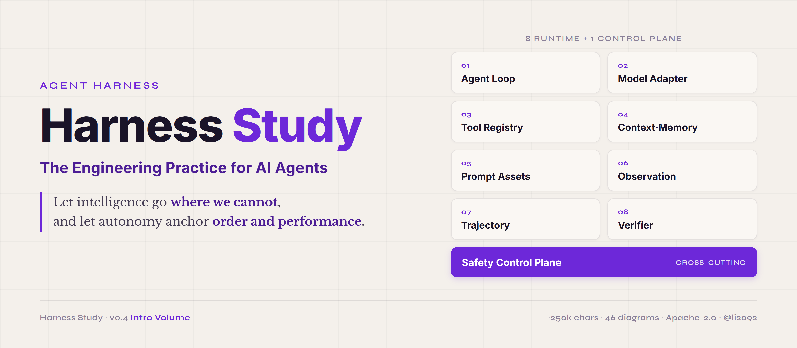
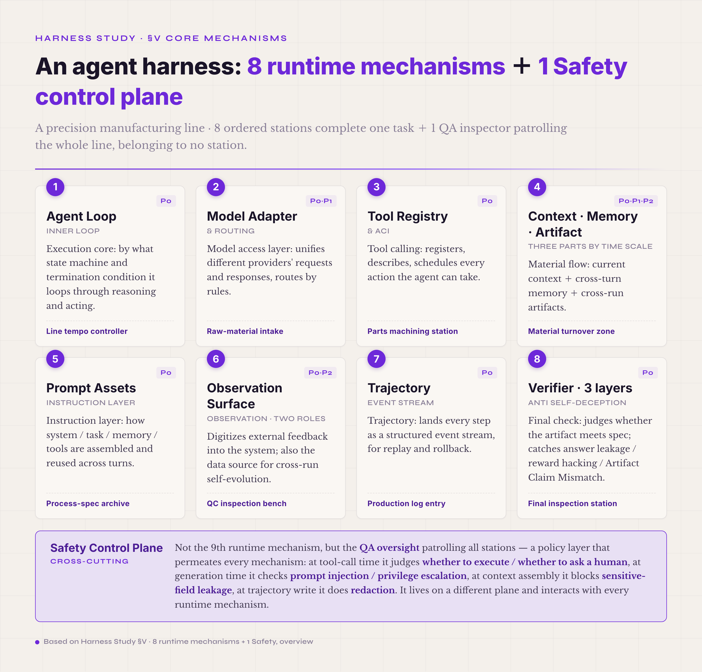

  

# Harness Study · The Engineering Practice for AI Agents

  <strong>Let intelligence go where we cannot, and let autonomy anchor order and performance.</strong>

  
  
  
  
  
  
  

---

> Agent Harness engineering is, in essence, the management science of the digital world.
>
> It widens the capability frontier of large models and empowers individuals and organizations alike. It carries governance into domains beyond human reach, and works ceaselessly to drive down the entropy of the system.
>
> It answers the individual's every tailored need, so that every digital unit runs autonomously, efficiently, and responsibly within clearly defined bounds.
>
> Such a Harness is no mere intelligent tool; it is a governance framework in which capability and restraint hold as one.

---

## 1. What This Project Is For

In December 2025 I started trying to build a harness with Claude Code — back then the word didn't exist yet, and I called whatever I was making "an agent-driven balabala product." My first one was Cyber-Mantic: I gave an LLM tools so it could compute the results of various Chinese metaphysics systems accurately and reason over them, and for the agent runtime I simply bolted OpenCode straight in. The project fell short of what I'd hoped, but it sent one very strong signal — once an LLM is given stronger tool-calling, pairing it with an agent runtime is going to be one of the most important kinds of AI tooling for the next few years. So I set out to build agents from scratch, without leaning on any existing framework, and to try every shape the thing could possibly take. For the better part of four months I did this in the hours after my kid was asleep, cheerfully stepping on every harness landmine there was, vibe-coding into the small hours.

After a post of mine on Xiaohongshu (RED) caught a little traction, I began swapping harness notes with a lot of other builders, and found that some of the small tricks I'd accumulated were genuinely useful to them — which is where the idea of writing a systematic tutorial came from. Along the way some of those friends landed internship offers, some caught the startup bug, and the most driven of the lot has already started building a product and raised his first round of funding. I wasn't idle either: I shipped several enterprise vertical-domain agent products of my own, which let me validate my understanding of harnesses from many angles. Light on academia, heavy on engineering.

My hope is that Harness Study helps people understand what a harness is more systematically and more deeply — and that an AI coding tool, handed this tutorial, can turn a user's description of what they need into an agent product that is good enough to use. I also hope it can push along the work of translating *harness* into Chinese: only once every detail of the harness is defined more precisely and more uniformly will more people grasp the concept, and only then can it gradually prove its worth across one industry after another.

Next, I will:
- keep proofreading the Introduction;
- flesh out the engineering detail of Harness · Lab;
- put both Harness Study and Harness · Lab into practice by building an agent purpose-built for DeepSeek V4;
- and distill that engineering process into the expansion chapters of Harness Study.

There. The loop is closed.

## Over to Claude Code to Introduce Harness Study

Most existing material on agents stops at how to build one that runs — pick a framework, write a prompt, add a few tools, run a demo. That layer is well covered online.

Put an agent to work on B2B tasks such as office work, contract review, or business-process approvals, run it again and again, and a different class of problem appears: the same prompt gives different results at different times; the headline pass rate looks high but users report inconsistent behavior in practice; given a document to consult, the agent still fabricates details that are not in it and then declares the task complete; changing nothing but the way a single tool call is written causes the whole main line to stop converging.

In most of these cases, the cause is not in the prompt. Past a certain point, further investment in prompt iteration yields rapidly diminishing returns. What actually determines whether an agent is stable is the layer around the model — in English, the **harness**. A harness is not LangChain or any particular SDK — those are frameworks. The harness is the whole structure you build on top of a framework for a particular task: how the model is connected, how tools are managed, how context accumulates, where artifacts land, what verification rests on, what safety rests on, and how failures are backstopped.

This project — Harness Study — exists to take that layer around the model as an engineering object in its own right and explain it systematically. **The project is organized into volumes.** Two are finished: the **Introductory Volume**, which walks the full skeleton once, and the **Architecture & Engineering volume** (vol. 2, Chinese), which assembles the runtime mechanisms into a semantically correct, interruptible, recoverable, verifiable runtime. **Vol. 3** (production engineering: once a single run is correct, how to keep a service reliable over the long term) is being written. Alongside them sits a **practice volume**, *Harness Field Notes* (Chinese), which cuts across the whole book and takes no number in the main sequence.

  

## 2. What Reading the Full Series Should Enable

For human readers:

- to build a complete mental model of an agent harness;
- to locate any agent engineering problem to a specific mechanism and a common misconception;
- to independently design and tune an agent harness.

For AI readers:

- any AI coding assistant that reads this project should be able to take a user's specific requirement or scenario and produce a deployable agent of reasonably high accuracy.
- the project also ships **Harness Prompts** you can feed directly to a coding AI ([`introduction.en/11-harness-prompt.md`](../introduction.en/11-harness-prompt.md), the full executable spec, plus [`introduction.en/12-harness-prompt-lite.md`](../introduction.en/12-harness-prompt-lite.md), a three-part lite version) — turning "land a harness via a prompt" from an idea into a runnable starting point.

The project is written on the assumption that some of its readers are AI themselves; for those readers, the downstream action is not to *understand the concepts*, but to *construct a usable engineering artifact* on behalf of the user.

## 3. Current Status

- ✓ **Introductory Volume**: the manuscript is complete; chapters + 49 diagrams are now in [`introduction.en/`](../introduction.en/); final review in progress.
- ✓ **Architecture & Engineering volume (vol. 2)**: all 15 chapters, the working-artifact compendium, and the appendix are complete; the text, 34 diagrams, and 80 typeset replacement images are in [`volume2/`](../volume2/) (Chinese).
- ⏳ **Vol. 3 · Production engineering**: the volume-level spec is set (four variables → five contract types → a twenty-chapter chain of questions); the chapters are being written.
- ✓ **Harness Field Notes (practice volume)**: cuts across the whole book and takes no number in the main sequence. 14 chapters, 104 entries, and 41 diagrams are complete, in [`field-notes/`](../field-notes/) (Chinese).

---

## 4. The Introductory Volume

> Revised September 2026: the [Introductory Volume revision notes](../introduction/00-revision-notes.md) (Chinese) summarize the changes, and the [terminology table](../术语对照表.md) (Chinese) records the terminology conventions and fact-checks shared by all three volumes. The English edition has been synced with this revision.

The Introductory Volume is the opening — the overture — of this project. It decomposes an agent harness into **eight runtime mechanisms + one cross-cutting control plane + engineering patterns + a workbench + a composability matrix + four control-theory principles**, and walks through this skeleton in full. Each part gets a complete mental model at three levels: What, Why, and How to start.

  

> All 49 diagrams (a unified jimi-ink visual style) are embedded throughout the chapters in [`introduction.en/`](../introduction.en/) and can be browsed chapter by chapter.

The volume runs to roughly 250,000 Chinese characters, prose-dominant. That scale is set by the introductory positioning — *walk the full skeleton once, give a complete mental model*; later expansion volumes will be more focused and more detailed.

### Six Questions Answerable After Reading

1. **My agent is unstable — is it because the prompt is poorly written?** Most likely not. The prompt is only one component of the harness; tune it as far as it goes and the gains plateau.
2. **Is ReAct still in use? Should I move to Plan-Execute?** It depends on the setting. Four of ReAct's eight original assumptions no longer hold, but that doesn't make ReAct obsolete as a whole.
3. **I run N times and average the pass rate — is that statistic trustworthy?** Not necessarily. If the N reruns share a response cache, a fixed random seed, or the same files, memory, or workspace, they are not N independent samples, and an apparent 80% pass rate may be one result counted several times over. This is called *Non-Independent Reruns* (AP01). Prefix caching in the model service only reuses the computation for the input prefix; it does not change the output, so it is not the source of this problem.
4. **My verifier keeps passing outputs that look right but are wrong — what do I do?** Three typical defects: answer leakage (the verifier has seen the ground truth), reward hacking (the model has learned to game the verifier), and Artifact Claim Mismatch (the agent claims to have done something the artifacts do not corroborate). Each has its own remedy.
5. **How do I optimize the harness systematically instead of tuning by feel?** Observe trajectories, Score them, Ablate mechanisms, Tune parameters, Iterate. This is an outer loop independent of the business loop; the volume calls it the **Harness Lab**.
6. **Which part of this is for me?** See *Who Should Read What* below.

### Who Should Read What

The Introductory Volume doesn't require reading cover to cover. Three kinds of reader each have a recommended path.

**AI PMs and AI business roles** — you make technology choices, evaluate outside agent vendors, or set the harness direction for a team. The most useful question for you is: *what are the parts, what fits which setting, what are the common misconceptions?* Path:

§I Why harness (build mental model in five minutes) → §5.3 Tool Registry & ACI (tools are the key to deploying B2B agents) → §5.5 Prompt Assets (how the instruction layer is managed) → §VII Harness Lab's three anti-patterns (Non-Independent Reruns, Overfitting to a Fixed Test Set, Reward Hacking) → §VIII Composability Matrix (see clearly which combination you are actually putting together).

**Learners** (studying agent engineering, doing research, preparing to enter the field) — you want a mental model that can converse with any agent paper or tutorial — to understand why the line from ReAct to Reflexion to Plan-Execute has evolved the way it has. Path:

§I-§II (origins and prehistory) → §5.1 Agent Loop (evolution of reasoning paradigms) → §5.8 Verifier (the hardest mechanism in agent engineering) → §IX Four principles of control theory (where the volume's thesis comes together).

**For an AI to read** — an AI agent reads this volume itself to make downstream decisions (for example, an agent tuning its own harness configuration after reading). Path:

Read in the order of the contents above (file names 01 → 99). The entry hook and cognitive-node definitions in each chapter are sufficient for modeling. Don't skip the passages that describe the mechanisms — they are the main body of the text; skip them and only the names are left.

### Introductory Volume Chapters

| Section | Subject |
|---|---|
| §I | Why harness — what problem we are actually solving |
| §II | Prehistory — when models were used as functions (2020–2022) |
| §III | The first large-scale trial and error — the AutoGPT wave and its failure (2023) |
| §IV | The emergence of the harness concept (mid-2023 – 2026) |
| §V | Eight runtime mechanisms + Safety control plane + end-to-end examples |
| §5.1 | Agent Loop |
| §5.2 | Model Adapter & Routing |
| §5.3 | Tool Registry & ACI |
| §5.4 | Context / Memory / Artifact |
| §5.5 | Prompt Assets |
| §5.6 | Observation Surface |
| §5.7 | Trajectory |
| §5.8 | Verifier |
| §5.9 | Safety |
| §5.10 | The micro-flow of a single turn (a single-turn walkthrough) |
| §5.11 | End-to-end 17 turns |
| §VI | Engineering patterns |
| §VII | Harness Lab — the outer optimization loop |
| §VIII | Composability matrix |
| §IX | Four principles of control theory |
| §X | Learning paths |
| Companion · Prompt | Harness Prompt — the executable build spec for an agent ([`11-harness-prompt.md`](../introduction.en/11-harness-prompt.md)) |
| Companion · Prompt lite | The generic implementation prompt (eval-first), lite version: three instructions handed straight to a coding AI ([`12-harness-prompt-lite.md`](../introduction.en/12-harness-prompt-lite.md)) |
| Appendix | primary sources / Evidence Graph 10 edges / OWASP Top 10 / naming map / SPIFFE-biscuit / AP01–AP20 / arxiv index |

### What May Be Skipped

- **The appendix is reference material, not required reading** — consult on demand.
- **Continuity sections** (§5.2 Model Adapter / §5.7 Trajectory) cover comparatively mature components and have lower methodological density than the key chapters; may be skimmed.
- **Don't skip the key chapters**: §5.1 Agent Loop / §5.4 Context-Memory-Artifact / §5.5 Prompt Assets / §5.6 Observation Surface / §5.8 Verifier / §VII Harness Lab / §VIII Composability Matrix / §IX Four principles of control theory. These eight chapters carry the volume's thesis.

### Introductory Volume — Acceptance Criterion

The Introductory Volume is complete when readers can answer the six questions above. **The full-series acceptance criterion is higher**: readers should be able to independently design and tune an agent harness — a goal carried by the Architecture & Engineering volume and the expansion volumes to follow.

---

## 5. The Architecture & Engineering Volume

> Revised September 2026: the [Architecture & Engineering volume revision notes](../volume2/00-revision-notes.md) (Chinese) summarize the changes, and the [terminology table](../术语对照表.md) (Chinese) records the terminology conventions and fact-checks shared by all three volumes.

The Architecture & Engineering volume (vol. 2) covers the step after the individual mechanisms: it assembles the eight runtime mechanisms into a runtime that is **semantically correct, interruptible, recoverable, and verifiable**. Production engineering (database operations, security governance, release, SRE, cost) is left to vol. 3, in twenty chapters.

It is written differently from the Introductory Volume, with the criteria stated first. §I sets out the six contracts and the verification coordinate system. §II defines a "correct runtime" as a set of testable criteria. §III checks those criteria in reverse against a "data loss" incident. §IV presents the reference architecture blueprint. §V through §XIII then take the mechanisms one at a time: the Run lifecycle state machine, state and persistence, Durable Execution and replay, tool side effects, streaming and interrupt-and-suspend, context continuity, permissions and isolation, multi-agent coordination, and the Evidence Plane. §XIV builds a minimal but complete runtime from scratch, and §XV closes the volume with a full architecture review against all of its criteria.

  

The volume has 15 chapters, a working-artifact compendium, and a quick-reference appendix. Its 34 diagrams and 80 typeset replacement images (tables and ASCII diagrams redrawn as images in the unified jimi-ink visual style) are embedded in the chapters in [`volume2/`](../volume2/) (Chinese). The working-artifact compendium ([`90-artifacts.md`](../volume2/90-artifacts.md), Chinese) is the single source of truth for every registry in the volume: all 26 registries, lettered A to Z, live in that one compendium, including the State Registry, the Routing Matrix, and the Tool Contract.

### Architecture & Engineering Volume Chapters

| Section | Subject |
|---|---|
| §I | Reference architecture and the verification coordinate system |
| §II | What a "correct runtime" means |
| §III | A "data loss" incident: verifying the criteria in reverse |
| §IV | Reference architecture blueprint |
| §V | Run lifecycle state machine |
| §VI | State, events, and persistence |
| §VII | Durable Execution and replay |
| §VIII | Tool execution and side effects |
| §IX | Streaming, interrupts, and human-in-the-loop suspension |
| §X | Continuity of Context, Memory, and Artifact |
| §XI | Permissions, identity, and runtime isolation |
| §XII | Multi-agent coordination |
| §XIII | Evidence Plane |
| §XIV | Building a minimal but complete runtime from scratch |
| §XV | Runtime architecture review |
| Working-artifact compendium | The single source of truth for the volume's registries |
| Appendix | Vol. 2 quick reference and diagrams |

---

## 6. The Field Notes Volume

> Revised September 2026: the [Field Notes volume revision notes](../field-notes/00-revision-notes.md) (Chinese) summarize the changes, and the [terminology table](../术语对照表.md) (Chinese) records the terminology conventions and fact-checks shared by all three volumes.

The Field Notes volume is a practice volume that cuts across the whole book and takes no number in the main sequence. The Introductory Volume explains what each mechanism is and how it works; vol. 2 shows how the mechanisms are assembled into a semantically correct runtime. This volume covers the failures and verification that come up in real projects. Its material comes from the development records of three runtimes built in-house (in Python, Rust, and TypeScript) and four application projects.

The volume's central thesis: **agent = model + harness. The model is the core, and all of its capability can be invoked only through context. The harness's job is to release as much of that capability as possible through effective context management, and to have the model complete its tasks in a controlled environment.**

That statement breaks down into three concerns, and the volume is organized around them:

- Context management: deciding what the model sees on each turn (chapters 3, 4, 5, and 7)
- Releasing the capability ceiling: not letting unnecessary limits cut into what the model could already do (chapter 2)
- A controlled environment: boundaries enforced by code, not requested in the prompt (chapters 6, 8, 9, 10, and 11)

Chapter 1 lays out the handling of a single message as four stages and thirteen steps, so each failure in the later chapters can be traced to a specific step number. Chapters 12 to 14 are the means of judging how well those three concerns are handled.

  

Chapters 2 to 14 hold 104 entries in all, and the 41 diagrams are embedded in the chapters in [`field-notes/`](../field-notes/) (Chinese). Chapters 2 to 13 each end with a section titled "Correspondence with the first two volumes," which marks item by item which practices already have a more systematic treatment in the first two volumes and which ones this volume adds.

### Field Notes Volume Chapters

| Section | Subject | Question it answers |
|---|---|---|
| §I | The full path of one message through the harness | What the harness is doing |
| §II | Budgets and limits | Which settings cut into the model's capability |
| §III | Compaction | What to keep when the context no longer fits |
| §IV | Tool definitions and argument handling | What it takes for the model to call tools correctly |
| §V | Model protocols and output parsing | How much variation the protocol layer can absorb |
| §VI | Loop control and idle-turn detection | How to make it stop |
| §VII | Reminder injection and delivery visibility | How to make information show up at the moment it is needed |
| §VIII | State, persistence, and crash recovery | Whether it can continue after a crash |
| §IX | Concurrency, cancellation, and interruption | What happens after the user presses stop |
| §X | Permissions and security | Which limits are real |
| §XI | Runtime environment and prompt organization | Sources of failure outside the main flow |
| §XII | Observation and evaluation | How to know a mechanism is working |
| §XIII | Ablation, negative contribution, and iteration | How much each mechanism is worth |
| §XIV | Turning failure experience into up-front constraints | How to make the next version repeat fewer of the same mistakes |

---

## 7. Relation to the Workbench Project

The tutorial side — this repository — defines the object of study and the method. The engineering implementation side is carried by an independent project, [Harness · Lab](https://github.com/li2092/Harness-Lab), which puts this method onto a visual workbench specification. The two projects share the same vocabulary, the same node definitions, the same signal conventions.

Order of use:

- **First-time readers of this tutorial**: the workbench is not needed; start directly from [`introduction.en/`](../introduction.en/) (enter the chapters via its README).
- **After finishing the Introductory Volume, when deploying an actual harness**: use the workbench specification as the visual language of the evidence graph.

## 8. License

[CC BY 4.0](../LICENSE) — Creative Commons Attribution 4.0 International © 2026 Jinming Li

You are free to read, share, quote, and adapt this work, as long as you give appropriate credit.

## 9. Contact

- Issues and Discussions welcome.
- Email: li2092@qq.com
- GitHub: [@li2092](https://github.com/li2092)
- Personal site: [jimi.ink](https://jimi.ink/)
