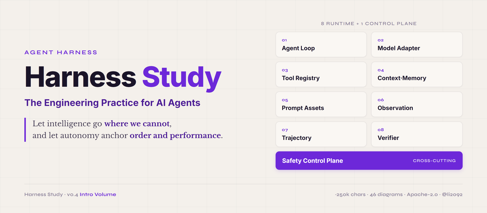
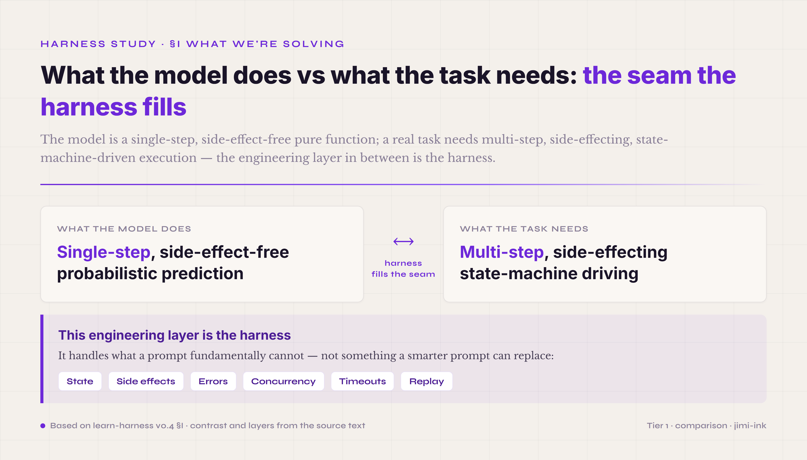

  

# Harness Study · The Engineering Practice for AI Agents

  <strong>Let intelligence go where we cannot, and let autonomy anchor order and performance.</strong>

  
  
  
  
  

---

> Agent Harness engineering is, in essence, the management science of the digital world.
>
> It widens the capability frontier of large models and empowers individuals and organizations alike. It carries governance into domains beyond human reach, and works ceaselessly to drive down the entropy of the system.
>
> It answers the individual's every tailored need, so that every digital unit runs autonomously, efficiently, and responsibly within clearly defined bounds.
>
> Such a Harness is no mere intelligent tool; it is a governance framework in which capability and restraint hold as one.

---

## 1. What This Project Is For

In December 2025 I started trying to build a harness with Claude Code — back then the word didn't exist yet, and I called whatever I was making "an agent-driven balabala product." My first one was Cyber-Mantic: I gave an LLM tools so it could compute the results of various Chinese metaphysics systems accurately and reason over them, and for the agent runtime I simply bolted OpenCode straight in. The project fell short of what I'd hoped, but it sent one very strong signal — once an LLM is given stronger tool-calling, pairing it with an agent runtime is going to be one of the most important kinds of AI tooling for the next few years. So I set out to build agents from scratch, without leaning on any existing framework, and to try every shape the thing could possibly take. For the better part of four months I did this in the hours after my kid was asleep, cheerfully stepping on every harness landmine there was, vibe-coding into the small hours.

After a post of mine on Xiaohongshu (RED) caught a little traction, I began swapping harness notes with a lot of other builders, and found that some of the small tricks I'd accumulated were genuinely useful to them — which is where the idea of writing a systematic tutorial came from. Along the way some of those friends landed internship offers, some caught the startup bug, and the most driven of the lot has already started building a product and raised his first round of funding. I wasn't idle either: I shipped several enterprise vertical-domain agent products of my own, which let me validate my understanding of harnesses from many angles. Light on academia, heavy on engineering.

My hope is that Harness Study helps people understand what a harness is more systematically and more deeply — and that an AI coding tool, handed this tutorial, can turn a user's description of what they need into an agent product that is good enough to use. I also hope it can push along the work of translating *harness* into Chinese: only once every detail of the harness is defined more precisely and more uniformly will more people grasp the concept, and only then can it gradually prove its worth across one industry after another.

Next, I will:
- keep proofreading the Introduction;
- flesh out the engineering detail of Harness · Lab;
- put both Harness Study and Harness · Lab into practice by building an agent purpose-built for DeepSeek V4;
- and distil that engineering process into the expansion chapters of Harness Study.

There. The loop is closed.

## Over to Claude Code to Introduce Harness Study

Most existing material on agents stops at how to build one that runs — pick a framework, write a prompt, add a few tools, run a demo. That layer is well covered on the public internet.

What appears once an agent is actually deployed to office work, contract review, or business process automation is a different class of problem: the same prompt produces different outputs at different times; the headline pass rate looks high but users report inconsistent behaviour in practice; given a document to consult, the agent fabricates details that are not in it and then declares the task complete; a change to a single tool-call convention — leaving the model untouched — causes the entire main loop to stop converging.

In most of these cases, the cause is not in the prompt. Past a certain point, further investment in prompt iteration yields rapidly diminishing returns. What actually determines whether an agent is stable is the layer around the model — in English, the **harness**. A harness is not LangChain or any particular SDK — those are frameworks. The harness is the structure you build on top of a framework for a particular task: how the model is mounted, how tools are managed, how context accumulates, where artifacts land, how things are verified, how safety is enforced, what happens when something fails.

This project — Harness Study — exists to take that layer around the model as an engineering object in its own right and explain it systematically. **The project is organised into volumes.** The introductory volume — which walks the full skeleton once — is complete; further volumes will be per-chapter and per-module expansions, more focused and more detailed, in planning.

  

## 2. What Reading the Full Series Should Enable

For human readers:

- to build a complete mental model of an agent harness;
- to locate any agent engineering problem to a specific mechanism and a common pitfall;
- to independently design and tune an agent harness.

For AI readers:

- any AI coding assistant that reads this project should be able to take a user's specific requirement or scenario and produce a deployable agent of reasonably high accuracy.
- the project also ships **Harness Prompts** you can feed directly to a coding AI ([`introduction/11-harness-prompt.md`](introduction/11-harness-prompt.md), the full executable spec, plus [`introduction/12-harness-prompt-lite.md`](introduction/12-harness-prompt-lite.md), a three-part lite version) — turning "land a harness via a prompt" from an idea into a runnable starting point.

The project is written on the assumption that some of its readers are AI themselves; for those readers, the downstream action is not to *understand the concepts*, but to *construct a usable engineering artifact* on behalf of the user.

## 3. Current Status

- ✓ **Introductory volume**: the manuscript is complete; chapters + 46 diagrams are now in [`introduction/`](introduction/); final review in progress.
- ⏳ **Expansion volumes to follow**: in planning.

---

## 4. The Introductory Volume

The introductory volume is the opening — the overture — of this project. It decomposes an agent harness into **eight runtime mechanisms + one cross-cutting control plane + engineering patterns + a workbench + a composability matrix + four principles from control theory**, and walks through this skeleton in full. Each item is given a complete three-tier mental model: What / Why / How to start.

  

> All 46 diagrams (a unified jimi-ink visual style) are embedded throughout the chapters in [`introduction/`](introduction/).

The volume runs to roughly 250,000 Chinese characters, prose-dominant. That scale is set by the introductory positioning — *walk the full skeleton once, give a complete mental model*; later expansion volumes will be more focused and more detailed.

### Six Questions Answerable After Reading

1. **My agent is unstable — is it because the prompt is poorly written?** Most likely not. The prompt is one piece of the harness; tuning it past a certain point yields diminishing returns.
2. **Is ReAct still relevant? Should I move to plan-execute?** It depends on the setting. Four of ReAct's eight original assumptions no longer hold, but invalidation of assumptions does not mean ReAct is wholesale obsolete.
3. **I run N trials and take the average pass rate — is the statistic trustworthy?** Not necessarily. Prefix KV caches (as in DeepSeek-class models) can make those N trials non-independent — an apparent 80% pass rate may in fact be the same cached path replayed N times. This is what is called *cache collusion*.
4. **My verifier keeps passing outputs that look correct but are actually wrong — what do I do?** Three typical pathologies: answer leakage (the verifier has seen the ground truth), reward hacking (the model has learned to game the verifier), and artifact-claim mismatch (the agent claims to have done something the artifacts do not corroborate). Each calls for a different remedy.
5. **How do I systematically optimise the harness rather than tune by feel?** Observe trajectories, Score them, Ablate mechanisms, Tune parameters, Iterate. This is an outer loop independent of the business loop; the volume calls it the **Harness Lab**.
6. **Which part of this is for me?** See *Who Should Read What* below.

### Who Should Read What

The introductory volume does not require linear reading. Three reader types have recommended paths.

**AI PMs / AI business roles** — for those evaluating vendors, selecting frameworks, setting the harness direction for a team. The most useful question for you is: *what are the parts, what fits which setting, what are the common errors?* Path:

§I Why harness (build mental model in five minutes) → §5.3 Tool Registry & ACI (tools are the crucial part of B2B agent deployment) → §5.5 Prompt Assets (how the instruction layer is managed) → §VII Harness Lab common pitfalls (cache collusion / leakage / reward hacking) → §VIII Composability Matrix (see clearly which combination you are actually putting together).

**Learners** — students of agent engineering, researchers, those preparing to enter the field. The point is to build a mental model that converses with any agent paper or tutorial — to understand why the line from ReAct to Reflexion to plan-execute has evolved the way it has. Path:

§I-§II (origins and prehistory) → §5.1 Agent Loop (evolution of reasoning paradigms) → §5.8 Verifier (the hardest piece of agent engineering) → §IX Four Principles of Control Theory (where the volume's thesis comes together).

**For AI to read** — an agent reading this volume itself, in order to make downstream decisions (for example, an agent tuning its own harness configuration after reading). Path:

Read the chapters in the order listed above (file names 01 → 99). The entry hook and cognitive-node definitions in each chapter are sufficient for modelling. Do not skip the mechanism-description sections — that is the prose body; skipping leaves only the names behind.

### Chapters

| Section | Subject |
|---|---|
| §I | Why harness — what problem we are actually solving |
| §II | Prehistory — when models were used as functions (2020–2022) |
| §III | The first large-scale trial and error — the AutoGPT wave and its failure (2023) |
| §IV | The emergence of the harness concept (mid-2023 – 2026) |
| §V | Eight runtime mechanisms + Safety control plane + end-to-end examples |
| §5.1 | Agent Loop |
| §5.2 | Model Adapter & Routing |
| §5.3 | Tool Registry & ACI |
| §5.4 | Context / Memory / Artifact |
| §5.5 | Prompt Assets |
| §5.6 | Observation Surface |
| §5.7 | Trajectory |
| §5.8 | Verifier |
| §5.9 | Safety |
| §5.10 | A single turn, walked through step by step |
| §5.11 | End-to-end 17 turns |
| §VI | Engineering patterns |
| §VII | Harness Lab — the outer optimisation loop |
| §VIII | Composability matrix |
| §IX | Four principles of control theory |
| §X | Learning paths |
| Companion · Prompt | Harness Prompt — the executable build spec for an agent ([`11-harness-prompt.md`](introduction/11-harness-prompt.md)) |
| Companion · Prompt lite | Generic TDD lite version — three instructions to feed a coding AI ([`12-harness-prompt-lite.md`](introduction/12-harness-prompt-lite.md)) |
| Appendix | K1-K7 / primary sources / EG10 / OWASP / naming map / SPIFFE-biscuit / AP01-AP19 / arxiv index |

### What May Be Skipped

- **The appendix is reference material, not required reading** — consult on demand.
- **Continuity sections** (§5.2 Model Adapter / §5.7 Trajectory) cover comparatively mature components and have lower methodological density than the main chapters; may be skimmed.
- **The main chapters should not be skipped**: §5.1 Agent Loop / §5.4 Context-Memory-Artifact / §5.5 Prompt Assets / §5.6 Observation Surface / §5.8 Verifier / §VII Harness Lab / §VIII Composability Matrix / §IX Control Theory. These eight chapters carry the volume's thesis.

### Introductory Volume — Acceptance Criterion

The introductory volume is complete when readers can answer the six questions above. **The full-series acceptance criterion is higher**: readers should be able to independently design and tune an agent harness — that level is carried by the expansion volumes to follow.

---

## 5. Relation to the Workbench Project

The tutorial side — this repository — defines the object of study and the method. The engineering implementation side is carried by an independent project, [Harness · Lab](https://github.com/li2092/Harness-Lab), which puts this method onto a workbench specification. The two projects share the same vocabulary, the same node definitions, the same signal conventions.

Order of use:

- **First-time readers of this tutorial**: the workbench is not needed; start directly from [`introduction/`](introduction/) (enter the chapters via its README).
- **After finishing the introductory volume, when deploying an actual harness**: use the workbench specification as the visual language of the evidence graph.

## 6. License

[CC BY 4.0](LICENSE) — Creative Commons Attribution 4.0 International © 2026 Jinming Li

You are free to read, share, quote, and adapt this work, as long as you give appropriate credit.

## 7. Contact

- Issues and Discussions welcome.
- Email: li2092@qq.com
- GitHub: [@li2092](https://github.com/li2092)
- Personal site: [jimi.ink](https://jimi.ink/)
