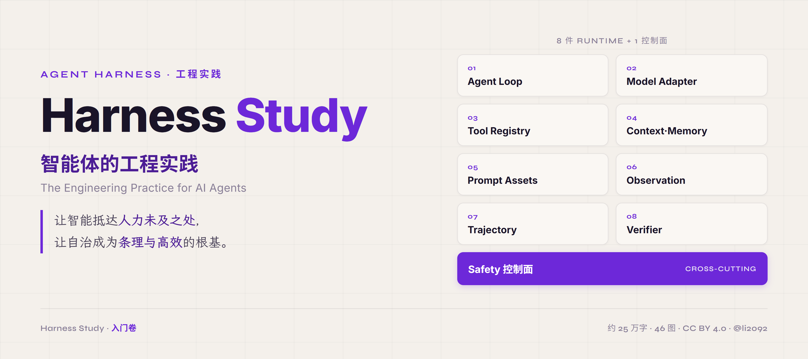
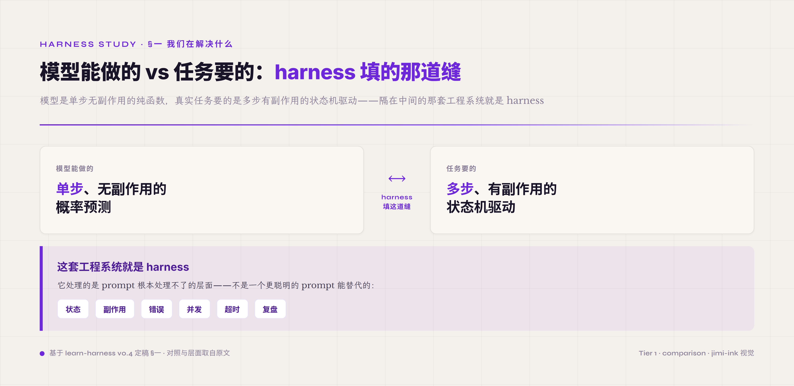
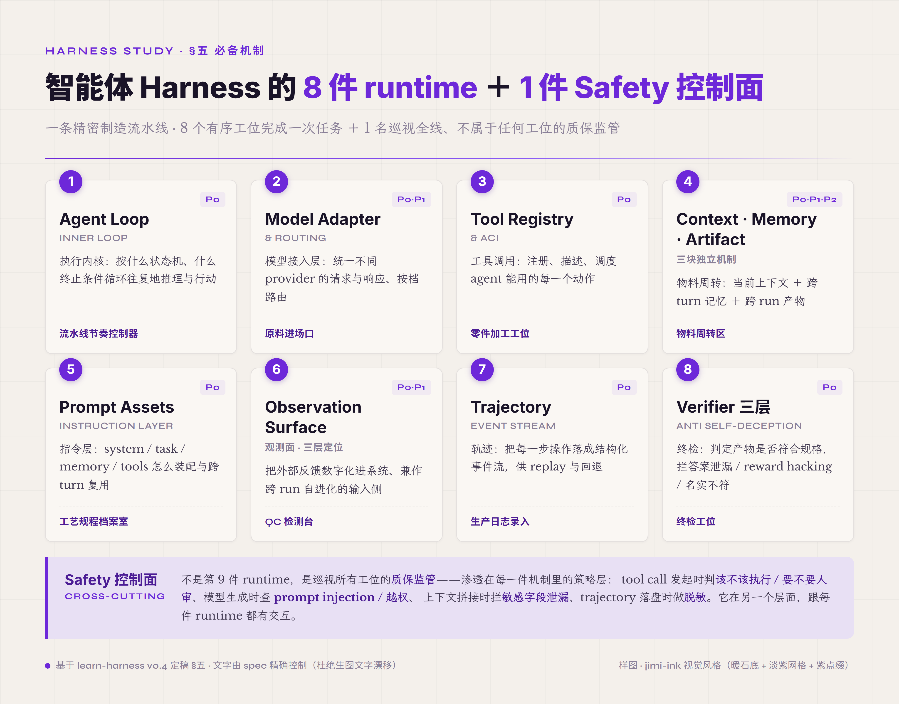

  

# Harness Study · 智能体的工程实践

  <em>The Engineering Practice for AI Agents</em> 
  <strong>让智能抵达人力未及之处，让自治成为条理与高效的根基。</strong>

  
  
  
  
  

---

> 一个好的 Agent Harness 工程，本质上是数字世界的管理学。
>
> 它拓展大模型的能力边界，赋能个体与组织。将治理延伸至人力未及之处，持续为系统带来熵减。
>
> 它回应个体的每一个定制化需求，让一切数字单元都在清晰边界内自主、高效、负责地运行。
>
> 这样的 Harness 不是简单的智能工具，而是让能力与克制并存的治理框架。

---

## 一、项目想做的事

2025 年 12 月，我开始用 Claude Code 尝试开发 harness——那时候还没这个词，我管手上的项目叫"Agent 驱动的 XX 产品"。第一个项目是 Cyber-Mantic：给 LLM 配上工具，让它能准确算出各种术数理论的结果再做分析，当时的 agent runtime 直接把 OpenCode 塞了进去。项目效果不及预期，却给了我一个很强烈的信号——LLM 的工具调用能力一旦增强，再配上 agent runtime，会是未来几年最重要的一类 AI 工具。于是我从 0 开始搭智能体，不借现成 framework，把所有可能的形态都试一遍：利用每天娃睡了的时间，乐此不疲地踩各种 harness 的坑、vibe coding 到凌晨，持续了快 4 个月。

后来在小红书发帖小小地火了一下，跟许多主包交流 harness 经验时，发现我攒的一些小技巧对他们挺有帮助，就萌生了系统写一份教程的想法。写的过程里，有的朋友拿到了实习 Offer、有的萌生了创业的念头，最有行动力的一位老哥已经做出产品、融到了第一笔资金；我自己也没闲着，落地了几个企业级的垂域 agent 产品，从多个角度验证了自己对 harness 的理解——不学术，但很工程。

我希望《Harness Study》能帮大家更系统、更深入地理解什么是 harness，也希望 AI coding 工具拿到它，就能照着用户的需求描述生成一个够用的 Agent 产品。同时我也想推动 harness 的本土化翻译——只有当 harness 的每个细节都有更准确、更统一的定义，这个概念才能被更多人理解，逐步在各行各业落地生根。

接下来我会：
- 进一步校对 Introduction 部分；
- 完善《Harness-Lab》的工程细节；
- 结合《Harness Study》和《Harness-Lab》做工程实践，打造一个专门适配 DeepSeek V4 的 Agent；
- 把工程过程写成《Harness Study》的展开章节。

好的，我闭环了。

## 以下有请 Claude Code 为大家介绍《harness study》

大多数关于智能体（agent）的资料停在"怎么搭一个能跑的 agent"——选框架、写提示词、加几件工具、跑通示例。这一层网上够多了。

真正把智能体放到 To B 办公、合同审核、业务流程审批这类任务上反复运行之后，会出现另一类问题：同一份提示词在不同时段产出不同的结果；表面通过率高但用户实际感到时对时错；明明给了文档让它查，仍然伪造细节并宣称完成；只改了一处工具调用的写法，整条主线就不再收敛。

这些问题里大多数原因不在提示词。把希望寄托在反复迭代提示词上，到一定阶段之后边际收益迅速衰减。真正决定智能体稳定与否的，是围绕模型的那一层结构——在英文文献里叫 **harness**。harness 不是 LangChain 或某个 SDK——那是 framework。harness 是你在 framework 之上为某个具体任务搭起来的整套结构：模型怎么挂、工具怎么管、上下文怎么累积、产物怎么落地、验证靠什么、安全靠什么、出错怎么兜底。

本项目（Harness Study）就是为了把围绕模型的这一层作为独立的工程对象，系统化地讲清楚。**项目分卷展开**：当前已写完**入门卷**，一次性走完全骨架；后续会有逐章 / 逐模块的展开卷，更聚焦、更详细，规划中。

  

## 二、读完整套之后应该能

给读者：

- 建起完整的 agent harness mental model；
- 拿到任何 agent 工程问题能定位到具体的机制 + 常见的误区；
- 独立设计、独立调优一个 agent harness。

给 AI 读者：

- 任何 AI coding 工具读完本项目之后，应当能够依据使用者给出的具体需求或场景，落地一个可投入使用且准确性较高的 agent。
- 本项目还附带可直接喂给编码 AI 的 **Harness Prompt**（[`introduction/11-harness-prompt.md`](introduction/11-harness-prompt.md) 完整可执行 Spec + [`introduction/12-harness-prompt-lite.md`](introduction/12-harness-prompt-lite.md) 三段 lite 版）——把"用提示词落地一套 harness"从概念变成可执行的起点。

本项目在写作上即假定读者中包括 AI 本身：它读完之后的下游动作不是停在"理解概念"，而是为使用者构造可用的工程产物。

## 三、当前进度

- ✓ **入门卷**：稿件已写完，章节正文 + 46 配图已落入 [`introduction/`](introduction/)；终审进行中。
- ⏳ **后续展开卷**：规划中。

---

## 四、入门卷概览

入门卷是本项目的开篇导论卷。它把 agent harness 拆成**八种 runtime 机制 + 一种横切控制面 + 工程模式 + 工作台 + 可组合性矩阵 + 控制论四原则**，把整套骨架走一遍。每一种给出 What / Why / How to start 三档完整 mental model。

  

> 全卷 46 张配图（统一 jimi-ink 视觉）已嵌入 [`introduction/`](introduction/) 各章正文，可逐章浏览。

入门卷整本约二十五万中文字，prose 主导。这一规模由"一次走完全骨架 + 给完整 mental model"的入门版定位决定；后续展开卷会更聚焦、更详细。

### 读完入门卷应能回答的六个问题

1. **我的 agent 不稳定 · 是不是 prompt 写得不好？** 多半不是。prompt 只是 harness 的一种零件，调到极限收益会到顶。
2. **ReAct 还在用吗？我该升级到 plan-execute 吗？** 看场景。ReAct 八条原始假设里四条已经失效，但失效不等于 ReAct 整体过时。
3. **我跑 N 次取平均看通过率 · 统计可信吗？** 不一定。DeepSeek 之类的 prefix KV cache 会让 N 次之间不独立——表面 80% 通过率可能其实是同一份缓存复用 N 次。这叫 cache 共谋。
4. **我的 verifier 总放过看似对实际错的输出 · 怎么办？** 三种典型病：答案泄漏（verifier 见过 ground truth）、reward hacking（模型学会糊弄 verifier）、artifact-claim mismatch（agent 声称做了但产物里没有）。三种各有不同对策。
5. **我应该怎么系统优化 harness 而不是凭感觉调？** Observe（观察轨迹）→ Score（打分）→ Ablate（消融）→ Tune（调参）→ Iterate（迭代）。这是一个独立于业务循环的外循环，本卷称之为 Harness Lab。
6. **这教程哪段是给我读的？** 见下文"谁该读哪段"。

### 谁该读哪段

入门卷不要求从头读到尾。三类读者各有推荐路径：

**AI PM / AI 业务人员**——你要选型、评估外部 agent 厂商、给团队定 harness 方向。最需要"有哪些零件、什么场景该选什么、什么是常见误区"。推荐路径：

§一 Why harness（5 分钟先建心智）→ §5.3 Tool Registry & ACI（工具是 To B agent 落地的关键）→ §5.5 Prompt Assets（指令层怎么管）→ §七 Harness Lab 三块常见误区（cache 共谋 / leakage / reward hacking）→ §八 可组合性矩阵（看清自己手里在拼哪一组合）。

**学习者**（在学 agent 工程、做研究、准备入行）——你要建一套能跟任何 agent 论文 / 教程对话的 mental model，知道 ReAct 到 Reflexion 到 plan-execute 这条线为什么会这么演化。推荐路径：

§一-§二（缘起与前世）→ §5.1 Agent Loop（思维范式的进化）→ §5.8 Verifier（agent 工程最难的一种）→ §九 控制论四原则（整本教程 thesis 收束）。

**给 AI 看**——AI agent 自己读本卷做下游决策（例如读完本卷之后调自己 harness 配置）。推荐路径：

按上面目录顺序（文件名 01 → 99）依次读。每章 entry hook + 认知节点定义足够建模。不要跳读机制描述段——那是 prose 主体，跳了就只剩名字。

### 入门卷章节

| 章 | 主题 |
|---|---|
| §一 | Why harness · 我们究竟在解决什么问题 |
| §二 | 前世 · 模型当函数用的时代（2020–2022） |
| §三 | 第一次大规模试错 · AutoGPT 浪潮和它的翻车（2023） |
| §四 | Harness 概念的浮现（2023 中–2026） |
| §五 | 八种 runtime 机制 + Safety 控制面 + 端到端示例 |
| §5.1 | Agent Loop |
| §5.2 | Model Adapter & Routing |
| §5.3 | Tool Registry & ACI |
| §5.4 | Context / Memory / Artifact |
| §5.5 | Prompt Assets |
| §5.6 | Observation Surface |
| §5.7 | Trajectory |
| §5.8 | Verifier |
| §5.9 | Safety |
| §5.10 | 一次 turn 的微型流程（单 turn 走查）|
| §5.11 | 端到端 17 turn |
| §六 | 工程模式 |
| §七 | Harness Lab · 调优外循环 |
| §八 | 可组合性矩阵 |
| §九 | 控制论四原则 |
| §十 | 学习路径 |
| 配套 · Prompt | Harness Prompt · 给 agent 的可执行落地 Spec（[`11-harness-prompt.md`](introduction/11-harness-prompt.md)）|
| 配套 · Prompt lite | 通用 TDD lite 版 · 三段指令直接喂编码 AI（[`12-harness-prompt-lite.md`](introduction/12-harness-prompt-lite.md)）|
| 附录 | K1-K7 / 一手 source / EG10 / OWASP / 命名映射 / SPIFFE-biscuit / AP01-AP19 / arxiv 全表 |

### 跳读建议

- **附录是参考资料不是必读**——查到再读。
- **沿用章节**（§5.2 Model Adapter / §5.7 Trajectory）讲的是相对成熟的零件，方法论密度低于重头戏章，可跳读。
- **重头戏章不要跳**：§5.1 Agent Loop / §5.4 Context-Memory-Artifact / §5.5 Prompt Assets / §5.6 Observation Surface / §5.8 Verifier / §七 Harness Lab / §八 可组合性矩阵 / §九 控制论。这八章是入门卷的 thesis 承重墙。

### 入门卷完成判据

入门卷读完，上述六个问题读者能答出来。**整套项目的完成判据**比这更高：读者能独立设计 + 独立调优一个 agent harness——这一目标由后续展开卷承担。

---

## 五、跟工作台项目的关系

教程一侧——本仓库——定义研究的对象与方法。工程实现一侧由独立项目 [Harness · Lab](https://github.com/li2092/Harness-Lab) 承担：把这套方法承担在可视化工作台规范上。两个项目共享同一套术语、节点、信号定义。

使用顺序：

- **第一次读本教程**：不需要工作台 · 直接读 [`introduction/`](introduction/)（从目录 README 进各章）起。
- **已读完入门卷、要落地某个具体 harness**：把工作台规范当作 evidence graph 的视觉语言来用。

## 六、协议

[Apache License 2.0](LICENSE) © 2026 Jinming Li

## 七、联系

- Issues 与 Discussions 欢迎
- 邮箱：li2092@qq.com
- GitHub：[@li2092](https://github.com/li2092)
- 个人网站：[jimi.ink](https://jimi.ink/)
