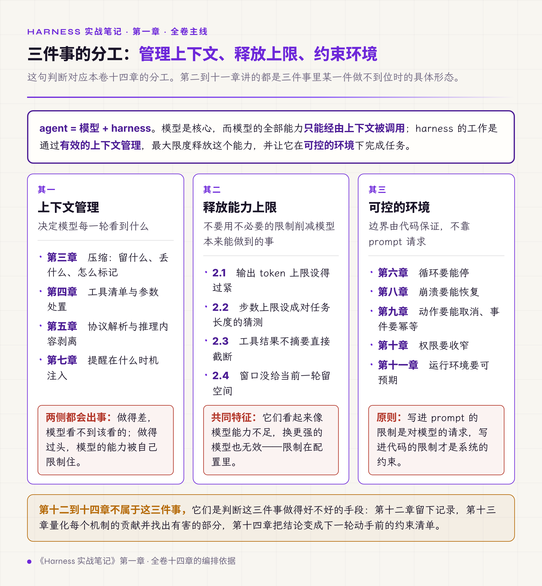
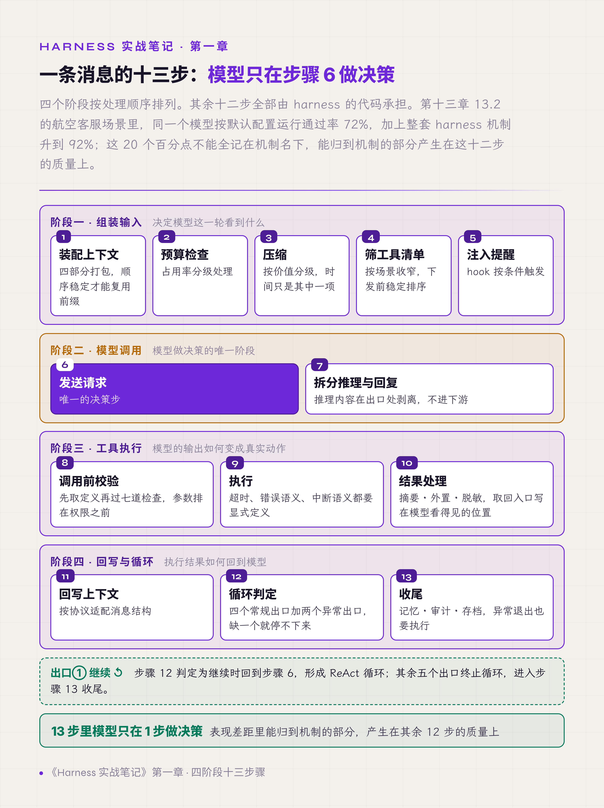
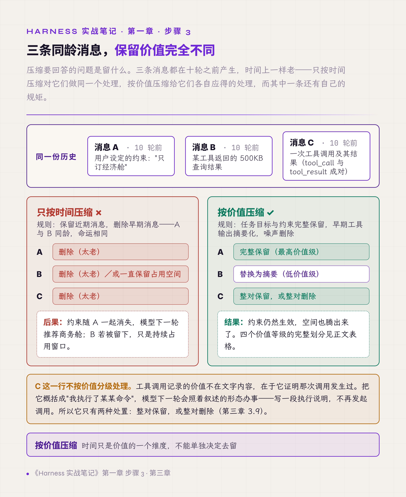
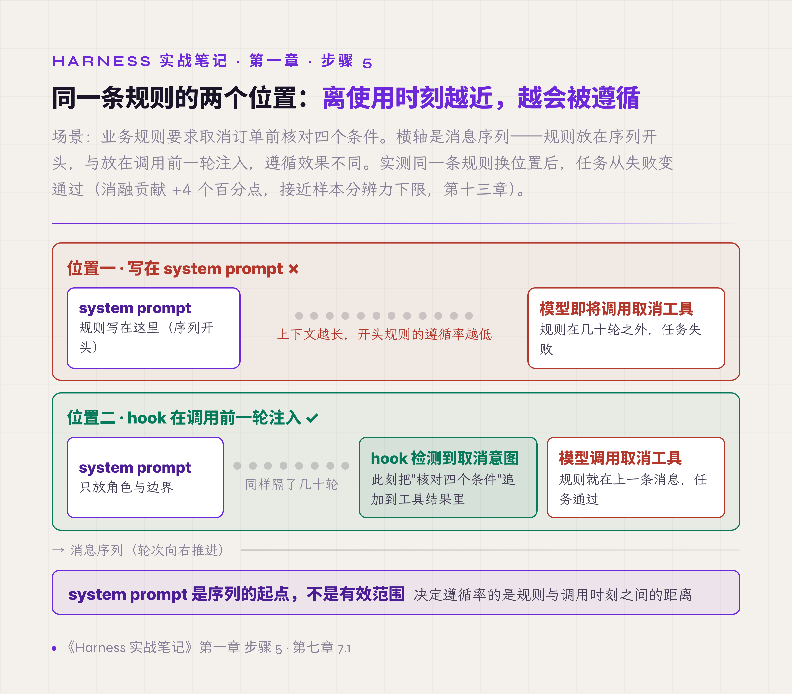
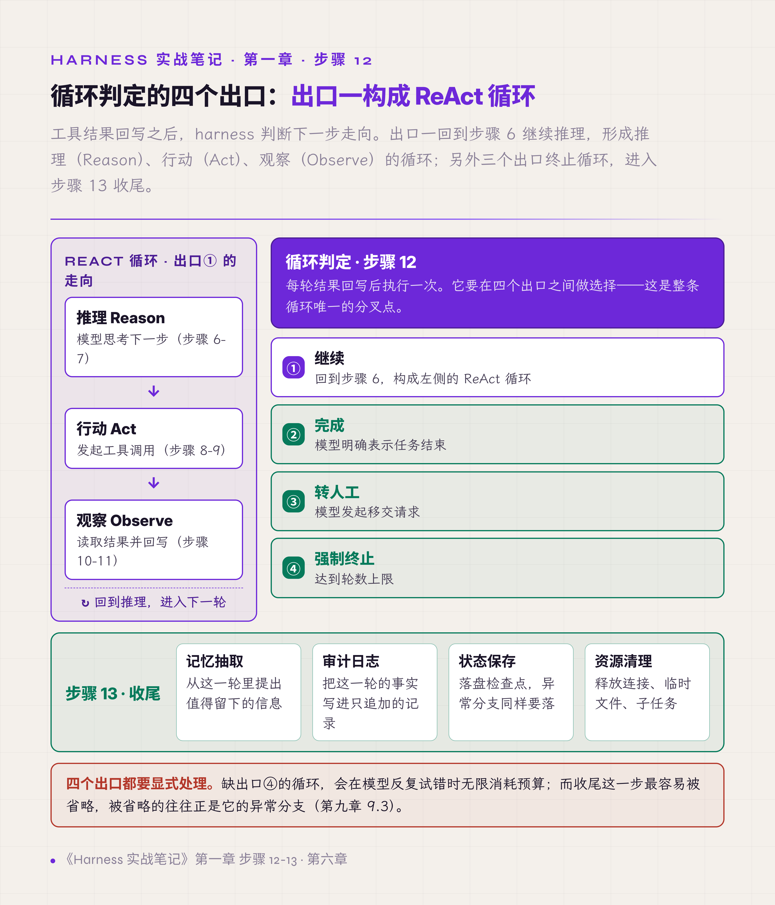

# 一、一条消息经过 harness 的全过程

## 这本册子的主线

先把判断写在前面：**agent = 模型 + harness。模型是核心，而模型的全部能力只能经由上下文被调用；harness 的工作是通过有效的上下文管理，最大限度释放这个能力，并让它在可控的环境下完成任务。**

前半句是入门卷 §一 立的分解公式，后半句是本册要交代的内容。两者之间有一个容易被跳过的事实：**模型 API 是无状态的，运行中也不更新权重。** 模型这一轮的行为，只由这一轮送进窗口的内容和这一次调用的参数决定，没有第三个来源。harness 能影响模型的位置，就是这两处。

这句话拆成三件事，正好是本册十四章的分工：

**上下文管理**——决定模型每一轮看到什么。压缩、工具清单、协议解析、提醒注入都属于这件事（第三、四、五、七章）。做得差，模型的能力用不出来；做得过头，模型的能力被自己限制住。

**释放能力上限**——不要用不必要的限制去削减模型本来能做到的事。输出长度上限设得过紧、步数上限设得过小、工具结果直接截断，这三类设置都会让一个有能力完成任务的模型交出半成品（第二章）。

**可控的环境**——在能力被释放的同时，边界要由代码保证：循环要能停（第六章）、动作要能取消（第九章）、权限要收窄（第十章）、崩溃要能恢复（第八章）。

harness 指位于模型 API 之外、负责上述全部工作的那一层程序。模型接收一段输入、返回一段输出，其余全部工作——决定模型看到什么、模型的输出如何被执行、执行结果如何回到模型——由 harness 完成。

*图 1.1 · 三件事的分工：管理上下文、释放上限、约束环境*

入门卷把 harness 拆成八件 runtime 机制加一个 Safety 控制面，§5.10 用一次 turn 走完全部机制的协作。本章是同一件事的另一种切法，按代码的执行顺序排，便于后面把每个故障定位到具体的步骤编号上。

## 十三个步骤

流程分四个阶段、十三个步骤：

| 阶段 | 步骤 | 内容 |
|---|---|---|
| 组装输入 | 1-5 | 装配上下文、预算检查、压缩、筛选工具清单、注入提醒 |
| 模型调用 | 6-7 | 发送请求、拆分推理与回复 |
| 工具执行 | 8-10 | 调用前校验、执行、结果处理 |
| 回写与循环 | 11-13 | 回写上下文、循环判定、收尾 |

先读这张表建立整体结构，再看每一步的细节。读完本章会得到一个结论：模型只在步骤 6 做决策，其余十二步都是 harness 的代码；压缩与记忆抽取也会调模型，那是 harness 发起的辅助调用，不产生动作。

*图 1.2 · 四阶段十三步骤：模型只在步骤 6 做决策*

## 阶段一：组装输入

### 步骤 1 · 装配上下文

**模型 API 是无状态的**：每次请求都要把模型需要知道的全部信息重新发送一遍，服务端不保留上一次的对话。这个事实是后面所有成本问题和管理问题的来源。部分服务提供服务端会话或服务端压缩，把这份工作挪到服务端；本册讨论的是客户端全量重发的形态，第三章的决定都在这个前提下成立。

因此收到用户消息后，harness 的第一件事是装配本次请求的完整输入，这份输入称为**上下文**（context），由四部分构成：

1. system prompt——角色定义、行为规则、约束条件
2. 历史消息——之前每一轮的用户消息、模型回复、工具调用记录
3. 当前这条新消息
4. 工具清单——本次允许模型调用的工具及各自的参数定义

上下文越长，请求越贵、响应越慢、模型出错率越高。后面四个步骤从不同方向控制它：步骤 2、3 管长度，步骤 4 减少干扰，步骤 5 保住关键规则。

装配还有一条约束与长度无关：**前缀的稳定性**。多数模型服务按 token 前缀复用最近写过的相同输入，命中的那段按远低于正常价的费率计费；有的服务要在请求里声明缓存断点或开启自动缓存才生效，缓存本身有几分钟到一小时的存活期，写入还有溢价。复用要求前缀逐 token 相同，实践上按逐字节相同来维护。所以每一轮重新拼装时，哪些内容放在前面、顺序稳不稳定，本身就影响成本。第三章 3.10 讲这条约束怎么进入压缩决策。

第二卷 §10.1 给这件事定了性——context 是投影，不是容器。投影意味着它由别处的真相算出来，每一轮都可以重算；第三章讲的压缩之所以只能改投影不能改历史，原因在这里。

### 步骤 2 · 预算检查

每个模型有上下文长度上限，称为**上下文窗口**（context window），以 token（模型处理文本的最小单位）计量。上限之内并非同等可用：占用率升高时，模型对窗口中部内容的利用能力下降，长文档场景实测中部信息的召回率会低于头尾。

所以 harness 在每轮装配后检查占用率，并分档处理。常见档位：60% 起给出提示，70% 左右触发压缩，90% 以上必须压缩，否则后续轮次会超限失败。

这里还有一个容易设反的量：给当前这一轮预留多少空间。入门卷 §5.4 给的经验值是预留三到四成——模型这一轮要思考、要读工具结果、要输出，这些都占窗口。预算检查算的是历史，预留管的是当前轮，两个数要一起定。第二章讲这类数字设错时的具体后果。

### 步骤 3 · 压缩

压缩指把历史消息替换为更短的形式，为后续轮次腾出空间。

常见的错误做法是按时间压缩：保留近期消息，删除早期消息。错误在于消息的保留价值与时间无关。同样是十轮之前的两条消息——一条是用户设定的约束（"只订经济舱"），一条是某工具返回的 500KB 查询结果——删掉前者，模型下一轮就会违反约束；保留后者，只是持续占用空间。

正确做法是按内容价值分级：

| 分级 | 内容类型 | 处理 |
|---|---|---|
| 最高 | 任务目标、用户设定的约束 | 完整保留 |
| 高 | 最近几轮对话 | 保留原文 |
| 低 | 早期的工具返回结果 | 替换为摘要 |
| 最低 | 过程性内容、重复信息 | 删除 |

价值之外还有第二条轴：**可复现性**。同样是早期的工具返回结果，一次本地读文件重跑一遍就能拿回原样，一次联网抓取重跑要花钱且内容可能已经变了，一次写操作根本不能重跑。这条轴决定的是清除的手段——可本地重跑的清成一行模板，要花钱重跑的走摘要保信息，不可重跑的不清。这条轴的标记在步骤 10 摄入时打，步骤 3 只读标记。

还有一类内容不按上表处理：**工具调用记录**。它承担的是凭据作用——证明那次调用确实发生过。把它概括成一句叙述，模型会照着叙述的形态办事，下一轮改用文字描述工具执行而不再发起调用。第三章 3.9 讲这一格。

一句话概括：**按价值压缩，按时间压缩是错的**。

*图 1.3 · 三条同龄消息在两种压缩策略下的不同去向*

压缩不止"选谁留下"这一个决定。它有触发时机、有产物、有失败路径、有自身的预算，还是一处安全约束容易丢失的位置；它本身也有代价，改写历史会让前缀缓存从改动点起失效——第三章整章讲这件事。第二卷 §10.3 把压缩定义为一个事务而不是一次摘要，§10.4 立了四条压缩契约纪律，那四条在第三章的每一个故障里都有对应的失效位置。

### 步骤 4 · 筛选工具清单

工具清单进入上下文，模型据此决定调用哪个工具。清单越长，模型选错的概率越高：一个客服场景若把 40 个工具全部列出，其中只有 8 个与本场景相关，其余 32 个都在制造干扰（第十三章 13.2 量化的是另一个场景：50 个减到 12 个）。

所以 harness 按场景筛选清单，只把当前任务需要的工具给模型。工具在系统中注册，和工具出现在本次清单里，是两个独立的决定。入门卷 §5.3.8 把这件事做成机制，称为按查询取动态子集。

还有一种做法是把目录与定义分开：清单里常驻的只有工具名与一句话描述，完整的参数定义等模型检索之后再加载进来。代价是多一轮检索，收益是几十个第三方工具的定义不占前缀；延迟加载的定义追加在上下文末尾，前缀不动，这是它比常驻清单省钱的第二个原因。

筛选还有一个与准确率无关的影响：清单是缓存层级的最前段，成员、顺序、任何一条定义的文本变了，整份缓存从头失效。所以下发之前要做一次稳定排序，筛选带来的收益也要减去清单变动的代价。

### 步骤 5 · 注入提醒

发送请求之前还有一步：在特定条件满足时，向上下文追加一条临时规则提醒。执行这类插入逻辑的机制称为 **hook**——注册在流程固定位置、条件触发的一段代码。

以订票场景为例：业务规则要求取消订单前核对四个条件。这条规则写进 system prompt 的效果差：上下文越长，模型对开头那段规则的遵循率越低，而摘要或近期消息里一句相反的转述离当前轮很近，两边都看得到时近的那句起作用。有效做法是由 hook 监测模型行为，在模型即将调用取消工具的那一轮，把四个条件追加到触发它的那条工具结果里，或放进下一条用户消息（载体的选法见第七章 7.2）。**规则出现的位置离使用它的时刻越近，被遵循的概率越高。**

*图 1.4 · 同一条规则的两个注入位置与遵循效果*

注入的位置、时机、载体各有讲究，插错位置会破坏消息协议，第七章展开。

## 阶段二：模型调用

### 步骤 6 · 发送请求

上下文、工具清单、注入的提醒打包发出。模型的返回有三种形态，harness 必须分别处理：

1. 纯文本回复——直接进入阶段四
2. 工具调用请求——模型声明要调用某个工具及参数，进入阶段三
3. 推理内容加上述二者之一——开启深度推理模式的模型会先输出一段推理过程，再给出回复或工具调用

这一步还有一个请求参数要定：单次输出的 token 上限。与它相邻的步数上限由 harness 自己计数，不进请求。这两个数设错会直接削减模型的产出，第二章单独讲。

### 步骤 7 · 拆分推理与回复

推理内容需要与最终回复分开处理。推理过程包含中间计算、被放弃的方案、自我修正，可能还有不宜外泄的信息。处置有三个去向：界面上折叠展示或不展示；写入日志供排查；写不写回消息历史，按第五章 5.3 的分档决定。

有一种情况必须严格剥离：这条输出的接收方是另一个 LLM。评测系统里扮演用户的模拟程序（user simulator）、流水线里的下游 agent 都属于这种情况。推理内容如果原样传过去，接收方会把推理文字当作正式回复来理解，后续对话随之偏离。

推理内容还有另一类问题——训练格式的残留会混进正文，第五章讲怎么识别和清洗。

## 阶段三：工具执行

### 步骤 8 · 调用前校验

模型请求的工具调用不能直接执行，先过一串闸门。实际实现里这串闸门有七道，顺序固定：参数能否解析成一个对象 → 参数是否符合该工具的 schema（参数的结构定义，含字段名、类型、取值范围）→ 本次调用是否在权限范围内，需要确认的先问用户 → 前置 hook 是否放行 → 工具名是否存在 → 动作层校验（例如写一个本会话没读过的文件）→ 策略层校验。进闸门之前先按名字取工具定义，取不到就跳过第二道，落到第五道拒绝。

这个顺序有依据。参数闸门排在权限确认之前，因为一次畸形参数不该消耗用户的一次确认；schema 校验排在 hook 之前，是为了让 hook 看到的永远是一份合法参数；工具存在性排在权限之后，是为了让"这个工具不存在"和"这个工具你不能用"回给模型的是两条不同的信息。

校验要应对的一个高频现象：模型会生成 schema 里没有的参数。例如给只接受订单号的取消接口传入 `reason="health"`。直接透传，业务 API 报错，模型看到报错再试一次，一来一回消耗掉多轮预算。处置办法在第四章展开。

第二卷 §8.11 把工具契约定成 schema、语义、编排三层校验，本章的步骤 8 是前两层的入口；权限判定属第二卷第十一章，结果的可信边界属第八章 8.10，分别落在本册第十章和第五章。

### 步骤 9 · 执行

校验通过后执行。工具可能是 HTTP 接口、数据库查询、文件读写，也可能是另一个 agent。这是整个流程中唯一对外部世界产生真实影响的步骤，因此有三条硬约束：

- 超时控制——单个工具卡住不能拖垮整个流程
- 错误语义明确——失败必须返回可识别的错误标记，模型误把失败当成功，后续每一步都建立在错误前提上
- 中断语义明确——用户中止时，哪些工具该立刻停、哪些该让它跑完，是按工具分档的决定；而且"派发之前被中断"和"派发之后被中断"必须记成两个不同的结果，因为它决定了事后能不能判断这个动作有没有发生过

第二卷第八章整章讲这一步的记账：意图、授权、执行、结果四段各自留痕，重复与丢失只能二选一。第九章会给出这条契约在中断和崩溃场景下的实际失效方式。

### 步骤 10 · 结果处理

工具结果在回到模型之前先做三类处理：

1. 体积控制——大结果做摘要或外置。500KB 的 JSON 原样放进上下文，几轮之内窗口耗尽
2. 外置存储——完整结果存入独立存储，上下文里只放摘要和一个引用标识，模型需要细节时通过标识再取
3. 脱敏——结果中的手机号、证件号等敏感字段先遮罩

两种做法的对比：原样返回 1000 条记录，模型无法有效处理；返回"共 1000 条，前 3 条如下，完整结果的引用标识为 abc123"，模型掌握了规模，需要时再取细节。入门卷 §5.6 把这个结构称为 stub 与 body 分离，并给了 stub 的经验体量：200 字符上下。

外置有一条容易漏的配套要求：**取回的入口必须写在模型看得见的位置**——占位文本自身写明怎么取回，取回工具的 description 写明它取什么，system prompt 只放一句总述。有过一次实际的失败是全文照常存了，三处都没写，模型不知道有这个入口，那份存储从上线起没有被读过一次。

还有一个时机问题：体积控制在结果摄入的那一刻做，不等压缩。等到压缩再处理，这条结果已经完整进过一次上下文，也已经计过一次费。

这里有一个常见的错误处理方式——不做摘要直接按长度截断。它的代价比看上去大，第二章 2.3 单独讲。

## 阶段四：回写与循环

### 步骤 11 · 回写上下文

处理后的结果作为工具结果消息追加进上下文。此处有一个格式问题：各家模型对工具结果的消息格式要求不同——有的要求携带调用标识字段做关联，有的要求 JSON，有的要求纯文本。harness 在此做协议适配，把结果转换成当前模型要求的格式。助手消息原样回写，含推理内容时按第五章 5.3 的分档处理；回写后要保住配对——助手消息里每个工具调用都要有对应的结果消息（第二卷第六章 6.7）。

这一层的差异比看上去大，第五章会说明为什么"一套适配层通吃各家"的目标要放弃。

### 步骤 12 · 循环判定

结果回写后，harness 判断下一步走向，共四个出口：

1. 继续——再次调用模型，回到步骤 6，模型基于工具结果决定后续动作
2. 完成——模型明确表示任务结束，流程终止
3. 转人工——模型发起移交请求
4. 强制终止——达到轮数上限

出口 1 构成的循环有一个通用名称：**ReAct**，取自推理（Reason）与行动（Act），循环里还有第三步观察。模型推理后发起工具调用，harness 执行并回写结果，模型观察结果再推理。循环持续到四个出口中的某一个被触发。

*图 1.5 · 循环判定的四个出口与 ReAct 循环*

入门卷 §5.1 强调 Agent Loop 是模型的思考结构而不是一段 while 代码，并指出生产实现里的继续站点与终止出口都是一等设计对象。第六章讲的就是这些出口不完备时会发生什么：循环停不下来、空转、卡住。出口 4 的阈值设小了会有另一类后果，见第二章 2.2。

### 步骤 13 · 收尾

流程终止后的四件事：

1. 记忆抽取——从本轮对话提取值得长期保存的信息，写入持久记忆
2. 审计——全部工具调用的参数、结果、时间戳写入日志
3. 状态保存——完整消息历史与当前状态存入数据库，供后续恢复
4. 资源清理——关闭文件句柄，终止残留子进程

这四件事之间有顺序，也会停在中间。检查点已经落盘而审计记录追加失败，是一种要单独定义错误类型的状态——把它当成普通异常吞掉，事后既看不出这次收尾做到哪一步，也判断不出该按已完成还是未完成恢复。

这一步最容易被省略，而事后排查问题依赖的正是这里留下的记录。更要紧的是：**它同样要在异常退出的路径上执行**。第九章会说明为什么"用户按停止"和"进程崩溃"这两条路径上的收尾，比正常结束时的收尾更重要。

## 全册地图

回看全程：**模型只在步骤 6 做决策，其余十二步全部由 harness 的代码承担。** 同一个模型放进不同 harness，任务通过率可以相差十到二十个百分点，差距就产生在这十二步的质量上。

后面的章节按这十三步挂靠：

| 章 | 内容 | 对应步骤 | 对应主线 |
|---|---|---|---|
| 二 | 预算与限制 | 2、6、9、10、12 | 释放上限 |
| 三 | 压缩 | 3 | 上下文管理 |
| 四 | 工具定义与参数处置 | 4、8 | 上下文管理 |
| 五 | 模型协议与输出解析 | 6-7、11 | 上下文管理 |
| 六 | 循环控制与空转检测 | 12 | 可控环境 |
| 七 | 提醒注入与交付可见性 | 5 | 上下文管理 |
| 八 | 状态、持久化与崩溃恢复 | 13、横切 | 可控环境 |
| 九 | 并发、取消与中断 | 9、13、横切 | 可控环境 |
| 十 | 权限与安全 | 8-9、横切 | 可控环境 |
| 十一 | 运行环境与 prompt 组织 | 横切 | 可控环境 |
| 十二 | 观测与评测 | 全流程 | 验证 |
| 十三 | 消融、负贡献与迭代 | 全流程 | 验证 |
| 十四 | 把故障经验前置成约束 | 方法 | 方法 |

第二章到第十一章是开发线：每一节讲一个真实故障的完整经过——什么场景下出现、造成了什么后果、试过哪些无效的处理、最后有效的做法是什么、留下了什么判据。第十二章到第十三章是验证线：怎么证明这些机制真的在工作、各自值多少。第十四章讲怎么把这些经验前置成约束，让下一版少踩一遍。
