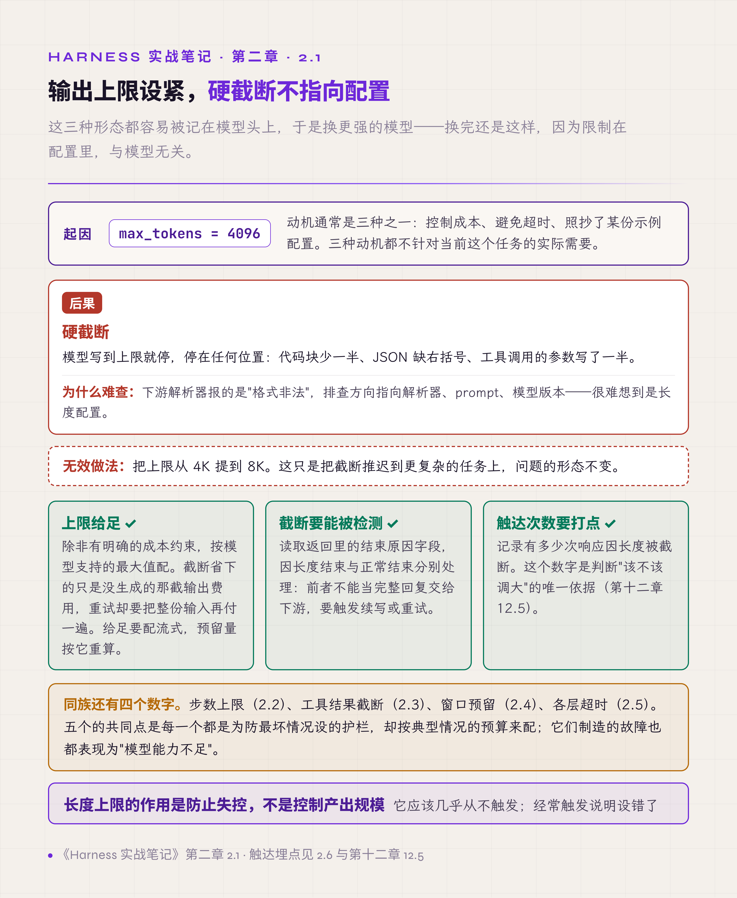
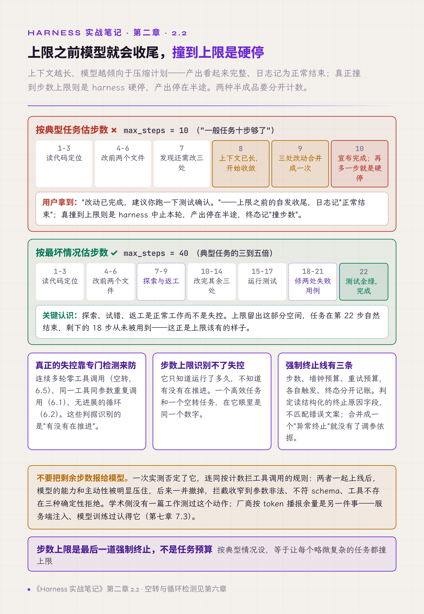
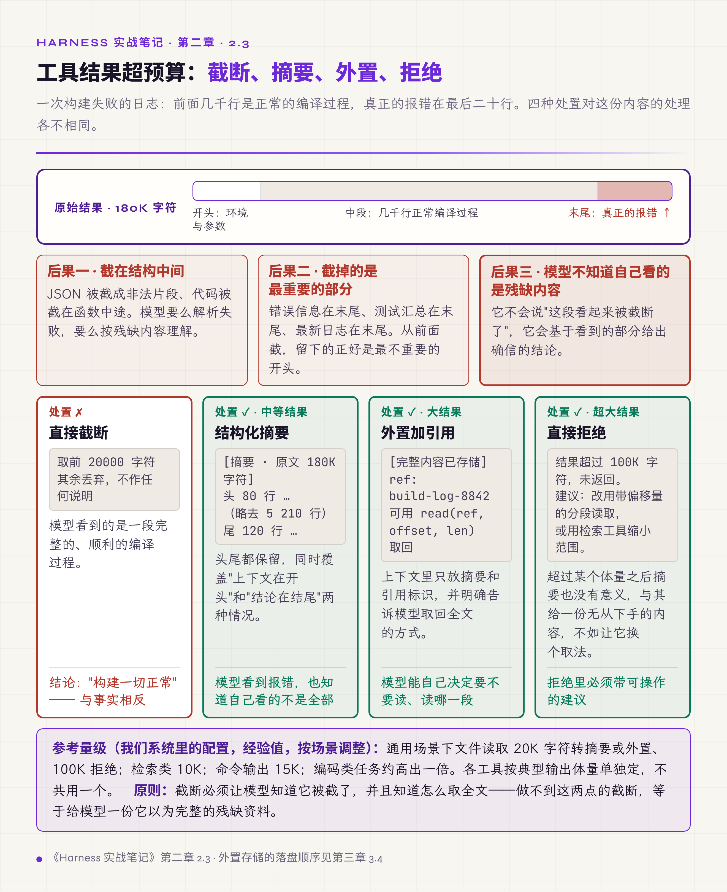
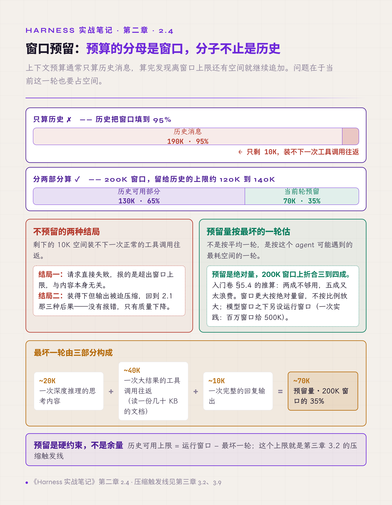

# 二、预算与限制：不要用配置削减模型的能力

上一章的主线里有一句：不要用不必要的限制去削减模型本来能做到的事。这一章讲的全部故障都属于这一类：**系统没有 bug，模型没有出错，是配置里的几个数字让任务交不出完整结果。**

这类问题有个共同特征：**它们看起来像模型能力不足。** 输出到一半停了、复杂任务做了个半成品、工具结果读不全，第一反应都是换个更强的模型。换完发现还是这样，因为限制在配置里，与模型无关。

最常被设错的有五类数字：

- 单次输出的 token 上限
- 一次运行的步数上限
- 工具结果的截断长度
- 留给当前轮的窗口空间
- 各层的超时值

它们有一个共同点：每一个都是为防最坏情况设的护栏，却按典型情况的预算来配。

## 2.1 输出 token 上限用于防止失控，不是用来控制回复长度

调用模型时要传一个单次输出的最大 token 数。这个数常被设小，动机有三种：控制成本、避免超时、照抄了某份示例配置。

设小之后的后果是硬截断。输出上限是请求参数，服务端拿它截断，模型看不到它，所以它造成的只有这一类后果。模型写到上限就停，停在任何位置，常见三种形态：

- 代码块少一半
- JSON 缺右括号
- 工具调用的参数写了一半

下游解析器拿到这段内容会报错，而错误信息说的是"格式非法"，指向的方向完全不对。排查的人会去查解析器、查 prompt、查模型版本，很难想到是长度配置。

试过的无效做法是把上限调大一点点，比如从 4K 提到 8K。这只是把截断推迟到更复杂的任务上，问题的形态不变。

有效做法有三条：

**上限给足。** 除非有明确的成本约束，输出上限就按模型支持的最大值配。控制成本要用别的手段：限制任务复杂度、限制并发、限制重试次数，而不是限制单次输出长度。截断省下的只是没生成的那截输出费用，付掉的是整份输入与已生成部分；重试一次要把输入再付一遍，长上下文里这一笔通常比省下的那截贵得多。给足有两个配套：

- 上限大到一定量级之后必须走流式。例如 Anthropic 的 Python SDK 会按 max_tokens 估算请求时长，估计超过 10 分钟的非流式请求直接拒绝，要求改用流式（platform.claude.com/docs/en/api/errors#long-requests）。
- 上限是 2.4 预留量的一部分，给足输出上限的同时，要把预留量按它重算。

**截断要能被检测。** 模型返回里有一个字段说明本次为什么结束（OpenAI 称 finish_reason，Anthropic 称 stop_reason）。因长度而结束和正常结束是两个值；Claude 的 Messages API 在生成撞到窗口边缘时还会给第三个值 `model_context_window_exceeded`（2.4）。这个字段必须被读取并分别处理：因长度结束的响应不能当成完整回复交给下游，要么触发续写，要么重试。

**触达次数要打点。** 记录有多少次响应是因为长度被截断的。这个数字如果不是接近零，说明上限设低了；它同时是判断"该不该调大"的唯一依据（第十二章 12.5：每个决策点都要有计数器）。

**长度上限的作用是防止失控，不是控制产出规模。** 它应该几乎从不触发；经常触发说明设错了。

*图 2.1 · 输出上限设紧的三种后果*

**另一种现象要分开看：格式合法，内容敷衍。** 模型压缩表达、省略步骤，把本该逐个文件修改的任务写成一段概要说明。在代码类任务上很常见：让模型改五个文件，它改了两个，然后说"其余文件同理"；让它输出完整实现，它给出关键片段加注释说明。这种情况下没有任何报错，只有质量下降，而质量下降会被记到模型头上。

它也常被记到输出上限头上，但机制对不上：模型看不到输出上限。能让模型主动收缩的，是它看得见的预算信号，有三种：

- **服务端注入的上下文余量。** Claude 的上下文感知（context awareness）：Sonnet 4.5 / 4.6 / 5、Haiku 4.5 在每次工具调用后，由服务端向模型注入剩余 token 的提示（platform.claude.com/docs/en/build-with-claude/context-windows）。
- **厂商提供的任务级 token 预算。** Claude 从 Opus 4.7 起改用任务预算（task budgets），按整段 agentic 循环给出 token 预算，让模型在预算耗尽前安排工作、从容收尾（同上文档）。
- **harness 自己追加进上下文的预算或步数文本**（第七章 7.3：追加的东西要有人清理）。

看到敷衍产出，先查这三样，再查推理强度档位有没有被调低；调大输出上限没有用。判别方法是用同一 prompt、只改输出上限做对照：产出结构不变、只是被切断，是硬截断；产出重新组织成概要，来源在预算信号。

## 2.2 步数上限不要设成对任务长度的猜测

agent 运行时要设一个步数上限：一次运行最多允许多少轮（每轮是一次模型调用加上它触发的工具执行，见第一章的约定）。

这个数常按"估计任务需要多少步"来设，比如觉得一般任务十步够了，就设十步。这个设法有两个问题。

**它把防失控的机制当成了业务预期。** 步数上限的目的是防止失控：模型陷入循环、反复试错、无限探索。它对应的是最坏情况，不是典型情况。按典型情况设，等于让每个略微复杂的任务都撞上限。

**撞到上限是硬停。** 步数由 harness 计数，模型看不到它。撞线时 harness 中止这次运行，产出停在半途，结束原因记为"撞步数"。

还有一种现象常被归到步数上限头上，其实与它无关：**模型在上限之前就提前收尾。** 一次运行里上下文越长，模型越倾向于压缩计划：跳过验证步骤，把三个文件的修改合并成一次，跳过测试直接宣布完成。产出看起来是完整的，实际是被截断的执行过程。**用户拿到的是一个宣称完成的半成品**，而日志里这次运行是"正常结束"。在代码任务上典型的表现是：模型改完代码没有运行测试，就说"改动已完成，建议你跑一下测试确认"。这句话听起来合理，常被当成步数不够时的退让；但模型看不到步数，能让它这样收尾的，是上下文长度和它看得见的预算信号（见 2.1 末尾"格式合法，内容敷衍"一段）。

这两种半成品要分开计数：一种是撞步数被硬停，一种是模型自己宣布完成。

有一种看起来自然的补救，是把剩余步数报给模型，让它自己安排。一次实测否定了它，连同另一个同源的做法：按计数拦模型的工具调用，例如同一文件连改三次没有重读就拦下，重复被拒之后由 harness 喊"换策略"。<!-- 待作者补充：这次实测看的是什么指标（通过率、提前收尾比例、平均步数？）、多少任务、与什么基线对照？ -->

两者一起上线之后，模型的能力和主动性被明显压住：该继续探索的地方停下来，该多试一次的地方退让，产出停在保守的一版。播报的计数还会过期、互相矛盾，第七章 7.3 记了它从上线到删除的全过程。两者后来都撤了，拦截收窄到三种确定性的拒绝：参数非法、不符 schema、工具不存在。其余拒绝的原因都在模型之外，harness 不该替它下结论。

就我们检索所及，学术侧还没有工作测过"向模型播报剩余步数"这个动作。能查到的几篇只说明相邻的事：多用步数不必然提高准确率，模型估不准自己还要花多少预算，过度思考会表现为提前终止。

厂商侧做的是另一件事：按 token 播报剩余余量，也就是 2.1 末尾提到的 Claude 上下文感知（Sonnet 4.5 / 4.6 / 5、Haiku 4.5 在每次工具调用后注入剩余 token 提示）和 Opus 4.7 起的任务预算（task budgets）。它与被撤掉的机制有三处不同：

- 计量单位是 token，不是步数；
- 注入由服务端完成，不经过 harness 的消息体；
- 它是厂商为模型设计的原生信号，不是 harness 临时拼出来的文本。

厂商文档还记了一个坑：客户端自己递减余量再交给模型，模型看到被低报的预算会提前收尾。预算信号只能有一个来源。

有效做法：

**步数上限按最坏情况设，通常是典型任务的三到五倍（经验值，按场景调整）。** 复杂任务需要探索、试错、返工，这些都是正常工作而不是失控。

**真正的失控靠专门的检测来防**，不靠步数：连续多轮零工具调用（空转，见第六章 6.5）、同一工具同参数重复调用（第六章 6.1）、无进展的循环（第六章 6.2）。这些判据能识别真正的失控，而步数上限识别不了：它只知道跑了多久，不知道有没有在推进。

**因步数终止必须显式标记。** 这类结束不能和模型主动宣布完成标记成同一种结束。第二卷第五章要求结束原因分类记录，撞上限属于其中单独的一个取值，它在统计里的占比是判断上限设得合不合适的直接依据。

**强制终止线不止步数一条。** 还有墙钟预算，即这次运行最多允许占用多少真实时间；以及重试预算，即最多允许消耗多少次重发。三条线各自触发，结束原因要分开记录：撞步数、超时限、重试耗尽是三种不同的运行结果，合并成一个"异常终止"就没有了调参依据。判定时读结构化的终止原因字段，不要去匹配错误文案。

**步数上限是最后一道强制终止，不是任务预算。** 它和空转检测的分工是：空转检测判断有没有在推进，步数上限只防最坏情况。

*图 2.2 · 步数上限设小时模型的收尾行为*

## 2.3 工具结果不要直接截断

工具返回的内容超过预算时，最省事的处理是按长度截断：取前 N 个字符，其余丢弃。

这个做法有三个后果，一个比一个严重。

**截在结构中间。** JSON 被截成非法片段、代码被截在函数中途、表格被截掉一半。模型拿到一段语法不完整的内容，要么解析失败，要么按残缺内容理解。

**截掉的往往是最重要的部分。** 命令输出的错误信息通常在末尾，测试结果的汇总在末尾，日志里最新的记录在末尾。从前面截，保留的正好是最不重要的开头部分。一次构建失败的日志，前面几千行是正常的编译过程，真正的报错在最后二十行，直接截断的结果是模型看到"一切正常"。

**模型不知道自己看到的是残缺内容。** 这是最严重的一条。它不会说"这段内容看起来被截断了，我需要完整版本"，它会基于看到的部分给出确信的结论。

有效做法按内容体量分三级：

**小结果直接内联。** 不做任何处理。

**中等结果做结构化摘要。** 头部保留若干行、尾部保留若干行、中间标注省略了多少行。头尾都保留这一点很关键，它同时覆盖了"上下文在开头"和"结论在结尾"两种情况。摘要必须显式写明这是摘要以及原始体量，让模型知道自己看的不是全部。

**大结果外置。** 完整内容存到独立存储，上下文里放摘要加一个引用标识，并明确告诉模型可以用什么方式取回全文或某个片段。

还有第四级：**超大结果直接拒绝**，返回可操作的建议（改用带偏移量的分段读取、改用检索工具缩小范围）。理由是超过某个体量之后，摘要也没有意义了，与其给模型一份无从下手的内容，不如让它换个取法。

参考量级如下，均为我们系统里的配置（经验值，按场景调整），单位是字符：

| 工具类别 | 通用场景：超过即转摘要或外置 | 通用场景：超过即拒绝 | 编码类任务 |
|---|---|---|---|
| 文件读取 | 20K | 100K | 40K |
| 检索类 | 10K | 未单列 | 未单列 |
| 命令输出 | 15K | 未单列 | 30K |

这些数字要按各工具的典型输出体量单独定，不要共用一个。通用场景这一列是基线，还要按任务类型调。编码类任务的合理值大约高出一倍：多数源文件和构建日志要完整进上下文才有用。调整依据是被摘要或外置的比例分布（第十二章 12.5）。

还有一条时机：外置动作在结果摄入的那一刻完成，不留到压缩阶段。留到压缩再处理，这条结果已经完整进过一次上下文，费用也已经付过一次。第三章 3.9 给出清理工具结果的几种做法的完整排序。

**截断必须让模型知道它被截了，并且知道怎么取全文。** 做不到这两点的截断，等于给模型一份它以为完整的残缺资料。

*图 2.3 · 直接截断、结构化摘要、外置引用的三种结果*

## 2.4 窗口预留要按最坏的一轮算

上下文预算通常只算历史消息，算完发现离窗口上限还有空间就继续追加。

问题在于当前这一轮也要占空间：模型要输出推理内容、要输出回复、这一轮的工具可能返回一大段结果。历史把窗口填到 95%，剩下的空间装不下一次正常的工具调用往返。有的服务直接拒绝这次请求；Claude 的 Messages API 则可能接受请求，生成到窗口边缘停下，`stop_reason` 为 `model_context_window_exceeded`。两种都要当作撞窗计数。装得下但输出被迫压缩的，回到 2.1 的情形。

有效做法是把窗口分成两部分：历史可用部分和当前轮预留部分。预留量按最坏的一轮估：一次深度推理，加一次大结果的工具调用，加一次完整输出。这是个绝对量。200K 窗口下它约占三到四成，留给历史的上限约 120K 到 140K；窗口更大时按绝对量预留，不按比例放大。

还有一层：模型窗口不等于运行窗口。百万窗口的模型，出于成本与延迟，一次实践给每个会话定的运行上限是 500K；本节的预留与第三章 3.2 的触发线都按运行窗口算，不按模型上限算。

这个预留量反过来决定第三章 3.2 的压缩触发线：窗口减去预留量，就是历史能占用的上限，触发线不能高于它。

入门卷 §5.4 给出这个比例时的推算过程值得复述。一轮里模型可能要：

1. 思考几千 token；
2. 读一次几十 KB 的文档，折合上万 token；
3. 再输出几千 token。

三项相加约两万 token 上下，这是典型的一轮。预留要按最坏的一轮留：推理加深、工具结果接近 2.3 的外置线、输出按 2.1 给足的上限写满时，三项都会成倍增长。按 200K 窗口算，两成（40K）装不下这样的一轮；五成（100K）又让历史只剩一半，压缩过于频繁。三到四成（60K 到 80K）落在两者之间。<!-- 待作者补充：最坏一轮三项各按多少 token 估（尤其是输出上限配的是多少）？有具体数字可替换上面的定性推算 -->

**预算的分母是窗口，分子不止是历史。**

*图 2.4 · 窗口的三段分配与最坏一轮的估法*

## 2.5 超时按最慢的合法情况设

超时值常按"正常情况要多久"来定：一次工具调用通常几秒，那就给三十秒。

agent 的正常分布很宽。同一个读文件工具，读一份配置是毫秒级，读一份构建日志是几秒，读远端挂载的目录可能几十秒；模型单次响应开了深度推理之后可以到几分钟。按典型值设，这些合法的慢请求全部变成超时错误，而错误文案说的是"操作已中止"，指向的方向和 2.1 的"格式非法"一样偏。排查的人会去查网络、查服务端，很难想到是配置里的一个常数。

一次现场报告的原话是超时设得过于激进，模型密集工作时反复出现操作被中止。调整之后的量级可供参照（经验值，按场景调整）：

| 层 | 超时 |
|---|---|
| 模型单步 | 15 分钟 |
| 工具执行 | 10 分钟 |
| 外部命令 | 5 分钟 |
| hook 命令 | 60 秒 |

hook 命令这一项指能跑外部命令的 hook；只做注入与拦截的同步 hook 见第七章 7.4（hook 要设超时与降级）。

设松也有代价：一个真卡住的调用要等很久才暴露，这段时间用户看到的是没有反应。所以它不是越大越安全的数。

有效做法是分层给值，各层按各自最慢的合法情况定：模型调用、工具执行、外部命令、hook 各一个值。这些值集中在一处定义，不散落在各调用点。散落的后果是同一类操作在不同路径上有不同的容忍度，而且没人知道一共有多少个。

**每一层的触发次数单独打点。** 几乎从不触发说明设得合理；经常触发要先分清是设紧了还是真的卡住了，这两种情况的处方相反。

**超时值的参照物是最慢的一次合法调用。**

## 2.6 限制的触达要有记录

前面五节各有若干条数字。这些数字设得对不对，只有一个判断方法：看它们被触达的频率。

需要记录的有七项：

- 因长度截断的响应次数，到达输出上限（`max_tokens`）与撞到窗口边缘（`model_context_window_exceeded`）分开计，这是两项；
- 三条强制终止线各自的触发次数（步数、墙钟、重试预算）；
- 工具结果被摘要或外置的次数与体量分布；
- 请求因超出窗口被拒绝的次数；
- 各层超时的触发次数。

还有一项性质不同、同样属于配置反馈：前缀缓存的命中率。它不对应某个上限，反映的是装配顺序稳不稳定。命中率掉下来，通常意味着某个位置正在被反复改写（第三章 3.10）。

没有这些记录时，唯一能观察到的现象是"有时候结果不完整"，而这个现象对应好几种完全不同的原因，无法区分。有了记录，每个数字都变成一个可以回答的问题：这一周有多少次输出被截断、有多少次任务是撞步数上限结束的。

**限制类配置必须配触达埋点**，否则它们既不会被调对，也不会被发现设错了。这条是第十二章 12.5（每个决策点都要有计数器）的一个具体应用。

## 本章与前两卷的对应

入门卷 §5.4 给的窗口预留比例是 2.4 的依据；§5.4 里的预算守卫概念对应本章的五类数字。那里讲它是一种硬约束，本章补的是这类硬约束设错时的表现。

第二卷第五章 5.4 把结束原因分四大类，撞步数上限是其中一类下的一个具体取值，要作为独立取值记录，不与"模型主动完成"合并；墙钟与重试预算同理，强制终止线有几条，取值就有几个。第二卷 §2.5 把系统行为按确定程度分成保证、尽力、推断、未知四级。2.1 末尾的敷衍产出属于"推断"一级：把它归因到预算信号只是推断，尚未证实；要验证，就只改输出上限做一次对照。

本章与第三章的分工：这一章讲不该有的限制怎么削减能力，下一章讲必要的压缩怎么做才不损失关键信息。两者合起来是同一件事的两侧：**该省的地方省，不该省的地方不要省。**
