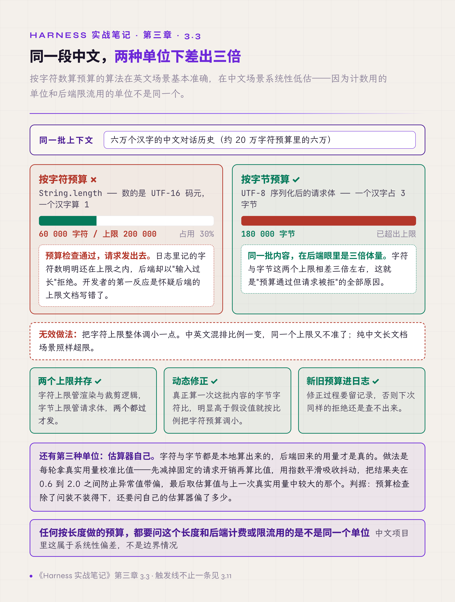
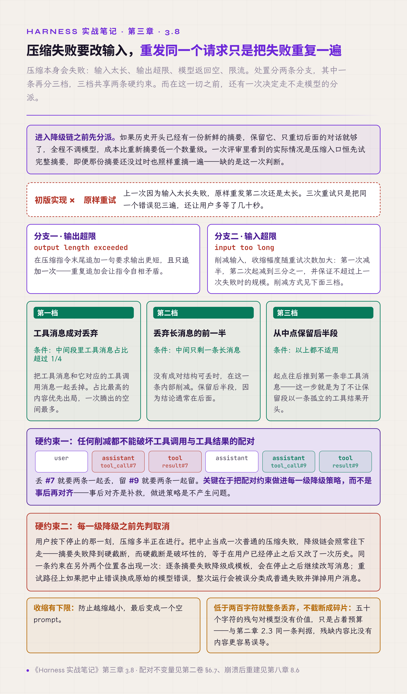
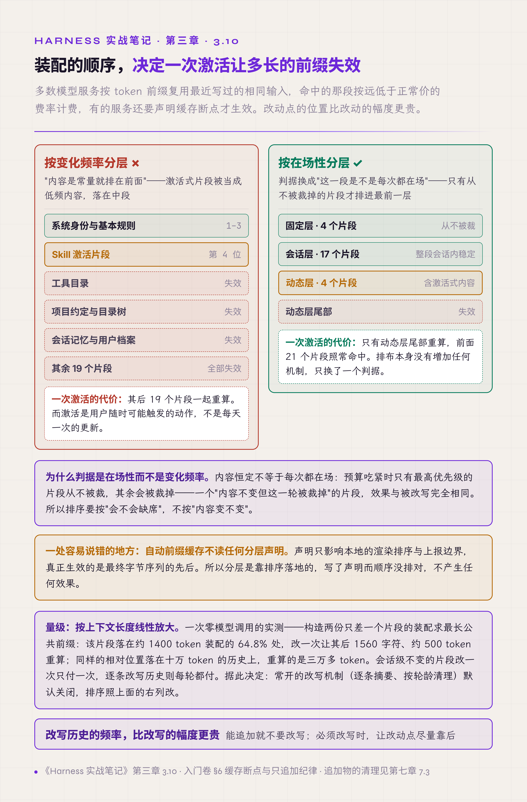
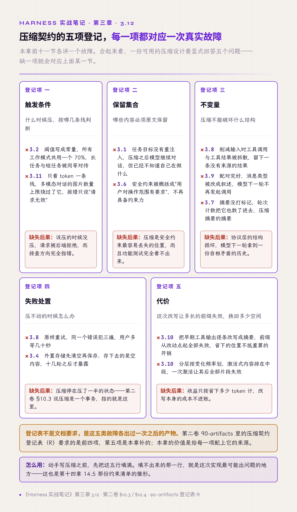

# 三、压缩

上一章讲不该有的限制。这一章讲必要的压缩——历史真的装不下时，怎么压才不损失关键信息。

压缩类故障有个共同特征：**当轮不报错。** 压掉了不该压的、预算算错了单位、摘要超出自己的预算，这些都不会在发生的那一刻抛异常，而是在几十轮之后表现为"模型忘了任务""请求突然被拒""压缩越来越频繁"。

第二卷 §10.3 把压缩定义成一个事务而不是一次摘要，§10.4 给出压缩契约的四条纪律。这一章是那份契约的失效方式清单：每一节讲一次真实故障，以及补上之后留下的判据。

## 3.1 压缩后重注入任务目标

压缩把早期消息替换为摘要，而任务目标和角色设定恰好写在最早的消息里，最容易被并入摘要。

问题不在于摘要写得好不好，而在于摘要是转述。关键约束经过一次转述就开始失真：用户说的"只订经济舱，预算两千以内"，压缩后可能变成"用户对价格有要求"。这句话不算错，但模型据此做的下一个决定可以完全不同。几十轮之后，模型不记得最初任务，行为逐渐偏离，而对话看上去仍然通顺——没有任何一个环节会报错。

试过的无效做法是把 system prompt 写得更详细，指望模型记住。这条路在压缩场景下无效：system prompt 本身没被压掉，但它离当前位置越来越远，而摘要里那句失真的转述离得很近。模型两边都看得到时，近的那句起作用。

有效做法是每次压缩完成后立即追加一条恢复消息，内容是任务目标与角色身份的原文，不是转述。压缩和重注入成对出现，缺了后者的压缩等于变相删除任务。

判据：**任何会替换历史的操作，都要问一句被替换掉的内容里有没有需要原文生效的东西。**

## 3.2 压缩阈值按工作模式分层

压缩由占用率阈值触发，初版实现通常全局一个数值。

问题在不同工作模式对上下文的需求不同。规划类模式要基于长材料做整体设计，套用统一阈值会被过早压缩，压掉的材料下一轮又要重新读入，空间和轮次都被反复消耗；执行类模式相反，历史里大半是工具输出，早压比晚压好。

参考值：常规执行 70% 触发，规划模式推迟到 88%，60% 起给出提示。入门卷 §5.4 给的 70% 是常规档，这里补的是同一个 harness 里可以有多个档。触发线由第二章 2.4 的预留量决定：预留三成，触发线就不能高于七成。规划模式能推到 88%，前提是那一档的当前轮只有推理与短输出，没有大结果的工具调用；条件不成立就退回常规档。

判据：阈值是配置不是常量，而且同一个系统里可能同时存在几个取值。

## 3.3 字符预算之外要单设字节预算

上下文预算通常按字符数算：把消息拼起来数长度，不超过上限就发。这个算法在英文场景基本准确，**在中文场景系统性低估**。

原因是单位不一致。JavaScript 的 `length` 数的是 UTF-16 码元，一个汉字算 1；请求体序列化成 UTF-8 之后，一个汉字占 3 字节。于是出现一种很难排查的失败：预算检查通过了，请求发出去被后端以"输入过长"拒绝，而日志里记的字符数明明还在上限之内。开发者第一反应是怀疑后端的上限文档写错了。

试过的无效做法是把字符上限整体调小一点。这只是把问题推后：中英文混排比例一变，同一个上限又不准了，纯中文长文档场景照样超限。

有效做法是两个上限并存——字符上限管渲染与裁剪逻辑，字节上限管请求体，两个都过才发。再加一步动态修正：真正算一次这批内容的字节字符比，明显高于假设值就按比例把字符预算调小，并把新旧预算记进日志。参考量级是字符上限与字节上限相差三倍左右。

还有第三种单位：估算器自己。预算检查用的是本地估算（常见做法是字符数除以四），计费用的是服务端的分词器，两者的差随内容的语种和格式变化。可行的处理是每轮拿服务端返回的真实用量校准估算比值，但校准本身有个坑——要先减去固定的请求开销，也就是 system prompt 与工具 schema 那一段，否则等于把一个加性的常数当成乘性的系数，每压缩一次估算就被扭曲一次。校准值还要平滑并夹在合理区间（相对字符数除以四这个基准，参考值 0.6 到 2.0），超出这个区间的多半是测量故障。判断是否触发压缩时，取估算值与"服务端上次真实用量加本轮新增的估算"两者的较大者。

判据：**任何按长度做的预算，都要问这个长度和后端计费或限流用的是不是同一个单位，以及自己的估算器偏了多少。** 中文项目里这条属于系统性偏差，不是边界情况。

*图 3.1 · 同一段中文内容在两种单位下的预算差*

## 3.4 外置存储先保存再清空

把大结果移出上下文的流程分两步：完整内容存入外部存储，原位置替换为引用。

两步顺序写反——先清空再保存——存下去的就是空内容，模型后续通过引用取回空字符串。这个错误当轮不报任何异常，直到模型要用完整内容时才暴露，而那时故障现场已经过去了十几轮，日志里看不出是哪一步出的问题。

有效做法是对存取这一段写单元测试，覆盖存入后读出的完整往返。顺序敏感的操作靠代码评审看不出来——两行代码单独看都对，只有往返测试能暴露顺序。

判据：**成对操作要测往返，不测单向。** 这类顺序错误是所有静默失败里最难靠阅读发现的一种。

## 3.5 后台记忆抽取设硬配额

记忆抽取通常做成后台任务，自动从每轮对话提取值得保存的信息。

抽取不设上限，长会话下记忆条目持续增加，带来两个后果：检索变慢；每轮注入上下文的记忆变长，反过来又推高上下文占用，于是压缩触发得更频繁，压缩又产生新的摘要供抽取。这个增长没有自然的停止点，是一条会自我加速的循环。

有效做法是设硬配额，条目数达到上限即跳过本轮抽取，并按重要性淘汰旧条目。入门卷 §5.4 讲的记忆淘汰是消费侧的控制，这条补的是生产侧——不限制产出速度，只做淘汰追不上。

配额之外还有一个更前置的问题：这个机制该不该默认开。一次覆盖 64 个真实会话的调查给出的结论是：它对任务通过既非必要也非充分——通过的用例里有两次记忆为空，失败的用例里有一次写了记忆；而代价是每轮多一次模型调用，加上常驻约 2000 字符的上下文。据此维持默认关闭，需要时按场景单独开。这是一次观察性调查，给的是关闭的理由，不是贡献值；要拿贡献值得按第十三章的做法开关重跑。

判据：**任何自主运行、无人触发的后台循环都要有配额**，因为没有人会注意到它跑了多少次。

## 3.6 压缩 prompt 里写明两条防御条款

压缩由模型执行：把一段历史交给模型，让它产出摘要。这意味着压缩指令本身是 prompt，它的疏漏会变成摘要的疏漏。

有两类内容一旦被摘要概括掉，后果远超信息丢失。

第一类是安全约束。用户说过"这几个目录不要动""凭据不许写进日志"，这些是限制条件，被概括成"用户对操作范围有要求"之后就不再具备约束力，模型压缩完就可能动那几个目录。**压缩是安全约束最容易丢失的位置**，而且这个问题在功能测试里完全看不出来。

第二类更隐蔽：模型会把自己写的东西归给用户。助手消息里如果出现排版得像对话记录的文本——引号里的"用户：……"、复述用户诉求的段落——摘要时容易被认成真实的用户发言，写进摘要就成了既定事实。下一轮模型据此认为用户已经批准过某个动作，这是一种幻觉授权。

有效做法是在压缩指令里加两条明文：安全相关的指令与约束必须逐字保留，理由写清是让它们在压缩之后继续生效；只有真正的用户轮次才算用户消息，助手消息里排版得像用户发言的文本是模型生成的，不得描述成用户的请求、批准或确认。

判据：压缩指令要按 prompt 来管理和评审，不是一段配置文本。

## 3.7 摘要要打标记，轮次计数跳过摘要

摘要产出后作为一条消息插回对话。如果这条消息看上去和普通用户消息没有区别，会出一个自我强化的问题：**触发压缩的计数把摘要也数了进去**。

具体表现是压缩完成后立刻又满足触发条件，于是压缩摘要、再压缩摘要的摘要，几轮之内内容被反复转述失真，而每一次转述都在消耗一次模型调用。

有效做法有两步。一是系统插入的一切内容都打标记——摘要带摘要标记、提醒带提醒标记，下游靠标记识别；二是计数逻辑显式跳过带标记的消息，查找"最后一条用户消息"时也跳过。

这里有条通用立场：**标记优于推断**。系统自己插进对话的东西，一律打标，不在下游用正则推测哪条是自己插的。正则今天能匹配上，提醒模板从"注意"改成"请注意"就失效。

判据：凡是自己往对话里插内容，先问一句下游怎么把它识别出来。

## 3.8 压缩失败要按错误类型降级，不是重发

压缩本身会失败：输入太长、输出超限、模型返回空、限流。

初版实现通常是重试同样的请求。这个做法在压缩场景下基本无效——上一次因为输入太长失败，原样重发第二次还是太长，三次重试只是把同一个错误犯三遍，还让用户多等了几十秒。

有效做法是**按错误类型改变下一次的输入**：

- 输出超限，就在压缩指令末尾追加一句要求输出更短，且只追加一次，重复追加会让指令自相矛盾
- 输入超限，就削减输入，且收缩幅度随重试次数加大（第一次减半，第二次起减到三分之一），并保证不超过上一次失败时的规模

削减输入有三档策略：中间段里工具消息占比超过四分之一，就把工具消息和对应的工具调用消息**成对丢弃**；中间只剩一条长消息，丢弃它的前一半；否则从中点保留后半段，起点往后推到第一条非工具消息。

三档共享一条硬约束：**任何削减都不能破坏工具调用与工具结果的配对**。这是把配对约束做进每一级降级策略，而不是事后再对齐——第二卷 §6.7 立的配对不变量与半压缩禁令，指的正是这件事；事后对齐是补救，做进策略是不产生问题。

第二条硬约束是**每一级降级之前先判取消**。用户按下停止的那一刻压缩多半正在进行，这时如果把中止当成一次普通的压缩失败，降级链会照常往下走：摘要失败降到硬截断，而硬截断是破坏性的，等于在用户已经停止之后又改了一次历史。同一条约束在另外两个位置各出现一次——逐条摘要失败降级成模板，会在停止之后继续改写消息；重试路径上如果把中止错误换成原始的模型错误，整次运行会被误分类成普通失败并弹掉用户消息。

还有两条细节值得单列。一是收缩有下限，防止越缩越小最后变成空 prompt；二是**分到的额度低于两百字符就整条丢弃，不截断成碎片**——五十个字符的残句对模型没有价值，只是占着预算；丢弃时留一条占位，保住 3.9 的配对。这条与第二章 2.3 的判据一致：残缺内容比没有内容更容易误导。

降级链管的是压不动之后怎么退。进入之前还有一处分派容易漏：如果历史开头已经有一份新鲜的摘要，保留它、只重切后面的对话就够了，全程不调模型，成本比重新摘要一遍低一个数量级。一次评审里看到的实际情况是压缩入口恒先试完整摘要，即便开头那份摘要还没过时也照样重摘一遍。缺的是一次判断。

判据：重试要改变输入，否则它只是把失败重复一遍。

*图 3.2 · 压缩失败的三级降级与两条硬约束*

## 3.9 工具结果只能整对留或整对删

工具输出占的位置最大，清理时第一个想到它。常见做法是把早期的调用和结果合成一句概括：「我执行了 shell_exec 检查了依赖版本」。消息条数少了，配对也没破。

改掉的是消息的类型。历史里原本有几十对结构化的调用记录，换成叙述之后，模型看到的是助手用文字描述自己做过什么。下一轮它照着这个形态办——写一段执行说明，不发工具调用。日志里这一轮没有任何工具记录，排查方向很容易转到解析层或者模型能力上，而这两处都是对的。

同一个失败还有第二个入口，在消息的传递链上：助手消息的工具调用部分没有转回结构化字段、工具消息没有保留调用标识，模型同样丢了工具历史，同样开始在正文里编造执行结果。

有效做法分三档，按代价从低到高排。

**第一档是不产生需要清理的内容。** 工具结果在进上下文那一刻就按各工具的上限截断，全文存进外置库，上下文里放摘要加一个取回标识。这一档不碰任何已经发出的消息，代价最低，第一章步骤 10 讲的就是它。

**第二档是清内容不清消息。** 承载结果的那条工具消息留在原位，类型不变，配对不变，只把内容换成一行占位文本。占位文本要写明两件事：这里被清过，以及怎么取回——可以重跑的写清可以重跑，外置的写清引用标识。

**第三档是整对删除**，调用与结果一起走。第 3.8 节讲的成对丢弃就是这一档。

三档之外有一条硬约束：外置的取回入口必须写在模型看得见的位置——占位文本自身写明怎么取回，取回工具的 description 写明它取什么，system prompt 只放一句总述。有过一次实际的失败是全文照常存了，三处都没写，模型不知道有这个入口，那份存储从上线起没有被读过一次。存了而模型取不回，效果与删除相同。

判据：**压缩可以删内容，不能改消息的类型；删要成对删，调用与结果一起删或一起留。**

## 3.10 能追加就不要改写

上一节的第二档看起来很划算：结构全留，只把内容换成一行字，几十轮的工具输出一次清干净。它还有个吸引人的地方——可以每轮都做，不必等占用率越线。

漏掉的是缓存。多数模型服务按 token 前缀复用最近写过的相同输入，命中的那段按低得多的费率计费，复用要求前缀逐字节相同，有的服务还要在请求里声明缓存断点才会缓存。逐条清理动的正是中段，改完之后从改动点起全部按未命中重算，长会话里这一段就是几万 token。一次实测给出了它的量法：一份约 1400 token 的装配，一段 1560 字符的片段落在 64.8% 处，改它一次让其后约 500 token 重算——这个数按上下文长度线性放大，相对位置相同的一次改写落在十万 token 的历史上，重算的是三万多 token。问题还在频率：逐条清理是每轮都做的动作，每轮改一次就每轮付一次；整体压缩几十轮才发生一次。

一次实际的取舍是把两项逐条改写机制默认关掉：按轮龄清理可复现工具输出的那一项，以及每条工具输出单独摘要的那一项。保留的只有占用越线时的整体压缩。整体压缩同样让缓存失效，但它换回的是整段历史的空间，而且几十轮才付一次。厂商提供的服务端清理机制也是这样设计的：一条占用触发线，加一个每次至少清多少的下限，理由正是每次清理都作废一次缓存，要清就一次清够。

改写历史还有一条与缓存并列的代价：部分模型规定客户端改过历史之后，改动点之后的推理块作废，原样回传会被拒绝。所以每次压缩完成后要把受影响的推理块一并去掉，第五章 5.3 讲推理内容的回传规则。

整体压缩自己也要发一次请求。这次请求若换掉 system prompt 或拿掉工具清单，从第一个 token 起就与主线分叉，整段历史按未命中价再付一次，正是压缩想省下的那笔。做法是复用主线的完整前缀，把摘要指令追加在末尾，这次调用照常命中缓存。

**分层的判据是在场性。** 把系统提示词按片段分成固定、每会话一变、每轮可能变三层并按此排序，会变的排在后面，这样激活一个技能只让尾部失效。这条分层被实测推翻过两次：初版把内容恒定的片段标成固定层，压力测试失败——只有最高优先级的片段永不裁剪，其余在预算紧张时会被裁走，内容恒定不代表一定在场；改完之后又断言压力下中间层非空，再次失败——极限输入下只剩四个最高优先级片段。所以判定一个片段属于哪一层，要问它在任何裁剪档位下还在不在。同一批改动里还删掉了一段反向提醒：禁用某个工具时把被禁工具的名字念回给模型，既是反向引导，又会因为禁用集合一变而让其后所有片段失效。会话级不变的片段变动一次只在下一次调用付一次，新前缀随即被缓存。

由此得到一条排序：能在结果进上下文之前就控住体量的，优先；不得不改写的，攒到一次做完；每轮都变的内容往对话尾部放，那里的追加不影响已有前缀。第七章讲的提醒挂在工具结果上，正是这条排序在注入侧的落法。

需要说明与入门卷的分工：前缀缓存的机制、缓存断点、只追加纪律与摘要锚点固定，入门卷 §6 已经讲过；本节补的是把这笔成本接进压缩决策的那一步。

判据：**改写历史的频率比改写的幅度更贵。**

*图 3.3 · 片段的三层在场性排布与激活式内容的位置*

## 3.11 触发线不止 token 一条

压缩触发通常只看 token 占用率。有一类场景会绕过这条线：多模态对话。

部分模型对单次请求里的图片数量有独立的硬限制，与 token 无关。累积到一定张数之后，即便 token 占用率还不到一半，请求也会被拒绝，而错误信息有的只说"请求无效"，有的会点名图片数量，两种都不能拿来当判据，要自己按张数计。

有效做法是给图片数量设一条独立触发线（取所用模型单次请求上限的八成左右，一次实测的参考值是累计 85 张），与 token 触发线并列。图片还有两条更早触顶的线：多图请求下单图尺寸上限更严，请求体总大小有上限，两条都要在摄入时刻挡。

第三条线是消息条数，理由与前两条不同：每条消息都有固定的结构开销，几百条早期的短工具往返在 token 占用上看不出来；部分服务与中转层对单次请求的消息条数有硬上限；下面要讲的轮内闸门也只能按条数触发。参考值是四百条触发、压后保留三百条。

条数这条线还带出一个位置问题：检查点也不止一处。摘要与硬截断都按用户消息的边界折叠整轮，一个长的自主执行轮次里可能有几百条短工具往返，它们同属一轮，两级压缩会整段穿过去。轮首检查看不见轮内的增长，所以轮内也要有一道条数闸门，保头保尾丢中间，之后再修一次配对。

还有一条相邻的设计：后台压缩。触发线一到，先给当前历史拍一份快照，摘要在后台对着快照做，主循环不停——模型照常调用工具、追加消息。摘要回来时，历史已经比快照长了一截，拼接顺序是三段：摘要、快照里被保留的尾部原文、摘要开始之后新到的消息。三段都要在，缺了第三段就丢了最近几轮。要记两个计数器：摘要开始后新追加了多少条，以及作废的摘要有几份——用户中途改了历史，或者快照之后又触发了一次压缩，前一份摘要就作废，作废率高说明触发线定得太晚。接近硬上限时换成同步等待：快照之后的增量大到容差之外（参考值：上限的四分之一与五万 token 取小），就停下来等摘要完成再继续，这是防止上下文无限增长的最后一道防线。后台压缩省的是等待时间，不省缓存：摘要一拼进去，前缀照样从拼接点失效，3.10 的账照算。

判据：**约束不止一条时，触发线也不止一条。** 找触发线的方法是问后端会因为什么拒绝请求，而不是只问 token 有没有超。

## 3.12 压缩契约的五项登记

前十一节各讲一个故障。把它们合起来看，一份可用的压缩设计要显式回答五个问题，缺一项就会对应上面某一节的故障：

| 登记项 | 要回答什么 | 缺失时对应的故障 |
|---|---|---|
| 触发条件 | 什么时候压，按哪几条线判断 | 3.2、3.11 |
| 保留集合 | 哪些内容必须原文保留 | 3.1、3.6 |
| 不变量 | 压缩不能破坏什么结构 | 3.8 的配对约束、3.9 的消息类型 |
| 失败处置 | 压不动的时候怎么办 | 3.8 的降级链 |
| 代价 | 这次改写让多长的前缀失效，换回多少空间 | 3.10 |

第二卷 90-artifacts 里的压缩契约登记表（R）要求的是前四项（即第二卷 10.4 的四条纪律）。第五项是本章补的：前四项回答压得对不对，第五项回答值不值得压。本章的价值是给每一项配一次真实故障——**登记表不是文档要求，是这几类故障各出过一次之后的产物。**

*图 3.4 · 压缩契约的五项登记与各自对应的故障*

## 本章与前两册的对应

入门卷 §5.4 立了三档压缩力度，同卷 5.6 立了 stub/body 分离，3.4 是其中外置这一档的实现顺序问题，3.9 的第一档是同一个结构在摄入时刻的应用；§5.4 给的 70% 触发值在 3.2 里被拆成分层阈值。§6 讲的前缀缓存机制与只追加纪律是 3.10 的前提，那里讲机制怎么用，3.10 补的是它进入压缩决策的那一步；§7 讲的评测复跑独立性（响应级复用）是同一件事在评测侧的形态，第十二章末尾有引。

第二卷 §10.3 说压缩是一个事务，3.8 的降级链是这条判据的落地形态——事务要么完成要么回到一致状态，不能停在压了一半；§10.4 的四条压缩契约纪律各有一次验证：失败回退在 3.8，边界落盘在 3.4，系统约束不进压缩在 3.1，配对修复在 3.8 与 3.9；§6.6 的"改视图不改历史"在 3.4 的存储顺序里出了具体的事故——顺序写反等于既改了视图又损坏了历史；§6.7 的配对不变量在 3.8 与 3.9 里分成两条，一条管结构别断、一条管类型别变。§9.6 的取消要一路传到底，在 3.8 的降级链上有一个容易漏掉的落点。
