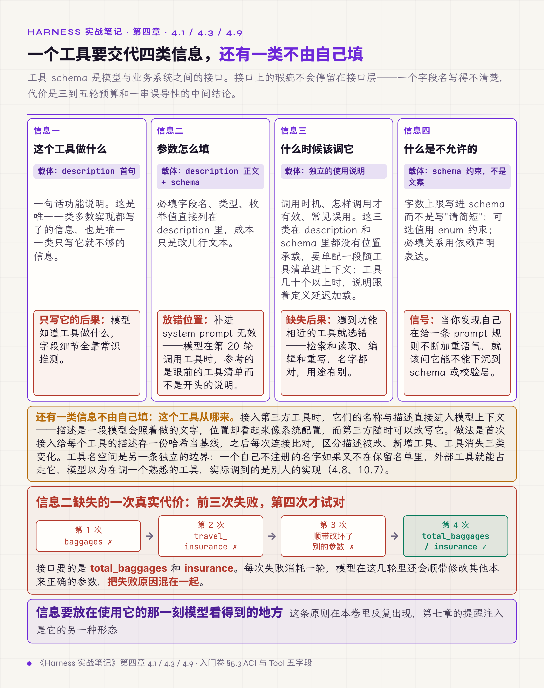
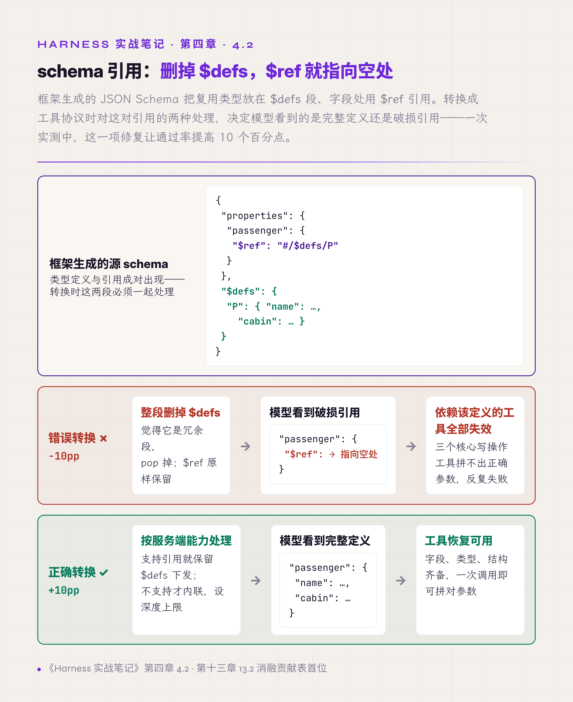
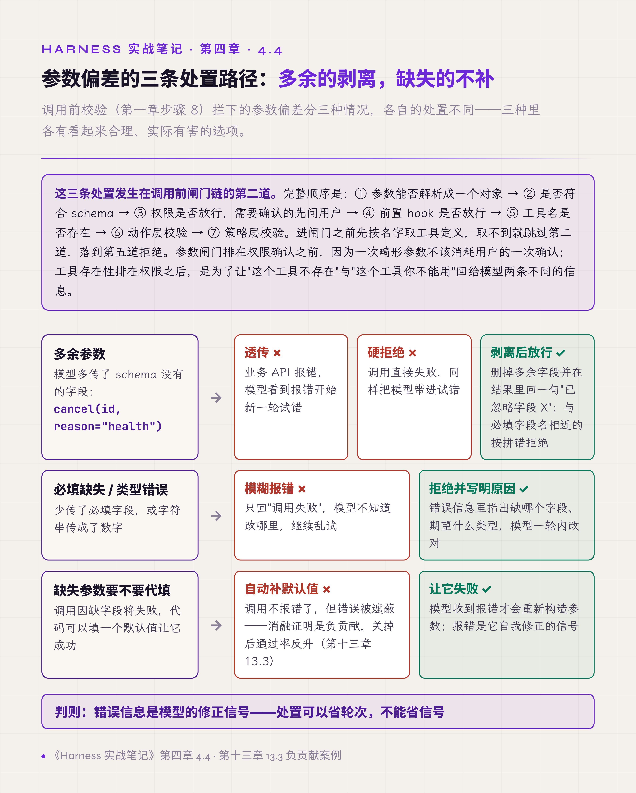
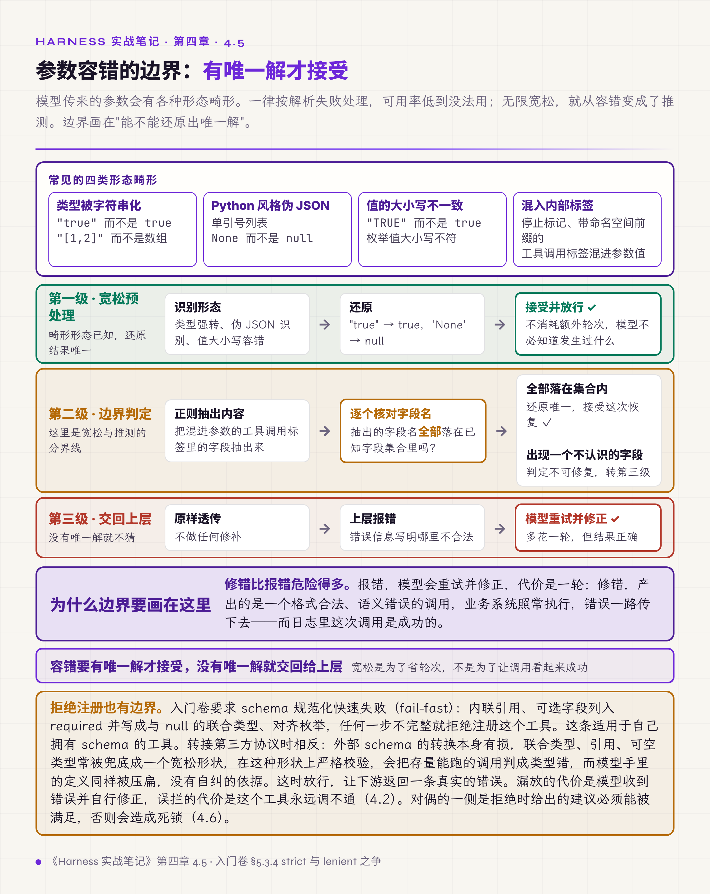

# 四、工具定义与参数处置

工具 schema 是模型与业务系统之间的接口。接口上的瑕疵不会停留在接口层，会被模型放大成反复试错：一个字段名写得不清楚，代价不只是一次调用失败，而是三到五轮预算和一串误导性的中间结论。

这一层的单点修复回报最高。入门卷 §5.3 用一整节讲智能体-计算机接口（agent-computer interface，ACI）。这个说法出自 SWE-agent（Yang et al. 2024），主张按 agent 的使用方式来设计工具接口：工具是给 agent 用的，不是给人用的。那一节还给出了 Tool 五字段与 Registry 的三件事。本章讲那套接口在真实模型面前的失效方式。

## 4.1 description 要列出必填字段、类型、枚举值

工具 description 的常见写法是一句话功能说明："创建一个预订"。

模型由此只知道工具做什么，字段细节靠常识推测。一次真实的表现是：接口要求 `total_baggages`，模型传 `baggages`；接口要求 `insurance`，模型传 `travel_insurance`。前三次调用都失败，第四次才试对，每次失败消耗一轮，而这几轮里模型还会顺带修改其他本来正确的参数，把失败原因混在一起。

试过的无效做法是在 system prompt 里要求模型只用 schema 里定义的参数。规则在场，模型仍按常识先猜字段名。它失效的原因和第一章步骤 5（注入提醒）相同：规则离使用它的时刻越远，被遵循的概率越低。system prompt 在上下文的最前面，与具体工具之间没有绑定；模型在第 20 轮挑工具、填参数时，参考的是眼前的工具清单。

有效的位置是 description 本身：直接列出必填字段名、类型、枚举值，成本只是改几行文本。

**信息要放在使用它的那一刻模型看得到的地方。** 这条原则在本卷里反复出现，第七章的提醒注入是它的另一种形态。

*图 4.1 · 一个工具要交代的四类信息与各自的载体*

## 4.2 schema 引用要内联展开

框架自动生成的 JSON Schema 常把复用的类型放进 `$defs` 段，字段处用 `$ref` 引用。

转换代码认定目标协议用不到 `$defs`，把它连同 `$schema`、`title` 一起删掉，`$ref` 却原样保留，引用指向了空处。按这份 schema 校验入参时解不开引用，凡是用到这些定义的调用一律被拒，模型怎么改参数都过不去。报错指向的是 schema 自身，看不出参数哪里错，这批工具就此集体不可用。

这个故障最难的地方在归因。表面现象是"模型的工具调用能力突然变差"，几个写工具全部失效而读工具正常，很容易被判成模型能力问题，进而做出换模型、调 prompt 这类无效动作。真正的原因在一行 schema 转换代码里。

一次实测中，修复前后两次全量评测之间，通过率从 74% 升到 92%；按失败任务归因，约 10 个百分点来自这一项，模型侧未做任何改动。

有效做法分两种情况：

- 服务端声明支持引用的，保留 `$defs` 原样下发；
- 不支持的，转换时遍历 `$defs`，把每个 `$ref` 替换为定义原文。内联要设深度上限，递归定义内联不了。

入门卷 §5.3.4 给了更完整的要求：schema 规范化要快速失败（fail-fast），内联引用、可选字段也列入 `required` 并写成与 `null` 的联合类型、对齐枚举类型，任何一步不完整，就拒绝注册这个工具。开启模型侧严格模式（strict，服务端用约束解码保证模型输出符合 schema，只支持 JSON Schema 的一个子集）时，残缺的 schema 会直接被服务端以 400 拒绝；本节的静默失败出现在非严格模式。

拒绝注册、严格校验这套做法有边界：它适用于自己拥有 schema 的工具。转接第三方协议时情况相反。外部 schema 的转换本身有损，联合类型、引用、可空类型常被兜底成一个宽松形状；在这种形状上做严格校验，会把存量能跑的调用判成类型错，而模型手里的定义同样被压扁，它没有自行纠正的依据。这时应当放行，让下游返回一条真实的错误。漏放的代价是模型收到错误并自行修正，误拦的代价是这个工具永远调不通。

**工具集体失效，先查 schema 管线，不要先怀疑模型。**

*图 4.2 · $defs 引用的两种转换与各自的后果*

## 4.3 工具另配使用说明，写明何时调用

description 说明了工具做什么，schema 约束了参数怎么填。还有三类信息在这两处都没有位置承载：什么时候该调这个工具、怎样调用才有效、常见的误用是什么。

缺失时，模型只能靠工具名和参数名推断使用时机。遇到功能相近的工具就会选错：检索和读取、编辑和重写，名字都对，用途有别，模型按字面理解挑一个，然后在错误的工具上反复调整参数。

有效做法是每个工具在 schema 之外配一段使用说明，随工具清单进入上下文。两者分工清楚：schema 约束格式，说明引导使用。使用说明常驻清单的前提是工具数量少；几十个以上时，说明跟着定义走，延迟加载（第一章步骤 4 讲的目录与定义分开）。

## 4.4 多余参数剥离，缺失参数不补

模型生成的参数有两类偏差：多出 schema 没有的参数，或漏掉必填参数。

对多余参数，透传和硬拒绝都不好。透传让业务 API 报错，模型看到报错开始新一轮试错；硬拒绝让调用直接失败，同样把模型带进试错。这两种处理的代价都是轮次。

对缺失参数，有一个看起来体贴的做法：自动填入默认值，让调用成功。第十三章 13.3 记录了同一类容错写法的后果：参数解析失败就换成空对象、照常调用工具，这段代码留了四个多月，遮蔽了模型本该收到的错误信号。

正确处理按情况分开：

- 多余参数剥离后放行，工具结果里附一句"已忽略字段 X"，否则模型以为它生效了，下一轮照传；
- 多余字段与某个必填字段名相近（大小写不同、多了或少了前后缀）时，按拼错处理，拒绝并指出正确名字；
- 必填缺失或类型错误，拒绝并返回写明原因的错误；
- 缺失的值不代填。

这里的"大小写不同"指字段名。下一节的宽松预处理也有大小写容错，但只作用于参数的值，不作用于字段名，分界见 4.5。

**处置可以省轮次，不能省信号。**

*图 4.3 · 参数偏差的三条处置路径*

## 4.5 参数容错要有明确的失败边界

上一节讲参数取舍，这一节讲参数本身的形态畸形。

部分模型会把数组、布尔、数字序列化成字符串，传来 `"true"` 而不是 `true`、`"[1,2]"` 而不是数组；也会传出 Python 风格的伪 JSON，比如单引号列表、`None` 而不是 `null`；还会把内部的停止标记或工具调用标签混进参数里，让本应是纯 JSON 的字段变成一段带标签的文本。

这些畸形如果一律按解析失败处理，可用率会低到没法用。所以要做一层宽松预处理：类型强转、大小写容错、常见伪 JSON 形态识别。

其中大小写容错与 4.4 的分界是：**值的大小写可以容错，字段名的大小写不容错。** `"True"`、`"TRUE"` 可以转成布尔值 `true`；枚举值忽略大小写后只匹配到一个候选时，可以改成那个候选。字段名大小写不对，则按 4.4 当作拼错，拒绝并告诉模型正确的名字：值的大小写多半是序列化习惯造成的噪声，而字段名不对说明模型对 schema 的理解有偏差，让它收到这条错误，后续调用才会改过来。

宽松也有边界，越过边界就变成了推测。一个真实的分界线是：模型把带命名空间前缀的工具调用标签混进参数时，可以用正则把内容抽出来，**但只在抽出的字段名全部落在已知字段集合里时才接受这次恢复**；只要出现一个不认识的字段，就判定不可修复，原样透传，让上层报错。

举个示意的例子。某工具的已知字段是 `command` 和 `timeout`，模型传来的 `command` 值是 `ls -la</ns:parameter><ns:parameter name="timeout">30`：它把下一个参数连同标签一起写进了上一个参数的值里。正则能从中抽出 `command = ls -la`、`timeout = 30`，两个字段名都认识，接受恢复。如果抽出来的是 `timout`，哪怕只差一个字母，也不接受。

理由是修错比报错危险得多。报错时模型会重试并修正；修错则产出一个格式合法、语义错误的调用，业务系统照常执行，错误一路传下去。

**容错要有唯一解才接受，没有唯一解就交回给上层。**

*图 4.4 · 参数容错的三档处理与失败边界*

## 4.6 不可重试的错误要在文案里明说

工具失败之后，模型的默认反应是重试。这个反应在多数情况下是对的，但有一类错误重试没有意义，而且会连续消耗轮次，直到预算耗尽。

这类错误在实践中至少出现过四种形态：

- 执行环境已经断连（例如远程沙箱已被回收），重试只是在失效的环境上空转；
- 工具输出因为超长被截断，模型以为重试能拿到完整结果，而重发同一调用得到的还是同样被截断的输出；
- 编辑器缺少必要的上下文信息，这是环境限制，而不是操作错误；
- 策略层拒绝（例如访问了策略禁止的路径），重试永远得到同一个拒绝。

试过的无效做法是给这些错误分配"不可重试"的错误码。错误码是给代码看的，模型看到的是文案；文案里如果只写"操作失败"，模型没有任何依据判断该不该再试。

有效做法是把"重试没有用"直接写进模型可见的错误文案，并说明原因和替代动作：环境已断连，请告知用户并停止；输出被截断，改用分段读取，而不是重发同一调用。

与之相对，还有一条要求：**拒绝时给出的建议必须是模型能执行的。** 有过一个实际的死锁缺陷：写一个本会话没读过的文件会被拦下，拦截文案要求先读一遍，而那个读写记账器只记创建、修改、删除三类操作，读操作没有入账路径。于是模型照做，读完再写，仍然撞上同一句拒绝。处理办法有两点：

- 这类规则依赖的记账器不可用时应当放行，因为那时它给的建议无法被满足；
- 把它做成自动检查：同一条拦截在它给出的建议被满足之后，不得再次出现。

**面向模型的错误信息是一种 prompt**，要按 prompt 的标准写，不要把内部异常字符串直接抛给它。

## 4.7 空值语义要显式定义

工具结果在回到模型前要经过序列化和成败判定。

一个真实的缺陷是 `null` 在序列化时被写成字符串 `"{}"`。判定逻辑看到一个非空字符串，把"没有返回"读成"成功返回了空对象"，于是失败被记为成功，模型在错误前提上继续执行，后面每一步都建立在一个不存在的结果上。

这类缺陷的排查成本极高，因为日志里两条路径的记录完全相同。根因是判定读的是序列化之后的文本。

有效做法有两条：

- 成败判定放在序列化之前，看工具返回的原始值与状态码；序列化只负责把结果转成模型能读的文本，不参与判定；
- 把 `null`、空对象、空字符串三种值的含义在代码里显式定义，并各写一条边界测试。

**边界值的语义要写下来**，不能靠每个调用点各自理解。

## 4.8 工具清单每轮重新获取

出于省一次查询的考虑，工具清单常在循环开始前获取一次，整个回合复用。

运行中由 hook 注册的新工具进不了这份缓存：注册调用返回成功，日志显示注册完成，模型却始终看不到它。开发者会怀疑注册逻辑有缺陷，而实际上注册是对的，只是模型看的是一份旧清单。

有效做法是清单每轮重新获取。代价要记着：清单成员一变，整份前缀缓存从头失效（第一章步骤 4），所以新工具在两轮之间加入（上一轮的工具执行全部结束、下一次模型调用之前），不在一轮的工具执行过程中加入。

这里有条边界要同时说明，两件事容易被混为一谈：

- **同名工具在运行中变更 schema 应当禁止。** 模型已经按旧定义理解了它，中途换定义会让调用以最难排查的方式失败：模型按旧 schema 拼参数，校验按新 schema 拒绝，表现为模型突然不会用这个工具。
- **新工具在两轮之间加入清单应当支持。**

前者破坏已经建立的契约，后者扩充下一轮的选项。入门卷 §5.3.4 讲的禁止热改是前一半，这条补的是后一半。

清单里还有一部分内容不归自己控制。接入第三方工具时，它们的名称与描述直接进入模型上下文。描述是一段模型会照着做的文字，而它的位置看起来像系统配置，在描述里藏入恶意指令，就是 MCP 生态里所说的工具投毒（tool poisoning）。第三方还可以在工具获批之后随时改写这段文字，本地不会有任何提示，这种手法称为 rug pull。有效做法是首次接入时给每个工具的描述存一份哈希作为基线，之后每次连接都比对，区分出描述被改、新增工具、工具消失三类变化并提示。第十章 10.7 讲外部数据要包装后再进上下文，工具描述是这条边界上最不像外部数据的一种形态。

**工具名空间是另一条独立的边界。** 模型按名字理解工具，提示词和用户习惯里引用的也是名字。一个自己不注册的名字，如果又不在保留名单里，外部工具就能占走它，这称为工具遮蔽（tool shadowing）：模型以为自己在调用一个熟悉的工具，实际调到的是别人的实现。所以保留名单要覆盖计划内会用到的全部名字，不能只跟着当前已注册的清单走。

## 4.9 能用 schema 约束的不要只写在 prompt 里

有一类规则反复写进 prompt，却反复失效。典型例子是"单一简单任务不要用待办工具"：写了提醒，模型照样为一个小任务建一条待办；把语气加重到"重要"，还是不听；加到"绝不"，依然有例外。

这里有个可用的信号：**当你发现自己在给一条 prompt 规则不断加重语气，就该问它能不能下沉到 schema 或校验层。**

上面那条规则的最终解法，是在 schema 里要求待办列表至少两条。模型可以忽略文字指引，不能绕过参数校验。这条约束由谁执行要写清：服务端严格模式只执行 schema 的一个子集（有的服务数组最少条数只认 0 和 1，字符串长度上下限被直接忽略），子集之外的约束由第一章步骤 8 的 schema 校验在 harness 侧执行，代价是多一轮拒绝。两种执行方都比文字指引硬，只是硬的位置不同。

同一个思路的其他应用：

- 字数上限写进 schema，而不是写"请简短"；
- 枚举值用 enum 约束，而不是在描述里列出可选值；
- 必填关系用 schema 的依赖声明表达，而不是写"如果传了 A 就必须传 B"。

文字指引和结构约束的差别不在风格，而在强度。**需要强度的时候，不要只用文字。**

## 本章与前两卷的对应

入门卷 §5.3 的 Tool 五字段（名称、描述、参数 schema、执行体、策略）在本章各有对应故障：4.1 和 4.3 讲描述，4.2 和 4.9 讲 schema，4.5 和 4.7 讲执行体的入口与出口，策略留到第十章。§5.3.4 的 strict 与 lenient 之争，在 4.5 里有了一条具体的分界线：宽松只到唯一解为止。§5.3.6 讲错误回给模型时选原样（raw）还是脱敏后（sanitized）的文本，4.6 补的是第三项要求：不管选哪种，都要说清能不能重试，以及拒绝时给的建议要能被满足。

第二卷 §8.11 把工具契约定义为 schema、语义、编排三层校验加防呆设计，本章 4.2 与 4.5 是第一、二层的实际失效方式；4.7 是第二卷 §8.10 结果边界的失效方式。第二卷工作制品汇编（附录）中的工具契约登记表（M）要求每个工具登记参数、副作用、失败模式，4.6 说明失败模式这一栏要区分可重试与不可重试。
