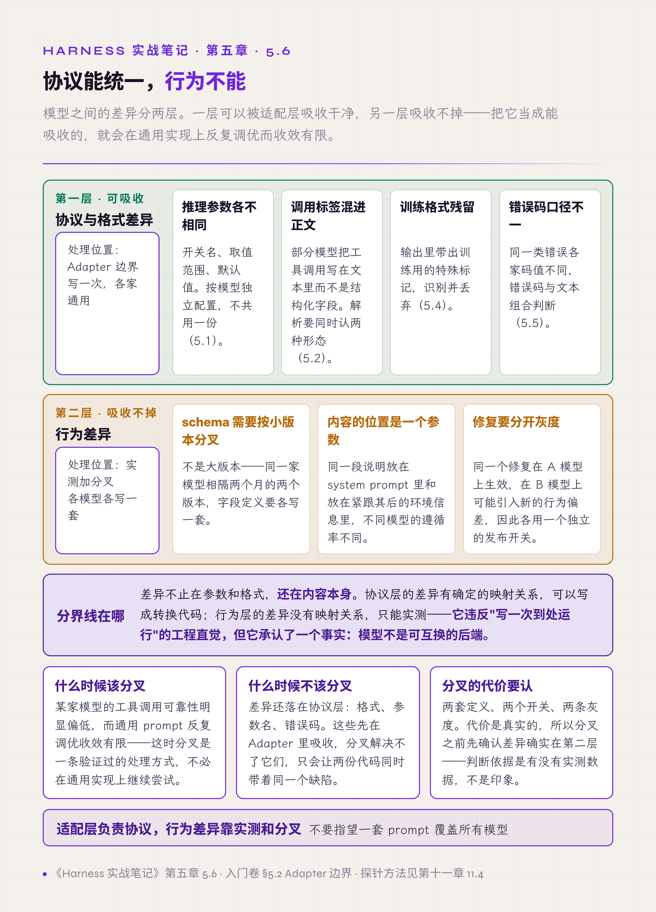

# 五、模型协议与输出解析

这一层的职责是吸收各家模型 API 的差异，让业务代码面对统一接口。

入门卷 §5.2 把它定为 Adapter 边界，并指出发射端与接收端是同一条接缝的两侧。本章讲这条接缝上的六个故障，其中最后一个会推翻一个常见的工程直觉：写一套通用适配层，各家模型都能跑。

## 5.1 推理参数按模型独立配置

接入多家模型时，开启深度推理的参数各家不同：有的要求传一个嵌套对象，有的传字符串，有的传布尔字段，字段名各不相同。还有更细的要求：某家模型的助手消息在携带工具调用时，必须同时带一个空的推理内容字段，缺了直接返回 400。更常见的形态是要求把当轮产出的推理内容原样带回。推理内容要不要回传，要按请求是否带工具清单分两种情况处理，5.3 展开。

初版实现通常是在调用处加模型条件分支。这个做法一开始很自然，问题出在扩散：分支会随调用点复制，每接一个新模型要改全部位置，漏改一处就是运行期 400，而这类错误往往只在特定路径（比如带工具调用的那一轮）才触发，测试很容易漏掉。

有效做法是每个模型定义独立的参数集，请求组装时统一合并，业务代码里不出现模型判断。

还有一类差异只能靠实测记下来：部分模型的关闭思考参数传了不起作用，还让响应变慢。处置是干脆不传这个参数，用默认模式，事后在输出层剥掉思考标签。这类条目写不进通用适配表，它属于每个模型自己的参数集。

## 5.2 解析要兼容正文里的调用标签

工具调用的标准形态是结构化字段。但部分模型会把工具调用以文本标签的形式写在回复正文里，而结构化字段留空。

如果解析层只认结构化字段，这类调用会被当作普通文本丢弃。从结果看是模型"没有调工具"，实际是解析层漏了。这是一种假阴性，而且它的表现具有欺骗性：模型的回复里明明写着要调用工具，日志里却没有任何工具调用记录，很容易被判成模型不听指令。

一次评测中，多个任务因此被误判为失败，直到逐条比对模型原始输出才发现。

同一类假阴性还有第二种形态：部分服务端在结束原因字段（OpenAI 兼容接口的 `finish_reason`，Anthropic 的 `stop_reason`）里写"正常结束"，而这一轮其实产出了工具调用。解析层如果按结束原因决定要不要取调用，就会把它整个吞掉。处置是流结束之后额外检查已经累积的调用列表，取不取调用不看结束原因字段。这个字段仍然要读，它的用途是第二章讲的终止原因记录，即记下本轮以什么方式结束（正常结束、输出被截断等）；两个用途分开。

有效做法是解析层同时识别结构化字段和正文标签两种形态。入门卷 §5.2 已经收录了这条判例，本卷补一句代价：这个缺陷会污染评测结论，你以为在测模型能力，实际在测解析层。

## 5.3 出口处剥离推理内容

第一章步骤 7 讲了推理内容要与回复分开。工程里最常漏掉的出口是评测。

评测系统里扮演用户的模拟程序由另一个 LLM 担任。agent 的输出如果原样传给它，模拟用户会把推理文字当成正式回复来理解，从那一回合起对话偏离，整个任务作废。而失败原因在日志里表现为"模型答非所问"，看不出是传递环节的问题。

有效做法是在 agent 输出与任何下游 LLM 之间加统一清洗，剥离推理段与残留的调用标签。

还有一个方向要判断：推理内容该不该回传给服务端。这件事按本次请求带不带工具清单分成两种情况，没有通用答案。

| 情况 | 各家要求 | 回传的收益与代价 |
|---|---|---|
| 不带工具清单的纯对话轮 | 部分模型的兼容接口本来就会剥掉输入里的推理字段。一次实测里带与不带，计费的输入 token 完全相同，也从不报错 | 回传没有收益 |
| 带工具清单的轮次 | 推理内容可能是消息结构的一部分。有的模型要求把此前所有轮次的推理字段完整回传，缺了直接返回 400；有的要求助手消息里的推理块原样带回，重建消息或按类型过滤掉其中一部分同样返回 400；还有的不报错，但官方建议在两次工具调用之间把推理项带回，模型才能接着上一段推理往下走。5.1 那条 400 属于这种情况 | 按模型要求回传 |

计费也因模型而异：有的模型跨轮丢弃历史推理块、不计费；有的默认保留并按输入 token 计费，长会话里这部分持续累积，好处是保留的推理块能命中缓存。

所以推理内容是否写进消息历史，是 5.1 说的那份按模型登记的参数集里的一项。无条件剥离的只有一处：流向下游 LLM 的那一份。

**消息可见性是一个独立的工程问题。** 只要接收方也是模型，就要问一句它该看到什么、不该看到什么。

## 5.4 训练格式的残留要识别并丢弃

模型输出里会混入训练时的格式痕迹，形态有几种：

- 思考标签出现在正文，而不是独立的推理字段里；
- 输出以对话格式的角色前缀开头；
- 工具调用参数里混进内部标记或停止标记，让本该是纯 JSON 的字段解析失败。

还有一种形态是全部输出都进了推理字段，正文为空。处置是当前步没有正文时，把推理增量当作正文渲染，否则界面上这一轮什么都不显示。这个替换只在渲染路径做，不写进消息历史：一旦写进去，推理内容就以正文的身份进入了历史，之后每一轮都会被当作正文回传，5.3 按模型定下的回传规则就被绕过了。

这些不是模型"犯错"，而是训练数据的格式被带了出来，且各家模型带出来的内容不一样。自部署或经兼容接口调用时，还有一个来源在服务端：对话模板（chat template）或推理内容的解析配置与模型不匹配，本该被切分出去的标记就会原样留在正文里。

有效做法分两步：

1. 解析前按已知标记列表清除，并记录**具体是哪一个标记出现了**。这份记录会随着接入的模型增多而增长，是排查新模型接入问题的第一手材料。
2. 输出层做形态识别，首行带思考标签、以角色前缀开头这类明显的坏输出直接归类丢弃，不要送给下游。

**清洗规则要留埋点。** 没有埋点就不知道哪家模型混入了什么，只能等用户反馈。

## 5.5 错误分类不能只依赖错误码

跨 provider 的错误处理有一个直觉：按错误码分类。实践中这个直觉在三个方向上失效。

**错误码会被复用。** 一个本该可重试的限流错误，被后端用"参数无效"这一类码返回，而这类码在默认策略里是不可重试的。只看码，一次限流就变成永久失败。

**同一个原因有多种文案。** "输入超长"这件事，各家的措辞完全不同，且没有统一的结构化错误码。实践中的处理是维护一份字符串匹配规则表，每条对应一种观察到的措辞。这张表会持续增长，而且要把两类措辞分开登记：一类是自己规范化过的标准消息，文案由自己控制，可以精确匹配，改文案时同步改规则即可；另一类是第三方的原始措辞，对方升级时可能悄悄改掉，只能做宽松的子串匹配，还要记下来源，对方改了文案时才知道该改哪几条。

**跨进程传递会丢结构。** 错误对象跨 worker 或 RPC 边界之后，结构化字段丢失，只剩消息字符串，基于类型判断的分支全部失效，本该走专用路径的错误被当成普通异常。

还有一个环境变量层面的问题：自动化调用的子进程会继承用户的语言设置，命令输出被本地化，所有基于英文子串的匹配逻辑一起失效。这个故障只在部分用户机器上出现，本机复现不了。处置是启动子进程时显式设置 `LC_ALL=C`（需要保留 UTF-8 时用 `C.UTF-8`），让命令输出固定为英文。

有效做法是错误码与文本组合判断，并且预期这份规则表会长期增长：它记录的是历次运行遇到过的实际错误形态，而不是一次能写全的配置。

实现上有两个细节。一是要遍历整条成因链，不只看最外层：包装过的错误里，真正的原因常在下一层；判断时组合三项，即错误名、大小写归一之后的消息子串、传输层错误码。二是跨进程之后结构化字段已经丢失，消息子串是仅存的线索，所以这份规则表在跨进程场景里是必需品。第三章 3.11 给出的图片数量触发线，最初就是从一条"请求包含过多图片或文档"的错误文案里反推出来的。

## 5.6 模型不是可互换的后端

前面五节都在讲怎么把差异吸收进适配层。这一节讲吸收不掉的那部分。

有一个反直觉但反复被验证的事实：**差异不止在参数和格式，还在内容本身。** 三个层次的证据：

同一个工具的参数 schema 会因为模型的小版本更新而需要分叉：不是大版本，而是同一家模型相隔两个月的两个版本，字段定义要各写一套。<!-- 待作者补充：分叉的具体例子（哪个工具、哪个字段、两个版本各自怎么写、为什么要分开）。 -->

同一段说明文字，放在 system prompt 里和放在紧跟其后的环境信息消息里，不同模型的遵循率不同。也就是说**内容的位置本身是一个按模型调的参数**。

同一个缺陷的同一个修复，对不同模型要分开灰度：修复在 A 模型上生效，在 B 模型上可能引入新的行为偏差，因此两个模型各用一个独立的发布开关。

这些做法违反"写一次到处运行"的工程直觉，但它承认了一个事实：模型不是可互换的后端。

对多 provider 项目来说，这并不意味着必须立刻分叉，而是：当某家模型的工具调用可靠性明显偏低，而通用 prompt 反复调优收效有限时，**分叉是一条验证过的处理方式，不必在通用实现上反复尝试**。入门卷 §5.2 讲 Adapter 边界能吸收协议差异，本节补的是边界之外：协议能统一，行为不能。

**适配层负责协议，行为差异要靠实测和分叉，不要指望一套 prompt 覆盖所有模型。**

*图 5.1 · 模型差异的三个层次与各自的处理位置*

## 本章与前两卷的对应

入门卷 §5.2 提出的 Adapter 边界在 5.1、5.5 里得到验证：没有这层边界，模型 API 一升级，整个 harness 就要跟着改。§5.2 收录的正文标签判例，在 5.2 里补上了它对评测结论的污染。§6 讲的推理内容跨轮处理权衡，讨论的是带工具清单的轮次：对部分模型，推理内容是消息结构的一部分，缺了会返回 400；另一些模型不报错，只是建议带回。5.3 补上了不带工具清单的情况，并把两种情况合成一份按模型登记的规则；5.4 讲回传之前要清除什么。

第二卷 §2.5 把系统的确定性分成保证、尽力、推断、未知四级。5.5 的错误分类属于"推断"这一级：既不能保证也不能穷举，只能靠不断增长的规则表逼近。因此正确的做法是承认它会漏，而不是假装分类完备。
