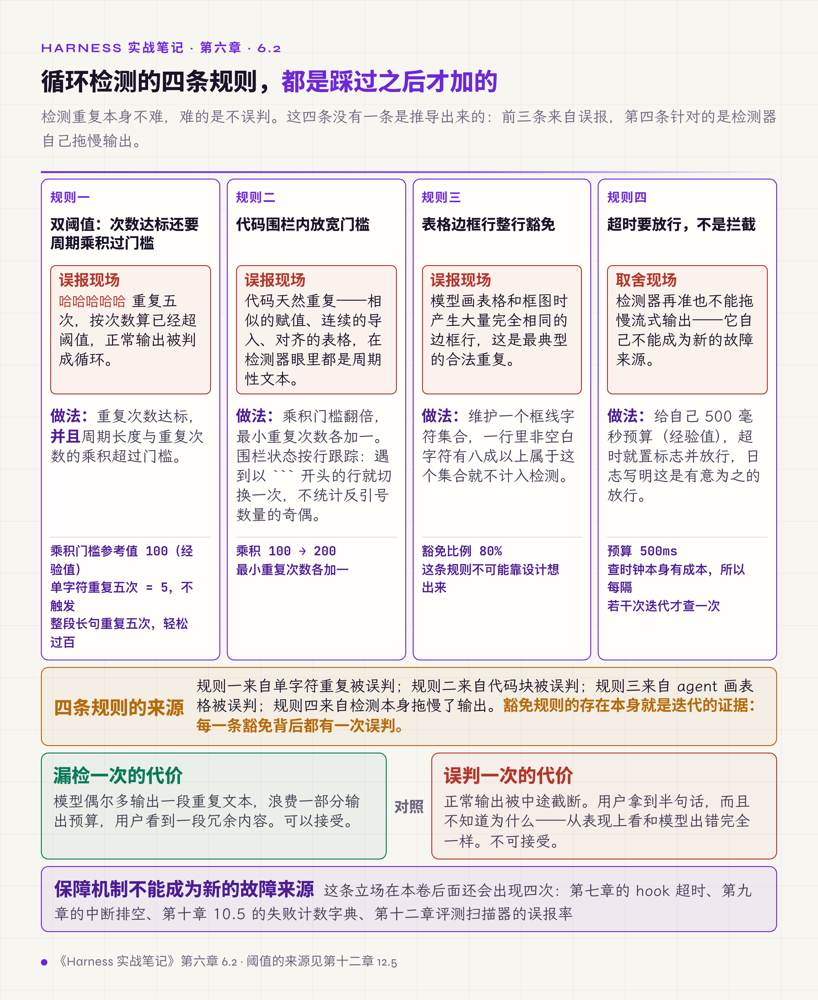
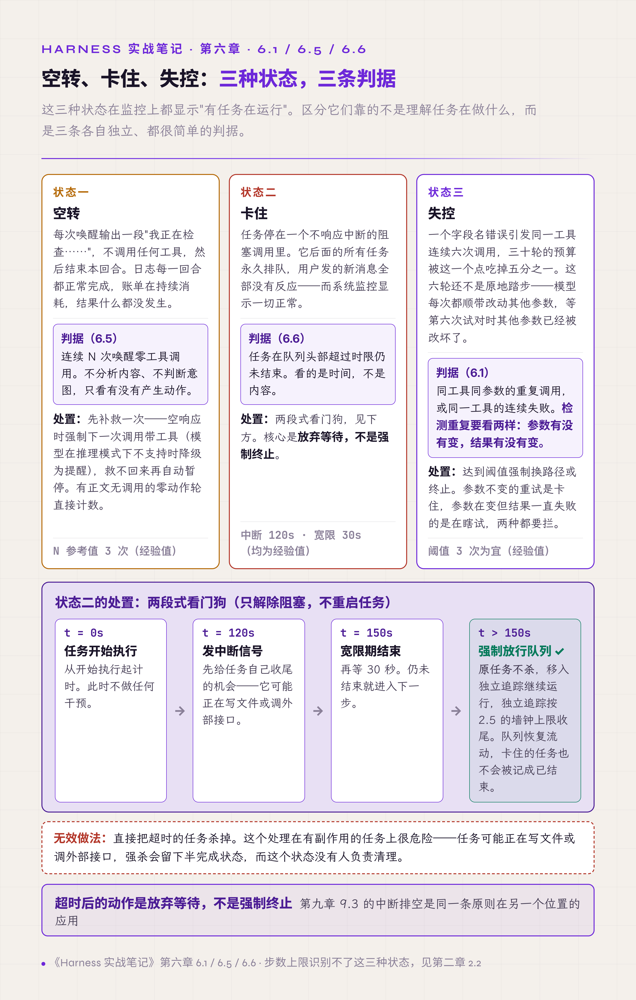

# 六、循环控制与空转检测

第一章步骤 12 列了循环的四个常规出口：继续下一轮；模型本轮不再请求工具，回合结束；模型发起移交请求，转人工；达到轮数上限，强制终止。另有中断、出错两个异常出口。这一章讲出口不完备、或者出口判断本身出错时会发生什么：循环停不下来、模型原地重复、任务空转消耗预算、整条队列被一个卡住的任务阻塞。

第二章讲过一件相邻的事：步数上限不能当作循环控制手段。本章是它的补充，给出真正能识别失控的几条判据。

入门卷 §5.1 强调，生产实现里循环在哪些位置决定继续下一轮、在哪些位置终止，都需要单独设计。本章是这句话的反面案例集。

## 6.1 重复失败的调用要强制换路

参数错了，模型的自然反应是调整一下再调一次。没有干预时这个过程可以持续很久。

一次实测里，一个字段名错误引发同一工具连续六次调用，三十轮的预算被这一个点吃掉五分之一。更麻烦的是这六轮不是原地踏步：模型每次都会顺带改动其他参数，等到第六次试对时，其他参数已经被改坏了。

有效做法是监测两种信号：同工具同参数的重复调用、同一工具的连续失败。达到阈值（三次为宜，经验值，按场景调整）就强制换路径或终止。业界常把这类做法叫熔断（circuit breaker），这里只借用了熔断器"打开"这一步：达到阈值就不再放行，没有冷却一段时间后再半开试探的过程。

还有第三种信号：同一个调用被同一个理由连续拒绝。模型申请某个动作被权限层拦下，它换一下措辞再来一次，理由不变，轮次就这么消耗掉。有效做法是按"工具名加参数指纹"记录被拒次数，达到阈值之后把拒绝文案换成换策略的指引。参数指纹要与键的顺序无关：先把参数对象按键名排序再取哈希，`{a, b}` 和 `{b, a}` 才会算成同一次调用。

这一类信号的处置只是换文案，不直接拦截，因为拒绝理由随时可能解除，比如用户第四次决定批准。同样的道理，权限检查要照常先跑，不能根据计数提前判定"这次也会被拒"而跳过检查：那样会让已经解除的拒绝继续生效。

**检测重复要看两样：参数有没有变，结果有没有变。** 参数不变的重试是卡住，参数在变但结果一直失败的是在瞎试，两种都要拦。

## 6.2 循环检测的难点在防误判，不在检测

上一节讲的是工具调用层面的重复。还有一类重复发生在模型输出内部：模型开始输出周期性重复的文本，一行、一段、乃至整块内容反复输出，直到耗尽输出预算。

检测重复本身不难，难的是不误判。这一节的四条经验都是踩过之后才加的，没有一条是推导出来的：前三条来自误报，第四条针对的是检测器自己拖慢输出。

**只看重复次数必然误判。** "哈哈哈哈哈"重复五次，按次数算已经超阈值。有效做法是双阈值：重复次数达标，**并且**周期长度与重复次数的乘积超过门槛（参考值 100，经验值）。单字符重复五次乘积只有 5，不触发；一整段长句重复五次，乘积轻松过百。

**代码块内要放宽。** 代码天然重复：相似的赋值、连续的导入、对齐的表格。在代码围栏内把门槛放宽（乘积门槛翻倍，从 100 提到 200；最小重复次数各加一），可以消掉大部分代码块误报。围栏状态按行跟踪：遇到以 ```` ``` ```` 开头的行，就在"围栏内"与"围栏外"之间切换一次。不要统计一行里反引号数量的奇偶，行内代码的反引号也会被计进去，状态就乱了。

**表格边框行整行豁免。** 模型画表格和框图时会产生大量完全相同的边框行，这类行是最典型的合法重复。做法是维护一个框线字符集合（`─ │ ┼ ═ | - +` 这类），一行里非空白字符有八成以上属于这个集合，就不计入检测。这条规则不可能靠设计想出来，是观察到 agent 画表格被误判之后加的。

**超时要放行而不是拦截。** 检测器给自己 500 毫秒预算（经验值），超时就置标志并放行，日志写明这是有意为之的放行。取舍很明确：检测器再准也不能拖慢流式输出，漏检的代价是偶尔卡一次，误判的代价是正常输出被截断。还有一个相关的细节：查时钟本身有成本，所以每隔若干次迭代才查一次。

**保障机制不能成为新的故障来源。** 这条立场在本卷后面还会出现四次：第七章的 hook 超时、第九章的中断排空、第十章 10.5 的失败计数字典、第十二章评测扫描器的误报率。



*图 6.1 · 循环检测的四条防误判规则与各自的来源*

## 6.3 检测到之后要区分硬失败与软纠正

检测到循环，处置有两条路径，选哪条取决于场景。

**硬处理**是终止本回合，抛出结构化错误，标记为不可重试，给用户的说明是模型陷入重复输出、建议换模型或开新会话。适用于已经确认无法自愈的情况。

**软处理**是不终止，往对话里插一条提醒，按循环的种类给不同措辞（单行字符重复、多行重复、跨消息重复各一套），并要求模型不要向用户提及这条提醒。适用于还能纠正的情况。

两条路径并存不是没想清楚，而是有先后关系。规则是逐级升级：**第一次命中走软处理，软处理之后同一种重复再次出现就走硬处理。** 事前判不出模型能不能纠正，试一次是最便宜的判法。

## 6.4 循环内插入消息要保持协议不变量

上一节的软处理要往对话里插消息，插入的位置有讲究。

一个真实的缺陷：检测到重复后就地插入提醒，插入点落在工具结果序列中间，破坏了"工具调用消息必须紧跟对应结果消息"的协议约束，模型 API 直接返回 400。于是出现这样一种情况：为了防止模型卡住而加的机制，自己终止了这一回合。

有效做法是循环内产生的插入消息先进暂存队列，等当轮全部工具结果处理完，再统一追加到末尾。

**修改消息序列前，先确认协议不变量是什么。** 第七章 7.2 会给出另一种更稳妥的注入位置：把提醒挂在最后一条工具结果上。

## 6.5 空转检测：不看内容只看有没有动作

有一类失败比重复更隐蔽：模型没有重复，也没有报错，只是不产生任何有效动作。

典型场景是后台任务或定时唤醒的 agent：每次唤醒后模型输出一段"我正在检查……"的文字，不调用任何工具，然后结束本回合；下次唤醒重复一遍。从日志看每一回合都正常完成，从账单看在持续消耗，从结果看什么都没发生。

无进展分两种：

- **空响应**：既无正文也无调用。单次空响应的成因往往可以恢复，例如严格要求工具调用的模型偶尔返回空响应，故障转移到备用服务端时也会出现一次。
- **零动作轮**：有正文，没有调用。这是真正的空转，直接计数。

空响应在暂停之前先救一次。第一次遇到时，下一次调用把 `tool_choice` 参数设为必须调用工具（例如 `tool_choice=required`），再试一次，并且这一次不计入步数预算。这个强制是安全的：模型正常给出文本回答时会置上一个标志位，强制只在既无正文也无调用的情况下生效，盖不掉真实回答。部分模型在开启推理时不接受这个参数，要按 5.1 的参数集登记，不支持的模型降级为在下一条消息里提醒。

零动作轮用一条极简的判据来处理：**连续 N 次唤醒零工具调用，就自动暂停这个任务**（参考值 3 次，经验值）。不分析内容、不判断意图，只看有没有产生动作。

这条判据的价值在于它不需要理解任务在做什么，因此适用于大多数后台场景：定时任务、自动化流程、长时运行的 agent 都该有一条。反例是巡检类任务：如果要检查的状态已经随唤醒消息一起给出，模型看一眼、确认无事、不调用任何工具，本来就是正确结果，这条判据会把它误停。这类任务要么让检查本身走一次工具调用，要么把"确认无事"记成一个显式动作。

**检测无进展的最简形式是检测无动作。** 处置分两步：先补救一次，救不回来再暂停。

## 6.6 卡住的任务要有两段式看门狗

上一节讲任务在空转，这一节讲任务停住不动。

场景是队列化执行：多个任务排队，一个卡在不响应中断的阻塞调用里。后果不止是它自己完不成：它后面的所有任务永久排队，用户发的新消息全部没有反应，而系统监控显示"有任务在运行"，一切正常。

试过的无效做法是直接把超时的任务杀掉。这个处理在有副作用的任务上很危险：任务可能正在写文件或调外部接口，强杀会留下半完成状态。

有效做法是一个两段式看门狗（watchdog；这里只负责解除阻塞，不负责重启被监控的任务）：

1. 先发中断信号（参考 120 秒，从开始执行起算）。这是协作式取消（cooperative cancellation）：由任务在自己的检查点响应信号、自行退出。
2. 再给一段宽限（参考 30 秒）。两个时长都是经验值，按任务类型调整。
3. 宽限期过后任务仍未结束，就**强制放行队列**：原任务不杀，移入独立追踪继续运行，独立追踪按第二章 2.5 的墙钟上限收尾。

这样队列恢复流动，卡住的任务也不会被记成已结束。

**超时后的动作是放弃等待，而不是强制终止。** 第九章讲的中断排空是同一条原则在另一个位置的应用。



*图 6.2 · 空转、卡住、失控三种状态的判据与处置*

## 6.7 子 agent 限两层

任务变复杂后，让子 agent 继续派生自己的子 agent 看起来是顺理成章的扩展。

层级一多，故障定位先失效：出错时分不清是哪一层的哪个工具调用引起的，日志里只有一串嵌套的调用，每一层都声称自己完成了。调试成本随层数迅速上升。

有效做法是层级限定两层：主 agent 之下只允许一层，主 agent 派生的子 agent 不再派生。配套按用途给步数预算：只读探索类 15 步，规划类 20 步，通用类 25 步（经验值）。注意这里的步数预算与第二章 2.2 讲的主任务步数上限是两回事：子 agent 的任务范围本来就窄，给紧一点是合适的。

层数之外还有三件事要一起限。

1. **预算分两本记。** 总账一本，父子与派生分支共用，防止各开一本造成翻倍：重试预算和步数计数器如果不往下传，两层嵌套就是成本翻倍，层数限制挡不住这种放大。局部上限每个子 agent 一个，就是上面按用途给的 15 到 25 步，防止一个子任务吃光总账。同一层里并行派生的数量也要限。
2. **工具面要收窄。** 子 agent 的可用工具应当比父 agent 少，按用途裁剪：只读探索型的子任务给六个只读工具就够。这是第十章 10.6「能力的粒度就是攻击面的粒度」在子 agent 层的对应做法。
3. **上下文不能全量同步。** 把主 agent 的完整历史广播给每个子 agent，token 按 agent 数成倍增长，一份错误的中间状态也会传给所有人。一次实践最后收敛到只同步两样东西：固定格式的任务状态，和每个阶段完成时写下的过程摘要。子 agent 在自己的上下文里工作，结果浓缩后交回主 agent 校验。

入门卷 §5.1 给了成本侧的理由。Anthropic 在介绍其多智能体研究系统时给出过一组数字（anthropic.com/engineering/multi-agent-research-system，2025-06）：相对普通对话，单 agent 约用 4 倍 token，多 agent 约 15 倍。两数相除，多 agent 大约比单 agent 再贵三到四倍，因此什么时候上子 agent 是高门槛决策。近期也有研究在受控条件下比较单 agent 与多种协调架构，方向一致：单 agent 的基线已经较高时，再加协调往往收益递减甚至为负；能拆成并行子任务的收益最大，顺序型任务受损最明显，工具密集的任务容易被协调开销拖累；没有中心校验的架构里，一个 agent 的错误会被放大传到最终结果。<!-- 待作者补充：这项受控研究的出处（论文名、模型、任务集）。原稿的"四成五""放大十几倍"等具体数字，以及上文全量广播"幻觉率高三成、调用次数少一半以上"，找到出处后可按原文补回。 -->

第二卷 §12 给了结构侧的理由：子 agent 就是子 run，父 run 要为每个子 run 承担完整的生命周期照管，子越多父越重。本节补的是调试侧：**层数越多，出错时越难看清问题出在哪一层；限制层数，是为了保住可调试性。**

## 6.8 规则能表达的判断用代码

按意图分发、按任务类型路由这类判断，规则完全可以表达。交给模型做的结果是每次判断都慢、都花钱，还偶尔不一致：同样的输入，今天路由到 A，明天路由到 B，而且没有任何日志能解释原因。

有效做法是每个判断点先问能否写成规则，能写就用代码；模型只承担规则表达不了的判断。

入门卷 §5.2 把这条定成默认起点：路由用代码不用模型，学习型路由是流量和数据积累够了之后的升级选项，不是起手式。第二卷 §12.2 在多 agent 层给了同一条原则的另一种说法：能确定的就别不确定。把该自治的锁进确定性代码，和把该确定的交给模型自由发挥，是同一个错误的两个方向。

## 本章与前两卷的对应

入门卷 §5.1 讲 Agent Loop 里循环在哪里继续、在哪里终止都需要单独设计，6.5 和 6.6 是这句话的证据：缺一个出口（无进展）或缺一条兜底判据（卡住），系统就会以最沉默的方式失效。§8 的四种拓扑（单 agent、本地子 agent、远程 agent、副 harness）与 6.7 的两层限制是同一个决策的两个面：那边算成本，这边算可调试性。6.7 补的是预算继承与上下文同步：重试预算与步数计数器各开一本时，层数限制挡不住成本放大；上下文全量广播时，成本与错误一起放大。

第二卷第五章的 run 状态机在本章有两处对应：6.6 的卡住任务对应那里"等待状态必须自带截止时间"的要求；6.5 的空转对应"终结原因要分类记账"：一个被空转判据暂停的任务，它的终结原因和正常完成必须分开记，否则统计里看不出有多少任务在空转。§9.4 讨论流什么时候算真的结束，6.4 的协议不变量是它的前提：连消息序列都不合法，谈不上结束。
