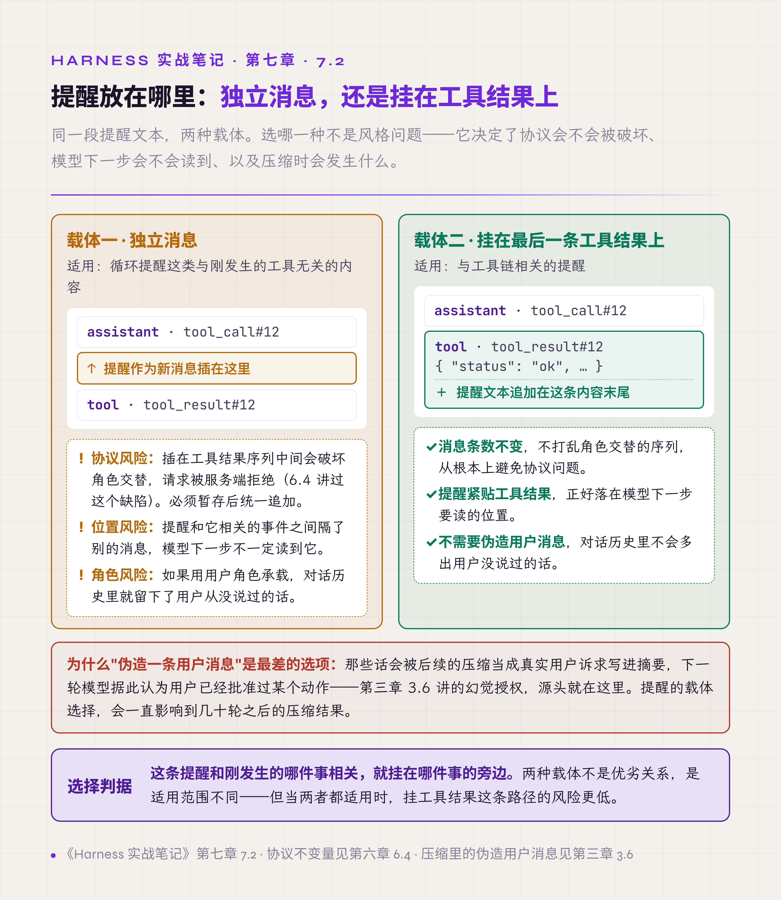
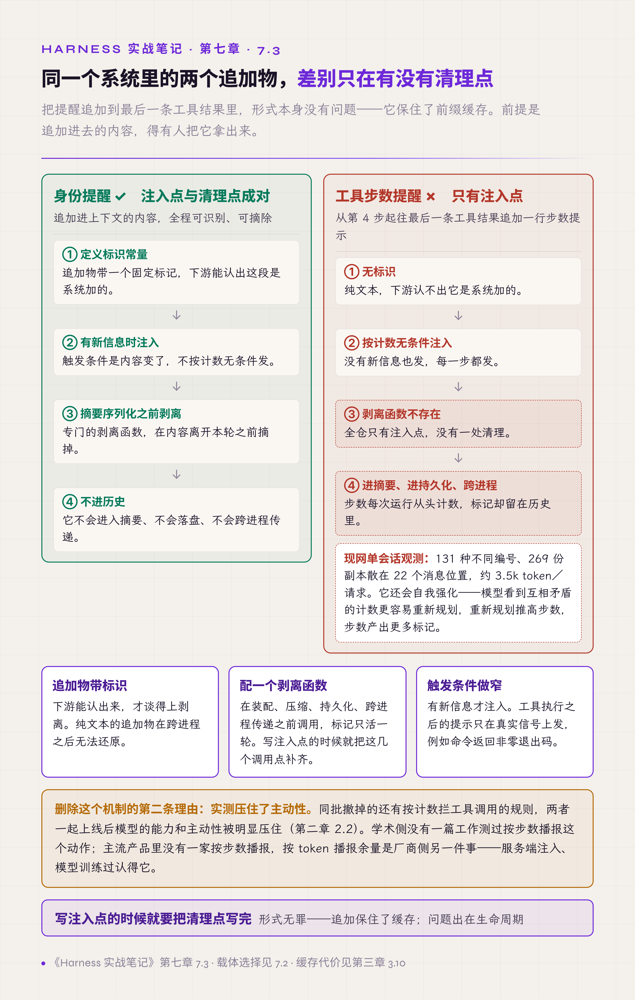
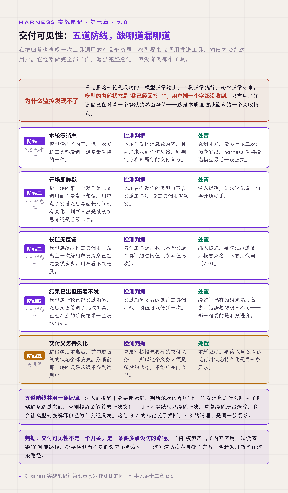

# 七、提醒注入与交付可见性

第一章步骤 5 讲了提醒注入的原理：规则离使用时刻越近越有效。这一章讲五件事——注入的载体怎么选、追加进去的内容怎么清理、执行注入的 hook 本身有哪些问题、这套机制最大的一个用途：让模型产出的内容真的到达用户，以及送到的内容怎么写才读得懂。

最后那件事单列一节。它是本册里防线最多的一个失败模式，因为它的表现最反直觉：模型工作正常、日志完整、没有任何错误，而用户什么都没收到。

## 7.1 业务规则在调用前注入

同一条业务规则，写在 system prompt 里和在模型即将调用相关工具时注入，效果差别很大。

一次实测的对比：取消订单前核对四个条件这条规则，写在 system prompt 中任务失败，改成调用前注入后任务通过。后来在消融实验里（第十三章）单独量化，这类注入的贡献是 4 个百分点，接近那批样本的分辨力下限（第十二章 12.10）。

原因在第一章已经说过：system prompt 是初始设定，规则与使用时刻的距离决定遵循率。入门卷 §5.5 把这类内容组织成 prompt family，按用途分类管理并支持 A/B 对照。

## 7.2 提醒挂在工具结果上，不插新消息

上一章 6.4 讲过一个缺陷：提醒消息插在工具结果序列中间，破坏协议导致请求被拒。当时给的处理是暂存后统一追加。还有一种更稳妥的载体。

**把提醒文本追加到最后一条工具结果的内容里**，而不是作为新消息插入对话。

这个选择同时解决三件事：消息条数不变，不打乱角色交替的序列，从根本上避免协议问题；提醒紧贴工具结果，正好落在模型下一步要读的位置；不需要伪造用户消息——如果用一条用户角色的消息承载提醒，对话历史里就会留下用户从没说过的话，这些话会被后续的压缩当成真实用户诉求（第三章 3.6 讲过这个位置）。

还有第四件事：追加不改写已经发出的内容，前缀缓存不受影响（第三章 3.10）。这一点有公开旁证——Claude Code 团队说明过，他们把系统提醒加进下一条用户消息或工具结果，给的理由正是这样能保住提示词缓存。

两种载体各有适用：循环提醒这类与工具无关的走独立消息（独立消息必须带 3.7 的标记，否则清理不掉），工具链相关的提醒挂工具结果。判据是**这条提醒和刚发生的哪件事相关，就挂在哪件事的旁边**。

*图 7.1 · 两种注入载体的适用场景与代价*

## 7.3 追加的东西要有人清理

上一节的载体有一个前提没写：追加进去的内容，得有人把它拿出来。

一个真实的机制是这样的：从第四步起，往最后一条工具结果追加一行步数提示，告诉模型已经调用了几次工具、建议回顾计划。注入点写好了，清理点一个没有。步数每次运行从头计数，标记却留在历史里，于是同一个会话里同时存在几十种不同编号的提示，互相矛盾。一次现网观测的数字是 131 种编号、269 份副本，散在 22 个消息位置，每次请求多带约 3500 token。它还会自我强化——模型看到互相矛盾的计数更容易重新规划，重新规划推高步数，步数产出更多标记。

同一个系统里有做对的先例。身份提醒同样是追加进上下文的内容，但它有专门的标识常量、有配套的剥离函数、在摘要序列化之前先被摘掉。两者的差别在于有没有配一个清理点。

这个机制最后被整条删掉，理由不止清理。同批撤掉的还有按计数拦工具调用的规则，两者一起压住了模型的主动性，第二章 2.2 记了实测。学术侧没有一篇工作测过按步数播报这个动作本身；主流产品里没有一家按步数或工具调用计数播报，按 token 播报剩余余量则已经是部分模型服务的默认行为，由服务端注入、模型训练过认得它，与这里的机制是两件事。

删掉之前还有一处补救值得记：客户端已经冻结版本，只能在中转层按模板剥离标记。对照实验确认剥离生效——同一请求带 40 个标记与不带，上游计费的输入 token 完全相同。

有效做法是三件一起做：追加物带标识，下游能认出来；配一个剥离函数，在装配、压缩、持久化、跨进程传递之前调用，标记只活一轮，注入点与清理点在同一处；注入条件是有新信息，不按计数无条件触发。

触发条件做窄的一个例子：工具执行之后的提示只在真实信号上发——命令返回非零退出码这类，才值得提醒一句。每轮无条件发的提示，几轮之后就只是上下文里的噪音。

判据：**写注入点的时候就要把清理点写完。**

*图 7.2 · 追加物的注入点与清理点对照*

## 7.4 hook 要设超时与降级

hook 经常要执行外部命令或调用外部服务，初版实现往往同步等待结果、不设超时。

外部命令一旦挂起，整个循环跟着挂起。用户看到的是完全无响应，只能终止进程；日志停在 hook 开始执行的那一行，看不出是哪个 hook。

有效做法是所有外部调用设超时：阻塞主循环的同步 hook 5 秒量级，本身要跑外部命令的 hook 与第二章 2.5 的外部命令同档；超时后记录警告、流程继续。降级方向按 hook 类型分开：观测类失败放行，安全类失败阻断。

判据和第六章 6.2 相同：**保障机制自身不能成为新的故障来源。** 一个用于观测的 hook 让主流程停住，是本末倒置。

## 7.5 hook 的循环上限要按 hook 分设

有一类 hook 在流程结束时触发。如果它的动作能引起新的执行，就有死循环风险：结束触发 hook，hook 引起新一轮，新一轮结束再触发 hook。

初版的防护通常是一个全局循环上限。这个设计在单个 hook 时够用，多个 hook 共存时不够——全局计数被一个高频 hook 占满，其他 hook 明明没循环也被一起限制住；反过来，全局上限设得宽松，单个 hook 又能在上限内转很多圈。

有效做法是把循环上限下放到单个 hook 各自配置；全局值保留，放宽到远高于任何单个 hook 的量级，只做兜底——它管的是几个 hook 互相触发、各自都没超限的往返。对使用旧配置的场合打弃用告警。

判据：**共享的配额会互相干扰。** 凡是多个独立单元共用一个计数器的设计，都要问一句它们是不是真的该共用。

## 7.6 hook 回注的内容要先剥离同名标签

hook 的输出会被注入上下文，通常包进一个系统提醒标签里，让模型知道这段内容是系统给的。

这里有个注入面：**如果 hook 脚本的输出自己带一对同名标签，它就能伪造出看起来像系统指令的内容。** hook 脚本可能来自用户配置、团队共享、甚至第三方模板，它的输出不该被无条件当成可信内容。

有效做法是包裹前先剥掉内容自身携带的同名标签，剥到没有变化为止——嵌套的标签一次剥不净。这是几行正则的成本。

判据：**凡是把外部产出包进结构化标记的地方，都要先清理内容里的同名标记。** 这条和第十章的工具结果信任边界是同一类问题。

同一条边界还有更完整的做法：hook 的返回值整体按不可信输入处理。每个事件类型配一个独立的响应校验器，字段不符就整条丢弃，不做部分采纳；能改权限的 hook 与只能追加上下文的 hook 分成两个显式子集，让每个 hook 能做什么从配置里就能看出来。

## 7.7 hook 按需添加

设计初期容易把 hook 体系一次搭全：每个生命周期节点都留事件、都可挂载、都有配置项。

结果是接手的人看不懂，出问题找不到入口——十来个事件里到底哪个触发了、按什么顺序触发、有没有触发，全靠读代码推断。更糟的情况是其中大部分事件从未被真正接通，代码在，注册线没接上，看着完备实际是空的。第十二章会讲这种"机制在纸上存在、运行时不存在"的检测方法。

有效做法是先跑通基本循环，出现具体问题再加对应位置的 hook，让每个 hook 都对应一个它解决的问题。第十三章的消融实验把过度设计的 hook 体系定性为负贡献，属于设计本身有害的那一档（13.3）。

## 7.8 交付可见性：模型以为说了就等于送达

这是本册里防线最多的一个失败模式，先说清它的形态。

在把回复也当成一次工具调用的产品形态里（模型要主动调用发送消息的工具，输出才会到达用户），模型经常做完全部工作、写出完整总结，**但没有调用发送工具**。它的内部状态是"我已经回答了"，用户端一个字都没收到。

日志里这一轮是成功的：模型正常输出、工具正常执行、轮次正常结束。监控看不出异常。只有用户知道自己在对着一个静默的界面等待。

这种"确认不等于送达"的混淆有四种典型形态，各需要一层防护：

**形态一，本轮零消息。** 模型输出了内容但一次发送工具都没调。检测判据很直接：本轮已发送消息数为零且用户未收到任何反馈，则判定存在未履行的交付义务，强制补发，最多重试三次；三次仍未发出，harness 直接把模型最后一段正文投递出去。

**形态二，开场即静默。** 新一轮的第一个动作是工具调用（不含发送工具本身）而不是发一句话。用户点了发送之后界面长时间没有任何变化，判断不出是系统在思考还是已经卡住。检测判据是本轮首个动作的类型，是工具调用就注入提醒，要求它先说一句。

**形态三，长链无反馈。** 模型连续执行工具调用，距离上一次给用户发消息已经过去很多步。判据是累计工具调用数（不含发送工具本身），超过阈值（参考值 6 次）就插入提醒要求汇报进度。

**形态四，结果已出但压着不发。** 模型这一轮已经发过消息，之后又连着调了几次工具，已经产出的阶段结果一直没送出去。它与形态三的差别在阈值：形态三防的是长时间没有任何反馈，这一档防的是有过反馈之后又攒着，阈值可以低到一次工具调用。提醒的措辞也不同——形态三要的是汇报进度，这一档要的是把已有结果先发出去。

四层之外还有第五层：跨进程的交付义务持久化。进程崩溃重启后，未履行的交付义务要能被重新驱动，否则崩溃前那一轮的成果永远不会到达用户。

四层检测共用一条纪律：注入的提醒本身要带标记，判断轮次边界和"上一次发消息是什么时候"时逐条跳过它们，否则提醒会被算成一次交付；同一段静默里只提醒一次，重复提醒既占预算，也会让模型转去解释自己为什么还没发。这条与 3.7 的标记优于推断、7.3 的清理点是同一族要求。

判据：**交付可见性不是一个开关，是一条要多点设防的路径。** 任何"模型产出了内容但用户端没渲染"的可能路径，都要检测而不是假设它不会发生。

*图 7.3 · 交付可见性的五道防线*

## 7.9 完成汇报要点名，不要用代词

上一节讲内容有没有送到，这一节讲送到的内容能不能读懂。

后台任务完成后汇报结果时，模型习惯用代词开头："那个已经完成了""这个处理好了"。在同步对话里这没问题，用户刚说过什么自己记得；但后台任务的触发上下文用户看不到，代词指向的内容对用户是空的。

有效做法是在提示里要求汇报开头点名具体完成了什么。还有一条配套规则：**没有实质进展就完全不发消息**，而不是发一句"仍在处理中"——后者看起来礼貌，实际是噪音，且会掩盖真正卡住的情况。这条与 7.8 形态三不冲突：形态三要的是有进展时汇报进展，不是没进展时也说一句。

## 本章与前两册的对应

入门卷 §5.5 把 prompt 当资产管理并强调调用前注入，7.1 是它的量化证据（消融 +4 个百分点，接近样本分辨力下限）；§5.5 讲的出口侧清洗与 7.6 的入口侧剥离构成一对——注入面在两个方向上都存在。§5.9 的四层权限决策模型里 hook 是第三层，7.4 到 7.7 是这一层的四种失效方式。7.3 补的是注入侧的一条通用纪律，它与 hook 无关，对任何往上下文里追加内容的机制都成立。

第二卷 §13.6 讲两种沉默：该响的没响、报警器自己坏了。7.8 的交付失败是第一种沉默在用户面上的形态——系统一切正常，只有用户那边是静音的。§9 讲交互面的三条时间线，7.8 说明这三条线之外还有一条：模型认为的时间线，它可能和其余三条都对不上。
