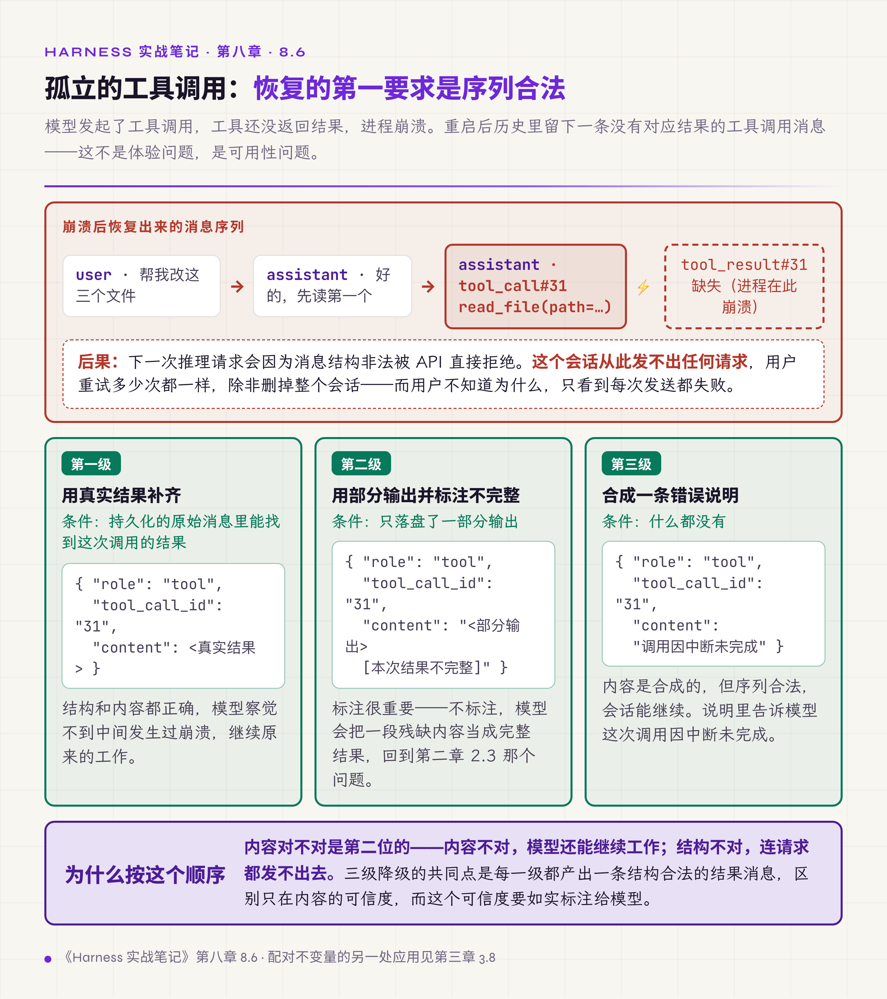
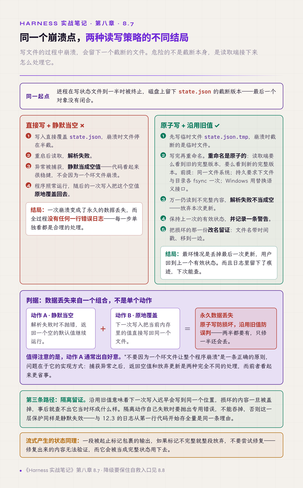

# 八、状态、持久化与崩溃恢复

这一章讲状态的三个问题：它有几份、崩溃之后能不能接着运行、恢复出来的内容对不对。

第二卷第六、七两章是这个主题的完整论述：状态分五类，真相只有一份，checkpoint 保存什么、明确不保存什么，以及恢复的七步时序。本章不重复那套结构，只给八个具体的失效方式，多数都能对应到那套结构里的一条要求。

## 8.1 会话状态的全部字段要走同一个切换函数

会话状态不是一个值，而是一组：会话标识、工作目录、配置文件位置、元数据。

切换会话的代码路径通常不止一条：从列表点选、新建，以及某些副作用触发的自动切换。一个真实的缺陷是三条路径里有一条只同步了会话标识，没同步工作目录。后果是切换之后 agent 仍在读上一个会话的配置，而界面显示的是新会话。这类失效完全静默：没有报错，功能都在，只是行为对不上，用户以为是模型不听指令。

同类问题还有一种形态：为任务创建独立工作目录时没有把配置文件一并复制过去，于是推理模式、工具禁用清单这些设置整轮未生效。测出来的结果和预想的配置无关，日志里也看不出任何异常。**你以为在测配置 A，实际运行的是默认配置。**

有效做法是把会话状态的全部字段收进一个切换函数，所有切换路径都调用这一个函数；工作目录初始化时显式复制配置，并验证它已生效。

**状态是一组的时候，切换入口只能有一个。** 第二卷附录 A 的状态登记表要求逐项登记每份状态的属主与作用域；这条缺陷的根源，正是没有一份清单说明切换会话时要同步哪几样东西。

## 8.2 恢复会话时要重建 system prompt

保存会话时，system prompt 往往已经被处理过：脱敏、裁剪、按当时的环境拼装。

恢复时如果直接加载保存的那一份，agent 拿到的是一份残缺或过时的 prompt：脱敏掉的部分没有恢复，当时的环境信息（时间、工作目录、可用工具、权限规则）也已经变了。它照常工作，决策却建立在错误的前提上。

有效做法是把脱敏与恢复配对设计，恢复时把 system prompt 拆成两部分处理：

- **环境信息与系统约束**：按当前版本重新生成，不沿用存档。环境已经变了，约束也可能在中途收紧，沿用旧版等于绕过新规则。
- **塑形内容**：指塑造模型行为方式的那部分，包括 few-shot 示例、输出格式、流程模板。它按崩溃前的版本恢复，否则同一个 run 前后行为不一致。

第二卷 §10.8 正是这样拆的：塑形内容按崩溃前那一版重建，系统约束取当前版。§11.6 讲的是另一面：恢复了状态，不等于恢复了当时的授权。本节把两条落到 system prompt 上：**恢复的是状态，不是当时的全部上下文，更不是当时的权限。**

## 8.3 状态以后端为唯一权威

前端为省一次请求，把状态快照缓存在本地。

切换页面或标签之后快照过期，界面停留在旧状态。最典型的表现是长任务：用户切走再切回来，看到的是"生成中"，而后端那一轮早就结束了。用户会一直等，或者以为系统挂了去重启。

工程复盘的结论是：这个缓存得不偿失，为性能加的机制带来了一致性故障，收益远小于代价（第十三章 13.3 把它列为同类案例）。

有效做法是让后端成为状态的唯一权威来源：前端每次进入页面都重新拉取；后端维护足够的字段（最近消息、待处理输入、是否运行中），让前端一次取全。

**同一份状态被多处持有时，性能优化的代价是一致性。** 第二卷 §1.6 做过一个破坏实验：故意让同一份状态存在两个来源，观察系统怎样出错。本节是那个实验在用户界面上的具体症状。

## 8.4 运行时注册的资源要持久化

运行中动态注册的工具、动态加载的能力，通常只存在于内存。

进程重启后它们消失了，而依赖它们的会话却被恢复了。于是出现一个矛盾状态：历史里有对某个工具的调用记录，当前清单里却没有这个工具，模型看到自己上一轮用过的工具不见了。

有效做法是在会话元数据里预留结构化字段，把运行时注册的内容一并持久化，恢复时重新注册。

与之相对的另一面是：同样要明确列出**不该**跟着备份或迁移走的状态，而且要分"同一实例重启"和"迁到另一个实例"两种情况来列。

- 去重用的随机数，两种情况都不带。它由进程生成，用来识别重复请求；把旧值带进新进程，新进程发出的正常请求可能撞上旧记录，被误判成重复。
- 尚未完成的投递任务与待唤醒记录，同一实例重启后必须恢复；复制到另一个实例时不带，因为原实例还活着，两边都会投递。

持久化清单与排除清单要一起维护。排除清单分两栏写："同一实例重启时是否恢复"和"迁到新实例时是否复制"。

**凡是运行时才产生的东西，都要问一句：重启之后它还在不在。**

## 8.5 长流程要逐环节存档

多环节的流水线任务如果不保存中间结果，前期一处小错就要整体重跑。

一个真实场景是九个环节的文档生成流程：中间某一步的输入有个错别字，发现时已经运行到第七步，只能从头再来，耗时两小时。这类返工的代价不只是时间，还有 API 花费和用户的耐心。

有效做法是每个环节的产出都落盘，重跑时跳过已完成的环节；单个环节失败时降级处理（例如图表生成失败改为文字说明），而不是整体失败。

第二卷第七章把这件事讲成了两条技术路线：检查点（checkpoint）与事件日志重放（replay），并说明了各自不管的部分。本节只是其中最朴素的一种做法，但它解决的是最常见的问题。

## 8.6 崩溃后要重建工具调用的配对

前面几节讲的是状态对不对，这一节讲崩溃之后会话还能不能用。

场景：模型发起了工具调用，工具还没返回结果，进程崩溃。重启后恢复会话，历史里留下一条孤立的工具调用消息，没有对应的结果消息。

后果不是体验问题，**而是可用性问题**：下一次推理请求会因为消息结构非法被 API 直接拒绝。这个会话从此发不出任何请求，用户重试多少次都一样，除非删掉整个会话。

有效做法是从持久化的原始消息里重建缺失的工具结果消息，按三级降级：能找到真实结果就用真实结果；只有部分输出就用部分输出，并标注不完整；什么都没有就合成一条错误说明，告诉模型这次调用因中断未完成。

**恢复的第一要求是恢复出的消息序列合法。** 内容对不对是第二位的：内容不对，模型还能继续工作；结构不对，连请求都发不出去。

*图 8.1 · 崩溃后孤立工具调用的三级重建*

## 8.7 读到不完整状态就沿用旧值

写文件的过程中崩溃，会留下一个截断的文件。

危险的不是截断本身，而是读取端的处理方式。一种常见的最坏组合是：读取时解析失败，静默当成空值；随后的写入把这个空值原地覆盖回去。于是一次崩溃变成了永久的数据丢失，而全过程没有任何一行错误日志。

有效做法是两件事配对。

**写用原子模式。** 先写临时文件，写完再重命名。重命名是原子的，读取端要么看到旧的完整版本，要么看到新的完整版本，不会看到半截。这有三个前提：

- 临时文件与目标文件在同一个文件系统上。
- 如果要求掉电后数据也不丢，重命名前对临时文件做一次 fsync，重命名后对所在目录再做一次 fsync。
- Windows 上要用带替换语义的接口；目标文件被占用时替换会失败，失败要按"未写入"处理。

**读到不完整就沿用旧值。** 解析失败时不当成空值，而是放弃本次更新，保持上一次的有效状态，并记录一条警告。

沿用旧值之外，还应当把损坏的那一份改名留下来：文件名带上时间戳，移到一边，不让下一次写入覆盖它。沿用旧值意味着下一次写入迟早会写到同一个位置，损坏的内容一旦被盖掉，事后就查不出它当时坏成什么样。隔离动作本身失败时要抛出专用错误，不能吞掉，否则这一层保护同样会静默失效。理由和 12.3 一样：现场证据一旦被覆盖，就无法追查。

对于流式产生的状态（例如一段被起止标记包裹的输出），标记不完整就整段放弃，不要尝试修复。修复只能靠猜，猜错的内容会被当作有效状态写回去，比直接丢掉更难发现。

**静默当空加原地覆盖，是数据丢失最常见的组合。原子写防损坏，沿用旧值防误判，两半都要有。**

*图 8.2 · 崩溃点相同，两种读写策略的不同结局*

## 8.8 降级要保住自救入口

启动阶段的失败处理有一个容易走极端的地方。

一个真实场景：数据库被锁，或数据量超限，导致启动失败，程序按严谨的做法抛异常退出。结果是用户完全无法进入，**连删除损坏数据的入口都打不开**，因为删除功能也在这个应用里。用户唯一的办法是手工找到数据目录删文件，而多数用户不知道它在哪。

有效做法是对特定的几种失败做窄范围容错：记录日志，以零条历史继续启动，让主界面和删除功能仍然可用；其余任何错误依旧当作致命错误。

注意这里的分寸：不是启动失败一律降级继续，那会掩盖真问题；而是**只对那些降级后用户能自救的失败降级**。

**宁可功能残缺，也不能让用户失去修复它的能力。**

## 本章与前两卷的对应

第二卷第六章把状态分为五类，并要求每份状态的作用域就是它的归属。8.1 是这份分类缺失时的实际后果。§6.5 讲 checkpoint 保存什么、明确不保存什么，8.4 补上了"明确不保存"里漏掉的一项（运行时注册的资源），也补了反方向的清单：哪些状态明确不该跟着备份或迁移走。

第二卷第七章讲持久化执行（durable execution）的两条路线，8.5 是它们最朴素的形态。§7.5 强调"决策可以重放，但动作可能执行多次"，8.6 的三级重建处理的正是"动作是否发生过无法确认"的情况。

§10.8 要求塑形内容按崩溃前版本重建、系统约束取当前版，8.2 把这条要求落到了 system prompt 的恢复上；§11.6 "恢复状态不等于恢复授权"也在 8.2 里得到验证。§1.6 的真相源分叉实验在 8.3 里有了具体的用户可见症状。第三章 3.4 那次数据丢失事故由三个缺口共同造成，8.7 是同一类事故的最小复现形态，只需要两个动作；本卷在处方上还加了第三件事：把损坏的那一份隔离留证。
