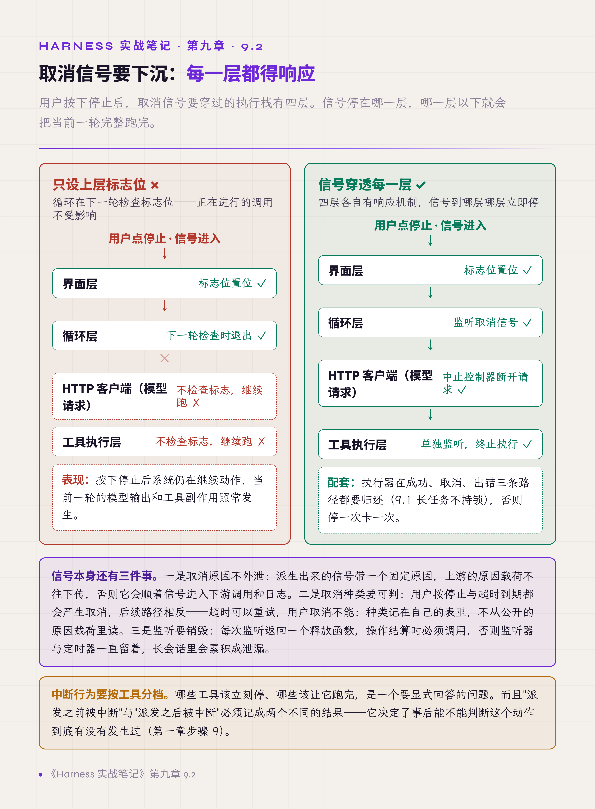
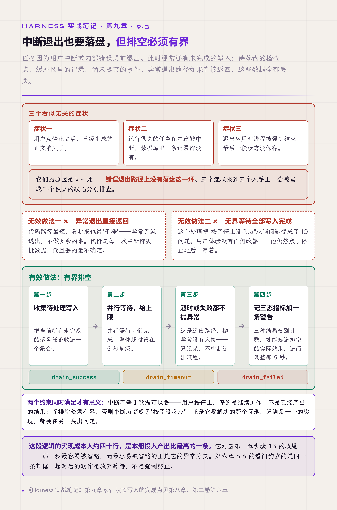
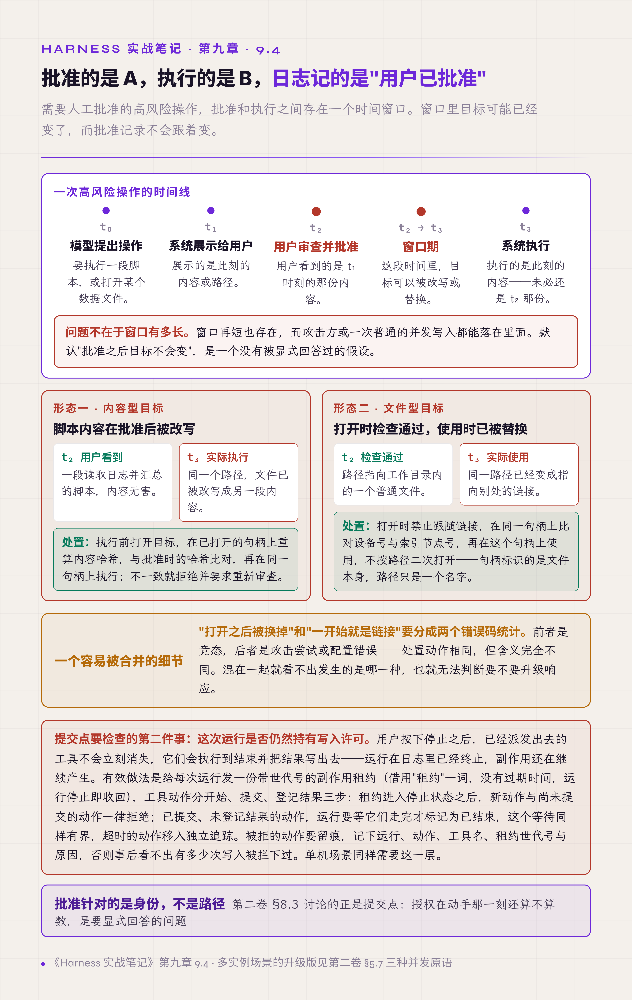

# 九、并发、取消与中断

这一章讲三个问题：用户按下停止之后会发生什么；批准过的动作在执行那一刻，目标还是不是原来那个；同一个事件到达两次怎么办。

第二卷 §9.6 提出一条要求：取消要一路传到底；§8.3 提出一个问题：授权在动手那一刻还算数吗。这两条在本章各有真实的失效：前者在 9.2；后者在 9.4，分成两种情况，一是目标被替换，二是运行已经停止、写入许可却没有收回。9.5 讲异步事件的重复投递，是异步系统的常见问题；9.6 讲有状态的正则对象，与并发无关，是循环里复用有状态对象带来的问题，一并收在这里。这两节都不对应上面两条要求。

## 9.1 长任务不持锁

执行长任务的代码在互斥锁内同步等待模型完成。

后果是取消信号进不来：用户点停止，处理停止的那段代码需要拿同一把锁，而锁被正在运行的任务占着，于是界面完全失去响应，用户只能强制退出。

有效做法是把持锁的范围压到最小：锁内只把执行器（实际运行任务的对象，同一时刻只能给一个任务用）借出来，然后立即解锁；任务在锁外异步执行，并监听取消信号。这是资源池常见的借出 / 归还模式，借出之后必须保证归还：成功、取消、出错三条路径都要归还，漏掉任何一条，下一次请求就会取不到执行器而永久等待。

**锁的持有时间不能包含不可预测的等待。** 模型调用、网络请求、工具执行都属于不可预测的等待。

## 9.2 取消信号要穿透每一层

取消常被实现成一个上层标志位：置位后，循环在下一轮检查时退出。

问题是"下一轮"可能很远。正在进行的模型请求会跑完整个响应，正在执行的工具会执行到结束，其间可能还写了文件、调了外部接口。用户按下停止之后，系统仍在继续动作，而且是在用户认为已经停了的情况下继续动作。这比不响应更危险。

有效做法是让取消信号下沉到每一层：界面层的停止按钮发出信号，循环层检查标志位，工具执行层单独监听，HTTP 客户端接入中止控制器（例如 JavaScript 的 AbortController）。四层各有各的响应机制。

信号本身还有三点要处理：

1. **取消原因不外泄。** 派生出来的信号只带一个固定原因，上游的原因载荷不往下传，否则它会顺着信号进入下游调用和日志。
2. **取消种类要可判。** 用户按停止和超时到期都会产生取消，两者的后续路径相反：超时可以重试，用户取消不能。种类记在自己的表里，不从公开的原因载荷里读。
3. **监听要销毁。** 每次监听都返回一个释放函数，操作结束时必须调用，否则监听器和定时器会一直留着，在长会话里累积成泄漏。

**上层的取消只是意图，每一层都要有自己的实现。** 还要能分清是谁取消的：用户按停止和超时到期，后面走的是两条路。

*图 9.1 · 取消信号停在哪层，哪层以下就继续运行*

## 9.3 中断路径也是要落盘的路径

上一节讲怎么让中断生效，这一节讲中断生效之后首先要做的事。

场景：任务因为用户中断或内部错误提前退出。此时通常还有未完成的写入：待落盘的检查点、缓冲区里的记录、尚未提交的事件。异常退出路径如果直接返回，这些数据全部丢失。

表现出来是三个看似无关的症状：用户点停止之后，已经生成的正文消失了；运行很久的任务在中途被中断，数据库里一条记录都没有；退出应用时进程被强制结束，最后一段状态没保存。它们的原因是同一处：**错误退出路径上没有落盘这一环**。

试过的无效做法是在退出路径上无界地等待全部写入完成。这个处理把"按了停止没反应"从锁问题变成了 IO 问题，用户体验没有改善。

有效做法是有界排空：并行等待待处理的写入，给一个上限（经验值，5 秒量级，按场景调整）；超时或失败都不抛异常，只记录一个三态指标（成功、超时、失败）和一条警告。

两个约束要同时满足：中断不等于数据可以丢；但排空必须有界，否则中断就变成了"按了没反应"。

这段逻辑的实现大约四十行，按作者的经验，是本卷投入产出比最高的做法之一。

**异常退出路径要和正常退出路径做同样的收尾**，只是要给它加上时间上限。第一章步骤 13 列出了收尾的四件事（记忆抽取、审计、状态保存、资源清理），并指出收尾容易被省略；最容易被省略的正是异常退出这条分支。排空管的是自己缓冲区里的写入；已经派发出去的工具动作，由 9.4 的副作用租约管（运行停止后，拒绝尚未提交的写入）。

*图 9.2 · 中断退出时的有界排空与三态记录*

## 9.4 批准与执行之间要重新校验目标

需要人工批准的高风险操作，批准和执行之间存在一个时间窗口。这一节的两类失效都出在这个窗口里，对应的检查都要放在提交点上。

提交点（commit point）借用了数据库的说法，在数据库里指事务变为持久、不可撤回的那一刻；本书指副作用真正发往外部之前的最后一刻。在这一刻复核授权，就是在使用时检查，消除检查时刻与使用时刻不一致（TOCTOU，time-of-check to time-of-use）的窗口。

### 目标被替换

窗口里目标可能已经变了。真实的形态有两类：用户审查并批准了一段脚本的内容，执行时脚本文件已被改写；打开某个数据文件时检查通过，实际使用时它已经被替换成指向别处的链接。用户批准的是 A，系统执行的是 B，而审计日志记录的是"用户已批准"。这是典型的 TOCTOU 竞态。

有效做法是把身份绑定在句柄上：

- 执行前打开目标，在这个句柄上取出身份，与批准时记录的身份比对：内容型目标比对内容哈希，文件型目标比对设备号与索引节点号（inode）。
- 比对通过后，在同一个句柄上执行，不再按路径二次打开。
- 打开时禁止跟随链接，链接本身就按不一致处理。
- 不一致就拒绝执行，并要求重新审查。

还有一个容易被合并的细节：**"打开之后被换掉"和"一开始就是链接"要分成两个错误码统计。** 前者是竞态，后者是攻击尝试或配置错误，混在一起就看不出发生的是哪一种。

### 运行停止之后，工具仍在写

提交点要检查的第二件事是：**这次运行是否仍然持有写入许可。** 用户按下停止之后，已经派发出去的工具不会立刻消失，它们会执行到结束，并把结果写出去。运行在日志里已经终止，副作用还在继续产生。

有效做法是给每次运行发一份副作用租约，由它代表这次运行的写入许可。这里借用"租约（lease）"一词，但它没有过期时间，也不需要续约，而是按运行的状态撤销：运行进入停止状态，租约随之收回。租约带一个世代号，拿着旧世代号的写入一律拒绝，作用接近围栏令牌（fencing token）。

每个工具动作分三步：

1. **开始**：登记这个动作。
2. **提交**：在提交点复核租约，仍然有效才把副作用发出去。
3. **登记结果**：记下这个动作以什么结果结束。

租约进入停止状态之后：

- 新动作和尚未提交的动作一律拒绝。
- 已经提交、还没登记结果的动作，运行要等它们走完，才标记为已结束。这个等待同样有界：超时的动作按第六章 6.6 的做法处理（放行队列，原动作不杀，移入独立追踪），运行先标记为已结束，并记下还有多少个动作没有登记结果。
- 被拒的动作要留痕，记下运行、动作、工具名、租约世代号与原因，否则事后看不出有多少次写入被拦下过。

**批准针对的是身份，而不是路径；运行停止之后，写入许可要随之收回。** 第二卷 §8.3 讨论的正是提交点：授权在动手那一刻还算不算数，是要显式回答的问题，不能默认算数。

*图 9.3 · 批准与执行之间的两类目标漂移*

## 9.5 异步完成事件会重复投递

异步完成事件（工具执行完成、后台任务完成、子任务返回）会到达两次。

原因有多种：上游连接抖动后重发、超时重试，以及同一个完成状态同时经由主动查询和被动通知两条路径抵达。实践中这类重复在至少五个不同位置出现过。它不是某一处的实现缺陷，而是投递语义决定的。投递语义分三种：至多一次（at-most-once，不重发，可能丢）、至少一次（at-least-once，拿不到确认就重发，可能重复）、恰好一次（exactly-once）。为了不丢通知，异步通知通常按至少一次投递，重复是这个选择的代价；投递层做不到恰好一次，只能在处理层把重复消化掉。

后果按业务不同：轻则界面上出现两条相同的结果，重则同一笔操作被应用两次。

有效做法是按事件标识去重（deduplication）：已应用则跳过，使处理结果满足幂等（同一事件处理多次与处理一次效果相同）。日志里要显式记录丢弃了重复项；不记录的话，无法知道重复到底有多频繁，也就无法判断上游是不是出了新问题。

还有一个跨重启的形态：去重状态只存在内存里，进程重启后同一条通知会再次弹给用户。去重用的状态本身也要持久化。

**异步通知默认会重复。** 第二卷 §8.4 把这件事讲透了：在投递层，重复与丢失只能二选一，选了不丢（至少一次）就必须在处理层处理重复；§8.5 给出幂等键（idempotency key）的来源、作用域与保留期。

## 9.6 有状态的正则用前要重置

JavaScript 中带 g（全局）或 y（粘连）标志的正则对象（RegExp），内部用 lastIndex 属性记录下一次匹配的起始位置。

lastIndex 只在一次匹配失败时归零。逐个文件只调用一次 test 或 exec 的用法，如果上一个文件最后一次匹配成功，lastIndex 停在那个偏移上，下一个文件就从那里开始匹配，前面的内容全部漏掉；循环调用直到返回空的用法不受影响。它不报错，只是少匹配了一些结果。

这不是并发问题，单线程顺序执行同样会出现。它的隐蔽之处在于测试常常发现不了：单文件测试正常；多文件测试如果文件顺序恰好让漏配不明显，也会通过。

有效做法是循环内每次使用前把 lastIndex 重置为 0；相关测试用固定输入，不依赖文件系统的遍历顺序。

**有状态的对象跨循环复用必须显式复位**，或者每次新建。

## 本章与前两卷的对应

第二卷 §9.6 讲取消要一路传到底，9.2 是这条要求的分层实现。第二卷 §9.1 讲一次流式对话里同时走着三条时间线（后台 run、网络连接、客户端视图），要求三者解耦；本章 9.1 是另一种没解耦的情况：界面、后台、连接各自都没坏，只是锁把它们串成了一条链，界面因此失去响应。

§8.3 的提交点在 9.4 里有两个真实形态；§8.4 的"投递层重复与丢失只能二选一"和 §8.5 的幂等键在 9.5 里得到验证。§5.7 列出的三种并发原语（乐观并发、租约、围栏令牌）在 9.4 都有对应：执行前比对批准时记下的身份，相当于乐观并发的"提交时比对版本，不符则拒"；副作用租约对应租约；租约的世代号起围栏令牌的作用。§5.7 认为单机单写者阶段只需要进程内串行化，9.4 说明单机场景同样需要一份写入许可，因为运行停止之后，尚未返回的工具还会继续写；多实例时再加一层，防止已经出局的旧持有者继续写。

9.3 的有界排空对应第二卷第六章 6.5 对 checkpoint（一致恢复点）的要求：状态写入要有明确的落盘点。中断路径如果没有排空，那个落盘点在异常分支上就不存在。
