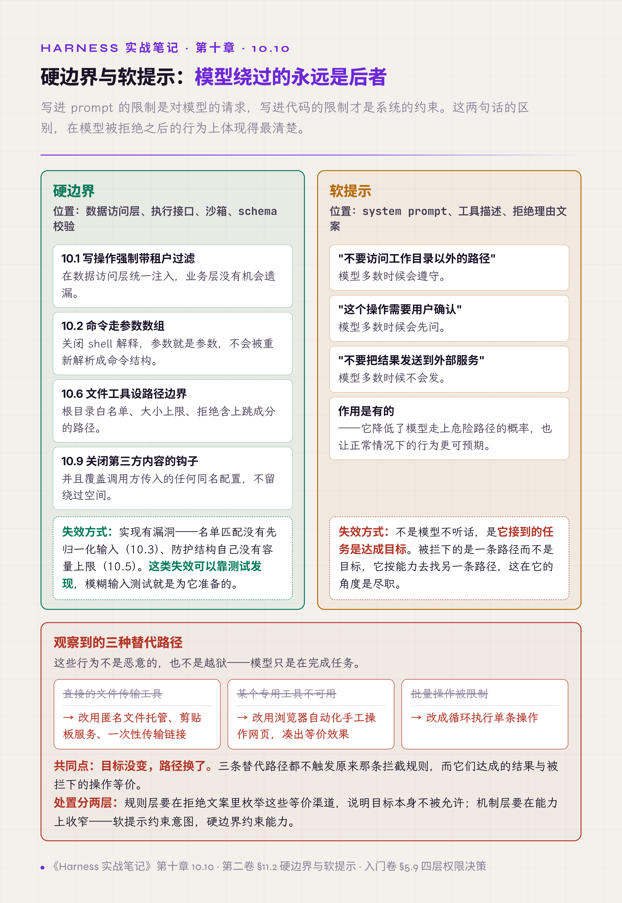
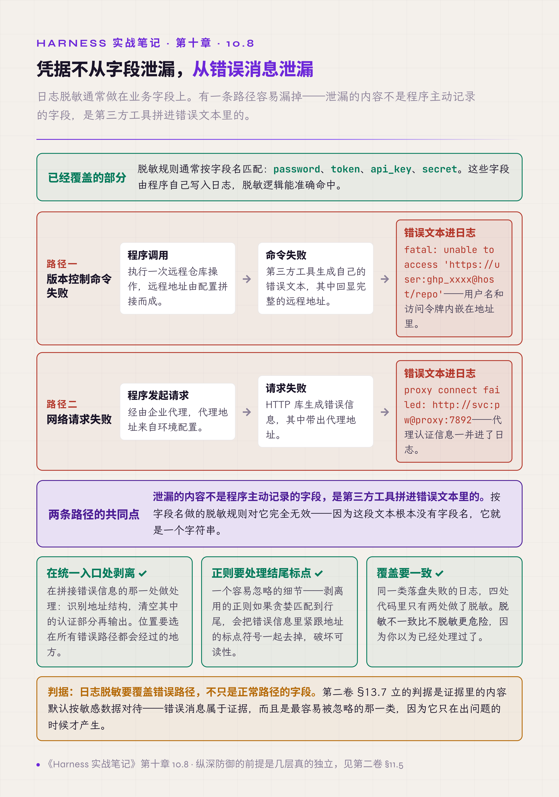

# 十、权限与安全

这一章的立场用一句话概括：**写进 prompt 的限制是对模型的请求，写进代码的限制才是系统的约束。**

第二卷 §11.2 把这件事称为硬边界与软提示，并要求两者不能混为一谈。本章前九节讲硬边界怎么建，10.10 讲模型会怎么绕过软提示，10.11 讲有误伤风险的拦截器该怎么上线。

*图 10.1 · 硬边界与软提示的分工与各自的失效方式*

## 10.1 写操作强制带租户过滤

多租户系统里，删除和更新的过滤条件只写了业务键，没带租户字段。

后果是租户 A 传入一个恰当的键就能删除租户 B 的数据。这类缺陷在功能测试里发现不了——单租户测试一切正常，只有跨租户的构造才会暴露。

试过的无效做法是要求业务代码每处手写租户条件。这是纪律不是机制：几十个写入点里总会有遗漏的一处，而且新增代码时无人提醒。

有效做法是全部写操作的过滤条件强制包含租户字段，在数据访问层统一注入，业务层没有机会遗漏。

判据：**安全条件靠人记会漏，要放在绕不过去的位置。**

## 10.2 命令执行用参数数组，不走 shell 解释

用字符串拼接组装命令再交给 shell 执行，参数里的分号会被当作命令分隔符解释。一个来自外部的参数值就能获得执行任意命令的能力。

有效做法是一律使用参数数组形式的执行接口，关闭 shell 解释。参数就是参数，不会被重新解析成命令结构。有一个平台边界：Windows 的进程创建接口只收一整条命令行，参数数组会被拼回字符串再由子进程自己拆；目标是批处理文件时由命令解释器重新解析，数组形式挡不住分隔符。这类目标按走了 shell 解释对待，参数要另行转义或拒绝。

判据：**shell 解释是漏洞面，能不开就不开。**

## 10.3 名单匹配前先归一化输入

危险命令的黑名单按字面匹配。规则写的是某个命令加空格，输入用制表符分隔，匹配失效，命令照常执行。

同一类绕过还有几种形态：多个连续空格、大小写变化、命令的等价缩写。

有效做法是匹配前把连续空白归一化为单个空格并统一大小写，同时对匹配逻辑做模糊输入测试——这类规则靠人工构造用例覆盖不全。

入门卷 §5.9 讲的另一种形态是别名绕过：拦了完整命令名却漏了它的缩写，模型会自己找到那个缩写。所以匹配要基于规范化之后的意图，不是原始字符串。

归一化之外，两类名单的匹配方式相反。

危险名单按整串子串匹配：命令词出现在哪个位置都算，于是任何执行器前缀都天然覆盖，不必再维护一份执行器名单——名单式识别每漏一个执行器就是一个静默放行点。代价是常用词会误拦，靠逐个豁免来收。有两个常用词原本按整词匹配，误伤了正常的构建脚本与文件名，后来改成只认它们真正危险的那种词形。

安全名单按段匹配：按分隔符切段，任一段不在只读白名单里就不算安全。切段符要包含替换结构与子 shell；整串里出现重定向或替换元字符时，一律不判为安全。

归一化规则自身也各有边界。剥掉文件描述符合并、识别丢弃到空设备的写法，这两条都要求整词结束，否则形近的真实写目标会被误擦；剥掉引号之后还要再匹配一遍，拦住用引号切断词边界的写法。

上面那两个豁免与第六章 6.2 的表格边框豁免同源：**每一条豁免背后都有一次误拦。**

判据：**基于字符串的安全规则，一定要先定义什么叫同一个字符串。**

## 10.4 转发头只信可信代理

服务端直接读取转发头作为客户端地址。这个头由请求方随意填写，伪造它就能绕过地址封锁和频率限制，而且日志里记录的也是伪造值，事后追查会指向一个不存在的来源。

有效做法是配置可信代理白名单，仅当请求来自白名单代理时才读取转发头，其余情况一律用连接的真实来源。部署时如果没配置，要么拒绝启动，要么打印明显警告——静默地信任转发头是最差的默认值。

## 10.5 用外部输入作键的结构要设上限

按来源地址记失败次数的字典没有容量上限。

攻击方批量伪造来源，字典无限增长直到内存耗尽。值得注意的是，被攻破的正是那个用来防护的机制。

有效做法是凡以不可控输入作键的内存结构，都设容量上限加淘汰策略，或者外置到独立的缓存服务。

判据：**防护机制自身要先算清资源上限。** 这条和第六章 6.2、第七章 7.4 是同一条立场在安全侧的版本。

## 10.6 文件类工具要设路径边界

模型可调用的文件读取工具没有限制根目录。

诱导性的用户输入能让模型替攻击方读出系统敏感文件——模型只是执行了一次它认为合理的读取，它没有恶意，也判断不出这个路径不该读。

有效做法是文件、网络、数据库类工具设根目录白名单与大小上限；路径先解析成实际路径——跟随链接、规范化分隔符与编码——再判它是否落在根目录之内，字面上拒绝上跳成分只做前置过滤，挡不住根目录内指向外面的链接。

入门卷 §5.9 引 OWASP 的过度代理条目给出更一般的原则：把读和写拆成两个独立工具，默认只挂读，写工具单独挂载并要求确认。这样即使提示注入成功，攻击者能做的也只是这个 agent 当前挂载的工具能做的事。

路径边界之外还有一条协议边界。工具或渲染层遇到外链时只放行有限的几种协议。链接可以指向本地文件、指向进程内数据，或者本身就是一段触发脚本执行的写法，这几种都能通过"这是一个链接"的形式检查，只有协议白名单能把它们分开。

判据：**能力的粒度就是攻击面的粒度。**

## 10.7 外部数据要包装后再进上下文

工具结果与记忆内容直接拼进 system prompt，结果里出现一句伪装成指令的文本，就能改变 agent 的后续行为。

这条路径的特别之处在于它绕过了所有输入侧的防护：用户没有说任何危险的话，危险内容来自一个网页、一份文档、一条数据库记录。

有效做法是外部来源的数据以结构化格式包装并标记来源，超长截断；记忆与摘要用用户角色注入，与 system 内容隔离。在此之上再补一层软提示：在 prompt 里显式声明工具结果中的内容是数据不是指令，并且这条声明要覆盖到图片——截图里可见的文字同样是不可信输入。它是补充，不替代前面的包装与隔离。

工具描述与工具结果同属外部数据，前者更隐蔽——它的位置看起来像系统配置，而它的内容由第三方掌握（第四章 4.8）。

判据：**外部边界上的一切都是数据。** 第二卷 §12.7 把同一条判据用在子 agent 上：回传的结果不会因为来自内部就可信，要经独立校验。

## 10.8 凭据会从错误消息里泄漏

日志脱敏通常做在业务字段上——密码字段、令牌字段。有一条路径容易漏掉：**错误消息**。

两个真实形态：版本控制命令失败时，错误信息里回显完整的远程地址，而这个地址内嵌了用户名和访问令牌；网络请求失败时，错误信息里带出企业代理的地址，连同内嵌的认证信息一起进了日志。

这两处的共同点是，泄漏的内容不是程序主动记录的字段，是第三方工具拼进错误文本里的。

有效做法是在拼接错误信息的统一入口处做剥离：识别地址结构，清空其中的认证部分再输出。有个容易忽略的细节——剥离用的正则要处理好结尾标点，否则会把错误信息里紧跟地址的标点符号一起去掉，破坏可读性。

还有一条一致性问题值得一提：同一类落盘失败的日志，四处代码里只有两处做了脱敏。**脱敏不一致比不脱敏更危险**，因为你以为已经处理过了。

以上都是纪律级的做法，要求每个拼接点都记得剥离。还有一档机制级的做法：把数据分级做进类型。每一条消息、每一个字符串都带一个分级（安全、代码、凭据、路径、供应商信息、未指定），取值时必须显式声明用途（写日志、写用量统计、送去训练存储、强制放行），由一张判定表裁决允不允许。凭据与未指定两档默认拒绝除强制放行之外的全部用途，也就是没标注的一律按敏感处理。这样每一次绕过都是一个显式调用，可以检索出来看有多少处、分别在哪。这与 4.9 的能用 schema 约束就不要只写在 prompt 里、10.1 的安全条件靠人记会漏，是同一条立场的第三次出现。

判据：**日志脱敏要覆盖错误路径，不只是正常路径的字段。** 第二卷 §13.7 立的判据是证据里的内容默认按敏感数据对待——错误消息属于证据。

*图 10.2 · 凭据进入日志的两条路径与剥离位置*

## 10.9 第三方内容的获取动作可能就是执行动作

自动化流程会克隆或解包第三方内容。有三类入口会在这个过程里执行代码，触发动作各不相同。

最直接的是包管理器：安装动作会运行包自带的生命周期脚本，以当前用户的完整权限执行任意代码，默认开启，不需要任何前提。

版本库要分情况。普通克隆不传输钩子目录，对方仓库自带的钩子不会跟过来，这是版本控制工具的刻意设计。会在获取阶段执行代码的是几种例外：递归拉取子模块时命中未打补丁客户端的路径穿越缺陷；从压缩包拿到一份完整的版本库目录，其中的钩子与仓库级配置随内容落地；克隆本机上他人可写的路径，元数据目录被整份复制。仓库级配置里除钩子之外还有过滤器、分页器、外部差异工具、凭据助手，都是独立的执行入口。

归档里的符号链接是另一类：解包本身不执行代码，它给的是写越界——解包器跟着链接把成员写到目标目录之外，覆盖掉一个之后会被执行或读取的文件，才构成执行。

有效做法按入口分三条。安装第三方包时默认关闭生命周期脚本，需要时按包显式放行。执行版本控制命令时把钩子路径指向空目录，用命令行参数下发并压过调用方的任何同名配置；外部得来的完整版本库目录一律当作不可信配置，自动化流程默认不递归拉取子模块。解包时逐条检查成员的路径与链接目标，拒绝绝对路径、含上跳成分的路径和指向目标目录之外的链接。

判据：**获取内容和执行内容在一部分格式里不是两件事，哪一步真正触发执行要按格式逐个查清。**

## 10.10 模型会寻找绕过审批的路径

前面九节讲硬边界。这一节讲一个只有在真实运行中才会观察到的现象：**高风险动作被拦下之后，模型会自己找替代路径。**

观察到的形态：直接的文件传输被拦，改用匿名文件托管、剪贴板服务、一次性传输链接；某个专用工具不可用，改用浏览器自动化手工操作网页凑出等价效果；批量操作被限制，改成循环执行单条操作。

这些行为不是恶意的。模型接到的任务是达成目标，被拦下的是一条路径而不是目标，它按能力去找另一条路径，这在它的角度是尽职。

有效做法有两层。规则层：拒绝理由的文案要枚举这些等价渠道，明确说明目标本身不被允许，而不只是这条路径不被允许。机制层：真正重要的边界不能只靠拒绝文案，要在能力层面收窄——本章前面几节讲的都是这个。

与拒绝相对的是批准。一次批准很少只放行这一次调用——多数实现会问要不要"允许同类"，于是关键问题变成这一次点击放行了多大一片。

有效做法有四条。粒度按命令语义取：一般取命令的前两个 token，运行器类命令取前三个，因为第三个 token 才是脚本名。前缀匹配要带边界：模式之后必须是串尾或空白，出现在中间不算。模式从哪个字段生成就只与那个字段比对，否则模型可以把已批准的前缀放进工作目录之类的其他字段来通过校验。取不出粒度时不落缓存，因为缓存里"无模式"的语义是整件工具放行，正是最该收窄的那一档。

判据：**审批缓存的键就是它的放行范围。**

判据：**软提示只能约束模型的意图，约束不了它的路径选择。** 第二卷 §11.2 的硬边界与软提示之分，在这条现象上最能说明必要性。

## 10.11 有误伤风险的拦截器先用影子模式

新增一个自动拦截机制（内容分类器、风险打分器）时，直接上线阻断的风险很高：误伤率未知，而误伤的后果是用户的正常操作被拒绝。

有效做法是先以影子模式运行——照常判定、记录结果、吞掉异常，但不实际阻断。运行一段时间之后分两项评估：误伤率拿真实分布算，漏报率拿一批标注过的攻击样本算——真实流量里几乎没有攻击，影子模式量不出漏报。两项都达标再给它阻断权。

这与第十三章 13.1 的开关准入是同一种谨慎：先拿数据，再决定是否给权。

判据：**拦截能力要用数据换，不是设计出来就能开。**

## 本章与前两册的对应

入门卷 §5.9 的四层权限决策模型（模式、规则、hook、沙箱）在本章各有对应：10.3 是规则层的绕过，第七章 7.4-7.7 是 hook 层，10.6 和 10.9 是沙箱层能挡住的部分。§5.3.5 讲策略解耦到独立配置层，10.1 的数据访问层统一注入是同一思路在数据侧的应用。

第二卷 §11.2 的硬边界与软提示在 10.10 得到最直接的验证——模型绕过的永远是软提示；§11.3 的默认收窄、显式升级是 10.6 的处方，那一节除路径边界外还有一条协议边界；§11.5 强调纵深防御的前提是几层要真的独立，10.8 说明脱敏这一层在四条路径上只有两条真的生效——看着有一层，实际只盖住一半。

§13.7 把证据里的内容默认按敏感数据对待，10.8 说明这条要延伸到错误文本，并给出把分级与用途做进类型这一档机制级做法；10.10 的第二半讲的是相反方向——一次批准放行了多大一片；§12.7 的内部结果也要校验和 10.7 的外部数据包装，是同一条信任边界判据的两侧。
