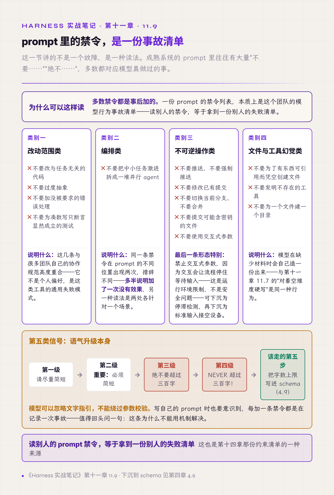

# 十一、运行环境与 prompt 纪律

这一章收两类横切问题：harness 之外的环境因素（网络、进程、前端框架），以及 prompt 内容本身的组织纪律。

它们看起来不相干，共同点是**都不在 agent 的主流程里，但都能让主流程失效**。

## 11.1 国内接口强制直连

系统配置了代理时，发往国内模型服务的请求也被转入代理。

后果是延迟从 10 秒变成 123 秒。这个故障最难的地方是它不报错——请求最终成功了，只是慢了十倍，容易被归因为"这家模型响应慢"，进而做出错误的选型决定。

试过的无效做法是设置免代理的环境变量。这个做法不可靠：免代理变量的匹配语义各家 HTTP 库不同，通配符、网段、端口、前导点各有各的解释；有的运行时默认不读环境变量里的代理设置；容器和子进程的环境也未必继承。

有效做法是在客户端初始化时按域名清单强制直连，不依赖环境变量。清单维护成本很低，国内主流厂商域名十来个；清单要有过期告警，新域名出现时直连失效的症状与代理故障相同。

判据：**环境变量是约定不是保证。** 需要保证的地方要在代码里显式设定。

## 11.2 后台服务要真正脱离父进程树

按类 Unix 的经验，用后台方式启动一个服务就算脱离了终端。

在 Windows 上这个假设不成立，原因不在进程树：子进程默认共享父进程的控制台，控制台关闭时其中所有进程都收到关闭事件；父进程若在一个设了"关闭即终止"的作业对象里，子进程默认继承这个作业。表现是长任务运行到一半，依赖的后端服务突然消失——而这个后端明明是按后台常驻方式启动的。

一次实测里，五十个任务的评测运行到中途整批失败，排查了很久才定位到进程托管方式。

有效做法是在该平台上用平台原生的脱离方式启动，按机制做：不继承控制台、新建进程组、从作业对象里脱出。类 Unix 上后台符号同样不算脱离，终端挂断时会话内的进程会收到挂断信号，要新开会话或忽略这个信号。

判据：**跨平台的进程管理不能靠经验迁移。** 每个平台的"后台"含义都要单独验证一次——办法很简单，启动之后关掉父终端，看服务还在不在。

## 11.3 必须单次的操作要加执行守卫

部分前端框架在开发模式下会刻意重复执行副作用，用于暴露不幂等的代码。

这个机制会把本来"看起来正常"的缺陷暴露出来：消息被追加两次、事件监听器注册两次导致每个事件被处理两次、初始化请求发两遍。

有效做法是先判这件事的正确频次：每次挂载一次，还是每次应用加载一次。属于前者的——订阅、事件监听、连接、定时器——正解是写清理函数，拆卸时把这一次的注册反做掉，让"装、卸、再装"与"装一次"对用户不可分辨。用标志位堵住第二次是框架文档点名的错解：它只让开发模式下的重复消失，真实的泄漏一个没修，组件被合法重新挂载时还会漏掉注册。属于后者的——一次性初始化、开机上报——才用模块级的一次性标志位守卫。两档都要移出状态更新回调，传给状态更新函数的回调在开发模式下同样被调用两次。

判据：框架的重复执行不是缺陷，是检测手段。**它暴露出来的问题在生产环境同样存在**，只是触发条件更隐蔽。

## 11.4 触发工具调用的 prompt 要短

实测部分模型在中文 prompt 超过约 200 字之后，倾向于直接给文字回答而放弃调用工具。

表现是流程里本该发生的工具调用消失了，模型给出一段看起来合理的回答——而那段回答没有事实依据，因为它没有去查。

有效做法分两步：流程里必须发生的调用，先用请求参数层的强制（模型支持时，见第六章 6.5 的登记）保证；仍要靠模型自主决定的，把触发调用的 prompt 控制在这个量级以内，更长的内容拆成分步。这条结论要连同模型标识与测试日期一起登记，换版本就重测。

入门卷 §7 把这类模型脾气的探测做成方法（把脉），主张动手搭之前先运行一组探针摸清楚：这家模型在什么条件下不调工具、在什么格式上会出错、指令遵循的边界在哪。本节这条就是探针能测出来的典型结论之一。

判据：**模型的行为边界要实测，不能推理。**

## 11.5 明确的业务规则直接写死

业务上多种因素的权重已经确定（甲占四成、乙占三成），把综合平衡交给模型。

结果是每次给出的组合都不同，而且它给不出确定结论——你要它综合，它就真的在综合，每次综合出的比例都不一样。这类任务模型做不好也不该做。

有效做法是把能计算的部分放进代码：权重求和由代码做完，模型只拿到结果去表述；不能计算的业务规则才写进 prompt，并且写成规则原文。

入门卷 §5.5.6 把这条列为常见误区的反面：业务规则全堆 system prompt。**该由代码保证的确定性，不要交给模型的一致性。**

## 11.6 多语言 prompt 用注册表管理

多语言支持的第一版通常在代码里按语言写条件分支。

分支很快不止语言一个维度：语言、业务类型、章节、输出格式，四个维度相乘，每加一个维度全部分支翻倍。到某个点上没人敢改，因为改一个分支不知道会影响哪些组合。

有效做法是建立按键索引的 prompt 注册表，全部组合的文本放在配置里管理，代码只按键取用。入门卷 §5.5.4 讲的多语种抽象就是这件事，本节补的是不做会演变成什么状态。

## 11.7 prompt 修订由失败日志驱动

按理论流程设计的七个分析维度，上线后三成真实输入在某些维度上完全没有内容。

模型的反应是对着空维度硬写——它不会说"这一项没有材料"，它会生成一段通顺的文字填满结构。产出看起来完整，实际没有依据。

有效做法有两步：建立失败日志并按原因分类，定期据此修订 prompt；除正常流程外，给模型写明常见的异常输入形态及处理方式——明确告诉它某一项没有材料时就写明没有，不要推测。

判据：**prompt 要覆盖异常输入，不只是正常流程。** 只写正常流程的 prompt，遇到异常输入时模型会自己补一个正常流程出来。

## 11.8 模型会误判自己所处的环境

有一类现象只在真实运行中才会遇到：**模型以为自己在模拟环境里，因而敷衍执行。**

表现是它给出"如果真的执行，将会……"这类假设性回答，或者用明显简化的方式处理任务，而它明明有完整的工具可用。

有效做法很朴素：在环境说明里明确告知它这是真实环境，有真实的执行能力和网络访问，动作会产生真实后果。

反过来的形态也存在：外部内容已经被抓取并放进了上下文，模型仍然回答"我无法访问互联网"。处理方式同样是在 prompt 里显式声明这些内容已经取到、要当作已知信息使用并注明来源。还有第三种：工具结果里出现的环境描述——"这是测试环境""网络不可用"——被模型当成事实。这一半归第十章 10.7 的包装管：外部数据不能改写模型对环境的认知。

判据：**模型对自身处境的认知也是要管理的输入。** 它不会自动知道自己能做什么。

## 11.9 prompt 里的禁令是一份事故清单

这一节讲的不是一个故障，是一种读法。

成熟系统的 prompt 里往往有大量"不要……""绝不……"。多数禁令都对应模型真做过的事。所以一份 prompt 的禁令列表，本质上是这个团队的模型行为事故清单。

从实践中反复出现的几类看：

**改动范围类**——不要改与任务无关的代码、不要过度抽象、不要加没被要求的错误处理、不要为凑数写只断言显然成立的测试。这几条与很多团队自己的协作规范高度重合，说明它不是个人偏好，是这类工具的通用失败模式。

**编排类**——不要把中小任务激进拆成一堆并行 agent。同一条禁令在不同位置出现两次，措辞不同，多半说明加了一次没有效果，另一种读法是两处各针对一个场景。

**不可逆操作类**——不要推送、不要强制推送、不要修改已有提交、不要切换当前分支、不要合并、不要提交可能含密钥的文件。还有一条形态特别的：不要使用交互式参数，因为交互会让流程停住等待输入。

**文件与工具幻觉类**——不要为了有东西可引用而凭空创建文件、不要发明不存在的工具、不要为一个文件建一个目录。

**语气升级本身也是信号**：当一条规则从普通提醒升级到全大写、再加上感叹号，说明前面所有温和措辞都没有效果。这时候该做的不是再加一个感叹号，是问它能不能下沉到 schema 或校验层（第四章 4.9）。

能下沉的不止 schema，还有运行时检测。上面那条"不要使用交互式参数"就可以做成检测：命令执行器同时盯两个信号——两分钟没有任何输出的停滞，以及进程正在等待交互输入，命中就终止并给出明确文案，说清它停在等输入上。检测到位之后，那条禁令的作用只剩提前避免一次浪费；再往下沉一档是约束——子进程的标准输入接空设备，交互式命令读不到输入立刻退出，连检测都不必等。

判据：**读别人的 prompt 禁令，等于拿到一份别人的失败清单。** 写自己的 prompt 时，也要意识到每加一条禁令都是在记录一次事故——值得回头问一句，这条为什么不能用机制解决。

*图 11.1 · 禁令的四个类别、第五类信号与它们各自对应的模型行为*

## 本章与前两册的对应

入门卷 §5.5 把 prompt 当作有版本、有归属、有 A/B 对照的资产，11.6、11.7 是缺少这套管理时的两种结果；§5.5.6 的常见误区在 11.5 有具体案例。§7 的把脉方法与 11.4、11.8 直接对应——那些结论都只能测出来，不能想出来。

第二卷 §2.5 把系统的确定性分成保证、尽力、推断、未知四档，11.1、11.2 是典型的"以为是保证、实际是尽力"：环境变量和后台启动看起来都是确定的机制，实际都依赖运行环境的配合。
