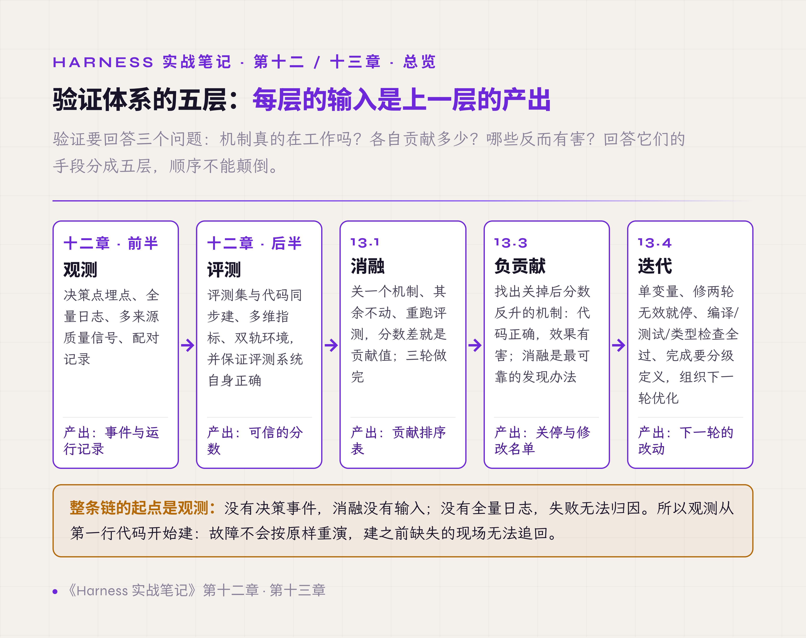
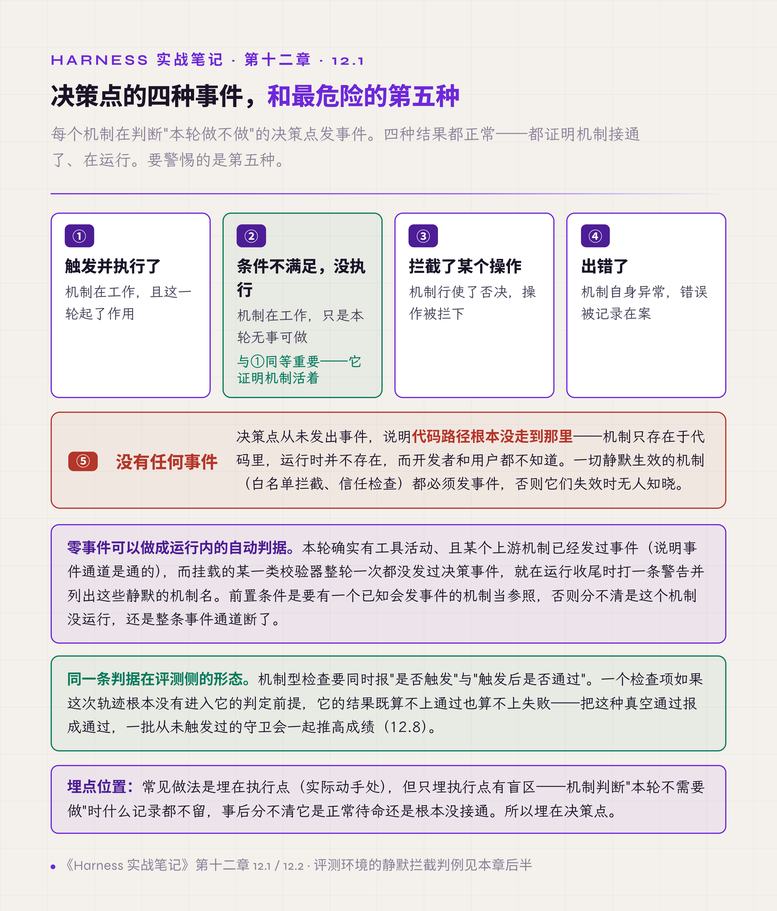
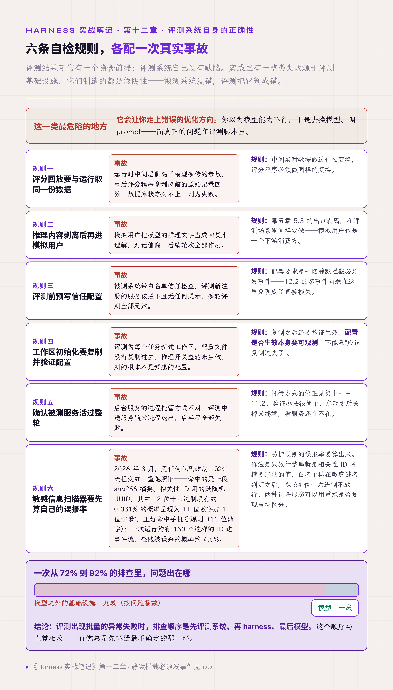

# 十二、观测与评测

前面十一章讲的是机制怎么建。从这一章起讲怎么验证它们真的在工作、各自值多少。

验证要回答三个问题：机制真的在工作吗？各自贡献多少？哪些反而有害？回答它们的手段分成五层，每层的输入是上一层的产出，顺序不能颠倒：

1. 观测（本章前半）：先让每个机制的运行留下记录，这是后面一切的输入。
2. 评测（本章后半）：建立打分体系，并保证评测系统自身正确。
3. 消融（13.1）：用分数量化每个机制的贡献。
4. 负贡献（13.3）：找出关掉之后分数反而上升的机制。
5. 迭代（13.4）：据此组织下一轮改动。

*图 12.1 · 验证体系的五层依赖：每层的输入是上一层的产出*

入门卷 §5.6 把观测面定为一个独立的 runtime 机制，§7 把整个优化循环组织成 Harness Lab（本书对"用评测、消融、调参迭代改进 harness 的外层工作台"的命名）。第二卷第十三章把证据面（系统为事后核查留下的全部记录）作为一层专门设计的部分。本章是这三处论述的实践部分：证据面缺一块会怎样、评测系统自己出错会怎样。

## 观测

### 12.1 埋点埋在决策点

每个机制都有一个判断"本轮做不做"的位置，这个位置叫决策点；实际动手的位置叫执行点。

埋点的常见位置是执行点，因为那里有实际动作可记。但只埋执行点有盲区：机制判断"本轮不需要做"时什么记录都不留，事后分不清它是正常待命还是根本没接通。

所以事件发在决策点，记录四种结果：执行了；条件不满足没执行；拦截了某个操作；出错了。这类每次检查都发、无论是否命中的事件，下文称为决策事件。

第二种记录与第一种同等重要：它证明机制在运行，只是本轮无事可做。

*图 12.2 · 决策点的四种事件与最危险的第五种*

### 12.2 没有任何事件是最危险的一种

四种结果之外还有第五种：某个机制的决策点从未发出过事件。

这说明代码路径根本没走到那里：**机制只存在于代码里，运行时并不存在**。代码在、测试过、评审通过，但注册线没接上或者条件永远为假，它从上线那天起就没运行过。开发者不知道，用户也不知道，直到某次事故才发现本该拦住它的机制是空的。

这类情况在实践中并不罕见。一套设计了七种生命周期事件的扩展机制，实际接通的可能只有一种，其余六种从未触发过一次。

有效做法是把零事件当成一种需要主动排查的状态：上线后逐个机制核对是否有事件产生。一切静默生效的机制（白名单拦截、信任检查、自动降级）都必须在每次检查时发决策事件，放行也发，不只在命中时发，否则它们失效时无人知晓。

这件事还可以做成运行内的自动检查，不必只靠上线后逐个核对：本轮确实有工具活动、且某个上游机制已经发过事件（说明事件通道是通的），而挂载的某一类校验器整轮一次都没发过决策事件，就在运行收尾时打一条警告，并列出这些静默的机制名。前置条件是要有一个已知会发事件的机制当参照，否则分不清是这个机制没运行，还是整条事件通道断了。

**证明一个机制在工作，唯一的方式是它留下了记录。** 零事件本身有两种解释：机制坏了，或者它运行了但无事可报。只有决策事件每次检查都发，这两种情况才分得开。分开之后剩下的前一种，对应第二卷 §13.6 所说两种沉默（该响的没响、报警器自己坏了）中的第二种，也是更难发现的那种。

### 12.3 日志从第一行代码开始存全量

常见做法是出了问题再补日志。这个做法行不通的原因很简单：故障不会按原样重演，缺失的现场无法追回。

有效做法是从第一行代码开始记：每次模型调用的完整输入输出、每次工具调用的参数和结果、时间戳，全部落盘；审计日志独立于业务数据。

第二卷 §13.2 给了一条更细的要求：写事实，离线再解释。记录的时候不要做判断（"这次调用失败是因为超时"），只记事实（调用发起时间、返回码、耗时），判断留给读数据的时候做。因为写入时的判断逻辑一旦有偏差，错误的解释就永久固化进了数据。§13.4 补了另一条：证据只追加，能修改的证据等于没有。

### 12.4 质量信号要多来源

只从模型输出文本推断运行质量会漏报。

一个真实的例子：工具返回了权限拒绝，模型据此给出一段合理的说明，文本层面完全看不出异常。检测器订阅的是文本，于是这次拒绝没有触发任何告警，而它其实是一次配置错误。

有效做法是质量判断同时订阅多个来源：工具执行结果里的成功标志、协议层错误、系统状态变化。用事件订阅获取，不要轮询：轮询有间隔，两次查询之间出现又消失的失败信号会被漏掉；把间隔调短，又白白增加开销。

**从输出推断状态，会漏掉那些被模型体面处理掉的失败。**

### 12.5 每个决策点都要有计数器

这一条是第十三章全部工作的前提，也是回答"阈值从哪来"的最终依据。

本卷前面各章给出的参考值，都是作者项目里实际采用的设定：70% 触发压缩、两百字符起丢弃、六次工具调用提醒（第七章 7.8 形态三）、连续三次空转暂停、四分之一占比成对丢弃。它们没有一个能靠推导得出。多数来自线上分布：先埋点，看真实数据的形态，再定在哪；其余来自可复述的推算（如第二章 2.4 按最坏的一轮推算的窗口预留量），推算的前提也要靠埋点验证。

第二章的五类限制配置更是如此：输出上限设多少、步数上限设多少，只能看触达率（真实运行中碰到该上限的比例）来判断。

有效做法是每个决策点配一个计数器，标签维度尽量细：不只记"压缩发生了几次"，还要记结果分类、失败原因、降级到了第几级、用户等级、运行模式。重试循环内部单独记尝试次数、成功、失败、重试。模型犯的错单独打点，指标描述里直接注明这是模型侧的错误。**监控一个失败模式的发生率，比静默容忍它有用得多**。

**没有埋点，就只能永远用推测出来的默认值。** 有埋点之后，每个阈值都变成一个可以回答的问题：现在定在这里，误报率多少、漏报率多少。

### 12.6 指标测不准就把盲区写进描述

有些指标天然测不准。

一个例子是首个响应时间。它从中间件入口开始计时，到内层流同步返回时停止。有些中间件把真正的工作放在异步流程里返回（例如图片压缩），这部分耗时不会被计入。于是这个数字系统性偏低。

修正测量方法成本高，还可能引入新的偏差。实践中的处理是：**不修测量方法，把这个盲区直接写进该指标的描述里**，让后续读数据的人知道它偏低、偏在哪。

这条做法可以推广到所有测量方法存疑的指标。测不准本身不是问题，问题是让别人拿着一个自己知道有偏差的数字做决策。

测不准还有一类处理：跨端测量的耗时要先做合理性裁剪再进分布。客户端与服务端时钟不同步时，算出来的耗时会出现负值，或者大到不可能的值。负值与超上限各归一类原因单独计数并丢弃，不混进分布。混进去之后，均值与尾部分位数都会被少数极端值带偏，而这种偏差从结果上看不出来源。

**指标的诚实性优先于指标的好看。**

## 评测

### 12.7 评测集与代码同步建

常见安排是先开发、完工后再建评测，于是中途每次改动的效果只能靠感觉判断。

评测集要与代码同步建，分数反映每次改动的真实影响。完整评测运行一轮成本高（一次五十任务的评测约 4.5 小时），所以另备三到五个典型用例作为冒烟测试（smoke test），每次改动后立即运行，取得快速反馈。

**"感觉好像更好了"不是结论。**

评测报告还要能回答三个问题：这份成绩跑的是哪一套语料、哪一份代码、什么环境。做法是给每次运行记一组溯源信息（provenance）。语料指纹只取用例的静态内容：提示词、来源、沙箱初始状态、检查条数，不取运行结果，所以同一套语料跑一百次指纹恒定，改一个字就变。代码指纹之外，不要只给"工作区是否干净"这样一个布尔值：已跟踪文件的改动会让提交号失真，未跟踪的新文件可能只是无关草稿，两者性质不同，分成两个计数交给读者判断；取不到时给空值，因为 0 会被读成干净。这与 12.6 的盲区声明是同一条要求。

用例本身也要登记来源：**每个用例都应当能追到它守的那次故障。** 本书把这类真实发生过、带编号、用作评测用例来源的故障案例称为判例。建议四项必填：判例编号、出处文档与章节、缺陷被观察到或被修复的提交、状态。状态分两类：已修的是回归守卫，未修的是对一个已知缺口的度量。没有来源的用例多半出自设想，它回答不了"agent 在真实发生过的失败上有没有退化"这个问题。

判例还有一个用途：防止对固定测试集过拟合。反复对着同一套用例调 prompt 和规则，测评分数会越来越高，上线后的问题却不见减少，入门卷附录 F 把这列为"对固定测试集过拟合"（AP20）。对策有两条：

- 用例分成开发集与留出集（held-out set）。开发集用于日常调参；留出集平时不看、不据它改东西，只在上线前跑一次，检查开发集上的提升是否还在。
- 线上新出现的失败登记为判例，回流进用例库。这样测试集跟着真实输入走，不会一直停在最初那一批。

### 12.8 指标要多维

单看通过率会漏掉两类信息。

第一类是过程成本：走了多少轮、花了多少 token、调了几次工具、有没有触发策略拦截。两个通过率相同的版本，一个用了 8 轮，一个用了 25 轮，质量并不相同。这一类里还要单独看第二章那五类限制的触达率：一个通过率没变但截断率翻倍的版本，实际在变差。

第二类是通过标准本身的多面性，用一个真实案例说明：某任务要求计算一笔金额并告知用户。模型算对了 1628 美元，数据库操作全部正确，但回复里没有说出这个数字，评分为 0。该评测在数据库比对之外另设了一个维度，检查关键信息有没有传达给用户。

结论是：**做对了事，还要按评分规则报告事。** 这条在真实业务里同样成立，用户要的是听到结果，而不只是系统里已经改对了。它和第七章 7.8 讲的交付可见性是同一个要求，这里体现在评测侧。

此外还有一维容易漏：机制型检查要同时报"是否触发"与"触发后是否通过"。一个检查项如果这次轨迹根本没有进入它的判定前提，它的结果既算不上通过也算不上失败。把这种空真式通过（vacuous pass：前提没出现，检查自动为真）报成通过，一批从未触发过的守卫会一起推高成绩。这与 12.1 决策点的四种结果是同一个道理："条件不满足没执行"要单独计为一类。

入门卷 §5.8 把 verifier 分成三层：代码可判定的硬性检查（Hard Gate）、开放产出的语义判定、多步推理的过程判定。结果类指标是第一层内部的细分：一次 Hard Gate 检查本身也可以包含多个判定条件。过程成本在三层之外单列，它不判对错，只记花了多少。

### 12.9 评测环境分双轨

对话类评测需要一个扮演用户的模拟程序，它由另一个 LLM 担任。选哪个模型来担任，有个两难。<!-- 待作者补充：所用基准的名称与版本（第十三章 13.2 的航空客服场景是否即此基准），以及基准指定的模拟用户模型 -->

全程用基准官方指定的模型，迭代成本压不住：一轮评测的模拟用户开销可能比被测系统还高。全程用便宜模型，测出的成绩别人不认，因为模拟用户的追问强度不同，分数没有可比性。

有效做法是分双轨：内部迭代用便宜模型（一个任务约两分钱<!-- 待作者补充：币种（人民币还是美元）与所用的便宜模型 -->），验证工程改动是否有效；对外报告成绩用官方指定模型，保证与他人可比。便宜模型能验证的是与模型能力无关的改动，即协议、工具、压缩、恢复这几类；prompt 措辞与规则遵循类改动的效果随模型变，这类在目标模型上抽样验证。

我们的经验是：**模拟用户的选择影响可比性，对改动的相对效果影响较小。** 判断"这次改动有没有用"，便宜模型通常够用；要对外报出一个分数，就必须用公认的那个。

### 12.10 先有假设再运行

改动之后不确定是否有效，顺手的动作是再运行一轮看看。

一轮 4.5 小时，连续三轮就是十三个小时，而没有假设的重跑只产出成本。

有效做法是每次启动前写下本轮要验证什么。入门卷 §7 还要求先做一步：估算统计功效（statistical power）。具体是算出在当前样本量（任务数乘重复次数）下的最小可检测效应（minimum detectable effect，MDE），即在给定显著性水平与功效下能可靠分辨的最小差异。样本量越小，MDE 越大：大的差异看得出来，小于 MDE 的差异会淹没在噪声里。<!-- 待作者补充：原稿"小样本能看出十个百分点级的差异，看不出五个百分点以内的"对应的任务数、重复次数、显著性水平与功效；补齐后可写回具体的 MDE --> 不先算这笔账，小样本消融的典型结局是把噪声当信号：同一个机制的贡献值在两轮之间符号翻转。

## 评测系统自身的正确性

评测结果可信有一个隐含前提：评测系统自己没有缺陷。实践里有一整类失败源于评测基础设施。按"判为通过"为阳性的约定，下面六条事故制造的都是假阴性：被测系统没错，评测把它判成失败。但评测缺陷不只朝这一个方向偏，也有抬高分数、制造假阳性的，例如 12.8 的空真式通过，以及本节末尾的复跑不独立。

假阴性这一类最危险的地方在于它会让你走上错误的优化方向：你以为模型能力不行，于是去换模型、调 prompt，而真正的问题在评测脚本里。

六条规则，各配一次真实事故：

**评分回放要与运行取同一份数据。** 运行时中间层剥离了模型多传的参数，事后评分程序拿剥离前的原始记录回放，数据库状态对不上，判为失败。规则：中间层对数据做过什么变换，评分程序必须做同样的变换。

**推理内容剥离后再进模拟用户。** 这是第五章 5.3（出口处剥离推理内容）那个问题在评测场景的具体后果：模拟用户把推理文字当回复理解，对话偏离，后续轮次全部作废。

**评测前预写信任配置。** 被测系统带白名单信任检查，评测新注册的服务被拦下且无任何提示，多轮评测全部无效。配套要求：一切静默拦截必须发事件（这是 12.2 那条要求在评测侧的落实）。

**工作区初始化要复制并验证配置。** 评测为每个任务新建工作区，配置文件没有复制过去，推理开关整轮未生效，测的根本不是预想的配置。复制之后还要验证生效，配置是否生效本身要可观测。

**确认被测服务活过整轮。** 后台服务的进程托管方式不对，评测中途服务随父进程退出，后半程全部失败（修正方法见第十一章 11.2：后台服务要真正脱离父控制台和作业）。

**敏感信息扫描器要先算自己的误报率。** 在报告组装阶段挂一个敏感信息扫描器，看起来只有收益。其中一条规则匹配中国大陆手机号：正则 `1[3-9]\d{9}`，要求前后不紧挨其他数字。

先算相关性 ID 的误报。相关性 ID 用的是随机 UUID，其中 12 位十六进制段有约 0.031% 的概率呈现为"11 位数字加 1 位字母"且数字段以 1 开头、第二位是 3 到 9，正好命中这条规则（200 万个 UUID 实测命中 617 个）。一次运行约有 150 个这样的 ID 进事件流，于是整跑在报告组装阶段被误杀的概率约 4.5%。付费基线上这意味着跑完全部场景、付掉全部 token 费用，然后什么都拿不到。

摘要上也有同类误杀：单个 sha256 摘要串命中同一条规则的概率实测 0.3241%。2026 年 8 月真实发生过一次：无任何代码改动，验证流程变红，重跑照旧变红，命中的是一段 sha256 摘要。两种误杀可以用重跑是否复现当场区分：UUID 每次运行重新随机生成，误杀不会在重跑时复现；摘要由内容决定，内容不变，重跑必然再次命中。修法是只放行整串就是相关性 ID 形状或摘要形状的值，白名单排在敏感键名判定之后，裸的 64 位十六进制串不放行。

这一条的要点是**防护规则的误报率要算出来**：概率性误报表现为随机失败，比确定性缺陷更难归因。它与第十章 10.5（用外部输入作键的结构要先算清上限）、第六章 6.2 防误判的四条是同一类要求：防护机制自己先要算清楚。

前五条出自同一次排查，那次排查伴随着通过率从 72% 升到 92%（第十三章 13.2 讨论这 20 个百分点的来源）。排查中发现的问题，有相当一部分出在模型之外的评测与运行基础设施。<!-- 待作者补充：那次排查的问题总数与分布（评测系统、harness、模型各几条），以及修复评测系统缺陷是否影响 13.2 的基线数字 --> **评测出现批量的异常失败时，排查顺序是先评测系统、再 harness、最后模型。**

*图 12.3 · 评测系统自身的六条自检规则*

入门卷 §7 还讨论了一个问题，与上面六条同属评测系统自身的缺陷，方向却相反：重复运行同一个用例时，N 次复跑未必独立，通过率与稳定性会被高估。入门卷附录 F 把它列为"复跑不独立"（AP01）。来源有四类：

- 响应缓存（response caching）：客户端或评测工具缓存了上一次的响应或轨迹，或者网关、代理按请求内容直接返回之前生成的完整输出。N 次平均退化成 1 次，成绩虚高。
- 固定 seed：每次采样走同一条路。
- 试验之间的共享状态：上一次留下的文件、记忆、可读的提交历史，模型会从里面占到便宜，几次试验因此相关。
- temperature 为 0：前缀缓存命中会减少数值上的不确定性，输出更容易逐字复现，N 次近似同一次。

除最后一种情形外，服务端的前缀缓存（prefix caching，也叫提示词缓存）不在其列。它复用的是 prompt 前缀的计算结果，不缓存输出，采样在其后照常进行；DeepSeek、OpenAI 的官方文档都写明前缀缓存命中不改变输出。temperature 大于 0 时，命中缓存的那一次仍然是独立样本。

对策是三项：

- 评测链路上关掉响应缓存，确认 temperature 与 seed 的设置。
- 每个试验从干净环境开始，不共享工作区与记忆。
- 需要给每次运行加随机串（per-run nonce）时，想清楚要测什么。随机串是输入扰动测试最简单的实现，测的是 agent 对输入微小变化的敏感度。放在系统提示词开头，它会让不同运行之间的前缀缓存全部失效，评测的输入费用按全量重算；只想区分每次运行、不想增加费用时，放在最后一条消息的尾部。

复跑不独立容易和另一个问题混在一起：测评分数高、上线后问题多，真正的原因往往是对固定测试集过拟合（AP20），对策见 12.7 的开发集与留出集。

## 本章与前两卷的对应

入门卷 §5.6 把观测面定为独立机制，Spec 1.5 要求从第一行就埋点；12.1、12.2 是它没建好时的两种形态，12.3 是那条要求的正文。§5.7 的 trajectory 是 12.3 的载体。§5.8 的 verifier 三层与 12.8 的多维指标是同一件事的两个粒度。§7 的 Harness Lab 五层（Observe、Score、Ablate、Tune、Iterate）与图 12.1 的五层大体对应：Observe 对应观测，Score 对应评测，Ablate 对应消融与负贡献，Tune 与 Iterate 对应迭代。本章补的是每一层的实际失效方式。

第二卷第十三章的证据面在本章各节都有对应：§13.2 写事实离线再解释（12.3）、§13.4 只追加（12.3）、§13.6 两种沉默（12.2）、§13.5 决策与完成都要留证（12.5 的计数器）。90-artifacts 的检测器测试记录（Y）要求为每个检测器登记它自己被验证过。12.2 的零事件正是这份登记表要防的情况，而 12.2 给出的运行内自动检查，是这份登记表的运行时版本。

本章还补了评测侧的三项要求：报告要能回答跑的是哪套语料、哪份代码、什么环境（12.7 的溯源信息）；每个用例要能追到它守的那次故障（12.7 的判例登记）；机制型检查要分开报是否触发与触发后是否通过（12.8）。三项合起来回答的是同一个问题：这份成绩说的到底是什么。
