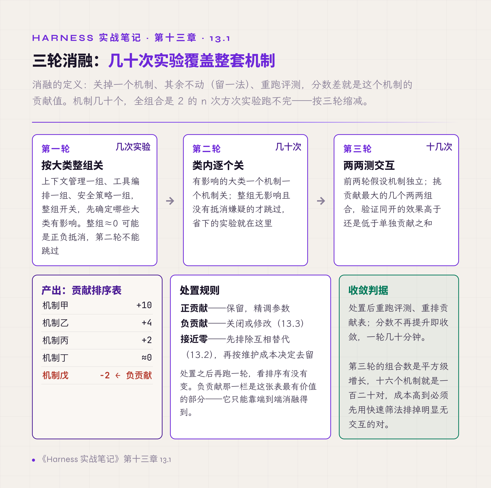
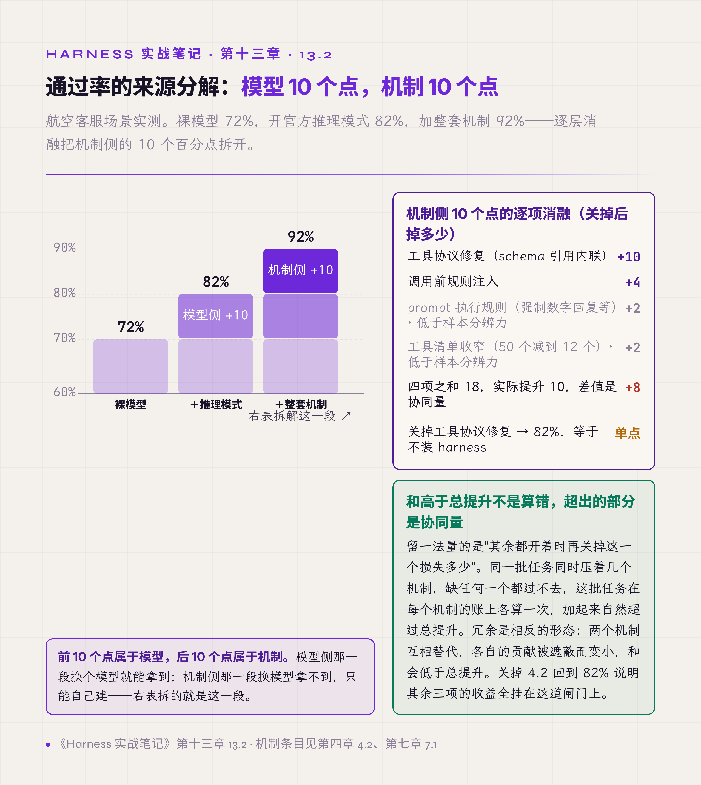
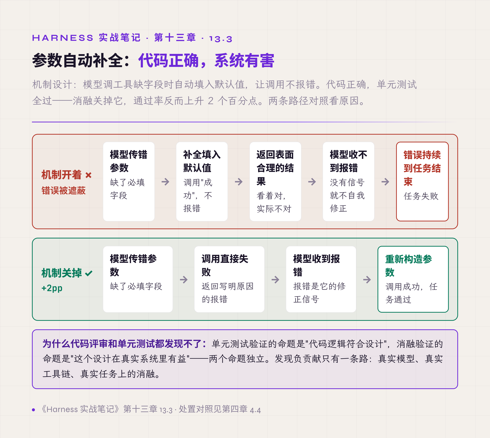

# 十三、消融、负贡献与迭代

评测给出总分，回答不了"这个分数里每个机制占多少"。要归因，用消融。

这一章讲三件事：怎么用有限的实验次数摸清全部机制的贡献；怎么找出那些看着有用实际有害的机制；以及多轮优化要守哪几条纪律。

入门卷 §7.4 把消融组织成三个阶段并给出统计学基线。本章是那套方法的实践记录，重点在它产出的那类结论——**只有消融能发现的东西**。

## 13.1 三轮消融摸清整套机制

消融的定义很简单：关掉一个机制、其余不动、重跑评测，开关前后的分数差就是这个机制的贡献值。正的说明有效，负的说明有害，接近零说明可有可无，但要先排除它与别的机制互相替代（13.2）。本章的贡献值全部是留一法——其余都开着时关掉这一个的损失；从零逐个加入得到的是另一组数，两者不能混。

机制有几十个，全组合是二的 n 次方次实验，运行不完。按三轮缩减：

**第一轮按大类整组关。** 上下文管理一组、工具编排一组、安全策略一组、行为规范一组，整组开关，先确定哪些大类有影响。这一轮只需要几次实验，产出的是方向不是精度。整组关掉分数不变，还有一种解释是组内正负抵消，这样的组第二轮不能跳过。安全策略组不按通过率结算，它的指标是拦截率与误伤率，按通过率算多半是负数。

**第二轮在有影响的大类内逐个关。** 无影响的大类整组跳过，省下的实验就在这里。这一轮运行几十次。

**第三轮测两两交互。** 前两轮假设机制互相独立，实际未必——甲和乙一起开的效果可能高于两者单独贡献之和（协同），也可能低于（拮抗）。挑贡献最大的几个两两组合验证，这一轮十几次。

三轮合计几十次实验可以覆盖整套机制。产出是一张贡献排序表，处置规则：正贡献保留并精调参数；负贡献关闭或修改；接近零的按维护成本决定去留。处置后重跑重排，分数不再提升即收敛。

还有一条关于开关本身的准入规则：能力开关表里只放这样一类能力——关掉它之后，系统仍然是同一个系统。关掉之后性质就变了的不要做成开关，它没法消融，因为消融要求开关前后的两个版本可比。

*图 13.1 · 三轮消融的流程与产出*

入门卷 §7.4 对这套流程有两处补充值得照做：第三轮的组合数是平方级增长，十六个机制就是一百二十对，成本高到必须先用快速筛法排掉明显无交互的对；以及贡献值的显著性要用配对检验判断，不要看固定的百分点阈值——小样本下的两个百分点可能只是噪声。

## 13.2 一次真实的贡献分解

航空客服场景的实测。基线是三个数：模型直接运行通过率 72%；开启官方推理模式 82%；加上整套 harness 机制 92%。

前 10 个百分点属于模型，后 10 个百分点属于机制。逐层消融把后者拆开：

| 机制 | 关掉后通过率 | 贡献 |
|---|---|---|
| 工具协议修复（第四章 4.2 的 schema 引用内联） | 82% | +10 |
| 调用前规则注入（第七章 7.1） | 88% | +4 |
| prompt 执行规则（强制数字回复等） | 90% | +2 |
| 工具清单收窄（50 个减到 12 个） | 90% | +2 |

按 12.10 的功效估算，+2 落在这批样本的分辨力之下，+4 接近下限；这两行的方向可信，大小要靠更大样本或第三轮两两组合确认。

*图 13.2 · 通过率的来源分解：贡献和高于总提升的部分是协同量*

四项贡献之和是 18，高于实际总提升 10。这不是计算错误。它是留一法的算法特性。留一法量的是"其余机制都开着时，再关掉这一个损失多少"。同一批任务可能同时压着几个机制：既要工具协议正确，又要规则在调用前注入，缺任何一个都过不去。逐个关的时候，这批任务在每个机制的账上各算一次，加起来自然超过总提升。超出的部分是机制之间的协同量——两个机制的情形下它等于 f(甲乙)+f(空)−f(甲)−f(乙)，为正是协同，为零是可加，为负是冗余。

方向不要弄反。冗余是另一种形态：两个机制各自都能救同一批任务，关掉任一个另一个仍然接住，两个贡献互相遮蔽而变小，和会低于总提升。举个数：10 个任务，甲修好 1 到 6 号，乙修好 4 到 9 号，一起开通过 9 个；关甲掉到 6，关乙也掉到 6，两个贡献各 3，和是 6，总提升是 9。协同抬高贡献和，冗余压低贡献和。

表里还有一个数要单独看：关掉工具协议修复之后通过率是 82%，与不装 harness 的 82% 相同。其余三项在它缺席时一分也拿不到，它们的收益全部挂在这道闸门上。这条链上任何一环失效，整条链回到起点，所以它需要的是单点监控和回归用例。如果所有贡献值之和恰好等于总提升，说明这几个机制在测得的精度上表现为可加；这不能反过来证明它们互不影响，正的协同项和负的冗余项也可能恰好抵消，要确认得补测两两组合。

判据：**贡献值之和高于总提升说明机制互相依赖，低于总提升说明互相替代；两种都正常，先分清是哪一种再读数。**

## 13.3 负贡献：只有消融能发现的东西

消融最有价值的产出是负贡献——关掉之后分数反而上升的机制。负贡献分两档，看它拖累的失败样本：集中在机制的某一个分支上，是实现缺陷，修好再测；均匀分布在它覆盖的全部任务上，是设计本身有害，删。下面三个真实案例都落在后一档。

**参数自动补全。** 模型调工具缺字段时自动填入默认值，让调用不报错。代码正确，单元测试全过，看起来是个周到的容错设计。消融关掉它，通过率上升 2 个百分点。

原因是它遮蔽了模型本该收到的错误信号。模型传错参数，补全让调用照样成功，返回一个表面合理、实际错误的结果；模型收不到报错，也就不会修正，错误一路持续到任务结束。关掉之后，错误调用直接失败，模型收到报错、重新构造参数、任务通过。第四章 4.4 说缺失参数不代填，依据就是这组数据。

*图 13.3 · 自动补全开与关的两条路径*

**覆盖全生命周期的 hook 体系。** 第七章 7.7 提到的过度设计，消融定性为负贡献：排查成本明显上升，而收益测不出来。

**前端状态缓存。** 第八章 8.3 的快照问题，同样是负贡献：为性能加的缓存带来一致性故障，用户看到过期状态。

三个案例的共同点是：**代码逻辑正确，系统效果有害。**

这类问题代码评审和单元测试都发现不了，原因不在于评审不认真，在于两者验证的命题不同：单元测试验证的是"代码逻辑符合设计"，消融验证的是"这个设计在真实系统里有益"。两个命题互相独立，第一个成立不蕴含第二个成立。

发现负贡献只有一种方式：真实模型、真实工具链、真实任务上的消融。

由此得到一个对全部工程经验的重新定位：**前面十一章的每一条有效做法，本质上都是一条待验证的假设。** 参数自动补全在进入消融之前，同样被当作合理设计，写进过规范、通过过评审。一套积累下来的经验条目里，通常混着若干条这样的假阳性；不做消融，它们会一直当作最佳实践传下去。

## 13.4 迭代纪律

消融给出单轮结论，多轮优化还需要几条组织规则。这些规则看起来像洁癖，实际都有硬理由。

**每轮只改一个变量。** 常见的破坏方式是顺带修改：改甲时发现乙也有问题，一并改了。同时改两处，分数变化无法归因到任何一处，整套消融框架失去前提——这不是洁癖，是消融方法的数学要求。范围之外的发现记录下来，本轮不动手。语料指纹与代码签名是这条纪律的机器证据（12.7）——两轮之间语料指纹或代码签名变了，这一轮的对比就不成立。

**同一问题修两轮仍失败就停。** 连续修四五轮的常见结局是改动越来越乱，最后发现原因在完全不同的位置。两轮无效就停下来，重新提出原因假设，换方向验证。注意与第六章 6.1 的工具断路器区分：那是 agent 的运行时机制，这条是开发者对自己的约束，两者的判据其实是同一条——**同样的动作重复两三次仍无进展，说明假设错了，不是力度不够。**

**修复必须过验证三件套。** 编译、测试、类型检查三项全过才算修复完成。"改完了应该能运行"的状态下宣布完成，是缺陷报告的主要来源。

**完成要分级定义。** 做完了分四级：结构完成、数据填充完成、格式验证通过、可交付。每级有检查项，报告进度报到级别。缺了分级，"完成"一词在不同人口中含义不同——模型说完成了演示文稿的结构，用户打开发现三张图没生成、五处格式错，两边说的都是"完成"。

**用结构代替提醒。** 以上纪律写在文档里会被遗忘，这和规则写在 system prompt 里被模型遗忘是同一个现象。可靠的形式是结构性约束：埋点、配额、超时、检查清单，让违反纪律的路径在机制上走不通。

最后这条值得多说一句。本册反复出现的一个对称是：**对模型有效的办法，对人也有效；对人无效的办法，对模型也无效。** 写在开头的规则会被遗忘、语气加重没有效果、要在使用的那一刻给出提示、能用机制约束的不要只靠自觉——这几条在第四章讲工具描述、第七章讲提醒注入、这一章讲迭代纪律时，是同一句话的三个版本。

## 本章与前两册的对应

入门卷 §7 的 Harness Lab 把优化循环组织成观测、打分、消融、调参、迭代五层，本章是其中消融与迭代两层的实践；§7.4 的三阶段消融、交互项、统计基线在 13.1 全部对应，本册补的是贡献和与总提升不相等时怎么读——高于是协同，低于是冗余。§7 里"局部正确、全局有害"的判断在 13.3 有三个具体案例。

入门卷 §11 的落地 Spec 里有一道机制准入闸门——每个进默认配置的机制都要过一遍。13.3 强调了其中一条准入项：**它在端到端消融里是正贡献吗**。代码正确、测试通过、评审通过，都不能替这条回答。

入门卷 §9 的控制论四原则收束全书，13.4 的迭代纪律是它在开发流程上的落法：控制变量、有反馈、有边界、可收敛。

第二卷 §14 讲从零构造一个最小但完整的 runtime，并要求验收看的是标准故障包全绿而不是"能运行"。13.3 说明这份故障包还该加一类用例：**那些代码正确但系统有害的设计**，它们不会在故障包里失败，只会在消融里显现。
