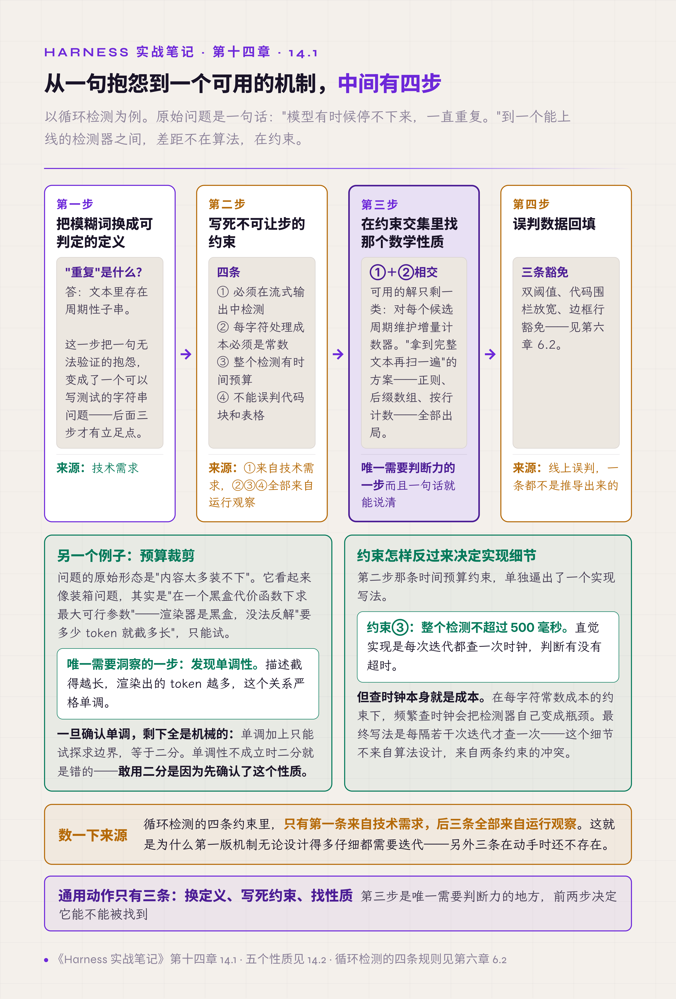
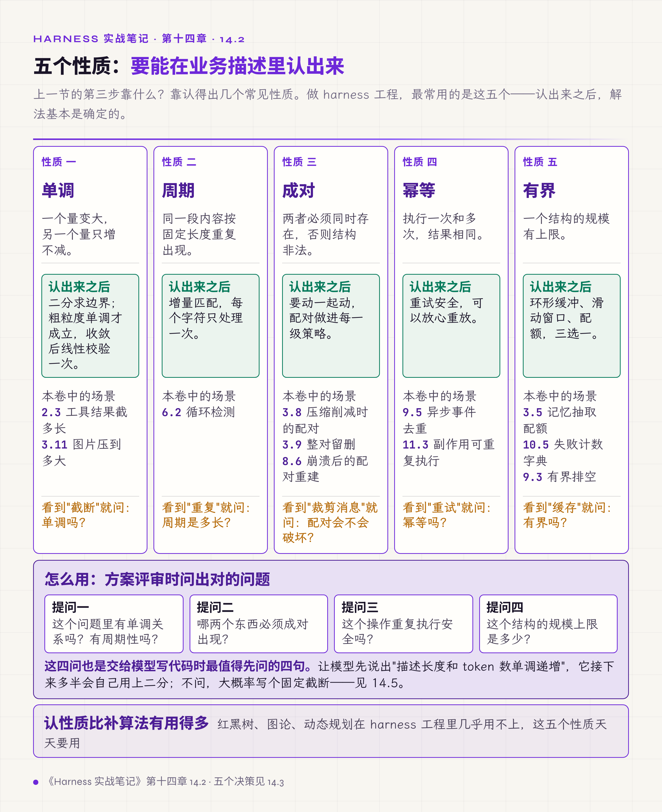
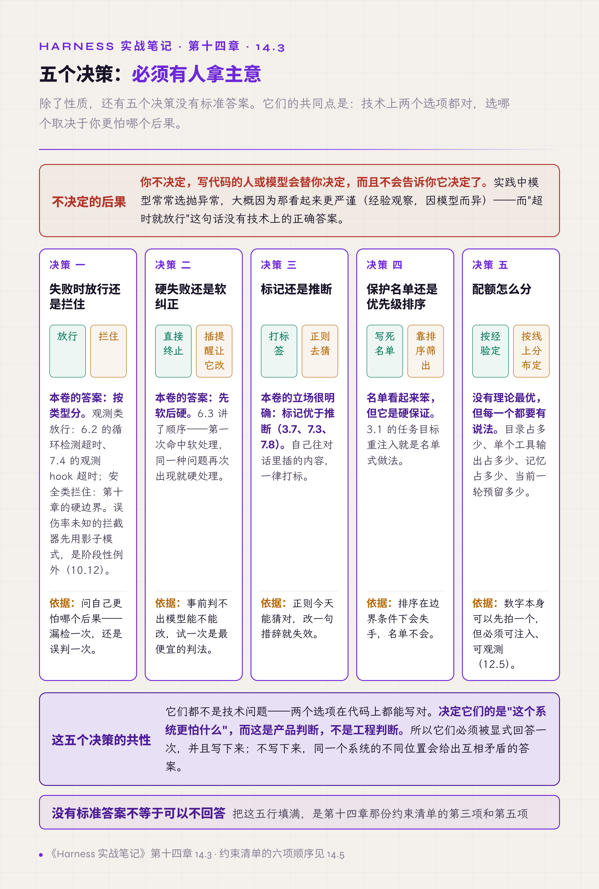
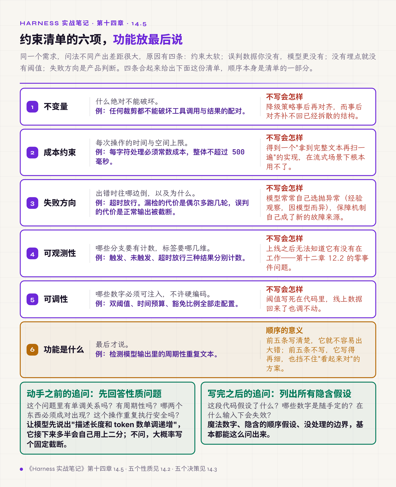

# 十四、把故障经验变成事前约束

前面十三章可以当作一份故障清单来读。这一章讲怎么用它：把这类经验变成下一次动手之前就定死的约束，而不必逐条去记。

有一条贯穿全卷的顺序：**真实故障在前，硬约束在中，好方案在后。** 顺序不能倒过来。第六章的表格边框豁免、第三章的字节预算、第十章的可信代理名单，没有一条是从设计原则推导出来的，全部是先出了故障，约束才定死，方案才收敛。

这一章讲怎么缩短这个链条。

## 14.1 方案的差距在约束，不在算法

拿本卷两个机制做例子。

**循环检测**的原始问题是一句抱怨：模型有时候停不下来，一直重复。从这句话到一个可用的检测器，中间有四步。

第一步，把模糊词换成可判定的定义。"重复"是什么？答：文本里出现周期性子串，即同一段内容首尾相接地连续重复，重复次数达到下限，并且周期长度乘以重复次数超过门槛（6.2 的双阈值，参考值 100，经验值，按场景调整）。只看重复次数，"哈哈哈哈哈"这样的短重复也会被算进去。这一步把抱怨变成了字符串问题。

第二步，写死约束。最终定下的约束有四条：必须在流式输出中检测，不能等消息写完；每个字符的处理成本必须是常数（对固定数量的候选周期而言）；整个检测有时间预算；不能误判代码块和表格。这里是按事后整理的顺序写的。实际的时间线上，这四条并不是一开始就齐的：后三条来自运行观察，其中"不误判"是第四步的误判反馈补进来的，每补进一条，第三步都要重新做一遍。

第三步，看约束的交集还剩什么。流式加每字符常数成本这两条一交，可用的解基本只剩一类：对每个候选周期维护增量计数器。所有"拿到完整文本再扫一遍"的方案（正则、后缀数组）都出局。它们出局的原因不在质量，而在于不满足约束。时间预算这一条又单独逼出了"每隔若干次迭代才查一次时钟"的写法，因为频繁查时钟本身就是成本。

第四步，误判数据回填。双阈值、代码围栏放宽、边框行豁免，这三条都不是推导出来的，而是线上误判反馈回来的。

四条约束里只有流式检测这一条来自技术需求，常数成本、时间预算、不误判三条全部来自运行观察。

**预算裁剪**是另一个例子。问题的原始形态是内容太多装不下。它看起来像装箱问题，其实不是。真正的形态是"在一个黑盒代价函数下求最大可行参数"：渲染器是黑盒，没法反解"要多少 token 就截多长"，只能试。

然后是唯一需要洞察的一步：发现单调性。被裁剪的描述保留得越长，渲染出的 token 就越多。在几十字符以上的粒度上，这个关系近似单调，分词边界处会有正负一个 token 的抖动。一旦确认近似单调，剩下的步骤全是机械的：近似单调加上只能靠试探求边界，就是二分；收敛之后在边界附近再做一次线性校验，吃掉那个抖动。

反过来说，如果单调性不成立，二分就是错的，得换成线性下探。**敢用二分，是因为先确认了这个性质，而不是因为二分是个常见算法。**

两个例子的通用动作可以归成四步，与图 14.1 对应：

1. 把模糊词换成可判定的定义；
2. 写死不可让步的约束，尤其是成本约束和失败方向；
3. 在约束的交集里找那个数学性质；
4. 用运行中的误判和实测数据回填约束。

第三步是唯一需要判断力的地方，而且通常一句话就能说清。

*图 14.1 · 从模糊需求到可用机制的四步，以及每一步的输入来源*

## 14.2 五个性质：要能在业务描述里认出来

上一节的第三步靠什么？靠认得出几个常见性质。做 harness 工程，最常用的是下面五个。

| 性质 | 认出来之后 | 本卷中的场景 |
|---|---|---|
| **单调** | 二分求边界 | 工具结果截多长（2.3）、图片压到多大（3.11） |
| **周期** | 增量匹配，不重扫 | 循环检测（6.2） |
| **成对**（配对不变量：成对的两项必须同时保留或同时删除） | 要动一起动 | 工具调用与结果的配对（3.8、3.9、8.6） |
| **幂等** | 重试安全，可以放心重放 | 异步事件去重（9.5）、副作用可重复执行（11.3） |
| **有界** | 环形缓冲、滑动窗口、配额 | 记忆抽取（3.5）、失败计数字典（10.5）、有界排空（9.3） |

*图 14.2 · 五个性质、它们各自带来的解法、以及本卷中的出处*

会认这五个，方案评审时就能问出对的问题：看到"截断"就问单调吗，看到"重试"就问幂等吗，看到"裁剪消息"就问配对会不会被破坏，看到"缓存"就问有界吗。

这比补算法有用得多。红黑树、图论、动态规划在 harness 工程里几乎用不上，认性质的能力天天要用。

## 14.3 五个决策：必须有人拿主意

除了性质，还有五个决策没有标准答案，但**必须有人决定**。你不决定，写代码的人或模型会替你决定，而且不会告诉你它决定了。

**失败时放行还是拦住。** 保障机制自己出问题时怎么办，也就是选失败放行（fail-open）还是失败拦截（fail-closed）。本卷给的答案是按类型分：

- 观测类失败放行，如 6.2 的循环检测超时、7.4 的观测 hook 超时；
- 安全类失败拦截，如第十章的硬边界；
- 有一个阶段性例外：误伤率未知的拦截器，先按 10.12 以影子模式（shadow mode）运行，只记录、不阻断；等误伤率（用真实流量算，对"本会拦截"的样本抽样人工复核）和漏报率（用标注过的攻击样本算）都降到事先定好的上限以内，再转为拦截。

判断时问自己更怕哪个后果：漏检一次，还是误判一次。

**硬失败还是软纠正。** 检测到问题是直接终止，还是插一条提醒让模型自己改。6.3 讲了两条路的先后：先软一次，同一种问题再次出现就硬。

**标记还是推断。** 自己插进对话的内容是打标签，还是事后用正则去猜。本卷的立场很明确（3.7、7.3、7.8）：标记优于推断，正则今天能猜对，明天改一句措辞就失效。3.10 的"能追加就不改写"是同一立场的另一面。

**保护名单还是优先级排序。** 裁剪时保住关键项，是写死一份名单，还是靠优先级排序自然筛出。名单看起来笨，但它是硬保证；排序在边界条件下会失手。3.1 的任务目标重注入就是名单式做法。

**配额怎么分。** 目录占多少、单个工具输出占多少、记忆占多少、窗口给当前一轮预留多少。这类数字没有理论最优，但每一个都要有说法，而且要可注入、可观测（12.5）。

*图 14.3 · 五个必须自己拿主意的决策及其判据*

## 14.4 一个通用工程模式：渲染、测量、调整、重渲染

当代价函数是黑盒、没法预测输出多大时，就不要预测，直接试。

本卷里这个模式出现过两次：预算裁剪（每一级降级都真渲染一遍再测量，不按字符数估）、压缩降级链（每次失败按错误类型改输入再试，见 3.8）。

配套的是**降级链**：不是"能装下"和"装不下"两种状态，而是若干级，每级损失更多，但保住更重要的东西。写降级链的时候，它强迫你排出"什么最重要"的顺序，**这个排序动作本身比代码更有价值**。

第二章 2.3 按结果体量分的四种处理、第三章 3.8 的三级削减、第八章 8.6 的三级重建，都是这个形态。

## 14.5 让模型写出这种代码的提问结构

现在多数 harness 代码由模型协助写出。同一个需求，问法不同，产出的质量差距很大。

原因有四条，越往后越难靠换一个更强的模型来解决。

**约束太软。** 说"写个函数检测文本重复"，得到的大概是：按行切分、计数、超过 N 次报警。这个方案在 14.1 那四条约束下都不成立，但它看起来对，而且能通过你想得到的测试。模型满足的往往是"通过你能想到的测试"，而不是"在你想不到的场景下不出事"。

**误判数据你没有，模型更没有。** 表格边框豁免来自一次真实观察：有人看到 agent 画表格时被检测器误判。这是信息差距，而不是能力差距。

**没有埋点就没有阈值。** 阈值这类参考值，模型会给出"合理的默认值"，但那是猜的。正确的要求是让它**把这些数做成可注入、可观测的**，等真实分布回来再定。

**失败方向是产品判断。** "超时就放行"这句话没有技术上的正确答案，取决于更怕哪个后果。你不说，模型就会自己选一个。实践中它常常选抛异常，大概因为那看起来更严谨（经验观察，因模型而异）。

所以把需求翻译成约束清单再交给模型，**顺序很重要：功能放最后说**。实践中常见的情况是，模型会顺着先读到的内容组织方案：先说功能，它会先想出一个实现，再把后面的约束当补丁往上贴；先说约束，它在设计实现时就把约束算进去了。

1. 不变量：什么绝对不能破坏（例：任何裁剪都不能破坏工具调用与结果的配对）
2. 成本约束：每次操作的时间与空间上限（例：每字符处理必须常数成本，整体不超过 500 毫秒）
3. 失败方向：出错时往哪边倒，以及为什么（例：超时放行，漏检的代价是偶尔多跑几轮，误判的代价是正常输出被截断）
4. 可观测性：哪些分支要有计数，标签要哪几维
5. 可调性：哪些数字必须可注入，不许硬编码
6. 最后才说功能是什么

前五条写清楚，第六条就不容易出大错；前五条不写，第六条写得再详细，也挡不住本节开头那种"看起来对"的方案。

*图 14.4 · 约束清单的六项顺序，以及每一项缺失时的典型产出*

还有两个高杠杆的追问。

- **动手之前**，先让它回答性质问题：这个问题里有单调关系吗？有周期性吗？哪两个东西必须成对出现？这个操作重复执行安全吗？让模型先说出"描述长度和 token 数单调递增"，它接下来多半会自己用上二分；不问，大概率写个固定截断。
- **写完之后**，让它列出所有隐含假设：这段代码假设了什么？哪些数字是随手定的？在什么输入下会失效？魔法数字、隐含的顺序假设、没处理的边界，基本都能这么问出来。

## 14.6 期待要调：好代码是改出来的

最后说一件不太舒服的事。

本卷所有机制都不是一次写成的。豁免规则的存在本身就是迭代的证据：每一条豁免背后都有一次误判，每一个阈值背后都有一段线上分布。约束前置能让第一版好很多，但它不能替代运行。

所以合理的期待是：第一版把不变量、成本约束、失败方向定死，把埋点做全；然后让它运行，等数据回来再调阈值、补豁免。**没有埋点的第一版，无论写得多好都无法改进。** 这是第十二章 12.5"每个决策点都要有计数器"的另一种说法。

读别人的系统、读自己的事故记录，最大的收益不是拿到方案，而是拿到一份失败清单，省掉自己重复经历的那几遍。本卷就是为这个用途写的。

## 全卷收束

十四章可以压成三句话。

**第一句：模型只占十三步里的一步，其余十二步决定它的能力能发挥出多少。** 13.2 的实测里，同一个模型、同样开着推理模式，按默认配置直接运行是 72%，加上 harness 机制之后是 92%，同一批五十个任务上相差 20 个百分点，其中一部分来自两次运行的评测设置不同。第一章给出十三步的地图，第二章到第十一章逐个讲它们的失效形态和修法。

**第二句：说了不等于做到，做了不等于有用。** 前半句对应第十二章：prompt 里写的约束要配运行时检测，机制写了要有事件记录它确实在运行。后半句对应第十三章：机制在运行不代表它有正贡献，三个案例表明代码正确的机制也可能让系统变差。

**第三句：故障是约束的来源，约束是方案的来源。** 第十四章讲的就是怎么把前十三章的故障变成下一次动手前的约束清单。

回到第一章开头那句判断：**agent = 模型 + harness。模型是核心，而模型的全部能力只能经由上下文被调用；harness 的工作是通过有效的上下文管理，最大限度释放这个能力，并让它在可控的环境下完成任务。**

按这句判断里的三件事把全卷重排一遍（第一章的十三步是全流程的总图，不单归其中哪一项）：

- **上下文管理**决定模型每一轮看到什么：第三章的压缩、第四章的工具清单、第七章的提醒注入，讲的都是这件事的实现与失效。
- **释放能力上限**要求不用不必要的限制削减模型本来能做到的事：第二章的五类限制、第五章的协议兼容，以及第六章的误判防护，都是在避免 harness 自己成为瓶颈。
- **可控的环境**要求边界由代码保证：第六章的循环终止、第八章的崩溃恢复、第九章的取消与幂等、第十章的权限收窄、第十一章的运行环境，构成模型能力发挥的边界条件。

第十二章到第十四章不属于这三件事中的任何一项，它们是判断这三件事做得好不好的手段：留下记录、量化贡献、把结论变成下一轮的约束。

这个结构和入门卷 §9 的控制论四原则、第二卷 §15.6 的收束句是同一件事的不同说法。第二卷最后写的是：模型可以不确定，runtime 不能不知道自己发生了什么。本卷十四章，讲的都是 runtime 怎么知道自己发生了什么，以及知道之后该拿这些信息做什么。
