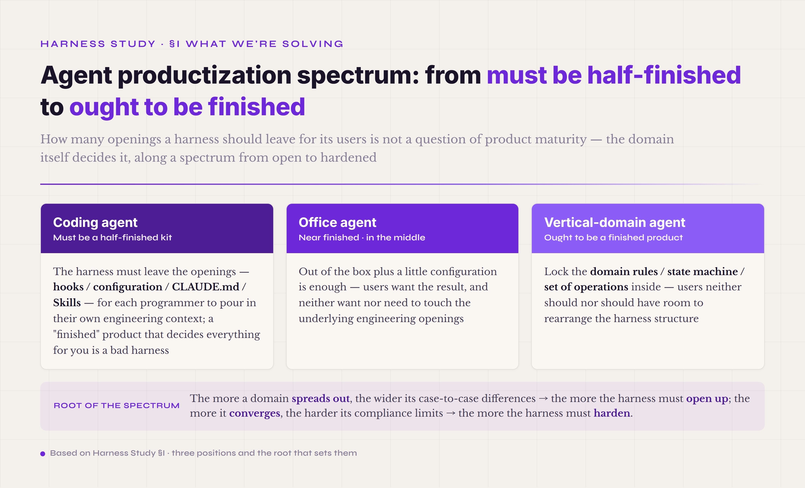

# §I · Why harness — what problem we are actually solving

Underneath everything, a large language model is just a function: it predicts the next token. You give it some text, and it returns a probability distribution over what comes next. You sample one token, add it back to the input, and ask again — and you keep going until the model emits a stop token or hits its length limit. Each step is a single forward pass on the GPU, and then it's done.

What the model can't do matters just as much. It carries no state from one call to the next. Its weights were frozen at training time, so at inference there's nothing inside it that can remember what you said three minutes ago. It can't open a file — it has no concept of file I/O, and anything it knows has to arrive through the prompt. And it can't touch the network, because the only move it can make is to produce the next token.

So treat the model as a **pure function**. That is where understanding its engineering nature begins. The same input gives, in principle, the same distribution; nothing is remembered between calls, and on its own the model can change nothing in the outside world. None of that is strange — every mathematical function works this way. What is strange is the job we ask of it, because it is not a job any function can do.

Now take an ordinary request: "fix this bug for me." Look at what's actually packed inside it. You have to read the existing code — that's file I/O, and reading and writing both break the model's purity. You have to make sense of the error, piecing together clues from several places. You change a line and run the tests to see whether things got better or worse — running an external command for its side effects, then reading the result back as feedback. Based on what's happened so far, you decide whether to commit or keep editing; and when a change makes things worse, you roll it back.

Every link in that chain holds state, causes side effects, can fail, and has to survive into the next step. Miss one error, let one step drift off course, or pass one failed tool call downstream as a "success" — and the whole task never gets done.

Put the two side by side. The model does one thing: single-step, side-effect-free prediction. The task wants the opposite: many steps, real side effects, a state machine driving the whole thing forward. Between them sits an entire engineering system — and that system is the **harness**. No cleverer prompt can stand in for it, because a harness deals with exactly the things a prompt cannot touch: state, side effects, errors, concurrency, timeouts, and the review after something goes wrong. This is not the old problem of "using a relational database as if it were Redis." That mismatch only wasted the database's better features; the database was still doing database work. Running an LLM as an agent is different in kind — you are asking it to take on a shape that was never part of its job. The gap is not some feature it failed to use. It is a feature it never had.

*Figure 1.1 · The gap the harness fills, between what the model can do and what the task needs*

### Three authoritative definitions, in concert

The clearest way to pin down what a harness is isn't to hand down a single authoritative definition. It is to watch three of them — each one that held up across the field in 2025 and 2026 — build on one another.

**First · Simon Willison (2025-09-18).** The most compact definition of an agent I have seen:

> "An LLM agent runs tools in a loop to achieve a goal."

Not one word in it is decoration. `runs tools` says the action surface is tool calls, not plain text. `in a loop` is the crux — not `calls tools`, a one-shot invocation, but a loop. A loop implies more than one turn: each time around, the model sees the last result before it decides what to do next. It implies state, because to know whether the loop should stop, something has to remember what has already been done. And it implies a stopping condition — some way to judge that the goal is met. In that one short sentence Willison buries every seed of why an agent needs engineering scaffolding. He just doesn't say yet what the scaffolding looks like.

**Second · Mitchell Hashimoto (2026-02-05 · *My AI Adoption Journey*).** A definition that goes a step deeper into engineering:

> "An LLM that can chat and invoke external behavior in a loop. At a bare minimum, the agent must have the ability to: read files, execute programs, and make HTTP requests."

Hashimoto goes one layer past Willison and names the floor of what an agent must be able to do: read files, execute programs, make HTTP requests. Why these three? They aren't arbitrary. They are the smallest closed loop between an LLM and the world. Reading files takes information in. Executing programs pushes side effects out. HTTP requests open the door to the network — fresh information, and a way to reach remote systems. Take any one away and the agent can't do real engineering work. Without reading files, it can only reason over whatever the prompt happened to carry. Without executing programs, it can write code but never run it. Without HTTP, it is walled off from every outside API. Hashimoto has moved from "what an agent is" to "what an agent can at least do" — not an abstract shape now, but a checklist an engineer can hold an implementation to.

**Third · Vivek Trivedy (2026-03-10 · *The Anatomy of an Agent Harness*, on the LangChain blog).** The definition that takes the thing apart:

> "Agent = Model + Harness. If you're not the model, you're the harness."

and the plainest possible definition of the harness itself:

> "A harness is every piece of code, configuration, and execution logic that isn't the model itself."

Both lines carry hard engineering weight. The first is a split: cut the agent cleanly in two — the model, and everything outside it, which is the harness. The second defines the harness by exclusion: it doesn't list what's inside, it says that everything except the model is. In engineering, defining by exclusion is the sharper move, because it leaves no gray area. Any code, any configuration, any execution logic that doesn't live in the weights is the harness's responsibility. The power of the split is that it fixes the line of responsibility. When an agent system goes wrong, you can ask straight away: is this the model's fault, or the harness's? Trivedy's definition by exclusion is what makes that question answerable.

Read the three together and a progression shows through. Willison gives the abstract shape: a loop with a goal. Hashimoto gives the capability floor: read files, execute programs, make HTTP requests. Trivedy gives the split: agent = model + harness. The order is no accident. It is the real path the field took as its understanding of agent engineering settled between late 2025 and early 2026 — from what it is, to what it can at least do, to how it comes apart. Only once a practice has walked those three steps can its engineers begin to argue, systematically, about how to build the thing.

So pull an agent apart. The **model** is the core: a probabilistic engine for reasoning, generation, and decision, called and scheduled from outside. The **harness** is everything built around that core to make it useful — the execution environment, the tools, the state, the constraints, the feedback. The model is the engine; the harness is the whole machine around it that lets the engine do work.

### An imperfect but workable analogy: CPU + operating system

The most direct way into the model–harness relationship is the one between a CPU and an operating system.

On its own, a CPU is a slice of silicon that runs instructions. Give it one machine instruction and it does one arithmetic step or one memory access, then waits for the next. It has no idea what a "file" is — it knows memory addresses. It has no idea what a "process" is — it knows registers and the instruction pointer. It has no idea what a "network" is — it knows electrical signals. The computer you actually use, though, is not a bare CPU. It is a CPU plus an operating system, and the operating system is a whole layer of engineering wrapped around the chip: scheduling processes (who gets the CPU, and when), managing memory (so programs see virtual addresses, not physical ones), a file system (turning disk blocks into files and folders), a network stack (wrapping and unwrapping TCP/IP), device drivers (so programs go through one uniform API instead of poking the hardware). Everything the CPU can't do for itself, the OS does. The CPU sets how fast a single instruction runs; the OS sets what the whole machine can actually accomplish.

The LLM and the harness stand in the same relation. The LLM decides how accurate one prediction is, how much a single generation carries; the harness decides whether the whole agent can finish a multi-step task reliably, whether it can recover from a failure, whether a hundred turns later it is still doing what the user first asked. Drop the same LLM into different harnesses and what the agent can accomplish varies enormously. Meta-Harness[^meta-harness-2026] measured this most directly: hold the LLM fixed, change only the harness code around it, and on one benchmark the spread in performance reaches 6x — and an automated search over harnesses beat a hand-tuned SOTA by another 7.7 percentage points while using 4x fewer context tokens. The reverse holds too: fix the harness, swap the model. In Anthropic's October 2024 report, one bare-bones scaffold — just two general tools, Bash and Edit — took Claude 3 Opus to 22%, Claude 3.5 Sonnet (old) to 33%, and Claude 3.5 Sonnet (new) to 49% on SWE-bench Verified. Put both directions together and the point is plain: the model and the harness are each a measurable line of contribution, and the harness's line has been underrated for a long time. It is not a figure of speech. It is an engineering object you can put a number on.

Where does the analogy break down? Two differences have to be spelled out, or it will lead you astray.

**First · deterministic versus probabilistic pairing.** The OS and the CPU work together deterministically. Hand the CPU a `MOV` and it always loads a register; it never veers off and runs an `ADD` instead, and it never hallucinates a memory address that isn't there. When the OS schedules the CPU, it knows what it will get: this instruction, that effect, a predictable result. The harness and the LLM work together probabilistically. Run the same prompt twice and you may get two different answers. At any step the model might name a tool that doesn't exist, reach for tool B when the moment called for tool A, or forget something it did three turns ago. An OS is written for a deterministic part; a harness is written for a probabilistic one. That single difference makes a harness harder to build than an OS — not by a degree, but by a whole order.

**Second · a deterministic application layer versus a probabilistic one.** Above an OS, the application layer is deterministic — the code a programmer wrote is the code that runs; an application does not rewrite itself at every step. Above a harness, the "application layer" is the model's own reasoning, turn by turn — and the model can change its next move at any step. The same agent on the same task might read file A at step 8 this run and file B the next. On an OS that barely happens; on a harness it is the daily norm.

These two differences hand the harness a duty no OS carries: guarding against error. An OS need not assume the CPU will suddenly seize up and hand back a wrong answer; a harness must assume the LLM can err at every step. That is why a harness needs two non-negotiable P0 gates: the **verifier**, which catches wrong output from the model — one of the eight runtime mechanisms — and the **tool policy**, which catches wrong tool calls — not a mechanism of its own, but a capability carried jointly by the Tool Registry's policy field and the Safety control plane. One stands at the output side and stops false completion, where the model claims it's done but hasn't actually done it right. The other stands at the input side and stops bad calls, where the model reaches for a tool it shouldn't, or passes arguments it shouldn't. Of the two, the verifier has no real counterpart in OS design — an OS never needs to check whether the CPU lied about finishing. The tool policy does have a distant relative: the OS permission system and its syscall gate (§5.9 builds the Safety control plane on exactly this parallel) — but where the OS blocks "no permission," a tool policy must also block "permitted, but not the right move here." Both gates are what it takes to engineer a probabilistic core into something dependable. Fix their places on your mental map early: the verifier is the output gate, the tool policy is the input gate.

There is one more difference, deeper than the other two, hidden in the ceiling of the analogy. A CPU is always passive — it computes when handed an instruction, then waits for the next. But the thicker this harness engineering gets, the less passive the thing it is holding up becomes: a cognitive agent with goals of its own, one that picks which tool to call next, decides for itself when a task is done well enough, and chooses, when it hits an error, whether to retry or take another route. That picture is still far off in 2026. The autonomy of an LLM is fragile, and it still leans on the harness to catch it at every turn — so most of this book speaks the plainer language of "part plus engineering layer," which is good enough and claims nothing it shouldn't. But keep one yardstick in mind. The CPU analogy is the scaffold that fits the moment; treating the LLM as a cognitive being that can act on the world of its own accord is where this engineering is headed. The harness governs control flow, keeps a trajectory, can use that trajectory to roll messages and artifacts back to the right place when the agent drifts, judges progress, and blocks dangerous moves — and all of it, in the end, is there to catch one passage: the model growing from a function that gets called into an agent that acts on its own.

How thick that safety net should be — and how many openings to leave for people to change things — is not the same for every agent. It tracks closely with the domain the agent serves, and it lays out along a spectrum.

*Figure 1.2 · The agent productization spectrum: from a half-finished kit for coding to a finished product for a vertical domain*

At one end is the coding agent, whose harness has to stay a half-finished kit. Every programmer's project layout, code conventions, toolchain — even taste — differs, and no preset fits them all. A good coding harness is exactly the one that leaves the openings — hooks, configuration, CLAUDE.md, Skills — for each programmer to pour in their own context. A "finished" coding agent that decides everything for you and leaves no room to adapt is, for that very reason, a bad harness: it locks down the part the programmer was meant to fill. At the other end is the vertical-domain agent, which ought to be a finished product. A specific workflow in medicine, law, or civil aviation has a fixed domain ontology, hard compliance limits, and users who neither should nor can rearrange the steps at will. Here the harness should lock the domain rules, the state machine, and the set of operations inside it — the five-dimension ontology in the later sub-harness chapter does exactly this — and leaving too many openings becomes a risk. The office agent sits in the middle, nearer the finished end: writing email, scheduling, building a spreadsheet are far more uniform than writing code, so out of the box plus a little configuration is enough. The root of the spectrum is not how mature the product is but the domain itself. The more a domain spreads out, the wider its case-to-case differences (coding is the extreme), the more the harness must open up and hand the power to adapt outward. The more a domain converges, the harder its compliance constraints (vertical domains are the extreme), the more the harness must harden and take that power back. To judge what your own agent should be, ask first where its domain falls on this spectrum.

---

## Footnotes

[^meta-harness-2026]: Meta-Harness: End-to-End Optimization of Model Harnesses · arxiv 2603.28052 · Stanford + MIT + KRAFTON · 2026
