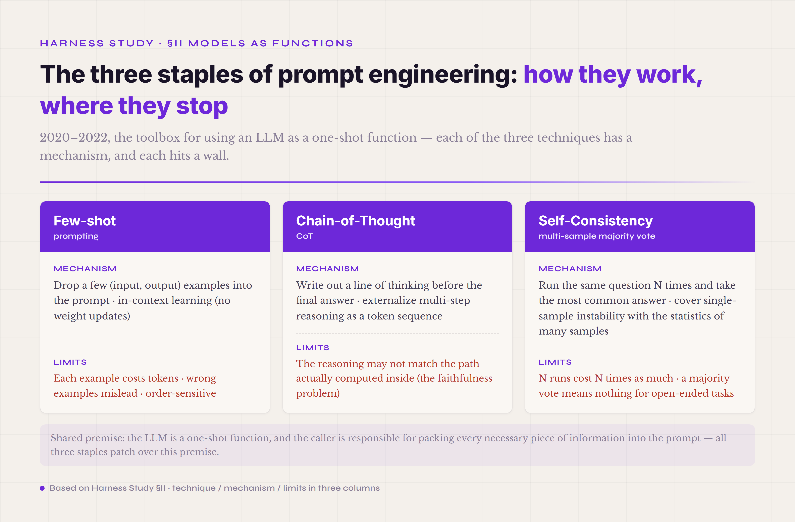

# §II · Prehistory — when models were used as functions (2020–2022)

> **Terms first used in this section** — **trajectory** (the full event stream of a single agent run: every turn's action, decision, result, and state change, recorded as a physical file, usually JSONL or something like it; the fields are stable, and the record can be replayed and diffed — one of the biggest engineering differences between a harness and an early framework). **ablation** (the experiment of "hold everything else fixed, change one mechanism, and watch how the task pass rate moves," used to quantify what each harness mechanism actually contributes — and you can't run one without a trajectory). **replayability** (the ability to rerun a past run exactly as it happened — the key difference between a harness and a script you throw away the moment it finishes).

In June 2020, OpenAI released GPT-3 and opened its first public API. The shape of that API was strikingly plain: `completion(prompt) → text`. Feed it a piece of text, get a piece of text back. The signature had no "messages," no "tools," no "session," no "actions." From an engineering point of view, calling GPT-3 was no different in kind from calling a translation API, a classification API, or one that generates an avatar image.

That shape decided how it would be used. The whole engineering meaning of a call was squeezed into one argument and one return value — prompt in, text out, with no structured trace in between. You couldn't see how the model "thought" inside; that stayed buried in its attention layers and weights. You couldn't express which "tool" the model might need, because the interface had no notion of a tool — function calling didn't arrive until June 2023. And you couldn't even mark the difference between a success and a failure cleanly, because the return was just text, right answers and wrong ones alike, left for something downstream to parse. The whole design treated the LLM as a plain-text function — a little more complicated than a translation API, and no more.

The engineering practice of those years grew on top of that mental model. What people called **prompt engineering** was, at bottom, the study of how to write the input so the function gave a better output. The interface had only one way in — the prompt — so you packed everything you could into the prompt. Three techniques born in this period would be reused countless times afterward.

*Figure 2.1 · The three staples of prompt engineering — how they work and where they stop*

**Few-shot prompting.**[^gpt3-few-shot-2020] Drop a few (input, output) examples into the prompt and let the model "learn" the shape of the task from them before it handles the real input. The mechanism is **in-context learning** (ICL): the transformer updates no weights, yet in its attention computation it can imitate the input-output pattern laid out in the context. This is an emergent ability of the LLM in its own right, and once put to work it became a pillar of prompt engineering. Its limits are just as clear: every example costs tokens, the wrong examples mislead the model, and order matters — the same handful of examples in a different order can produce a completely different output.

**Chain-of-thought (CoT).**[^cot-wei-2022] Have the model write out a line of thinking before it gives a final answer. The mechanism is to externalize multi-step reasoning as a sequence of tokens, so the model writes its intermediate state down explicitly as it generates each reasoning step. This is the same idea ReAct would later build on — squeeze the model's reasoning out of the black box. CoT's limit was studied carefully afterward: the reasoning the model writes may not match the path it actually computes inside (the faithfulness problem), which is to say CoT can be an after-the-fact excuse rather than the real reasoning. But at that point in 2022, CoT made a whole class of previously unsolvable math and logic problems suddenly solvable, and that alone was a shock.

**Self-consistency.**[^self-consistency-wang-2022] Run the same question N times and take the most common answer. The mechanism covers the instability of a single probabilistic sample under the statistics of many samples. This was the first time the prompt era openly admitted that an LLM's output is probabilistic — if one shot is unstable, take many and go with the consensus. The cost is immediate, though: N runs cost N times as much, and a majority vote means nothing for an open-ended task (you can't take the majority vote of "write an essay").

Together these three made up the prompt-engineering toolbox of 2020–2022. All of them rested on one premise: the LLM is a one-shot function, and the caller is responsible for packing every necessary piece of information into the prompt.

### October 2022 · two watershed events

Two things from October 2022 are worth holding onto. The timing was no accident. GPT-3 had been out for two and a half years, the industry had pushed the three staples of prompt engineering to their ceiling, and the "model as a function" paradigm was starting to hit a wall: complex tasks wouldn't fit into a single completion, you had to string several calls together, and there was no off-the-shelf framework for doing it. The two events were two answers to that wall — one an engineering wrapper, the other a shift of paradigm.

**First · LangChain appears.** In October 2022, Harrison Chase — then at Robust Intelligence — packaged "model + prompt templates + tool calls + chained orchestration" into an open-source library. It was the first time the industry systematically admitted that calling the model once isn't enough, that you have to string several calls together, and then turned that admission into a library others could reuse. LangChain's early core abstraction was the **Chain** — several model calls connected as a DAG, a directed acyclic graph. Note the acyclic part: a Chain runs through once and stops; there is no loop. That still falls a layer short of what an agent really needs — a feedback-driven loop that holds state across the turns. Even so, LangChain was the first engineering wrapper. It turned stringing LLM calls together from "every project improvising its own" into "one abstraction everyone shares."

**Second · the ReAct paper.** Yao and colleagues submitted it to arxiv on 2022-10-06,[^react-yao-2022] proposing for the first time a paradigm in which the model walks a loop — `Thought → Action → Observation → Thought → …`:

> "reasoning traces help the model induce, track, and update action plans as well as handle exceptions, while actions allow it to interface with external sources"

In engineering terms, that means the model no longer just produces a final answer. It externalizes its reasoning, it takes actions, and it reads observations. Against CoT, ReAct adds two things — action and feedback — and that promotes the LLM from a thinking machine into something that acts on the world and interacts with it. It was the first clear statement that a model should not only answer, but use tools, read the feedback, and change its mind.

LangChain and ReAct showing up together in October 2022 was no coincidence; it was bound to happen. Two years of prompt engineering had piled up to that point, and the field could already feel that "model as a function" wasn't enough — both the wrapper side (LangChain) and the paradigm side (ReAct) were trying to break out of it. But neither had broken all the way out. LangChain's core abstraction was a DAG, not a loop (it soon added AgentExecutor, an engineering wrapper around ReAct — so the loop arrived quickly, but the disciplines didn't: no trajectory, no policy, no verifier); ReAct was a paradigm, but the engineering infrastructure to support it didn't exist yet. The real break would take another year and a half — only after the field had hit its head hard on AutoGPT did it grind the concept of a harness out of the wreckage.

### Why this period was still "models as functions"

Every attempt in this period — early LangChain, the first ReAct implementations, all the prompt-engineering exploration — was at heart still "treat the model as a function." Three pieces of evidence make it plain.

**First · all the state lived in a Python process's memory.** If the process died halfway through a Chain, every bit of state was lost. No replayability, no durability across sessions, no explicit trajectory file. That means you couldn't review a run after the fact — you couldn't go back and see why it took the path it took. You couldn't run an ablation — you couldn't replay one run exactly to compare two configurations. You couldn't run a regression — you couldn't hold one trajectory against two versions of an agent to see what changed. State hidden in process memory is the same as no state at all: kill the OS process and everything resets to zero. That is a whole database's distance away from the persistent state machine an agent needs.

**Second · tool calls worked by writing a format into the prompt, having the model follow it, and parsing the result with a regex.** A typical setup looked like this: the system prompt told the model "you can call `search(query)` or `calculate(expr)`; output in the format `ACTION: tool_name(args)`," the model produced one line of text in that format, and code outside parsed the line with a regex to pull out the tool name and the arguments. The engineering flaws are easy to see: the model might drop a field, add a field, change the format (`ACTION:` yesterday, `Action:` today), or slip a string that looks like an action into its explanatory text and throw the parser off. No schema validation, no type guarantees, no structured error feedback. Not until OpenAI shipped function calling on 2023-06-13 did this turn into a structured contract — and that was eight months away.

**Third · failure was handled with Python's try/except.** A tool call raised an exception; the layer above caught it and decided whether to retry or abort. This treats failure as an exceptional event — but inside an agent, failure is the norm: tools time out, APIs throttle, the model hallucinates, the network drops. Treat failure as an exception and you can't build a retry policy, a fallback strategy, or graceful degradation in any systematic way. A production harness needs failure to be a core runtime state — failure should enter the trajectory, trigger a verifier's judgment, carry a classification (permanent versus transient), and have a fallback path.

Put the three together and they say one thing: the engineering of 2020–2022 treated the LLM, at heart, as a pure function from prompt to text — one that was sometimes strung into a chain, sometimes dressed up with a thought-action-observation loop. The underlying mental model never changed. State, contract, and failure — the three things a harness would later have to face head-on — were all routed around in this period.

### An analogy: using a relational database as a Redis

The character of this period fits one analogy. You bought a relational database that can run ACID transactions, build B-tree indexes, take row-level locks, and manage concurrency — and you use only its `GET` and `SET`. You treat it as a Redis. You never open a transaction (you don't need the atomicity), you never build an index (a full table scan runs fine), you never touch concurrency control (the application layer stitches that together itself). The system runs, it works, and you have used none of what the database can really do.

Using the model as a function is the same shape of mistake — with one part that is worse than the analogy. Using a database as a Redis underuses its power but still works: what you're doing stays within the database's job, you just skip the advanced features. Using the model as a function isn't about underusing power. It ignores an essential property — instability. A database's GET and SET are deterministic; each returns the same answer every time. An LLM's completion is probabilistic; each call may return a different answer. String several completions into a Chain and that instability compounds at every node. Suppose each node is 95% accurate: ten nodes in a row land at about 0.95^10 = 60%; twenty nodes at about 36%; fifty nodes at about 8%. This is not a math game. It is the hard wall the AutoGPT wave of 2023 was about to hit.

By the end of 2022, the field had not yet grasped how hard that wall was. Only when GPT-4 arrived on 2023-03-14, and a wave of "autonomous agent" projects began trying to run long tasks on it, did the wall get hit — dramatically. The project that came to stand for that collision was AutoGPT, pushed to GitHub on 2023-03-30, which took "model as a function" to its extreme — and in doing so laid the limits of the whole paradigm bare.

---

## Footnotes

[^gpt3-few-shot-2020]: Few-shot prompting / in-context learning · GPT-3 paper · Brown et al. · 2020
[^cot-wei-2022]: Chain-of-Thought Prompting · Wei et al. · 2022
[^self-consistency-wang-2022]: Self-Consistency · Wang et al. · 2022
[^react-yao-2022]: ReAct: Synergizing Reasoning and Acting in Language Models · arxiv 2210.03629 · Yao, Zhao, Yu et al. (Princeton) · ICLR 2023
