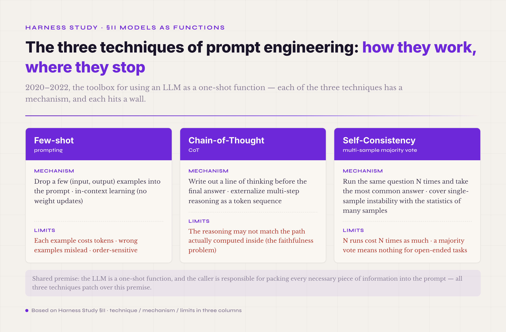

# §II · Prehistory — when models were used as functions (2020–2022)

> **Terms first used in this section**
>
> - **trajectory**: the complete event record of one agent run on a task, covering every turn's action, decision, result, and state change. It is usually a JSONL file or something similar. Its fields are stable, and it can be replayed and diffed item by item. This is one of the biggest engineering differences between a harness and an early development framework.
> - **ablation**: hold every other setting fixed, switch off or change a single mechanism, and watch how the task pass rate moves. It is used to measure what each harness mechanism actually contributes. You can run an ablation without a trajectory, but you will only see that the score changed, not why.
> - **replay** and **replayability**: replaying a run means stepping through the events it recorded (the model's inputs and outputs, the tool results) again exactly as they happened, so you can review and compare them. A replay walks through the recorded events; it does not call the model again for a fresh run. Whether a run can be replayed is the key difference between a harness and a script you throw away the moment it finishes.

On June 11, 2020, OpenAI opened the GPT-3 API as a private beta. You had to apply and wait for access, and the waitlist was not removed until November 18, 2021, when the API opened to all developers. The shape of that API was strikingly plain: `completion(prompt) → text`. Feed it a piece of text, get a piece of text back. The signature had no "messages," no "tools," no "session," no "actions." From an engineering point of view, calling GPT-3 was no different in kind from calling a translation API, a classification API, or one that generates an avatar image.

That **interface shape decided how it would be used**. The whole engineering meaning of a call was squeezed into one argument and one return value: prompt in, text out, with no structured trace in between. You couldn't see how the model "thought" inside; that stayed buried in its attention layers and weights. You couldn't express which "tool" the model might need, because the interface had no notion of a tool; function calling didn't arrive until June 2023. And you couldn't even mark the difference between a success and a failure cleanly, because the return was just text, right answers and wrong ones alike, left for something downstream to parse. The whole design treated the LLM as a plain-text function, only a little more complicated than a translation API.

The engineering practice of those years grew on top of that mental model. What people called **prompt engineering** was, at bottom, the study of how to write the input so the function gave a more accurate output. The interface had only one way in, the prompt, so you packed everything you could into it. Three techniques born in this period would be reused countless times afterward.

*Figure 2.1 · The three techniques of prompt engineering: how they work and where they stop*

**Few-shot prompting.**[^gpt3-few-shot-2020] Drop a few (input, output) examples into the prompt and let the model "learn" the shape of the task from them before it handles the real input. The mechanism is **in-context learning** (ICL): the transformer updates no weights, yet in its attention computation it can imitate the input-output pattern laid out in the context. This is an emergent ability of the LLM in its own right, and once put to work it became a pillar of prompt engineering. Its limits are just as clear: every example costs tokens, the wrong examples mislead the model, and the model is sensitive to order (the same handful of examples in a different order can produce a completely different output).

**Chain-of-thought (CoT).**[^cot-wei-2022] Have the model write out a line of thinking before it gives a final answer. The mechanism is to externalize multi-step reasoning as a sequence of tokens, so the model writes its intermediate state down explicitly as it generates each reasoning step. ReAct would later build on the same idea: bring the model's reasoning out of the black box by writing it down. CoT's limit was studied systematically afterward: the reasoning the model writes may not match the path it actually computes inside (the faithfulness problem), which is to say CoT can be an after-the-fact excuse rather than the real reasoning. But at that point in 2022, CoT made a set of previously unsolvable math and logic problems suddenly solvable, and that alone had a wide impact.

**Self-consistency.**[^self-consistency-wang-2022] Run the same question N times and take the most common answer. The mechanism covers the instability of a single probabilistic sample under the statistics of many samples. This was the first time the prompt era openly admitted that an LLM's output is probabilistic: if one shot is unstable, take many and go with the consensus. The cost is immediate, though: N runs cost N times as much, and a majority vote means nothing for an open-ended task (you can't take the majority vote of "write an essay").

Together these three techniques made up the prompt-engineering toolbox of 2020–2022. All of them rested on one premise: **the LLM is a one-shot function, and the caller is responsible for packing every necessary piece of information into the prompt**.

### October 2022 · two watershed events

Two things from October 2022 are worth holding onto. The timing was no accident. The GPT-3 API had been open for more than two years, and the industry had pushed these three prompt-engineering techniques to their ceiling. The "model as a function" paradigm was starting to hit a wall: complex tasks wouldn't fit into a single completion, you had to string several calls together, and there was no off-the-shelf framework for doing it. The two events were two answers to that wall. One was an **engineering wrapper**; the other was an **upgrade of the paradigm**.

**First event: LangChain appears.** On October 25, 2022, Harrison Chase, then at Robust Intelligence, released LangChain 0.0.1. It packaged "model + prompt templates + tool calls + chained orchestration" into an open-source library. It was one of the earliest open-source wrappers to catch on, and it turned an idea (calling the model once isn't enough, so you have to string several calls together) into a library others could reuse. LangChain's early core abstraction was the **Chain**: several model calls connected as a DAG, a directed acyclic graph. Note the **acyclic** part: a Chain runs through once and stops; there is no loop. That still falls a layer short of what an agent really needs, which is a feedback-driven loop that holds state across turns. Even so, as one of the earliest engineering wrappers to catch on, LangChain turned stringing LLM calls together from "every project writing its own implementation" into "one abstraction everyone shares."

**Second event: the ReAct paper.** Yao and colleagues, from Princeton and the Brain team at Google Research, submitted it to arXiv on 2022-10-06,[^react-yao-2022] proposing that the model walk a loop of `Thought → Action → Observation → Thought → ...`. Earlier work had already let models call external tools and string several calls together: WebGPT (2021-12), SayCan (2022-04), MRKL (2022-05), and AI Chains (CHI 2022). ReAct was the most influential statement of this paradigm. The key sentence in the paper reads:

> "reasoning traces help the model induce, track, and update action plans as well as handle exceptions, while actions allow it to interface with external sources"

In engineering terms, that means the model no longer just produces a final answer. It externalizes its reasoning, it takes actions, and it reads observations. Compared with CoT, ReAct adds two things, action and feedback, and that promotes the LLM from a thinking machine into something that acts on the world and interacts with it. ReAct made this a clear, reusable paradigm: a model should not only answer, but also use tools, read the feedback, and change its decisions. That is where its influence was greatest.

LangChain and ReAct showing up together in October 2022 was no coincidence. Two years of prompt engineering had piled up to that point, and the field could already feel that "model as a function" wasn't enough. Both the wrapper side (LangChain) and the paradigm side (ReAct) were trying to break out of it. But neither had **broken all the way out yet**. LangChain's core abstraction was a DAG, not a loop. It soon added AgentExecutor, an engineering wrapper around ReAct, so the loop did arrive. But mechanisms like trajectory, policy, and verifier were still missing entirely (the last two are defined in the terms list at the start of §III). ReAct was a paradigm, but the engineering infrastructure to support it didn't exist yet. The real break would take another year and a half. Only after the field had hit its head on AutoGPT did it reflect on what went wrong and distill the concept of a harness.

### Why this period was still "models as functions"

Every attempt in this period, including early LangChain, the first ReAct implementations, and all the prompt-engineering exploration, was at heart still "treat the model as a function." Three pieces of evidence make it plain.

**First: all the state lived in a Python process's memory.** If the Python process died halfway through a Chain, every bit of state was lost. No replayability, no durability across sessions, no explicit trajectory file. That means you couldn't review a run after the fact and see why it took the path it took. A comparison experiment only got you halfway. Rerun with a different configuration and you could see that the score changed, but not why, because there were no event records of the two runs to compare step by step. Regression comparison was out as well, since you couldn't hold the same trajectory against two versions of an agent to see what differed. State hidden in process memory is the same as no state at all. Kill the process and everything resets to zero. That is a whole database's distance away from the persistent state machine an agent needs.

**Second: tool calls worked by writing a format into the prompt, having the model follow it, and parsing the result with a regex.** A typical setup looked like this: the system prompt told the model "you can call `search(query)` or `calculate(expr)`; output in the format `ACTION: tool_name(args)`," the model produced one line of text in that format, and code outside parsed the line with a regex to pull out the tool name and the arguments. The engineering flaws are easy to see: the model might drop a field, add a field, change the format (`ACTION:` yesterday, `Action:` today), or slip a string that looks like an action into its explanatory text and throw the parser off. No schema validation, no type guarantees, no structured error feedback. Not until OpenAI shipped function calling on 2023-06-13 did this turn into a structured contract, and that came eight months later.

**Third: failure was handled with Python's try/except.** A tool call raised an exception; the layer above caught it and decided whether to retry or abort. This treats failure as an exceptional event, but inside an agent, failure is **the norm**: tools time out, APIs throttle, the model hallucinates, the network drops. Treat failure as an exception and you can't build a retry policy, a fallback strategy, or graceful degradation in any systematic way. A production harness needs failure to be a core runtime state. Failure should enter the trajectory, trigger a verifier's judgment, be classified as permanent or transient, and have a fallback path.

Put the three together and they say one thing: the engineering of 2020–2022 treated the LLM, at heart, as a pure function from prompt to text. Sometimes that function was strung into a chain, and sometimes it was dressed up with a thought-action-observation loop. But the underlying mental model never changed. State, contract, and failure, the three things a harness would later have to face head-on, were all routed around in this period.

### An analogy: using a relational database as a Redis

The character of this period fits one analogy. You bought a relational database that can run ACID transactions, build B-tree indexes, take row-level locks, and manage concurrency. Then you use only its `GET` and `SET`, treating it as a Redis. You never open a transaction (you don't need the atomicity), you never build an index (a full table scan runs fine), you never touch concurrency control (the application layer stitches that together itself). The system runs, it works, and you have used none of what the database can really do.

Using the model as a function follows the same logic, but in one respect it is **worse** than the analogy. Using a database as a Redis underuses its power but still works: what you're doing stays within the database's job, you just skip the advanced features. Using the model as a function isn't about underusing power. It **ignores an essential property: instability**. A database's GET and SET are deterministic; each returns the same answer every time. An LLM's completion is probabilistic; each call may return a different answer. String several completions into a Chain and that instability accumulates at every node. A rough estimate shows the effect. Suppose each node has a 95% chance of getting it right, errors at different nodes are independent, and an error at any step fails the whole chain. Then ten nodes in a row succeed about 0.95^10 ≈ 60% of the time, twenty about 36%, and fifty about 8%. Reality is not exactly like this. Some errors can be recovered later, and some set off further errors. But the estimate shows the direction. What a harness has to do is break this chain: every step gets a check, errors can be caught and corrected, and one wrong step no longer means the whole task is wrong. This is not a math game. It is the hard wall the AutoGPT wave of 2023 was about to hit.

By the end of 2022, the field had not yet grasped how hard that wall was. Only when GPT-4 arrived on 2023-03-14, and a wave of "autonomous agent" projects began trying to run long tasks on it, did anyone really hit the wall. The project that came to stand for that collision was AutoGPT, pushed to GitHub on 2023-03-30. It took the "model as a function" paradigm to its extreme, and in doing so exposed the limits of that paradigm.

---

## Footnotes

[^gpt3-few-shot-2020]: Few-shot prompting / in-context learning · GPT-3 paper · Brown et al. · 2020
[^cot-wei-2022]: Chain-of-Thought Prompting · Wei et al. · 2022
[^self-consistency-wang-2022]: Self-Consistency · Wang et al. · 2022
[^react-yao-2022]: ReAct: Synergizing Reasoning and Acting in Language Models · arxiv 2210.03629 · Yao, Zhao, Yu et al. (Princeton, Google Research Brain) · ICLR 2023
