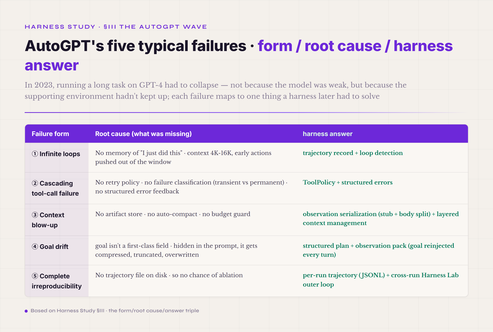
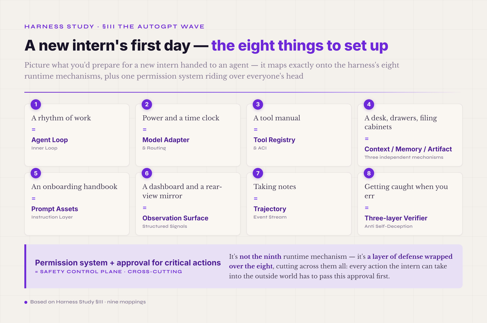

# §III · The first large-scale trial and error — the AutoGPT wave and its failure (2023)

> **Terms first used in this section** — **schema** (a formal definition of a data structure: it fixes field names, types, whether each field is required, and the nesting. It reads for humans and validates automatically for programs; JSON Schema is the most common way to write one on the web. In agent engineering, schema is the shared language for tool contracts, observation formats, and completion return values). **verifier** (the objective judge of whether one task output from an agent is right or wrong — the hardest and most important piece of agent engineering. In an environment that can run tests, like SWE-bench, the verifier is the unit tests; in an open task like contract review, designing the verifier is itself the hard problem. Paired with a reward, it is what moves an agent from "tune the prompt by feel" to "train on data"). **policy** (the rule set that governs an agent's behavior: whether a tool call may run, whether it needs human approval, which paths are readable and which are not writable, and so on. An agent with no policy is a small root user running loose — the later Safety control-plane section spends a whole chapter taking this one mechanism apart).

On 2023-03-30, Toran Bruce Richards — GitHub handle Significant Gravitas — pushed **AutoGPT** to GitHub. GPT-4 had been public for just two weeks (it shipped on 2023-03-14), and the field's hopes for an "autonomous agent" were climbing fast: if GPT-4 is this strong, can it plan, execute, and iterate entirely on its own? AutoGPT's promise hit that hope dead center — give it a goal ("do market research for me") and it would break the goal into tasks, call tools, and judge its own progress until the job was done. BabyAGI and AgentGPT followed close behind with similar designs. For a moment AGI seemed within arm's reach: AutoGPT became the fastest-growing project on GitHub, taking 100,000 stars in a few weeks — faster than any LLM application of its time.

### AutoGPT's inner architecture (see it clearly before the failures)

To see why AutoGPT failed, you first have to see what its inner architecture looked like. Strip away the code details and its core loop ran roughly like this:

```
1. The user gives a goal
2. AutoGPT calls the LLM to break the goal into a "task list" (a list of natural-language strings)
3. It picks the first task to run
4. The LLM decides which tool to call (the prompt says "ACTION: tool_name(args)"), and code outside parses it with a regex
5. The tool runs; the result is pasted back into the prompt as text
6. The LLM judges whether the task is done, and whether to revise the task list
7. Jump back to step 3 and pick the next task
```

The whole loop ran inside one Python process. The task list was an array of strings; the history was an ever-growing concatenated prompt; tool calls had no schema validation; failures were caught with try/except and then retried or skipped; there was no trajectory file on disk, no ablation hook, no independent verifier, no policy to block a dangerous move.

On a demo task, this architecture's "autonomy" looked dazzling — give it "research company X" and it really would google, write a file, google again, and produce a report. The first 5–10 steps were often exciting to watch. But **the architecture had no mechanism at all for the instability that piles up across many steps.** Once a task ran past 10–15 steps, five typical failures showed up one after another. This is the same thing as the math anchor at the end of the last section — 95% per step, fifty steps in a row, only 8% left: each step looks good enough, strung together it has to collapse.

### The five typical forms of large-scale failure

Wikipedia describes AutoGPT's failures bluntly:

> "AutoGPT's tendency to get stuck in infinite loops"
> "AutoGPT has a tendency to hallucinate or to present false or misleading info as fact"

There are five concrete forms, and each one exposes something a harness has to solve.



*Figure 3.1 · AutoGPT's five typical failures, and the harness answer to each*

**Failure one · infinite loops.** When AutoGPT decides its next move, it picks the same tool and asks the same question over and over. A typical failed session in the community looked like this: google "market size" → write to a file → read the file → google "market size" → write to a file → read the file… and an hour later it was still in the same spot. The root cause is that AutoGPT had **no memory of "I just did this."** Its "memory" was pasting the last turn's output into the next turn's prompt, and the context window was only 4K–16K tokens, so after a few turns the early "I just googled this" had been pushed out of the window. On every turn the model could see only the last few thousand characters; what it had done before, it simply couldn't see. The harness answer is **a trajectory record plus loop detection** — hash each action, compare it against history, and break or change route when the same action repeats.

**Failure two · cascading tool-call failure.** AutoGPT calls a tool and gets back an error — say a search API throttles and returns `{"error": "rate limited"}`. The model doesn't know whether the error is temporary (wait 30 seconds and it's fine) or permanent (the API key is dead), and doesn't know whether it should retry. Two things usually happen: either AutoGPT treats the error as "the tool said something," pastes it into the prompt, and keeps reasoning (now reasoning on bad data), or it marks the whole task failed and quits. **No retry policy, no failure classification (transient versus permanent), no structured error feedback to the model.** The harness answer is **a tool policy plus structured errors** — how many times to retry, how long to back off, which errors should fail fast, which should fall back, which should stop and wait for a human: all of it belongs in the policy layer, not in a guess the model makes on the spot.

**Failure three · context blow-up.** Mainstream models then had 4K–16K tokens of context. One google result might be 1,000 characters of HTML (about 2,000 tokens), one read_file might be 500 lines of code (about 3,000 tokens), one round of model reasoning might be 500 tokens. A dozen turns in, the tool results alone filled the window. Early AutoGPT's response was crude: either truncate outright (cutting off the earlier key constraints and the user's goal) or error out and quit. **No artifact store to move large output to external storage, no auto-compaction to compress by value, no budget guard to warn early.** The harness answer is **observation serialization (a light stub split from the full body) plus layered context management** — a big result puts only its summary into context while the full body goes to an external store; and when context reaches a threshold, compaction triggers, compressing by value (task constraints, key IDs), not by time (early = delete it).

**Failure four · goal drift.** The user's goal — "research the market for company X" — usually sits in the first paragraph of the prompt. A dozen turns later that paragraph has been compressed or truncated, and on every turn the model sees only the last few turns of history. Now if some tool returns a provocative web page ("you should study company Y, not X"), or AutoGPT itself generates a subgoal that looks more reasonable ("I think researching competitors first is better"), the original goal gets replaced. The user comes back half an hour later to find AutoGPT doing something completely unrelated. **The root cause is that the goal is not a first-class field — it hides in the prompt, and like any other message it gets compressed, truncated, overwritten.** The harness answer is **a structured plan plus an observation pack** — make the goal a persistent field, reinjected into context every turn, so the model can "see" the original goal at every step no matter how the history is compressed.

**Failure five · complete irreproducibility.** Run the same prompt twice and the results may differ completely — a natural property of model sampling; any temperature above zero brings randomness. Worse: when a run failed, no one could reconstruct how exactly it got there, because the whole run left no trajectory file on disk. "We tuned for 5 days and got one passing run, but we don't know which change did it" was the real experience of many teams in spring and summer 2023. **No trajectory means no chance of ablation** — you can't compare two configurations, because there is no comparable run history; you can't tell which mechanism is a positive contribution, because there is no experiment vehicle for "toggle this mechanism and see how much the result changes." The harness answer **starts with a per-run trajectory** (JSONL, one event per line, or a single JSON, one file per run) — every action, decision, compaction, and verifier judgment written to file so you can review afterward. But a single-run trajectory isn't enough on its own — an agent runs 100 times and you watch only one of them, with no way to tell whether the harness configuration is really better or just got lucky. So you also need **a cross-run outer-loop mechanism** — a per-run nonce to isolate the cache (otherwise two runs hitting the same cache aren't independent samples), running N times for statistics instead of watching a single pass or fail, and comparing many runs' trajectories to see how much the result moves when a mechanism is toggled. This cross-run work doesn't belong to the 8 runtime mechanisms themselves; it is the **Harness Lab outer loop** wrapped on top of the runtime — a five-part cycle: Observe (quantify each run with the trajectory) → Score (grade each run with the verifier) → Ablate (toggle mechanisms to see which is a positive contribution) → Tune (adjust the harness config) → Iterate (go back and Observe again). The outer loop and the single-run trajectory are twins: the trajectory is the outer loop's input, the outer loop is the trajectory's consumer.

### Put the five together · the core conclusion

Put the five failures side by side and the conclusion is clear: **the model isn't the problem; the supporting environment is.**

AutoGPT used GPT-4 — the same transformer-LLM technical generation that Claude Code, Cursor, and Codex CLI use today (the specific versions evolved all the way along: GPT-4 → Claude Opus 4.7 → GPT-5.5). But today's products finish multi-step tasks reliably, while AutoGPT collapsed past 10 steps. The gap isn't in the model. It's in the engineering layer wrapped around the model.

This conclusion is **the reason harness engineering exists as a practice.** If "agents are unreliable" could be fixed just by swapping in a stronger model, there would be no such practice — everyone would simply wait for the next model. But across the three years from spring 2023 to spring 2026, models grew from GPT-4 to Claude Opus 4.7 and GPT-5.5, and single-step ability rose sharply; yet **drop a stronger model into AutoGPT's environment to run a long task and it still fails.** A stronger model brings more accurate single-step prediction, deeper reasoning, more reliable tool calls — but **the reliability of multi-step execution is not a by-product of model ability; it has to be built independently, by the engineering layer wrapped around the model.** This is the deepest split between harness engineering and the plain "tune the prompt, upgrade the model" route: it treats the wrapping layer as an independent object that can be engineered, studied, and automatically optimized.

### One thing to clear up: AutoGPT did not "fail completely"

A clarification is needed here, or it leaves the wrong impression that AutoGPT was a failed project. The project itself did not fail completely — Significant Gravitas raised $12M in October 2023 (from Redpoint Ventures and GitHub), the project is still maintained, the repository has passed 180,000 stars in total, and 2024–2025 saw continued iteration: tool schemas added, more structured task management, a trajectory interface. In other words, AutoGPT learned from that wave of failures too, and has slowly converged toward a harness. Take one more step forward and it gets more interesting: after 2024, AutoGPT pivoted into the AutoGPT Platform — a block-based, low-code workflow product where users compose tasks into deterministic flow blocks and the model works inside them. The first project to push "give it a goal and let it run" to the limit walked itself back to deterministic orchestration — a direction we will meet again in 5.1.6, under dynamic workflow.

This section is about **the failures of AutoGPT's specific form in spring and summer 2023.** It *exposed* a class of engineering problems and made the field realize that an autonomous agent takes more than a strong-enough model. That is its biggest contribution to harness engineering as a practice — one large public trial and error that brought a hidden engineering necessity into the open. Without that public collision, the field might have taken another year or two to start discussing the harness systematically.

### An analogy: dropping an inexperienced intern into a project

One plain analogy makes the whole thing clear. You drop a **completely inexperienced intern** into a project and have them work on their own. They may be very smart (GPT-4 really is smart at single-step reasoning), but you do a whole series of "don'ts": you don't teach them a rhythm of work, don't give them power or a desk, don't hand them a tool manual, don't give them drawers and filing cabinets, don't give them an onboarding handbook, don't open a dashboard so they can see feedback, don't let them take notes, don't have anyone review their output, don't set permissions to keep them off dangerous ground. Under those conditions, even the smartest intern is bound to spin out of control.

Map this analogy cleanly onto the **8 runtime mechanisms plus 1 Safety control plane** and it lines up with exactly nine engineering objects.



*Figure 3.2 · The intern analogy, mapped to the 8 runtime mechanisms and the Safety control plane*

**"A rhythm of work" = the Agent Loop · the inner loop.** Each step: think first, then act, then read the feedback, then decide the next step — all the way around until done. Without this rhythm the intern jumps around at random. It is the engineered form of the Thought-Action-Observation triple that ReAct[^react-yao-2022] proposed, and it is what separates an agent from a one-shot LLM call.

**"Power and a time clock" = the Model Adapter & Routing.** Give the intern a stable channel to their brain (the LLM). Every LLM provider's API has a different shape — tool-calling field names, token-billing conventions, stream protocols all differ — and the adapter normalizes that. Use GPT-5.5 today and fail over to Claude tomorrow, and it switches over without polluting the rest of the flow.

**"A tool manual" = the Tool Registry & ACI.** Each tool has a structured definition (a JSON schema), usage bounds (permission / allowed_paths / timeout), and a standard feedback format when something goes wrong. It lets the intern know what they can call, how to call it, and what to do when a call fails — this mechanism leans on OpenAI's June 2023 function calling, which settled "a tool is a structured contract" on the model's side.

**"A desk, drawers, and filing cabinets" = Context / Memory / Artifact.** Put what you're using now on the desk (the short context window), what you don't need for the moment in the drawers (memory, state across turns), and the products that outlive a task in the filing cabinets (artifact, persistent storage). The intern can't pile everything on the desk or it overflows — which is exactly the root cause of failure three, context blow-up.

**"An onboarding handbook" = Prompt Assets · the instruction layer.** The persistent system prompt, operating conventions, and subprocess templates. These aren't off-the-cuff verbal instructions; they are assets that are versioned, cached (cache-safe), and managed as engineering. Project-level instruction docs like AGENTS.md and CLAUDE.md are how prompt assets land in practice.

**"A dashboard and a rear-view mirror" = the Observation Surface.** Let the intern see the last step's feedback — tool results, file changes, error messages. The dashboard doesn't shove every byte over raw; it is summarized, layered, and redacted, "a light stub split from the full body," with big data going to an external store and the summary going into context.

**"Taking notes" = the Trajectory · the event stream.** Every action, decision, compaction, and verifier judgment written to file, so you can review afterward, diff two configurations, and replay. This is the precondition for the outer loop to exist at all — the Observe-Score-Ablate-Tune-Iterate cycle named above — because without a trajectory you can't even run a cross-run ablation.

**"Getting caught when you err" = the three-layer Verifier.** Every step gets an independent judgment; it isn't done just because the intern says "I'm done." The three layers are a hard gate (code-level certainty, such as whether `pytest` passed), an outcome judge (LLM-as-judge, a semantic verdict on open-ended output), and a process soft signal (whether the process matched the expected pattern). When something is wrong, it can fall back, retry, or escalate to human review.

These eight are runtime matters — the intern walks all eight on every concrete piece of work. But beyond the eight there is one more, **cutting across** them all:

**"A permission system plus approval for critical actions" = the Safety control plane.** A cross-cutting control plane — not a mechanism inside a single turn, but the boundary of legitimacy that runs across all turns, all tools, all decisions. Give the intern a permission system, and put approval flows on critical actions (send an email, delete a file, push code, spend budget), so they don't actually wreck the company while learning by trial. This is the engineered answer to two agent risks, OWASP LLM08 (excessive agency) and LLM10 (unbounded consumption). It doesn't happen inside one specific turn the way the first eight do; it must be checked before every tool call, every time a budget crosses a threshold, every time work is delegated across a sub-agent. Calling it the ninth item isn't quite right — it is a layer of defense wrapped over the eight.

This **8 runtime mechanisms plus 1 Safety control plane** — nine engineering objects in all — is the full set of objects harness engineering wants an engineer's attention on. Running a long task with GPT-4 inside AutoGPT is the same mistake as dropping a smart intern into an environment without these nine: however smart, it has to spin out. The question harness engineering exists to answer is exactly this — given an intern (the model) who is already smart enough, how do you set up an environment that lets them keep working, recover from failure, stay under continuous supervision and improvement, and still not wreck the company? These nine are not a checklist; they cut "the shell around the model" into engineering objects that can be discussed, optimized, and verified on their own — each with its own interface shape, its own design trade-offs, its own failure modes.

One boundary of the analogy is worth marking. An intern can learn on their own — work out a mistake, build experience across tasks — and an LLM can't: the model's weights were frozen at training time, so the mistake it makes today it will make again tomorrow. So a harness is more than an "engineering environment"; it also has to include fixing the model's mistakes permanently, at the level of the environment. That is exactly Hashimoto's February 2026 definition of harness engineering — "anytime you find an agent makes a mistake, you take the time to engineer a solution such that the agent never makes that mistake again" — patching the fact that the model can't self-teach with a hardening mechanism at the harness layer.

It took the field about three years to walk out of that AutoGPT wave. How the name, the definition, the components, and the control-theory frame of this engineering environment got pinned down, step by step, over those three years is the real history of how the word *harness* converged.

---

## Footnotes

[^react-yao-2022]: ReAct: Synergizing Reasoning and Acting in Language Models · arxiv 2210.03629 · Yao, Zhao, Yu et al. (Princeton) · ICLR 2023
