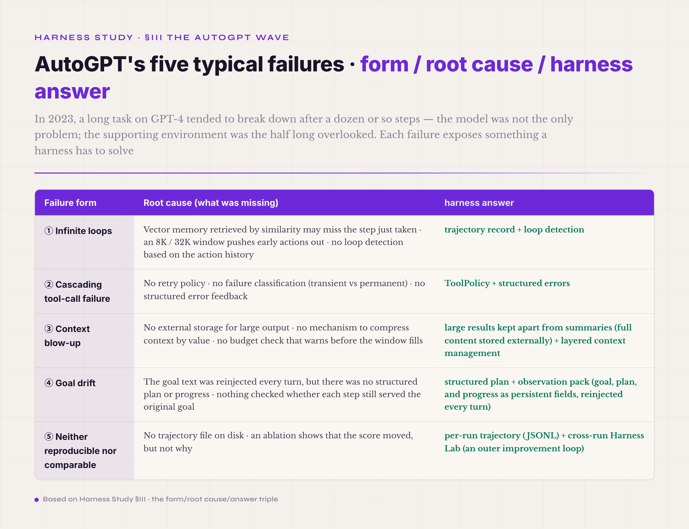
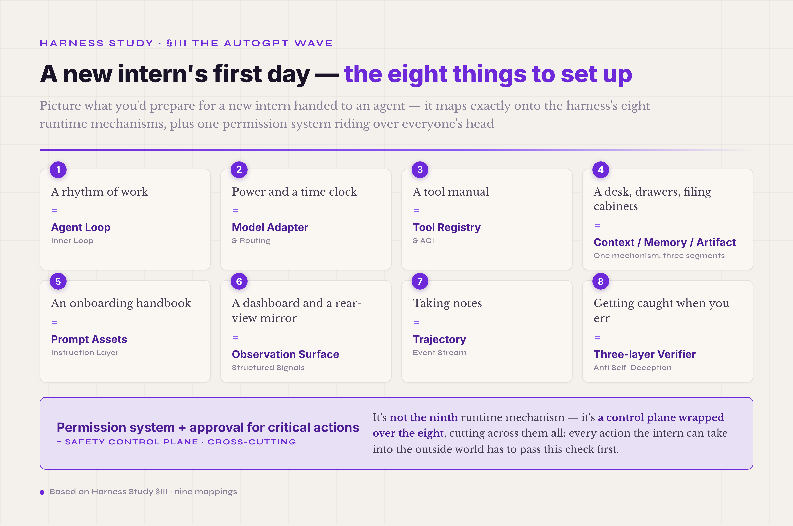

# §III · The first large-scale trial and error: the AutoGPT wave and its failure (2023)

> **Terms first used in this section**
>
> - **schema**: a formal definition of a data structure. It fixes the field names, their types, whether each field is required, and how they nest. People can read it, and programs can validate against it automatically. JSON Schema is the most common way to write one on the web. In agent engineering, tool contracts, observation formats, and completion return values are all described with schemas.
> - **verifier**: the judge that decides whether one task output from an agent is right. It is one of the hardest and most important mechanisms in agent engineering. In an environment that can run tests, like SWE-bench, the verifier is the unit tests; in an open task like contract review, designing the verifier is itself the hard problem. Only with reliable judgments and a reward signal can you move from "tune the prompt by feel" to "improve with data."
> - **policy**: the rule set that governs an agent's behavior. It decides whether a tool call may run, whether it needs human approval, which paths are readable, which are not writable, and so on. An agent without a policy is like a small root user running loose. §5.9, on the Safety control plane, spends a whole section taking this mechanism apart.

On 2023-03-30, Toran Bruce Richards (GitHub handle Significant Gravitas) pushed **AutoGPT** to GitHub. GPT-4 had been public for just two weeks (it shipped on 2023-03-14), and the field's hopes for an "autonomous agent" were climbing fast: if GPT-4 is this strong, can it plan, execute, and iterate entirely on its own? AutoGPT's promise hit that hope dead center. Give it a goal ("do market research for me") and it would break the goal into tasks, call tools, and judge its own progress until the job was done. BabyAGI and AgentGPT followed close behind with similar designs. For a moment AGI seemed within arm's reach, and AutoGPT quickly became one of the fastest-growing projects on GitHub: a little over two weeks after launch (mid-April 2023), it had about 67,000 stars.

### AutoGPT's inner architecture (see it clearly before the failures)

To see why AutoGPT failed, you first have to see what its inner architecture looked like. Strip away the code details and its core loop ran roughly like this:

```
1. The user gives a goal
2. AutoGPT calls the LLM to break the goal into a "task list" (a list of natural-language strings)
3. It picks the first task to run
4. The LLM decides which tool to call (the prompt says "ACTION: tool_name(args)"), and code outside parses it with a regex
5. The tool runs; the result is pasted back into the prompt as text
6. The LLM judges whether the task is done, and whether to revise the task list
7. Jump back to step 3 and pick the next task
```

The whole loop ran inside one Python process. It wasn't stateless, though:

- the goals the user set (`ai_goals`) were reinjected into the prompt as a system message on every turn;
- it had a vector memory, with a local file, Pinecone, or Redis as the backend, which retrieved past snippets by relevance and put them back into the prompt;
- recent history was pasted straight into the prompt, and whatever the window couldn't hold got pushed out.

But the engineering layer was missing a lot. The task list was only an array of strings; tool calls had no schema validation; failures were caught with try/except and then retried or skipped. There was no trajectory file on disk, no ablation hook, no independent verifier judgment, and no policy to block a dangerous move.

On a demo task, this architecture's "autonomy" looked dazzling: give it the goal "research company X" and it really would google, write a file, google again, and produce a report. The first few steps often made a complete demo. But **the architecture had no mechanism at all for the instability that piles up across many steps.** Once a task ran past a dozen or so steps, five typical failures showed up one after another. This is the same point as the rough estimate at the end of the last chapter. If errors at each step are independent and one wrong step fails the whole chain, then 50 nodes in a row, each 95% accurate, succeed only about 8% of the time. Each step looks good enough on its own; strung together, they break easily.

### The five typical forms of large-scale failure

Wikipedia describes AutoGPT's failures bluntly:

> "AutoGPT's tendency to get stuck in infinite loops"
> "AutoGPT has a tendency to hallucinate or to present false or misleading info as fact"

There are five concrete forms, and each one exposes something a harness has to solve.



*Figure 3.1 · AutoGPT's five typical failures, and the harness answer to each*

**Failure one: infinite loops.** When AutoGPT decides its next move, it picks the same tool and asks the same question over and over. A typical failed session in the community looked like this: google "market size" → write to a file → read the file → google "market size" → write to a file → read the file… and an hour later it was still in the same spot. The root cause isn't that AutoGPT had no memory at all. It had a vector memory and recent history. The trouble lay in two places:

- **Retrieved memory was unreliable**: a snippet fetched by semantic similarity wasn't necessarily the one that says "I just googled this." The context window was also limited (GPT-4 launched with only two sizes, 8K and 32K), so after a few turns the early records of actions got pushed out of the window.
- **There was no loop detection based on the action history**: no layer of code compared "is this step the same as the last few?", so the only hope was that the model would notice on its own.

The harness answer is **a trajectory record plus loop detection**: hash each action, compare it against history, and break or change route when the same action repeats back to back.

**Failure two: cascading tool-call failure.** AutoGPT calls a tool and gets back an error. Say a search API throttles and returns `{"error": "rate limited"}`. The model doesn't know whether the error is temporary (wait 30 seconds and it's fine) or permanent (the API key is dead), and doesn't know whether it should retry. Two things usually happen: either AutoGPT treats the error as "the tool said something," pastes it into the prompt, and keeps reasoning (now reasoning on bad data), or it marks the whole task failed and quits. **No retry policy, no failure classification (transient versus permanent), no structured error feedback to the model.** The harness answer is **ToolPolicy plus structured errors**. How many times to retry, how long to back off, which errors should fail fast, which should take a fallback path, which should stop and wait for a human: all of it belongs in the policy layer, not in a guess the model makes on the spot.

**Failure three: context blow-up.** When GPT-4 launched, its context window came in only two sizes, 8K and 32K. As a rough estimate, the HTML from one search-tool call might run to a thousand tokens or more, and one read_file of a few hundred lines of code costs a few thousand. The model's reasoning output adds a few hundred more on every turn. A dozen turns in, the tool results alone filled the window. Early AutoGPT's response was crude: either truncate outright (cutting off the earlier key constraints and intermediate results) or error out and quit. Three things were missing: a place to move large output into external storage, a mechanism to compress context by value, and a budget check that warns before the window fills. The harness answer is:

- **Separate large results from their summaries**: only the summary goes into context, and the full content is stored externally (§5.4 on Artifact and §5.6 on the observation surface explain how to split them);
- **Manage context in layers**: when usage reaches a threshold, compaction triggers, and it decides what to keep by value (task constraints, key IDs), not by age (the older, the more deletable); §5.4 covers this in detail.

**Failure four: goal drift.** On every turn, AutoGPT reinjected the goals the user had set (`ai_goals`) as a system message, so the goal text itself was never lost. But a paragraph of goal text isn't enough. Each turn the model sees the goal plus the last few turns of history. What it can't see is a structured plan and its progress: which subtasks are done, which step it is on now, and why it is taking that step. Now if some tool returns a web page that steers it elsewhere ("you should study company Y, not X"), or AutoGPT itself generates a subgoal that looks more reasonable ("I think researching competitors first is better"), this closer, more specific content pushes the original goal aside. The user comes back half an hour later to find AutoGPT doing something completely unrelated. **The root cause is that there is only goal text: no structured plan and progress, and nothing that checks whether each step still serves the original goal.** The harness answer is **a structured plan plus an observation pack (the current state, reassembled for the model each turn; §5.4 covers it in detail)**. The goal, the plan, and the current progress become persistent fields reinjected into context every turn, so at every step the model can see the original goal and how far it has come, however the history gets compressed.

**Failure five: results that can be neither reproduced nor compared.** Run the same prompt twice and the results may differ completely. That is a natural property of model sampling: any temperature above zero brings randomness. Worse, when a run failed, no one could reconstruct how exactly it got there, because the whole run left no trajectory file on disk. "We tuned for 5 days and got one passing run, but we don't know which change did it" was the real experience of many teams in spring and summer 2023. **Without a trajectory, a comparison experiment comes down to a single score.** Change a configuration and you can see that the score moved, but not why; and if you want to tell which mechanism is helping, there is no execution record to compare step by step.

The harness answer comes in two layers:

- **Within a single run: the trajectory.** Every action, decision, compaction, and verifier judgment is written to file (JSONL with one event per line, or one JSON file per run), so you can review the run afterward.
- **Across runs: an outer improvement loop.** If an agent runs 100 times and you watch only one of them, you can't tell whether "this configuration is really better, or just got lucky." So you run it N times and look at the statistics. You also make sure the N runs really are independent of one another: no shared response cache or fixed random seed, no shared files, memory, or workspace, and a clean environment at the start of every run. Otherwise the N reruns just count the same result several times over, which this book calls "Non-Independent Reruns" (AP01, see Appendix F). Once you have independent runs, you line up their trajectories and see how much the result changes when a given mechanism is switched on and off.

This cross-run work doesn't belong to the 8 runtime mechanisms themselves. It is a layer wrapped around the runtime, which this book calls **Harness Lab** (covered in §VII). It runs as a five-step cycle: Observe (quantify each run with the trajectory) → Score (grade each run with the verifier) → Ablate (toggle mechanisms to see which contribute positively) → Tune (adjust the harness config) → Iterate (go back to Observe). The two go together: the trajectory is Harness Lab's input, and Harness Lab is the trajectory's consumer.

### Put the five together · the core conclusion

Put the five failures side by side and the conclusion is clear: **the model is not the only problem; the supporting environment is the half that was long overlooked.**

AutoGPT used GPT-4, which belongs to the same technical generation of transformer LLMs as the models behind Claude Code, Cursor, and Codex CLI today (such as Claude Opus 4.7 and GPT-5.5). Today these products finish multi-step tasks reliably, while AutoGPT tended to break down after a dozen or so steps. Both sides account for that gap. The models' single-step ability really did rise sharply: in the SWE-bench Verified data cited in §I, swapping models under the same bare-bones harness took the score from 22% to 49%. The engineering layer around the model also went from almost nothing to a full set of mechanisms: in the Meta-Harness experiment cited in the same chapter, holding the model fixed and changing only the harness produced a 6x spread in performance.

This conclusion is **the reason harness engineering exists as a practice.** If "agents are unreliable" could be fixed just by swapping in a stronger model, there would be no such practice; everyone would simply wait for the next model. In the three years from spring 2023 to spring 2026, GPT-4, Claude Opus 4.7, GPT-5.5, and other models arrived one after another, and single-step ability rose sharply. But what a model upgrade brings is more accurate single-step prediction, deeper reasoning, and more reliable tool calls. **The reliability of multi-step execution does not arrive automatically along with them; it still has to be built deliberately, by the engineering layer wrapped around the model.** This is the deepest split between harness engineering and the plain "tune the prompt, upgrade the model" route: it treats the wrapping layer as an independent object that can be engineered, studied, and automatically optimized.

### One thing to clear up: AutoGPT did not "fail completely"

A clarification is needed here, or it leaves the wrong impression that AutoGPT was a failed project. The project itself did not fail completely. Significant Gravitas raised $12M in October 2023 (reportedly led by Redpoint Ventures), the project is still maintained, and the repository has about 188,000 stars in total (2026-09). Iteration continued through 2024–2025, adding tool schemas, more structured task management, and a trajectory interface. In other words, the AutoGPT project has also been adjusting to the lessons of that wave, slowly converging toward a harness. Take one more step forward and it gets more interesting: after 2024, AutoGPT pivoted into the AutoGPT Platform, a low-code workflow platform built from functional blocks, where users lay the control flow out explicitly as blocks (with branches and loops between them) and the model works inside them. The first project to push "give it a goal and let it run" to the limit walked itself back to explicit orchestration. We will meet this direction again in §5.1.6, under dynamic workflow.

This section is about **the failures of AutoGPT's specific form in spring and summer 2023.** It *exposed* a class of engineering problems and made the field realize that an autonomous agent takes more than a strong-enough model. That is its biggest contribution to harness engineering as a practice: one large public trial and error that brought into the open a class of engineering needs nobody had been discussing. Without that wave of public failures, the field might have taken another year or two to start discussing the harness systematically.

### An analogy: dropping an inexperienced intern into a project

One plain analogy makes the whole thing clear. You drop a **completely inexperienced intern** into a project and have them work on their own. They may be very smart (GPT-4 really is smart at single-step reasoning), but you do a whole series of "don'ts": you don't teach them a rhythm of work, don't give them power or a desk, don't hand them a tool manual, don't give them drawers and filing cabinets, don't give them an onboarding handbook, don't open a dashboard so they can see feedback, don't let them take notes, don't have anyone review their output, don't set permissions to keep them off dangerous ground. Under those conditions, even the smartest intern is bound to spin out of control.

Map this analogy cleanly onto the **8 runtime mechanisms plus 1 Safety control plane** and it lines up with exactly nine engineering objects.



*Figure 3.2 · The intern analogy, mapped to the 8 runtime mechanisms and the Safety control plane*

**"A rhythm of work" = the Agent Loop · the inner loop.** Each step: think first, then act, then read the feedback, then decide the next step, all the way around until done. Without this rhythm the intern jumps around at random. It is the engineered form of the Thought-Action-Observation triple that ReAct[^react-yao-2022] proposed, and it is what separates an agent from a one-shot LLM call.

**"Power and a time clock" = the Model Adapter & Routing.** The power is a stable channel between the intern and their brain (the LLM); the time clock records how much they used (token usage and billing). Every LLM provider's API has a different shape (tool-calling field names, token-billing methods, and streaming protocols all differ), and the adapter normalizes those differences. Use GPT-5.5 today and fail over to Claude tomorrow, and it switches over without polluting the rest of the flow.

**"A tool manual" = the Tool Registry & ACI.** Each tool has a structured definition (a JSON schema), usage bounds (permission / allowed_paths / timeout), and a standard feedback format when something goes wrong. It lets the intern know what they can call, how to call it, and what to do when a call fails. This mechanism leans on OpenAI's June 2023 function calling, which settled "a tool is a structured contract" on the model's side.

**"A desk, drawers, and filing cabinets" = Context / Memory / Artifact.** Put what you're using now on the desk (context, the material sent to the model on the current turn), what you don't need for the moment in the drawers (memory, state the harness maintains outside the model, readable and writable across many calls), and the products that outlive a task in the filing cabinets (artifact, persistent storage). The intern can't pile everything on the desk or it overflows, which is exactly the root cause of AutoGPT's failure three, context blow-up.

**"An onboarding handbook" = Prompt Assets · the instruction layer.** The persistent system prompt, operating conventions, and subprocess templates. These aren't off-the-cuff verbal instructions; they are assets that are versioned, friendly to prompt caching (cache-safe), and managed as engineering. Project-level instruction docs like AGENTS.md and CLAUDE.md are the concrete form prompt assets take.

**"A dashboard and a rear-view mirror" = the Observation Surface.** Let the intern see the last step's feedback (tool results, file changes, error messages). The dashboard doesn't shove every byte over raw. It summarizes, layers, and redacts, and keeps the summary apart from the full content: big data goes to external storage, and the summary goes into context.

**"Taking notes" = the Trajectory · the event stream.** Every action, decision, compaction, and verifier judgment is written to file, so you can review afterward, compare two configurations item by item, and replay. This is the precondition for Harness Lab (the Observe → Score → Ablate → Tune → Iterate cycle named above) to exist at all: without a trajectory, a cross-run ablation can show you that the score changed, but not why.

**"Getting caught when you err" = the three-layer Verifier.** Every step gets an independent judgment; it isn't done just because the intern says "I'm done." The three layers are a Hard Gate (a deterministic check that code can decide, such as whether `pytest` passed), an Outcome Judge (a model acting as reviewer, giving a semantic verdict on open-ended output), and a PRM (process reward model, which judges the reasoning process step by step). When something is wrong, it can fall back, retry, or escalate to human review.

These eight mechanisms belong to the runtime layer, and the intern uses all of them on every concrete piece of work. But beyond the eight there is one more, **cutting across** them all:

**"A permission system plus approval for critical actions" = the Safety control plane.** This is a cross-cutting control plane. It isn't a mechanism inside a single turn; it is the boundary of legitimacy that runs across all turns, all tools, and all decisions. Give the intern a permission system, and put approval flows on critical actions (send an email, delete a file, push code, spend budget), so they don't actually wreck the company while learning by trial. It is the engineered answer to two risks in the OWASP LLM Top 10 (2025 edition): LLM06 Excessive Agency and LLM10 Unbounded Consumption. It doesn't happen inside one specific turn the way the first eight mechanisms do; it must be checked before every tool call, every time a budget crosses a threshold, and every time work is delegated to a sub-agent. Counting it as a ninth mechanism isn't accurate: it is a control plane that cuts across the eight.

This set of **8 runtime mechanisms plus 1 Safety control plane** (nine engineering objects in all) is the full set of objects harness engineering wants an engineer's attention on. Running a long task with GPT-4 inside AutoGPT is the same mistake as dropping a smart intern into an environment without these nine supports: however smart, they are bound to spin out of control. That is exactly the question harness engineering has to answer. Given an intern (the model) who is already smart enough, how do you set up **an engineering environment that lets them keep working, recover from failure, stay under continuous supervision and improvement, and still not wreck the company**? These nine objects are not a checklist. They cut "the layer outside the model" into engineering objects that can be discussed, optimized, and verified on their own, each with its own interface shape, its own design trade-offs, and its own failure modes.

One boundary of the analogy is worth marking. An intern can learn on their own (work out a mistake, build experience across tasks), and an LLM can't: the model's weights were frozen at training time, so the mistake it makes today it will make again tomorrow. So a harness is more than an "engineering environment"; it also has to include fixing the model's mistakes permanently, at the level of the environment. That is exactly Hashimoto's February 2026 definition of harness engineering: "anytime you find an agent makes a mistake, you take the time to engineer a solution such that the agent never makes that mistake again." In other words, a mechanism fixed in place at the harness layer makes up for the model's inability to teach itself.

It took the field about three years to walk out of that AutoGPT wave. How the name, the definition, the components, and the cybernetic frame of this engineering environment got pinned down, step by step, over those three years is the real history of how the word *harness* converged.

---

## Footnotes

[^react-yao-2022]: ReAct: Synergizing Reasoning and Acting in Language Models · arxiv 2210.03629 · Yao, Zhao, Yu et al. (Princeton, Google Research Brain) · ICLR 2023
