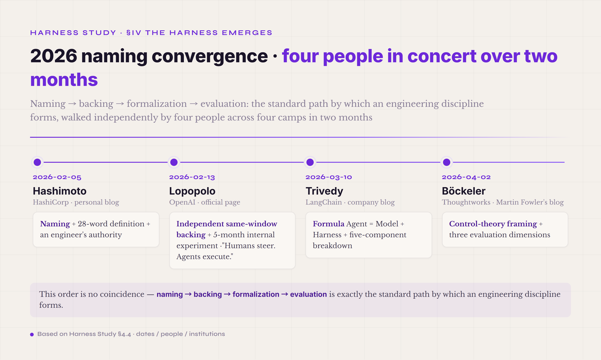
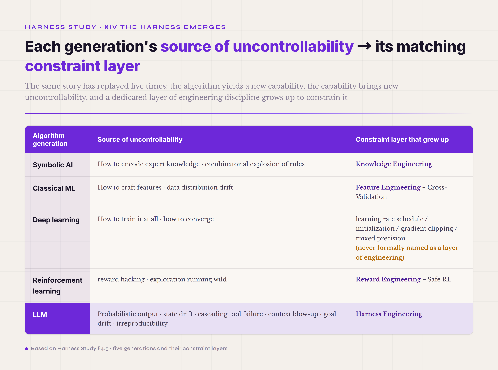
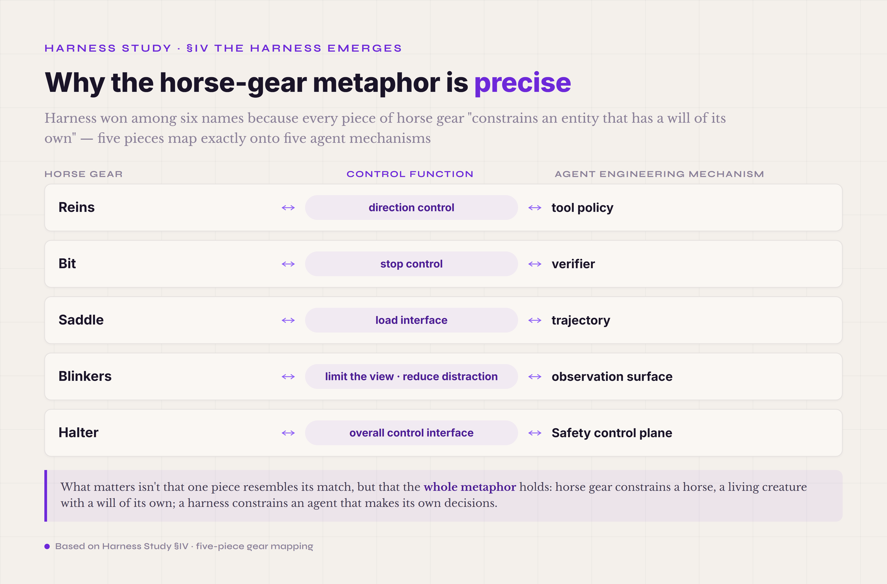

# §IV · The emergence of the harness concept (mid-2023 – 2026)

The AutoGPT wave left the field a clear engineering proposition: you can't build a reliable multi-step agent on "a stronger model plus a better prompt" alone — you need a whole engineering system wrapped around the model. But what that system is called, what parts it has, and who is responsible for what — those questions took about three years to settle, from mid-2023 to early 2026. This section follows that convergence. It first clears up a common misconception (4.1), then surveys the six names the field used over 2023–2025 (4.2) and two engineering anchors from 2023–2024 you can't skip (4.3). It then traces how four people, over two months in early 2026, pinned down the name, the formula, the components, and the control-theory frame (4.4), and places the harness in the cross-generational view of AI history (4.5). It closes with the rise of engineered agent tooling, the framework-harness distinction, and why the word harness won (4.6–4.8).

### 4.1 · First, clear up a misconception: harness is not a new word

Before getting into harness engineering, one common misconception has to go. Many people, seeing "agent harness" for the first time, assume harness is a word invented out of thin air in 2026. It absolutely is not. The English word harness has existed in software engineering for decades, in at least three mature uses.

**Test harness.** A term from the early days of unit testing in the 1980s. In engineering terms: wrap the code under test in a shell, and that shell prepares the test fixture (test data, mock dependencies, initial state), runs the assertions (judging output right or wrong), does the teardown (releasing resources, resetting global state), and produces a test report. Python's pytest, Java's JUnit, JavaScript's Jest, and C's cmocka are all concrete test harnesses. A test harness separates "the test code itself" from "the environment that runs the tests" — a textbook application of separation of concerns.

**Evaluation harness.** A term used in ML academia for over a decade. In engineering terms: wrap a model under evaluation together with a set of standardized benchmark tasks, each with a reference answer, and run them to produce comparable metrics (accuracy, F1, BLEU, and so on). EleutherAI's lm-eval-harness (an open-source LLM evaluation suite), Stanford's HELM (Holistic Evaluation of Language Models), and OpenAI's internal evals framework are all evaluation harnesses. The evaluation harness existed for years before the LLM era — the LLM just raised its profile sharply, because the field suddenly needed one standard way to measure how strong a model is.

**Training harness.** A term common in deep-learning training frameworks. In engineering terms: wrap the training loop (forward, backward, optimizer step) and provide the supporting work training needs — data loading, mixed precision, distributed synchronization, checkpoint saving, metrics logging. HuggingFace's Trainer class, DeepSpeed, and Megatron-LM are all training harnesses. A training harness lets a researcher focus on "model definition plus loss function" instead of writing GPU distributed-sync code by hand every time.

Put the three together and the core meaning of the word shows through: **wrap a core object you're working on (the code under test, the model under evaluation, the model being trained), provide the supporting environment it needs to run, and separate "what the core does" from "what running the core requires."** This is a design pattern that has recurred for decades in software engineering — one form of separation of concerns.

So what is new in 2026 is not "the word harness," but two things.

First · **the agent harness** — applying the word harness to a new core object: **an LLM running multi-step tasks**. This new core isn't deterministic like code under test, isn't static like a model under evaluation, isn't run-once like a model being trained — it enters **a multi-step, side-effecting, probabilistic mode of running.** Writing a "wrapper" for that kind of new core needs a wholly new form of support — and that is what an agent harness does; and the wrapper, together with the model inside it, is what's called the agent (agent = model + harness, taken apart in §I).

Second · **harness engineering** — the focused naming and spread of this as a discipline of agent engineering. Test harness, evaluation harness, and training harness are each tools; no one says "test harness engineering is a discipline." But the agent harness is different — it is complex enough that it has to be studied as an engineering practice in its own right: a control-theory frame, a decomposition into components, engineering patterns, evaluation methods. When Hashimoto used the term "harness engineering" in February 2026, he took the key step of lifting "the agent harness as a tool" into "agent harness engineering as a practice."

In other words, 2026 is an **old word with a new focus** — the word harness didn't change, but it was applied to an object more complex, and more in need of systematic study, than any harness before it.

### 4.2 · 2023–2025: the "doing it without a name" period

Before harness engineering was formally named, the field was already doing what we now call the harness — just under six different names for the same class of practice. These three years are the most interesting stretch in agent-engineering history: the practice was already happening, the products were already running, but no one had one set of words to discuss it. The table below lays the six names out in time order, each with what people were actually doing then and what the name left out.

*Figure 4.1 · The 2026 naming convergence: four people in concert over two months*

| Stage | Time | Popular term | What was actually being done | The name's blind spot |
|---|---|---|---|---|
| **1. Prompt-as-app** | 2020 – mid-2022 | prompt engineering | agent = one long system prompt + a few in-context examples | assumes the LLM is a function; doesn't handle multiple steps |
| **2. Framework** | 2022.10 – 2023.6 | LangChain / chain / orchestration | agent = an object in a software library | a Chain is a DAG, not a loop, and it imposes no production discipline |
| **3. Autonomous loop** | 2023.3 – 2023.7 | autonomous agent / AGI prototype | agent = give it a goal and it works on its own (the AutoGPT mode, which failed) | no verifier / policy / trajectory, so it has to collapse |
| **4. Function calling / Tool use** | 2023.6 – 2024 | function calling / tool use | agent = LLM API + tool schema | covers only the tool contract, not state / errors / feedback |
| **5. Scaffold / Agent system** | 2024 – 2026.1 | scaffold / agent system / agent infrastructure | agent = model + scaffold | "scaffold" implies temporary support; "agent system" is too vague |
| **Karpathy's two terms** | 2025 | *context engineering* / *agentic engineering* | each covers one face — context, or the developer workflow | each covers only one face, not the full engineering layer |

None of these stages was wholly wrong — each name caught a piece of the truth, just not the whole. **Prompt-as-app** (2020 to mid-2022) was right that the model wasn't strong enough yet and a long prompt plus a few examples really was enough. **Framework** (from October 2022) deserves credit for LangChain industrializing "string several calls together." **Autonomous loop** (2023) named autonomy, an agent's core trait, for the first time. After that, **function calling** standardized the interface between the LLM and tools, **scaffold** admitted that "you have to wrap something around the model," and **context engineering** pointed out that context management is one of the core hard problems.

But each name missed something else. Prompt-as-app missed multi-step execution; Framework missed production discipline; Autonomous loop missed engineering support; Function calling missed state and feedback; Scaffold implied "temporary support" (taken down once the building is up, which clashes with the fact that a production agent is always online); Context engineering covered only one face (compaction / memory / retrieval). **Not until Hashimoto used the word harness in February 2026 did a name appear with broad-enough coverage, an accurate-enough metaphor, and room to hold the whole practice.**

The flagship projects of this period — SWE-Agent (Princeton, 2024), Claude Code (Anthropic, 2024), Codex CLI (OpenAI, 2024–2025), Cursor Composer (Cursor, from 2023), Aider (open source, from 2023) — **had, to varying degrees,** the key components of today's harness: trajectory, tool policy, context management, verifier. The exact coverage differed by vendor — Claude Code went deepest on trajectory and context management, Codex CLI on the tool registry and the sandbox, SWE-agent contributed most on standardizing the trajectory format. But back then none of Anthropic, OpenAI, or Cursor used the word "harness" — each described it in its own words: agent infrastructure / coding assistant runtime / agent loop / orchestration layer. **Calling all of it a harness is a 2026 hindsight summary** — the field looked back on these 2023–2025 products, saw they were all doing the same class of thing, and only then had one name for it.

This "practice before naming" lag is the same in other disciplines — MLOps, Knowledge Engineering, and Reward Engineering were all named after a few years of practice. The engineering lesson: **a naming lag isn't industry laziness, it is necessary** — a name can only stabilize once enough practice has piled up behind it; pushed too early, it gets overturned by the practice. Harness wasn't pushed forward until 2026 because by then SWE-Agent, Claude Code, and Codex CLI had run production use cases for nearly two years, and the field had accumulated enough shared scar tissue — which designs are good, which are bad, which components are mandatory, which are optional — for a name to hold.

### 4.3 · The key time anchors: function calling and tool use

Two moments can't be skipped in these 2023–2025 years — the points where the interface between the LLM and its tools moved up from "prompt plus regex parsing" to a structured contract. On the surface they're API announcements; underneath they're two major leaps in the LLM engineering paradigm, and they're the engineering precondition for the Tool Registry, one of the harness's 8 runtime mechanisms, to exist at all.

**2023-06-13 · OpenAI function calling.** Simon Willison's same-day write-up gave the most compact description:

> "You can now send JSON schema defining one or more functions to GPT 3.5 and GPT-4—those models will then return a blob of JSON describing a function they want you to call."

That one sentence carries far more engineering weight than it looks. Before it, getting an LLM to call a tool went like this: the system prompt told the model "you can call `search(query)` or `calculate(expr)`; output in the format `ACTION: tool_name(args)`," the model produced one line of text, and code outside parsed it with a regex. That flow had a pile of problems — the model might drop a field, add a field, change the format (`ACTION:` yesterday, `Action:` today), or slip a string that looks like an action into its explanatory text and throw the parser off. Each problem hit system stability directly — and the failures were sneaky, not a raised exception but "the parser pulled out a tool name and arguments that look valid, but the arguments are actually wrong."

Function calling turned this into a **structured contract**: you give the model a JSON schema (function names, the argument list, each argument's type and description), and what the model returns is no longer "text written to a format" but **a JSON object guaranteed to match the schema.** The mechanism behind it is **constrained decoding** — during token generation, only tokens that keep the final output schema-compliant are allowed to be sampled, and tokens that would break the schema have their probability forced to zero. From then on, the LLM and its tools had type safety, structured validation, and reliable parsing that didn't lean on a regex.

Where is the strategic significance? Before function calling, agent engineers had to spend much of their energy on "getting the model to speak in the right format" — half the tricks of prompt writing were teaching the model to produce parseable text. After function calling, OpenAI solved that on the model's side, and engineers could turn to more important things: how to design the tool registry, where to put the policy, how to write the verifier, how to serialize observations. **That upgrade freed up the attention of the whole agent-engineering field** — the field had the slack to discuss the higher-order problems of agent engineering instead of staying stuck on the low-level "how do we parse the model's text."

The official page is at https://openai.com/index/function-calling-and-other-api-updates/ , signed by engineers Atty Eleti, Jeff Harris, and Logan Kilpatrick. One line in the announcement is worth remembering — OpenAI stated plainly that function-calling designs should confirm with the user, before execution, for actions with real-world impact (sending an email, posting, making a purchase). That is the earliest source of the `requires_confirmation` field on the harness's ToolPolicy, one of the 8 runtime mechanisms — before a tool fires it must pass a policy check, and the policy can decide to run it directly, require human review, or refuse. That mechanism later entered the core of production harnesses as a P0 must-have.

**2023-11-21 · Anthropic adds tool use beta to Claude 2.1.** Anthropic did two things on the same day: Claude 2.1 extended the context window from 100K to 200K tokens, and the tool use beta opened. In Anthropic's words:

> "By popular demand, we've also added tool use, a new beta feature that allows Claude to integrate with users' existing processes, products, and APIs."

Why do these two together? It wasn't a coincidence; it was an engineering-strategy move. Tool use lets the model call external tools — but every tool result has to go back into context, and a dozen calls in, context blows up. **Only with context greatly expanded does tool use become truly usable** — otherwise you've given the model the ability to call tools without the room to digest the results, which is a half-finished product. Anthropic doing both in November 2023 shows it understood, in engineering terms, that **tool use and context management are twin problems** — something the harness's 8 runtime mechanisms later split out explicitly: 5.3 Tool Registry and 5.4 Context management are neighbors that need to be designed together. The Tool Registry decides "which tools can be called and with what arguments," context management decides "how a tool's large output enters context without blowing the window" — the two must cooperate, or progress on one side gets crushed by the limit on the other.

Once function calling and tool use connected, by mid-2024 the field had broadly accepted a simplified agent formula: **agent = LLM + tool schema + some code wrapped around it.** That formula was already ahead of 2022–2023's "model as a function" — it admitted that tools are a core component and that the model API needs a structured tool interface. But no one could yet describe precisely what "some code wrapped around it" was — LangChain? a hand-written Python script? SWE-agent's trajectory framework? some runtime inside Cursor? Every vendor had its own "wrapped around it," with no common name, no common component list, no common control-theory frame. Each described what its own implementation was like, and none could be compared precisely against another.

This "still missing a name" state held until February 2026. On 2026-02-05 Hashimoto published *My AI Adoption Journey* and used the term "harness engineering," giving the thing a formal name — and right after, Trivedy, Böckeler, and Lopopolo each added the decomposition formula, the control-theory frame, and the agent-first operating model. Four people, two months, and they pushed this practice from "doing it without a name" to "a full skeleton with engineering practice behind it."

### 4.4 · The 2026 naming convergence · four people in concert over two months

The key events in pinning down the name of harness engineering happened densely from early February to early April 2026, about two months. In those two months four people each wrote a key piece from a different vantage — Hashimoto naming it with an engineer's authority, Lopopolo backing it with OpenAI's internal experiment, Trivedy reflecting from inside the LangChain framework camp, Böckeler turning it into control theory from the consulting world — and pushed harness engineering quickly from "doing it without a name" to a full skeleton of the practice, with a formula, components, and a control-theory frame.

The four come from four completely different camps, yet within two months they independently wrote highly complementary pieces. That kind of fast cross-camp convergence isn't plagiarism or coincidence — it is the sign that the field had already piled up enough shared practice and was only missing one common name. This "practice accumulates for two or three years, naming converges in two or three months" pattern recurs through IT history; MLOps in 2015–2018 was the same shape. Let me take the four events apart in time order.

#### Hashimoto 2026-02-05 · the naming, with an engineer's authority

**Mitchell Hashimoto** proposed and spread the label "harness engineering" in *My AI Adoption Journey*. Hashimoto is a co-founder of HashiCorp and the author of Terraform — and that pedigree matters. Terraform isn't an ML or academic tool; it's the infrastructure-definition language for large distributed systems. Across the dozen-plus years he spent writing Terraform, Hashimoto dealt with "how a large distributed system gets built and operated reliably by engineers." When someone with that background says "I've come to call the practice of working with agents harness engineering," the name carries engineering authority — not a term invented by a marketer, not the title of a researcher's paper, but a word distilled by an engineer who has actually shipped production.

Hashimoto's own wording is careful — he describes this as a way of working he "gradually came to call harness engineering," and he says outright that he isn't sure whether the industry already has a common term. In other words, Hashimoto himself **did not claim discipline-level status.** Treating harness engineering as "a discipline" is the later summary of Trivedy, Böckeler, and this tutorial — Hashimoto gave the starting point of the naming, not the end of it.

In the article Hashimoto gives the core definition of harness engineering, in just 28 English words:

> "the idea that anytime you find an agent makes a mistake, you take the time to engineer a solution such that the agent never makes that mistake again"

The definition looks plain, but take it apart and every verb has a control-theory counterpart. **find a mistake** corresponds to "a sensor detecting deviation" — it requires a verifier, a trajectory, and observation mechanisms in the harness so you can "see" the error. **take the time** corresponds to "engineering intent" — an agent's mistake isn't a bug you patch and move on from; it needs time spent designing a permanent fix. **engineer a solution** corresponds to "a feedback controller" — not editing the prompt so it "won't do it next time," but hardening a mechanism at the harness layer so this kind of error is structurally impossible. **the agent never makes that mistake again** corresponds to "the convergence guarantee of a control loop" — this class of error is eliminated and won't consume future engineering effort.

The definition itself is **a control-theory proposition in its concrete LLM-engineering form** — agent makes a mistake → harden a permanent fix into the environment → this class of mistake stops happening. From Wiener's cybernetics in 1948 to Hashimoto's harness engineering in 2026, across 78 years, the same feedback-loop principle is carried onto a new engineering object.

One thing to note especially: **Hashimoto does not, in his own article, give the formula "Agent = Model + Harness" that is the most widely circulated one today.** That formula actually comes from the next step — Trivedy.

#### Lopopolo 2026-02-13 · the official backing of a 5-month OpenAI experiment

Eight days after Hashimoto's article, OpenAI's Ryan Lopopolo (Member of Technical Staff) published *Harness Engineering: leveraging Codex in an agent-first world*. The eight-day gap matters — the two pieces aren't plagiarism, they're **independent convergence in the same window.** Hashimoto's is a summary of personal practice; Lopopolo's is an official article after at least five months of internal experiment at OpenAI. Two pieces converging on the same word in the same window show that the word's "conditions for birth" were already ripe in early 2026.

Lopopolo's tagline condenses the whole article's engineering claim:

> "Humans steer. Agents execute."

That sentence redefines the engineer's role in the agent-first era in four words. In traditional software development, the engineer **writes the code by hand** — every if/else, every SQL query, every React component typed out by the engineer. In the agent-first era Lopopolo describes, the engineer **doesn't write code directly**; the engineer's core work becomes three things — **environment design** (which tools, which sandbox, which permissions to give the agent), **intent specification** (what prompt / instructions / specifications describe the task clearly), and **building the feedback loop** (how to evaluate agent output, how to ablate, how to find the cases where the agent still falls short). Those three together are harness engineering — the engineer shifts from "the person actually typing" to "the designer of the agent's work environment."

Lopopolo's article describes a five-month internal experiment: starting from an empty repository, using Codex to generate application code, tests, CI, docs, observability, and internal tools. The key isn't how strong Codex is — it's that **over the whole five months OpenAI's internal team spent its energy not mainly on tuning the Codex model but on tuning the harness around it** — what sandbox, what tool set, what instructions, what feedback loop to give Codex. This was the first time OpenAI officially admitted that the harness engineering layer is more worth the optimization effort than training the model itself.

You can work the OpenAI internal timeline backward from this article — published 2026-02-13, describing a five-month experiment, so OpenAI was doing this internally from around September 2025. Other vendors of the period (Anthropic's Claude Code, Cursor, Replit, Aider) were almost certainly doing the same kind of thing in parallel — just without a public name in 2025. That's why the naming converged so fast in early 2026: the field had been doing it privately for at least half a year to a year.

The official URL is at https://openai.com/index/harness-engineering/ (some clients hit a 403 fetching it; local source notes are in `openai-official-source-notes-2026-05-19.md`). Lopopolo's identity (an OpenAI engineer, not a researcher) plus the channel (OpenAI's official page, not a personal blog) make this article, in the formation history of harness engineering, **OpenAI's official endorsement of Hashimoto's naming.**

#### Trivedy 2026-03-10 · the framework camp's formula and component breakdown

A month after Hashimoto's article, **Vivek Trivedy** published *The Anatomy of an Agent Harness* on the LangChain blog. Trivedy comes from the LangChain camp — LangChain, out in October 2022, was the earliest wave of agent framework, and by 2026 it had been doing framework work for more than three years. The engineering meaning of Trivedy's piece is this: **the framework camp itself admits the framework isn't enough · you need the harness layer · and that layer isn't a subset of the framework but its upper layer.** That admission matters — it's the self-reflection of a framework company, evolving from "the framework is everything" to "the framework is just one way to implement a harness."

Trivedy's article gives the most widely cited compact formula today:

> "Agent = Model + Harness. If you're not the model, you're the harness."

and the simplest definition of the harness:

> "A harness is every piece of code, configuration, and execution logic that isn't the model itself."

The engineering meaning of these two lines was taken apart in the "three definitions in concert" section of §I — the first is a **decomposition formula** that cuts the agent cleanly in two, the second an **exclusion-based definition** that fixes the line of responsibility. What to add here is that Trivedy did something beyond putting it into a formula — he broke the harness into five components, the first time "that layer outside the model" was made concrete as a component list an engineer could discuss.

Trivedy's five components are: **System Prompts** / **Tools, Skills, MCPs** (tools, skills, Model Context Protocol integrations) / **Bundled Infrastructure** (the runtime environment — filesystem, sandbox, browser) / **Orchestration Logic** (subagent spawning, handoffs, model routing) / **Hooks-Middleware** (compaction, continuation, lint checks). These five aren't a one-to-one match with the 8 runtime mechanisms plus 1 Safety control plane this tutorial covers later — Trivedy's cut is coarser-grained, folding this tutorial's Model Adapter / Observation / Trajectory into "Bundled Infrastructure" and "Orchestration Logic," and folding Verifier and Safety into "Hooks-Middleware." But Trivedy's contribution is **the first treatment of the harness as an object you can decompose into components** — no longer a vague "that layer outside the model," but an engineering system with five concrete zones of responsibility.

That Trivedy, from the LangChain camp, put the harness into a formula in one blog post has engineering significance beyond the formula itself — it means the framework camp has set down its attachment to "the framework is everything" and is voluntarily ceding ground to the harness. From LangChain in October 2022 to Trivedy's article on 2026-03-10, a full three and a half years, the framework camp evolved from "an agent is a chain" to "agent = model + harness · the framework is just one way to implement a harness." A conceptual upgrade coming from inside the framework camp carries far more engineering authority than an outside academic writing a paper to criticize the framework.

#### Böckeler 2026-04-02 · the consulting world's control-theory framing

About three weeks after Trivedy's article, **Birgitta Böckeler** (a Thoughtworks Distinguished Engineer) guest-wrote *Harness Engineering for Coding Agent Users* on Martin Fowler's blog. Böckeler comes from the Thoughtworks consulting world — a vantage unlike the engineer's, the framework company's, or the big-vendor-internal one. A consultant meets dozens of companies' engineering practices a year and watches "how this method lands under different organizational contexts." Böckeler's piece frames harness engineering into a shape a consultant can take to a client and explain clearly — the leap from "what it is" to "how to evaluate and improve it."

In the article Böckeler upgrades Hashimoto's and Trivedy's concepts into a control-theory form:

> harness = **guides (feedforward controls) + sensors (feedback controls)** + humans steering iteratively based on observed failures

The engineering meaning of that sentence: **a harness isn't a passive "code shell," it's a control system.** Feedforward is the up-front constraint — rules, docs, tools, prompt instructions, permission boundaries — set before the agent acts to say "what may be done, what may not, in what form." Feedback is the after-the-fact check — tests, linters, AI review, verifier, trajectory analysis — applied after the agent acts to judge "was it right, where was it wrong, should it retry." Humans, in the loop, make iterative adjustments based on observed failures — which is the consulting-world translation of Hashimoto's "engineer a solution." This structure is exactly isomorphic to Wiener's 1948 cybernetics — feedforward plus feedback plus iterate — the same feedback-loop principle retold by Böckeler in plain engineering language so an engineer who has never read the cybernetics originals can grasp it at once.

Böckeler goes further and gives the harness three evaluation dimensions: **maintainability** — can the harness's own code and configuration be maintained over time by engineers? **architecture fitness** — does the harness fit the existing system architecture, or is it an island? **behavior** — does the agent's actual behavior, under the harness's constraints, match expectations? These three dimensions lift the harness from "something engineers do" to "an engineering object that can be reviewed from outside" — a consultant can use them to assess a client's agent project, an engineer to self-assess. That "can be evaluated" property is the key marker of any engineering object moving from craft to discipline — without evaluation criteria you can't discuss better or worse, and without better or worse you can't form best practices or teach.

#### What the four-person concert means for engineering history

Lay the four events out in time: 2026-02-05 Hashimoto (HashiCorp · personal blog) — naming, the 28-word definition, an engineer's authority → 2026-02-13 Lopopolo (OpenAI · official page) — independent same-window backing, a five-month internal experiment, the "Humans steer. Agents execute." tagline → 2026-03-10 Trivedy (LangChain · company blog) — the formula Agent = Model + Harness, plus the five-component breakdown → 2026-04-02 Böckeler (Thoughtworks · Martin Fowler's blog) — control-theory framing, plus three evaluation dimensions.

In two short months, four steps took harness engineering from one engineer's personal insight to a full skeleton of a practice — a formula, components, a control-theory frame, and evaluation dimensions. **The order of the four steps isn't a coincidence; it's the standard path by which a discipline forms** — first the naming (Hashimoto), then authoritative backing (Lopopolo), then formalization (Trivedy's formula plus components), and finally an external evaluation frame (Böckeler's three dimensions). That maps almost one-to-one onto the "textbook path" by which an engineering discipline moves from craft to discipline.

This fast cross-camp convergence has a precedent in IT history. The most recent is MLOps — in 2015 Sculley and colleagues named the problem domain in the NeurIPS paper *Hidden Technical Debt in Machine Learning Systems*; in 2017–2018 Google, Uber, LinkedIn, and others each published internal ML-platform articles; in 2018–2019 Andrew Ng, Hannes Hapke, and others wrote MLOps textbooks; by 2020 the word MLOps was in every big company's job descriptions. From naming to discipline took about three to four years. After the two months of dense events in February–April 2026, harness engineering will very likely go through a similar fast maturation in 2026–2028 — which is also the engineering basis for writing this tutorial in mid-2026.

One thing to note especially: **not one of the four is an academic researcher** — Hashimoto is an open-source engineer, Lopopolo a big-vendor staff engineer, Trivedy a framework-company PM, Böckeler a consultant. Same as MLOps — the founding MLOps paper, Sculley's NeurIPS 2015, was a Google internal engineering paper, not pure academic research. This shows **harness engineering is an engineering discipline driven out of practice**, not a methodology derived from theory. Academic papers (such as AHE[^ahe-2026]) follow on with formalization, but harness engineering's roots are in practice, not in papers — which decides the discipline's future direction: theory will keep advancing, but practice stays one or two years ahead of theory, and every "authoritative definition" only counts once it's verified back in a production case.

### 4.5 · The cross-generational view · the harness is not a one-off

The birth of harness engineering can be placed inside 70 years of AI history — it isn't a one-off, but looks like another rerun of the "practice accumulates → the constraint layer gets named → a discipline forms" process every generation of algorithm paradigm has gone through. First the sense of proportion: this "cross-generational cycle" is a hindsight view that helps you see where the harness sits, not a strict law of history — as you'll see below, even the "constraint layer" was never formally named in some generations (deep learning's training tricks, for instance), and forcing it into a neat "the Nth time" would distort things. With that proportion in mind, this section draws out the pattern — three cross-generational insights, the harness's sibling relationship with MLOps, and why that sibling relationship has a boundary too.

#### Three cross-generational insights

**Insight one · every generation's constraint layer is answering the same question — what is this generation of algorithm's source of uncontrollability?**

An algorithm's form decides what kind of engineering layer it needs around it. Symbolic AI's source of uncontrollability was "how to encode expert knowledge, and the combinatorial explosion of rules," and Knowledge Engineering's toolset (rule set / inference engine / explanation system) answered exactly those two. Classical ML's was "how to craft features, and data distribution drift," and Feature Engineering plus Cross-Validation matched it — the former for feature construction, the latter for measuring generalization. Deep learning's was "how to train it at all, how to converge," so there are learning-rate schedules, initialization tricks, gradient clipping, mixed-precision training — a toolchain never formally named "Training Engineering" but in practice a complete one. Reinforcement learning's was "reward hacking, exploration running wild," and Reward Engineering plus Safe RL matched it — the former for "how to design a reward function the agent can't game," the latter for "how to keep the agent from doing something truly dangerous during training." This "algorithm's source of uncontrollability → the constraint layer's function" correspondence isn't a hindsight description; it's a real causal link at the level of engineering practice — **every generation's engineers were pushed along by the uncontrollable problem they were handling, and they ended up forming the matching engineering system.**

*Figure 4.2 · Five generations of algorithms, their sources of uncontrollability, and the matching constraint layer*

So for harness engineering, what is the LLM generation's source of uncontrollability? It's been said over and over in the last three sections — the probabilistic output of single-step prediction, the state drift of multi-step execution, the cascading failure of tool calls, the blow-up of the context window, goal drift, irreproducibility. Those six make up the engineering proposition harness engineering answers. Predictably, once the next generation of algorithm (say, a fully multi-modal reasoning agent, or a self-improving research loop) matures to the production-use-case stage, engineers will sense a new source of uncontrollability, and the field will invent another new "X engineering" to name that generation's constraint layer.

**Insight two · the naming of a term always lags the practice by 2–12 years — and the lag isn't laziness, it is necessary.**

Knowledge Engineering started with the DENDRAL project in 1965 and was named by Feigenbaum in 1977 — a 12-year lag. MLOps went from ML-in-production practice in the mid-2010s to a stable name in 2018–2020 — a 3–5 year lag. Harness Engineering went from SWE-Agent / Claude Code / Codex CLI / Cursor / Aider practice in 2023–2024 to its naming in February 2026 — about a 2-year lag. The lag looks like "the industry is slow to react," but it's actually the engineering world's self-protection — a name can only stabilize after enough practice cases have accumulated. Pushed too early, the name gets overturned by later practice. If, say, someone in 2021 had proposed "prompt engineering" as the one name for all of LLM engineering, then once function calling arrived in 2023 the name would start failing to hold tool calling; by the time trajectory / verifier / ablation matured in 2024, "prompt engineering" would be far too narrow. Hashimoto pushed harness engineering only in 2026 precisely because the 2024–2025 stretch of practice had already validated the concrete component list of "that layer outside the model" — only then could the name stabilize without being overturned by the next two years of practice.

The engineering meaning of this insight for the tutorial's reader: **when the next generation of algorithm arrives, don't rush to name its engineering layer.** Wait for the field to run two or three years of production use cases and accumulate enough scar tissue, and the name will surface from the engineering community on its own. Trying to force a naming convergence usually fails — a name can only take root in soil thick enough with practice. Every year the market sees someone try to push a new "X engineering" term, and most don't stick, precisely because the soil was too thin when they pushed.

**Insight three · the birth of a term isn't the birth of the concept — but a term is necessary for a discipline to form.**

DENDRAL was already doing what we now call Knowledge Engineering in 1965, but for those 12 years the thing couldn't be discussed systematically — someone studying DENDRAL and someone studying MYCIN would meet and find they were both "encoding expert knowledge into rules," but with no shared name for it, so the two projects borrowed from each other slowly. Once Feigenbaum named it Knowledge Engineering in 1977, knowledge transfer from DENDRAL to MYCIN to R1/XCON sped up at once — because with a shared name, engineers could use one word in paper titles, conference names, and textbook chapters to describe what they did. The 2026 naming convergence of harness engineering is, at heart, a rerun of this — giving the field's two or three years of accumulated practice consensus one shared name, reusable in paper titles, conference names, job descriptions, and textbook chapters.

**Naming is the marker of an engineering field moving from craft to discipline** — without a name there's no comparing, no teaching, no common language. That's why the engineering-history standing of Hashimoto's 2026-02-05 article is higher than its word count — it said nothing new (the practice it described had been running in the field for two years), but it named those two years of practice, turning the thing from "every vendor doing it quietly" into "the field's common language." Seen this way, the real birthday of harness engineering as a practice is 2026-02-05 — what the field did before that day and after it is no different at the engineering level, but in the sense of forming a common language it's a fundamental difference: before, each vendor practiced its own craft; after, the field shares a practice.

#### The harness and MLOps are siblings

Comparing harness engineering to the earlier constraint layers, its closest sibling is **MLOps.** Both appear in the same kind of engineering evolution — a class of algorithm paradigm accumulates a few years of production use cases, the field discovers that "the algorithm alone isn't enough, you need a whole engineering layer around it," and the layer gets a name. That "the algorithm catches on → an engineering layer emerges → naming converges" pattern is the same path MLOps and the harness both walked.

The two are structurally alike on several dimensions. **The algorithm itself** — MLOps manages a trained ML model (a fitted classifier, regressor, embedding model), the harness manages the LLM (a pretrained language model plus multi-step execution ability). **The source of uncontrollability** — MLOps handles data drift plus model decay plus deployment inconsistency, the harness handles probabilistic output plus long-task drift plus tool failure. **The founding thesis** — MLOps is Sculley 2015 NeurIPS *Hidden Technical Debt in Machine Learning Systems* with its line "ML code is a small part of the total system," the harness is Trivedy 2026-03's "Agent = Model + Harness." **The naming lag** — MLOps lagged 3–5 years (practice 2014–2017 / naming 2018–2020), the harness about 2 years (practice 2024 / naming 2026).

The most interesting likeness is **the structural isomorphism of the founding theses** — Sculley 2015's "ML code is a small part of the total system" and Trivedy 2026's "Agent = Model + Harness" are, in engineering terms, the same proposition — both say "the algorithm itself is only a small part of the whole thing, and the rest is an independent engineering practice in its own right." That "decenter the core algorithm" proposition is the signature framing at the birth of a constraint-layer discipline. For a discipline to stand up, it first has to admit that the thing it manages sits too far at the margin of the existing disciplines — MLOps says "ML code is only 5%," harness engineering says "the model is only part of the agent" — and both practices grew out of a decentering narrative about the core algorithm.

#### But the sibling relationship has a boundary · the fundamental difference between MLOps and the harness

Though harness engineering and MLOps are siblings, the two manage completely different things — and this boundary has to be made clear, or it leaves the impression that "the harness is a subset of MLOps" or "the harness is MLOps under a new name." Both misreadings showed up in early-2026 industry discussion and have to be answered head-on.

**MLOps mainly handles "what happens after a trained model goes live"** — data versioning, model registry, feature store, A/B testing, model monitoring, drift detection, retraining pipeline, deployment infrastructure. All of it happens before, or outside of, model inference, and has nothing to do with "how the model handles a single inference." MLOps's core problem is "how to keep an already-trained ML model working reliably in production over the long term" — the weight is on long-term, production, reliable.

**The harness mainly handles "what happens at every step of model inference"** — the tool registry decides which tools each step can call, the context manager decides what context each step sees, the trajectory recorder decides what trace each step leaves, the verifier decides how each step's right-or-wrong is judged, the Safety control plane decides which actions each step must block. All of it happens inside, and between, each model inference, and is about "how to keep an agent working reliably across a multi-step task." The harness's core problem is "how to keep an LLM agent — itself probabilistic, multi-step, side-effecting — continuously controllable through a task" — the weight is on multi-step, continuous, controllable.

These two core problems are completely different, because of **the biggest difference between an LLM and a traditional ML model** — the LLM has **multi-step execution.** A traditional ML model (classifier, regressor, embedding model) does "input a piece of data → output a prediction," a one-shot inference; an LLM agent does "take a goal → break it into tasks itself → call tools → read feedback → change its decisions → until done," a continuous multi-step process. The multi-step process introduces engineering propositions MLOps never handled — state management, error handling, loop detection, context compaction, trajectory write-back, cross-step verification, permission boundaries — all the harness's responsibility, with no matching part in MLOps's toolbox. Conversely, MLOps's data drift and model decay are things the harness doesn't handle either — the harness assumes the model weights are fixed (already handled on the inference-serving side) and only governs how the inference process uses that model.

In other words, **the harness is not a subset of MLOps, nor an extension of MLOps; it's a parallel engineering practice** — the two solve different engineering propositions with different toolsets, but their origin pattern (practice first, naming follows) and their discipline-formation path (naming → formula → components → control-theory frame → evaluation dimensions) are isomorphic. Understanding the harness as a sibling of MLOps rather than a subset avoids two common misreadings. One: "we already do MLOps, so we don't need a separate harness" — wrong, the two manage fundamentally different things; MLOps handles "how the model stays alive," the harness handles "how the agent gets work done." Two: "the harness is just MLOps for LLMs" — also wrong, multi-step execution forces the harness to have parts MLOps doesn't (trajectory, verifier, tool policy, Safety control plane), while MLOps's core parts (feature store, drift detection, A/B testing) are barely used in a harness. **Siblings, not parent and child; parallel, not in series.**

#### A parallel survey of the same period · Code as Agent Harness

While this tutorial was being written, on 2026-05-18 a 42-author survey, *Code as Agent Harness*[^code-as-agent-harness-survey-2026], was uploaded to arxiv — completely overlapping this tutorial's topic, two days apart. This parallelism isn't a coincidence; it's a signal of the concentrated burst of systematic stocktaking that followed the early-2026 naming convergence of harness engineering.

The survey breaks the harness into three layers — interface (how code connects reasoning, action, and environment modeling), mechanisms (planning, memory, tool use plus feedback control), and scaling (from single-agent to multi-agent). Its abstract enumerates six open challenges: evaluation that looks beyond final task pass/fail; how to verify when feedback is incomplete; how to make harness improvements without regression; how to keep shared state consistent across multiple agents; how to keep humans in supervision in safety-critical settings; and how to extend to multi-modal (the survey body, §5.2, opens up a seventh, "Toward a Science of Harness Engineering," a meta direction, different in nature from the first six concrete engineering challenges).

These six challenges line up closely with this tutorial's main thread — the later parts on the three-layer verifier, leakage defense, and the artifact-claim mismatch are the engineered answers to two of them, "evaluation" and "verification under incomplete feedback"; the part on the Harness Lab's Observe-Score-Ablate-Tune-Iterate loop answers "improvement without regression"; the part on the Safety control plane answers "human supervision"; the parts on composability and fork-join answer "shared state consistency across agents."

The two materials come at it from complementary, non-conflicting angles. **The survey cuts from "code as the agent's execution substrate"** — code isn't just the LLM's output target, it's the unified basis for agent reasoning + action + environment modeling + verification — a framing that stresses "code as a unified interface." **This tutorial cuts from "the engineering layer outside the model"** — following Trivedy 2026-03's "Agent = Model + Harness" framing, splitting that outer layer into 8 runtime mechanisms + 1 Safety control plane + engineering patterns + a workbench — a framing that stresses "parts you can discuss independently." The survey's interface / mechanisms / scaling layers cover most of this tutorial's eight runtime mechanisms — the survey is a notch more conceptual, this tutorial a notch more operational. After finishing this tutorial, reading that survey is recommended as same-period peer validation plus an academic-vantage supplement — the two together make your mental model of agent-harness engineering one level more three-dimensional.

### 4.6 · LangGraph and the rise of "engineered agent tools"

Around the naming convergence, engineered agent tools evolved together — and the engineering-history meaning of this is more than "a batch of handy tools came out." It's the layer of engineering raw material that harness engineering was born from. The name could stabilize in early 2026 precisely because 2024–2025 saw a batch of cross-camp products emerge that proved out what the harness should grow into.

#### LangGraph's evolutionary path

The LangChain camp's own evolution says it best. LangChain came out in October 2022 as a Chain (DAG) framework, and by 2023–2024 the field broadly found that a Chain wasn't enough — an agent needs loops, needs state, needs interrupt-and-resume. So in 2024 the LangChain team released the **LangGraph library** — drawing the agent state machine explicitly, upgrading the agent from the DAG paradigm to the finite-state-machine paradigm. That's a paradigm leap from "chain" thinking to "state machine" thinking, admitting that an agent is a stateful looping process, not a stateless one-way pipeline. Its engineering meaning: the LangChain framework camp itself admitted that "the chain, its core abstraction, isn't enough" and needed a more complex one. That self-admission plus self-upgrade is the mark of a mature engineering organization — but it also exposes the framework camp's fundamental limit: all its abstractions are "advisory," you can write a state machine with LangGraph or not, nothing forces you.

A year after the LangGraph library, on 2025-05-14 LangChain shipped **LangGraph Platform GA** — a managed runtime providing production deployment, monitoring, debugging, and scaling for agents. Platform GA means the LangChain team judged the LangGraph abstraction stable enough to sell as infrastructure. That same year, in October 2025, LangChain shipped **LangGraph v1.0** — a version number from 0.x to 1.0 means an API-stability commitment. From the 2024 LangGraph library to v1.0 in October 2025, a full year and a half of product evolution pushed the agent state machine from "an experimental new abstraction" to "an industrial production component."

But one thing has to be said — **LangGraph still belongs to the framework camp; it's not a harness.** LangGraph provides "the ability to draw an agent state machine" and "a runtime to run the state machine," but it doesn't impose the production discipline of "must have a trajectory / must have a verifier / must have a tool policy." You can write a LangGraph agent that runs fine and has no verifier at all, and LangGraph won't stop you; you can run LangGraph in production and never record a trajectory, and LangGraph won't force you to. That's exactly why Trivedy's 2026-03 article drew the framework-vs-harness line so sharply — LangGraph is a very mature framework, but framework and harness are two different things. You can use LangGraph as the implementation base of a harness, but an engineer has to stack a layer of enforced discipline on top of LangGraph for it to count as one.

#### Representative cross-camp products

As LangGraph evolved, a batch of cross-camp products matured densely in this 2024–2025 stretch. **Anthropic's Claude Code** went alpha in April 2024 and GA in June 2024 as a CLI, its internal source already decompiled and analyzed (cc-sourcemap-survey / cc-rust-rewrite-blueprint). **OpenAI's Codex CLI** shipped in 2024, working with the OpenAI Codex service, source open. **Cursor's Composer** has been built into the IDE since 2023, routing across multiple models. **Aider** is an open-source CLI from 2023, iterated by the community. This batch **had, to varying degrees,** the key traits the word harness covers today — exactly how far each went needs checking against each vendor's public docs or decompiled material.

These products' shared traits boil down to four things, each matching one of harness engineering's core promises.

**First · tools are a controlled resource** — permission policy, argument validation, audit logging, not "the model calls it the moment it wants to." Claude Code has a four-layer permission decision and a hook system for policy injection; Codex CLI has a sandbox plus `Constrained<T>` plus a tool allowlist. These are engineered implementations of "the model can't call a tool at will" — every time the model fires a tool_call, there's a separate body of code (not the model itself) behind it deciding whether it should run, with what arguments, and how to record it afterward.

**Second · state is an explicit resource** — trajectory files, session memory, context budget. Claude Code uses a JSONL trajectory, one event per line; Codex CLI uses a Rollout file format; both make "what the agent did" into a physical object that can be read externally, diffed, and replayed. State is no longer the implicit memory of a Python process — it's an engineering object with a schema, a lifecycle, and an access pattern.

**Third · failure is a core runtime state** — retry, rollback, verifier, ablation are all engineering actions, not exceptions. These products have dedicated designs for tool failure, model hallucination, and loop detection, not a simple "raise an exception and be done." Failure is treated as part of normal runtime — agent engineering doesn't assume "everything will go smoothly," it assumes "any step can fail," and builds every mechanism around that assumption.

**Fourth · review is executable** — what a run produces can be replayed, diffed, compared. The trajectory isn't a log for humans to read; it's a machine-readable event stream that automated tools can consume. This is the biggest difference between a harness and a framework — what a framework produces you can usually only read as a log, with no view into "why the agent made this decision at the time"; what a harness produces can be replayed precisely to any step, diffed precisely between any two runs, and ablated precisely to judge each mechanism's contribution.

Put the four traits together and you have the concrete engineering object the term harness engineering pointed at when it was named in early 2026. **By the time Hashimoto named it in February 2026, the practice had been running stably for two years** — the code bases of SWE-Agent, Claude Code, Codex CLI, Cursor, and Aider had long had trajectory, tool policy, verifier, and ablation in them, just without one name. Naming only turns an existing thing into a discussable concept — exactly matching cross-generational insight three, that "a term is necessary for a discipline to form."

### 4.7 · The fundamental distinction between framework and harness

Having covered LangGraph's evolution and the cross-camp products' shared traits, the **fundamental distinction between framework and harness** has to be nailed down — it's the conceptual premise of everything later in the tutorial. If a reader can't tell the two words apart, they'll conflate "we use LangGraph, so we're set" with "we built a harness," and every later discussion will miss the mark.

#### What the two words point to

**A framework is a development library** — LangChain, LlamaIndex, Pydantic AI, Mastra, the Vercel AI SDK are frameworks. It gives you APIs, abstractions, convenience components to write agent code faster. But it **imposes no production discipline** — you can use LangChain to write an AutoGPT-style toy that collapses in 10 steps, or to write a production-grade agent. The framework stays neutral; whether it goes to production depends on how you use it. A framework assumes its user is an engineer with judgment who knows when to add a verifier and when to add a trajectory — so a framework gives capability, not discipline.

**A harness is an engineering system** — Claude Code, Codex CLI, Cursor, Aider (to varying degrees of maturity) are harnesses. It turns production discipline into an enforced convention — **you must have a trajectory, you must have a tool policy, you must have a verifier** — or it won't let you run, or what runs won't be reliable. A harness doesn't give you "free choice" of which discipline to use — it has already burned the discipline into the runtime, and you either follow its discipline or switch to a different harness. A harness assumes its user will forget to add a verifier, will skip the trajectory, will bypass the policy — so it turns those "should-do-but-easy-to-forget" things into enforced conventions.

The fundamental distinction between the two words is **their attitude toward production discipline** — a framework is permissive (it lets the user freely decide how deep the discipline goes), a harness is prescriptive (it forces the user to follow the discipline). From an engineering-governance view, prescriptive is more reliable than permissive in production, because it removes at the source the kind of error that shouldn't happen, like "the engineer forgot to add a verifier." But the cost of prescriptive is reduced flexibility — if you genuinely want to run "a quick experiment that needs no verifier," a harness not letting you skip the verifier gets in the way. So a framework suits the experiment and prototype stage, a harness the production and long-maintenance stage.

#### The DOS vs Linux analogy

Make the distinction plain with one analogy — an early personal computer could run DOS or Linux, both on the same CPU, but with completely different software ecosystems.

**DOS is the framework mindset.** DOS gives you direct hardware access — want to read a disk sector directly, fine; want to poke video memory directly, fine; want to skip the file system and operate on inodes directly, fine. DOS imposes no discipline like "you must access data through the file system" or "you must use process isolation" — it gives you the interface and lets you decide how to use it. Writing a small tool on DOS is very handy — a .com file of a few dozen lines of assembly runs, boots fast, with no process-switching overhead. But running a server on DOS is a disaster — any program's bug can pollute the system's global state, any process can read another's memory, there's no user or permission isolation, no automatic recovery when a process crashes. DOS's failure mode running a server is isomorphic to AutoGPT's running a long task — both are "the environment is too free, so errors are everywhere."

**Linux is the harness mindset.** Linux **forces** process isolation (want to read another process's memory directly? unless you're root, the OS won't let you), forces a permission model (want to read /etc/shadow? unless you have the permission), forces file-system discipline (want to skip the file system and poke the disk directly? you have to unmount first to do raw operations). These "forcings" are a nuisance when writing a small tool — even a hello world has to go through fork, exec, wait, with performance overhead an order of magnitude above a DOS .com. But they're lifesavers running a server — one bug won't pollute the whole system, one crashed process won't drag down the others, permission boundaries keep malware from easily getting root. Linux's reliability running a production server is orders of magnitude above DOS — not because Linux's CPU is faster or its kernel smarter, but because Linux burned the engineering discipline a production environment needs into the kernel.

**AutoGPT is a toy on DOS, Claude Code is a service on Linux** — both on the same CPU (the same-generation GPT-4 or Claude), but because the engineering-governance discipline of the runtime is completely different, what they can produce is completely different. AutoGPT runs in an environment with no "enforced trajectory / enforced verifier / enforced policy," so all five failures go unblocked; Claude Code runs in a harness that enforces these disciplines, so the same-generation model can reliably finish a real engineering task with 50+ tool calls.

One boundary of the analogy is worth marking — the relationship of an OS to a framework/harness isn't directly isomorphic; an OS is the runtime infrastructure of an application, a framework/harness is the runtime infrastructure of an agent. The DOS-vs-Linux analogy borrows just one dimension — the degree to which engineering discipline is enforced: DOS doesn't enforce discipline (framework), Linux does (harness) — other dimensions don't map one-to-one. But that one dimension's correspondence is enough to make the fundamental framework-vs-harness distinction clear.

#### How an engineer should choose

For an engineer about to build an agent project, the choice between framework and harness sets the project's engineering-governance strength. **If the project is a PoC or an internal demo**, starting with a framework is reasonable — LangChain plus some hand-written Python can produce a demo in a week, high flexibility, fast to pick up, plenty of community resources. That's the scenario a framework suits best — one-off, experimental, error-tolerant. **If the project is going to production**, you must use a harness — either write a harness yourself and burn the production discipline in (the path of Claude Code / Codex CLI), or run your business logic directly on a mature harness. The middle road ("use a framework but add some discipline yourself") usually fails — because with no enforced convention, an engineer under schedule pressure will surely skip the verifier, skip the trajectory, skip the policy, and by the time something goes wrong it's too late to add them back. These "we use LangChain but we'll add a verifier ourselves" projects show up over and over in the 2024–2025 scar-tissue cases, and they all converge to either cutting the custom layer and switching to an off-the-shelf harness, or thickening the custom layer until it evolves into their own harness.

The core of this judgment: **the reliability of a production agent system doesn't come from the engineer's self-discipline, it comes from the engineering system's enforcement.** Relying on self-discipline is unreliable, because people get tired, rush schedules, and compromise under pressure. The engineering system's enforcement is reliable, because at the system level it makes "what should be done" default-on — the engineer has to actively skip it to not do it, rather than actively do it to add it. The word harness nails "enforcement" into the concept — it's called a harness, not a tool kit, not a helper library, precisely because its essence is "constraining an entity that has autonomy," and a constraint only means something if it's enforced. A bridle that lets the horse break free whenever it likes isn't a bridle — it's a decoration; an engineering layer that lets the agent skip the verifier whenever it likes isn't a harness — it's a framework. That one-word difference decides whether a project can go to production.

### 4.8 · Why the word harness won

Back to a core question: why did the field pick "harness," and not any of the five already-popular candidates — "framework," "scaffold," "agent system," "context engineering," "agentic engineering"? This isn't a matter of taste; it's a matter of metaphor precision — a widely adopted engineering term must have a metaphor that precisely captures **how this thing differs at its core from other similar things.** Below, the metaphor blind spots of the five candidates, taken apart, then why the harness metaphor lands exactly right.

#### The metaphor blind spot of "framework"

The word framework has long been familiar in software engineering — Spring framework, React framework, Django framework. The relationship it implies is **the developer is active, the framework is passive** — the developer takes the framework to write code, the framework provides APIs, abstractions, convenience components, but once it's running the framework is a static artifact and all runtime behavior is decided by the code the developer wrote.

But once an agent is running, that relationship is **reversed** — the agent is active, and the engineering system has to actively watch its every step, intervene the moment it's about to do something bad, and break in when it goes off course. The word framework implies none of that "continuous watching and intervention." LangChain can be called a framework precisely because what it provides at the agent-runtime layer is a "passive API," not "active watching and intervention." When the field found it needed this watch-and-intervene layer, it had to find a word that implies "continuous runtime activity" — and framework's metaphor blind spot makes it unable to carry that responsibility.

#### The metaphor blind spot of "scaffold"

Scaffold, in its original construction sense, is **temporary support** — used while putting up a building, taken down once it's done. The word is used plenty in ML academia too — "scaffolding" appears in child cognitive development, pedagogy, and reinforcement learning.

But scaffold's "temporariness" **directly conflicts** with the reality of a production agent — a production agent's engineering layer must be always online. An agent runs for a lifetime, and the engineering layer wrapping it has to last that lifetime. There will never be a day when "the agent is mature now, so we can tear the engineering layer down" — quite the opposite, the more mature an agent system, the more complex and tighter the engineering layer wrapping it. Claude Code has run for two years and is still adding hooks, verifiers, and policies, with no sign of "tearing down the scaffold." So scaffold's "temporariness" is a fundamental metaphor mismatch — using a word that implies "will be torn down" to describe a layer that "will never be torn down" — and an engineer's first reaction to the word is discomfort.

#### The metaphor blind spot of "agent system" / "agent infrastructure"

These two are too vague — they can hold almost anything. "System" in the IT world means everything under the sun (operating system, distributed system, database system, recommendation system), and so does "infrastructure" (network infrastructure, storage infrastructure, cloud infrastructure). When you say "agent system," what surfaces in the listener's mind could be anything — the Python process the agent runs in? the tool set the agent uses? the k8s cluster the agent deploys to? the database the agent connects to?

The power of an engineering term is that **the same one concrete thing surfaces in every engineer's mind.** "verifier" surfaces in every engineer's mind as "the code that judges agent output right or wrong," "trajectory" as "the event-stream file of the agent's every action and feedback." But "agent system" can't form a shared mental model — everyone's agent system is different, from as small as a Python script to as large as a whole company's AI platform. That generality keeps it from supporting precise discussion among engineers, and the fundamental purpose of an engineering term fails right there.

#### The metaphor blind spots of Karpathy's two terms

Andrej Karpathy proposed two related terms in 2025, neither of which won.

**"context engineering"** — Karpathy used this to describe the engineering of managing context while working with an agent. Its metaphor is precise on the context face — compaction, memory, retrieval, fragment scheduling of context. But the harness is more than context engineering — it also includes verifier (verification), policy (permissions), trajectory (trace), ablation, observation (wrapping), the Agent Loop (the reasoning paradigm), Prompt Assets (the instruction layer), Safety (the safety control plane), and more. "context engineering" covers only one of the 8 runtime mechanisms this tutorial covers later (Context / Memory / Artifact) and misses the other seven plus the Safety control plane. A word that can describe only 1/9 can't carry the job of naming the whole practice.

**"agentic engineering"** — Karpathy later used this one too, leaning toward "how people collaborate with agents to write code," a development style. But that's a **developer's vantage**, not an **agent-engineering-component vantage.** "agentic" stresses the autonomy trait of the agent object, but engineering components don't describe the agent's traits, they describe the engineering layer wrapping the agent. Those two levels get mixed up in "agentic engineering" — you can't tell whether it's about developer style or engineering components. Mixing levels in a name is a fatal flaw for an engineering term, because it makes discussion impossible to keep precise — two engineers discussing "how to do agentic engineering" might have one talking about developer workflow and the other about verifier design, both thinking they're discussing the same thing.

#### The metaphor precision of "harness"

With the five words' blind spots laid out, the precision of harness shows. A harness, in its original English sense, is **the gear you put on a horse** — and that metaphor is precise on the LLM-engineering side at three levels, each matching a key property the other candidates didn't cover.

**First level · "constraining an entity that has a will of its own."** A horse has a will of its own — it bolts, spooks at things, gets drowsy, refuses commands, takes its own detours. The LLM also has a probabilistic "autonomy" — the same prompt run twice may give two different answers, the model may pick the wrong tool at each step, the model may "forget" what it did earlier. None of the other five candidates implies "the constrained object has autonomy" — framework implies an active developer and a passive framework, scaffold implies static support, infrastructure implies a passively available foundation, context engineering implies data processing, agentic engineering puts the vantage on the developer's side. Only harness implies, from start to finish, that **the side being constrained has a temper of its own.** This fits the actual experience of LLM engineering exactly — any engineer who has written a production agent will agree that working with an agent feels like training a horse, not like writing a React component.

**Second level · "the constraining gear is a whole set, not one piece."** A complete set of horse gear isn't a single piece, it's a coordinated toolset — reins (direction control) plus bit (stop control) plus saddle (load interface) plus stirrups (rider support) plus halter (overall control interface) plus blinkers (limiting the field of view to reduce distraction). This is isomorphic to the agent harness's multi-part structure — tool policy is the reins, verifier the bit, trajectory the saddle, observation surface the blinkers, the Safety control plane the halter — the agent engineering layer isn't one piece but a whole coordinated set. None of the other candidates implies "multiple coordinated mechanisms" — framework implies "one library," scaffold "a set of temporary poles," infrastructure "one underlying base." Harness, from the start, implies "a coordinated set of tools," matching the actual 8-runtime-plus-1-Safety structure exactly.

*Figure 4.3 · The precise mapping of five pieces of horse gear to five agent mechanisms*

**Third level · "taming is a continuous process, not a one-off event."** A horse trainer doesn't "put the harness on and walk away" — the trainer works with the horse every day, adjusts the harness's buckle tightness to the horse's temper, adjusts the rein pressure to the weather, adds one tool and drops another by the training stage. That "continuously adjusting on feedback" discipline is exactly the core of Hashimoto's 28-word definition — anytime you find an agent makes a mistake, you take the time to engineer a solution. The word harness implies **this is a long-term relationship between an engineer and an agent**, not a one-off project delivery. None of the other words has that implication — framework is "a library brought in once," scaffold "poles taken down when done," infrastructure "built and left sitting there."

Hashimoto's instinct in choosing the word was right, because it points, in one word, at the core tension of LLM engineering — **probabilistic vs. controllable.** The LLM has a probabilistic "autonomy," and what the engineer wants isn't to "eliminate that autonomy" (eliminate it and you're back to the pure function of the GPT-3 era) but to "constrain that autonomy into a usable, controllable range." That's exactly what a horse trainer does to a horse — not turn the horse into a machine, but shape its autonomy into a "rideable" form. From the start, at the metaphor level, the word harness admits that the LLM's autonomy is real and is to be constrained, not eliminated.

#### The boundary of the metaphor

But every analogy has a boundary — an LLM isn't really a horse. **A horse is a conscious living thing**, with its own emotions, memory, and ability to learn; **an LLM is a probabilistic function**, with no consciousness, no memory across calls (unless the harness stores it for it), and no self-teaching (unless fine-tuned). In horse training, the horse improves on its own — calmer with age, more cooperative with more training, more willing to be directed once it knows the trainer; in LLM engineering, the model doesn't improve — the same GPT-4 a year on is still the same GPT-4, and the mistake it makes today it'll make tomorrow, unless the harness layer has hardened in a permanent fix.

That's why Hashimoto's 28-word definition matters so much to the harness — it points at the **biggest difference** between the LLM and the horse: the horse learns on its own, the LLM doesn't, so the harness has to harden every fix of every error into the environment layer for the LLM. This is the core reason the harness metaphor, imperfect as it is, is still the most precise — the other words don't even make "the constrained object's traits" clear, let alone reach "the way of constraining must be hardened into the environment layer."

#### The cross-generational sibling of the naming

End with a cross-generational view. The harness has already been examined in detail within the 70-year cross-generational pattern of AI history — every generation of algorithm paradigm needs a new "X engineering" to name its constraint layer, answering "what is this generation's source of uncontrollability," and the naming always lags the practice by several years before it stabilizes. Harness engineering is the most recent run of the same pattern: it answers the sources of uncontrollability of probabilistic output, long-task drift, tool failure, and a model that can't self-teach and so needs fixes hardened into the environment layer, with a naming lag of about two years. No need to walk every generation again here (the earlier three insights already took apart the five generations' sources of uncontrollability and naming-lag years) — just bring it back to this section's question: why it was harness, of all words, that won.

That is the whole reason harness won out in early 2026: its metaphor precisely captures the core tension of LLM engineering (probabilistic vs. controllable), it appeared at the moment the field had piled up enough practice consensus, and its naming convergence was completed by four people across four camps independently backing it within two months — those three together gave harness engineering, as a practice, its formal birth.

---

## Footnotes

[^ahe-2026]: Agentic Harness Engineering: Observability-Driven Automatic Evolution of Coding-Agent Harnesses · arxiv 2604.25850 · Fudan + Peking University + Qiji Zhifeng (11 authors) · preprint · 2026
[^code-as-agent-harness-survey-2026]: Code as Agent Harness · arxiv 2605.18747 · UIUC + Meta + Stanford (42 authors · first author Xuying Ning) · preprint · 2026-05-18
