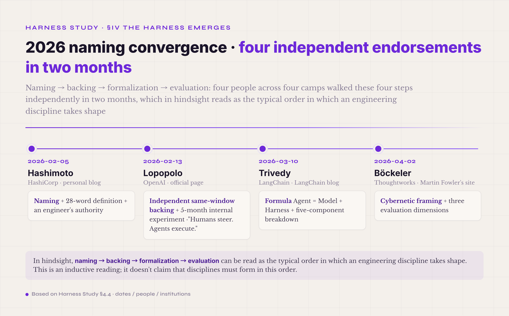
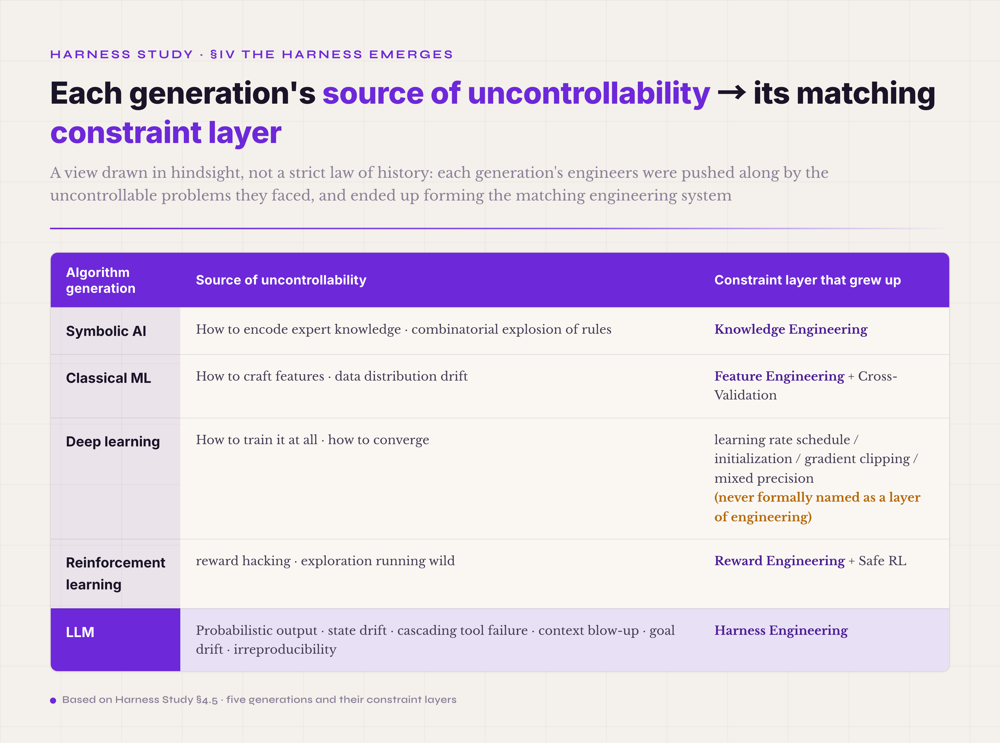

# §IV · The emergence of the harness concept (mid-2023 – 2026)

When the AutoGPT wave failed, it left the field a clear engineering problem: "a stronger model plus a better prompt" is not enough to build a reliable multi-step agent. You need a whole engineering system around the model. But **what that system is called, what parts it has, and who is responsible for what** took about three years to become clear, from mid-2023 to early 2026. This chapter follows that process:

- a misconception to clear up first: harness is not a new word (4.1);
- the six different names the field used in 2023–2025 (4.2);
- two engineering milestones that can't be skipped: function calling and tool use (4.3);
- how, over two months in early 2026, four people filled in the name, the formula, the components, and the cybernetic frame step by step (4.4);
- the harness seen in a cross-generational view of AI history (4.5);
- the rise of engineered agent tools, the distinction between framework and harness, and why the word harness won (4.6–4.8).

### 4.1 · First, clear up a misconception: harness is not a new word

Many people who see "agent harness" for the first time assume harness is a word invented out of thin air in 2026. It isn't. Software engineering has used the word for decades, in at least three mature senses.

**Test harness.** A term that goes back to the early days of unit testing. It wraps the code under test in a shell that prepares the test fixture (test data, mock dependencies, initial state), runs the assertions, does the teardown, and produces a test report. pytest, JUnit, Jest, and cmocka all implement it. A test harness separates "the test code itself" from "the environment that runs the tests," a textbook application of separation of concerns.

**Evaluation harness.** A term machine learning has used for more than a decade. It wraps a model under evaluation together with a set of benchmark tasks that have reference answers, runs them, and outputs comparable metrics (accuracy, F1, BLEU, and so on). EleutherAI's lm-eval-harness, Stanford's HELM, and OpenAI's evals all belong here. Evaluation harnesses existed before the LLM era; it was LLMs that suddenly left the field needing one standard way to measure how strong a model is, and that raised their profile sharply.

**Training harness.** A term common in deep-learning training frameworks. It wraps the training loop (forward pass, backward pass, optimizer step) and supplies the supporting work around it: data loading, mixed precision, distributed synchronization, checkpoint saving, metrics logging. HuggingFace's Trainer, DeepSpeed, and Megatron-LM all implement it, which lets researchers concentrate on the model definition and the loss function.

Put the three side by side and the word's original meaning in software engineering is clear: **wrap a core object (code under test, a model under evaluation, a model being trained), provide the supporting environment it needs to run, and separate "what the core does" from "what running the core requires."** In short: wrap and support.

So what was new in 2026 was not the word but two things:

1. **The agent harness**: applying harness to a new core object, **an LLM running multi-step tasks**. This new core isn't deterministic like code under test, isn't static like a model under evaluation, and doesn't run once like a model being trained. It runs in a mode that is **multi-step, side-effecting, and probabilistic**, and that calls for an entirely new kind of support. When this book says harness, it means the layer of software wrapped around the model that handles context, tools, execution, permissions, and the audit trail. That layer together with the model inside it is what we call an agent (agent = model + harness, taken apart in §I).
2. **Harness engineering**: giving the work on this layer one name as an engineering practice, and spreading it. Test, evaluation, and training harnesses are each tools; nobody says "test harness engineering is a discipline." The agent harness, though, is complex enough to be studied as an engineering practice in its own right, with a cybernetic frame, a breakdown into components, engineering patterns, and evaluation methods. When Hashimoto named this "harness engineering" in February 2026, he took the key step of lifting a tool into an engineering practice.

In other words, 2026 brought **an old word with a new focus**: the word stayed the same, but it was applied to an object more complex than any harness before it. The horse-gear sense of the word is a metaphor it picked up after entering the agent context; 4.8 returns to it.

### 4.2 · 2023–2025: the "doing it without a name" period

Before harness engineering had a name, the field was already doing what we now call the harness, under six different names for the same kind of engineering practice. The practice was happening and the products were running, but nobody could discuss it in one shared vocabulary. The table below lists the six names in time order, with what people were actually doing at the time and what each name left out:

*Figure 4.1 · The 2026 naming convergence: four independent endorsements in two months*

| Stage | Time | Popular term | What was actually being done | The name's blind spot |
|---|---|---|---|---|
| **1. Prompt-as-app** | 2020 – mid-2022 | prompt engineering | agent = one long system prompt + a few in-context examples | assumes the LLM is a function; doesn't handle multiple steps |
| **2. Framework** | 2022.10 – 2023.6 | LangChain / chain / orchestration | agent = an object in a software library | a Chain is a DAG, not a loop, and it doesn't enforce production requirements |
| **3. Autonomous loop** | 2023.3 – 2023.7 | autonomous agent / AGI prototype | agent = give it a goal and it works on its own (the AutoGPT mode, which failed) | no verifier, permission policy, or trajectory, so it was bound to collapse |
| **4. Function calling / Tool use** | 2023.6 – 2024 | function calling / tool use | agent = LLM API + tool schema | covers only the tool contract, not state, errors, or feedback |
| **5. Scaffold / Agent system** | 2024 – 2026.1 | scaffold / agent system / agent infrastructure | agent = model + scaffold | "scaffold" implies temporary support; "agent system" is too vague |
| **6. Context engineering, etc.** | from 2025.6 (context engineering) | *context engineering* / *agentic engineering* | the former is about giving the model the right context (including tools, memory, retrieval); the latter leans toward the workflow of developers collaborating with agents | the former centers on what the model sees, and execution control, permissions, and the audit trail aren't in its name; the latter takes the developer's viewpoint |

Each name caught part of the truth. Prompt-as-app was right that models weren't strong enough yet and that a long prompt plus a few examples really was enough. Framework's credit goes to LangChain, which industrialized "chaining several calls together." Autonomous loop was the first to name autonomy, an agent's core trait. Function calling standardized the interface between the LLM and its tools. Scaffold admitted that "something has to be wrapped around the model." Context engineering pointed out that context management is one of the core hard problems.

Each name also missed something. Prompt-as-app missed multi-step execution. Framework missed production requirements. Autonomous loop missed engineering support. Function calling missed state and feedback. Scaffold implied "take it down once the building is up," which doesn't fit production agents that stay online for the long term. Context engineering centers on what the model sees, and the control and audit trail around each action are not in its name. **Only when Hashimoto used the word harness in February 2026 did a name appear with broad enough coverage to hold the whole engineering practice.**

The representative projects of this period had, to varying degrees, the key components of today's harness (trajectory, tool policy, context management, verifier):

- SWE-agent (Princeton, 2024);
- Claude Code (Anthropic, research preview 2025-02-24, general availability 2025-05-22);
- Codex CLI (OpenAI, 2025-04-16);
- Cursor's Composer (first seen in version 0.37, 2024-07) and agent mode (version 0.43, 2024-11);
- Aider (open source, since 2023).

By this book's observation, their emphases differed. Claude Code went deepest on trajectory and context management, Codex CLI on the tool registry and the sandbox, and SWE-agent contributed most to standardizing the trajectory format. But none of them used the word "harness" at the time. Each used its own terms: agent infrastructure, coding assistant runtime, agent loop, orchestration layer. **Calling all of it a harness is a 2026 summary made in hindsight.**

Knowledge Engineering and MLOps both went through this lag, with practice running ahead of the name; Insight two in 4.5 explains why the lag is necessary. By early 2026 the earlier products (Aider, SWE-agent) had been running for two or three years, and Claude Code and Codex CLI had seen about a year of large-scale use. Enough hard-won experience had built up for a name to hold.

### 4.3 · The key time anchors: function calling and tool use

Two dates in 2023–2025 can't be skipped. At these two points the interface between the LLM and its tools moved up from "prompt plus regex parsing" to a "structured contract." On the surface they were API announcements. In practice they were two leaps in how LLMs are engineered, and they are the precondition for the Tool Registry (ToolRegistry), one of the 8 runtime mechanisms in §V, to exist at all.

**2023-06-13 · OpenAI function calling.** Simon Willison's same-day write-up gave the most compact description:

> "You can now send JSON schema defining one or more functions to GPT 3.5 and GPT-4—those models will then return a blob of JSON describing a function they want you to call."

Before that, getting an LLM to call a tool went like this. The system prompt told the model "you can call `search(query)` or `calculate(expr)`; output in the format `ACTION: tool_name(args)`," the model produced one line of text, and code outside parsed it with a regex. The model might drop a field, add a field, or change the format (`ACTION:` yesterday, `Action:` today). It might also slip a string that looks like an action into its explanatory text and mislead the parser. The failures were hard to spot, too: no exception was raised; instead the parser pulled out a call that looked valid but had bad arguments.

Function calling turned this into a **structured contract**. You give the model a JSON schema (function names, the argument list, each argument's type and description), and the model returns a JSON object it has been specifically fine-tuned to produce against that schema. There are two levels to this leap, and they need to be kept apart:

- **The June 2023 release delivered a contract, not a guarantee.** It relied on fine-tuning, and OpenAI's documentation at the time warned that the model could still generate invalid JSON or hallucinate parameters that don't exist.
- **The hard guarantee arrived only with Structured Outputs (strict mode) in August 2024.** This level switched to constrained decoding: during generation, only tokens that keep the final output schema-compliant may be sampled, and tokens that would violate the schema have their probability forced to zero.

The contract came first and the guarantee more than a year later; 5.3 returns to this thread when it discusses strict and lenient schemas. Even so, the June 2023 step had already brought tool calling into the API's formal interface. Structured validation and regex-free parsing start here.

Its significance was that it freed up attention. Before, half the tricks of prompt writing went into teaching the model to produce parseable text. Afterward, OpenAI handled that on the model side, and engineers could turn to how to design the tool registry, where to put the policy, how to write the verifier, and how to serialize observations. **From then on the field had room to discuss the higher-level problems of agent engineering.**

The official announcement is at https://openai.com/index/function-calling-and-other-api-updates/ , signed by Atty Eleti, Jeff Harris, and Logan Kilpatrick. It also recommended confirming with the user before executing actions with real-world impact (sending an email, posting online, making a purchase). You can read this as an early source of the `requires_confirmation` field in the later tool policy (ToolPolicy): before a tool call runs, it passes a policy check, and the policy decides whether to execute it directly, send it for human approval, or refuse it. This mechanism later became a required part of production harnesses.

**2023-11-21 · Anthropic adds tool use beta to Claude 2.1.** Anthropic did two things that day: Claude 2.1 extended the context window from 100K to 200K tokens, and the tool use beta opened (followed by a public beta in 2024-04 and general availability on 2024-05-30). In Anthropic's words:

> "By popular demand, we've also added tool use, a new beta feature that allows Claude to integrate with users' existing processes, products, and APIs."

One way to read the two landing on the same day: every tool result has to go back into context, and enough calls will blow the window. **Tool use only becomes truly usable once context is greatly expanded.** Tool use and context management are twin problems, and §V splits them into two neighboring mechanisms. 5.3 Tool Registry decides "which tools can be called, and with what arguments"; 5.4 context management decides "how a tool's large output enters context without blowing the window." The two have to be designed together, or progress on one side is canceled out by the limits of the other.

Once the two were connected, by mid-2024 the industry had broadly accepted a simplified formula: **agent = LLM + tool schema + some code wrapped around it.** It admitted that tools are a core component and that the model API needs a structured tool interface, a step beyond "using the model as a function." But nobody could yet say what "some code wrapped around it" was. LangChain? A hand-written Python script? SWE-agent's trajectory framework? Some runtime inside Cursor? Every vendor had its own implementation, with no common name, no common component list, and no common cybernetic frame, so none could be compared precisely with another. That state lasted until February 2026.

### 4.4 · The 2026 naming convergence · four independent endorsements in two months

The key events in naming harness engineering fall between early February and early April 2026. In those two months, four people each wrote a key piece from their own position:

- Hashimoto named it, with the standing of a senior engineer;
- Lopopolo backed it with an internal OpenAI experiment;
- Trivedy, from inside the LangChain framework camp, supplied a formula and a breakdown into components;
- Böckeler, from the Thoughtworks consulting perspective, built a cybernetic framing.

The four came from completely different camps, yet within two months they wrote highly complementary pieces. That isn't plagiarism, and it's hard to call it coincidence either. It looks more like a sign that the field had accumulated enough shared practice and was missing only a common name. The pattern of "two or three years of practice, then two or three months of naming convergence" recurs in IT history; MLOps is one example (4.5). The four are taken below in time order.

#### Hashimoto 2026-02-05 · the naming, with an engineer's authority

**Mitchell Hashimoto** proposed and spread the label "harness engineering" in *My AI Adoption Journey*. He is a co-founder of HashiCorp and the author of Terraform. Terraform isn't a machine-learning or academic tool; it is an infrastructure-definition language for large distributed systems, and for more than a decade Hashimoto's work was about "how large distributed systems get built and operated reliably." When an engineer like that says "I call the engineering practice of working with agents harness engineering," the name carries engineering weight. It isn't a marketing coinage or a paper title. It is a word distilled from practice by someone who has written production systems.

His wording is careful. He describes it as a way of working he "gradually came to call harness engineering," and says he isn't sure whether the industry already has a common term for it. In other words, he **did not claim it was a discipline.** Treating it as an engineering discipline is the later reading of Trivedy, Böckeler, and this book; Hashimoto supplied the starting point of the name.

His core definition runs to just 28 English words:

> "the idea that anytime you find an agent makes a mistake, you take the time to engineer a solution such that the agent never makes that mistake again"

The definition can be read in the cybernetic language of feedforward and feedback (this book borrows several concepts from cybernetics as analogies; §IX develops them):

- **find a mistake** is like a sensor detecting deviation. It requires a verifier, a trajectory, and observation mechanisms in the harness, so that errors become "visible."
- **take the time** is the engineering investment: the fix has to be designed, and that takes dedicated time.
- **engineer a solution** is like adjusting the controller. Instead of editing the prompt and asking the model "not to do it next time," you build a mechanism into the harness layer so this kind of error becomes structurally hard to repeat.
- **the agent never makes that mistake again** is an engineering goal. It does not correspond to a closed-loop convergence guarantee in the cybernetic sense: each fix covers only the class of error already found, new errors will keep appearing, and so the process has to continue.

Note: **Hashimoto's article does not give the most widely circulated formula, "Agent = Model + Harness."** That comes later, from Trivedy.

#### Lopopolo 2026-02-13 · the official backing of a 5-month OpenAI experiment

Eight days later, OpenAI's Ryan Lopopolo (Member of Technical Staff) published *Harness Engineering: leveraging Codex in an agent-first world*. The two pieces appeared almost together. Hashimoto's summarizes personal practice; Lopopolo's is an official OpenAI article written after at least five months of internal experiment. That both settled on the same word in the same window shows the conditions for the word had matured by early 2026.

Lopopolo's tagline condenses the article's argument:

> "Humans steer. Agents execute."

In traditional development, engineers write every line of code by hand. In the way of working Lopopolo describes, engineers **don't write code directly**, and their core work becomes three things:

- **Environment design**: which tools, which sandbox, and which permissions to give the agent;
- **Intent specification**: what prompts, instructions, and specifications make the task clear;
- **Building the feedback loop**: how to evaluate the agent's output, how to run ablations, and how to find the cases where the agent still falls short.

Together, those three are harness engineering: the engineer shifts from "the person at the keyboard" to "the designer of the agent's working environment."

The article describes a five-month internal experiment: starting from an empty repository and using Codex to generate application code, tests, CI, docs, observability, and internal tools. The key point is that **the team spent its effort mainly on tuning the harness around the model, not on tuning the model**: which sandbox, tool set, instructions, and feedback loops to give it. You can read this as OpenAI acknowledging, through an official channel, that the harness layer is more worth optimizing than the model itself.

Working back from the publication date, OpenAI had been doing this internally since around September 2025. Anthropic (Claude Code), Cursor, Replit, and Aider were very likely doing the same kind of work in the same period, just without naming it publicly. That also explains why the naming converged so fast in early 2026: the field had been doing it privately for at least six months to a year.

The article's official URL is https://openai.com/index/harness-engineering/ (some clients get a 403 when fetching it). The author is an engineer, not a researcher, and the channel is OpenAI's official site, not a personal blog. That makes it **OpenAI's official endorsement of Hashimoto's naming.**

#### Trivedy 2026-03-10 · the framework camp's formula and component breakdown

About a month later, **Vivek Trivedy** published *The Anatomy of an Agent Harness* on the LangChain blog. LangChain, released in October 2022, was one of the earliest agent frameworks, and the piece matters for this reason: **the framework camp itself acknowledged that a framework isn't enough, that a harness layer is needed, and that this layer sits above the framework rather than being a subset of it.**

Trivedy gave the formula and the definition most widely cited today:

> "Agent = Model + Harness. If you're not the model, you're the harness."

> "A harness is every piece of code, configuration, and execution logic that isn't the model itself."

§I already unpacked these two lines in its section "A progression of three authoritative definitions": the first is a **split**, the second an **exclusion-based definition**. What needs adding here is that Trivedy also broke the harness into five components. For the first time, "that layer outside the model" became a concrete component list people could discuss:

- **System Prompts**;
- **Tools, Skills, MCPs** (tools, skills, Model Context Protocol integrations);
- **Bundled Infrastructure** (the runtime environment: filesystem, sandbox, browser, and so on);
- **Orchestration Logic** (subagent spawning, handoffs, model routing);
- **Hooks-Middleware** (context compaction, continuation, lint checks).

These five don't map one-to-one onto the 8 runtime mechanisms plus 1 Safety control plane in §V of this book (the Safety control plane is the check layer that every tool call must pass through and cannot bypass; see 5.9). Trivedy's cut is coarser: this book's model adapter, observation surface, and trajectory are implicit in Bundled Infrastructure and Orchestration Logic, and the verifier and Safety are implicit in Hooks-Middleware. But he was **the first to treat the harness as an engineering object that can be broken down into components**, instead of a vague "layer outside the model."

In the three and a half years from LangChain's release in October 2022 to this article, the framework camp moved from "an agent is a chain" to "agent = model + harness, and a framework is just one material for implementing a harness." A conceptual upgrade from inside the framework camp carries more weight than outside academics writing papers about frameworks falling short.

#### Böckeler 2026-04-02 · the consulting world's cybernetic framing

About three weeks later, **Birgitta Böckeler** (a Thoughtworks Distinguished Engineer) published *Harness Engineering for Coding Agent Users* as a guest article on Martin Fowler's website. A consultant sees dozens of companies' engineering practices a year and cares about "how this method gets put into practice in different organizations." Böckeler organized harness engineering into a form that can be explained clearly to clients, completing the move from "what it is" to "how to evaluate and improve it."

She recast Hashimoto's and Trivedy's concepts in cybernetic form:

> harness = **guides (feedforward controls) + sensors (feedback controls)** + humans steering iteratively based on observed failures

The point: **a harness is not a passive code shell but a control system.**

- **Feedforward is the up-front constraint**: rules, docs, tools, prompt instructions, and permission boundaries that set, before the agent acts, what may be done and in what form.
- **Feedback is the after-the-fact check**: tests, lint, AI review, the verifier, and trajectory analysis, which judge after the agent acts whether it got things right, where it went wrong, and whether to retry.
- **Humans** in the loop adjust iteratively based on observed failures, which is the consulting version of Hashimoto's "engineer a solution."

Feedforward and feedback here are analogies borrowed from cybernetics (Böckeler's framing). Their advantage is that engineers who have never read the cybernetics literature can grasp them at once.

She also gave the harness three evaluation dimensions: **maintainability**, whether the harness itself can be maintained over time; **architecture fitness**, whether it fits the existing system; and **behavior**, whether the agent's actual behavior under the constraints matches expectations. With these three dimensions the harness became an engineering object that can be reviewed from outside. Consultants can use them to assess client projects, and engineers to assess their own. Being evaluable is a key marker of an engineering object moving from craft to discipline: without evaluation criteria you can't compare better and worse, and without that you can't form best practices or teach them.

#### What the four independent endorsements mean for engineering history

Lay the four events out in time order:

- **2026-02-05 Hashimoto** (personal blog): the naming, with a 28-word definition;
- **2026-02-13 Lopopolo** (OpenAI official page): a five-month internal experiment, "Humans steer. Agents execute.";
- **2026-03-10 Trivedy** (LangChain blog): the formula Agent = Model + Harness, and a five-component breakdown;
- **2026-04-02 Böckeler** (Martin Fowler's website): the feedforward and feedback frame, and three evaluation dimensions.

In hindsight, you can read these four steps as the typical order in which an engineering discipline takes shape: first a name, then authoritative backing, then formalization, and finally an external evaluation frame. This is an inductive reading. It doesn't claim that disciplines must form in this order.

One more point: **none of the four is an academic researcher.** They are an open-source engineer, an engineer inside a large vendor, an employee of a framework company, and a consultant. MLOps is similar: its founding paper (Sculley et al., NeurIPS 2015) also came from an internal Google engineering team. Harness engineering was pushed forward by engineering practice, not derived from theory. Academic papers (such as AHE[^ahe-2026]) followed with formalization, but practice tends to run ahead of theory, and every "authoritative definition" only counts once it has been verified against production cases.

### 4.5 · The cross-generational view · the harness is not a one-off

Placed in 70 years of AI history, harness engineering is not a one-off. It looks like another repeat of the process every generation of algorithmic paradigm has gone through: practice accumulates, the constraint layer gets a name, and a discipline forms. A caveat first: this is a view drawn in hindsight to help you see where the harness sits, not a strict law of history. In some generations (deep learning's training tricks, for example) the constraint layer was never formally named at all, and forcing everything into a neat "the Nth time" would distort the picture.

#### Three cross-generational insights

**Insight one: every generation's constraint layer answers the same question. What is this generation's "source of uncontrollability"?**

One way to see it: the form an algorithm takes decides what kind of engineering layer has to surround it.

- **Symbolic AI**: the source of uncontrollability was "how to encode expert knowledge, and the combinatorial explosion of rules." The toolset of Knowledge Engineering (rule sets, inference engines, explanation systems) was built to answer exactly these two problems.
- **Classical machine learning**: the source was "how to construct features, and drift in the data distribution," answered by feature engineering and cross-validation.
- **Deep learning**: the source was "how to get training to work at all, and how to converge," which brought learning-rate schedules, initialization tricks, gradient clipping, and mixed-precision training. These were never formally named "Training Engineering," but in practice they formed a complete toolchain.
- **Reinforcement learning**: the source was "reward hacking and runaway exploration," answered by Reward Engineering and Safe RL.

Seen this way, **each generation's engineers were pushed along by the uncontrollable problems they faced, and ended up forming the matching engineering system.**

*Figure 4.2 · Five generations of algorithms, their sources of uncontrollability, and the matching constraint layer*

The LLM generation's sources of uncontrollability were covered in the previous three chapters: probabilistic output from single-step prediction, state drift in multi-step execution, cascading tool-call failures, context-window blowup, goal drift, and irreproducibility. These six are the engineering problems harness engineering has to answer. It's foreseeable that when the next generation of algorithms (say, fully multimodal reasoning agents, or self-evolving research loops) reaches production, new sources of uncontrollability will appear, and the field will coin another "X engineering" to name that generation's constraint layer.

**Insight two: naming always lags practice by several years to more than a decade, and the lag is necessary.**

- **Knowledge Engineering**: the DENDRAL project started in 1965, and Feigenbaum's IJCAI paper discussing knowledge engineering came in 1977, about 12 years later.
- **MLOps**: machine learning entered production at scale in the mid-2010s. The 2015 paper by Sculley et al. identified the problem domain, and in 2017–2018 Google, Uber, LinkedIn, and others published articles on their internal ML platforms. Dedicated textbooks (Hapke & Nelson, *Building Machine Learning Pipelines*, 2020-07) and courses (Andrew Ng's MLOps specialization, 2021-05) appeared several years later.
- **Harness engineering**: from Aider (2023), SWE-agent (2024), and Cursor's Composer and agent mode (from 2024-07), to Claude Code (2025-02) and Codex CLI (2025-04), and then the naming in 2026-02. The earliest practice lagged the name by about three years; the latest by only about a year.

The lag looks like "the industry being slow to react," but it is a form of self-protection. A name only stabilizes once enough practice cases have accumulated; coin it too early and later practice overturns it. Suppose someone in 2021 had made "prompt engineering" the single name for all of LLM engineering. When function calling arrived in 2023, the name couldn't hold tool calling; once trajectory, verifier, and ablation practices matured in 2024, it was far too narrow. Hashimoto proposed harness engineering only in 2026, when the practice of 2024–2025 had already validated the component list of "the layer outside the model," and that is why the name holds.

What this means for you as a reader: **when the next generation of algorithms arrives, don't rush to name its engineering layer.** Wait for the field to run two or three years of production use cases and collect enough cases of what went wrong, and a name will surface from the engineering community on its own. Every so often someone pushes a new "X engineering"; most aren't adopted, precisely because the practice behind them isn't deep enough yet.

**Insight three: the birth of a term is not the birth of the concept, but a term is necessary for a discipline to form.**

DENDRAL was doing what we now call knowledge engineering from 1965, and MYCIN was developed in 1972–1976. Yet only when Feigenbaum published his knowledge-engineering paper at IJCAI in 1977 did this kind of work get a name that could be shared across paper titles, conferences, and textbooks. The 2026 naming of harness engineering repeats the same thing: it gives the practice consensus the field built up over the past few years a name that works in papers, conferences, job requirements, and textbooks.

**Naming marks an engineering field's move from craft to discipline**: without a name, there is no comparing, no teaching, and no common language. That is why Hashimoto's article matters more to engineering history than its length suggests. The field had been doing the practice it described for some time, but the article gave that practice a name. Seen this way, 2026-02-05 is the real starting point of harness engineering. The engineering work before and after that day was no different; before, it was each vendor's craft, and after, it was a shared engineering practice.

#### The harness and MLOps are siblings

Among the earlier constraint layers, harness engineering's closest sibling is **MLOps.** Both arose in the same situation: an algorithmic paradigm built up a few years of production experience, the field found that the algorithm alone wasn't enough and needed a whole engineering layer around it, and that layer got a name.

The two are structurally alike in several respects:

- **Core object**: MLOps manages trained machine-learning models (classifiers, regressors, embedding models); the harness manages LLMs and their multi-step execution.
- **Source of uncontrollability**: MLOps deals with data drift, model decay, and deployment inconsistency; the harness deals with probabilistic output, long-task drift, and tool failure.
- **Founding thesis**: for MLOps, *Hidden Technical Debt in Machine Learning Systems* by Sculley et al. at NeurIPS 2015, which points out that in real machine-learning systems the machine-learning code is only a small part (the paper estimates at most about 5%); for the harness, Trivedy's "Agent = Model + Harness" from March 2026.
- **Naming lag**: MLOps took about five or six years, from the 2015 paper to the dedicated books and courses of 2020–2021; the harness took about one to three years, from the earliest product practice to the 2026 naming.

The most interesting likeness is that **the founding theses share the same structure.** Both say "the algorithm itself is only a small part of the whole, and the rest is an independent engineering practice in its own right." For a constraint-layer discipline to stand, it first has to acknowledge that what it manages sits too far at the margins of existing disciplines. MLOps says "machine-learning code is only a small part"; harness engineering says "the model is only part of the agent."

If it follows MLOps's pace, harness engineering may go through a similar rapid maturation in 2026–2028 after the dense run of events in February–April 2026. That is also the basis for writing this book in mid-2026.

#### But the sibling relationship has a boundary · the fundamental difference between MLOps and the harness

Siblings though they are, the two manage completely different things. This boundary needs to be clear, or people come away thinking "the harness is a subset of MLOps" or "they're the same thing under a new name." Both misreadings came up in discussions in early 2026.

**MLOps mainly handles "what happens after a trained model goes live"**: data versioning, model registry, feature store, A/B testing, model monitoring, drift detection, retraining pipelines, deployment infrastructure. All of this happens before or outside inference calls, and the core problem is "how to keep a trained model working reliably in production over the long term."

**The harness mainly handles "what happens around each inference call"**: the tool registry decides which tools each step can call, context management decides what each step sees, trajectory recording decides what each step leaves behind, the verifier decides how each step is judged right or wrong, and the Safety control plane decides which actions get blocked. The core problem is "how to keep a probabilistic, multi-step, side-effecting agent controllable throughout a task."

The difference comes down to **multi-step execution.** A traditional model takes "one piece of input data, one prediction out," a single inference call. An LLM agent "takes a goal, breaks it into tasks, calls tools, reads the feedback, and revises its decisions until it's done," a continuous multi-step process. That process raises problems MLOps never dealt with: state management, error handling, loop detection, context compaction, trajectory recording, cross-step verification, permission boundaries. Conversely, the harness doesn't deal with data drift or model decay either. It assumes the model weights are fixed (the inference-serving side is responsible for them) and only governs how the inference process uses the model.

So **the harness is not a subset or an extension of MLOps; it is a parallel engineering practice.** The two only share a similar origin (practice first, naming after) and a similar path to taking shape. Seeing it this way avoids two misreadings:

- "We already do MLOps, so we don't need a separate harness": wrong. MLOps governs "how the model stays alive"; the harness governs "how the agent gets work done."
- "The harness is just MLOps for LLMs": also wrong. The harness needs components MLOps doesn't have (trajectory, verifier, tool policy, Safety control plane), while MLOps's core components (feature store, drift detection, A/B testing) are barely used in a harness.

#### A parallel survey of the same period · Code as Agent Harness

While this book was being written, a 42-author survey, *Code as Agent Harness*[^code-as-agent-harness-survey-2026], appeared on arXiv on 2026-05-18. Its topic overlaps heavily with this book's, and the timing is only two days apart. It can be read as a sign that, after the naming converged in the first half of 2026, the field turned to systematic stocktaking.

The survey splits the harness into three layers: interface (how code connects reasoning, action, and environment modeling), mechanisms (planning, memory, tool use, feedback control), and scaling (from single-agent to multi-agent). Its abstract lists six open challenges: evaluation that looks beyond final task success; verification when feedback is incomplete; improving the harness without introducing regressions; keeping shared state consistent across multiple agents; preserving human oversight in safety-critical settings; and extending to multimodal settings. (Its §5.2 develops a seventh, "Toward a Science of Harness Engineering," a meta-level direction different in kind from the first six.)

These six challenges correspond closely to this book's main thread:

- the parts of §V on the verifier's three layers, leakage defense, and Artifact Claim Mismatch answer "evaluation" and "verification under incomplete feedback";
- the observe, score, ablate, tune, iterate loop of the Harness Lab in §VII (this book's name for the outer workbench that improves a harness iteratively through evaluation, ablation, and tuning) corresponds to "improvement without regression";
- the Safety control plane corresponds to "human oversight";
- the parts on composability and fork-join correspond to "shared-state consistency across agents."

The two works come at the subject from complementary angles. **The survey starts from "code as the agent's execution substrate,"** stressing code as the unified interface for agent reasoning, action, environment modeling, and verification. **This book starts from "the engineering layer outside the model,"** follows Trivedy's formula, and divides that outer layer into 8 runtime mechanisms, 1 Safety control plane, engineering patterns, and a workbench, stressing that each mechanism can be discussed on its own. The survey's three layers cover most of what this book's 8 runtime mechanisms cover; the survey leans conceptual, this book operational. After you finish this book, the survey is recommended reading, both as independent confirmation from the same period and as a complement from the academic side.

### 4.6 · LangGraph and the rise of "engineered agent tools"

While the naming converged, engineered agent tools were evolving together, and they are the material harness engineering took shape from. The name could stabilize in early 2026 because, over 2024–2025, a group of products from different camps had validated in practice what form a harness should take.

#### LangGraph's evolutionary path

When LangChain was released in October 2022 it was a Chain (DAG) framework. By 2023–2024 the field broadly found that Chains weren't enough: agents need loops, state, and the ability to resume after an interruption. So in 2024 the LangChain team released the **LangGraph library**, which lets developers draw the agent's state machine explicitly, acknowledging that an agent is a stateful looping process, not a stateless one-way pipeline. A framework camp admitting its core abstraction fell short and upgrading on its own initiative is the mark of a mature engineering organization. It also exposed the framework's fundamental limit: every abstraction is advisory. You can write a state machine with LangGraph, or not.

On 2025-05-14 LangChain shipped **LangGraph Platform GA**, a managed runtime offering production deployment, monitoring, debugging, and scaling. That showed the team judged the abstraction stable enough to sell as an infrastructure service. In October 2025 came **LangGraph v1.0**, a commitment to API stability. Within a year and a half, the agent state machine went from an experimental new abstraction to an industrial-grade production component.

But **LangGraph is still a framework, not a harness.** It provides the ability to draw a state machine and a runtime to run it, but it doesn't enforce production requirements such as "there must be a trajectory, a verifier, and a tool policy." You can write an agent with no verifier at all, or run it in production without recording a trajectory, and it won't stop you. That is why Trivedy drew the line between the two so clearly. LangGraph can serve as the implementation base of a harness, but it only counts as a harness once engineers stack a layer of enforced constraints on top.

#### Representative cross-camp products

In the same period, a group of representative products from different camps matured in quick succession:

- **Anthropic's Claude Code**: launched as a research preview with Claude 3.7 Sonnet on 2025-02-24 and made generally available with Claude 4 on 2025-05-22, as a command-line tool.
- **OpenAI's Codex CLI**: released on 2025-04-16 alongside o3 and o4-mini, with open-source code.
- **Cursor's Composer**: first appeared as a beta feature in version 0.37 (2024-07), and version 0.43 (2024-11) added agent mode. It is built into the IDE and can route across multiple models.
- **Aider**: an open-source command-line tool since 2023, iterated by its community.

They had, **to varying degrees,** the key traits a harness covers today; exactly how far each went has to be checked against each vendor's public docs and open-source code. Their shared traits come down to four:

**First, tools are a controlled resource**: permission policies, argument validation, and audit logs mean the model can't call a tool just because it wants to. Claude Code has layered permission rules (deny, ask, allow) and a hook system for injecting policy; Codex CLI has a sandbox and approval policies. Every time the model issues a tool call, a body of code independent of the model decides whether it should run, with what arguments, and how to record it afterward.

**Second, state is an explicit resource**: trajectory files, session memory, context budgets. Claude Code uses a JSONL trajectory, one event per line; Codex CLI uses rollout files. Both turn "what the agent did" into actual files that can be read, diffed, and replayed from outside. State becomes an engineering object with a schema and a lifecycle, rather than implicit memory inside a process.

**Third, failure is a normal operating state**: retry, rollback, the verifier, and ablation are routine engineering actions rather than exception handling. These products have dedicated designs for tool failure, model hallucination, and loop detection. They assume "any step can fail" and build every mechanism around that assumption.

**Fourth, review is executable**: the trajectory is a machine-readable event stream, not a log for people to read. This is one of the biggest differences between a harness and a framework. What a framework produces can usually only be read as logs, with no view of why the agent decided what it did at the time. What a harness produces can be replayed to any step, any two runs can be diffed against each other, and ablation can show each mechanism's contribution.

Together, these four traits are the engineering object harness engineering referred to when it was named. **By the time Hashimoto named it, the earliest of this practice had been running for two or three years (Aider since 2023), and Claude Code and Codex CLI for about a year.** Their code already had trajectory, tool policy, verification, and similar mechanisms, just without a common name. Naming turned something that already existed into a concept people could discuss, as Insight three in 4.5 says.

### 4.7 · The fundamental distinction between framework and harness

Next, **the distinction between framework and harness** has to be made clear, because everything later in this book rests on it. If you can't tell the two words apart, you'll treat "we use LangGraph" and "we built a harness" as the same thing.

#### What the two words point to

**A framework is a development library.** LangChain, LlamaIndex, Pydantic AI, Mastra, and the Vercel AI SDK are frameworks. A framework gives you APIs, abstractions, and convenience components so you can write agents faster, but it **doesn't enforce production requirements.** With LangChain you can write an AutoGPT-style toy that collapses after 10 steps, or a production-grade agent. A framework assumes its users know when to add a verifier and when to record a trajectory, so what it gives is capability, not constraint.

**A harness is an engineering system.** Claude Code, Codex CLI, Cursor, and Aider (at varying levels of maturity) are harnesses. A harness turns some production requirements into default behavior: trajectory, permission policy, and similar mechanisms are built in by default, while some practices (the verifier, for instance) still have to be configured by the user. It assumes users will forget to record the trajectory and will bypass the permission policy, so it makes these "should do but easy to forget" things conventions that are on by default. The two aren't mutually exclusive either: **a framework can be material for implementing a harness.** Building a harness with LangGraph is entirely feasible; what matters is whether this layer of default constraints is stacked on top.

The fundamental difference is **their attitude toward production requirements.** A framework is permissive: it lets users decide how far to constrain things. A harness is prescriptive: it requires users to follow its built-in constraints. The prescriptive approach is more reliable in production, because it removes at the source errors that shouldn't happen, like "forgot to add it." The cost is lost flexibility: when you want a quick experiment that skips permission confirmation, the default constraints get in the way. So frameworks suit experiments and prototypes, and harnesses suit production and long-term maintenance.

#### The DOS vs Linux analogy

An early personal computer could run DOS or Linux. Both used the same CPU, but their software ecosystems were completely different.

**DOS stands for the framework approach.** It lets programs access hardware directly: reading and writing disk sectors while bypassing the file system is allowed, and so is writing straight to video memory. It doesn't require "access data through the file system" or "isolate processes"; it just provides the interface. Writing small tools on DOS is very convenient: a .com file with a few dozen lines of assembly runs and starts fast. But running a server on it is a disaster. A bug in any program can corrupt the whole system, programs can read and write all of memory, there is no user or permission isolation, and nothing recovers automatically after a crash. This is the same kind of failure mode as AutoGPT on a long task: the environment is too free, so errors are everywhere.

**Linux stands for the harness approach.** It **enforces** process isolation (you can't read another process's memory without the corresponding permission) and a permission model (reading /etc/shadow requires the right permission), and reading or writing a disk device directly also requires permission. Every program runs in its own process and protected address space, which adds some restrictions and overhead when writing small tools. For running servers, though, this is what keeps the system alive: one bug doesn't corrupt the whole system, one crashed process doesn't take the others down, and malicious programs can't easily get root. Linux is far more reliable for production servers. The reason isn't a faster CPU or a smarter kernel; it's that Linux builds the constraints a production environment needs into the kernel.

**AutoGPT is like a toy on DOS; Claude Code is like a service on Linux.** Both use the same generation of models, but the engineering constraints of their runtime environments are completely different. AutoGPT runs in an environment with no trajectory, permission policy, or verification, so nothing stopped the five failures described in §III. Claude Code runs in a harness that makes these default mechanisms, so the same generation of models can reliably finish real engineering tasks that take long chains of tool calls.

The limits of the analogy: an operating system is runtime infrastructure for applications, while frameworks and harnesses are runtime infrastructure for agents, and the two don't correspond fully. The analogy borrows only one dimension, how strictly constraints are enforced. Other dimensions don't map one-to-one, but this one is enough to make the difference clear.

#### How an engineer should choose

- **For a PoC or internal demo**: starting with a framework is reasonable. LangChain plus some hand-written Python can produce a demo in a week, with flexibility, a quick start, and plenty of community resources. One-off, experimental, error-tolerant work is exactly where a framework fits best.
- **For production**: you need a harness. Either write your own and make production requirements default constraints (the path Claude Code and Codex CLI took), or run your business logic on a mature harness.

The middle road ("use a framework and add some constraints ourselves") often fails. With no enforced convention, engineers under schedule pressure skip the verifier, the trajectory, and the permission policy, and by the time something breaks it's too late to add them. In the author's experience, projects like this kept appearing in 2024–2025, and they ended one of two ways: cut the custom layer and switch to an off-the-shelf harness, or thicken the custom layer until it became a harness of its own.

The core point: **a production agent system's reliability can't rest on engineers' diligence; it has to rest on enforcement by the engineering system.** People get tired, rush deadlines, and compromise under pressure. An engineering system makes what should be done the default, so skipping it takes a deliberate choice to turn it off. The word harness builds enforcement into the concept. It is called a harness, not a tool kit or a helper library, precisely because its essence is constraining an object that has autonomy, and a constraint only means something if it is enforced. Horse gear that lets the horse slip its reins at any moment is only decoration. Likewise, an engineering layer that lets the agent bypass permission checks at any moment doesn't count as a harness; it's just a framework.

### 4.8 · Why the word harness won

Why did the field choose "harness" over the already popular framework, scaffold, agent system, context engineering, and agentic engineering? This book's view is that it comes down to how accurate the metaphor is. For an engineering term to be widely adopted, its metaphor has to capture **the core difference between this thing and similar things.** The sections below look first at the blind spots of the five candidates, then at why the harness metaphor fits.

#### The metaphor blind spot of "framework"

Framework is a long-familiar word in software engineering (Spring, React, Django). The relationship it implies is **the developer is active and the framework is passive**: the framework provides APIs and abstractions, and runtime behavior is decided entirely by the developer's code.

Once an agent is running, that relationship is **reversed.** The agent is the active party, and the engineering system has to watch its every step, intervene when it's about to overstep, and stop it when it goes off course. The word framework implies nothing of this continuous watching and intervention. LangChain can be called a framework precisely because what it provides at the agent-runtime layer is a passive API.

#### The metaphor blind spot of "scaffold"

In construction, a scaffold is **temporary support**, taken down once the building is up. The word scaffolding also has uses in child cognitive development, pedagogy, and reinforcement learning. In agent-evaluation research such as SWE-bench and METR, scaffold is still commonly used for the software wrapped around the model, close in meaning to harness.

As the name for a whole engineering practice, though, its implication of temporariness doesn't fit how production agents work. The engineering layer around an agent has to last as long as the agent is in use, and the more mature the agent system, the more complex and tight that layer becomes. Since its release, Claude Code has kept adding hooks and permission policies, with no sign of "taking down the scaffold." Using a word that implies "will be taken down" for an engineering layer that won't be is a mismatch of metaphor.

#### The metaphor blind spot of "agent system" / "agent infrastructure"

These two words are too broad. In IT, "system" can mean an operating system, a distributed system, a database system, or a recommendation system, and "infrastructure" is just as broad. When you say "agent system," the listener might picture the Python process the agent runs in, the tool set it uses, the k8s cluster it's deployed to, or the database it connects to.

The power of an engineering term is that **every engineer pictures the same concrete thing.** "Verifier" is the code that judges whether agent output is right; "trajectory" is the event-stream file of the agent's every action and feedback. "Agent system" can mean anything from a single script to a company's entire AI platform, so it can't support precise discussion.

#### The blind spots of context engineering and agentic engineering

Two related terms caught on in 2025, and neither won.

**"Context engineering"**: popularized in June 2025 by a post from Shopify's Tobi Lütke, which Karpathy then seconded. It is about giving the model the right context, and its scope is not narrow: tools, memory, and retrieval all fall within it. Its blind spot is where its weight falls. It answers "what does the model see at each step." A harness also has to manage what happens after the model sees it: permission checks before an action runs, verification after it runs, the audit trail and review across the whole process, and ablation to measure each mechanism's contribution. Context engineering is a very important aspect of harness engineering, but if it names the whole engineering layer, execution control, half of the job, is left uncovered.

**"Agentic engineering"**: Karpathy and others have also used this term, mostly for how people collaborate with agents to write code. That is a **developer's viewpoint**, not an **agent-engineering-component viewpoint.** "Agentic" stresses the agent's autonomy, while engineering components describe the layer wrapped around the agent, and the term mixes the two levels. When two engineers discuss "how to do agentic engineering," one may be talking about development workflow and the other about verifier design, each thinking they're discussing the same thing.

#### The metaphor precision of "harness"

As 4.1 explained, the word's original meaning in software engineering is wrap and support. In the agent context it picked up an extra metaphor from its everyday meaning: **the gear put on a horse.** That metaphor fits well in three respects, and each is one the other candidates don't cover.

**First, it constrains an object that has autonomy.** A horse bolts, spooks, ignores commands, and takes its own detours. An LLM has a probabilistic "autonomy" of its own: the same prompt run twice may give two answers, the model may pick the wrong tool at some step, and it may "forget" what it did earlier. None of the other candidates implies that the constrained object has autonomy. Framework implies a passive framework, scaffold a static support, infrastructure a passively available base; context engineering focuses on the information given to the model, and agentic engineering puts the viewpoint on the developer's side. Only harness implies that **the constrained party has a temper of its own.** Many engineers who have built production agents share the feeling: working with an agent is more like training a horse than writing a React component.

**Second, the constraining gear is a full set, not a single piece.** A set of horse gear is made of parts that work together: reins, bit, saddle, stirrups, halter, blinkers, and so on. That resembles the structure of an agent harness, where several mechanisms work together. Framework implies "one library," scaffold "a set of temporary poles," infrastructure "one base layer." Harness implies "a set of tools whose parts work together," which matches the structure of the 8 runtime mechanisms plus 1 Safety control plane in §V.

**Third, training is a continuous process, not a one-off event.** A horse trainer works with the horse every day, adjusting the buckles to its temper and the rein pressure to the weather, and adding or removing parts as training progresses. That continuous adjustment based on feedback is the core of Hashimoto's definition: whenever you find the agent making a mistake, take the time to engineer a solution. Harness implies **a long-term working relationship between engineer and agent.** Framework is "a library brought in once," scaffold "poles taken down after use," and infrastructure "built and left in place."

Hashimoto's instinct in choosing the word was right: in one word it names the core tension of LLM engineering, **probabilistic versus controllable.** Engineers don't want to eliminate the model's "autonomy" (eliminate it and you're back to the pure function of the GPT-3 era). They want to constrain it within a controllable range, just as a horse trainer doesn't turn the horse into a machine but shapes its autonomy into a form that can be ridden.

#### The boundary of the metaphor

An LLM is not really a horse. **A horse is a conscious living creature**, with emotions, memory, and the ability to learn. **An LLM is a probabilistic function**, with no consciousness, no memory across calls (unless the harness stores it), and no ability to learn on its own (unless fine-tuned). A horse gets better by itself: calmer with age, more cooperative with more training. A model doesn't: the same GPT-4 after a year of use is still the same GPT-4, and the mistake it makes today it will make again tomorrow, unless the harness layer has built in a fix.

That is why Hashimoto's definition matters so much for the harness: it points at **the biggest difference** between an LLM and a horse. A horse learns by itself and an LLM doesn't, so the harness has to build the fix for every error into the environment on the model's behalf. It is also why the horse-gear metaphor, imperfect as it is, still fits best: the other candidates don't even make clear what the constrained object is like, let alone that "the way of constraining it must be built into the environment layer."

#### The cross-generational sibling of the naming

4.5 already placed the harness within the cross-generational pattern of AI history: each generation of algorithmic paradigm needs a new "X engineering" to name its constraint layer, and the name stabilizes only after lagging the practice by several years. Harness engineering is the most recent case. It answers probabilistic output, long-task drift, tool failure, and a model that can't teach itself and so needs fixes built into the environment layer.

The word harness won in early 2026 for three reasons. Its metaphor captures the core tension of LLM engineering (probabilistic versus controllable). It appeared at a moment when the field had accumulated enough shared practice. And four people from different camps endorsed it one after another within two months (4.4). With those three together, harness engineering took formal shape as an engineering practice.

---

## Footnotes

[^ahe-2026]: Agentic Harness Engineering: Observability-Driven Automatic Evolution of Coding-Agent Harnesses · arxiv 2604.25850 · Fudan + Peking University + Qiji Zhifeng (11 authors) · preprint · 2026
[^code-as-agent-harness-survey-2026]: Code as Agent Harness · arxiv 2605.18747 · UIUC + Meta + Stanford (42 authors · first author Xuying Ning) · preprint · 2026-05-18
