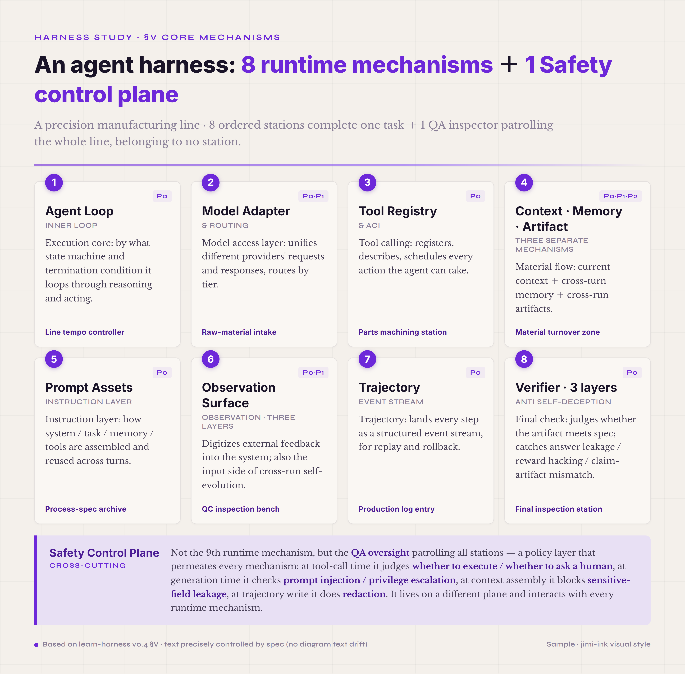
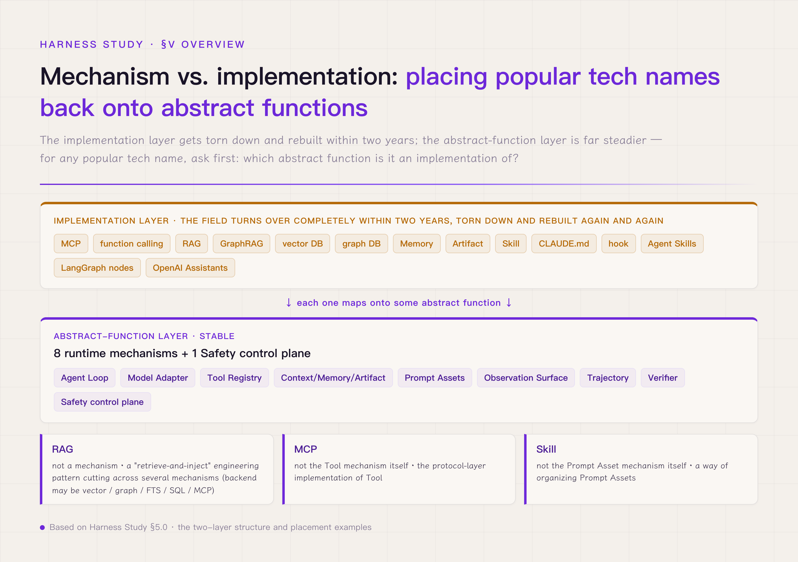

# §V · Eight runtime mechanisms + Safety control plane + end-to-end examples

#### ★ Two words that run through the whole book: run and turn ★

`run` and `turn` are about to appear on nearly every page, so pin them down now. They are a pair, one nested inside the other, and confusing them will make the later material on state management and self-evolution impossible to follow.

- **turn** — one reasoning round of the agent: a single thought → action → observation (one model inference, the tool call it triggers, and the observation that comes back). A round where the model only thinks and calls no tool still counts as a turn.
- **run** — one complete execution of a task, from receiving the task to producing the result, usually spanning several turns along the way.

The relation is simple: **a run is made of many turns.** Later, "across turns" means across rounds within one task — memory kept across turns, say — and "across runs" means between separate executions of a task — artifacts and self-evolution that carry across runs.

§I through §IV worked at the conceptual layer of the word harness: what a harness is, how it went from nameless to named, what separates it from a framework in engineering discipline, why it stands as a sibling to MLOps. This section steps down one level, into the engineering layer — what mechanisms a concrete harness is actually built from, what specific problem each one solves, how they cooperate, and what each one's engineering priority is. **This section is what you actually have to build when you design a harness.** By the end you should be able to picture it concretely: a production agent running one task, from the model issuing a request, to a tool being called, to the result returning to context, to the output being verified, to the event stream landing on disk as a trajectory, to the next decision being made — and see which mechanisms are cooperating, in what order, behind all of it. A reader who stops at §IV is left at "harness is a good concept." Whether the concept can be built, how many modules it takes, what each module costs — those are the questions §V answers.

There is no settled count for how many mechanisms make up a harness. Different engineering teams put the number anywhere from three to nine, and the spread is not a sign of a confused field. It is the honest result of different starting points — looking at a harness through its governance purpose, through its engineering components, or through its technology stack naturally yields different groupings. **Augment Code cuts it into three layers** — Constraint, Feedback Loops, Quality Gates. Constraint answers "what may and may not the agent do." Feedback Loops answers "how does the agent know whether it did the right thing." Quality Gates answers "when is the output allowed to leave the agent." This cut starts from governance purpose; it is high in abstraction and broad in reach. Its weakness is that each layer still has to be split into several concrete mechanisms before you can build it, so it does not map onto code modules directly. **Vivek Trivedy cuts it into five** — System Prompts, Tools, Bundled Infrastructure, Orchestration, Hooks & Middleware. Each one maps onto a module you can find in a harness codebase. This cut starts from engineering components; an engineer can build straight from it. Its weakness is that Bundled Infrastructure is a junk drawer — context management, cross-turn memory state, cross-run artifacts, and more are all stuffed inside, when each deserves its own line — so the grain is uneven. **Finer cuts run from the technology stack out to seven or nine items** — model interface, tool registry, context manager, planning, execution, memory, feedback, safety, orchestration, each engineering mechanism set down on its own (arxiv 2605.18747, *Code as Agent Harness*, lists nine core components). This cut is clean and item-for-item with the code. Its weakness is that the count runs high enough to be hard to hold in mind, and the relations among the items stay hidden — the reader finishes the list and still has to work out for themselves how the items cooperate.

This tutorial settles on **eight runtime mechanisms + one cross-cutting Safety control plane**, because that cut satisfies three engineering constraints at once. **First, the count sits at the ceiling of what the mind can hold.** Fewer than six is too abstract — each one still needs splitting. More than ten is a heavy load, and the relations among items turn to mush. The short-term working memory of the human mind holds 7±2 items; eight or nine sits right near that limit — a reader can remember every name and build the cooperation diagram in their head. **Second, each mechanism maps onto a code module.** Agent Loop, Model Adapter, Tool Registry, Verifier — every one of these names a concrete directory or file you can find in a mature harness codebase, not an abstract concept. Set that against Augment Code's three-layer cut: three layers suit a strategy discussion (explaining harness governance to a CTO), eight mechanisms suit the build (the directory layout an engineer codes against). **Third, the control plane and the runtime mechanisms are split into explicit layers.** This is the key difference between the 8+1 cut and every other one, and the engineering claim that only this cut makes. Safety is not laid flat as a ninth runtime mechanism; it is pulled out into its own "control plane," handled on a different layer from the other eight.

Why must Safety be its own control plane instead of a flat ninth runtime mechanism? Because its engineering nature is a **cross-cutting concern** — not one discrete step inside a single turn, but a policy layer that runs through every runtime mechanism. When a tool call is issued, Safety is deciding "should this run / does it need human review / should it be blocked." When the model generates a response, Safety is checking "is there a prompt-injection risk in the output / is there an over-privileged request." When context is assembled, Safety is deciding "is a sensitive field leaking into the model." When a trajectory is written, Safety is deciding "is there a field in the event stream that needs redaction." It is not a station inside the turn; it is the supervisory layer that patrols every station. Lay Safety flat as a ninth runtime mechanism and you bury this nature — the reader comes away thinking "Safety is something you do at one step," when in truth it is something you do at every step. Pinning down the 8+1 layering is what lets the reader see, structurally, that Safety is not a peer of the other eight. It sits on another layer, and it touches every runtime mechanism.

The structure becomes easy to hold with one concrete industrial picture — a precision manufacturing line. **The eight runtime mechanisms are eight ordered workstations.** Model Adapter is the raw-material intake (receiving the model's response); Agent Loop is the line's rhythm controller (deciding what to do next); Tool Registry is the tool-call station (machining the parts); Context / Memory / Artifact is the material-turnaround area (joining this batch's parts to the long-term stock); Prompt Assets is the process-spec archive (the standard each station works to); Observation Surface is the QC bench (digitizing outside feedback into the system); Trajectory is the production-log station (recording every operation to the electronic file); Verifier is the final-inspection station (judging whether the output meets spec). Each station has a clear spec, a defined input and output shape, and an upstream-downstream protocol — and they cooperate in order to finish one task. **The one Safety control plane is not a station on the line but the QA supervisor.** He does no machining at any station; he patrols them all and judges each step against an independent standard. At intake he checks for prompt-injection contamination; at the tool call he checks whether the arguments touch a forbidden zone; at context assembly he checks whether sensitive data crossed a privilege line; at trajectory write he checks whether redaction followed the rule. His work runs the length of the line, but he belongs to no station — which is why it is called a "control plane," a layer apart from the runtime mechanisms.

*Figure 5.1 · Mechanism overview: eight runtime mechanisms and one Safety control plane*

The edge of the analogy is worth marking. In OS engineering, "control plane vs. data plane" is a mature layered abstraction — Kubernetes makes it explicit as an etcd + kubelet architecture, SDN makes it explicit as a controller + switch architecture. Designing Safety as a control plane is that same split carried into agent engineering. But the harness control plane is not perfectly isomorphic to the OS one. The OS control plane is a separate process (kubelet, controller) that talks to the data plane over RPC; the harness Safety control plane is an embedded hook — each runtime mechanism fires a Safety decision synchronously at its critical points — over a synchronous call, not RPC. What the analogy borrows is the layering idea, that supervision and machining belong on different abstraction layers; it does not borrow the implementation detail. In a harness, Safety needs no separate process, but it does need its own policy layer, its own event hooks, its own observability panel.

§5.1 through §5.9 below describe each mechanism in full, along this structure. Each one is laid out under four headings — **what specific problem it solves** (its role in the harness / what breaks without it / why the alternatives fall short), **the shape of its core interface** (what API it exposes / what data it takes in / what data it puts out / how it hands off to its neighbors), **the key design tradeoffs** (the forks in the road when you design it / which scenario each fork suits / which way the field leans / the engineering reason for that lean), and **the public citation** (how the mechanism is built in an open-source harness / where the primary reference is). Each one also carries a **P0 / P1 / P2 priority label.** P0 is mandatory for the MVP — without it the harness will not run, or it runs but cannot be trusted. P1 is the run-up to production — skipping it carries a failure risk but is fine for a PoC, and it must be filled in before you ship. P2 is the data loop — skip it and you still run, you just do not get the optimization feedback, and its value only shows at scale. These priorities help you judge, by engineering stage, which mechanisms to invest in now: build the P0s for a PoC, add the P1s before production, do the P2s once you scale. Read against your own project's stage and pick the mechanisms at the matching priority — there is no need to read them all at once.

#### ★ Mechanism vs. implementation — build this mental model before reading §V ★

The eight runtime mechanisms + one Safety control plane that §5.1 through §5.9 describe **are all abstract functions, not specific technologies.** Every popular name you can hear online — MCP, function calling, RAG, GraphRAG, vector DB, graph DB, Memory, Artifact, Skill, CLAUDE.md, hook, the Agent Skills open standard, LangGraph nodes, OpenAI Assistants — **is the concrete implementation of some abstract function.**

*Figure 5.2 · Mechanism vs. implementation: the stable layer of abstract functions and the volatile layer of implementations*

The field turns over completely within two years. The implementation layer gets torn down and rebuilt again and again; the abstract-function layer is far steadier. When you meet any popular technology name, ask one question first: **"which abstract function is it an implementation of, and which of that function's jobs does it do?"** Do not let the industry's familiar comparison tables — "RAG vs. Memory, pick one / MCP vs. function calling / Skill vs. CLAUDE.md" — throw you off. These are **implementation-layer side-by-sides.** The tables are not wrong, but they compare at the implementation layer; they answer "which stack do I build with," not "which abstract functions make up a harness." Read the two layers as one and you get lost.

Take the most common confusion of all. Several industry sources line RAG and Memory up as two parallel items, "complementary, not substitutable." At the implementation layer the claim holds — RAG is a stateless retrieval pipeline, Memory is stateful persistence governance — but at the mechanism layer it is a category error. **RAG is not a mechanism at all; it is a "retrieve-and-inject" engineering pattern that cuts across several mechanisms,** and it holds whether the backend is vector, graph, FTS, SQL, or an MCP server. By the same token, MCP is not the Tool mechanism itself but its protocol-layer implementation; Skill is not the Prompt Asset mechanism itself but a way of organizing it.

§5.1 through §5.11 in this introductory volume are all about the abstract-function layer. Where specific industry products fit is placed in an "industry placement card" at the end of each mechanism's chapter, plus appendix §D, "the mechanism × industry product placement map," in §99. After reading §V in full, you should be able to take any new framework — LangGraph, CrewAI, Anthropic Agent Skills, OpenAI Assistants — and tell at a glance which of the eight mechanisms it covers and which it leaves out. That is the core skill this introductory volume is meant to give you.
