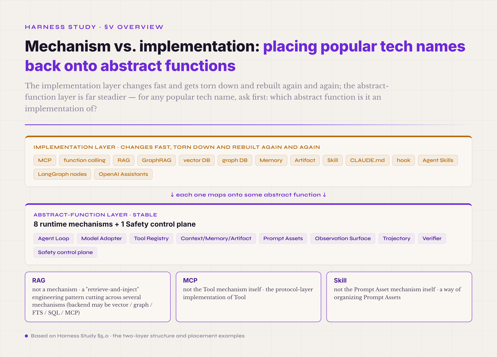

# §V · Harness essential mechanisms · eight runtime mechanisms plus one Safety control plane

#### ★ Two words that run through the whole book: run and turn ★

`run` and `turn` will come up again and again from here on, so let's define them first. They form a **hierarchy**, one nested inside the other. Mix them up and the later material on state management and self-evolution becomes hard to follow.

- **turn**: one model call, plus the tool execution it triggers. The model reads the context and replies. If the reply contains tool calls, the harness executes the tools and records the results (the observations), and that makes one turn. A call in which the model only thinks and calls no tool also counts as one turn. This matches the way `max_turns` is counted in the OpenAI Agents SDK and the Claude Agent SDK.
- **run**: the whole course of one task, from its start to a terminal state (completed, failed, or canceled). A run usually contains several turns.

The relation is that **a run is made of many turns**. One more unit in common use sits between the two, the "exchange": it starts with one user message and ends when the model gives its final reply, and one exchange contains several turns. Later in the book, "across turns" means across several turns within one task (memory kept across turns, for example), and "across runs" means between separate executions of a task (artifacts and self-evolution carry across runs).

§I through §IV covered the conceptual layer of the word harness: what a harness is, how it went from nameless to named, what fundamentally separates it from a framework in engineering governance, and why it stands as a sibling to MLOps. This section steps down one level, into the engineering layer, and answers four questions:

- what mechanisms make up a concrete harness when you implement it;
- what specific problem each mechanism solves;
- how the mechanisms cooperate;
- what each one's engineering priority is.

**This section is what you actually have to implement when you design a harness.** By the end you should be able to picture it concretely. A production agent runs one task: the model issues a request, a tool gets called, the result returns to context, the output is verified, the event stream lands on disk as a trajectory, and the next turn's decision gets made. You should be able to see which mechanisms cooperate behind all of this, and in what order. A reader who stops at §IV is left at "harness is a good concept." Whether the concept can be implemented, how many modules that takes, and how much each module costs are the questions §V has to answer.

The field has no settled answer to "how many mechanisms make up a harness." The lists that different engineering teams give run from 3 items to 9. The disagreement does not mean the field is confused. It is a reasonable difference that comes from different angles of approach: look at a harness through its governance purpose, its engineering components, or its technology stack, and you naturally get different sets of mechanisms.

- **Augment Code cuts it into 3 layers**: Constraint, Feedback Loops, and Quality Gates. Constraint answers "what may the agent do, and what may it not." Feedback Loops answers "how does the agent know whether it is doing things right." Quality Gates answers "when is the output allowed to leave the agent." This cut starts from governance purpose, so it is highly abstract and sums things up well. But it does not map onto code modules directly: each layer still has to be split into several concrete mechanisms before you can implement it.
- **Vivek Trivedy cuts it into 5 items**: System Prompts, Tools, Bundled Infrastructure, Orchestration, and Hooks & Middleware. Each item maps directly onto a module you can find in a harness codebase. This cut starts from engineering components, and an engineer can build straight from it. Its weakness is uneven grain. Bundled Infrastructure reads like a catch-all: it holds several mechanisms that should each have their own line, such as context management, cross-turn memory state, and cross-run artifacts.
- **Finer cuts start from the concrete technology stack and run to 6 to 9 items** (see the comparison table in Appendix D.2, which includes sources that divide it into nine items). They list each engineering mechanism on its own: model interface, tool registry, context manager, planning, execution, memory, feedback, safety, orchestration, and so on. The list is clear, and every item maps to code. Its weakness is that the items are many and the relations among them stay hidden. After reading the list, the reader still has to work hard to figure out how the items cooperate.

The survey *Code as Agent Harness*, introduced in §IV, cuts it yet another way, into three layers: interface, mechanisms, and scaling.

This tutorial adopts the cut of **eight runtime mechanisms + one cross-cutting Safety control plane**, because it satisfies three engineering constraints at once.

1. **The count is moderate.** Eight is a compromise between "each one maps to a code module" and "not too fragmented." Cut coarser, and each item still has to be split further. Cut finer, and the relations among the items become hard to see.
2. **Each one maps directly onto a code module.** Agent Loop, Model Adapter, Tool Registry, Verifier: behind each of these names is a concrete directory or file you can find in a mature harness codebase, not an abstract concept. Set that against Augment Code's abstract three-layer cut. Three layers suit a strategy discussion (explaining the thinking behind harness governance to a CTO). Eight mechanisms suit engineering implementation (laying out the directories when an engineer writes the code).
3. **The "control plane" and the "runtime mechanisms" are split into explicit layers.** This is the key difference between the 8+1 cut and the others, and it is this book's engineering claim. Safety is not laid flat as a ninth runtime mechanism. It is pulled out as a separate "control plane" and handled on a different layer from the other eight mechanisms. Here "control plane" means a layer of checks that every tool call must pass through and that cannot be bypassed. The source of the term and the limits of the borrowing are explained below.

Why give Safety its own control plane instead of laying it flat as a ninth runtime mechanism? Because in engineering terms Safety is a **cross-cutting concern**. It is not a separate step within one of the agent's turns but a policy layer that runs through every runtime mechanism.

- When a tool call is issued, Safety decides whether it should run, whether it needs human review, and whether to block it.
- When the model generates a response, Safety checks the output for prompt-injection risk and for over-privileged requests.
- When context is assembled, Safety decides whether any sensitive field would leak to the model.
- When a trajectory is written, Safety decides whether any field in the event stream needs redaction.

It is not a station inside the turn; it is the supervisory layer that patrols every station. Lay Safety flat as a ninth runtime mechanism and you hide this nature: the reader will take Safety for something done at one step, when in fact it is done at every step. The 8+1 layering is made explicit so that the reader can see from the structure itself that Safety is not a peer of the other eight mechanisms. It sits on another layer, and it interacts with every runtime mechanism.

One way to understand the structure is a precision manufacturing line. **The eight runtime mechanisms are eight ordered workstations on the line:**

- Model Adapter is the raw-material intake (receiving the model's response);
- Agent Loop is the line's rhythm controller (deciding what to do next);
- Tool Registry is the tool-call station (machining the parts);
- Context / Memory / Artifact is the material-turnaround area (joining this batch's parts to the long-term stock);
- Prompt Assets is the process-spec archive (the standard each station works to);
- Observation Surface is the QC bench (digitizing outside feedback into the system);
- Trajectory is the production-log station (recording every operation in the electronic file);
- Verifier is the final-inspection station (judging whether the output meets spec).

Each station has a clear process spec, a defined input and output shape, and an agreed protocol with the stations up and down the line, and the stations cooperate in order to finish one task. **The Safety control plane is not a station on the line. It is the QA supervisor.** He does no machining at any station. He patrols all of them and judges each step against an independent standard. At intake, he checks for prompt-injection contamination. At a tool call, he checks whether the arguments touch a forbidden zone. At context assembly, he checks whether sensitive data has crossed a privilege boundary. When the trajectory is written to disk, he checks whether redaction followed the rules. His work runs the length of the line, yet he belongs to no station. That is why Safety is called a "control plane," on a separate layer from the runtime mechanisms.

*Figure 5.1 · Mechanism overview: eight runtime mechanisms and one Safety control plane*

Two things about this analogy need stating: where it comes from, and where it stops. The split between a "control plane" and a "data plane" comes from network devices. The control plane makes decisions and handles configuration (computing routes, for example); the data plane forwards packets one by one. SDN and Kubernetes later adopted the split. SDN makes it an explicit architecture of a controller plus switches. In Kubernetes, the control plane consists of the API server, etcd, the scheduler, and the controller-manager. The kubelet on each node is a node-side agent that runs and manages containers on that machine as the control plane decides. Designing Safety as a harness's control plane borrows exactly this layering.

The two are not isomorphic, though. The control plane of a network device or of Kubernetes is a separate component, and it talks to the data plane over a protocol or through API calls. The harness's Safety control plane is an embedded hook: each runtime mechanism triggers a Safety decision at its key points, through a synchronous in-process call. What the analogy borrows is the layering idea, that supervision and machining belong on different abstraction layers. It does not borrow the implementation details. In a harness, Safety needs no separate process, but it does need its own policy layer, its own event hooks, its own observability panel.

In security, the concept that corresponds to the Safety control plane is the **reference monitor**: a checkpoint that every access must pass through and that cannot be bypassed. This requirement is also called complete mediation.

§5.1 through §5.9 below take this structure and describe each mechanism in detail. For every mechanism they cover four things:

- **What specific problem it solves**: what role it plays in the harness, what goes wrong without it, and why the alternatives fall short;
- **The shape of its core interface**: what API it exposes, what data it takes in and puts out, and how it hands off to neighboring mechanisms;
- **The key design tradeoffs**: the forks in the road when you design it, which scenario each fork suits, which way the field leans, and the engineering reason for that lean;
- **Public external sources**: how the mechanism is implemented in open-source harnesses, and where the primary references are.

Each mechanism also carries a **P0 / P1 / P2 priority** label:

- **P0 is required for a minimum viable product (MVP)**: without it the harness won't run, or it runs but can't be trusted;
- **P1 is what you add before production**: skipping it carries a risk of failure, and you can leave it out at the PoC stage, but it must be in place before you go to production;
- **P2 is the data loop**: the harness runs without it, but you get no optimization feedback, and its value only shows once you scale.

These priorities help you judge, by engineering stage, which mechanisms to invest in now. At the PoC stage the P0s are enough; add the P1s before production, and build the P2s once you scale. Pick the mechanisms at the priority that matches your project's stage and read those. There is no need to read them all at once.

#### ★ Abstract function vs. implementation · build this mental model before reading §V ★

The eight runtime mechanisms and one Safety control plane covered in §5.1 through §5.9 **are all abstract functions, not specific technologies.** The popular names you hear online, such as MCP, function calling, RAG, GraphRAG, vector DB, graph database, Memory, Artifact, Skill, CLAUDE.md, hook, the Agent Skills open standard, LangGraph nodes, and OpenAI Assistants, **are all concrete implementations of some abstract function.**

*Figure 5.2 · Abstract function vs. implementation: the stable layer of abstract functions and the volatile layer of implementations*

The field's implementation layer changes fast and gets torn down and rebuilt again and again. The abstract-function layer is far more stable. When you meet any popular technology name, ask one question first: **"Which abstract function is it an implementation of, and which of that function's jobs does it do?"** Don't let the familiar **implementation-layer comparison tables** throw you off: "RAG vs. Memory, pick one," "MCP vs. function calling," "Skill vs. CLAUDE.md." These tables are not wrong, but they compare at the implementation layer. They answer "which technology stack do I implement with," not "which abstract functions make up a harness." Mix the two layers together and you get lost.

Take the most common confusion. Many sources list RAG and Memory side by side as two items that are "complementary, not substitutes." At the implementation layer the claim holds (RAG is a stateless retrieval pipeline, and Memory is stateful persistence governance). At the abstract-function layer it is misplaced. **RAG is not a separate mechanism at all. It is a "retrieve-and-inject" engineering pattern that cuts across several mechanisms,** and it holds whether the backend is a vector store, a graph database, full-text search, SQL, or an MCP server. By the same token, MCP is not the Tool mechanism itself but its protocol-layer implementation, and Skill is not the Prompt Asset mechanism itself but one way of organizing Prompt Assets. One more example readers use every day: in ChatGPT, GPT-5 (since August 2025) uses a router that splits requests in real time between a fast model and a thinking model. That router is a platform-level implementation of the abstract function in §5.2, Model Adapter & Routing. The abstract function was settled long ago; implementations keep reappearing in new forms.

§5.1 through §5.11 of this Introductory Volume all deal with the abstract-function layer. How specific industry products map onto it is covered in the "industry placement card" at the end of each mechanism's chapter and in Appendix D ("Mapping industry products onto the mechanisms"). After reading all of §V, you should be able to take any new framework (LangGraph, CrewAI, Anthropic Agent Skills, OpenAI Assistants, and so on) and quickly tell which of the eight mechanisms it covers and which it leaves out. That is the core recognition skill this Introductory Volume hopes you will master.
