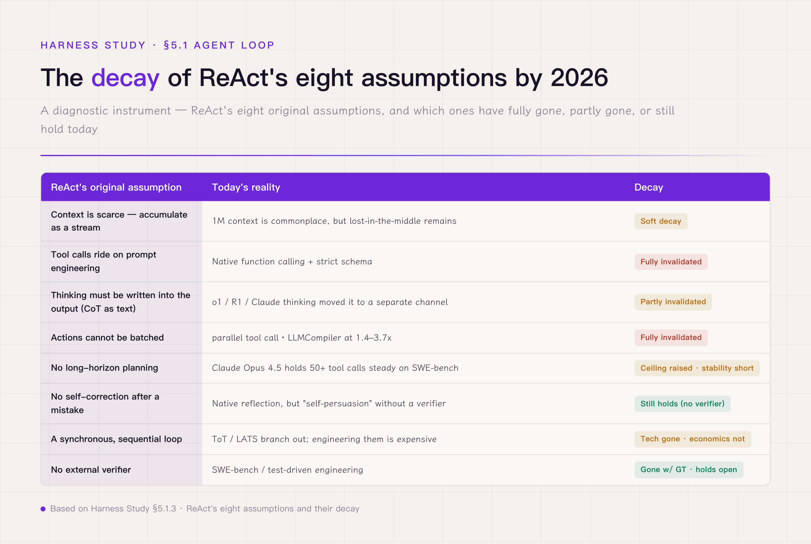
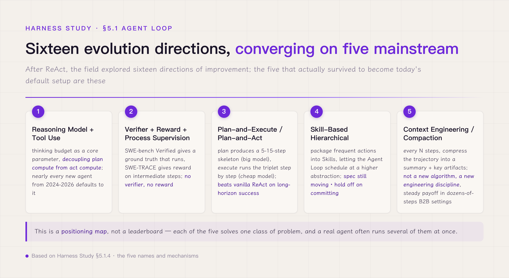
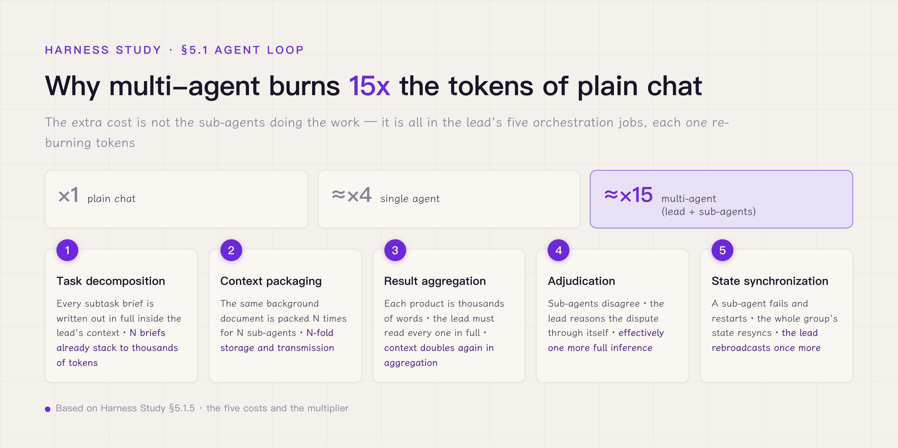
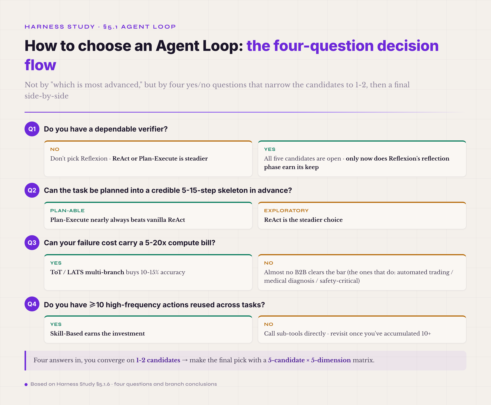

# 5.1 Agent Loop · Inner Loop · the agent's thinking structure · **P0**

The first mechanism, the Agent Loop, is the harness's execution kernel. It decides, once an agent is running, in what order, on what state machine, and under what stopping condition the agent cycles through reasoning and action. The other eight mechanisms each mind one job around this inner loop; the Agent Loop is the main line that strings them together and runs them. So understanding the harness begins with understanding the Agent Loop — get this one wrong, and the other eight will not join up, however finely each is built.

#### 5.1.0 Terms first used in this section

Terms already explained in §I–§IV (CoT / schema / trajectory / verifier / ablation / policy / function calling / tool use / Adapter / Routing, and so on) are not repeated. Only terms first appearing in §5.1 are listed here.

**Loop paradigm variants** — **vanilla ReAct** (the original ReAct · no plan / reflect / verify extension of any kind · the baseline every later ReAct-family variant is measured against · "vanilla" is software slang for unmodified, plain). **Plan-Execute / Plan-and-Act** (a two-phase loop: first plan a 5–15-step skeleton, then execute it step by step · the plan phase and the execute phase can even use different models). **Reflexion** (ReAct plus one round of reflection every N turns, grounded in the trajectory so far · the reflection steers what follows · usable only with a dependable verifier — otherwise reflection turns into self-persuasion). **Skill-Based Hierarchical** (package frequent actions into Skills · let the agent loop schedule at the Skill level instead of calling raw tools directly · Anthropic shipped Skills in 2025-10 and upgraded it to an open standard on 2025-12-18).

**Reasoning models** — **thinking budget** (the core knob exposed by reasoning models such as OpenAI o1 / DeepSeek R1 / Anthropic Claude thinking · how many tokens the model may "think" on its own before producing a tool call · decouples plan compute from act compute). **reasoning content / reasoning channel** (a reasoning model's separate reasoning stream · absent from the output text but present in the reasoning content field · OpenAI returns only a summary · Anthropic returns part · DeepSeek R1 and some Chinese models return all of it). **parallel tool call** (one inference emits several independent tool calls · lets calls with no dependencies run concurrently · compilers like LLMCompiler report 1.4–3.7x speedups). **strict schema** (enforce, at the inference layer, that the model's output conform to the schema · nonconforming output is blocked or retried on the spot · OpenAI has offered a strict mode since 2024-08 (opt-in) · Anthropic has supported structured outputs natively, including strict tool use, since 2025-11 · replaces the brittle 2022 practice of telling the model the format in the prompt and parsing with regex).

**Deciding the endpoint** — **ground truth** (the task's reference answer · a verifier usually judges by comparing the agent's output against ground truth · the "leak" in answer leakage means the verifier has seen this ground truth). **process reward / process supervision** (a reward signal that scores the soundness of intermediate steps, not only the final output · SWE-TRACE is the representative example).

**Failure modes** — **lost-in-the-middle** (a model's recall of key information drops systematically in the middle of a long context · the root reason 1M context can hold the material yet fail to use it · confirmed across several models by Stanford, Nelson Liu et al. 2023 · recall of key information placed at the head or tail is clearly higher than mid-context). **reward hacking** (the agent learns to game the verifier's rules — high score on the surface, task not actually done right · especially common in RL training · the same shape as an employee learning to pad the numbers under KPI review). **artifact-claim mismatch** (the agent declares "X is done" in the trajectory, but X is nowhere in the actual artifacts · a standard trap verifier design must defend against · especially likely in long agent loops). **multi-agent over-decomposition** (the common error behind the instinct "if one agent isn't strong enough, split into multiple agents" · multi-agent burns roughly 15x the tokens of plain chat (a single agent only about 4x) · most of it goes to orchestration · detailed in 5.1.5). **orchestration** (the umbrella word for all the coordination a lead agent does when it farms a task out to sub-agents and gathers the results · task decomposition, context packaging, result aggregation, adjudicating disagreements, state synchronization · 5.1.5 itemizes where each one burns tokens).

**Looking ahead (5.1.7)** — **learning by doing** (in open domains with no labeled data, the last remaining source of intelligence · the core claim of Silver & Sutton's "era of experience"). **grounded rewards** (reward signals drawn from experience of the environment — execution feedback / error rates / the user's subsequent behavior · as opposed to rewards from human prejudgement). **MCTS** (Monte Carlo Tree Search · the selection → expansion → simulation → backpropagation cycle · the core algorithm of the AlphaGo line · 5.1.7's point is that its core is the node-value signal backpropagation needs, not the tree itself). **learning progress** (the metacognitive signal "am I still improving at this goal" · used to prioritize self-generated goals · automatically drops both the impossible and the already-mastered ends). **pass@k** (the rate at which at least one of k samples passes · k=1 measures single-shot accuracy · large k measures whether correct paths exist in the model's distribution at all).

#### 5.1.1 Not a block of loop code — the agent's thinking structure

Start by dismantling the most common misunderstanding. Many people, hearing "Agent Loop" for the first time, take it to be a `while` loop that calls the model over and over. That telling is near-standard in online "intro to agents" tutorials, and it leads the reader somewhere wrong: it turns the Agent Loop into a question of code formatting, as if switching Agent Loops meant switching loop conditions.

The Agent Loop is in fact **the agent's thinking structure** — it defines the shape in which the model organizes its own reasoning at inference time, not the shape of the Python the model is embedded in. Those two levels are far apart. ReAct, proposed by Yao in 2022[^react-yao-2022], is not "a loop that calls the model repeatedly." It is the thought-action-observation triple: the model first writes out, in natural language, how it is thinking (thought); then commits to one structured act (action); then observes that act's real result (observation). The triple is a design choice that **externalizes the model's reasoning into an auditable trace**, so that after the agent finishes, a human engineer can see, turn by turn, what it was thinking, what it did, and what it saw. Switching to a different Agent Loop — plan-execute, say, or reflexion — switches how the model organizes its reasoning (a big plan first, then stepwise execution / a reflection every N turns), not how the loop block is written.

To make the "thinking structure" level stick, go back to a more basic question: **why can't next-token prediction, a single-step paradigm, finish a real task?** The model itself is a token predictor — given some input, it predicts the output that follows, the whole thing done in one GPU forward pass, with no mechanism inside that lets it pause, think a little longer, and resume. But a real task — look things up, call tools, edit files, compare documents, deliver a conclusion — is multi-step, stateful, and any step can fail and need redoing. Between single-step prediction and multi-step execution there is a basic tension: a single-step prediction that goes wrong is simply wrong; multi-step execution lets a later step use fresh evidence to correct an earlier judgment. The Agent Loop is the engineering that joins the two: the loop turns the model into an executor whose work accumulates, and the triple makes the intermediate steps observable and correctable.

Two analogies from other fields help internalize that structure. The first is the **OODA loop** (Observe-Orient-Decide-Act), proposed by Boyd in the 1960s. OODA came out of Cold War air combat: a pilot cannot complete a full decision in one second — the fight changes too fast — so he breaks the decision into small loops that converge on it, one full Observe-Orient-Decide-Act cycle per second, each cycle correcting the last judgment with new observation. Run your loop faster than your opponent's and you get "inside his decision cycle": he is countered before his move lands. The key in OODA is not how clever any single step is; it is that **the loop is more dependable than the step** — a step can err, but the loop's Observe keeps collecting evidence that corrects the step before. The Agent Loop borrows exactly this: one next-token prediction can be wrong, but a thought-action-observation cycle uses the next observation to correct the last thought, so errors do not pile up without bound. Mark the boundary, though — OODA is after speed (reaction time: be faster than the opponent), while the Agent Loop is after auditability (a trace more inspectable than a single step). The motives differ, and there is no contradiction: two loops solving different problems in their own fields.

The second analogy is **detective work**. Holmes does not know the murderer at the start. He looks at the scene (observation: the body's position, the footprints, the room), draws a hypothesis from the traces (thought: perhaps servant X, over money), then does the one thing that would confirm or break the hypothesis (action: check X's alibi at his lodgings), and weighs the new evidence for or against. The endpoint of the whole process is not a preset step count ("a detective must solve the case in 10 steps") — it is the state "the case is closed": murderer found, motive found, report writable. That maps onto the verifier's place in the Agent Loop: the loop stops not when the counter runs out but when the verifier says the goal is met. Give the agent a real verifier and it has the detective's sense of an ending; give it "stop after 10 steps" and it degrades into a worker ticking off steps, not a detective closing in on a goal. This analogy has its boundary too: Holmes gets a dramatic, unmistakable ending (murderer found / forced to admit the reasoning failed), while an agent's "case closed" on real tasks is a rubric passing, tests passing, a user accepting — more engineered, sometimes blurrier. In environments like SWE-bench where tests can run, the verifier is crisp; in open tasks like contract review, designing the verifier is itself the hard problem.

Together the two analogies answer one question: a problem that one next-token prediction cannot solve must be broken into small accumulating steps, with an objective mechanism to call the end. The Agent Loop is that answer written as engineering: the loop accumulates the small steps, the verifier calls the endpoint, and the thought externalizes the reasoning so the middle is auditable. The three together make a complete Agent Loop, and none can be dropped — without the loop you get one step; without the verifier you fall back on step counting; without the thought you see the final answer but never the decisions behind it.

The claim "Agent Loop ≠ while loop" has concrete evidence in published production implementations. Published research into Claude Code's source shows its inner loop is no simple while block — it is an event pipeline assembled from async generators, a single turn carrying ten-plus small mechanisms: four-level compaction checks run in series, token blocking budgets, system prompt assembly, streaming sampling, tools executing while the stream is still arriving, error recovery, stop-hook evaluation, token-budget continuation, attachment injection. At the source level, one State struct carries ten fields across iterations, and the main loop explicitly marks seven continue sites and eleven terminal exit points, each labeled with its transition reason. Which is to say: in this production code, when the loop continues and when it ends is a first-class design object — not "while True plus a break." And it lines up with the triple above: the triple is the thinking structure at the model layer; the inner loop is that structure made auditable at the engineering layer.

A production loop also has a path that teaching examples tend to omit: **interruption and steering are first-class inputs to the loop's state machine**. On a long task, the user changing direction mid-run is the norm, not an exception — so besides continue / terminate, the state machine needs a transition that absorbs outside input and carries on. The engineering constraint: an interruption point can only sit on a turn boundary, with the tool_call / tool_result pairing intact (the next subsection covers this protocol-level invariant) — cutting in the middle of a turn is how you hand-build a hallucination incubator. The line to draw is simple: any task expected to run longer than a few minutes must support lossless interruption — after the cut, context, artifacts, and trajectory agree with each other, and on resume the agent doesn't have to guess what just happened. Claude Code's message queue and Codex's cancel-anywhere CancellationToken are production implementations of exactly this path.

#### 5.1.2 The concrete shape of one ReAct call

With the abstraction in place — the Agent Loop as a thinking structure — bring it down to the concrete: take one real ReAct call apart and see what each thought-action-observation turn looks like, what piles up in the prompt, what the model sees each round. This section makes the abstraction tangible.

The task: have the agent read a newly signed contract (contract-2026.pdf), compare it against last year's contract with the same supplier (somewhere under archive/), and find the conflicting clauses. One full ReAct call runs roughly like this:

**Turn one** —
- Thought: To compare I need both contracts. Read the new one first, then find last year's.
- Action: `read_file("contract-2026.pdf")`
- Observation: [12 pages of the new contract's text returned]

**Turn two** —
- Thought: New contract in hand. Where is last year's? The user gave no path — search the archive.
- Action: `search_files(keyword="same supplier", path="archive/")`
- Observation: 3 candidates found; the closest match is contract-2025-q4.pdf

**Turn three** —
- Thought: The q4 one is most likely the previous version. Read it.
- Action: `read_file("archive/contract-2025-q4.pdf")`
- Observation: [15 pages of last year's contract returned]

**Turn four** —
- Thought: Both in hand now. Compare clause by clause, payment terms first.
- Action: `extract_clauses(doc="contract-2026.pdf", section="payment")`
- Observation: [4 payment clauses]

Turns five and six go on comparing the other clause categories. When does the loop stop? The verifier decides — for instance, "has the agent produced at least one conflict with supporting evidence?" or "has the agent declared 'comparison complete, no conflicts' and backed the declaration with evidence?" Without a verifier, all you have is a step ceiling as a backstop ("force-stop at 30 turns with no result") — and under that backstop, an agent that goes wrong in edge cases fails in ways the engineering system cannot catch.

Three mechanism points to pull out of this example. First, **the thought is the model's reasoning made external** — the model does not jump straight to the action; it first says in natural language why this action. The gain is an auditable trajectory: replay it and you know why turn three picked q4 over q1 ("q4 is the most recent version — most likely the previous one"); no guessing required. Second, **the action is a structured tool call** — not the free text "I'm going to read contract-2026.pdf" but `read_file("contract-2026.pdf")`, a call with a schema: function name `read_file`, a string parameter, text content as the return type. A strict schema makes the action executable (no NLP parsing) and checkable (a wrong parameter type is caught at the engineering layer). Third, **the observation is the tool's real result returned into the model's context** — not the model's own invention, "I have read the file," but the actual content the tool brought back. This matters: let the model write its own observations with no real tools attached, and the agent degrades into hallucinating its work, and the trajectory it leaves is fabricated evidence end to end.

A second production inner loop worth setting beside it is OpenAI Codex CLI's Rust implementation. Its core entry point is the `run_turn()` function, whose body walks five segments: query encoding → streaming sampling → tool-call dispatch → result recording → convergence detection. The most telling details concern whether the user can interrupt mid-flight: a CancellationToken threads through the whole of run_turn, so model sampling, tool execution, and persistence can each respond to an interrupt at once; stream reconnection and tool failure get separate backoff with separate retry budgets (stream_max_retries / request_max_retries); and run_turn does not return a string — it returns a TurnAction enum (Continue / WaitForConfirmation / Done / Error). Which is to say: "what happens next, now that this turn is over" is a first-class, type-level decision point in Codex's code, not something an upstream caller infers by squinting at a string. It also gives the intern analogy a concrete landing: the intern's checklist before stepping out the door is, in code, the TurnAction enum — each entry maps to one explicit next move.

But this four-turn example hides a mechanism detail that is easy to miss: **what the model sees each turn is not "the starting point of this turn's thought" — it is the stack of every triple so far.** At turn four, the prompt is roughly: system instruction + task description + thought-1 + action-1 + observation-1 + thought-2 + action-2 + observation-2 + thought-3 + action-3 + observation-3 + (a blank for the model to fill with thought-4). The prompt grows a notch every turn. Run the loop long and the context swells — twenty turns in, the prompt may already be tens of thousands of tokens, past the lost-in-the-middle threshold, and key information (an important finding from turn one, say) drowns in the middle, where the model overlooks it. This is a shared engineering pressure point of every ReAct-family Agent Loop, and it pairs with the context-management discipline discussed later — the Agent Loop decides how context accumulates; context management decides, past a point, how it is compacted, what moves into Memory, what gets extracted as an Artifact.

This accumulating structure holds across essentially the whole ReAct family. Switch to Plan-Execute: the plan phase produces one big thought (a 5–15-step plan), and the execute phase still runs a thought-action-observation triple per step (the thought now constrained by the plan). Switch to Reflexion: every N turns a reflection is added (which step went wrong, judged from the trajectory so far), and the loop continues. Switch to plan-and-act (ICML 2025): the plan model and the execute model can even be different model instances, but every execute step is still the triple. The shapes vary; **the accumulating think-act-observe structure is the ReAct family's shared spine** — every variant in the family adds a plan layer, a reflect layer, or a verify layer onto that spine, and the spine itself does not change.

One last layer of engineering completes the triple: how thought-action-observation pairs up in code. There is a hidden protocol-level invariant here: **tool_call and tool_result must pair tightly.** A tool call the model emits in its response must be followed, in the very next message, by its matching tool_result — no other role's message may slip in between. Once one does, the model's later reasoning muddles: it can no longer tell whether it actually called the tool. This invariant breaks easily in production — the most dangerous case in context compaction is replacing the original tool_result with a "summary of the tool result" pushed back into the conversation. The model reads a stretch of summary text that looks a lot like a tool result, but the pairing is broken, and the model starts hallucinating fabricated tool outcomes. Which is exactly why the Agent Loop is not only a thinking structure at the model layer but also a contract at the protocol layer: the thought-action-observation triple corresponds, in engineering, to a strict alternation of message / toolcall / toolresult roles — break the pairing and you break the reasoning.

#### 5.1.3 The decay of ReAct's eight assumptions

Treating the Agent Loop as a thinking structure and taking one ReAct call apart leads to the next question worth pressing: **what assumptions was ReAct built on in 2022, and do they all still hold in 2026?** The point is not to prove "ReAct is obsolete" — it is to locate which parts of ReAct still serve today and which parts must be upgraded.

Behind the original ReAct paper (Yao et al. 2022) stand eight implicit assumptions. They went unstated at the time because they were the shared ground of LLM engineering in 2022: context windows of 4–8K; no native tool-calling interface; thinking written into the output text because there was nowhere else to put it; actions never batched because the API supported no concurrent tool calls… Looking back today, **two of the eight no longer hold at all, three are partly invalidated or softly decayed, two hold only conditionally (technically gone but economically alive / gone only where ground truth exists), and one still holds.**

A quick-reference table first, to set the coordinates; the mechanisms follow — the table only locates, and only the mechanisms let you judge which assumptions still stand in your own setting and which have warped.

| ReAct's original assumption | Today's reality | Decay |
|---|---|---|
| Context is scarce — accumulate as a stream | 1M context is commonplace, but lost-in-the-middle remains | Soft decay |
| Tool calls ride on prompt engineering | Native function calling + strict schema | **Fully invalidated** |
| Thinking must be written into the output (CoT as text) | o1 / R1 / Claude thinking moved it to a separate channel | Partly invalidated |
| Actions cannot be batched | parallel tool call · LLMCompiler at 1.4–3.7x | **Fully invalidated** |
| No long-horizon planning | Claude Opus 4.5 holds 50+ tool calls steady on SWE-bench | Ceiling raised, stability still short |
| No self-correction after a mistake | Native reflection, but "self-persuasion" without a verifier | Still holds (without a verifier) |
| A synchronous, sequential loop | ToT / LATS branch out; engineering them is expensive | Technically invalidated, economically not |
| No external verifier | SWE-bench / test-driven engineering | Invalidated where ground truth exists; holds on open tasks |

*Figure 5.3 · ReAct's eight implicit assumptions and their decay*

**What happened, mechanically, to the two that no longer hold.** The first full invalidation is "tool calls ride on prompt engineering." In 2022, GPT-3.5 and Llama-2 had no native tool interface; developers could only teach the model in the system prompt — "a string like `Action: xxx` means a tool call" — then regex the action string out and convert it into a real function call. The practice was brittle: the model might emit `Actoin:` and break the parse with a typo; might emit `Action: read_file ('a.pdf')` with one extra space and break the parse; might, at some step of a multi-step task, skip `Action:` entirely and jump to a conclusion, leaving the loop stuck. OpenAI shipped function calling in 2023-06, Anthropic followed with tool use in 2024, and through 2024–2025 native strict schema spread across vendors — the model now emits schema-conforming JSON tool calls directly, schema validation happens at the inference layer, and nobody regexes. The assumption's technical premise ("models have no native tool interface") no longer exists; this is not "weakened" — the premise is gone.

The second full invalidation is "actions cannot be batched." The 2022 inference APIs were sequential — each action blocked on its observation before the next thought could be produced. But real tasks are full of **tool calls with no mutual dependencies**: read 5 contracts for comparison, check 3 suppliers' credentials, scan 10 folders for a particular file — no ordering among them, parallel in principle. Anthropic shipped a parallel tool call API in 2024, letting the model emit several independent calls in one inference, the harness executing them concurrently and returning the observations together. Compilers like LLMCompiler[^llmcompiler-2024] parallelize the dependency-free call graph automatically; the paper reports 1.4–3.7x speedups. As with the first, the premise is simply gone — sequential is no longer an API limit but a developer's choice.

Beyond these two sits a twin pair of changes — "teaching reasoning through the prompt" and "thinking written into the output text" (the CoT-as-text row of the table). The thinking channel going independent turned both of these 2022 "musts" into "possible but optional." As musts, their premise is gone; yet the table marks the pair only partly invalidated, because the original intent — externalize reasoning into an auditable trace — survives, and its engineering implementation has in fact regressed (the partial-invalidation discussion below takes this up). That shift from must to may is the largest paradigm step agent engineering has taken in three years; nearly every new agent framework defaults to new choices on these fronts.

**The three partial invalidations depend on the setting.** Take "context is scarce — accumulate as a stream." A 1M context lets you fit a whole repository of code or a 200-page contract, but **lost-in-the-middle** — the systematic drop in recall for key information placed mid-context — did not vanish as windows grew; Stanford's lost-in-the-middle work systematized the finding. So the discipline of stream-accumulation is not dead; what died is "must fit in 4K," because you can push 200K in at once. But the 2026 measurements are layered: literal single-point recall (needle-in-a-haystack style) is near-perfect on the latest generation of models, while recall that rides on semantic association (NoLiMa-style benchmarks that strip away lexical overlap) still degrades systematically at length, and multi-fact retrieval past 200K can show a gap of tens of points between advertised and effective capacity. Compaction is therefore a trade, not a reflex — compacting early has costs (information loss, mid-context rewrites that break the cache, drift introduced by the compression itself), while never compacting runs association-heavy long tasks straight into lost-in-the-middle. Set the compaction timing by task type, pair it with hoisting key information to the head and tail and substituting retrieval for bulk stuffing, and you beat both "blindly big context" and "blindly early compaction."

Take "CoT must be written into the output text." o1 / R1 / Claude thinking route reasoning tokens through a separate channel (a "reasoning content" field). The model can think at length before emitting a tool call — absent from the final output, present in the reasoning channel. For model efficiency this is a gain (thinking no longer spends the output budget), but it has a side effect: **an external verifier can no longer see the full thinking** — OpenAI returns a summary, Anthropic part, some vendors nothing at all. So ReAct's original design intent — externalize thought into an auditable trace — became **harder** to honor, not easier: thought used to live in the output, and the trajectory read complete; now it lives in the reasoning channel, and the trajectory may lose key reasoning steps. The invalidation here is not at the methodology layer but at the implementation layer: the intent survives; the engineering regressed.

Take "no long-horizon planning." Claude Opus 4.5 holds 50+ tool calls steady on SWE-bench Verified — an order of magnitude past GPT-3's 10-step ceiling of 2022. But that is a **controlled environment**: SWE-bench tasks are comparatively regular in structure, the toolset small and clean in semantics, and tests give instant feedback. Move to **open tasks** — audit a 200-page contract for every anomalous clause, produce a monthly audit report — and past 50 steps the deviation starts to accumulate: the model may "forget" a key finding from step 3, skip steps it should have taken, drift off-trajectory through the later middle. "Can plan" is not "can plan to the finish." This invalidation is conditional — the more regular the task and the more dependable the verifier, the more feasible the long horizon; the more open the task and the later the feedback, the more brittle it gets.

**The one that still holds**: without a verifier, a model's self-correction tends to become self-persuasion. No technical advance has overturned this mechanism — ask the model to grade itself, with no external ground truth to calibrate against, and it leans toward giving itself higher marks. Not deliberate cheating; it is the internal dynamics of a reasoning chain: once the model persuades itself "I am right," the next reasoning step proceeds on the premise "I am right." OpenAI o1's "think longer, be more right" has been experimentally falsified — the larger the thinking budget and the longer the reasoning, the more easily the model constructs a chain of false evidence that convinces itself. How to build an objective judge that the agent's own reasoning cannot contaminate is the central problem of verifier design — giving the agent an external ground truth its reasoning cannot pollute is the hardest and most important single thing in agent engineering, and it gets its own full treatment in the verifier section.

The real use of this table is not a verdict on ReAct — it **locates your harness's extension points**. Where an assumption still holds in your setting, the matching side of ReAct's design still serves; where it has been invalidated, the matching direction is a mechanism your harness must add. Doing contract review? "Long-horizon plan" is partly invalidated for you; the direction is Plan-and-Execute — plan the rough skeleton first. Doing code generation? "No verifier" is invalidated for you; bring in a SWE-bench-style test-driven verifier. The table is a **diagnostic instrument, not a sentence.**

#### 5.1.4 Sixteen evolution directions converge on five

In the three years after ReAct 2022, academia and industry produced at least fifteen directions claiming to go "beyond ReAct": Plan-and-Solve, Plan-and-Act, state-machine designs, Speculative Look-ahead, Reflexion, Verifier-Driven, Predictability-Driven, CodeAct, Tree of Thoughts, DSPy-style declarative frameworks, Skill-Based Hierarchical, the long-context route, the Reasoning Model + Tool Use route, Memory-Augmented, Multi-agent, Agentic RL Post-Training [ref: react-evolution-doc].

These directions are not equals. Some are the natural fill-in after an assumption in the table collapsed (Reasoning Model + Tool Use continues from the fall of "CoT as text"); some are academic papers tried once and never engineered (Tree of Thoughts saw no large-scale production in the two years after the paper); some are engineering conveniences with nothing new at the methodology level (parts of multi-agent). What actually built momentum across 2024–2026 — SOTA numbers plus engineered reproduction at several shops — comes to five. The inner mechanisms of the five follow; once you have them, any new "Beyond ReAct" direction you meet can be placed — a refinement of one of the five, or still an exploration in the research stage.

*Figure 5.4 · Sixteen evolution directions converge on five mainstream Agent Loops*

**First · Reasoning Model + Tool Use.** OpenAI o1 / DeepSeek R1 / Anthropic Claude Opus 4 treat the "thinking budget" as a core parameter — the model gets an independent stretch of reasoning before it produces a tool call, and the developer can tune how long it thinks (the count of thinking tokens). Against original ReAct's thought-in-the-output this is an engineering upgrade, but the bigger change is to the **cognitive architecture**: the compute the model gets at the plan stage can now far exceed what it gets at the act stage. In original ReAct, thought and action share one output budget (the longer the CoT, the fewer characters left for the action); a reasoning model splits the two — at inference, "thinking" and "doing" draw on separate resource pools. This direction has landed solidly; from 2024 through 2026, essentially every new agent defaults to it. An agent paper that still uses a plain CoT model rather than a reasoning model is, most likely, pre-2024 work.

**Second · Verifier + Reward + Process Supervision.** SWE-bench Verified[^swe-bench-verified] supplied a ground truth that runs — the agent resolves a GitHub issue, the tests run, tests pass = task solved; clean and objective. Process-reward work in the SWE-TRACE[^swe-trace-2026] line supplied a reward signal that looks at the intermediate steps, not only the final output — not just whether the agent ended right, but whether each step along the way was sound. This direction is the switch that moves agent engineering from prompt-tweaking to training on data — **no verifier, no reward; no reward, and tuning prompts by feel is all you have.** But verifier design carries three typical diseases: **answer leakage** (the verifier has seen the ground truth — it is grading an exam it already holds the key to), **reward hacking** (the agent learns to game the verifier's rules without doing the task right), and **artifact-claim mismatch** (the agent declares "done," and the artifacts contain no such thing). Each disease has its own remedy; they are the centerpiece of §5.8, the verifier section. Designing the verifier is engineering in its own right.

**Third · Plan-and-Execute / Plan-and-Act.** Plan-and-Act[^plan-and-act-2025], the formal work, splits the plan phase from the execute phase explicitly — plan produces a 5–15-step skeleton; execute runs thought-action-observation on each step. At the mechanism level this concedes that one model doing both the thinking and the doing may be neither economical nor good at either: planning wants global view and sequential reasoning (a stronger model — o1-pro, say); execution wants tool fluency and single-step competence (a cheaper tool-calling model — GPT-4o-mini, say). Split them and each layer optimizes on its own: the big, precise model plans once at task start; the cheap model executes many times, each time simply. On long-horizon tasks, plan-and-execute clearly beats vanilla ReAct on success rate — the plan phase erects the global skeleton first, and every execute step moves inside its constraint without straying far.

**Fourth · Skill-Based Hierarchical.** Anthropic opened the Skills spec in 2025-10[^anthropic-skills-spec]: rather than choosing from the raw tool list, the agent packages frequent actions into Skills (a name + input parameters + a flow of sub-tool calls), and the Agent Loop schedules at that higher level. The mechanism analogy is function versus inline code — calling sub-tools directly is inlining (assembled from zero every time); defining a Skill is writing the function (encapsulate once, reuse everywhere). A team that does RFP responses regularly might keep three Skills — extract_requirements / search_past_proposals / draft_response — each wrapping 5–10 sub-tool calls, the agent scheduling at the Skill level rather than the tool level. The direction picked up engineering momentum in late 2025, but the spec is still moving — Skills went from the 2025-10 first version to the 2025-12 open standard within months, and the push so far is mostly Anthropic's alone. Rewrite your whole harness onto Skills in 2026, and the next spec change makes you rewrite it again. Engineering status: worth tracking, hold off on committing.

**Fifth · Context Engineering / Compaction.** What a wave of engineering teams — Manus / Factory.ai / Morph — have been doing: 1M context holds the material but does not use it well, so add a compaction sub-step inside the Agent Loop — every N steps, compress the trajectory so far into a summary plus key artifacts, so the next step reasons over context of high effective density. This direction is not a new algorithm; it is a **new engineering discipline**. It is not a paper proposing a method, but the practice engineers converged on after repeated production scars: the thing you must do that no paper writes down. The payoff is steady, especially in B2B settings that run dozens of steps — contract review, long approval flows, monthly report generation. Twenty steps in, one compaction that squeezes the trajectory into a 1K-token summary plus 5 key artifacts visibly restores the agent's reasoning quality in the steps after. The direction works hand in hand with §5.4 Context / Memory / Artifact — Context Engineering is the discipline at the Agent Loop layer; the storage-layer components it pairs with live in that section.

The rest can be covered quickly: DSPy-style declarative frameworks stay niche (loud voice, few production cases); Predictability-Driven lacks engineered reproduction; Tree of Thoughts / LATS multi-branch search costs 5–20x the compute for unsteady gains on open tasks; Memory-Augmented works in long-conversation chatbots but is partly covered by Context Engineering in agent work; the state-machine route is one name for the Workflow path; Speculative Look-ahead helps in latency-sensitive settings but is complex to engineer; multi-agent has its own pitfall (5.1.5, next); Agentic RL Post-Training is a research direction (OpenAI o3 / DeepSeek R1 are doing it, but no training interface is exposed on the developer side yet); Reflexion's reflection layer was taken apart in 5.1.2 and 5.1.3 — it only works with a dependable verifier, and in engineering terms it is a companion piece of the Verifier route rather than a route of its own; CodeAct swaps the action space for executable code, and mainstream coding agents have absorbed it as the default form — it no longer evolves as an independent route. When a new paper lands, use the five as anchors — if the new direction fits into one of them, and fits honestly, it is that direction's refinement; if it fits none, it is most likely still research, not yet engineering.

#### 5.1.5 Common pitfall · Multi-Agent Over-Decomposition

The evolution map leaves one myth to face, and it is everywhere in B2B deployment talk: **the default belief that "if one agent isn't strong enough, splitting into multiple agents makes it strong enough."** The instinct sounds reasonable — what one agent cannot do, let several agents each own a piece of? Production data overturned it.

Anthropic published an internal reflection in 2025[^anthropic-multi-agent-research]: building their multi-agent research system, they found parallel multi-agent genuinely faster than a single agent on some research tasks — **but the token cost jumps: against plain chat, a single agent burns about 4x the tokens; multi-agent burns about 15x.** The piece also carries one unusually hard line: "don't use multi-agent for coding tasks." Negative advice that blunt is rare in big-lab engineering blogs — its weight comes from Anthropic quantifying the token cost themselves before writing the conclusion, not from prior preference.

Why can multi-agent burn 15x chat? The outputs alone should not add up to that — several sub-agents each run a stretch, and the output total is a few multiples at most. At the mechanism level, what really burns tokens is not "multiple agents each thinking" — it is **orchestration**. The lead agent does five jobs, every one of them expensive:

*Figure 5.5 · The five costs that take multi-agent to 15x plain chat*

First, **task decomposition**: the lead must break the task into subtasks, and every subtask's brief has to be written out in full inside the lead's own context (write it short and nothing downstream can refer to it); briefs for N sub-agents already stack to thousands of tokens. Second, **context packaging**: each sub-agent's starting context must be packed and shipped — the same background document may be packed N times for N sub-agents (each sub-agent's context is its own), the same information stored and transmitted N-fold. Third, **result aggregation**: each sub-agent's product comes back, possibly thousands of words apiece, and the lead must read every one in full to aggregate — the lead's context doubles again in the aggregation phase. Fourth, **adjudication**: sub-agent A says "the risk is in clause X," sub-agent B says "the risk is in clause Y, not X" — the lead must reason the dispute through itself, effectively one more full inference. Fifth, **state synchronization**: when one sub-agent goes wrong and restarts, the whole group's state must resynchronize — the lead rebroadcasts "our earlier judgment has changed; rerun on the new one," one more full broadcast.

Each of the five makes the lead re-read full context; N sub-agents run the task once, and the lead itself may run 5–8 full reasonings around the loop. Multi-agent's 15x over chat is these orchestration costs accumulating, not an exaggeration. See the mechanism and you see why splitting is not free: what you save is wall-clock time (parallel agents are indeed somewhat faster); what you pay is token cost (the lead's own workload swells). In production, the trade is usually dominated by token cost — API tokens are paid for in money, and in batch processing, wall-clock time hardly matters.

The lead's orchestration overhead, though, is not fixed by nature. It burns tokens because the orchestration is improvised by the lead at runtime: every step needs the model deciding on the spot whom to dispatch, reading the return before thinking the next move, the whole loop with its branches and intermediate results pressing on the lead's own context. But when a task's control flow **can be known in advance** — which subtasks parallelize, who cross-checks whom, how results aggregate, all clear before the run starts — that control flow can be written as a deterministic script: the loop, the branches, and the intermediate results held by the script, model inference happening only where the leaf agents do the work, the lead's context left holding one aggregated answer at the end[^dynamic-workflows]. This does not reduce the sub-agents' total work — they run what they run — but it moves the most expensive thing, the lead re-reading full context to orchestrate, out of model inference altogether, and the orchestration skeleton becomes readable and replayable in the bargain. The cost is the precondition: it holds only for tasks whose control flow is knowable ahead of time. An exploratory task's next step genuinely depends on the last step's result, cannot be scripted in advance, and still needs the lead improvising.

Whether to use multi-agent at all comes down to **three conditions that must hold together**: first, the task splits naturally into independently verifiable subtasks (not split by force — the mark of a forced split is "sounds splittable, but judging any subtask right or wrong needs another subtask's result"); second, the parallel gain (wall-clock time saved) ≥ the orchestration overhead (the lead's extra token cost); third, every sub-agent has an independent verifier that can judge its own subtask — without one, the lead grades everything itself, and you are back at the cost of the lead doing it all alone.

Drop any one of the three, and a single agent plus engineering optimization is almost always the better buy. Contract review is the standard counterexample. It looks splittable — "sub-agent A checks clause consistency, B checks compliance, C flags risks" — but the three judgments are **deeply coupled**: a risk may stem from a consistency problem, the compliance call depends on the consistency result, each of the three folded into the others. Force the split and the lead spends more effort, not less, adjudicating the three sub-agents' disagreements, and the outcome is not tokens saved but tokens burned. In settings like this, **a single agent, reinforced** — better context engineering, a finer-layered verifier, stronger long-horizon planning — wins almost every time.

The risk of orchestration running away has explicit countermeasures in production code. Codex CLI's source gives sub-agent spawning three tools — single spawn, batch spawn (up to 64 at once), and wait polling — but every spawn entry is forced through one depth check, `exceeds_thread_spawn_depth_limit()`: a sub-agent spawning sub-sub-agents past the depth limit is refused outright. The engineering layer makes "agents must not nest without bound" a hard constraint. The detail is side evidence that multi-agent over-decomposition is not a beginners-only trap — it is a pit that **production harness engineers have fallen into and then built specific defenses against**. Reuse the depth-cap discipline the first time you design a multi-agent system, and you skip paying for that lesson yourself.

#### 5.1.6 How to choose · the four-question decision flow

What the Agent Loop is, where ReAct's eight assumptions stand, the five mainstream directions, the multi-agent pitfall — one question remains: **how do you choose?** Which Agent Loop does the project in front of you use?

There is no universally best Agent Loop — the choice tracks the setting. Here is a working decision flow: answer four questions in order, and you will usually converge on one or two candidates.

*Figure 5.6 · The four-question decision flow for choosing an Agent Loop*

**Question one: do you have a dependable verifier?**

The verifier is the objective judge of "did this run go right." SWE-bench-style environments with runnable tests are the canonical dependable verifier; contract review has no such thing. The test: can you write a program that takes the agent's output and returns right/wrong, or an objective score? If you can, you have a verifier; if you cannot (human review only), you do not.

Without a verifier, **do not pick Reflexion** — it substitutes "the model grading itself" for the verifier, and the self-persuasion from the end of 5.1.3 recurs over and over. ReAct or Plan-Execute is the steadier start. With a verifier, all five candidates are open — and only then does Reflexion's reflection phase earn its keep (reflection needs objective feedback under it, or it spins idle).

**Question two: can the task be planned into a credible 5–15-step skeleton in advance?**

The test: handing this task to a new employee, could you give them the list "do A, then B, then C"? If yes, the task is plan-able; if you cannot say yourself how many steps it takes or what the endpoint is, it is exploratory.

When the task is plan-able, **Plan-Execute nearly always beats vanilla ReAct.** Contract review (list the clause categories, then compare category by category), RFP response (extract requirements, match solutions, draft), monthly report generation (pull the data, classify and total, write the narrative) are all plan-able. Plan-Execute's advantage is that with the skeleton erected in the plan phase, execution doesn't stray, and long-horizon stability is a grade above vanilla ReAct's. On exploratory tasks — "look through this survey report for anything related to our project," "find all the payment-related code in the repo," "check what the competitors shipped in the last six months" — **ReAct is the steadier choice.** You cannot say yourself how many steps such a task needs, and forcing a plan does worse than plain ReAct: the plan model invents an untrustworthy skeleton (it doesn't know the endpoint either), and the execute phase, bound to that skeleton, walks off course.

**Question three: can your failure cost carry a 5–20x compute bill?**

Multi-branch search — Tree of Thoughts / Language Agent Tree Search — expands several candidate branches at each decision point, scores them with some value function, and backtracks to the best. The mechanism can buy a 10–15% accuracy gain, at the price of 5–20x the compute (each decision point runs N candidates in parallel). Almost no B2B business process clears that bar — would you pay 8x the compute for contract review? No. The settings that clear it: automated trading (one bad decision loses millions), medical-diagnosis support / drug screening (errors are irreversible), safety-critical decisions (power dispatch, air-traffic support) — places where the failure cost is high enough to buy the compute. Ordinary B2B should not chase this branch.

Hidden inside this question is a middle tier: **best-of-N sampling plus a hard verifier**. Tree search is expensive because every decision point must be expanded and scored — but if the task has a trustworthy hard verifier (tests that run, schemas that validate), the cheapest way to buy accuracy is to sample N complete trajectories in parallel and let the verifier pick the one that passes. That costs N×, not the 5–20x of per-step branching, and it is an order of magnitude simpler to build than tree search — in the reasoning-model era this is standard practice. The decision rule: without a verifier, extra samples are just extra spend; with a hard verifier, sampling is accuracy you can simply buy.

**Question four: do you have ≥10 high-frequency actions reused across tasks?**

Skill-Based has real setup costs — defining the Skill schema, maintaining the Skill library, training the agent to use Skills instead of raw sub-tools, managing dependencies between Skills. The investment pays only when cross-task reuse runs high enough. Below 10 Skills, calling sub-tools directly is lighter — 10 tools listed straight in the prompt schedule fine. With ≥10 high-frequency reused actions, Skill-Based earns the investment; without, call sub-tools directly and revisit once you have accumulated 10+.

Four answers in, you are usually down to one or two candidates. For the final pick, use the matrix of 5 candidates × 5 dimensions: task structure / failure cost / compute budget / interpretability / fit with the other mechanisms.

What real projects run is more often not "pick one" but a three-layer hybrid: **a plan-and-execute shell + a ReAct inner loop + verifiers at the key nodes.** The hybrid is a fine choice — but know what each layer is doing: the shell cuts the rough skeleton (against wholesale drift), the inner loop keeps single-step exploration alive (against an over-rigid plan), and the verifier takes the right/wrong call at key nodes out of the agent's own hands (against self-persuasion). Three layers, three failure modes covered: plan against drifting away entirely, ReAct against single-step rigidity, verifier against self-persuasion. This hybrid is the de facto standard of industrial agents in 2025–2026 — Claude Code, Codex CLI, and Cursor each extend their own version of it.

The three-layer hybrid assembles plan, ReAct, and verifier **statically**. Practice has a more active direction as well — **let the harness and the orchestration both adapt to the task dynamically, instead of running one static configuration over every task.** This direction keeps ReAct as the kernel mentality (explore one step, watch the feedback, then move — steadiest on open tasks) and adds two dynamic capabilities around it. One is the **dynamic workflow** — where a task's control flow is knowable in advance (which substeps parallelize, who cross-checks whom, how results aggregate), write it as a deterministic script and hand it to the runtime to orchestrate; model inference happens only where the leaves do the work — sparing ReAct the cost of improvising orchestration at every step, and making the orchestration reproducible (the footnote in the multi-agent section pointed at this shape; Claude Code's dynamic workflows in 2026 are one industry signal). The other is the **dynamic harness** — not one configuration serving all tasks, but a harness that mounts task-matched **sub-harnesses** on demand (each sub-harness a specialized unit for one domain, carrying the five-dimension ontology §VIII expands: domain entities, attributes, relation rules, state machine, operation set); which tools this task mounts, which policy tier it runs, which verifier layers it gets — all switching with the domain. The combined judgment: pure ReAct self-exploration wastes the LLM on tasks whose control flow is knowable and whose domain is specializable (improvising every step, which is slow and unsteady); with task-mounted sub-harnesses plus scripts for the knowable parts, the LLM's capability on this class of tasks is actually released. **ReAct + dynamic harness + dynamic workflow** is the combination I am running in my own practice, and it is still evolving — reported here as a direction from current practice, not as a settled conclusion.

The two dynamic capabilities aim at different territory, and the dividing dimension is **how strong the task's reward signal is**[^anthropic-effective-agents] — a strong reward means the output can be closed out by machine judgment (tests passing, schema validation — the Hard Gates the verifier chapter expands later) or checked against labeled data; a weak reward means open-ended output with no ground truth. **Weak-reward work leans dynamic workflow**: personalized, non-standard problems with no labeled data (open research, solution exploration, diagnosis) — the process cannot be fixed in advance and no hard verifier can judge the result, so decomposition has to come from the model's own intelligence on the spot, which is exactly where high freedom is needed. The dynamic workflow arrives as a tool, and the freedom is untouched (whether to use it and what the orchestration script says are both the agent's call on the spot), but accuracy gains two new sources — the deterministic script keeps the orchestration from drifting, and the orchestration structure builds in cross-checking and adversarial review, putting multi-perspective consensus where the missing hard verifier would be[^weak-reward-rl]. **Strong-reward work leans dynamic harness**: standardized tasks that recur and carry explicit acceptance criteria — the shape of most core To B delivery (contract review, report generation, ticket handling). Here the model's freedom is a liability (unauditable, unreproducible), and accuracy comes from freezing domain knowledge into the sub-harness: domain verifiers, prompt assets, a narrowed operation set, packaged whole, routed per task, closed out by hard verification[^harness-routing-2026]. My current working judgment in one line: **weak-reward scenarios take the dynamic workflow, strong-reward scenarios take the dynamic harness** — the former constructs accuracy out of structural consensus where no labels exist, the latter locks accuracy in through frozen mechanisms where labels do. The two stay orthogonal — a strong-reward sub-harness can run a deterministic workflow inside it; this divide names the dominant dimension, not an either-or.

#### 5.1.7 Looking ahead · the intelligence ceiling of weak-reward work, and learning by doing

The divide above leaves a deeper question unanswered: where does the **intelligence ceiling** of weak-reward work come from? Push the goal toward AGI and this question becomes the main contradiction — AGI's application surface is mostly weak-reward, while its training surface rests on a strong-reward base (the o1 / R1 generation of reasoning models built their capability inside math and code, the strongest-reward domains there are, and generalized outward); the transfer between the two, and holding accuracy inside weak-reward domains, are the core unsolved problems. The evidence so far roughly draws the transfer's boundary: what carries across domains is the meta-strategy of "think before answering"; what does not carry is the training signal itself — and for long-tail domains thinly covered in pretraining (where most industries' open-ended deliverables happen to live), there is no direct evidence the transfer holds at all.

Put in human terms it is one sentence — **"I've never done it; how would I know?"** Open problems with no labeled data are not things a person learns by reading every book; they are learned by doing. The same goes for the agent: in weak-reward domains, the last remaining source of intelligence is **learning by doing**. This is not intuitive consolation — it is the direction the field called in 2025: Silver and Sutton's *Welcome to the Era of Experience* frames it as an era change[^era-of-experience] — the dividend of human data is running out, and the next generation of agents will draw their capability mainly from learning over their own streams of experience. Of its four pillars, the one that bears directly on this section's divide is the reward pillar: **rewards should be drawn from grounded experience of the environment (grounded rewards), not from human prejudgement** — the latter puts an "impenetrable ceiling" on agent performance. This adds an important piece to the weak-reward divide: **doing is itself a source of reward**. Once the agent actually connects to the environment and executes, grounded signals start pouring out on their own — execution feedback, error rates, the user's subsequent behavior — and some tasks that could not be judged grow their own sensors in the course of being done.

Push learning by doing toward engineering, and **tree search** — Tree of Thoughts, LATS, and their kin — moves back onto the agenda. Earlier in this section I said this class of methods "almost never pays off for To B business processes" — that judgment stands, but its context was strong reward plus cost sensitivity: with a hard verifier to close things out, paying 5-20x compute for 10-15% accuracy is rarely worth it. In the weak-reward, intelligence-ceiling context the value structure changes, for two reasons. First, **exploration is itself data production** — every branch rollout in the tree is real experience, and once it settles into the skill library and the memory layer it becomes an asset reused across tasks (Voyager proved this path with an automatic curriculum plus an ever-growing skill library[^voyager]); the cost has to be accounted against the double return of this task's hit plus the experience banked. Second, **diversity is an asset in weak-reward domains, not waste** — RLVR-style training shows an empirical tendency to narrow the output distribution (the pass@k reversal: the trained model wins at few samples and is overtaken by the base model at many[^pass-at-k]), while open tasks need exactly the opposite, multi-path divergence — diverge first, converge by consensus later. But tree search stands on one premise that cannot be skipped: **the core of MCTS was never the tree — it is the value signal propagated back**. After selection, expansion, and simulation comes backpropagation, which needs an evaluation at every node — and that is precisely what weak-reward domains lack. The tree is the skeleton; the sensors are the blood: node evaluation takes a generative verifier plus a heterogeneous judge panel as soft value[^genrm-poll], branch priority takes learning progress and uncertainty as the exploration prior, and the final call at the leaves falls back to the structural consensus discussed above. If the sensors cannot be built, the tree is just a more expensive way of wandering.

Push this line to its end and it merges with **proactivity**. Every step of the tree — which branch to pick, when to expand, when to stop, when to hand the question back to the human — is the whole content of proactivity. Put differently, proactivity is not a personality trait of the agent; it is the **exploration policy**: a learning-progress signal makes the agent favor goals it can still get better at (MAGELLAN uses absolute learning progress as the sampling priority over goals, automatically dropping both the impossible and the already-mastered ends[^magellan-alp]); an uncertainty signal sends it to fill information gaps on its own; and asking the user a clarifying question is itself an action node on the tree — asking proactively at low confidence is far cheaper than confidently going wrong. The three concerns each occupy one component of the tree-search frame: **intelligence = exploration depth × experience banked; accuracy = the node evaluation signal; proactivity = the exploration policy**.

This subsection offers a direction, not a conclusion. The engineering of tree search in weak-reward domains — how to build the node evaluation, how to bank experience without polluting the store, where to set the gate on proactive moves — is all still evolving, and most of the industry evidence sits in 2025-2026 preprints. For the introductory volume it is enough to have stood the problem and the dividing dimension up; the expansion volumes will walk through every known way of building verification signals for weak-reward domains, one piece at a time.

The Agent Loop mechanism is P0 — no harness can run at all without the inner-loop layer. But which loop, how many layers, combined with what — that is an engineering trade, not a question with one technically correct answer, and this section's five candidates plus four questions are the minimum toolkit for making that trade. Every one of the remaining runtime mechanisms will cooperate with this one: Tool Registry's scheduling is shaped by the Agent Loop's form; where the Verifier embeds in the loop decides how reflection triggers; the Trajectory's event sequence takes its structure from the Agent Loop; and the Safety control plane hooks every decision point inside it. The Agent Loop is no isolated component — it is the metronome of the whole harness.

---

## Footnotes

[^react-yao-2022]: ReAct: Synergizing Reasoning and Acting in Language Models · Yao, Zhao, Yu et al. (Princeton) · arxiv 2210.03629 · ICLR 2023
[^llmcompiler-2024]: LLMCompiler: An LLM Compiler for Parallel Function Calling · ICML 2024 · github.com/SqueezeAILab/LLMCompiler
[^swe-bench-verified]: SWE-bench Verified · OpenAI · 2024-08 · openai.com/index/introducing-swe-bench-verified/
[^swe-trace-2026]: SWE-TRACE (Rubric Process Reward Model) · arxiv 2604.14820 · preprint
[^plan-and-act-2025]: Plan-and-Act: Improving Planning of Agents for Long-Horizon Tasks · Erdogan, Lee, Kim et al. · arxiv 2503.09572 · ICML 2025
[^anthropic-skills-spec]: Agent Skills · Anthropic · first version 2025-10-16 / open standard 2025-12-18 · agentskills.io
[^anthropic-multi-agent-research]: How we built our multi-agent research system · Anthropic · 2025-06-13 · anthropic.com/engineering/multi-agent-research-system
[^dynamic-workflows]: The engineering shape in which multi-agent orchestration is written as a deterministic script and handed to the runtime to execute in the background. One 2026 instance is Claude Code's dynamic workflows — in ultracode mode, Claude generates such orchestration scripts for complex tasks on its own · research preview (requires Claude Code v2.1.154+) · code.claude.com/docs/en/workflows
[^anthropic-effective-agents]: Building effective agents · Anthropic · 2024-12-19 · anthropic.com/research/building-effective-agents — the source text for the workflow (LLMs and tools on predefined code paths, buying predictability and consistency) vs agent (the model directs its own process and tool use, buying flexibility on open-ended problems) split. That split picks sides by whether the decision tree can be drawn in advance; this passage moves the criterion to reward-signal strength — the same pair of currencies traded (determinism vs freedom), with the decision moved from design time to runtime
[^weak-reward-rl]: RL training offers a parallel: RLVR holds in machine-checkable domains like math and code, while creative writing and subjective QA carry no unambiguous ground truth — and the 2025-2026 industry answer is precisely to structure subjective judgment into verifiable signals. Writing-Zero turns principled self-critique into pairwise verifiable rewards (arxiv 2506.00103 · preprint); VMR-RLVR reformulates open-ended data into verifiable multiple choice (arxiv 2511.02463 · preprint)
[^harness-routing-2026]: Industry was converging on the same direction in April–May 2026. What Is Harness Engineering? · MindStudio · 2026-05-28 · mindstudio.ai/blog/what-is-harness-engineering-agent-wrapper — "A general-purpose agent trying to handle everything is usually worse than several specialized agents each handling a narrower task. The outer harness is where routing lives"; "Specialized agents have smaller, more focused harnesses — cleaner context, tighter tool sets, more specific validation logic". Agent Harness Engineering: The Rise of the AI Control Plane · Adnan Masood · 2026-04-23 · medium.com/@adnanmasood/938ead884b1d — the harness "translates probabilistic reasoning into deterministic, auditable enterprise action", with routing decisions and sub-agent spawning listed among control-plane duties
[^era-of-experience]: Welcome to the Era of Experience · David Silver, Richard S. Sutton · Google DeepMind · 2025 · preprint of a chapter in *Designing an Intelligence*, MIT Press — the four pillars of the era of experience: streams of experience (not short interaction snippets) / actions and observations grounded in the environment (not human dialogue alone) / rewards grounded in experience of the environment (not human prejudgement — which, in the original's judgment, "usually leads to an impenetrable ceiling on the agent's performance") / planning and reasoning about experience (not reasoning solely in human terms)
[^voyager]: Voyager: An Open-Ended Embodied Agent with Large Language Models · Wang et al. (NVIDIA) · NeurIPS 2023 · arxiv 2305.16291 — automatic curriculum (propose the next goal a little harder than current ability) plus an ever-growing library of executable skills: the earliest complete template of exploration products settling into reusable cross-task skills; its self-verification leans on Minecraft's decidable world state, and that guarantee weakens on open-ended deliverables with no ground truth
[^pass-at-k]: Does Reinforcement Learning Really Incentivize Reasoning Capacity in LLMs Beyond the Base Model? · OpenReview 4OsgYD7em5 · 2025, under review — finds RLVR models beat the base model at small k and are overtaken at large k, suggesting this training concentrates probability mass onto already-present correct paths at the cost of output diversity. Rebuttals argue the conclusion depends on the choice of k and algorithm — not settled; taken here only as a directional hint: do not run a narrowed-distribution policy in the divergence phase of open tasks
[^genrm-poll]: Two verified components for soft node value — Generative Verifiers: Reward Modeling as Next-Token Prediction · Google DeepMind · arxiv 2408.15240 (make the verifier a generative model that produces a verification reasoning chain before judging · supports multi-chain voting); Replacing Judges with Juries · Cohere · arxiv 2404.18796 (a jury of small models from disjoint model families judges more accurately than a single large judge at over 7x lower cost)
[^magellan-alp]: MAGELLAN: Metacognitive predictions of learning progress guide autotelic LLM agents in large goal spaces · Gaven et al. (Inria Flowers team) · ICML 2025 · arxiv 2502.07709 — the agent predicts its own competence per goal online and uses absolute learning progress ALP = |C_t(g) − C_{t−N}(g)| as the goal-sampling priority; validated in a synthetic text environment, not yet landed on production-grade open tasks
