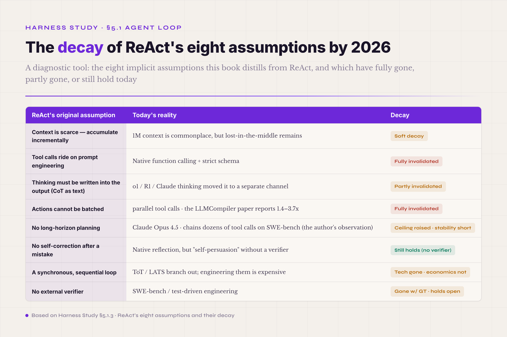
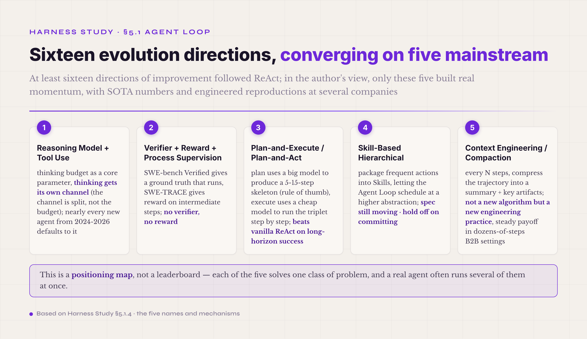
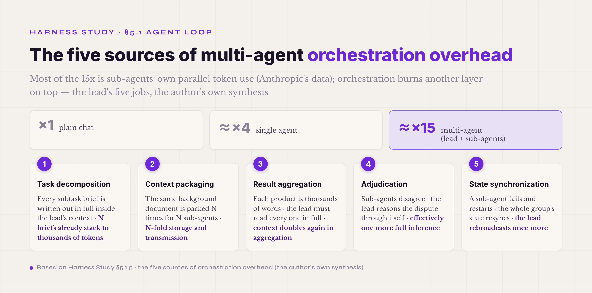
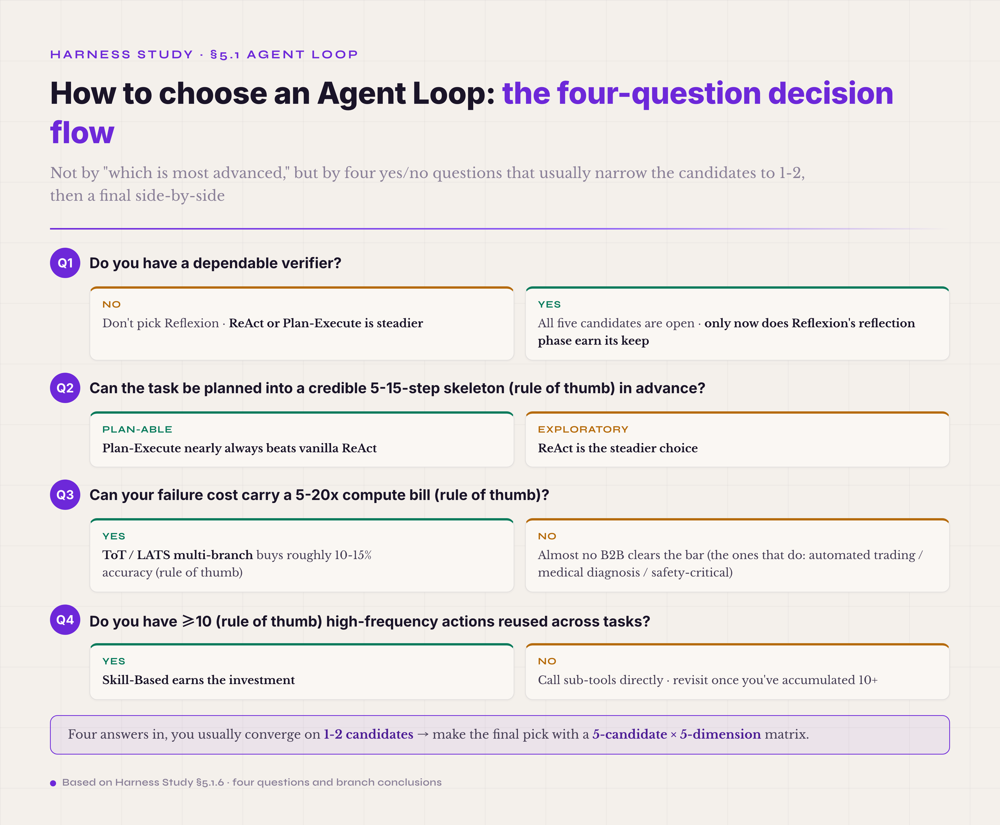

# 5.1 Agent Loop · Inner Loop · the agent's thinking structure · **P0**

The first mechanism, the Agent Loop, is the harness's execution kernel. It decides, once an agent is running, in what order, on what state machine, and under what stopping condition the agent cycles through reasoning and action. The other eight mechanisms each handle one job, and all of them run around this inner loop; the Agent Loop is the main line that ties them together. So understanding the harness starts with understanding the Agent Loop. Get the Agent Loop wrong, and the other mechanisms will not fit together, however well each one is designed.

#### 5.1.0 Terms first used in this section

Terms already explained in §I–§IV (CoT, schema, trajectory, verifier, ablation, policy, function calling, tool use, Adapter, Routing, and so on) are not repeated below; only terms that first appear in this section are listed here.

**Loop paradigm variants**

- **vanilla ReAct**: the original ReAct, with no plan, reflect, or verify layer of any kind added. It is the baseline every later ReAct-family variant is measured against. "Vanilla" is software slang for unmodified or plain.
- **Plan-Execute / Plan-and-Act**: a two-phase loop that first plans a skeleton of 5 to 15 steps (a rule of thumb), then executes it step by step. The planning phase and the execution phase can even use different models.
- **Reflexion**: ReAct plus a round of reflection every N turns, based on the trajectory so far, with the result of the reflection guiding what comes next. It is usable only with a dependable verifier; otherwise reflection turns into self-persuasion.
- **Skill-Based Hierarchical**: package frequently used actions into Skills, and let the agent loop schedule at the higher level of abstraction that Skills provide instead of calling raw tools directly. Anthropic launched the Skills feature in 2025-10 and published it as an open standard on 2025-12-18.

**Reasoning models**

- **thinking budget**: the core parameter exposed by reasoning models such as OpenAI o1, DeepSeek R1, and Anthropic Claude's extended thinking, namely how many tokens the model may spend "thinking" before it produces a tool call. It puts thinking and final output into separate channels, but thinking tokens usually still count toward the total output limit and are billed as output tokens (see the first direction in 5.1.4).
- **reasoning content / reasoning channel**: a reasoning model's separate reasoning channel. The thinking does not appear in the final output text; it appears in a separate reasoning field. OpenAI returns only a summary, Anthropic returns part of it, and some models, such as DeepSeek R1, return all of it.
- **parallel tool call**: one response issues several tool calls that do not depend on each other, and the harness executes them in parallel. Work such as LLMCompiler parallelizes dependency-free calls automatically; the paper reports speedups of 1.4 to 3.7 times.
- **strict schema**: two things need to be kept apart here.
  - **Model-side strict mode**: during generation, the model uses constrained decoding to mask out invalid tokens, which guarantees that the output conforms to a given JSON Schema (only a subset of JSON Schema is supported). OpenAI has offered a strict mode since 2024-08 (it must be enabled explicitly), and Anthropic has supported structured outputs natively since 2025-11, including strict tool use.
  - **Harness-side parameter validation**: after the harness receives a tool call, it checks the parameters against the schema again before executing. A call that does not conform is blocked, or the model is asked to retry.

  Together, the two replace the brittle 2022 practice of telling the model the output format in the prompt and then parsing the result with regular expressions.

**Deciding the endpoint**

- **ground truth**: the task's reference answer. A verifier usually judges by comparing the agent's output against the ground truth. The "leakage" in "answer leakage" means the verifier has seen this ground truth (the several kinds of leakage are collected under AP02 in Appendix F).
- **process reward / process supervision**: a reward signal that checks whether the intermediate steps are sound, not only the final output. SWE-TRACE is a representative example.

**Failure modes and anti-patterns**

- **lost in the middle**: when key information sits in the middle of a long context, the model's accuracy is clearly lower than when it sits at the start or the end (a U-shaped curve). Nelson Liu and colleagues at Stanford observed this across several models in 2023; the drop can exceed 20 percentage points, and the effect is weaker in newer models. It is one reason a 1M context can hold the material yet fail to use it well.
- **Reward Hacking** (AP03, see Appendix F): the agent learns to exploit loopholes in the verifier's rules, scoring high on the surface while the task is not actually done right. It is especially common during RL training, and it belongs to the same class of behavior as people learning to game the numbers under KPI review.
- **Artifact Claim Mismatch** (AP04, see Appendix F): the agent declares "X is done" in the trajectory, but X is nowhere in the actual artifacts. This is a failure mode that verifier design has to guard against specifically, and it is especially likely in long loops.
- **Multi-Agent Over-Decomposition** (AP09, see Appendix F): the anti-pattern of assuming by default that "if one agent isn't strong enough, split it into multiple agents." According to figures Anthropic has published, with ordinary chat as the baseline, an agent uses about 4 times the tokens and a multi-agent system about 15 times. Covered in detail in 5.1.5.
- **orchestration**: all the coordination work a lead agent does when it hands a task out to several sub-agents and aggregates their results, including task decomposition, context packaging, result aggregation, resolving disagreements, and state synchronization. 5.1.5 takes them one at a time and looks at their token overhead.

**Looking ahead (5.1.7)**

- **learning by doing**: in open domains with no labeled data, intelligence ultimately has to come from practice. This corresponds to the core claim of Silver and Sutton's "era of experience."
- **grounded rewards**: reward signals obtained from experience of the environment (execution feedback, error rates, the user's subsequent behavior), as opposed to "rewards that come from human prejudgment."
- **MCTS (Monte Carlo Tree Search)**: a tree search that loops through four steps (selection, expansion, simulation, backpropagation), and the core algorithm of the AlphaGo line. 5.1.7 stresses that its core is the node-value signal that backpropagation needs, not the tree itself.
- **learning progress**: a metacognitive signal of the form "am I still improving at this goal?", used to prioritize the goals an agent generates for itself. It automatically drops both ends: goals the agent cannot reach and goals it has already mastered.
- **pass@k**: the proportion of cases in which at least one of k samples passes. k=1 measures single-shot success; a large k shows whether the model's output distribution contains a correct path at all.

#### 5.1.1 Not a block of loop code, but the agent's thinking structure

Start with the most common misunderstanding. Many people hearing "Agent Loop" for the first time take it to be a `while` loop that calls the model over and over. Nearly every online introduction to agents explains it this way, and it points the reader in the wrong direction: it turns the Agent Loop into a question of code format, as if switching Agent Loops meant switching loop conditions.

In fact, the Agent Loop is **the agent's thinking structure**. It defines the shape in which the model organizes its own reasoning within each call, not the shape of the Python code the model is embedded in. Those two levels are far apart. ReAct, proposed by Yao and colleagues in 2022[^react-yao-2022], is not "a loop that calls the model repeatedly." It is the thought-action-observation triple: the model first writes out, in natural language, how it is thinking (thought); then decides on one structured act (action); then observes that act's real result (observation). The triple is a design choice that **externalizes the model's reasoning into an auditable trace**, so that after the agent finishes, an engineer can see, turn by turn, what it was thinking, what it did, and what it saw at each step. Switching to a different Agent Loop, such as Plan-Execute or Reflexion, changes how the model organizes its reasoning (settle on a big plan first and then execute step by step, or reflect every N turns before continuing), not how the loop code is written.

To get to the bottom of the "thinking structure" level, go back to a more basic question: **why can't a large model finish a real task with next-token prediction alone?** The model itself is a token predictor. Given some input, it predicts the next token, doing one forward pass for each token it produces, and writes on token by token. Throughout this process the model can only continue from the text it has already written. It sees no new evidence from the outside world, and it has no way to stop partway, look something up or try something, and then come back. A real task, such as looking things up, calling tools, editing files, comparing documents, and delivering a conclusion, is multi-step and stateful, and a failed step may have to be redone. Between single-pass generation and multi-step execution there is a basic tension. Once single-pass generation writes something wrong, it can only keep writing on from the mistake. Multi-step execution lets intermediate steps observe new evidence and correct the judgment of the step before. The Agent Loop is the engineering that joins the two: the loop turns the model into an executor whose work accumulates step by step, and the triple makes the intermediate steps observable and correctable.

To pin this structure down, here are two analogies from other fields. The first is the **OODA loop** (Observe-Orient-Decide-Act), proposed by Boyd in the 1970s and 1980s and set out in *Patterns of Conflict*, the briefing he gave from 1976 onward. OODA comes from air combat. The situation changes too fast for a pilot to make one complete decision at once, so he breaks the decision into small loops that close in on it, each loop correcting the old judgment with a new observation. Run your loops faster than your opponent and you get "inside his decision cycle": he is countered before his move lands. What matters in OODA is not how clever any single step is. It is that **the loop is more dependable than the single step**: a step can go wrong, but the loop's Observe step keeps collecting new evidence that corrects the judgment of the step before. The Agent Loop borrows exactly this mechanism. One generation can be wrong, but a thought-action-observation loop uses the next turn's observation to correct the last turn's thought, so errors do not pile up without bound. The analogy has a limit. OODA stresses being faster than the opponent (reaction time), while the Agent Loop stresses a trace that is easier to audit than a single step (auditability). The two loops have different motives: OODA is after timely decisions, the Agent Loop after transparent reasoning. This is no contradiction; the two loops simply solve different problems in their own fields.

The second analogy is **detective work**. Holmes does not know the murderer at the start. He goes to the scene and observes (observation: the position of the body, the pattern of footprints, the furnishings of the room), infers a hypothesis from the small clues (thought: perhaps servant X, over a money dispute), then does something that could confirm or refute the hypothesis (action: go to X's lodgings and check the alibi), and, with the new evidence in hand, weighs whether it supports or contradicts the last hypothesis. The endpoint of the whole process is not a preset number of steps (there is no rule that "a case must be solved in 10 steps"). It is **the state "the case is solved"**: the murderer found, the motive found, a closing report ready to be written.

In the Agent Loop, the endpoint has two layers. **The basic ReAct loop ends when the model stops requesting tools**: once the model gives a final reply and issues no more tool calls, the loop stops. A step limit is only a backstop that keeps the loop from running forever. **The verifier is an additional judgment this book argues for on top of that**: when the model says "done," an independent check still has to confirm that the goal was really met. Only with an explicit verifier does the agent get the detective's kind of endpoint judgment. If it relies only on the model announcing completion, plus a "stop after N steps" limit, it easily degrades into a worker ticking off steps rather than a detective closing in on a goal. The detective analogy has its limit too. Holmes's cases have a dramatic, clear ending (the murderer found, or the admission that the reasoning was wrong), while an agent's "case solved" on real tasks is a rubric passing, tests passing, or a user accepting the result: an endpoint that is more engineered and sometimes blurrier. In an environment like SWE-bench, where tests can run, the verifier is clear; in open tasks like contract review, designing the verifier is itself the hard problem.

Both analogies answer the same question: a problem that one generation cannot solve has to be broken into small steps that accumulate, and there has to be a mechanism that judges the endpoint. This book treats the complete Agent Loop as the engineering implementation of that idea, made up of three parts:

- the loop accumulates small steps;
- the thought externalizes the reasoning, so the intermediate steps can be audited;
- the verifier judges the endpoint.

In this book's view, none of the three can be dropped. Without the loop, you can only run a single step. Without the thought, you see only the final result and never the decision process. Without the verifier, you can only rely on the model announcing its own completion, with a step limit as the backstop.

The claim that "the Agent Loop is not a while loop" has concrete evidence in production implementations. A third-party analysis of a Claude Code source snapshot[^dive-cc-2026] shows that its outer layer is still a while loop, written as an async generator, but a single turn carries more than ten small mechanisms: four levels of compaction checks run in series, a token blocking budget, system prompt assembly, streaming sampling, tools executing while the stream is still arriving, error recovery, stop hook evaluation, continuation by token budget, and attachment injection. The code uses one State struct to carry ten fields across iterations, the main loop explicitly marks seven continue points, and on termination the loop reports one of ten termination reasons. Every one of these points records the reason for its transition. So in this production code, when the loop continues and when it ends is a part that needs its own design, not "while True plus a break." This matches the triple described earlier: the triple is the thinking structure at the model layer, and the inner loop is that structure's auditable implementation at the engineering layer.

A production loop also has a path that teaching examples often leave out: **interruption and steering are formal inputs to the loop's state machine**. On a long task, a user changing direction midway is normal rather than exceptional, so besides continue and terminate, the state machine needs a transition that absorbs outside input and then continues. In engineering terms, an interruption point can only sit on the boundary between turns. Every tool call must have a matching tool result (the end of 5.1.2 covers this protocol rule). Cut in the middle of a turn and leave a tool call without a result, and the API rejects the next request outright; even if you fill in the gap by hand, the model can easily misjudge which tools actually ran. The test is simple: any task expected to run longer than a few minutes must support lossless interruption. After the interruption, the context, artifacts, and trajectory agree with one another, and on resume the agent doesn't have to guess what just happened. Claude Code's message queue and Codex's CancellationToken, which can cancel at any point, are production implementations of this path.

#### 5.1.2 The concrete shape of one ReAct call

With the abstraction of the Agent Loop as a thinking structure covered, the next step is to take one real ReAct call apart and see what each thought-action-observation turn looks like, what piles up in the prompt, and what the model sees each turn.

Suppose the task is to have the agent read a newly signed contract (contract-2026.pdf), compare it against last year's contract with the same supplier (under the archive directory, archive/), and find the conflicting clauses. One full ReAct call runs roughly like this:

**Turn one**
- Thought: To compare I need both contracts. Read the new one first, then find last year's.
- Action: `read_file("contract-2026.pdf")`
- Observation: [12 pages of the new contract's text returned]

**Turn two**
- Thought: New contract in hand. Where is last year's? The user gave no path, so I'll search the archive.
- Action: `search_files(keyword="same supplier", path="archive/")`
- Observation: 3 candidates found; the closest match is contract-2025-q4.pdf

**Turn three**
- Thought: The q4 one is most likely the previous version. Read it.
- Action: `read_file("archive/contract-2025-q4.pdf")`
- Observation: [15 pages of last year's contract returned]

**Turn four**
- Thought: Both in hand now. Compare clause by clause, payment terms first.
- Action: `extract_clauses(doc="contract-2026.pdf", section="payment")`
- Observation: [4 payment clauses]

Turns five and six go on comparing the other clause categories. When does the loop stop? In the basic ReAct loop, it ends when the model decides the comparison is complete and gives a final reply instead of calling another tool. A step limit (say, "force-stop if there is still no result after 30 turns") is only a backstop. This book argues for adding a verifier judgment on top, for instance "has the agent produced at least one conflict with supporting evidence?" or "when the agent declares 'comparison complete, no conflicts,' has it backed that with evidence?" If all you have is the model's own report of completion plus a step backstop, an agent that goes wrong in edge cases fails in ways the engineering system cannot catch.

This example contains three key mechanism points.

- **The thought is the model's reasoning made external.** The model does not go straight to the action; it first explains in natural language why it is taking this action. The benefit of externalizing is an auditable trajectory: replay it and you know why turn three picked q4 over q1 ("q4 is the most recent version, most likely the previous one"), with no guessing.
- **The action is a structured tool call.** It is not the free text "I'm going to read the file contract-2026.pdf" but `read_file("contract-2026.pdf")`, a call with a schema: the function name is `read_file`, the parameter is a string, and what comes back is text content. Structure makes the action directly executable (no parsing of natural language) and also checkable. Model-side strict mode guarantees that the generated call conforms to the schema, and harness-side validation checks the parameters again before execution, blocking a call whose types are wrong.
- **The observation is the real result the tool returns, fed back into the model's context.** It is not the model's own invention, "I have read this file," but the file content the tool actually returned after running. This matters. If the model is allowed to generate its own observations with no real tools attached, the agent degrades into "imagining that it is doing work," and the trajectory it produces is made entirely of evidence the model invented.

Another production inner loop worth comparing is the Rust implementation of OpenAI Codex CLI. Its core entry point is the `run_turn()` function, whose body has five segments: query encoding, streaming sampling, tool-call dispatch, result recording, and convergence detection. The most notable design choices bear directly on whether the user can interrupt midway:

- a CancellationToken runs through the whole of run_turn, so model sampling, tool execution, and persistence can each respond to an interruption immediately;
- stream reconnection and tool failure each have their own backoff strategy and retry budget (stream_max_retries / request_max_retries);
- run_turn does not return a string result; it returns a TurnAction enum (Continue / WaitForConfirmation / Done / Error).

This shows that "what to do next once this turn is over" is an explicit, type-level decision point in Codex's code, not something the caller has to guess by reading a string result. In the intern analogy from §III (where the Agent Loop is the intern's rhythm of work), the TurnAction enum is like a checklist the intern consults after every step, with each value mapping to one explicit next action.

These four turns hide one more often-overlooked detail: **the prompt the model sees each turn is not just the starting point of the current turn but the context built up from every triple so far**. At turn four, the prompt the model sees is roughly: system instruction + task description + thought-1 + action-1 + observation-1 + thought-2 + action-2 + observation-2 + thought-3 + action-3 + observation-3, followed by a blank where the model writes thought-4. Every turn makes the prompt longer. As the loop runs on, the context swells. Twenty turns in, the prompt may already hold tens of thousands of tokens, the lost-in-the-middle effect starts to show, and key information (an important finding from turn one, say) is easily buried in the middle and ignored by the model. This is an engineering pressure point shared by every ReAct-family Agent Loop, and it goes hand in hand with context management. The Agent Loop decides how context accumulates; context management decides, once it has accumulated past a certain point, how to compact it, what to move into Memory, and what to extract as an Artifact (see §5.4).

This accumulating thought-action-observation structure applies to almost any ReAct-family Agent Loop:

- Switch to Plan-Execute: the planning phase first produces one big thought (a plan of 5 to 15 steps), then execution begins. Each execution step is still a triple; only now the thought is constrained by the plan.
- Switch to Reflexion: every N turns, add a reflection (looking back over the trajectory so far to find which step went wrong), then continue the loop.
- Switch to Plan-and-Act (ICML 2025): the planning model and the execution model can even be different models, but every execution step is still a triple.

The shapes differ, but **the accumulating structure of thinking, acting, and observing is the shared skeleton of the ReAct family**. Every variant adds a plan layer, a reflect layer, or a verify layer on top of this skeleton, and the skeleton itself does not change.

With the triple covered, one last layer of engineering remains: how the conceptual structure of thought-action-observation pairs up in code. There is a protocol-level rule here: **a tool call (tool_call) and its tool result (tool_result) must be paired and adjacent**. For every tool call the model issues in an assistant message, the next message must contain a tool result with the matching ID, and no other message may come in between. Which role carries the tool result varies by vendor: Anthropic puts it in a tool_result block inside a user message, while OpenAI uses a message with the tool role. The API enforces this rule when it validates the request. If a result is missing, an ID doesn't match, or the order is wrong, the request fails with an error.

So the damage to watch for is the kind the API cannot detect, and it usually happens during context compaction: replacing the original tool_result with a summary, or replacing the call and its result together with a stretch of summary text pushed back into the conversation. With the first approach the pairing is still formally intact, but the "tool result" the model reads is no longer what the tool actually returned. The second passes validation, but the conversation now contains text that looks like tool output with no matching call. In both cases the model can no longer tell which results the tool really returned, and it may later imitate the format and write "tool execution results" of its own. This is also why the Agent Loop is not only a thinking structure at the model layer but also a contract at the protocol layer. In engineering terms, the thought-action-observation triple corresponds to a strict alternation between assistant messages (containing tool calls) and tool-result messages (in the user or tool role). Break the pairing and you break the reasoning.

#### 5.1.3 The decay of ReAct's eight assumptions

With the Agent Loop viewed as a thinking structure and one ReAct call taken apart, the next question worth pressing is: **what assumptions was ReAct built on when it was proposed in 2022, and do they still hold in 2026?** The point of asking is not to argue that "ReAct is obsolete." It is to separate the parts of ReAct that still work today from the parts that must be upgraded.

This book distills the implicit assumptions behind the original ReAct paper (Yao et al. 2022) into eight. They did not need stating at the time, because they were the shared premises of LLM engineering in 2022: context windows of only 4K to 8K, no native tool-calling interface in the model, thinking that could only be written into the output text, an API that did not support issuing several tool calls at once… Looking back today, **two of the eight no longer hold at all, three are partly invalidated or gradually weakening, two are conditionally invalidated (invalidated technically but not economically, or invalidated only where ground truth exists), and one still holds**.

A quick-reference table comes first, to locate them, and the mechanisms follow. The table only locates. Only once the mechanisms are clear can you judge which assumptions still stand in your own setting and which have shifted.

| ReAct's original assumption | Today's reality | Decay |
|---|---|---|
| Context is limited, so it must accumulate incrementally | 1M context is commonplace, but lost in the middle persists | Soft decay |
| Tool calls depend on prompt engineering | Native function calling + strict mode | **Fully invalidated** |
| Thinking must be written explicitly into the output (CoT as text) | o1, R1, and Claude's extended thinking have a separate channel | Partly invalidated |
| Single-step actions cannot be batched | Parallel tool calls; the LLMCompiler paper reports 1.4–3.7x speedups | **Fully invalidated** |
| No long-horizon planning | The latest models can make dozens of consecutive tool calls on SWE-bench-style tasks (author's observation) | Ceiling raised, stability still short |
| No self-correction after a mistake | Native reflection exists, but without a verifier it easily turns into "self-persuasion" | Still holds (without a verifier) |
| A synchronous, sequential loop | ToT and LATS branch out, at a high engineering cost | Technically invalidated, economically not |
| No external verifier | SWE-bench and test-driven setups are engineered | Invalidated where ground truth exists; holds on open tasks |

*Figure 5.3 · ReAct's eight implicit assumptions and their decay*

**The two that no longer hold at all: what happened at the mechanism level.** The first is "tool calls depend on prompt engineering." Models from around 2022 (GPT-3.5, for example) had no native tool interface. Developers could only teach the model in the system prompt that "a string like `Action: xxx` means a tool call," then use a regular expression to parse the action string into an actual function call. The practice was fragile. The model might misspell `Action:` as `Actoin:`, might write `Action: read_file ('a.pdf')` with an extra space, or might, at some step of a multi-step task, suddenly skip `Action:` and give a conclusion directly, leaving the loop stuck. Any of these breaks the parse. OpenAI launched function calling in 2023-06, Anthropic's tool use entered public beta in 2024-04 and went GA on 2024-05-30, and through 2024 and 2025 vendors added strict modes one after another. The model now outputs schema-conforming JSON tool calls directly, and developers no longer write regex parsers. The technical premise of this assumption (models have no native tool interface) no longer exists, so this is not "weakening." The premise is gone.

The second is "single-step actions cannot be batched." The APIs of 2022 were sequential: each action had to block waiting for its observation before the next thought could be produced. Yet in real tasks an agent often has many **tool calls that do not depend on each other**, such as reading 5 contracts for comparison, checking 3 suppliers' credentials, or scanning 10 folders for a particular file. These calls have no ordering among them and can in principle run in parallel. OpenAI was first to support parallel tool calls, on 2023-11-06: the model issues several independent tool calls in one response, and the harness runs them in parallel and returns the observations together. Anthropic's tool use (public beta 2024-04, GA 2024-05-30) also supports issuing several tool calls in one response. Work such as LLMCompiler[^llmcompiler-2024] parallelizes the graph of dependency-free tool calls automatically; the paper reports speedups of 1.4 to 3.7 times. Like the first, this assumption has lost its premise: sequential execution is no longer an API limit but a choice the developer makes.

**The three partial invalidations depend on the setting.** Start with "context is limited, so it must accumulate incrementally." A 1M context means you **can** fit an entire repository's code or a 200-page contract. But lost in the middle, the clear drop in accuracy when key information sits in the middle of a long context, has not disappeared as windows grew (Liu et al. 2023 studied the phenomenon systematically). So incremental accumulation is still in use. What is gone is "you must accumulate within 4K": you can put 200K in at once. The 2026 measurements show a layered picture:

- literal single-point retrieval (needle-in-a-haystack and similar tests) is close to perfect on the latest generation of models;
- retrieval that depends on semantic association (benchmarks like NoLiMa that remove literal overlap) still degrades systematically at long context lengths;
- for multi-fact retrieval beyond 200K, the gap between advertised and effective capability is clear.

Compaction is therefore a trade-off, not a reflex. Compacting early has costs: lost information, a prompt cache invalidated when the middle of the context is rewritten, and context drift introduced by the compaction itself. Never compacting, on the other hand, runs long tasks that depend on associative reasoning into lost in the middle. Deciding when to compact by task type, and combining that with moving key information to the start and end and using retrieval instead of stuffing everything in, works better than either "blindly use the big context" or "blindly compact early."

The assumption that "CoT must be written into the output text" changed with o1, R1, and Claude's extended thinking, which route reasoning tokens through a separate channel (the reasoning content field). Before producing a tool call, the model can first think on its own, and that thinking appears in the reasoning channel rather than in the final output. Note that what is split is the channel, not the budget: thinking tokens usually still count toward the total output limit and are billed as output tokens. A side effect of the separate channel is that **an external verifier cannot get the full thinking**. OpenAI gives only a summary, Anthropic gives part of it, and some vendors give nothing at all. This makes ReAct's original intent of "externalizing thinking into an auditable trace" **harder to achieve**. Thought used to be written into the output, and the trajectory was complete and readable; now thought lives in the reasoning channel, and the trajectory may lose key reasoning steps. So what is invalidated here is the engineering implementation, not the methodology: the intent remains, while the implementation has regressed.

This assumption forms a pair with "teaching reasoning through the prompt." Once the thinking channel became separate, both of these 2022 "musts" became "possible but not required." As far as the "must" goes, the premise is gone. The table still marks the row only "partly invalidated," because the intent described above, externalizing reasoning, still stands. In the author's view, this shift from "must" to "optional" is one of the biggest changes in agent engineering over the past three years, and nearly every new agent framework has made new choices on these points.

On "no long-horizon planning": the latest generation of models (Claude Opus 4.5, for example) can make dozens of consecutive tool calls on tasks like SWE-bench Verified and stay stable (author's observation, a rule of thumb). That is several times better than in 2022, when about ten steps was already hard to sustain. But it is a **controlled environment**. SWE-bench tasks are comparatively regular in structure, the toolset is small and semantically clear, and tests give instant feedback. Move to **open tasks** (reviewing a 200-page contract to find every anomalous clause, say, or producing a monthly audit report), and after a few dozen steps deviation starts to accumulate. The model may "forget" a key finding from step 3, skip steps it should take, or show trajectory drift in the middle and later stages. "Can plan" is not the same as "can plan all the way through." The invalidation of this assumption is conditional: the more regular the task structure and the more dependable the verifier, the more feasible long tasks become; the more open the task and the more delayed the feedback, the more fragile they are.

**The one that still holds**: without a verifier, a model's self-correction easily turns into self-persuasion. No technical advance has overturned this at the mechanism level. Ask a model to grade itself with no external ground truth to calibrate against, and it tends to give itself high marks. The model is not deliberately cheating. This is the inherent momentum of a reasoning chain: once the model convinces itself in its reasoning that "I am right," the next reasoning step proceeds on the premise that it is right. Nor does "thinking longer makes it more right" hold in general. Research has found that on some tasks longer reasoning actually does worse, an inverse scaling of test-time compute, and the longer the reasoning chain, the more chances the model has to build a chain of false evidence that convinces itself. How to build a judge that the agent's own reasoning cannot sway is the central problem of verifier design. Giving the agent an external ground truth that its own reasoning cannot contaminate is one of the hardest and most important things in agent engineering, and §5.8 Verifier covers it in detail.

The purpose of this table is not to argue that "ReAct is dead" but to **locate where your harness should be extended**. Where an assumption still holds in your setting, you can keep using that side of ReAct's design; where it is invalidated, the corresponding direction is a mechanism your harness needs to add. For contract review, for example, "long-horizon planning" is partly invalidated for you, and the direction is to add Plan-Execute and plan the rough skeleton first. For code generation, "no external verifier" is already invalidated for you, so you can bring in a SWE-bench-style test-driven verifier. The table is a **diagnostic tool**, not a verdict.

#### 5.1.4 Sixteen evolution directions converge on five

In the three years after ReAct was proposed in 2022, academia and industry produced at least sixteen directions claiming to go "beyond ReAct": Plan-and-Solve, Plan-and-Act, state-machine designs, Speculative Look-ahead, Reflexion, Verifier-Driven, Predictability-Driven, CodeAct, Tree of Thoughts, DSPy-style declarative frameworks, Skill-Based Hierarchical, the long-context route, the Reasoning Model + Tool Use route, Memory-Augmented, multi-agent, and Agentic RL post-training.

These sixteen directions are not equals. Some are the natural replacement after one of the assumptions in the table was invalidated (Reasoning Model + Tool Use, for example, takes over from the invalidated "CoT as text"). Some are academic papers tried once and never engineered (Tree of Thoughts, for example, has seen no large-scale production use in the two years since the paper). Some are convenient in engineering but offer nothing new in methodology (some multi-agent systems, for example). In the author's view, only five built real momentum from 2024 to 2026, with both SOTA numbers and engineered reproductions at several companies. The internal mechanisms of these five are covered below. Once you have them, you can take any new "beyond ReAct" direction you meet and judge whether it refines one of the five or is still an exploration in the research stage.

*Figure 5.4 · Sixteen evolution directions converge on five mainstream Agent Loops*

**First · Reasoning Model + Tool Use**. OpenAI o1, DeepSeek R1, and Anthropic Claude Opus 4 treat the thinking budget as a core parameter: the model has a stretch of independent reasoning before it produces a tool call, and the developer can tune how long it thinks (the number of thinking tokens). Compared with original ReAct, which writes thought into the output text, this is an engineering upgrade and, more importantly, **an upgrade of the cognitive architecture**: the compute available to the model in the planning phase can far exceed what it has in the action phase. In original ReAct, thought and action are squeezed into the same output, and the longer the CoT, the less room is left for the action. A reasoning model puts thinking in a separate channel, so "thinking" and "doing" are structurally separated. But what is split is the channel, not the budget. Thinking tokens usually still count toward the total output token limit (such as max_tokens) and are billed as output tokens, so when you raise the thinking budget, cost and total output limit have to be worked out together. This direction is well established in practice: from 2024 to 2026 nearly every new agent adopts it by default. An agent paper you read today that uses a plain CoT model rather than a reasoning model is most likely work from before 2024.

**Second · Verifier + Reward + Process Supervision**. SWE-bench Verified[^swe-bench-verified] provides ground truth in the form of runnable tests: after the agent resolves a GitHub issue, the tests run, and if they pass the task has succeeded, which is clean and objective. Process-reward work such as SWE-TRACE[^swe-trace-2026] provides a reward signal that "looks at the intermediate steps, not only the final output." It checks not just whether the agent got it right in the end but whether each step along the way was sound. This direction is key to moving agent engineering from "tuning prompts" to "training with data": **without a verifier, you get no reward signal; without a reward signal, all you can do is tune prompts by feel**. But verifier design itself has three typical flaws:

- **answer leakage**: the verifier has seen the ground truth, so it is grading an exam whose answers it already knows;
- **reward hacking**: the agent learns to exploit loopholes in the judging rules without actually doing the task right;
- **Artifact Claim Mismatch**: the agent declares "done," but the artifacts don't actually contain what it claims.

Each of the three flaws has its countermeasures, and they are the central topic of §5.8 Verifier. Designing a verifier is engineering work in its own right.

**Third · Plan-Execute / Plan-and-Act**. The Plan-and-Act[^plan-and-act-2025] work separates the planning phase and the execution phase explicitly: planning produces a skeleton of 5 to 15 steps, and execution runs thought-action-observation on each step. At the mechanism level, this admits that having one model both "think" and "do" may be neither economical nor what it is good at. Planning needs a global view and sequential reasoning (suited to a stronger model, such as o1-pro); execution needs fluent tool use and the ability to carry out single-step operations (suited to a cheaper model, such as GPT-4o-mini). Once they are separated, each layer can be optimized on its own. Planning uses a large, precise model and runs only once at the start of the task; execution uses a cheap model and runs many times, each run simple. On long-horizon tasks, Plan-Execute has a clearly higher success rate than vanilla ReAct, because the planning phase sets up the global skeleton first, and each execution step is constrained by that skeleton and does not stray far.

**Fourth · Skill-Based Hierarchical**. Anthropic opened the Skills specification in 2025-10[^anthropic-skills-spec]. Instead of picking directly from the raw tool list, the agent packages frequently used actions into Skills, and the Agent Loop schedules at this higher level of abstraction. A Skill is a directory: a SKILL.md file states its name, purpose, and operating steps, the directory can include scripts and resource files, and the steps lay out which sub-tools to call. The mechanism analogy is "functions versus inline code." Calling sub-tools directly is like inline code, assembled from scratch every time; defining a Skill is like writing a function, encapsulated once and reused everywhere. A team that often writes RFP responses might have three Skills, extract_requirements, search_past_proposals, and draft_response, each wrapping 5 to 10 sub-tool calls, with the agent scheduling at the Skill level rather than the tool level. Skills began to gain engineering momentum in late 2025, but the specification is still evolving. It took only a few months to go from the 2025-10 first version to an open standard in 2025-12, and so far Anthropic is mostly the one pushing it. If you rewrite your whole harness onto Skills in 2026, the next specification change means changing all of it again. So the engineering status is "worth tracking, hold off on investing."

**Fifth · Context Engineering / Compaction**. This is what a number of engineering teams, including Manus, Factory.ai, and Morph, are doing. A 1M context can hold the material but not use it well, so a compaction sub-step is added to the Agent Loop: every N steps, the trajectory so far is compacted into a summary plus key artifacts, so that the next step reasons over context with higher information density. This direction is **a new engineering practice**, not a new algorithm. No paper proposed it; engineers arrived at it after hitting the same pitfalls again and again in production, and it is the kind of practice that "has to be done, but no paper writes down." The benefit is steady, especially in B2B scenarios that run dozens of steps, such as contract review, long approval workflows, and monthly report generation. For example, compacting once after 20 steps, squeezing the trajectory into a summary of about 1K tokens plus 5 key artifacts (rule of thumb; adjust to your scenario), brings a clear recovery in the agent's reasoning quality in the steps that follow. It works closely with §5.4 Context / Memory / Artifact: context engineering is an engineering practice at the Agent Loop layer, and §5.4 covers the storage-layer components that go with it.

The rest of the directions can be covered quickly:

- DSPy-style declarative frameworks remain niche (loud voices, few production cases);
- Predictability-Driven lacks engineered reproductions;
- Tree of Thoughts, LATS, and other multi-branch searches cost 5 to 20 times the compute (a rule of thumb), with unsteady gains on open tasks;
- Memory-Augmented works in long-conversation chatbots, but in agent engineering it is already partly covered by context engineering;
- state-machine designs are another name for the Workflow route;
- Speculative Look-ahead helps in latency-sensitive scenarios but is complex to engineer;
- multi-agent has its own anti-pattern problem (covered in 5.1.5 below);
- Agentic RL post-training is a research direction (OpenAI o3 and DeepSeek R1 are already doing it, but developer-side APIs do not yet expose a training interface);
- Reflexion's reflection layer was already discussed in 5.1.2 and 5.1.3: it is usable only with a dependable verifier, and in engineering terms it is an adjunct of the Verifier route rather than a route of its own;
- CodeAct replaces the action space with executable code; mainstream coding agents have absorbed it as their default form, and it no longer evolves as an independent route.

When you read a new paper, you can use these five as reference points. If the new direction fits properly into one of them, it is a refinement of that one; if it fits into none, it is most likely still in the research stage and not yet engineered.

#### 5.1.5 Anti-pattern · Multi-Agent Over-Decomposition

After the evolution directions, consider a misconception that is very common in B2B project discussions: **many people assume by default that "if one agent isn't strong enough, splitting it into multiple agents will make it strong enough."** The intuition sounds reasonable. If one agent can't do the job, why not let several agents each handle a piece? But the actual engineering data does not support this assumption.

In 2025 Anthropic published an engineering article[^anthropic-multi-agent-research] reviewing its experience building a multi-agent research system. The article reports that on their internal research evaluation, the multi-agent system outperformed a single agent by 90.2%. The cost is **a sharp rise in token usage: with ordinary chat as the baseline, an agent uses about 4 times as many tokens and a multi-agent system about 15 times**. The article also points out that multi-agent does not suit every task. Most coding tasks have fewer truly parallelizable parts than research tasks, and today's LLM agents are not yet good at coordinating and delegating work to each other in real time. This negative advice comes from a company that turned multi-agent into a product, and it is backed by quantitative data, so it carries far more weight than a prior preference.

Why does multi-agent use 15 times the tokens of ordinary chat? According to the analysis in Anthropic's original article, on the BrowseComp evaluation, token usage alone explains about 80% of the variance in performance. A multi-agent architecture works largely because it can spend enough tokens: each sub-agent explores in parallel in its own separate context window, and total consumption adds up with the number of sub-agents. In other words, most of that fifteenfold usage comes from the parallel consumption of sub-agents in their separate contexts.

Beyond that, the author believes **orchestration** adds a further layer of overhead: the lead agent has to do the following five things, and each one consumes tokens.

*Figure 5.5 · Five sources of multi-agent orchestration overhead (author's summary)*

- **Task decomposition**: the lead agent has to break the task into subtasks, and each subtask's brief has to be written out in full inside the lead's own context (if it isn't complete, nothing later can refer to it). Briefs for N sub-agents add up to thousands of tokens.
- **Context packaging**: each sub-agent's initial context has to be packaged and sent. The same background document may have to be packaged N times for N sub-agents (because each sub-agent's context is separate from the others), so the same information is stored and transmitted N times.
- **Result aggregation**: each sub-agent may return thousands of words, and the lead has to reread all of it in full to aggregate, so its context grows by another large chunk in the aggregation phase.
- **Resolving disagreements**: sub-agent A says "the risk is in clause X," sub-agent B says "the risk is in clause Y, not X," and the lead has to reason it through itself to decide who is right, which amounts to one more full reasoning pass.
- **State synchronization**: when one sub-agent goes wrong and has to restart, the state of the whole group has to be resynchronized. The lead has to announce again, "the earlier judgment has changed; rerun based on the new one," which is another full broadcast.

All five require the lead to reread the full context repeatedly. By the author's estimate, when N sub-agents run a complete task once, the lead itself may perform 5 to 8 full reasoning passes within the loop (an estimate that varies by task). Once you understand these mechanisms, you can see why splitting into multiple agents is not free. The sub-agents' parallel consumption plus the lead's orchestration overhead buys a shorter wall-clock time (multi-agent parallelism really is faster), and you pay for it in token cost. In production, this trade-off is usually dominated by token cost, because API tokens are paid for directly, while in batch-processing scenarios wall-clock time hardly matters.

The lead's orchestration overhead is not fixed, though. It consumes tokens because the lead improvises the orchestration at runtime. At every step the model has to decide on the spot whom to dispatch, read the returns, and then think about the next step, and the whole loop, its branches, and its intermediate results all sit in the lead's own context. If a task's control flow **can be determined in advance** (which subtasks run in parallel, who cross-checks whom, how results are aggregated, all clear before the run starts), that control flow can be written as a deterministic script. The script holds the loop, the branches, and the intermediate results; model inference happens only when leaf agents do the work; and at the end, the lead's context holds only one aggregated answer[^dynamic-workflows]. This does not reduce the total work the sub-agents do (the agents still run as much as they need to). It does move the overhead of "the lead repeatedly reading the full context to orchestrate" out of model inference, and the orchestration skeleton itself becomes readable and rerunnable as a result. The price is that it only applies to tasks whose control flow is predictable. An exploratory task's next step depends on the result of the previous one, so it cannot be fixed in advance and still has to be orchestrated by the lead on the fly.

Deciding whether to use multi-agent comes down to **three conditions that must all hold at once**:

1. The task splits naturally into subtasks that can be verified independently, rather than being split by force. The sign of a forced split: it sounds splittable, but judging whether any subtask is right requires the results of other subtasks.
2. The gain from running subtasks in parallel (wall-clock time saved) is no less than the extra token cost (the sub-agents' parallel consumption plus the lead's orchestration overhead).
3. Every sub-agent has its own independent verifier that can judge whether its subtask is right. Without independent verifiers, the lead has to judge everything itself, and you are back to the cost of the lead doing it all alone.

If any one of the three is missing, a single agent plus engineering optimization is usually the better deal. Contract review is a typical counterexample. You might think it can be split into "sub-agent A checks clause consistency, sub-agent B checks compliance, sub-agent C flags risks," but the three sub-agents' judgments are **tightly coupled**. A risk may stem from a consistency problem, and the compliance judgment also depends on the consistency result, so each of the three is entangled with the others. After a forced split, the lead has to spend more effort resolving the three sub-agents' conflicting conclusions, and the result is more tokens spent, not fewer. In scenarios like this, **a single agent with engineering reinforcement** (better context engineering, more finely layered verifiers, stronger long-horizon planning) is almost certainly the better deal.

The risk of orchestration running out of control has explicit engineering countermeasures in production implementations. Codex CLI's source code provides three tools for spawning sub-agents: single spawn, batch spawn (up to 64 concurrently), and wait polling. But every spawn entry point is forced through a depth check, `exceeds_thread_spawn_depth_limit()`: when a sub-agent tries to spawn another layer of agents and the depth exceeds the limit, the request is refused outright. In effect, the engineering layer turns "agents cannot nest without bound" into a hard constraint. This detail shows indirectly that Multi-Agent Over-Decomposition is not a pitfall that exists only on paper. It is an anti-pattern that **engineers of production harnesses ran into and then built specific defenses against**. When you design a multi-agent system for the first time, adopting the "depth limit" rule directly saves you the cost of running into the same pitfall yourself. Uncontrolled nesting depth is itself a separate anti-pattern, Sub-agent Depth Explosion (AP12, see Appendix F), which §5.9 revisits from the safety angle.

#### 5.1.6 How to choose · the four-question decision flow

Having covered what the Agent Loop is, where ReAct's eight assumptions stand today, the five mainstream evolution directions, and the anti-pattern of Multi-Agent Over-Decomposition, one last question remains: **how should you choose?** Which Agent Loop should the project in front of you use?

There is no universally best Agent Loop; the choice depends on the setting. Below is a practical decision flow. Answer four questions in order, and you will usually narrow it down to one or two candidates.

*Figure 5.6 · The four-question decision flow for choosing an Agent Loop*

**Question one: do you have a dependable verifier?**

A verifier is the checker that judges whether the agent got it right on this run. An environment like SWE-bench, where tests can run, is a typical dependable verifier; contract review has nothing of the kind. The test is this: can you write a program that takes the agent's output as input and returns "right" or "wrong," or an objective score? If you can, you have a verifier; if you can't (only human review works), you don't.

Without a verifier, **don't choose Reflexion**. It substitutes "the model grading itself" for the verifier, and the result is the self-persuasion described at the end of 5.1.3, happening again and again. ReAct or Plan-Execute is a steadier starting choice. With a verifier, all five candidates are open, and only then does Reflexion's reflection phase really become useful (reflection needs objective feedback to rest on; otherwise it just spins).

**Question two: can the task be planned into a credible 5–15-step skeleton in advance?**

The test: if you handed this task to a new employee, could you give them a list like "do A first, then B, then C"? If you can, the task is plan-able; if you can't (you yourself can't say how many steps it takes or where it ends), it is exploratory. The range of 5 to 15 steps is a rule of thumb; adjust it to your scenario.

For plan-able tasks, **Plan-Execute nearly always beats vanilla ReAct**. Contract review (list the clause categories first, then compare category by category), RFP responses (extract the requirements, then match solutions, then write a first draft), and monthly report generation (pull the data, then classify and total it, then write the narrative) all belong here. Plan-Execute's advantage is that once the planning phase has built the skeleton, the execution phase doesn't wander off, and its long-horizon stability is a level above vanilla ReAct's. For exploratory tasks, such as "see whether this research report has anything related to our project," "find all the payment-related code in the repo," or "look into what competitors have released in the past six months," **ReAct is actually the steadier choice**. You can't say yourself how many steps such a task takes, and forcing a plan makes things worse than using ReAct directly. The planning model makes up an unreliable skeleton (it doesn't know where the end is either), the execution phase has to follow that skeleton, and the run goes off course.

**Question three: can your failure cost carry a 5–20x compute bill?**

Multi-branch search methods such as Tree of Thoughts and Language Agent Tree Search (LATS) expand several candidate branches at each decision point, score them with some value function, and backtrack to pick the best. In the author's experience, these methods buy roughly a 10% to 15% gain in accuracy at the cost of 5 to 20 times the compute, because each decision point runs N candidates in parallel (both figures are rules of thumb and vary widely by task). For B2B business processes it almost never pays: would you pay 8 times the compute for contract review? No. The scenarios where it does pay are automated stock trading (one bad decision loses millions), medical diagnosis support and drug screening (errors are irreversible), and safety-critical decisions (power dispatch, air traffic control support). In these scenarios the cost of failure is high enough to be worth trading compute for. Ordinary B2B business should not go down this path.

This question also hides a middle option: **best-of-N sampling plus a hard check (Hard Gate, covered in §5.8)**. Tree search is expensive because every decision point has to be expanded and evaluated. If the task has a dependable hard check (tests that run, a schema that validates), the cheapest approach is to sample N complete trajectories in parallel and let the verifier pick the one that passes. The cost is N times, not the 5 to 20 times of branching at every step, and it is much simpler to engineer than tree search. Since reasoning models became widespread, this has become a common practice. A way to remember it: without a verifier, more samples just cost more money; with a hard verifier, sampling is accuracy you can buy directly.

**Question four: do you have ≥10 high-frequency actions reused across tasks?**

Skill-Based has a real startup cost: defining the Skill schema, maintaining the Skill library, getting the agent to use Skills rather than calling sub-tools directly, and managing dependencies between Skills. The investment only pays off when cross-task reuse happens often enough. Ten is the author's empirical threshold (adjust to your scenario). With fewer than 10, calling sub-tools directly is lighter: list 10 tools straight in the prompt and the agent can schedule them fine. Only with 10 or more frequently reused actions is Skill-Based worth the investment. Otherwise, call sub-tools directly first, and consider upgrading once you have accumulated 10 or more.

With the four questions answered, you are usually down to one or two candidates. For what remains, use a comparison matrix of 5 candidates × 5 dimensions (task structure, failure cost, compute budget, interpretability, fit with the other mechanisms) to make the final choice.

What real projects more often run is not "pick one" but a three-layer hybrid: **a Plan-Execute shell + a ReAct inner loop + verifiers at key nodes**. The hybrid is a valid choice, but be clear about what each layer does:

- the shell cuts the rough skeleton, preventing the run from drifting off entirely;
- the inner loop makes the exploratory decisions of single-step execution, preventing the plan from being too rigid;
- the verifier takes the right-or-wrong judgment at key nodes out of the agent's own hands, preventing self-persuasion.

Each layer guards against one failure mode. In the author's view, this is a common form of industrial agents in 2025 and 2026, and the approaches of products such as Claude Code, Codex CLI, and Cursor can each be seen as extensions of this structure.

This three-layer hybrid combines planning, ReAct, and the verifier **statically**. Practice also has a more active direction: **let both the harness and the orchestration adapt to each task dynamically, instead of running every task on one static configuration**. This direction keeps ReAct as the core way of thinking (explore one step, look at the feedback, then move on, which is the steadiest approach on open tasks) and adds two dynamic capabilities around it.

The first is the **dynamic workflow**. The parts of a task whose control flow is predictable (which substeps run in parallel, who cross-checks whom, how results are aggregated) are written in advance as a deterministic script and handed to the runtime to orchestrate, so that model inference happens only when leaf nodes do the work. This saves ReAct the overhead of working out the orchestration on the spot at every step, and it makes the orchestration reproducible. When 5.1.5 discussed the lead's orchestration overhead, a footnote mentioned this form; Claude Code's dynamic workflows, launched in 2026, are one signal from industry.

The second is the **dynamic harness**. Instead of one configuration handling everything, the harness brings up the matching **sub-harness** for each task. "Sub-harness" is this book's term for a child harness that is brought up dynamically per task and carries domain rules; each sub-harness is a specialized unit for one domain. It carries its own "five-dimension ontology," which §VIII expands on (the book borrows the word "ontology"; here it means the schema of a domain model): domain entities, attributes, relationships, state machine, and operations. Which tools the task mounts, which level of policy it uses, and which layer of verifier it gets all switch with the domain.

Taken together, the judgment is this. Pure ReAct self-exploration wastes the LLM's capability on tasks whose control flow is predictable and whose domain can be specialized (it works everything out at every step, which is slow and unsteady). With sub-harnesses brought up per task, and the predictable parts written as workflow scripts, the LLM's capability can really come into play on this class of tasks. The combination **ReAct + dynamic harness + dynamic workflow** is a direction the author is currently practicing and that is still evolving. It is presented here as a direction based on current practice, not as a settled conclusion.

The two dynamic capabilities target different scenarios, and which side to choose depends mainly on **how strong the task's reward signal is**[^anthropic-effective-agents]. "Strong" and "weak" here are this book's terms:

- **strong reward**: the output can be judged automatically by a program, which corresponds to a verifiable reward, such as tests passing or schema validation (the hard checks §5.8 expands on), or there is labeled data to reconcile against;
- **weak reward**: the output is open-ended, with no ground truth, and can only be judged by a person or a model.

**Weak-reward scenarios lean toward the dynamic workflow.** For personalized, non-standard problems with no labeled data (open research, solution exploration, diagnostic analysis), the process cannot be fixed in advance and a hard verifier cannot judge the result, so the task can only be decomposed by the model on the spot. This is exactly where a high degree of freedom is needed. The dynamic workflow comes in the form of a tool, so none of the freedom is lost (whether to use it and how to write the orchestration script are both decided by the agent on the spot). Accuracy, however, gains two sources: the deterministic script prevents orchestration drift, and the orchestration structure builds in cross-checking and adversarial review, using consensus across multiple perspectives to stand in for the missing hard verifier[^weak-reward-rl].

**Strong-reward scenarios lean toward the dynamic harness.** The tasks are standardized, recur, and have explicit acceptance criteria, which describes most core B2B deliverables (contract review, report generation, ticket handling). In these scenarios, the model's freedom is actually a liability (not auditable, not reproducible), and accuracy comes from building domain knowledge into the sub-harness. Domain verifiers, prompt assets, and a narrowed set of operations are packaged together, routed per task, and closed out with hard checks[^harness-routing-2026].

The author's current working judgment comes down to one sentence: **weak-reward scenarios use the dynamic workflow, strong-reward scenarios use the dynamic harness**. The former constructs accuracy from structural consensus where no labels exist; the latter locks in accuracy with fixed mechanisms where labels do exist. The two remain relatively independent, and a strong-reward sub-harness can still run deterministic workflows internally. This divide names the dominant dimension; it is not an either-or choice.

#### 5.1.7 Looking ahead · the intelligence ceiling of weak-reward work, and learning by doing

The dividing dimension in the previous passage leaves a deeper question open: where does the **intelligence ceiling** of weak-reward scenarios come from? Push the goal toward artificial general intelligence (AGI), and this becomes the central problem. AGI's application side is mostly weak-reward, while its training side is built on strong reward (the capabilities of the o1 and R1 generation of reasoning models were trained in math and code, the domains with the strongest reward, and then generalized). How to transfer between the two, and how to maintain accuracy in weak-reward domains, are the core unsolved problems. Existing evidence roughly marks the boundary of that transfer. What carries across domains is the meta-strategy of "think before answering"; what does not carry is the training signal itself. For long-tail domains that pretraining covers only sparsely (which is exactly where most industries' open-ended outputs sit), there is no direct evidence yet on whether the transfer holds.

Put from a human point of view, it comes down to one sentence: **"I've never done it; how would I know?"** People don't learn to handle open problems without labeled data by reading every book; they learn by doing. The same goes for agents: the ultimate source of intelligence in weak-reward domains can only be **learning by doing**. This is more than intuitive comfort. In *Welcome to the Era of Experience*, Silver and Sutton describe it as a shift between eras[^era-of-experience]: the dividend from human data is peaking, and the next generation of agents will draw their capabilities mainly from learning over their own streams of experience. Of the four pillars they propose, the one directly relevant to this section's dividing dimension is reward: **rewards should come from experience of the environment (grounded rewards), not from human prejudgment**, which would put an "impenetrable ceiling" on agent performance. This adds an important piece to the weak-reward picture: **"doing" is itself one source of reward**. Once an agent is really connected to its environment and executes, grounded signals such as execution feedback, error rates, and users' subsequent behavior appear on their own. Some tasks that could not be judged will generate their own evaluation signals in the course of being done.

Pushing learning by doing toward engineering puts **tree-style exploration** such as Tree of Thoughts and LATS back on the agenda. Earlier, this section said that for B2B business processes these methods "almost never pay." That judgment stands, but its context was strong reward plus cost sensitivity: with a hard verifier to close things out, spending 5 to 20 times the compute for 10% to 15% more accuracy is usually not worth it. In the context of weak reward and the intelligence ceiling, the value structure changes, for two reasons.

- **Exploration is itself data production.** Every branch expanded on the tree (a rollout) is real experience. Once it is stored in the skill library and the memory layer, it becomes an asset reused across tasks (Voyager demonstrated this path with an automatic curriculum plus an ever-growing skill library[^voyager-2305]). The cost has to be weighed against a double return: a hit on this task plus the accumulated experience.
- **In weak-reward domains, diversity is an asset, not waste.** Existing evidence shows that reinforcement learning with verifiable rewards (RLVR, a training paradigm) tends to narrow the output distribution (the pass@k reversal: the trained model wins at small sample counts and is overtaken by the base model at large ones[^pass-at-k]). Open tasks need exactly the opposite, divergence across many paths: diverge first, then reach consensus.

But tree-style exploration rests on a premise that cannot be skipped: **the core of MCTS was never the tree; it is the value signal propagated back**. After selection, expansion, and simulation, the final backpropagation needs an evaluation at every node, and that is exactly what weak-reward domains lack. The tree is only the search structure; the node evaluation signal is what it needs in order to work. For node evaluation, use a generative verifier plus a heterogeneous judge panel as soft value[^genrm-poll]; for branch priority, use learning progress and uncertainty as the exploration prior; and let the final judgment at the leaf nodes fall back on the structural consensus discussed earlier. If you cannot build the evaluation signal, the tree is just a more expensive form of blind exploration.

Followed to its end, this line of thought meets **proactivity**. Each step on the tree, such as which branch to choose, when to expand, when to stop, and when to hand the question back to a person, is the entire content of proactivity. Put another way, proactivity is not a personality trait of the agent but an **exploration policy**:

- a learning-progress signal makes the agent prioritize goals it can still make progress on (MAGELLAN uses absolute learning progress as the priority for sampling goals, automatically dropping both ends: goals it cannot reach and goals it has already mastered[^magellan-alp]);
- an uncertainty signal makes it go out and fill information gaps on its own;
- asking the user a clarifying question is itself an action node on the tree: asking proactively when confidence is low is much cheaper than confidently going the wrong way.

These three each correspond to one component of the tree-search framework: **intelligence = exploration depth × accumulated experience, accuracy = the node evaluation signal, proactivity = the exploration policy**.

This subsection offers a direction, not a conclusion. The engineering of tree-style exploration in weak-reward domains is still evolving on every front: how to build node evaluation, how to store experience without contaminating the store, and where to set the threshold for asking proactive questions. Most industry evidence remains in preprints from 2025 and 2026. For the Introductory Volume, it is enough to lay out the problem and the dividing dimension here; a planned follow-up volume will go through the known methods for building verification signals in weak-reward domains one by one.

The Agent Loop mechanism is P0 (required for a minimum viable version): no harness can run without an inner loop. But which loop to choose, how many layers to add, and what to combine it with are engineering trade-offs, not questions of technical right and wrong. This section's 5 candidates plus the four questions are the minimum toolkit for building that judgment. All the runtime mechanisms that follow work together with the Agent Loop:

- Tool Registry's tool scheduling is shaped by the form of the Agent Loop;
- where the Verifier sits in the Agent Loop determines how reflection is triggered;
- the structure of the Trajectory's event sequence is determined by the Agent Loop;
- the Safety control plane has to attach hooks at every decision point in the Agent Loop.

The Agent Loop is not an isolated component; it is the execution kernel of the whole harness.

---

## Footnotes

[^react-yao-2022]: ReAct: Synergizing Reasoning and Acting in Language Models · Yao, Zhao, Yu et al. (Princeton, Google Research Brain) · arxiv 2210.03629 · ICLR 2023
[^llmcompiler-2024]: LLMCompiler: An LLM Compiler for Parallel Function Calling · ICML 2024 · github.com/SqueezeAILab/LLMCompiler
[^swe-bench-verified]: SWE-bench Verified · OpenAI · 2024-08 · openai.com/index/introducing-swe-bench-verified/
[^swe-trace-2026]: SWE-TRACE (Rubric Process Reward Model) · arxiv 2604.14820 · preprint
[^plan-and-act-2025]: Plan-and-Act: Improving Planning of Agents for Long-Horizon Tasks · Erdogan, Lee, Kim et al. · arxiv 2503.09572 · ICML 2025
[^dive-cc-2026]: Dive into Claude Code: The Design Space of Today's and Future AI Agent Systems · Liu, Zhao, Shang, Shen (MBZUAI) · arxiv 2604.14228 v2 · preprint · analyzes a snapshot of Claude Code v2.1.88; this is a third-party source analysis, and the official documentation is authoritative for current behavior. The ten fields, seven continue points, and ten termination reasons are also covered in chapter 5 of the community reader claude-code-from-source.com
[^anthropic-skills-spec]: Agent Skills · Anthropic · first version 2025-10-16 / open standard 2025-12-18 · agentskills.io
[^anthropic-multi-agent-research]: How we built our multi-agent research system · Anthropic · 2025-06-13 · anthropic.com/engineering/multi-agent-research-system
[^dynamic-workflows]: The engineering form in which multi-agent orchestration is written as a deterministic script and handed to the runtime to execute in the background. One 2026 instance is Claude Code's dynamic workflows: in ultracode mode, Claude generates such orchestration scripts for complex tasks on its own · research preview (requires Claude Code v2.1.154+) · code.claude.com/docs/en/workflows
[^anthropic-effective-agents]: Building effective agents · Anthropic · 2024-12-19 · anthropic.com/research/building-effective-agents. This is the source text for the split between workflows and agents. A workflow runs the LLM and tools along predefined code paths, buying predictability and consistency; an agent lets the model direct the process itself, buying flexibility on open-ended problems. The original picks a side by whether a decision tree for the task can be drawn in advance; this passage bases the choice on the strength of the reward signal instead. The same pair is traded (determinism and freedom), but the point of decision moves from development time to runtime
[^weak-reward-rl]: RL training offers parallel evidence. RLVR works in domains that can be judged automatically, such as math and code, while open-ended outputs such as creative writing and subjective QA have no clear ground truth; one class of solutions in 2025–2026 is precisely to structure subjective evaluation into verifiable signals. Writing-Zero uses self-principled critique to construct pairwise verifiable rewards (arxiv 2506.00103 · preprint); VMR-RLVR restructures open-ended data into verifiable multiple-choice questions (arxiv 2511.02463 · preprint)
[^harness-routing-2026]: Industry articles in April–May 2026 proposed a similar direction. What Is Harness Engineering? · MindStudio · 2026-05-28 · mindstudio.ai/blog/what-is-harness-engineering-agent-wrapper: a general-purpose agent is usually worse than several specialized agents that each handle a narrow task, and the outer harness is where routing lives; specialized agents have smaller, more focused harnesses, with cleaner context, tighter tool sets, and more specific validation logic. Agent Harness Engineering: The Rise of the AI Control Plane · Adnan Masood · 2026-04-23 · medium.com/@adnanmasood/938ead884b1d: the value of the harness is that it "translates probabilistic reasoning into deterministic, auditable enterprise action," and routing decisions and sub-agent spawning are listed among the duties of the harness control plane
[^era-of-experience]: Welcome to the Era of Experience · David Silver, Richard S. Sutton · Google DeepMind · 2025 · preprint of a chapter in *Designing an Intelligence*, MIT Press. The four pillars of the era of experience: streams of experience (rather than short interaction snippets); actions and observations grounded in the environment (rather than human dialogue alone); rewards grounded in experience of the environment (rather than human prejudgment, which in the original's judgment "usually leads to an impenetrable ceiling on the agent's performance"); planning and reasoning based on experience (rather than reasoning solely in human terms)
[^voyager-2305]: Voyager: An Open-Ended Embodied Agent with Large Language Models · Wang et al. (NVIDIA) · NeurIPS 2023 · arxiv 2305.16291. An automatic curriculum (proposing a next goal "a little harder" than current ability) plus an ever-growing library of executable skills: the earliest complete template of exploration products being stored as skills reused across tasks. Its self-verification relies on Minecraft's decidable world state, and this safeguard weakens when carried over to open-ended output domains with no ground truth
[^pass-at-k]: Does Reinforcement Learning Really Incentivize Reasoning Capacity in LLMs Beyond the Base Model? · OpenReview 4OsgYD7em5 · 2025, under review. Finds that models trained with RLVR beat the base model at small k and are overtaken by it at large k, suggesting that this kind of training concentrates probability mass on correct paths that already exist, at the cost of output diversity. Rebuttals argue that the conclusion depends on the choice of k and of algorithm, so it is not settled; it is taken here only as a directional hint: in the divergence phase of open tasks, do not use a strategy that narrows the distribution
[^genrm-poll]: Two verified components for soft node value. Generative Verifiers: Reward Modeling as Next-Token Prediction · Google DeepMind · arxiv 2408.15240 (makes the verifier a generative model that first generates a verification reasoning chain and then judges, with voting across multiple chains); Replacing Judges with Juries · Cohere · arxiv 2404.18796 (a jury of small models from disjoint model families judges more accurately than a single large-model judge, at more than 7 times lower cost)
[^magellan-alp]: MAGELLAN: Metacognitive predictions of learning progress guide autotelic LLM agents in large goal spaces · Gaven et al. (Inria Flowers team) · ICML 2025 · arxiv 2502.07709. The agent predicts its own competence on each goal online and uses absolute learning progress ALP = |C_t(g) − C_{t−N}(g)| as the priority for goal sampling; validated in a synthetic text environment, not yet applied to production-grade open tasks
