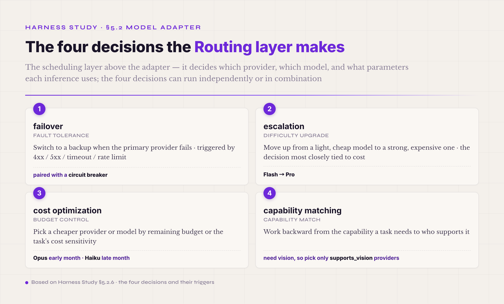

# 5.2 Model Adapter & Routing · **P0 (the adapter boundary) / P1 (multi-provider abstraction + Routing)**

The Model Adapter is the isolation layer between the harness and external model APIs. It wraps the details of calling a model behind one internal interface, so the code above never touches a vendor SDK directly. Routing is the scheduling layer above the Adapter: for each inference, it decides which provider to call, which model, and with what parameters. Together they answer one engineering question: **how does a harness survive API upgrades, vendor switches, and capability jumps without rewriting business code at scale?** The question looks minor, but it decides whether the harness stays maintainable in the long run. Done well, the harness barely changes however the model ecosystem moves in a year. Done badly, one API upgrade forces the whole team to rewrite.

#### 5.2.0 Terms first used in this section

§I–§IV already explained the basics of Model Adapter & Routing — in the intern analogy, this is the mechanism that gives the intern power and a time clock. This section goes deeper into the engineering. Listed here are only the terms that appear for the first time in §5.2.

**The Adapter engineering pattern** — **Adapter design pattern** (a classic software design pattern · a translation layer between two incompatible interfaces, so the code above never deals with the details below · a standard pattern in Java, C#, and Python · the agent harness uses it to isolate vendor differences).

**Interface-shape terms** — **completion** (everything one model inference produces: output text, tool calls, token usage, a finish reason, and so on · field names vary slightly across SDKs). **streaming** (the protocol for returning tokens while the model is still generating · SSE is the common format · exact fields and event names vary by vendor).

**Routing terms** — **failover** (when the primary provider fails, switch automatically to a backup · triggered by 4xx client errors, 5xx server errors, timeouts, and rate limits). **escalation** (move from a light model to a strong one based on task difficulty or current progress · Flash decides it can't cope, so the run escalates to Pro · the routing decision most closely tied to cost). **cost optimization** (choose a cheaper provider, or a cheaper model within the same provider, based on remaining budget or the task's cost sensitivity). **capability flag** (boolean fields that record what each provider or model supports — supports_tool_use, supports_vision, supports_streaming, and the like · lets the harness check support before calling). **capability matching** (work backward from the capabilities a task needs to the providers that have them · a task that needs vision only selects vision-capable models). **circuit breaker** (a classic software pattern · after a provider fails N times in a row, stop trying it for a while and go straight to the backup · prevents failure cascades).

**The two roads of multi-provider abstraction** — **lowest common denominator** (one strategy: expose only what every provider supports · simplest, best compatibility · loses each vendor's differentiated capabilities). **full-feature exposure + capability flags** (the other strategy: expose everything, and let the caller check the flags · keeps the differentiation, at the cost of a more complex interface and a check burden on the caller · what most production harnesses choose).

One connection is worth pointing out before we go on. The Adapter boundary and the protocol-layer invariant at the end of §5.1 are two faces of the same thing. The Adapter is the sending side: every request the system sends to a model has to be serialized into some wire protocol. The inner loop is the receiving side: every tool_call in the model's reply has to be parsed out of some wire protocol. OpenAI, Anthropic, and DeepSeek V4 strict each use a different wire format, and both ends have to absorb the differences — the Adapter when sending, the inner loop's protocol layer when receiving. If you reread the end of §5.1 together with this section, the boundary between Agent Loop and Model Adapter becomes clear: the two mechanisms are the two sides of the same seam, the place where the harness meets the outside model vendor.

#### 5.2.1 What problem it solves · the concrete engineering cost of every API being different

Every model API looks the same on the surface: you send a prompt, you get a completion. In the details, every vendor speaks its own dialect. Take tool calling. OpenAI puts the calls in a `tool_calls` field. Anthropic returns a `tool_use` block inside the message content. Google Gemini nests a `function_call` inside the candidate. Some Chinese models keep `function_call` to stay close to the old OpenAI format; others define their own. Token billing is messier, because here the vendors disagree on definitions, not just names. Does a cache hit count as input tokens? Do reasoning tokens count as output? How is a cached image billed? Each vendor answers these questions differently, so the same conversation sent to OpenAI and to Anthropic can come back with noticeably different total cost — the gap comes from the definitions, not the prices. The reasoning channel is even less consistent. OpenAI's o1 and o3 return only a summary of the model's thinking. Anthropic's Claude returns part of it. DeepSeek R1 returns all of it. The Qwen series behaves differently from version to version. Even streaming, which is nominally SSE everywhere, differs in event names, chunk granularity, and termination signals; a stream parser written for OpenAI breaks on Anthropic.

If business code imports the openai or anthropic SDK directly, all of these differences seep into every call site. Switching vendors then means touching every one of them. A field access like `response.choices[0].message.tool_calls` carries the provider's mark; for Anthropic it has to become `response.content[0].input`, a completely different path. And the trigger does not have to be a vendor switch, because model APIs change on their own. Anthropic took its tool use interface through two major versions between 2023 and 2026. OpenAI renamed function calling to tool calling and changed the field structure at the same time. One vendor after another added prompt caching, reasoning channels, vision, and parallel tool calls, and every addition changed an SDK. **Without an Adapter boundary, every model-API upgrade drags the whole harness with it.** That is why this mechanism exists.

#### 5.2.2 The shape of the core interface · what a minimal ModelAdapter looks like

A minimal usable ModelAdapter interface looks roughly like this:

```
ModelAdapter.complete(messages, tools, params) -> Completion

Completion {
  content: string,           // output text
  tool_calls: ToolCall[],    // tools the model decided to call
  usage: TokenUsage,         // input / output / cache / reasoning token counts
  finish_reason: enum,       // stop / tool_use / length / safety / ...
  reasoning: string?,        // a reasoning model's thinking content · optional
}
```

On the input side, `messages` is a unified conversation-history format covering the system, user, assistant, and tool roles; `tools` is a unified list of tool schemas; `params` carries temperature, max_tokens, thinking_budget, and the other parameters. On the output side, `Completion` is a single unified struct. Whether the call went to OpenAI, Anthropic, Gemini, DeepSeek, or Qwen, business code receives a Completion with the same fields.

The design idea behind this interface is to **unify the shape and keep the necessary differences.** content, tool_calls, usage, and finish_reason exist on every provider, so they are unified without exception. reasoning exists only on reasoning models, so it is optional: code that uses the thinking channel checks whether the field is present, and code that does not use it never notices it. The difference is preserved without polluting every call site. finish_reason does the same thing at the value level. Each provider names the values differently — OpenAI uses `stop`, Anthropic uses `end_turn` — so the Adapter maps them internally and business code sees one unified enum. usage normalizes all the token categories — cache-hit tokens, reasoning tokens, cached image tokens — into one TokenUsage structure, so the cost dashboard does not need a separate parser for each vendor.

#### 5.2.3 Design tradeoff 1 · even a single provider needs the Adapter boundary

Many harness projects start with the same instinct: "We only use Anthropic. We don't do failover or multi-provider. What is the Adapter abstraction for? Why not import the anthropic SDK directly?" The instinct is wrong. **Even with a single vendor, the Adapter boundary is still P0.**

There are three reasons. First, the model API changes by itself. Anthropic has taken its tool use interface through two major versions, changed the field structure several times, and changed the usage field when prompt caching arrived. If business code imports the SDK directly, every call site has to follow every upgrade. With the boundary, an upgrade changes one Adapter file and business code does not move. Second, the model ecosystem changes around you. In May 2026 you may be certain that Anthropic is all you will ever use, and half a year later discover that one specific task is cheaper on Qwen 3 Plus, or that Claude Code's mainline added a capability you want to try, or that a high-uptime deployment now needs multi-provider failover. With the boundary, each of these means writing one new Adapter implementation. Without it, each means going back into the business code. Third, testing becomes easier. Business code written against the Adapter interface can be tested with a mock Adapter, including the edge cases. Code that imports the SDK directly forces the tests to mock the whole SDK, which is painful and easy to get wrong.

Claude Code binds to a single model family — Claude — which looks like the extreme case of "we only use one vendor." But that one family alone arrives through four provider channels: the Anthropic API directly, AWS Bedrock, Google Vertex AI, and Microsoft Foundry, each with different auth, endpoints, and model IDs. So inside its codebase every API call is wrapped in its own adapter class. Business code talks to that class; nothing calls `anthropic.Anthropic().messages.create(...)` directly. It is the readiest living proof that even a single model family needs an Adapter boundary: you think you've locked into one vendor and don't need the abstraction, and enterprise deployment requirements bring the extra channels right back. This habit — always pull an external dependency behind an internal interface, and never let its details leak into business code — is the clearest code-level difference between an industrial harness and a toy. **The Adapter boundary is a one-time investment with a large long-term return.**

#### 5.2.4 Design tradeoff 2 · the two roads of multi-provider abstraction

Once a harness has to support several providers — for failover, for A/B model comparison, for cost optimization, or for capability matching — multi-provider abstraction becomes a design problem you have to settle. There are two engineering roads, and industrial harness design has debated their tradeoffs for years.

The first road is the **lowest common denominator**: the interface exposes only what every provider supports. If every provider has the four basic fields — content, tool_calls, usage, finish_reason — then the interface exposes exactly those four. reasoning, which only reasoning models have, stays out of the interface. So does prompt caching, which mainly Anthropic promotes. The advantages are a simple interface, a clean implementation for every provider, and no capability checks in the calling code. The disadvantage is that **every vendor's differentiated capability is lost.** On Anthropic you give up the benefit of prompt caching; on OpenAI's o1 you give up the reasoning channel; on Gemini you give up the 2M-context advantage. The lowest common denominator buys compatibility by cutting away exactly the features most worth using in each vendor.

The second road is **full-feature exposure plus capability flags**: the interface exposes the full field set — reasoning, cache, vision, and the rest of the differentiated capabilities — and capability flags let the calling code check what the current provider supports. `adapter.capabilities.supports_reasoning` records whether a reasoning channel exists, and the caller checks the flag before using it. The advantage is that **the differentiation is preserved** — prompt caching is available when you run on Anthropic, and the thinking channel is available when you run on a reasoning model. The cost is a more complex interface: every differentiated capability needs a check before use, and the Adapter implementation has to decide what happens when a capability is requested from a provider that does not have it.

Most production harnesses take the second road. The reason goes back to what a harness is for: a harness exists to get the most out of every model it mounts, not to cut every model down to a common floor in the name of unity. The lowest common denominator is simple, but it gives up that core value. Full exposure is more complex, but it keeps the room for the agent to perform at its best on every vendor. LiteLLM, Pydantic AI, and the other open-source multi-provider libraries take the second road. So do Claude Code and Codex CLI — single-provider products that keep an internal Adapter anyway. Even with one vendor, the flags remain useful: business code can read them to decide whether to use prompt caching or reasoning.

#### 5.2.5 Design tradeoff 3 · normalize token billing at the Adapter layer

This looks like a small issue, but it is a recurring pitfall in real engineering. Provider usage fields disagree on every definition: whether a cache hit counts as input tokens, whether reasoning tokens count as output, how a cached image is billed, how a tool call's input and output are counted. Each vendor has its own accounting rules. If the Adapter does not normalize them, the cost dashboard receives usage data that cannot be compared across providers, and the budget alarm fires false positives on some providers while missing real overruns on others.

The engineering practice is simple. At its exit, the Adapter converts each vendor's usage fields into one TokenUsage structure with shared definitions: `input_tokens` is every token the model actually saw as input, cache included; `output_tokens` is the non-reasoning output the model generated; `reasoning_tokens` is counted separately; `cache_hit_tokens` is marked separately. Each provider's Adapter converts its own accounting into these shared definitions. The cost dashboard, the budget alarm, and the cost-attribution reports then all calculate from the same definitions, and comparisons across providers become meaningful.

The cost of skipping this shows up in production. You ship a new model, and a few days later you find spend running 40% over expectation. The investigation ends at a definition: this provider counts cache hits as input tokens, and your previous provider did not. One definition gap, amplified by production volume, becomes a cost drift worth thousands or tens of thousands that operations cannot trace to a root cause. Normalizing token definitions at the Adapter layer closes this trap at the source.

#### 5.2.6 ★ Routing · the four decisions the scheduling layer makes

The Adapter is the isolation layer; Routing is the scheduling layer above it. For each inference, Routing decides which provider, which model, and which parameters. Routing is much more than failover — it makes at least four kinds of scheduling decision, and each solves a different engineering problem.



*Figure 5.7 · The four kinds of decision the Routing layer makes*

**First, failover.** When the primary provider fails, switch automatically to a backup. There are four classes of trigger: 4xx client errors (failed auth, exhausted quota, malformed requests), 5xx server errors (the provider is down), timeouts (no response within the set window), and rate limits. Each class is handled differently. A 4xx is usually not worth retrying, because the fault is on the request side. A 5xx or a timeout justifies retrying the primary a few times before switching. A rate limit is best handled by waiting a few seconds and retrying, or by switching at once to a backup endpoint under a different account or region. In practice, failover is usually paired with a circuit breaker: after N consecutive failures — say 5 — the breaker trips, the primary is left alone for a while — say 60 seconds — and routing goes straight to the backup, instead of failing first and falling back on every request.

Failover also needs one boundary nailed down: **what it re-sends is the completion request, and a completion has no side effects — retry it freely**. Carry the same retry mindset down to the tool-execution layer, though, and it turns dangerous: a write-effect tool that times out in the "executed, response lost" window gets double-executed on retry — two charges, two emails sent. So retry policy must be layered: the completion layer retries freely under the four trigger classes above; the tool layer retries only with an idempotency guarantee (fingerprint each tool execution, check the execution record before replaying), or, for tools with external side effects, fails fast and hands off to a human. This line lands in 5.3, inside ToolPolicy.

**Second, escalation.** Upgrade from a cheap, light model to a strong, expensive one based on task difficulty or progress so far. The classic case is Flash → Pro escalation: start the task on something fast and cheap like Claude Haiku or GPT-4o-mini, and when a verifier fails or the agent loop gets stuck, switch to Claude Opus or o1 and redo that stretch. Typical triggers include a verifier failing more than N times, the same tool call failing more than N times, context length passing the light model's safe threshold, and specific keywords appearing ("complex," "multi-step"). Escalation is the routing decision most closely tied to cost. Switch at the right moment and the total cost of a task can be far below running the strong model from the start. Switch at the wrong moment and you pay twice: the light model's wasted run, plus the strong model's redo.

**Third, cost optimization.** Choose a cheaper provider, or a cheaper model within the same provider, based on remaining budget or the task's cost sensitivity. A typical pattern is to run Claude Opus early in the month when the budget is loose, and switch to Claude Haiku or a Chinese model when the budget runs low toward month-end. Another is to split by task type: code review needs strong reasoning and gets the strong model; document summarization is light work and gets the cheap one. To make these decisions, Routing needs input from the budget tracker and the task classifier, which makes it one of the mechanisms most closely paired with observability.

**Fourth, capability matching.** Start from what the task needs and work backward to who supports it. A task with image input only selects providers whose supports_vision flag is true. A task that needs more than 2M tokens of context only selects long-context providers. A task that wants prompt caching to save cost prefers Anthropic, currently the most mature vendor for it. Capability matching depends on the full-exposure road of §5.2.4 — the capability flags are its engineering foundation.

The four decisions can run independently or in combination. In production, the routing module is usually an independent, configurable policy layer: a set of declarative rules of the form "if X triggers, switch to provider Y," kept in configuration files rather than hard-coded, so routing behavior can be adjusted without touching code. How the routing decision is made depends on the tier. The tiers with hard determinism requirements — failover, permissions, budget — must be code: one wrong call there is an incident, the decision runs before every inference, and the latency, cost, and added uncertainty of an LLM are all wrong for the job. The difficulty/cost tier can bring in a lightweight learned router — a small classifier that judges whether a request goes to the cheap tier or the strong one. RouteLLM (LMSYS, open-sourced 2024) validated the approach, and the real-time router that ChatGPT's GPT-5 (August 2025) uses to split traffic between fast and thinking tiers is its platform-scale version. Three constraints apply: the decision reason goes into the trace for audit, it can be replayed offline, and its latency stays bounded. "Route with code, not with an LLM" still stands as the default starting point — a learned router is the upgrade tier once traffic and data have accumulated, not the opening move.

Routing precision can go one step finer. In the reasoning-model era, the thinking switch is often designed as a single on/off bool, but the steadier design splits it into a multi-tier profile policy. A three-tier structure has appeared in several reasoning-model families: non_think for fast, intuitive answers; think_high for standard logical analysis; think_max for deep reasoning pushed to the edge of the model's capability. The key insight is that these tiers are not model fields. They are policy variables at the profile level: one physical model can back several profiles, and each profile has its own usage, its own observation requirements, and its own escalation rules. The matching discipline is that the most expensive tier is the backstop, not the default starting point. A rational routing policy first proves that the light tier cannot handle the task, and only then escalates; anything else is burning money on intuition. The timing of escalation must rest on measured data, not on the instinct that a higher parameter name means a stronger result — a higher reasoning_effort overthinks some tasks and does worse on them. So before an escalation rule is written into routing, give it a minimal controlled comparison: run the same task on both tiers and compare the pass rate and the token spend.

#### Three causes of "the model didn't call the tool" · two of them sit on the Adapter seam

There is a class of incident that is frequent and hard to trace: the agent should call a tool and doesn't. The trajectory shows a stretch of text in that turn and no tool_call. The first instinct is to blame model capability or the prompt, but in practice the cause often sits on the Adapter seam. There are three causes, and the remedies are completely different.

**First, the model did call — but wrote the call into the text, not the structured field.** Some models (parts of the Chinese model family especially, or any model pulled off course by a long prompt) emit tool calls as text markup, writing `<tool_call>name<arg_key>k</arg_key><arg_value>v</arg_value></tool_call>` directly into content instead of the API's structured `tool_calls` field. If the Adapter's response parser only recognizes the structured field, the call is discarded as ordinary text. It looks like the model didn't call; in fact it is a **false negative**. The remedy is to add a regex pass for text-markup calls behind the structured field. Tool calls come in more shapes than the structured one, vendors differ widely, and the parser must not assume.

**Second, the model really didn't call, because the request didn't require it.** The default `tool_choice: auto` means the model may call or may not — if it thinks it can answer directly, it will. On turns where the tool path is required (the database must be queried, the file must be written), set `tool_choice` to `required` or `any`, or pin the specific tool, on the request side. This is a switch the Adapter sets when assembling the request, and it is the most direct defense against a missing call. It has a limit: keeping `required` on permanently forces the model to call tools where none are needed and produces noise. Treat it as a per-turn, per-scenario policy, not a global default.

**Third, the model really didn't call, because the prompt pulled it away.** This is counterintuitive but shows up repeatedly in testing: **an overlong Chinese prompt can make some models "lazy" about tools — they answer in plain text instead.** When the instruction that should trigger the tool call is wrapped inside a long stretch of Chinese explanation, some models skip the tool and answer directly. The cause is on the prompt-assembly side, which belongs to Prompt Assets; only the symptom shows up at the Adapter. The remedy is to keep the triggering instruction short and early, split up the long explanations, and not let the key instruction drown in the middle of the context.

The three causes correspond to three layers: response parsing, request parameters, and prompt assembly. When you chase a "didn't call the tool" incident, check the three in that order. It is much faster than rewriting prompts or swapping models.

#### 5.2.7 Common pitfall · the adapter boundary gets bypassed

The most common pitfall of this mechanism is **business code bypassing the adapter boundary** — importing the openai or anthropic SDK directly and calling below the abstraction.

How does it happen? Usually in one of three ways. The first is deadline pressure: an engineer in a crunch finds that three lines of direct openai import will run right now, skips the adapter's call chain, saves thirty minutes, and buries a long-term debt. The second is temporary debugging: someone calls the SDK directly to try out a new API feature, the experiment works, and the code never moves back inside the adapter, leaving a bypass behind. The third is not knowing the boundary exists: the team grows, a newcomer never hears about the adapter discipline during onboarding, and calling the SDK directly feels natural.

The cost arrives with the next upgrade. Model APIs go through one to three major versions a year, and in any codebase where business code imports the SDK directly, each version sets off large-scale edits. Through the upgrades of 2023–2026 — OpenAI renaming function calling to tool calling, Anthropic restructuring its tool use fields, prompt caching arriving vendor by vendor — projects without the adapter boundary rewrote scattered call sites every time, while projects with it changed a few adapter files.

Where is the line between pitfall and acceptable shortcut? **At the PoC stage, direct SDK imports are tolerable.** If the task is one-shot — run it, take the result, throw the code away — the model API will not upgrade before the code is discarded, and the abstraction costs more than it returns. **Anything headed for production is different.** A harness that will be maintained long-term, worked on by several people, or reused across tasks will certainly live through API upgrades, and without the boundary each upgrade is a time bomb. A PoC usually finishes in one or two weeks and can take the shortcut. But **the first job of turning a PoC into production is to build the adapter boundary and clear out every direct SDK import.** On the engineering-handoff checklist, this item is P0.

#### 5.2.8 Industry implementations and getting started

There are three typical Adapter implementation paths in the field, each with different tradeoffs. **LiteLLM** — taken here in its reverse-proxy form; it also has an in-process SDK mode — is a standalone HTTP server that exposes an OpenAI-compatible API and routes requests to the real providers underneath. The advantage is that business code never knows which provider is below, and every existing OpenAI SDK works unchanged. The cost is an extra network hop, heavier configuration and operations, and some compatibility problems with streaming. It suits many independent services sharing model access; it is less suited to the inside of a single harness. **Pydantic AI** keeps the abstraction inside the library, in three layers: a provider client, a model adapter, and an agent scheduler. The advantage is no extra network hop, complete typing, and capability flags checkable at compile time. The cost is that it is Python-only, and adding a provider means writing code, not just configuration. It suits the internals of a Python harness. **Claude Code** takes the single-provider-with-boundary path: Anthropic is built in, but every Anthropic call is wrapped in its own adapter class. The advantage is simplicity, focus, and the best performance; the cost is that switching providers means rewriting the adapter implementation. It suits a product harness committed to one vendor.

The getting-started advice runs along four dimensions. **What to watch:** the biggest trap is having no boundary discipline early and trying to add it after launch, when SDK calls are already scattered through the business code. From day one, refuse direct provider-SDK imports in business code; the only import allowed is your own adapter module. **How to design:** first decide single or multi provider. Single provider takes the Claude Code shape — bound to one vendor, boundary kept anyway. Multi provider takes LiteLLM or Pydantic AI. Design the interface on the full-exposure road with capability flags, not the lowest common denominator, and normalize usage fields at the adapter layer. **How to test:** write a contract-test suite for the adapter interface — every provider implementation has to pass the same suite — covering capability-flag accuracy, usage normalization, and failover triggers. Run business-code unit tests against a mock adapter, so the business code never depends on one provider's behavior. **What to put in the prompt:** the agent does not need to know about the adapter itself; that is the harness engineer's concern. It does need to know what the current model can do, how much budget remains, and whether failover has just moved it onto an unfamiliar model. Inject this through the system prompt, or expose it through a tool interface.

Model Adapter & Routing looks like an engineering detail, but it is the foundation of a harness's ability to outlive changes in the model ecosystem. In a single year, the model APIs upgrade at least two or three times, at least five to ten new models appear, and the capability map shifts once or twice. Without this mechanism, every change drags the harness into a rewrite. With it, most changes are settled inside one or two files. That is the combined value of the Adapter boundary and Routing: a measure of immunity to model-ecosystem change.
