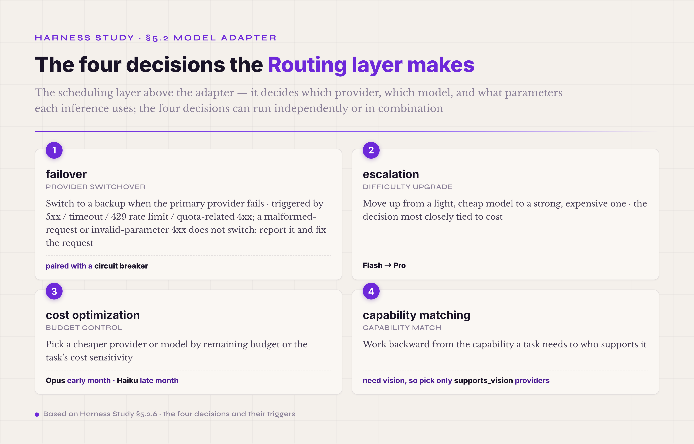

# 5.2 Model Adapter & Routing · **P0 (the adapter boundary) / P1 (multi-provider abstraction + Routing)**

The second mechanism, the Model Adapter, is the isolation layer between the harness and external model APIs. It wraps the details of calling a model behind one internal interface, so the code above never touches a vendor SDK directly. Routing is the scheduling layer above the Adapter: for each inference, it decides which provider to call, which model, and with what parameters. Together they answer one engineering question: **how does a harness survive API upgrades, vendor switches, and capability jumps without rewriting business code at scale?** The question looks minor, but it decides whether the harness stays maintainable in the long run. Done well, the harness barely changes however the model ecosystem moves in a year. Done badly, one API upgrade forces the whole team to rewrite.

#### 5.2.0 Terms first used in this section

§I–§IV already explained the basics of Model Adapter and Routing; this section goes deeper into the engineering. In the intern analogy of §III, these two mechanisms are "power and a time clock." The power stands for the Adapter: whichever vendor's model is plugged in, it gives the intern a steady connection to a "brain," and it absorbs the differences between vendor interfaces. The time clock stands for Routing and usage accounting: it records which model each call went to and what it cost, and uses that record to decide where the next call connects. Listed here are only the terms that appear for the first time in §5.2.

**Adapter terms**
- **Adapter pattern**: a software design pattern that puts a translation layer between two incompatible interfaces, so the code above never deals with the details below. It is common in Java, C#, Python, and other languages; an agent harness uses it to isolate the differences between model vendors.
- **completion**: everything one model inference produces, including fields such as the output text, tool calls, token usage, and finish reason. Field names vary slightly across SDKs.
- **streaming**: the protocol by which the model returns tokens piece by piece while it is still generating. SSE is the common format, and the exact fields and event names vary slightly by vendor.

**Routing terms**
- **failover**: when the primary provider fails, switch automatically to a backup provider. Switching makes sense for 5xx server errors, timeouts, 429 rate limits, and some quota-related 4xx errors (for example, one account has used up its quota, so you can move to another account or another provider). 4xx errors such as a malformed request or invalid parameters come from the request itself. Switching providers won't help; report the error and fix the request.
- **fallback**: the backup provider or model a request goes to when the primary path fails or its circuit breaker is open. Failover answers "when to switch"; fallback answers "where to switch to."
- **circuit breaker**: a classic software engineering pattern. When a provider's consecutive failures reach a threshold, the breaker "opens," and for a cooldown period requests to that provider fail fast without actually being sent. After the cooldown, a small number of requests go through as probes (half-open), and if they succeed, normal traffic resumes. The breaker's only job is to stop sending requests to a downstream that is already broken, which keeps failures from cascading. Where the requests go instead is up to fallback.
- **escalation**: move from a light model to a strong one based on task difficulty or current progress. For example, when Flash judges that a task is beyond its ability, the run escalates to Pro. This is the routing decision most closely tied to cost.
- **cost optimization**: during routing, actively choose a cheaper provider, or a cheaper model within the same provider, based on the current budget or how cost-sensitive the task is.
- **capability flag**: boolean fields that record which capabilities each provider or model supports, such as `supports_tool_use`, `supports_vision`, and `supports_streaming`. They let the harness check, before calling, whether the current provider supports what it needs.
- **capability matching**: during routing, work backward from the capability flags the current task needs to the models that can handle it. For example, a task that needs to read images only selects models that accept visual input.

**The two roads of multi-provider abstraction**
- **lowest common denominator**: the interface exposes only the capabilities every provider supports. It is simple and has the best compatibility, but it loses each vendor's differentiated capabilities.
- **full-feature exposure + capability flags**: the interface exposes every provider's capabilities in full, and capability flags let the caller check whether the current provider supports a given capability. It keeps the differentiated capabilities, at the cost of a complex interface and a heavier checking burden on the caller. Most production harnesses take this road.

The Adapter boundary and the protocol-layer invariant at the end of §5.1 (every tool_call must be immediately followed by its matching tool_result) are the two sides of one seam. They divide the work as follows:

- **The Adapter translates in both directions**: when sending a request, it converts the harness's internal unified format into each provider's wire format; when receiving a response, it parses each provider's format into the unified Completion. The wire-format differences among OpenAI, Anthropic, and DeepSeek V4 strict are all absorbed inside the Adapter.
- **The inner loop only checks pairing**: what it receives is already in the unified format, so it never touches a vendor format. Its only job is to check that every tool_call and tool_result pair is complete.

If you reread the protocol-layer passage at the end of §5.1 alongside this section, the boundary between Agent Loop and Model Adapter becomes easier to line up: the two mechanisms are the two sides of the same seam, the place where the harness deals with outside model vendors.

#### 5.2.1 What problem it solves · the concrete engineering cost of every API being different

Every model API looks the same on the surface: you send a prompt, you get a completion. In the details, every vendor speaks its own dialect.

- **Tool-call field names differ**: OpenAI puts the calls in a `tool_calls` field. Anthropic places a `tool_use` block type among the message's content blocks. Google Gemini calls it `function_call` and nests it inside the candidate. Among Chinese models, some keep the old OpenAI `function_call`, and others define their own.
- **Token billing is counted in even messier ways**: does a cache hit count as input tokens? Do reasoning tokens count as output? How is a cached image input billed? Each vendor defines these differently. Send the same conversation to OpenAI and to Anthropic, and the total cost can differ by a noticeable amount; the gap comes from how usage is counted, not from the prices.
- **The reasoning channel is split**: OpenAI's o1 and o3 return only a summary, not the full thinking process. Anthropic's Claude returns part of its thinking. DeepSeek R1 returns all of it. The Qwen series differs from version to version.
- **Streaming protocols are not uniform**: nominally they are all SSE, but event names, chunk granularity, and termination-signal formats all differ. A stream parser written for OpenAI fails outright when run against Anthropic.

If business code in the harness imports the openai or anthropic SDK directly to call a model API, all of these differences seep into every part of the business code. Switching vendors then means touching every call site. A provider-specific field access like `response.choices[0].message.tool_calls` has to become `response.content[0].input` for Anthropic, a completely different path. Worse, model APIs change on their own. Anthropic's tool use interface changed between public beta and general availability, and later gained new fields for caching and thinking. OpenAI renamed function calling to tool calling and changed the field structure at the same time. Vendors have also kept adding new capabilities such as prompt caching, reasoning channels, vision input, and parallel tool calls, and every SDK upgrade means changing code. **Without an Adapter boundary, every model-API upgrade drags the whole harness with it.** That is the engineering reason this mechanism exists.

#### 5.2.2 The shape of the core interface · what a minimal ModelAdapter looks like

A minimal usable ModelAdapter interface looks roughly like this:

```
ModelAdapter.complete(messages, tools, params) -> Completion

Completion {
  content: string,           // output text
  tool_calls: ToolCall[],    // tools the model decided to call
  usage: TokenUsage,         // input / output / cache / reasoning token counts
  finish_reason: enum,       // stop / tool_use / length / safety / ...
  reasoning: string?,        // a reasoning model's thinking content · optional
}
```

On the input side, `messages` is a unified conversation-history format covering the system, user, assistant, and tool roles; `tools` is a unified list of tool schemas; `params` carries temperature, max_tokens, thinking_budget, and the other parameters. On the output side, `Completion` is a single unified struct. Whether the call went to OpenAI, Anthropic, Gemini, DeepSeek, or Qwen, business code receives a Completion with the same fields.

The design idea behind this interface is to **unify the shape and keep the necessary differences.**

- `content`, `tool_calls`, `usage`, and `finish_reason` exist on every provider and must be unified.
- `reasoning` exists only on reasoning models, so it is an optional field. Marking it optional preserves the difference without polluting every call site. Business code checks whether the field is present only when it uses reasoning; code that doesn't use reasoning never notices it.
- `finish_reason` is an enum whose concrete values differ by provider (OpenAI uses `stop`, Anthropic uses `end_turn`). The Adapter maps them while parsing the response, so business code sees one unified set of enum values.
- `usage` normalizes every token category (cache-hit tokens, reasoning tokens, cached image tokens, and so on all go into one TokenUsage structure), so the cost dashboard does not need a separate parser for each vendor.

All of these mappings are part of the Adapter's response parsing, the response side of the two-way translation described above.

#### 5.2.3 Design tradeoff 1 · even a single provider needs the Adapter boundary

Many harness projects start with the same instinct: "We only use Anthropic. We don't do failover or multi-provider. What is the Adapter abstraction for? Why not import the anthropic SDK directly?" The instinct is wrong. **Even with a single vendor, the Adapter boundary is still P0.**

There are three reasons.

1. **The model API changes by itself.** Anthropic's tool use interface has been revised, its field structure has changed several times, and the usage field gained several new entries when prompt caching arrived. If business code imports the anthropic SDK directly, every call site has to follow every API upgrade. With an Adapter boundary, an upgrade changes one Adapter file and business code does not move.
2. **The model ecosystem changes around you.** In May 2026 you may be certain that Anthropic is all you will use. Half a year later you might find that one specific task is more cost-effective on the Chinese model Qwen 3 Plus, or want to try a new capability Claude Code is promoting, or discover that a high-availability deployment needs multi-provider failover. Without an Adapter boundary, each of these means going back to make invasive changes to the business code. With one, adding a new provider just means writing a new Adapter implementation.
3. **Testing and mocking get easier.** Business code written against the Adapter interface can be tested with a mock Adapter across all kinds of edge cases. Code that imports the SDK directly forces the tests to mock the whole SDK, which is tedious and easy to leave gaps in.

Claude Code binds to a single model family, Claude, which looks like the extreme case of "we only use one vendor." But that one family alone arrives through four provider channels: the Anthropic API directly, AWS Bedrock, Google Vertex AI, and Microsoft Foundry, each with different auth, endpoints, and model IDs. So inside its codebase every API call is wrapped in its own adapter class. Business code talks to that class; nothing calls `anthropic.Anthropic().messages.create(...)` directly. It is the most ready-made example of why even a single model family needs an Adapter boundary: you think you've locked into one vendor and don't need the abstraction, and enterprise deployment requirements bring the extra channels right back. This is defensive engineering: always pull an external dependency behind an internal interface, and never let its details leak into business code. At the code level, it is the clearest difference between an industrial harness and a toy one. **The Adapter boundary is a one-time investment with a large long-term return.**

#### 5.2.4 Design tradeoff 2 · the two roads of multi-provider abstraction

Once a harness has to support several providers (whether for failover, A/B model comparison, cost optimization, or capability matching), multi-provider abstraction becomes a design problem you have to settle. There are two engineering roads: the lowest common denominator, and full-feature exposure plus capability flags. Industrial harness design has debated their tradeoffs for years.

The first road is the **lowest common denominator**: the Adapter interface exposes only what every provider has in common. For example, every provider has four basic fields (content, tool_calls, usage, finish_reason), so the Adapter interface exposes only those four. reasoning, which only reasoning models have, stays out of the interface. So does prompt caching, which every vendor offers but each implements and bills differently. The advantages are the simplest possible interface, a clean implementation for every provider, and no capability checks in the calling code. The disadvantage is that **every vendor's differentiated capability is lost.** On Anthropic you can't set cache breakpoints explicitly; on OpenAI's o1 you can't get the reasoning channel; on Gemini you can't use the 2M-context advantage. The lowest common denominator buys compatibility by cutting away exactly the features most worth using in each vendor.

The second road is **full-feature exposure plus capability flags**: the Adapter interface exposes the full field set (including reasoning, cache, vision, and the other differentiated capabilities), and capability flags let the calling code check what the current provider supports. The boolean `adapter.capabilities.supports_reasoning` records whether the current provider has a reasoning channel, and the caller checks it before using that channel. The advantage is that **every provider's differentiated capabilities are preserved**: each vendor's own controls for prompt caching are available, and so is the thinking channel when you run on a reasoning model. The cost is a more complex interface. The calling code has to run a capability check before every use of a differentiated capability, and the Adapter implementation has to decide what happens when a caller passes in a capability the current provider does not support.

Most production harnesses take the second road. The reason goes back to what a harness is for: a harness exists to get the most out of every model it mounts, not to cut every model down to a common floor in the name of unity. The lowest common denominator is simple, but it gives up that core value. Full exposure is more complex, but it keeps the room for the agent to perform at its best on every vendor. LiteLLM, Pydantic AI, and other open-source multi-provider libraries take the second road. So does Claude Code, a product aimed at a single model family that still keeps an internal Adapter. Even with one vendor, the flags remain useful: business code can read them to decide whether to use prompt caching or turn on reasoning.

#### 5.2.5 Design tradeoff 3 · normalize token accounting at the Adapter layer

This looks like a small issue, but it is a recurring pitfall in real engineering. Provider usage fields disagree on every definition: whether a cache hit counts as input tokens, whether reasoning tokens count as output, how a cached image is billed, how a tool call's input and output are counted. Each vendor has its own accounting rules. If the Adapter does not normalize them, the cost dashboard receives usage data that cannot be compared across providers, and the budget alarm fires false positives on some providers while missing real overruns on others.

In practice, the Adapter converts each vendor's usage fields at its exit into one `TokenUsage` structure with shared definitions. For example, you might fix these rules:

- `input_tokens` is every input token the model actually saw, cache included;
- `output_tokens` is the non-reasoning output the model generated;
- `reasoning_tokens` is counted separately;
- `cache_hit_tokens` is marked separately.

Each provider's Adapter converts its own accounting rules into these shared definitions internally. The cost dashboard, the budget alarm, and the cost-attribution reports then all calculate from the same definitions, and only then do comparisons across providers mean something.

The cost of skipping normalization is especially hard to trace in production. You ship a new model, and a few days later you find spend clearly above expectation. Only on review do you discover that this provider counts cache hits as input tokens, while your previous provider did not. One difference in accounting, amplified by large call volumes, becomes a sizable cost drift whose root cause operations will struggle to find. Normalizing token accounting at the Adapter layer stops this class of problem at the source.

#### 5.2.6 ★ Routing · the four decisions the scheduling layer makes

The Adapter is the isolation layer; Routing is the scheduling layer above it. For each inference, Routing decides which provider, which model, and which parameters. Routing is much more than failover. It makes at least four kinds of scheduling decision, and each solves a different engineering problem.



*Figure 5.7 · The four kinds of decision the Routing layer makes*

**First, failover.** When the primary provider fails, switch automatically to a backup provider. Different errors are handled differently:

- **5xx server errors and timeouts**: the problem is on the provider's side. Retry the primary a few times first, then switch to the backup.
- **429 rate limits**: wait a few seconds and retry the primary, or switch at once to a backup endpoint under a different account or region.
- **Quota-related 4xx errors** (such as an account that has used up its quota): switch accounts or providers, and raise an alert at the same time so someone tops up the quota.
- **4xx errors for malformed requests or invalid parameters**: the fault is in the request itself, so retrying and switching are both useless; another provider will most likely fail the same way. Report the error and fix the request. An authentication failure is a configuration problem. It also calls for an alert and a configuration fix, not a switch that hides it.

In practice, failover is usually paired with a circuit breaker. When a provider's consecutive failures reach a threshold (say 5; a rule of thumb; adjust to your scenario), the breaker opens. During the cooldown (say 60 seconds), requests to that provider fail fast, and routing goes straight to the backup provider that fallback designates. This avoids failing once and then switching on every request, which wastes latency for nothing. After the cooldown, a few requests go through to probe whether the primary has recovered. Keep the two roles apart: the circuit breaker decides whether to keep sending requests to the primary, and fallback decides where to send them if not.

Failover also needs one boundary spelled out: **what it re-sends is the completion request; a completion has no side effects, so it can be retried freely**. Carry the same retry approach down to the tool-execution layer, though, and it turns dangerous. A write tool that times out in the "executed, not yet returned" window gets executed twice on retry (two charges, two emails sent). So retry policy must be layered. The completion layer retries or switches according to the error classes above. The tool layer retries only with an idempotency guarantee (give each tool execution a request fingerprint, and check the execution record before replaying), or, for tools with external side effects, fails fast and hands off to a human. This rule is implemented in the ToolPolicy of §5.3, the independent policy object attached to each tool.

**Second, escalation.** Upgrade from a light, cheap model to a strong, expensive one based on how complex the task is or how far the agent has gotten. The classic case is escalating from a Flash-class model to a Pro-class one: start the task on something cheap and fast like Claude Haiku or GPT-4o-mini, and when a verifier fails or the agent loop gets stuck, switch to a strong but expensive model like Claude Opus or o1 and rerun that stretch. Triggers include:

- a verifier failing more than N times;
- tool calls repeating the same failure more than N times;
- context length passing the light model's safe threshold;
- specific keywords appearing ("complex," "multi-step"), and so on.

Escalation is the routing decision most closely tied to cost. Done well, it can make a task's total cost far lower than running the strong model from start to finish. Done badly, with the switch at the wrong moment, it costs you twice: the light model's wasted run, plus the strong model's rerun.

**Third, cost optimization.** Choose a cheaper provider, or a cheaper model within the same provider, based on remaining budget or the task's cost sensitivity. A typical pattern is to run Claude Opus early in the month when the budget is loose, and switch to Claude Haiku or a Chinese model when the budget runs low toward month-end. Another is to split by task type: code review needs strong reasoning and gets the strong model; document summarization is light work and gets the cheap one. To make these decisions, Routing needs input from the budget tracker and the task classifier, which makes it one of the mechanisms most closely paired with observability.

**Fourth, capability matching.** Start from what the task needs and work backward to who supports it. A task with image input only selects providers whose `supports_vision` flag is true. A task that needs more than 2M tokens of context only selects long-context providers. A task that relies on prompt caching to save cost prefers the provider whose caching mechanism and billing best fit its call pattern (Anthropic, OpenAI, and Gemini all offer caching, but they implement and bill it differently). Capability matching goes hand in hand with the "full-feature exposure + capability flags" road of §5.2.4; the capability flags are the engineering foundation of this decision.

The four routing decisions can run independently or in combination. In production, the routing module is usually an independent, configurable policy layer: a set of declarative rules of the form "if X triggers, switch to provider Y." Routing behavior is not hard-coded, so it can be adjusted through configuration files.

How a routing decision should be made depends on its kind.

- **Decisions with hard determinism requirements (failover, permissions, budget) must be made in code.** One wrong call here is an incident, and the decision runs before every inference. Handing it to an LLM adds new uncertainty, and the latency and cost aren't worth it either.
- **Difficulty and cost decisions can bring in a lightweight learned router.** A small classifier judges whether a request should go to the cheap model or the strong one. RouteLLM[^routellm-2024] (LMSYS, open-sourced in 2024) validated this approach in research. Platform products do similar real-time routing: ChatGPT's GPT-5 ([released August 2025](https://openai.com/index/introducing-gpt-5/)), for example, splits requests in real time between a fast model and a thinking model. A learned router comes with three constraints: its decision reasons go into the trace so they can be audited, it can be replayed offline, and its latency stays under control.

"Route with code, not with an LLM" still stands as the default starting point. A learned router is an advanced step to take once traffic and data have built up, not the opening move.

The design of the Routing layer can go one step further. In the reasoning-model era, the thinking on/off switch is often designed as a single boolean, but a steadier design splits it into a multi-tier profile policy. A three-tier structure such as non_think (fast, intuitive answers), think_high (standard logical analysis), and think_max (deep reasoning pushed to the edge of the model's capability) has appeared in several reasoning-model families. The point is that these tiers are not model fields. They are policy variables at the profile level: one physical model can back several profiles, and each profile has its own usage, its own observation requirements, and its own rules for escalating and de-escalating. The matching engineering principle is that the most expensive tier is the backstop, not the default starting point. A rational routing policy first proves that the light tier cannot handle the task, and only then moves up to a stronger tier; anything else is burning money on intuition. The timing of escalation must rest on measured data, not on the intuition that a higher parameter value means a stronger result. A higher reasoning_effort makes the model overthink some tasks and get them wrong. So routing's escalation and de-escalation decisions need at least a minimal controlled comparison (run the same task once on each of the two tiers, then compare the pass rate and the token spend), and a rule goes into routing only once those results are in.

#### Three causes of "the model didn't call the tool" · two of them sit on the Adapter seam

There is a class of incident that is frequent and hard to trace: the agent should call a tool and doesn't. The trajectory shows a stretch of text in that turn and no tool_call. The first instinct is to blame model capability or the prompt, but in practice the cause often sits on the Adapter seam. There are three causes, and the remedies are completely different.

**First, the model did call, but it wrote the call into the text instead of the structured field.** Some models (especially certain Chinese models, and models that a long prompt has pulled off course) emit tool calls as text markup, writing `<tool_call>name<arg_key>k</arg_key><arg_value>v</arg_value></tool_call>` directly into content instead of the API's structured `tool_calls` field. If the Adapter's response parser only recognizes the structured field, the call is discarded as ordinary text. It looks like the model didn't call; in fact it is a **false negative**. The remedy is for the Adapter's response parser to add a regex extraction of text-markup calls on top of the structured field. Tool calls come in more shapes than the structured one, vendors differ widely, and the parser must not assume.

**Second, the model really didn't call, because the request didn't require it.** The default `tool_choice: auto` means the model may call or may not; if it thinks it can answer directly, it will. On turns where the tool path is required (the database must be queried, the file must be written), set `tool_choice` to `required` or `any`, or pin the specific tool, on the request side. This is a switch the Adapter sets when assembling the request, and it is the most direct defense against a missing call. It has a limit: keeping `required` on permanently forces the model to call tools where none are needed and produces noise. Treat it as a policy switched on **per turn and per scenario**, not a global default.

**Third, the model really didn't call, because the prompt pulled it away.** This is counterintuitive but shows up repeatedly in testing: **an overlong Chinese prompt can make some models "lazy" about tools, so they answer in plain text instead.** When the instruction that should trigger the tool call is wrapped inside a long stretch of Chinese explanation, some models skip the tool and answer directly. The cause is on the prompt-assembly side, which belongs to the Prompt Assets mechanism; only the symptom shows up at the Adapter. The remedy is to keep the triggering instruction short and early, split up the long explanations, and not let the key instruction drown in a long context.

The three causes correspond to three layers: response parsing, request parameters, and prompt assembly. When you chase a "didn't call the tool" incident, check the three in that order. It is much faster than rewriting prompts or swapping models.

#### 5.2.7 Anti-pattern · the adapter boundary gets bypassed

The most common anti-pattern for this mechanism is **business code going around the adapter boundary and breaking it**: business code imports the openai or anthropic SDK directly, skips the adapter abstraction layer, and calls the underlying SDK.

This anti-pattern usually comes from one of three causes.

1. **Deadline pressure.** An engineer racing a deadline thinks, "If I import openai directly, it runs in three lines of code. Why go through the adapter's complicated call chain?" That saves half an hour and leaves behind a long-term debt.
2. **Temporary debugging.** During development, someone calls the SDK directly to try out a new API feature, forgets to move the code back inside the adapter once it works, and leaves behind a stretch of code that bypasses the adapter.
3. **Not knowing the adapter boundary exists.** As the team grows and new people join, if onboarding never mentions the adapter-boundary rule, newcomers will naturally call the SDK directly.

Here is what this anti-pattern costs. In any harness codebase that lets business code import the openai or anthropic SDK directly, every major version of a model API (from experience, several a year) sets off large-scale code changes. Between 2023 and 2026, OpenAI renamed function calling to tool calling, Anthropic adjusted the field structure of tool use, and one vendor after another added prompt caching. Through each of these upgrades, projects without an adapter boundary had to change large numbers of scattered business call sites, while projects with one changed only a few adapter files.

How do you tell when this is an anti-pattern and when it can be tolerated?

- **At the PoC stage (a one-shot task, code thrown away once it runs, no maintenance), direct SDK imports are tolerable.** In this situation the model API will not upgrade before you throw the code away, and the adapter abstraction costs more than it returns.
- **Any harness headed for production, long-term maintenance, multi-person collaboration, or reuse across tasks must have an adapter boundary.** These situations will certainly go through model API upgrades, and without an adapter boundary you have planted a time bomb.

A PoC usually finishes quickly and can take the shortcut. But **the first job when a PoC moves to production is to build the adapter boundary and clear out every direct SDK import.** On the engineering-handoff checklist, this item should be P0.

#### 5.2.8 Industry implementations and getting started

There are three typical Adapter implementation paths in the field, each with different engineering tradeoffs.

- **LiteLLM**: taken here in its reverse-proxy form for comparison (it also has an in-process SDK mode). It is a standalone HTTP service that exposes an OpenAI-compatible API and routes requests internally to the real providers. The advantage is that business code never knows which provider is underneath, and every existing OpenAI SDK works unchanged. The cost is an extra network hop, heavier configuration and operations, and compatibility problems with streaming responses. It suits many independent services that all need model access; it is less suited to use inside a single harness.
- **Pydantic AI**: keeps the abstraction inside the library, in three layers: a provider client layer, a model adapter layer, and an agent scheduling layer. The advantage is no extra network hop and complete type annotations, which, together with a static type checker such as mypy or pyright, catch some misuses of capabilities and interfaces before runtime. The cost is that it is Python-only, and connecting a new provider means writing code, not just configuration. It suits the internals of a Python harness.
- **Claude Code**: takes the "single model family, adapter boundary kept anyway" path. Internally it connects to the Anthropic API, but every API call is wrapped in its own adapter class. The advantage is simplicity, focus on one vendor, and the best performance; the cost is that switching to another model family means rewriting the adapter implementation. It suits a product harness committed to one vendor.

The getting-started advice covers four areas.

- **What to watch**: the biggest pitfall with the adapter boundary is not having the rule early and discovering after launch that it has to be added, when SDK calls are already everywhere in the business code. From day one, refuse direct provider-SDK imports in business code; if something has to be imported, it can only be your own adapter module.
- **How to design**: first decide between single provider and multi provider. A single provider takes the Claude Code pattern (bound to one vendor, with the adapter boundary pulled out anyway); multiple providers take the LiteLLM or Pydantic AI pattern. Design the interface on the "full-feature exposure + capability flags" road, not the lowest common denominator, and normalize usage fields at the adapter layer.
- **How to test**: give the adapter interface a contract-test suite (every provider implementation has to pass the same suite) that verifies capability flags are accurate, usage normalization is correct, and failover triggers fire under the right conditions. Run business-code unit tests against a mock adapter, so the business code never depends on one provider's behavior.
- **What to put in the prompt**: the agent itself doesn't need to know about the adapter mechanism (the adapter is the harness engineer's concern). It does need to know what the current model can do, how much budget remains, and whether failover has moved it onto a model it isn't used to. Inject this through the system prompt, or expose it to the agent through a tool interface.

Model Adapter & Routing looks like an engineering detail, but it is the foundation that lets a harness outlast changes in the model ecosystem. From experience, within a single year model APIs upgrade several times, a batch of new models appears, and the capability map shifts. Without this mechanism, the harness needs invasive changes every time. With it, most changes are settled inside one or two files. That is the combined engineering value of the Adapter boundary and Routing scheduling: it gives the harness a measure of immunity to change in the model ecosystem.

[^routellm-2024]: RouteLLM: Learning to Route LLMs with Preference Data · arxiv 2406.18665 · Ong, Almahairi et al. (LMSYS + Anyscale) · 2024 · open-source framework at github.com/lm-sys/RouteLLM
