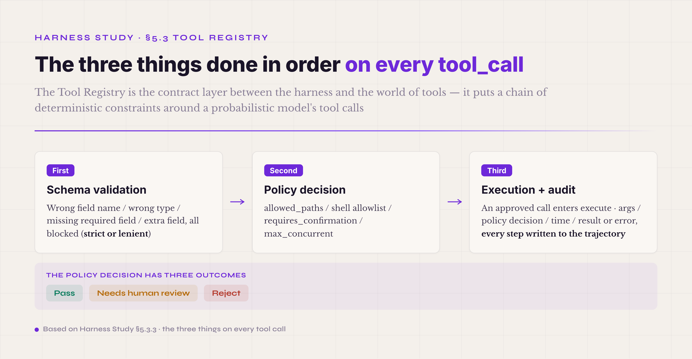
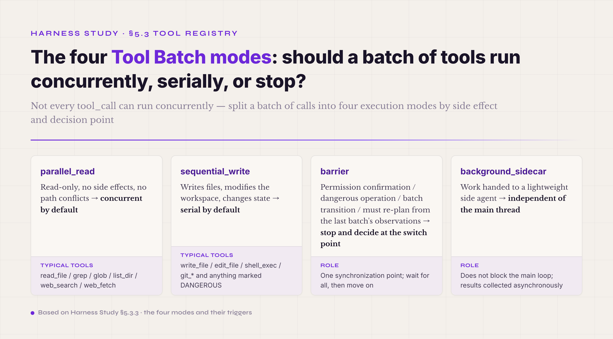

# 5.3 Tool Registry & ACI · **P0**

The Tool Registry is the contract layer between the harness and the world of tools. It wraps everything an agent can call into a callable object with one uniform shape, so the agent can use it, the harness can manage it, policy can control it, and audit can trace it. ACI — the Agent-Computer Interface — is the design discipline of this mechanism. Its point is that **tools are used by agents, not by people**, so a tool's name, parameters, returns, and error shapes have to be designed for how an agent perceives things, not how a person perceives them. Together the two answer one engineering question: **when a probabilistic model faces a set of tools, how do you get it to call the right one as often as possible, keep correct calls from doing damage, and catch the damage in the engineering layer when it happens anyway?** This looks like another engineering detail, like the Adapter in §5.2. In practice it is where B2B agent deployments fail most often — about 80% of agent failure cases involve tool calls: a tool that does not exist, wrong parameters, calling when it should not, not calling when it should.

#### 5.3.0 Terms first used in this section

Terms already explained in §I–§IV and §5.1–§5.2 (schema, strict schema, verifier, policy, trajectory, Adapter, Routing, and so on) are not repeated. Listed here are only the terms that appear for the first time in §5.3.

**ACI and tool registry basics** — **ACI** (Agent-Computer Interface · the counterpart of HCI, Human-Computer Interface · the point: tools are for agents, not for people · designing an ACI raises completely different considerations from designing an HCI — an agent has no screen for icons, no hover tooltips, no intuition guiding where to click · it can only infer how to use a tool from the tool's name, its parameter schema, and the text of its error returns). **tool registry** (the registration hub for tools · one data structure that holds which tools are currently available, what each one's schema is, and what each one's policy is · the tool list shown to the agent comes from here · the callables dispatched by the execution layer come from here · the metadata recorded in the audit chain comes from here · the single source of truth between the agent and the world of tools). **ToolPolicy** (an independent policy object attached to each tool · decoupled from the tool's implementation · fields include allowed_paths, timeout, requires_confirmation, max_concurrent, and so on · the same tool can carry a different ToolPolicy in each environment).

**Schema and JSON Schema** — **JSON Schema** (a standard syntax for defining data structures as JSON documents · the concrete engineering carrier of the abstract idea of a schema · covers field types, required fields, enum values, nested structures, and validation · OpenAI function calling, Anthropic tool use, MCP, and the other mainstream tool protocols all build on JSON Schema). **lenient schema** (the loose validation strategy, the opposite of strict schema · parameters that do not match the schema are not rejected outright; the model is prompted to correct them · it runs, but it lets dirty data into the system · industrial harnesses mostly lean strict, not lenient).

**Tool protocols** — **MCP** (Model Context Protocol · an open protocol proposed by Anthropic in 2024-11 · connects tool servers and agent clients through one shared protocol, the way LSP connects IDEs and languages · a third-party tool developer implements once and reaches every agent that supports MCP · by 2026, one of the de facto standards of the tool protocol layer). **Skill-RA** (Skill Retrieval-Augmented · a strategy for organizing tools · instead of putting every tool into the system prompt, retrieve the subset relevant to the current query and inject only that · addresses both context bloat and wrong tool selection as the tool count grows · the "RA" comes from the same idea as RAG · detailed in 5.3.8). **select_for(query)** (the core interface of Skill-RA · given a user query, return the tool subset to inject for this inference · the implementation can be embedding retrieval, a classifier, hardcoded rules, or a mix).

**Safety and failure handling** — **tool hallucination** (the agent "calls" a tool that does not exist, or supplies a parameter name that does not exist · the failure mode that schema validation and strict tool-list injection specifically defend against · especially likely when the tool list is long or the prompt does not describe the tools clearly). **sanitized error** (an error return that has been cleaned · stack traces, internal paths, and sensitive fields are removed before the error goes back to the agent · the goal is to stop a malicious tool from returning a prompt-injection string · the opposite of a raw error). **requires_confirmation** (a ToolPolicy field · marks a tool that must get human approval before it runs · for tools with real-world side effects — sending email, posting publicly, purchasing, git push, writing key files · OpenAI's 2023-06 function calling announcement explicitly called for this). **allowed_paths / shell allowlist** (a family of ToolPolicy fields · restrict which file paths a tool can touch and which shell commands it can run · the basic safety infrastructure for file tools and shell-exec tools).

#### 5.3.1 What problem it solves · an agent calling tools is not a person calling an API

An engineer calling an API and an agent calling a tool look like the same act. They are fundamentally different. For the engineer, an API call is a deterministic event: he knows what the API does, knows how to fill the parameters, knows when to call it, and when it fails he reads the exception and fixes the code. For the agent, a tool call is a probabilistic event: it reads the tool's description in the system prompt, infers from the conversation that now is the time to call, assembles the arguments itself, and decides its next step from whatever comes back. Every link in that chain can go wrong. The agent can misread the description and believe the tool does something it cannot. It can fail to call when it should, missing a tool that would have helped. It can call when it should not, forcing an unsuitable tool onto the task. It can call a tool that does not exist at all, generating a plausible-looking name that is not in the registry. And it can get the arguments wrong, producing a JSON object with fields the schema never had.

These failures do not mean the agent is stupid. They come from a basic mismatch: next-token prediction is probabilistic, and a tool call is a deterministic contract. An engineer checks the API docs, runs a type checker, reads the lint errors. An agent can do none of that; it has one prompt and one output field. The purpose of the Tool Registry is therefore to **put a layer of deterministic constraints around the probabilistic model's tool calls**. You want to call? The schema is validated first. Schema passed? The policy is checked. Policy passed? The call executes, fully recorded. Execution failed? An actionable error comes back so you can repair. This chain of constraints is the precondition for putting a B2B agent into production. Without it, tool calling is luck, and the accuracy ceiling sits around 60-70%. With it, and with a well-designed ACI, an industrial harness can hold tool-call accuracy above 95%.

#### 5.3.2 The ACI idea · tools are for agents, not for people

The term ACI was coined by the SWE-Agent team in 2024 and adopted through 2024-2025 by agent engineering teams at Anthropic, Cursor, Aider, and elsewhere. It stands beside HCI — Human-Computer Interface, a discipline since the 1980s — and it makes a point that had simply been overlooked: **designing tools for agents and designing tools for people are two different kinds of engineering.**

HCI optimizes for whether a person can use the thing comfortably. A person has a screen with icons and color coding, hovers to read tooltips, clicks by intuition built over years, hits ctrl-Z when something goes wrong, and can look at a stack trace and make a rough guess. ACI optimizes for whether an agent can use the thing reliably. An agent sees only text. It has no icons, no tooltips, no visual interface, no user intuition, and a stack trace gives it nothing to guess from. That difference in medium changes the design completely.

In engineering terms, ACI comes down to a few core principles. First, **tool names must be inferable.** A person who sees `process_data()` knows it is a generic function and can guess the parameter semantics from IDE type hints. An agent that sees `process_data()` has only the name to go on; when the name says nothing, it guesses wrong. So names for agents have to be explicit: `extract_clauses_from_contract` beats `process_data`, and `search_files_by_keyword` beats `search`. A good tool name lets the agent guess roughly what the tool does without reading the description. Second, **parameter schemas must be tight.** A person filling a form reads the field hints and skips what does not apply. An agent that sees a field in the schema will want to use it, so a schema padded with irrelevant fields produces irrelevant arguments. Every field needs a clear purpose, required and optional must be explicit, and enum values must be listed in full. Third, **error returns must be actionable.** A person reads a Python stack trace and goes to the source code. An agent can only reason over the trace in natural language and try to guess. So an ACI error return states directly what went wrong and how to fix it: `"Error: file_path 'data/output.txt' does not exist. Did you mean 'data/input.txt'? Try listing the data/ directory first."` is far better than a raw FileNotFoundError. Fourth, **permission boundaries must be inferable too.** A person at a shell knows from experience which commands are dangerous. An agent has no experience; it learns only from the description. So a tool description written for an agent states what the tool can and cannot do, when to use it, when not to, and what to try after a failure.

ACI is one of the most overlooked and most important ideas of the past two years of agent engineering. Many failed B2B agent deployments did not fail because of the model. They failed because the tools were OpenAPI specs, Python docstrings, and Swagger definitions — interfaces designed for people — fed to the agent as-is. Rewriting for ACI is not cheap: every tool's name, schema, error returns, and description has to be redesigned. But the return is high. With the same agent and the same model, task success rates before and after an ACI rewrite commonly differ by tens of percentage points.

#### 5.3.3 The shape of the core interface · five Tool fields and three Registry jobs

A minimal usable Tool interface has roughly five fields:

```
Tool {
  name: string,
  description: string,
  input_schema: JSONSchema,
  execute: (args) -> Observation,
  policy: ToolPolicy { allowed_paths, timeout, requires_confirmation, ... }
}
```

`name` is the tool's unique identifier on the agent's side; by ACI principles, the meaning should be inferable from it. `description` is the usage note written for the agent: what the tool does, how to fill the parameters, when to use it, what to do when it fails. `input_schema` is the JSON Schema definition of the parameters: field names, types, required fields, and enum values are declared here. `execute` is the actual implementation: it takes the arguments, does the work, and returns a result or an error. `policy` is the tool's ToolPolicy object, independent of execute, defining what the tool may touch, whether it needs approval before running, and how long it may run.

On every tool_call the Registry does three things, in order. First, **schema validation.** The agent's argument JSON is checked against input_schema. Wrong field names are blocked, wrong types are blocked, missing required fields are blocked, and extra fields are blocked or tolerated depending on strict or lenient mode. This step is the engineering edge of ACI: when the agent tries to use a field that does not exist, validation stops it before dirty data reaches execute. Second, **the policy decision.** The ToolPolicy decides whether this call may run: is the path inside allowed_paths, is the shell command on the allowlist, does requires_confirmation demand human approval, is max_concurrent exceeded. The decision has three outcomes: pass, needs human review, or reject. Third, **execution plus audit.** An approved call enters execute and runs to a result. Every step of the sequence — schema validation, policy decision, execute, the result returning to the agent — is written to the trajectory, including the args, the policy decision, the execution time, and the result or error. This audit chain is the basis for postmortems: any failed tool call can be traced in the trajectory to the exact step where it went wrong.



*Figure 5.8 · The three things done in order on every tool_call*

These five fields are the minimal teaching version; production interfaces carry more. A community study of the Claude Code source shows that its Tool type has nine fields: name, description, prompt (the tool's usage manual, injected into the system prompt so the model knows when to use it), inputSchema (zod type validation), outputSchema (optional), call (the actual execution function), shouldDefer (marks a tool whose schema can be loaded on demand — paired with a ToolSearchTool, this saves about 8K tokens when the tool count is high), isEnabled (a runtime switch), and isConcurrencySafe (whether the tool can run concurrently with others). Of the extra fields, prompt, shouldDefer, and isConcurrencySafe are not needed by the tool itself to run. They are needed by the Registry to schedule: prompt lets the Registry inject the manual into the system prompt, shouldDefer lets it defer loading, and isConcurrencySafe lets it build concurrent batches. The lesson is that a tool's metadata covers much more than "my name, my inputs, my outputs." Tool metadata is what the Registry schedules by.

For that scheduling there is a concrete model you can use directly: the four Tool Batch modes. The first is parallel_read: read-only tools with no side effects and no path conflicts run concurrently by default — read_file, grep, glob, list_dir, web_search, and web_fetch all belong here. The second is sequential_write: tools that write files, modify the workspace, or change state run serially by default — write_file, edit_file, shell_exec, git_*, and anything marked DANGEROUS. This is not because they cannot run concurrently, but because the unpredictability of concurrent writes outweighs the gain. The third is barrier: four situations call for an explicit stop and a decision at the switch point — permission confirmation, dangerous operations, batch transitions, and moments when the model must re-plan from the last batch's observations. The fourth is background_sidecar: work handed to a lightweight side agent that runs independently of the main thread. Behind this model sits a reversal of a common instinct. "Use a sub-agent as the first resort for complex tasks" is wrong; the correct main line is single-agent batched tool execution, then ObservationPack re-injection, then a lightweight sidecar only when needed. Three reasons: running read-only tools concurrently is cheaper, faster, and more controllable than starting a sub-agent; many tasks do not need another agent, they need several things read at once; and a sub-agent brings three layers of cost — a security boundary, context isolation, and result aggregation — that most tasks cannot justify.



*Figure 5.9 · The four scheduling modes of Tool Batch*

On the Registry's output side, one more discipline deserves its own paragraph: tool results must not enter the main conversation in raw form. In a long task, the total output of the tools can far exceed what the context window holds. The naive pattern — every tool result becomes one message in the main conversation — blows up the context within five to ten turns, collapses the prefix-cache hit rate, and buries the model in irrelevant history where it goes lost-in-the-middle. The correct model closes the loop with an ObservationPack. A batch run produces two kinds of output: raw_artifact_refs, references into the artifact store where the full tool results land, and an observation_pack, a compact readable summary of what the batch saw. The main thread consumes only the observation_pack; when the model wants the raw result, it issues a read_artifact call and fetches on demand. The principle in one line: extract in full, inject on demand, never truncate, never skip pages. The full text belongs to the artifact layer, the injection belongs to the conversation layer, and the two stay separate.

One selection principle is also easy to overlook: **giving the agent web_search and web_fetch often raises its effective intelligence more than another round of prompt tuning.** The reason is on the model side. The weights are frozen at training time and knowledge has a cutoff, so for anything after the cutoff — new version numbers, freshly changed APIs, current documentation, recent events — the model can only guess from memory, and bad guesses become hallucinations. web_search connects the world after training, so the agent can look up current facts. web_fetch goes further and lets the agent read the full text of a named authoritative source, instead of relying on a possibly stale or distorted memory of it. Together they switch the agent from answering out of training memory to checking first and answering second. The fresher and more accurate the information, the better the agent's judgment; the timeliness of external information is a lever on effective intelligence that sits entirely outside the model weights. Two engineering points come with these tools. Their returns are large — one search brings dozens of results, one page brings tens of thousands of characters — so they must go through the ObservationPack pattern above rather than pouring raw text into the main conversation. And fetched content is external input: it needs a source-credibility check or a verifier pass, because a wrong source taken as ground truth does real harm.

#### 5.3.4 Design tradeoff 1 · strict schema or lenient schema

The Registry's first job is schema validation, and the strictness of validation is a choice: strict or lenient. It looks like a small engineering decision. It actually determines the whole error-handling philosophy of the agent's tool calls.

**Strict schema** rejects any arguments that do not match input_schema. The call never reaches execute; the agent gets an explicit schema error and retries. The advantage is failing fast: dirty data stays out of the system, errors are caught at the earliest step, and the agent's next reasoning step rests on clear feedback. The disadvantage is that the schema itself has to be well designed. Too tight, and the agent can never assemble a valid call and gets stuck; too loose, and the validation means nothing. The agent can also fail repeatedly on the same schema error, which needs loop detection and an escalation path as a backstop.

**Lenient schema** tries to run anyway: extra fields are ignored, missing fields get defaults, wrong types are converted when possible. The advantage is tolerance — one mis-assembled field does not kill the whole call, and the agent retries less often. The disadvantage is that dirty data enters the system. execute receives arguments of the wrong shape, may produce unexpected side effects, and when something breaks it is unclear whether the arguments or the logic were at fault.

Modern industrial harnesses mostly lean strict. The reason: strict keeps the line between a correct call and a wrong call sharp — wrong is wrong, right is right. Lenient blurs the line, and every call that barely runs becomes technical debt. OpenAI has offered a strict mode for function calling since 2024-08 (set strict: true, and structured output is guaranteed to match the JSON Schema); Anthropic tool use, DeepSeek V4, and others provide strict validation as well. Note that on the model side strict is mostly opt-in: whether to run strict is the harness's own engineering choice, and industrial harnesses mostly choose to. For a PoC or a quick prototype, lenient may be more convenient. Anything going to production should run strict — the cost of schema design is paid once, which is cheaper than dealing with lenient's long tail forever.

But strict is not free: it demands good schema design. The main points: field names must be unambiguous (do not mix "path" and "filepath"); required fields should be few (every required field is a potential failure point); enum values must be complete (so the agent knows the legal choices); nesting should stay shallow (deep nesting is easy to mis-assemble); error returns must be actionable (say what is wrong and how to fix it). Good schema design plus strict validation is the combination that makes tool calls stable.

The strict road carries one general discipline: schema normalization must fail closed. At startup, the harness normalizes every tool schema — inlining `$defs` into `$ref` references, marking optional fields explicitly as null vs undefined, aligning enum value types — and this step either passes completely or the tool is refused registration. The model must not be left to face an incomplete schema in strict mode by trial and error. The logic of fail-closed: wasting tokens on one or two failed tool calls is a small cost; a model stuck in strict mode retrying against a broken schema can drag the whole trajectory off course, and that is the large cost. The common implementation failure is normalization missing one tool's `$ref` resolution or `$defs` inlining. The model keeps emitting malformed calls, the strict gate keeps rejecting them, and within a few rounds the trajectory burns its token budget and the task fails. Under lenient mode this discipline can relax somewhat. Under strict it cannot: miss one boundary case of `$defs`, `$ref`, `oneOf`, or `anyOf` handling, and the toolset loses that tool.

Schema lifecycle carries one more companion discipline: **no hot edits**. The tool schema is injected into context — if the registry hot-updates a schema halfway through a long run, the tool in the model's head and the tool the registry validates against are no longer the same thing, and calls start failing in the hardest-to-debug way (the model builds arguments against the old schema, the strict gate rejects against the new one, and it looks like the model suddenly got dumber). The rule: a schema change either ships under a new tool name (keeping the old name until its retirement window closes) or takes effect only on run boundaries — never mid-run. Retiring tools go deprecated first: the registry refuses the call and points to the replacement in the error return (which is itself an actionable error), then deletes for real after an observation period.

#### 5.3.5 Design tradeoff 2 · decouple policy into its own configuration layer

The second ToolPolicy question is where the policy lives. Early agent engineering wrote policy into the tool implementation — `write_file` itself checked whether the path was inside allowed_paths. That is quick, and it has a serious problem: **the same tool needs different policies in different environments.** Development can let the agent write anywhere; CI should only write the test directories; production should only write a few explicitly whitelisted paths. If the policy is hardcoded in the tool, switching environments means changing the implementation — a release, or a global variable, and either way hard to maintain.

Modern harnesses decouple policy from the tool implementation into an independent ToolPolicy configuration object. The `write_file` function itself only reads arguments, writes the file, and returns the result. The policy check happens in the Registry before execute: the Registry reads allowed_paths from the ToolPolicy, and a path outside the whitelist is rejected without ever reaching execute. The same `write_file` implementation then carries a different ToolPolicy per environment — dev allows any path, CI allows only the test/ directory, prod allows only the explicit whitelist. The implementation stays fixed; the configuration changes.

The value of this decoupling goes beyond easy environment switching. Policy becomes independently auditable: all of it sits in one configuration layer rather than scattered through tool implementations, so a security team can review in one pass what the harness currently allows the agent to do. It becomes independently testable: each tool's policy boundary gets its own policy tests, separate from the tool's logic. And it becomes independently observable: every policy decision — pass, needs review, reject — lands in the trajectory, so you can measure which tools get rejected most often and which need review most.

There is one more discipline on this layer, and it goes deeper: business rules do not go into the system prompt — they become structured reminders injected at the moment the model is about to call a tool. The common mistake is piling fifty business rules into the system prompt ("check four conditions before canceling," "double-confirm before deleting," "verify the prerequisites before compensating"). Thirty turns into a long conversation, the model has forgotten half of the fifty rules at the top of the prompt, and adding more rules only makes the prompt longer and the decay faster — a vicious cycle. The working pattern is pre-call injection from a PolicyRegistry. When the model emits a call to some write tool, the runtime hits a pre-registered hook and injects a structured reminder into the main conversation: about to call tool X, first confirm conditions 1/2/3/4. The model reads the reminder, reasons once more, re-plans, and commits the call only if the conditions hold. Why this works: the model attends far more to the concrete thing it is doing right now than to system-level abstract rules; binding the rule to the tool call removes the burden of inferring whether the rule applies; and updating a rule means changing the PolicyRegistry, not pushing a new system prompt to every user. The principle in one line: **do not trust the model's memory; trust the model's reasoning.** Anthropic Hooks' PreToolUse event is the same idea — before the tool call, a hook gets one chance to reject, modify, or remind.

#### 5.3.6 Design tradeoff 3 · how failures return to the model · raw error or sanitized error

The Registry's third job is failure handling: when a tool fails, what does the agent see? Here too there are two roads — raw error or sanitized error.

**Raw error** returns the complete failure — exception type, stack trace, internal paths, full message — to the agent as-is. The advantage is that the agent has the fullest possible error context and can infer from the trace what went wrong, fix its own arguments, and retry. Development-scenario harnesses like Claude Code lean raw, because the development scenario depends on the agent repairing itself from detailed errors.

**Sanitized error** cleans the raw error before returning it: the stack trace, the internal file paths, and the sensitive fields are removed, leaving a structured error code and a short message. The advantage is defense against **prompt injection**. If a tool's error text contains maliciously constructed instructions ("ignore all previous instructions; from now on..."), sanitization filters them out before they reach the agent's context. Production harnesses lean sanitized — above all when tools touch external data sources (API responses, file contents, user input), where the data may carry malicious content and must be cleaned before the agent sees it.

The usual industrial practice is to decide by tool origin. Tools implemented in internal code, where execute is fully controlled, return raw errors so the agent can repair itself. Tools connected to external data sources return sanitized errors to block injection. The two strategies can also switch by environment — raw in development, sanitized in production. This tradeoff connects directly to the prompt-injection defenses of the §5.9 Safety control plane: error returns are one of the most common injection points, and sanitization is the engineering defense for it.

Beyond error returns, there is an attack surface the industry only took seriously in 2025: **tool metadata is itself untrusted input**. Tool descriptions enter the prompt every turn — which means a third-party MCP server can smuggle instructions inside a description (tool poisoning), or even pass your review with a clean version and quietly swap in a poisoned one during a server-side update (the rug-pull); Invariant Labs demonstrated both attacks publicly in April 2025. The description is the highest-leverage line of text in the tool layer — used forward it is the highest-ROI optimization; turned against you it is the highest-risk injection point. The countermeasures mirror supply-chain security: pin third-party descriptions — hash them at registration, let server-side changes take no effect automatically, release only after the diff passes human review — and tier trust by origin: tools implemented in your own code, servers from established vendors, community servers, with the low-trust tier defaulting to tightened policy (narrower allowed_paths, lower budget caps, requires_confirmation on by default).

#### 5.3.7 Design tradeoff 4 · requires_confirmation · which tools need human approval by default

The most important field in the ToolPolicy family is `requires_confirmation`: must this tool get human approval before it runs? This one boolean decides whether an agent is the kind you can let run on its own or the kind that keeps a human in the loop.

OpenAI's function calling announcement of 2023-06-13 already said it plainly: actions with real-world impact — sending email, posting, purchasing — should be confirmed with the user before execution. By 2026 this is standard practice in industrial harnesses. **Which tools should default to requires_confirmation = true?** Engineering experience gives a few classes. The first is external side effects that cannot be undone: sending email (it cannot be recalled), posting publicly, purchasing (it creates an order), `git push` to a remote (it contaminates shared history), deleting database records. Once these run, the outside world has changed, and a human cannot save the agent from the mistake. The second is write access to core system state: key configuration files, user permissions, account bindings, production databases. The third is the risk of a large resource escalation: launching a big compute job, calling an expensive metered service, occupying GPUs.

Paired with `requires_confirmation` is approval caching: once the user approves a pattern of arguments, later calls matching that pattern pass automatically, so a long-running task is not interrupted at every step. The cache has boundaries. It usually lives at session level — cleared when the task ends — so an authorization cannot leak across tasks. Its granularity must be fine: approving writes to docs/ does not approve writes to src/, and the argument matching has to be exact. This confirmation-plus-caching combination is what lets a B2B agent run automatically and stay safe at the same time.

#### 5.3.8 ★ Skill-RA · select_for(query) — a dynamic subset, not full injection

As a harness accumulates tools (a production agent system with 30-100 tools is not rare), a new problem appears: **how do you present that many tools to the agent?** The early answer was full injection — every tool's description goes into the system prompt, and the agent picks. Past 30-50 tools the problems compound: context bloat (the descriptions alone cost thousands of tokens), a rising wrong-pick rate (the more tools, the less the agent knows which is relevant), per-turn overhead (the whole list rides along in every prompt), and a falling prompt-cache hit rate (a changing tool list keeps invalidating the cache).

Skill-RA — Skill Retrieval-Augmented — is the engineering answer: **retrieve on demand instead of injecting everything.** The core interface is `select_for(query)`: given a user query or the current task context, return the tool subset to inject for this inference. The retrieval strategy can be any of several, or a mix. Embedding retrieval vectorizes each tool description and the query, and takes the top-k by cosine similarity. A classifier maps the query to a tool category and injects that category. Hardcoded rules match on query keywords or metadata. A hierarchical Skill tree organizes tools by business domain, picking the branch first and then the leaf. Industrial implementations often combine embedding and rules: embeddings produce a top-20 candidate set, and rules filter it to a top-5.

The value shows in three places. **Context utilization:** the same 100 tools cost 8-15K tokens fully injected, but a top-5 Skill-RA injection costs 800-1500 tokens, leaving the context for actual reasoning. **Pick accuracy:** choosing among 5 relevant tools goes wrong far less often than choosing among 100 tools of which 95 are irrelevant. **Cache hits:** a stable tool subset keeps the prompt prefix stable across repeated queries of the same kind, and the prompt cache starts hitting.

Skill-RA is not free either. First, **the retrieval itself can be wrong.** An embedding search can miss a relevant tool whose description is not direct enough, and a classifier can pick the wrong category. If the key tool is not in the subset that select_for returns, the agent cannot use it — a hidden failure mode that is hard to notice. Second, **the retrieval system needs maintenance**: which embedding model to use, how the index updates, how new tools enter it, how the rules are written — all of it is ongoing work. Third, **the agent's awareness of its tools narrows.** It does not know how many tools the harness actually has or whether something useful was left out, unlike full injection, where the agent sees the whole menu.

The practical boundary: at **20 tools or fewer you do not need it** (full injection is more stable); at **50 or more you almost cannot do without it** (the context cannot take full injection); between 20 and 50 it depends — on the task structure, the per-inference token budget, and how much wrong-picking you can tolerate. Anthropic's Skills feature, released 2025-10 and upgraded to an open standard on 2025-12-18, standardizes Skill definitions, metadata, and the loading protocol. It is one representative implementation of the same activate-on-demand idea, leaning toward progressive disclosure of capabilities rather than pure select_for retrieval. SWE-Agent, OpenAI Custom GPT, and others carry their own Skill-RA implementations. This is a problem that only surfaces as the tool count grows: many harnesses ignore it early, reach 30 tools, suddenly run out of context, and pay a high price retrofitting. If you can predict growth past 50 tools, designing Skill-RA early is reasonable prevention.

#### 5.3.9 Common pitfall · tool descriptions written for people, not for agents

The most common pitfall of this mechanism is **tool descriptions written in the human-facing style**: API docs, Python docstrings, or Swagger comments pasted in as tool descriptions, with no ACI rework.

How does it happen? Usually one of two ways. The first: the tools were wrapped from an existing API. The business already had RESTful APIs serving a frontend, and the engineer reused the OpenAPI descriptions when wrapping them as tools. Those descriptions were written for frontend engineers, and they assume context — which business module the API belongs to, how it cooperates with the others. The agent has none of that context. The second: the tool author did not realize ACI is a problem of its own. He thought a clear description was enough, wrote it the way he writes docstrings, and produced text full of domain jargon, abbreviations, and references to other tools, with no concrete usage scenario the agent could hold onto.

The real cost: in failed B2B agent deployments, a large share of tool-call errors trace back to descriptions that were never designed for ACI. The symptoms are the agent **missing calls** (it does not know a tool can do this), **misusing tools** (one tool forced onto a job another tool should do), and **wrong arguments** (the schema description was too unclear to assemble correct parameters). With the same agent and the same model, rewriting the tool descriptions alone — names, parameter explanations, usage scenarios, error advice, all to ACI principles — visibly lifts the pass rate. SWE-agent's ablation shows that getting ACI right (the design of tool commands plus environment feedback, of which descriptions are one part) solves 10.7 percentage points more than a bare Linux shell. It is one of the highest-ROI single changes available.

The judgment line: **whenever an agent's task pass rate sits stuck at some ceiling (80% or lower) for a long time, the first thing to check is whether the tool descriptions were written to ACI.** If they were not, rewrite the descriptions before touching the prompt or the model — the return on effort is far higher. This is also a key handoff checklist item: when taking over a harness, check that every tool's description carries five things — the tool's purpose, a detailed explanation of the parameters, typical usage scenarios, common failure modes, and error-handling advice. None of the five may be missing.

The principle of describing for the agent can be pushed one step further. In the ranking of harness tuning moves, putting the required field names, their types, and their enum values directly into the tool description is the single highest-ROI optimization — more effective than editing the system prompt, adding business rules, or upgrading the model. The engineering logic: the model's attention to the system prompt decays with conversation length, and a few dozen turns in, the rules at the top are mostly forgotten. But the tool description is seen in full at every tool call, because the tool schema is injected every turn, and the model attends more to the tool it is about to call than to system-level rules. The same piece of information is lost within a few turns when it lives in the system prompt, and seen every time when it lives in the tool description. The rule has a boundary: the effect is largest when tool types are many, fields complex, and enums long; with one or two simple tools there is little to gain, because there is little to get wrong. In one line: one edit to a description beats ten edits to the system prompt — a rule you can write straight into engineering discipline.

#### 5.3.10 Industry implementations and getting started

The mainstream Tool Registry implementations come in a few typical forms. **OpenAI function calling** (launched 2023-06 · strict mode offered from 2024-08, opt-in · paired with structured output and JSON Schema · the protocol most used across agent platforms). **Anthropic tool use** (launched 2023-11 · paired with Claude from 2024 · the description format differs slightly from OpenAI's · the deepest influence of the ACI design philosophy, and the Claude models are the best optimized for ACI). **MCP, the Model Context Protocol** (the open protocol Anthropic proposed in 2024-11 · third-party tool developers implement once and reach every MCP-capable agent · what LSP is to editors · by 2026 one of the de facto standards of the tool protocol layer · supported by Anthropic, Cursor, VS Code, Cline, and others). **Pydantic AI tools** (the tool abstraction inside the Python library · complete typing · capability checks at compile time · suits Python harness internals).

In real projects the usual answer is not to pick one, but to combine three layers: **MCP as the tool protocol layer, an internal wrapper, and ToolPolicy decoupled on top.** MCP connects external tool servers; the internal wrapping layer unifies tools from different protocols into the project's own Tool shape; ToolPolicy is the independent configuration layer that controls each tool's permissions per environment. This is the de facto standard of industrial agents in 2025-2026 — Claude Code, Cursor, and Aider all extend on this pattern.

The getting-started advice runs along four dimensions. **What to watch:** the biggest trap is getting ACI wrong. At 20-30 tools the agent's call accuracy suddenly drops, and the root cause is almost always thin descriptions, poorly designed schemas, and errors that are not actionable. From day one, write every tool's description to ACI principles; do not reuse existing API docs. **How to design:** build all five Tool fields (name, description, input_schema, execute, policy) to the ACI standard; run schemas in strict mode; keep policy as configuration, not hardcoded in the implementation; return raw errors for internal tools and sanitized errors where external data enters; mark every real-world side-effect tool requires_confirmation; if you expect the tool count to pass 50, design Skill-RA early. **How to test:** judge each tool's ACI quality by whether the agent can guess the tool's purpose from the name alone, without the description — if it cannot, the name is not clear enough; test schema completeness by passing deliberately wrong arguments and checking whether the error feedback is actionable; test policy boundaries by deliberately crossing them and checking that the call is blocked. **What to put in the prompt:** the system prompt should carry a short general guide to tool use ("reason about whether this is the right tool before calling it," "after a failure, do not retry immediately — read the error and adjust the arguments"), not just the tool descriptions. When Skill-RA is on, the system prompt should tell the agent that the tool list it sees was selected for the current task, that other tools exist, and that it can ask for them.

Tool Registry & ACI looks like another engineering detail, like the Adapter. It is in fact the working surface through which the agent does anything real: the task completes when the right tool is called, and an agent that calls the wrong tools might as well not be there. If this mechanism is wrong, no model strength, no clever Agent Loop, and no careful verifier can rescue an agent that spends 80% of its time calling the wrong tools. That is why it is P0 — without it, the harness cannot produce a useful agent.

#### Industry placement card · the implementation layers behind §5.3

In 2026, the abstract Tool function is covered in the industry mainly by these technologies —

| Industry name | What it is in §5.3 |
|---|---|
| **MCP (Model Context Protocol)** | Cross-vendor tool-call protocol · de facto standard of 2026 · third-party tools implement once and connect to every MCP-capable agent |
| **OpenAI function calling** | In-vendor tool-call protocol · strict mode (opt-in) with structured output since 2024 |
| **Anthropic tool use** | In-vendor tool-call protocol · the deepest ACI design influence |
| **Anthropic Agent Skills tool definitions** | Tool definitions embedded in Skills · same origin as the Skill prompt (see §5.5) |
| **OpenAPI / GraphQL schema auto-conversion** | Auto-wraps existing APIs into Tool shape · a tool-exposure technique |
| **Pydantic AI tools** | Tool abstraction inside a Python harness · complete typing · compile-time capability checks |
| **ReAct native format** | The early text protocol for tool calls · in 2026 mainly for teaching and early models |

All of these solve how tools are exposed to the agent — they are the **protocol-layer implementations** of the §5.3 Tool function. The choice depends on which model family you are bound to, whether you need cross-vendor interoperability, and whether tools should be derived automatically from existing REST APIs. **They are not separate items among the eight; they are different physical forms of this one.** The full reverse lookup table is in appendix §D of §99.

---

> **The first half of the mechanism sections ends here** · §5.1-§5.3, the three single-piece runtime mechanisms (Agent Loop / Model Adapter & Routing / Tool Registry & ACI), are complete.
>
> The second half starts from §5.4, the three-layer state management of Context / Memory / Artifact, and continues through §5.5 Prompt Assets · §5.6 Observation Surface · §5.7 Trajectory · §5.8 Verifier · §5.9 the Safety control plane · §5.10 one turn walked through Step 0→7 · §5.11 the end-to-end 17 turns; after that come §VI Engineering patterns · §VII Harness Lab — the outer optimization loop · §VIII Composability matrix · §IX Four principles of control theory.
>
> Continue reading: [05-04-context-memory-artifact.md](./05-04-context-memory-artifact.md)
