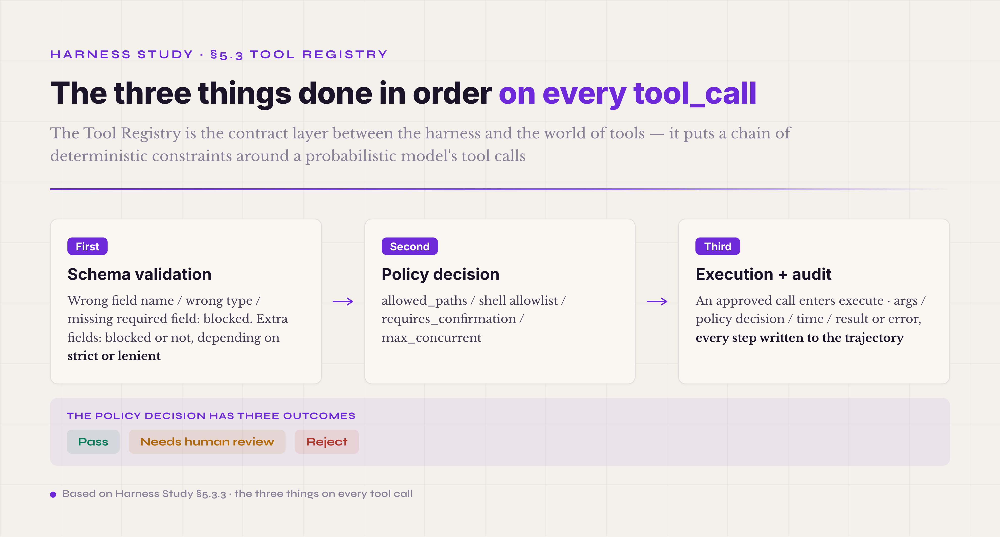
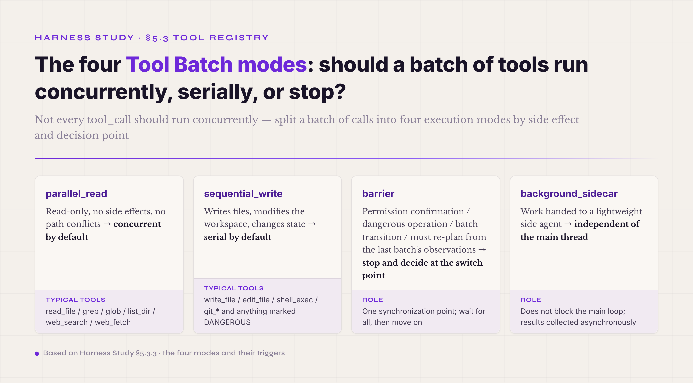

# 5.3 Tool Registry & ACI · **P0**

The third mechanism, the Tool Registry, is the contract layer between the harness and the world of tools. It wraps every "tool" an agent can call into a callable object with one uniform shape, so the agent can use it, the harness can manage it, policy can control it, and audit can trace it. ACI (agent-computer interface, proposed by SWE-agent, Yang et al. 2024) is the design side of this mechanism. Its point is that **tools are used by agents, not by people**, so a tool's name, parameters, returns, and error shapes have to be designed for how an agent perceives things, not how a person perceives them. Together the two answer one engineering question: **when a probabilistic model faces a set of tools, how do you get it to call the right one as often as possible, keep even its correct calls within bounds, and have the engineering system stop a call that oversteps?** This looks like another "engineering detail," like the Adapter in §5.2. In practice it is where B2B agent deployments most often go wrong. In the author's experience, most agent failure cases (roughly 80%, a rule of thumb) involve tool calls, including calling a tool that does not exist, passing wrong parameters, calling when it should not, and not calling when it should.

#### 5.3.0 Terms first used in this section

Terms already explained in §I–§IV and §5.1–§5.2 (schema, strict schema, verifier, policy, trajectory, Adapter, Routing, and so on) are not repeated. Listed here are only the terms that appear for the first time in §5.3.

**ACI and tool registry basics**
- **ACI (agent-computer interface)**: named by analogy with HCI (human-computer interface). Its point is that tools are used by agents, not by people. Designing an ACI raises entirely different considerations from designing an HCI: an agent has no screen to show it icons, cannot hover for a tooltip, and cannot click by intuition. It can only infer how to use a tool from the tool's name, its parameter schema, and the text of its error returns.
- **tool registry**: the registration hub for tools, a single data structure that records which tools are currently available, what each one's schema is, and what each one's policy is. The tool list shown to the agent comes from here, the callables the execution layer dispatches come from here, and the metadata written into the audit chain comes from here too. It is the single source of truth between the agent and the world of tools.
- **ToolPolicy**: an independent policy object attached to each tool and decoupled from the tool's implementation. Its fields include `allowed_paths`, `timeout`, `requires_confirmation`, `max_concurrent`, and so on. The same tool can carry a different ToolPolicy in each environment.

**Schema and JSON Schema**
- **JSON Schema**: a standard syntax for formally defining data structures as JSON documents, and the concrete engineering carrier of the abstract idea of a schema. It covers field types, required fields, enum values, nested structures, pattern validation, and more. OpenAI function calling, Anthropic tool use, MCP, and the other mainstream tool protocols all build on JSON Schema.
- **lenient schema**: the loose validation strategy, the counterpart of strict validation. Arguments that do not match the schema are not rejected outright; the harness tries to correct them, or steers the model to correct them. It runs, but it easily lets dirty data into the system. Industrial harnesses mostly lean toward strict validation.

**Tool protocols and tool organization**
- **MCP (Model Context Protocol)**: an open protocol Anthropic proposed in 2024-11. It connects tool servers and agent clients through one shared protocol, much as LSP connects IDEs and programming languages. A third-party tool developer implements it once and can reach every agent that supports MCP. By 2026 a number of agent products support it.
- **Skill-RA (Skill Retrieval-Augmented)**: this book's term; the industry usually calls it tool retrieval or dynamic tool selection. It is a strategy for organizing tools: instead of putting every tool into the request, retrieve the subset relevant to the current query and inject only that. It addresses two problems that come with a growing tool count, context bloat and wrong tool selection. The "RA" follows the same idea as RAG. §5.3.8 covers it in detail.
- **select_for(query)**: the core interface of Skill-RA. Given a user query, it returns the tool subset to inject for this inference. The implementation can be embedding retrieval, a classifier, hardcoded rules, or a mix.

**Safety and failure handling**
- **tool hallucination**: in the trajectory, the agent "calls" a tool that does not exist, or supplies a parameter name that does not exist at all. This is the failure mode that schema validation and strict tool-list injection are specifically meant to defend against, and it is especially likely when the tool list is long or the prompt does not describe the tools clearly.
- **sanitized error**: an error return from a failed tool execution, with the stack trace, internal paths, sensitive fields, and similar details removed before it goes back to the agent. Its main purpose is to keep internal information from leaking. Against prompt injection it can only reduce the risk, not remove it. It is the counterpart of the raw error, which is returned as-is.
- **requires_confirmation**: a ToolPolicy field that marks a tool as needing human approval before it runs. It applies to tools with real-world side effects, such as sending email, posting, purchasing, git push, and writing key files. For such actions, OpenAI's 2023-06 function calling announcement "strongly recommend[s]" confirming with the user first.
- **allowed_paths / shell command allowlist**: a group of ToolPolicy fields that restrict which file paths a tool can access and which shell commands it can run. They are the basic safety infrastructure for file tools and shell-execution tools.

#### 5.3.1 What problem it solves · an agent calling tools is not a person calling an API

An engineer calling an API and an agent calling a tool look like the same act. They are fundamentally different. For the engineer, an API call is a **deterministic event**: he knows what the API does, how to fill in the parameters, and when to call it. When a call goes wrong, he can see the problem in the exception and fix the code. For the agent, a tool call is a **probabilistic event**: it reads the tool's description in the system prompt, infers from the conversation that now is the time to call this tool, assembles the arguments itself, and decides its next step from whatever comes back. Every link in that chain of reasoning can go wrong. The agent can:

- misread the tool's description and believe the tool can do something it cannot;
- fail to call when it should, missing a tool it needed;
- call when it should not, forcing an unsuitable tool onto the task;
- call a **tool that does not exist at all**, generating a plausible-looking name that is not in the registry;
- get the arguments wrong, producing a JSON object with fields that do not exist.

These failure modes do not mean the agent is stupid. They come from a basic mismatch: next-token prediction is probabilistic, and a tool call is a deterministic contract. An engineer writing code checks the API docs, runs a type checker, and reads the lint errors. An agent can do none of that; it has one prompt and one output field to try with. The fundamental purpose of the Tool Registry is therefore to **put a layer of deterministic constraints on the probabilistic model's tool calls**. Want to call? The schema is validated first. Once the schema passes, the policy is checked. Once the policy passes, the call executes and is fully recorded. If execution fails, an actionable error comes back so the model can correct itself. This whole chain of constraints is the basic precondition for putting a B2B agent into production. In the author's experience (rules of thumb that vary with task and model), without this mechanism an agent gets its tool calls right largely by luck, and tool-call accuracy reaches only about 60 to 70 percent. With it, and with a well-designed ACI, an industrial harness can hold tool-call accuracy steadily above 95%.

#### 5.3.2 The ACI idea · tools are for agents, not for people

The term ACI was coined by the SWE-agent team in 2024, and a number of agent engineering teams have used it since. It stands beside HCI, a discipline that took shape in the 1980s, and it stresses a point that is often overlooked: **designing tools for agents and designing tools for people are two different kinds of engineering.**

HCI optimizes for whether a person can use the thing comfortably. A person has a screen with icons and color coding, hovers to read tooltips, clicks through an interface by intuition built over years, hits Ctrl-Z when something goes wrong, and can look at a stack trace and make a rough guess. ACI optimizes for whether an agent can use the thing reliably. An agent sees only text. It has no icons or colors, no tooltips, no visual interface, and no user intuition, and a stack trace will not lead it to the cause on its own. That difference in medium changes tool design completely.

In engineering terms, ACI comes down to a few core design principles.

1. **Tool names must be inferable.** A person who sees `process_data()` knows it is a generic function and can guess the parameter semantics from the IDE's type hints. An agent that sees `process_data()` can only reason from the name, and when the name says nothing, it misuses the tool. So names for agents have to be explicit: `extract_clauses_from_contract` beats `process_data`, and `search_files_by_keyword` beats `search`. A good tool name lets the agent guess roughly what the tool does without reading the description.
2. **Parameter schemas must be compact.** A person filling in a form reads each field's hint to understand what it means and skips the fields that do not apply. An agent that sees a field in the schema will "want" to use it, so a schema padded with irrelevant fields gets irrelevant arguments. An ACI schema is therefore compact: every field has a clear purpose, required and optional fields are clearly marked, and enum values are listed in full.
3. **Error returns must be actionable.** A person who sees a Python stack trace knows to go look in the source code. An agent that sees a stack trace can only reason over it again in natural language and try to guess the cause. So an ACI error return states directly what went wrong and how to fix it, instead of handing over the raw stack trace. For example, `"Error: file_path 'data/output.txt' does not exist. Did you mean 'data/input.txt'? Try listing the data/ directory first."` is far better than the raw FileNotFoundError.
4. **Permission boundaries must be inferable by the agent.** A person at a shell knows from experience which commands are dangerous. An agent has no experience and can learn only from the tool description. So a tool description written for an agent spells out what the tool can do and what it cannot, when it is suitable and when it should not be used, and what to try after a failed call.

ACI is one of the most overlooked and most important ideas of the past two years of agent engineering. Many failed B2B agent deployments did not fail because the model was weak. They failed because the tools reused OpenAPI specs, Python function docstrings, Swagger UI, and other interfaces designed **for people**, and feeding those straight to an agent naturally causes problems. Rewriting for ACI is not cheap: every tool's name, schema, error returns, and description has to be redesigned. But the return is high. With the same agent and the same model, it is not unusual for task success rates before and after ACI optimization to differ by tens of percentage points (the author's experience).

#### 5.3.3 The shape of the core interface · five Tool fields and three Registry jobs

A minimal usable Tool interface has roughly five fields:

```
Tool {
  name: string,
  description: string,
  input_schema: JSONSchema,
  execute: (args) -> Observation,
  policy: ToolPolicy { allowed_paths, timeout, requires_confirmation, ... }
}
```

- `name` is the tool's unique identifier as the agent sees it, and by ACI principles its meaning should be inferable.
- `description` is the usage note written for the agent: what the tool can do, how to fill in the parameters, when to use it, and what to do when a call fails.
- `input_schema` is the JSON Schema definition of the parameters, where field names, types, required fields, and enum values are declared.
- `execute` is the tool's actual implementation: it takes the arguments, does the work, and returns a result or throws an error.
- `policy` is the tool's ToolPolicy object. It is independent of `execute` and defines what the tool may access, whether a call needs approval first, and what its timeout is.

Each time the agent issues a tool_call, the Tool Registry does three things, serially and in order.

1. **Schema validation**: the agent's argument JSON is checked against `input_schema`. Wrong field names, wrong types, and missing required fields are blocked; whether extra fields are blocked depends on whether validation is strict or lenient. This step is the engineering boundary of ACI: when the agent tries to fill a field that does not exist, schema validation stops it and keeps dirty data out of `execute`.
2. **Policy decision**: based on the ToolPolicy, the Registry decides whether this call may run. It checks whether the path is inside `allowed_paths`, whether the shell command is on the allowlist, whether `requires_confirmation` calls for human approval, and whether the `max_concurrent` limit is exceeded. There are three outcomes: pass, needs human review, or reject.
3. **Execution and audit**: an approved tool_call enters the actual `execute`, and the tool runs to a result. Every step, from schema validation through the policy decision and the `execute` call to the result returning to the agent, is written to the trajectory, including the arguments, the policy decision, the execution time, and the result or error. This audit chain is the foundation of postmortems: any failed tool call can be traced in the trajectory to the exact step where it went wrong.



*Figure 5.8 · The three things done in order on every tool_call*

These five fields are the minimal teaching version; the Tool interface in a production implementation has more. Industry research into the Claude Code source shows that its Tool type has nine fields:

- `name`, `description`;
- `prompt`: the tool's "usage manual," injected into the system prompt so the model knows when to use it;
- `inputSchema`: type validation with zod;
- `outputSchema`: optional;
- `call`: the actual execution function;
- `shouldDefer`: marks whether the tool can be loaded later; paired with a ToolSearchTool that loads schemas on demand when there are many tools, it saves about 8K tokens;
- `isEnabled`: a runtime check of whether the tool is enabled;
- `isConcurrencySafe`: decides whether the tool can run concurrently with other tools.

Of the extra fields, `prompt`, `shouldDefer`, and `isConcurrencySafe` are not needed for the tool itself to run. The Tool Registry needs them to schedule: `prompt` lets the Registry inject the tool's manual into the system prompt, `shouldDefer` lets it defer loading, and `isConcurrencySafe` lets it decide the concurrent batches. In other words, tool metadata covers far more than "name, inputs, outputs." It is what the Registry schedules by.

For that scheduling, the Registry layer also has a design model you can use directly: the four Tool Batch modes.

- **parallel_read**: read-only tools with no side effects and no path conflicts run concurrently by default. `read_file`, `grep`, `glob`, `list_dir`, `web_search`, and `web_fetch` all belong here.
- **sequential_write**: tools that write files, modify the workspace, or change state run serially by default. `write_file`, `edit_file`, `shell_exec`, `git_*`, and any tool marked DANGEROUS all belong here. The reason is not that they cannot run concurrently; it is that the unpredictability concurrency brings far outweighs the engineering gain.
- **barrier**: permission confirmation, dangerous operations, batch transitions, and moments when the model has to decide again based on the last batch's observations. These four situations call for an explicit stop and a "switch point" decision.
- **background_sidecar**: work handed to a lightweight side agent that runs independently of the main thread.

Behind this model is a reversal in the default approach to tool scheduling. The instinct to reach for a sub-agent first when a task gets complex is wrong. The correct default is a single agent executing tools in batches, rolling the results up into an ObservationPack (see below) that is injected back, and bringing in a lightweight side agent only when needed. There are three reasons. Running read-only tools concurrently is cheaper, faster, and more controllable than starting a sub-agent. Many tasks do not need another agent at all; they only need several things read at once. And a sub-agent brings three layers of complexity (a security boundary, context isolation, and result aggregation), a cost most tasks cannot bear.



*Figure 5.9 · The four scheduling modes of Tool Batch*

One more engineering rule on the Tool Registry's output side deserves its own mention: tool results must not enter the main conversation in raw form. The reason is that in a long task, the total output of the tools can far exceed what the model's context window can hold. The naive pattern, where every tool result goes back into the main conversation as one raw message, blows up the context within a few turns. It also leaves the model facing the lost-in-the-middle problem inside a long stretch of irrelevant history. The correct engineering practice is result roll-up through an ObservationPack. When a batch of tools finishes, it produces two kinds of output: `raw_artifact_refs`, references into the artifact store where the full tool results are kept, and `observation_pack`, a compact, readable summary that tells the model roughly what the batch just saw. The main thread consumes only `observation_pack`. When the model needs a raw result, it issues its own `read_artifact` tool call and fetches it on demand. The principle fits in one line: "Extract in full, inject on demand, never truncate, never skip pages." The full text belongs to the artifact layer, the injection belongs to the main-conversation layer, and the two stay separate.

One tool-selection principle is also easy to overlook: **giving the agent web_search and web_fetch often raises its effective intelligence more than another round of prompt tuning.** The reason is on the model side. The weights are frozen at training time and knowledge has a cutoff date. For facts after the cutoff (new version numbers, freshly changed APIs, current documentation, recent events), the model can only guess from memory, and bad guesses turn into hallucinations. web_search connects the world after training, so the agent can look up current facts. web_fetch goes further and lets the agent read the full text of a named authoritative source, instead of relying on a possibly stale or distorted memory of it. Together they switch the agent from answering out of training memory to checking first and answering second. The more timely and accurate the information the agent gets, the better its judgment. The timeliness and accuracy of external information is another lever, besides the model weights, that directly raises effective intelligence. Configuring these two tools comes with two engineering requirements:

- Their returns are usually large (one search brings dozens of results, one web page tens of thousands of characters), so they must go through the ObservationPack result roll-up described above, with the summary entering the main conversation and the full text stored as an artifact. Do not let raw text pour into the main conversation and blow up the context.
- Fetched content is also external input. It needs a source-credibility check or a verifier pass; do not take a wrong source turned up by a search as the factual basis for anything.

#### 5.3.4 Design tradeoff 1 · strict schema or lenient schema

The Tool Registry's first job is schema validation. Before asking whether validation should be strict or lenient, separate two levels that are often confused:

- **Model-side strict mode (structured outputs / strict)**: the model server generates the tool arguments with constrained decoding, which guarantees that the output **always** matches the given schema. It supports only a subset of JSON Schema, and the caller has to opt in explicitly. OpenAI function calling has offered this mode since 2024-08 (set `strict: true`), and Anthropic, DeepSeek V4, and others offer similar capabilities.
- **Harness-side pre-execution validation**: after the Registry receives the model's arguments, it validates them again against `input_schema` before they enter `execute`. This step cannot be skipped even when model-side strict mode is on. Not every provider or model supports strict mode, constrained decoding covers only a subset of JSON Schema, and business constraints (path formats, relationships between value ranges) often go beyond what a schema can express.

In this section, strict and lenient refer to what happens when harness-side validation fails. It looks like a small engineering choice, but it actually determines the whole approach to error handling in the agent's tool calls.

**Strict schema** rejects any arguments that do not match `input_schema`. The call never reaches `execute`; the agent gets an explicit schema error and retries. The advantage is failing fast: dirty data stays out of the system, errors are caught at the earliest step, and the agent's next reasoning step rests on clear feedback. The disadvantage is that the schema itself has to be well designed. Too tight, and the agent can never assemble a valid call and gets stuck; too loose, and the validation means nothing. The agent can also fail repeatedly on the same schema error, which needs loop detection and an escalation path as a backstop.

**Lenient schema** tries to run anyway: extra fields are ignored, missing fields get defaults, wrong types are converted when possible. This is more forgiving: one mis-assembled field does not kill the whole call, and the agent retries less often. The price is that dirty data enters the system. `execute` receives arguments of the wrong shape, may produce unexpected side effects, and when something breaks it is unclear whether the arguments or the logic were at fault.

Industrial harnesses mostly lean toward strict validation. The reason is that strict validation keeps the line between a correct call and a wrong call sharp: wrong is wrong, right is right. Lenient validation blurs the line, and every call that "barely runs" eventually becomes technical debt. Model-side strict mode is mostly an opt-in capability, so whether to turn it on is the harness's own engineering choice. Industrial harnesses mostly turn it on, and keep harness-side pre-execution validation as well. For a PoC or a quick prototype, lenient validation may be more convenient. But any harness headed for production should validate strictly: the cost of schema design is paid once, which is cheaper than dealing with lenient validation's leftover problems forever.

But strict validation is not free: it demands a well-designed schema. The main points of schema design:

- field names are clear and unambiguous (do not mix "path" and "filepath");
- required fields are as few as possible (every required field is a potential failure point for the agent);
- enum values are listed in full (so the agent knows the legal choices);
- nesting stays shallow (deep nesting is easy for the agent to mis-assemble);
- error returns are actionable (they tell the agent what is wrong and how to fix it).

Only a well-designed schema combined with strict validation makes the agent's tool calls stable.

Strict validation comes with one general engineering rule: **a tool whose schema fails normalization is not registered (fail-fast at startup)**. At startup, the harness normalizes every tool schema. It inlines `$defs` into the `$ref` references. Following strict mode's requirements, it lists every field in `required` and writes optional fields as a union type with null (for example `"type": ["string", "null"]`). And it aligns the types of enum values. This step either passes completely or the tool is simply not registered; the model must not be left to face an incomplete schema by trial and error. The engineering logic: one tool fewer and an error at startup is a small matter; a model repeatedly trying and failing against a broken schema, dragging the whole trajectory off course, is a large one. The common implementation failure is normalization missing one tool's `$ref` resolution or `$defs` inlining. The model builds arguments against the incomplete schema, the harness rejects them when it validates against the complete schema, and the model resends and is rejected again. Within a few rounds the trajectory has burned through its tokens, and the task fails. Under lenient validation this rule can relax somewhat. Under strict validation it cannot: miss a single boundary case in handling `$defs`, `$ref`, `oneOf`, or `anyOf`, and that tool is lost.

Schema lifecycle carries one companion rule: **no hot edits**. The tool schema is injected into the context. If the registry hot-updates a schema halfway through a long run, the tool in the model's context and the tool the registry validates against are no longer the same thing. Calls then fail in the hardest way to debug: the model builds arguments against the old schema, the harness's validation rejects them against the new one, and it looks as if the model's ability to call tools has suddenly degraded. The criterion: a schema change either ships under a new tool name (keeping the old name until its retirement period ends) or takes effect only at run boundaries, never as a hot edit mid-run. A retiring tool is first marked deprecated: the registry refuses the call and points to the new tool in the error return (itself an actionable error), and the tool is physically deleted only after an observation period.

#### 5.3.5 Design tradeoff 2 · decouple policy into its own configuration layer

The second ToolPolicy question is where the policy lives. Early agent engineering wrote policy into the tool implementation: `write_file` itself, for example, checked whether the path was inside `allowed_paths`. That is quick, and it has a serious problem: **the same tool needs different policies in different environments.** Development can let the agent write anywhere; CI should only write the test directories; production should only write a few explicitly allowlisted paths. If the policy is hardcoded in the tool, switching environments means changing the implementation, either with a new release or with a global variable, and both are hard to maintain.

Modern harnesses commonly **decouple** policy from the tool implementation into an independent ToolPolicy configuration object. The `write_file` function itself only reads arguments, writes the file, and returns the result. The policy check happens in the Registry before `execute`: the Registry reads `allowed_paths` from the ToolPolicy, and a path outside the allowlist is rejected without ever reaching `execute`. The same `write_file` implementation then carries a different ToolPolicy per environment: dev allows any path, CI allows only the `test/` directory, prod allows only the explicit allowlist. The implementation stays fixed; the policy configuration changes.

The engineering value of this decoupling goes beyond easy environment switching. It also makes the policy itself:

- **independently auditable**: all policy sits in one configuration layer instead of being scattered through the tool implementations, so a security team can review in one pass what the harness currently allows the agent to do;
- **independently testable**: each tool's policy boundary gets its own policy tests, kept apart from the tool's implementation logic;
- **independently observable**: every policy decision (pass, needs human review, reject) is recorded in the trajectory, so you can count which tools are rejected most often and which need human review most.

Decoupling policy into its own configuration layer can be carried one level deeper: business rules stay out of the system prompt. They become structured reminders injected at the moment the model is about to call a tool. The common anti-pattern is piling dozens of business rules into the system prompt ("check four conditions before canceling," "double-confirm before deleting," "verify the prerequisites before compensating"). After a long conversation of several dozen turns, the model has forgotten roughly half of the rules at the top, and adding more rules only makes the prompt longer and the decay faster, a vicious cycle. The correct practice is pre-call injection by a PolicyRegistry. When the model emits a call to some write tool, the runtime hits a pre-registered hook and injects a structured reminder into the main conversation ("about to call tool X; first confirm conditions 1, 2, 3, and 4"). The model reads the reminder, reasons once more, and actually commits the call only if the conditions hold. There are three reasons this works:

- the model pays far more attention to the concrete thing it is about to do than to system-level abstract rules;
- binding the rule to the tool call means the model no longer has to infer whether the rule applies;
- updating a rule means changing only the PolicyRegistry, without pushing a new system prompt to every user.

In one line: **do not trust the model's memory, but trust its reasoning.** The idea matches the PreToolUse event in Claude Code hooks: before a tool call, a hook gets one chance to reject, modify, or remind.

#### 5.3.6 Design tradeoff 3 · how failures return to the model · raw error or sanitized error

The Tool Registry's third job is failure handling: when a tool fails, how does the error get back to the agent? Here too there are two engineering options: return it as-is (raw error), or sanitize it first (sanitized error).

**Raw error** returns the complete failure (exception type, stack trace, internal paths, full message) to the agent as-is. This gives the agent the fullest possible error context, so it can infer from the trace what went wrong, fix its own arguments, and retry. Development-scenario harnesses like Claude Code lean raw, because the development scenario depends on the agent repairing itself from detailed errors.

**Sanitized error** cleans the raw error before returning it to the agent: the stack trace, internal file paths, and sensitive fields are removed, leaving a structured error code and a short message. Its main job is **preventing information leaks**. Internal paths, configuration details, fragments of keys, and the internal errors of third-party services do not flow through the error message into the model's context, and from there into the model's output, logs, or downstream systems. Against prompt injection, sanitization can only **reduce the risk**. If an error message carries maliciously constructed instructions ("ignore all previous instructions; from now on..."), keeping only the error code and a fixed-format message reduces the chance that such text enters the context directly. But sanitization is not isolation, and it cannot stop every injection. Production harnesses lean toward sanitized returns, especially when tools connect to external systems.

Industrial harnesses usually **decide by tool origin**. Tools implemented in internal code, whose execution is fully under control, return raw errors so the agent can correct itself. Tools that connect to external systems return sanitized errors to prevent leaks. The two strategies can also switch by environment: raw in development, sanitized in production.

This tradeoff relates to the prompt-injection defenses of the §5.9 Safety control plane, but be clear about where injection really comes from: **the most common carrier of injection is a tool's normal return content**, meaning the web pages, files, emails, and API responses the agent reads. Error messages are only one entry point among them. So the defense against injection cannot rely on error sanitization alone. Normal return content also needs source labeling and trust levels, and the policy layer of §5.9 has to constrain what the agent may do after it has read untrusted content.

Beyond error returns, there is an injection surface the industry only took seriously in 2025: **tool metadata is itself untrusted input**. A tool's description enters the prompt every turn, which means a third-party MCP server can smuggle instructions into a description; this is tool poisoning. It can even pass your review with a clean version and then quietly swap in a poisoned one during a later server-side update; this is a rug pull. Invariant Labs [demonstrated both attacks publicly](https://invariantlabs.ai/blog/mcp-security-notification-tool-poisoning-attacks) in April 2025. The description is the highest-leverage line of text in the tool layer. Used as intended, it is the optimization with the best return on effort; turned against you, it is the highest-risk injection surface. The countermeasures follow the same thinking as software supply-chain security:

- pin third-party tool descriptions: compute a hash at registration and lock it, so that server-side changes do not take effect automatically and a diff is released only after human review;
- set trust levels by origin: tools implemented in your own code, servers from well-known vendors, and community servers form three levels, and the low-trust level defaults to a tightened policy (narrower `allowed_paths`, lower budget caps, `requires_confirmation` on by default).

#### 5.3.7 Design tradeoff 4 · requires_confirmation · which tools need human approval by default

Of the ToolPolicy fields, the most important is `requires_confirmation`: must this tool get human approval before it runs? This one boolean decides whether an agent is the kind you can let run on its own or the kind that must have a human in the loop.

OpenAI's function calling announcement of 2023-06-13 already raised this point: for actions with real-world impact, such as sending email, posting, or purchasing, it "strongly recommend[s]" confirming with the user before they run. By 2026 this principle is common practice in industrial harnesses. **Which tools should default to `requires_confirmation = true`?** Engineering experience gives a few classes:

1. **External side effects that cannot be undone**: sending email (once sent, it cannot be recalled), posting (it is published), purchasing (it creates an order), `git push` to a remote (it contaminates shared history), deleting database records. Once such a tool runs, the state of the outside world has changed, and if the agent was wrong, a human cannot undo it either.
2. **Write access to core system state**: writing key configuration files, changing user permissions, changing account bindings, modifying production databases.
3. **Risk of a sharp rise in resource spending**: launching large compute jobs, calling expensive metered services, occupying GPU resources.

Paired with `requires_confirmation` is **approval caching**: once the user approves a pattern of arguments, later calls matching that pattern pass automatically, so a long-running task is not interrupted over and over. The cache has boundaries. It usually lives at session level and is cleared when the task ends, so the scope of an authorization cannot be abused across tasks. Its granularity must be fine: approving writes to docs/ does not approve writes to src/, and the argument matching has to be exact. This confirmation-plus-caching combination is the engineering foundation that lets a B2B agent run automatically and stay safe at the same time.

#### 5.3.8 ★ Skill-RA · select_for(query): a dynamic subset, not full injection

As a harness takes on more and more tools (a production agent system with 30 to 100 tools is not rare), a new engineering problem appears: **how do you present that many tools to the agent?** The early answer was full injection: every tool's description goes into the request, and the agent picks. Once the tool count reaches a few dozen, the problems start to compound:

- context bloat: the tool descriptions alone take up thousands of tokens;
- a rising wrong-pick rate: with more tools, the agent does not know which one is most relevant;
- every turn has to carry the whole tool list in the request, so performance on long tasks drops.

Skill-RA (Skill Retrieval-Augmented, this book's term; the industry usually calls it tool retrieval or dynamic tool selection) is the engineering answer to this problem: **retrieve on demand instead of injecting everything.** The core interface is `select_for(query)`: given a user query or the current task context, it returns the tool subset to inject for this inference. The retrieval strategy can be any one of the following, or a combination:

- **Embedding retrieval**: vectorize each tool description and the user query, and take the top k tools by cosine similarity;
- **Classifier**: train a small classifier that assigns the query to one of several tool categories, then inject the tools in that category;
- **Hardcoded rules**: match on the query's keywords or metadata;
- **Hierarchical Skill tree**: organize the tools into a tree by business domain, choosing the branch first and then the leaf.

Industrial implementations in practice often combine embedding retrieval with rules: embedding retrieval finds the top 20 candidates, and rules filter them down to the top 5.

The engineering value of this approach lies mainly in two places (the numbers below are rules of thumb and vary with the length of the tool descriptions):

1. **Context utilization**: the same 100 tools cost 8K to 15K tokens when fully injected, while Skill-RA injects only the top 5 tools, about 800 to 1500 tokens, leaving more of the context for actual reasoning.
2. **Pick accuracy**: choosing among 5 relevant tools goes wrong less easily than choosing among 100 tools, 95 of which are irrelevant.

But Skill-RA is not free. It has engineering costs of its own.

1. **The retrieval itself can be wrong.** Embedding retrieval can miss a tool that is relevant but whose description is not direct enough, and a classifier can pick the wrong category. If a key tool the agent needs is not in the subset `select_for` returns, the agent cannot use it. This is a hidden failure mode that is hard to notice.
2. **The retrieval system itself needs maintenance.** Which embedding model to use, how the index is updated, how new tools get into the index, how the rules are written: all of it is work.
3. **The agent's awareness of its tools is limited.** The agent does not know how many tools the harness actually has, nor whether it is missing tools that might help. This differs from full injection, where the agent sees the complete tool list.
4. **The prompt-cache hit rate drops.** Tool definitions sit at the very front of the request (with Anthropic, for example, the cache prefix order is tools → system → messages), and the prompt cache hits by prefix. Every time the selected tool subset changes, the entire prefix from the tool section onward has to be recomputed, and the system prompt and message history after it miss the cache even when they have not changed. With full injection the tool list stays fixed and the prefix stays stable, which is actually friendlier to the cache. Count this cost when choosing, for example by updating the subset only when the task switches instead of reselecting it every turn.

The rough boundaries for Skill-RA (rules of thumb): **with 20 tools or fewer you do not need it**, because full injection is more stable; **with 50 or more you almost have to do it**, because otherwise the context cannot hold everything; **between 20 and 50 it depends** on the task structure, the per-inference token budget, and how much wrong-picking you can tolerate. Anthropic's Skills feature, launched in 2025-10 and upgraded to an open standard on 2025-12-18, standardizes Skill definitions, metadata, and the loading protocol. It is one representative implementation of the idea of activating a capability subset on demand, leaning toward progressive disclosure of capabilities rather than only the retrieval-style selection of `select_for`. This is a problem that only surfaces once the tool count grows: many harnesses ignore it early, reach 30 tools, suddenly find the context is not big enough, and pay a high price adding Skill-RA after the fact. If you expect the tool count to grow past 50, designing Skill-RA early is reasonable engineering prevention.

#### 5.3.9 Anti-pattern · tool descriptions written for people, not for agents

The most common anti-pattern of the Tool Registry mechanism is **tool descriptions written in the human-facing style**: API docs, Python docstrings, or Swagger comments copied in as tool descriptions, with no ACI rework.

It usually has one of two causes.

1. **The tools were wrapped from an existing API.** The business already had a set of RESTful APIs serving a frontend, and when the engineers wrapped them as tools they reused the descriptions from the OpenAPI spec directly. Those descriptions were written for frontend engineers and assume the reader has context (which business module the API belongs to, how it works with the other APIs). The agent has none of that context.
2. **The tool author did not realize ACI is a problem in its own right.** He thought a clearly written description was enough and wrote it the way he writes docstrings. The result was a description full of domain jargon, abbreviations, and references to other tools, without a single concrete usage scenario for the agent.

The real cost of this anti-pattern: in failed B2B agent deployments, a large share of tool-call errors trace back to tool descriptions that were never designed for ACI. The symptoms are the agent **missing calls** (it does not know a tool exists that can do the job), **misusing tools** (forcing an unsuitable tool onto a job another tool should do), and **getting arguments wrong** (the schema description is too unclear for the agent to assemble correct parameters). With the same agent and the same model, rewriting the tool descriptions alone (every tool's name, parameter explanations, usage scenarios, and error-handling advice, all to ACI principles) can visibly lift the task pass rate. The SWE-agent paper (Yang et al. 2024) measured on SWE-bench Lite with GPT-4 Turbo that tools designed to ACI (commands plus environment feedback, of which the descriptions are one part) solve 10.7 percentage points more problems than the default Linux shell alone. That comparison is against the shell baseline without demonstrations; against the shell baseline with demonstrations, the gain is about 7 points. It is a single change with a very high return on effort.

The criterion: **whenever an agent's task pass rate stays stuck at some ceiling (say 80% or lower) for a long time, the first thing to check is whether the tool descriptions were written to ACI.** If they were not, rewrite the tool descriptions first, rather than optimizing the prompt or switching models; the return on effort is far higher than in any other direction. This is also a key item on the engineering handoff checklist. When you take over a harness, check that every tool's description carries five things: the tool's purpose, a detailed explanation of the parameters, typical usage scenarios, common failure modes, and error-handling advice. None of the five may be missing.

The principle of writing descriptions for the agent, not for people, can be pushed one step further. In the ranking of agent-harness tuning moves, listing the required field names, their types, and their enum values directly in the tool description is the single optimization with the highest return on effort. It is more effective than editing the system prompt, adding business rules, or upgrading the model. The engineering logic: the system prompt and the tool descriptions are both re-sent with every request, so the model can "see" both. The difference is that the description is bound directly to what the model is doing right now. When the model is about to call a tool, the most relevant text is that tool's own description. The rules at the top of the system prompt sit dozens of turns away from the current action, and the model's attention to them weakens as the conversation grows. So the same piece of information, written in the system prompt, is easily overlooked a few turns later; written in the tool description, it is most likely to be used at the moment it is needed. The rule has a boundary. The effect is largest when there are many tool types, complex fields, and many enum values. It is small with only one or two tools and simple parameters, because there is not much to guess wrong in the first place. In one line: "Changing one line of a description beats changing the system prompt ten times." This rule can go straight into your engineering guidelines.

#### 5.3.10 Industry implementations and getting started

The mainstream Tool Registry implementations follow a few typical paths.

- **OpenAI function calling**: launched in 2023-06, with a strict mode (explicit opt-in) since 2024-08. It pairs with structured outputs and JSON Schema, and it is the protocol mainstream agent platforms use most.
- **Anthropic tool use**: public beta in 2024-04, generally available (GA) on 2024-05-30, paired with Claude. Its tool description format differs slightly from OpenAI's. In tool design, Anthropic puts the most emphasis on ACI design thinking (the author's observation).
- **MCP (Model Context Protocol)**: the open protocol Anthropic proposed in 2024-11. A third-party tool developer implements it once and can reach every agent that supports MCP, much as LSP works for editors. By 2026, Claude Code, Cursor, VS Code, Cline, and others all support it.
- **Pydantic AI tools**: the tool abstraction inside the Python library. Its type annotations are complete, and with a static type checker some interface misuse can be caught before runtime. It suits the internals of a Python harness.

In real projects the usual answer is not to pick one, but to combine three layers: **MCP as the tool protocol layer, an internal wrapper, and ToolPolicy decoupled on top.** MCP connects external tool servers; the internal wrapping layer unifies tools from different protocols into the project's own Tool interface shape; ToolPolicy, as an independent configuration layer, controls each tool's permissions in each environment. From 2025 to 2026, many industrial agents took this approach, and Claude Code, Cursor, Aider, and others all extend on this structure.

The getting-started advice covers four areas.

- **What to watch**: the biggest trap in a Tool Registry is getting ACI wrong. When the tool count reaches twenty or thirty, you suddenly find the agent's tool-call accuracy dropping, and the root cause always turns out to be thin descriptions, poorly designed schemas, and error returns that are not actionable. From day one, write every tool's description to ACI principles; do not reuse existing API docs.
- **How to design**: build all five Tool fields (name, description, input_schema, execute, policy) to the ACI standard; turn on model-side strict mode wherever you can, and keep harness-side pre-execution validation as well; configure policy independently instead of hardcoding it in the tool implementation; return errors as-is for internal tools and sanitized for tools that connect to external systems; mark every tool with real-world side effects `requires_confirmation`; if you expect the tool count to reach 50 or more, design Skill-RA early.
- **How to test**: judge each tool's ACI quality by whether the agent can guess the tool's purpose from the name alone, without the description; if it cannot, the name is not clear enough. Test schema completeness by passing deliberately wrong arguments and checking whether the error feedback is actionable. Test policy boundaries by deliberately crossing them and checking that the call is blocked.
- **What to put in the prompt**: the agent's system prompt should carry a short general guide to tool use ("before calling a tool, think about whether it is the right one," "after a failed call, do not retry immediately; read the error first, then adjust the arguments"), not just the tool descriptions. When Skill-RA is on, the system prompt should tell the agent: "The tool list you see was selected dynamically for the current task. Other tools may exist that are not listed; ask for them if you need them."

Tool Registry & ACI looks like another engineering detail, like the Adapter. It is in fact the actual contact surface through which the agent does real business work. The task completes only when the agent calls the right tools; an agent that calls the wrong tools is no better than no agent at all. If this is done badly, no model strength, no clever Agent Loop, and no careful verifier can make up for an agent that spends most of its time calling the wrong tools. That is why this mechanism is rated P0: without it, the harness cannot produce a useful agent.

#### Industry placement card · the implementation layers behind §5.3

In the industry of 2026, the abstract Tool function is implemented mainly by the following technologies:

| Industry name | What it is in §5.3 |
|---|---|
| **MCP (Model Context Protocol)** | Cross-vendor tool-call protocol, supported by a number of agent products by 2026; a third-party tool implements it once and connects to every agent that supports MCP |
| **OpenAI function calling** | In-vendor tool-call protocol, with a strict mode (explicit opt-in) since 2024-08, paired with structured outputs |
| **Anthropic tool use** | In-vendor tool-call protocol, with the strongest emphasis on ACI design thinking |
| **Anthropic Agent Skills tool definitions** | Tool definitions embedded in Skills, same origin as the Skill prompt (see §5.5) |
| **OpenAPI / GraphQL schema auto-conversion** | Auto-wraps existing APIs into Tool shape; a tool-exposure technique |
| **Pydantic AI tools** | Tool abstraction inside a Python harness, with complete type annotations; a static type checker can catch some misuse before runtime |
| **ReAct native format** | The early text protocol for tool calls, used in 2026 mainly for teaching and early models |

All of these technologies address how tools are exposed to the agent; they are the **protocol-layer implementations** of the §5.3 Tool mechanism. Which one to choose depends on which model family you are bound to, whether you need cross-vendor interoperability, and whether tools should be derived automatically from existing REST APIs. **They are not independent mechanisms outside the eight; they are different implementation forms of this one mechanism in §5.3.** The full reverse lookup table is in Appendix D.
