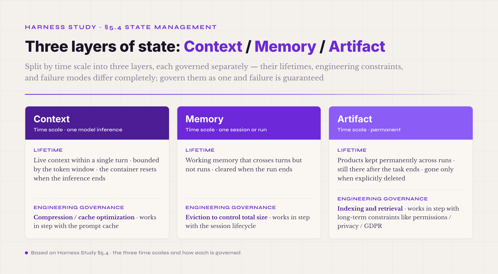
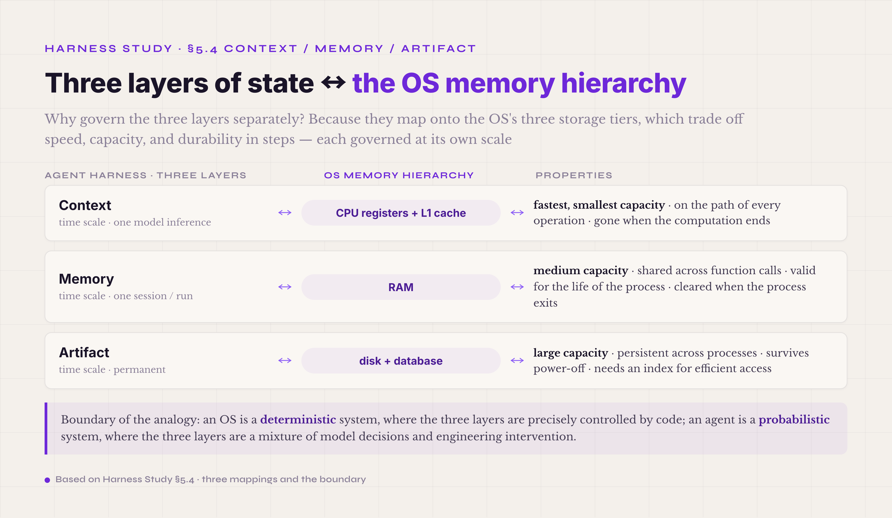
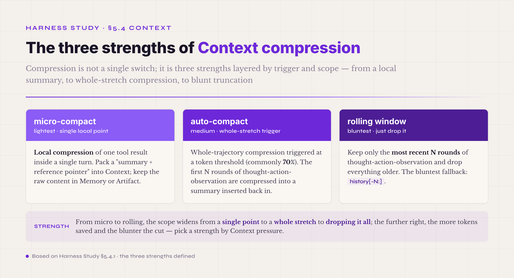
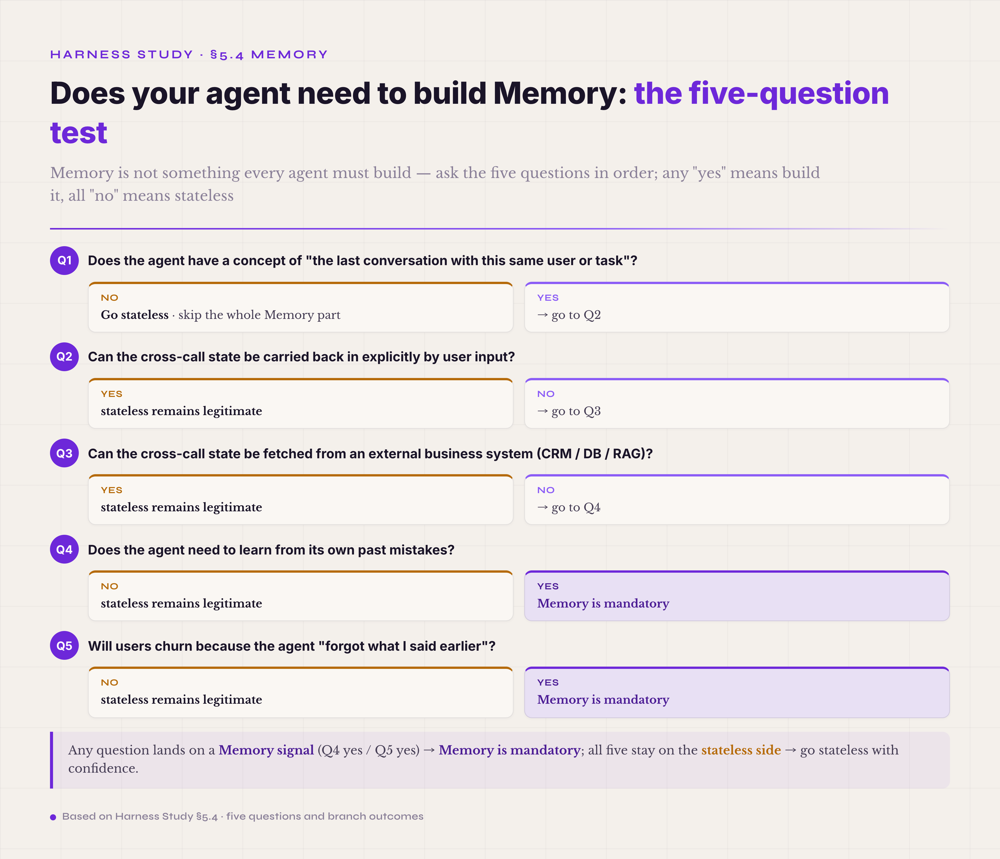

# 5.4 Context / Memory / Artifact · **P0 (Context) / P1 (Memory) / P2 (Artifact)**

The fourth mechanism is the agent's state management. Unlike traditional software, an agent's state cannot be managed in one bag. It has to be split by **time scale** into three parts, each governed separately: **Context** is the live context of the current turn (consumed by one inference, bounded by the token window); **Memory** is working memory that crosses turns but not runs (it persists within a session and is cleared when the run ends); **Artifact** is what survives across runs permanently (it remains after the task ends, until someone explicitly deletes it). The three are easy to lump together under "context management." This volume splits them apart explicitly, because the industry has stepped on this exact landmine: govern the three kinds of state as one, and you eventually get all three failures at once — what should be cleared isn't cleared, what should be kept can't be kept, and the three layers contaminate each other. **This section is the least forgiving part of harness design.** Get the state mechanism wrong, and the strange bugs in the agent's behavior look exactly like model hallucination, which makes the root cause extremely hard to trace.

Why must the split follow time scale? Because the three kinds of state have completely different lifetimes, and governing them as one means managing the longest lifetime with the rules of the shortest. The result is three failures at once: products that should be kept long-term get compressed away inside a turn, working memory gets wiped when the run ends, and turn-internal state that should have been cleared escapes the run boundary into the next task. All three classic failures have the same root cause — state was not layered by time scale. **Context** lives on the scale of one model inference: the agent uses one Context per model call, the container resets when the inference ends, and the next round reassembles it. **Memory** lives on the scale of one session or one run: the intermediate state the agent consults repeatedly while working on a task, cleared when the run ends. **Artifact** lives on a permanent scale: the products a task creates and the objects that later, similar tasks will reuse, gone only when explicitly deleted.

*Figure 5.10 · The three time scales of Context / Memory / Artifact*

Three time scales mean three completely different kinds of engineering governance. Context is bounded by the token window; it needs compression and cache optimization, and it works in step with the prompt cache. Memory is bounded by runtime memory; it needs eviction to control its total size, and it works in step with the session lifecycle. Artifact is bounded by storage cost; it needs indexing and retrieval, and it works in step with long-term constraints like permissions, privacy, and GDPR. Governing them together means satisfying three incompatible sets of constraints on one data structure. It cannot be done.

There is a cross-domain analogy that makes the three layers easy to hold: **the memory hierarchy of an operating system.** Context corresponds to CPU registers plus the L1 cache — fastest, smallest, on the path of every operation, gone when the computation ends. Memory corresponds to RAM — medium capacity, shared across function calls, valid for the life of the process, cleared when the process exits. Artifact corresponds to disk plus the database — large, persistent across processes, surviving power-off, needing an index for efficient access.

*Figure 5.11 · The cross-domain analogy to the OS memory hierarchy*

OS engineering has decades of mature practice on these three layers — which data lives on which layer, how layers swap, how caches invalidate, how file systems organize indexes and transactions — and almost all of it transfers to agent state management. The correspondence is concrete. OS registers and L1 map to Context: both are the fastest locations the compute unit can reach, both are capacity-bounded, both need cache-replacement decisions. OS RAM maps to Memory: both are working memory shared within a process scope, both have eviction, both cooperate with a cache. OS disk plus database map to Artifact: both persist permanently, both need indexes for efficient access, both carry backup and access-control problems.

The analogy has a boundary worth marking. An OS is a deterministic system; what sits on each layer is precisely controlled by code. An agent is a probabilistic system; what sits on each layer is a mixture of model decisions and engineering intervention. What the OS experience offers is structural: borrow the idea of layering state by time scale directly, and redesign each layer's implementation against the real constraints of agent engineering. But **the layering idea itself is solidly correct** — any design that does not split agent state by time scale ends in confusion.

This three-layer split has modern research behind it. The core claim of Artifacts as Memory Beyond the Agent Boundary[^artifacts-as-memory-2026] is that **memory is not confined to the agent's side of the boundary; its data and function can straddle the agent-environment boundary and reside in the environment.** That claim carries a deep implication for the three-layer split: **Memory and Artifact are not two different things — they are two sides of the same memory.** Memory is internal state inside the agent boundary, actively managed by the agent. Artifact is what naturally gets left behind in the environment outside the boundary: files, database rows, knowledge-graph entries, Skill files, code. The same fact can be stored once as Memory inside the agent and once as Artifact in the environment, but the engineering governance differs. The two later parts of this chapter use this claim repeatedly — they are not describing two kinds of storage, but two governance regimes for the same memory.

The paper also carries a hidden engineering insight: **artifacts cost less internal agent capacity than internal memory does.** In the paper's navigation experiment, an agent in an environment where the path (an artifact) is visible needs visibly less memory capacity to learn the same strategy — externalizing state into environmental artifacts is more economical than packing it into internal memory. That insight underpins the core position of the Artifact part below: state that needs long-term persistence goes to Artifact first, not Memory, and Memory is reserved for working state that genuinely needs fast reads between turns.

§5.4.1, §5.4.2, and §5.4.3 below cover the three parts in engineering detail, each organized as: why this part must exist on its own, the key governance strategies, the common pitfalls, and how to get started. Read at the priority that matches your stage. At the PoC stage, get Context right first — without it the agent cannot run far. At the production stage, consider adding Memory — it is not always needed; see the test at the head of the Memory part. At scale, add Artifact — without it, no business moat accumulates.

Three things have to be made clear at the head of the chapter.

**First, Memory is not something every agent must build.** A large class of vertical agents — compliance scanning, batch processing, API-doc generation, one-shot classification, one-shot tool triggering, industry-report generation — are legitimately stateless. The stateless path saves a sizable share of infrastructure cost relative to stateful; it is Kubernetes-friendly (K8s was designed for stateless microservices in the first place — stateful is the common mistake there); and it has fewer failure modes (no stale state, race conditions, partial updates, or prompt drift, which are stateful-only traps). §5.4.2 opens with a five-question test, so you can confirm whether this mechanism is necessary for your agent — or whether the industry's memory-as-first-class slogan has merely made it feel necessary.

**Second, Artifact comes in three engineering tiers.** From a single-tenant SMB to cross-department decisions in a large enterprise, the engineering complexity spans three orders of magnitude. Which tier to choose depends on business complexity and data-governance requirements, not on defaulting to the highest end. The three tiers are **Lightweight** (Postgres plus a few extensions — for PoCs and SMBs), **Bitemporal Knowledge Graph** (open-source systems with two time axes, like Zep, Graphiti, and Memento — for mid-size agents whose state changes often), and **Enterprise Decision Platform** (heavy platforms like Palantir Foundry Ontology that integrate schema, business logic, executable actions, and permissions — for large enterprises, government, and defense). §5.4.3 walks through them tier by tier.

**Third, is §5.4 one mechanism or three?** Strictly, it is one abstract function — agent state management — cut by lifetime into three governance programs: Context for the single turn, Memory across turns, Artifact across runs. The engineering constraints of the three differ completely, which is why they get separate parts. That is not the same as "three independent mechanisms," and not the same as "one undifferentiated bag" either. The RAG and GraphRAG that §5.4.2 and §5.4.3 use in their retrieval steps are **a retrieve-and-inject engineering pattern that cuts across both Memory and Artifact — not a mechanism**: it holds whether the backend is vector, graph, FTS, SQL, or an MCP server. The industry placement card at the end of this chapter expands on that boundary.

#### 5.4.0 Terms first used in this section

Terms already explained in §I–§IV and §5.1–§5.3 (context window, lost-in-the-middle, schema, tool_call, Adapter, policy, Skill, and so on) are not repeated. Listed here are only the terms that appear for the first time in §5.4.

**Three-layer state terms** — **Context** (the conversation context live in the agent's current turn · bounded by the model's token window · includes the system prompt, the tool list, the conversation history, and the current tool_call results · after one inference, parts of it may move into Memory, but Context itself is a temporary container). **Memory** (working memory across turns but not across runs · shared by many turns within one session or run, cleared when the run ends · holds the intermediate results the task consults repeatedly without re-packing them into Context every round · the counterpart of process memory in an OS). **Artifact** (the products kept permanently across runs · still there after the task ends, the session closes, or the process exits · holds what the task produced and what later, similar tasks can reuse · the counterpart of disk files plus database records in an OS).

**Compression and window-management terms** — **micro-compact** (local compression inside a single turn · example: a tool returns 100KB of file content, and micro-compact puts only a summary like "read contract-2026.pdf · 12 pages · key sections are 3-5" into Context, with the full content stored in Memory or Artifact). **auto-compact** (whole-stretch compression triggered at a token threshold · example: when Context reaches 70% of the window, the first N rounds of thought-action-observation are compressed into one summary · done with an LLM · reduces token load). **summarization** (the summary-generation step inside auto-compact · usually run on a cheap model rather than the main one · summary quality directly decides whether the agent can still finish the task after compression). **budget guard** (a hard constraint · for example, force-stop inference once cumulative tokens pass a set value · keeps the agent from running away on cost). **prompt caching** (the cache mechanism Anthropic and OpenAI introduced in 2024 · the prefix of a prompt is cached on the provider side, and later requests with the same prefix pay only for the tokens beyond it · large savings · requires a stable prompt prefix; frequent prefix changes invalidate the cache). **rolling window** (a simple compression strategy · keep only the most recent N rounds of thought-action-observation and drop everything older · simple, but it loses early key information).

**Memory engineering terms** — **scratchpad** (the Memory area where the agent writes notes to itself · for example, the agent records "user prefers lunch at 12:30" or "client X cares about cost, not schedule" · reused across turns · Memory the agent actively writes, as opposed to Memory the system captures automatically). **stale memory / memory rot** (Memory holding outdated data that was never invalidated, so the agent keeps deciding on old data · a recurring hidden bug in long-running agents · typical case: the agent stored "the user's email is X," the user changed it three months later, and the agent still mails the old address). **memory eviction** (the mechanism that keeps total Memory from growing without bound · the counterpart of OS cache eviction · common policies are LRU, LFU, and importance scoring).

**Artifact engineering terms** — **artifact store** (the physical backend holding cross-run artifacts · can be a file system, object storage like S3, SQLite or Postgres, or a vector database like Qdrant or pgvector · the choice depends on artifact type and access pattern). **knowledge graph** (one way to organize artifacts · domain entities — contracts, suppliers, policies, customers — and the relations between them, like "customer A signed contract C with supplier B," stored as a graph · suits domain agents that need relational reasoning). **RAG** (Retrieval-Augmented Generation · a retrieval mechanism that pulls artifacts back into Context · given a query, retrieve relevant entries from the artifact store and inject them into the next inference's Context · the bridge between the agent and its long-term artifacts). **embedding retrieval** (retrieval by vector-space similarity · vectorize each artifact and the query, take the top-k by cosine similarity · the most common implementation of RAG).

#### 5.4.1 Context · engineering the single-turn container

Context is the layer where the agent meets the model most directly: every inference packs the whole Context into the prompt for the model to read. The mechanism has two root problems to solve. The first is the **token window constraint** — even a 1M-token window has a ceiling, and a long-horizon agent can hit it within a few dozen steps of accumulation. The second is **attention drift** — the lost-in-the-middle effect described earlier makes recall of mid-context information systematically worse in a long Context. Together the two mean that even when tokens remain, stuffing everything in is not a good strategy. Context must be actively managed: what enters, what stays out, when the contents get compressed, and how the pieces connect afterward. That discipline is **context engineering**, and it matters as much as the choice of Agent Loop or model. It is routinely underestimated, because a 5-step PoC never touches the problem; a 30-step production task exposes it.

**The engineering reality of the token window**

The nominal window and the effective window are far apart, and this is the first fact to internalize when designing Context governance. Anthropic's Claude Opus and Sonnet are nominally 200K; OpenAI's GPT-5.5 and Google's Gemini are nominally 1M. These are ceilings on how much can be packed in, not on how much the model can use well. A running agent carries several blocks of fixed overhead in Context: the **system prompt** is usually 1-5K (a thorough one can reach 10K); **tool descriptions** take 5-20K (20-30 tools at an average of 200-500 tokens of description plus schema each); a **reasoning model's reasoning channel** is a separate stream that does not enter the output but consumes compute budget; and the **accumulating thought-action-observation history** is the genuinely variable part — the longer the agent runs, the faster it grows. A 30-step ReAct agent with no compression at all commonly sits at 50-80K of Context, and 150K is not rare.

This means capacity planning must use the effective window, not the total. A working rule of thumb: **reserve 30-40% of the window for the current turn's tool results, model thinking, and output.** A 200K window therefore offers roughly 120-140K for conversation history; past that, the current turn gets cramped. The 30-40% is not arbitrary — in one turn the model reasons for a few thousand tokens, may call read_file and get 50KB of document back, and still needs a few thousand for output. 20-30% is not enough; 40-50% is more than needed.

Another commonly missed fact: **context overhead is paid twice in a long prompt.** The model re-reads the whole Context on every inference (attention is O(n²)), and even a KV cache saves only part of it. So once Context grows past 100K, the latency and compute cost of every turn grow with the length — it is not only a money problem but a latency one. A production agent's wall-clock time for one inference on 100K of context can be 2-3 times what it is on 30K. This cost is invisible at the PoC stage and surfaces at production scale.

**micro-compact · local compression of a single tool result**

Context compression comes in three strengths, layered by trigger and scope. The lightest is **micro-compact**: local compression of a single tool result inside a single turn. The typical case is a tool returning a large block of content. The agent calls `read_file` on a 12-page contract and the tool returns 100KB of text; it calls `search_files` and gets 50 candidate files back; it calls `extract_clauses` and gets every clause of a contract. Pack those raw returns straight into Context, and one tool result blows the Context up, leaving almost no room for later turns.

*Figure 5.12 · The three strengths of Context compression*

micro-compact's answer is **not to pack the raw content at all.** Context gets a summary plus a reference pointer ("read contract-2026.pdf · 12 pages · key sections 3-5 · covers payment terms, breach liability, confidentiality · full content indexed at memory:doc-contract-2026"), and the full raw content goes to Memory (if it may be consulted later) or Artifact (if it is part of the product). micro-compact is a local decision per tool call, and **each tool carries a micro-compact strategy matched to its own semantics**: the summary schema of `read_file` includes the file path, page count, and key sections; the summary schema of `search_files` includes the query, total results, and a top-N path list; the summary schema of `extract_clauses` includes the clause count and a per-clause id plus summary.

There are two typical implementation paths. **The first: the tool does it itself.** The tool implementation returns both the raw content and a summary, and the harness decides which to pack based on current Context pressure. The advantage is that each tool knows its own semantics best; the cost is two pieces of logic per tool. **The second: the harness summarizes with a general model.** The tool returns raw content, and the harness generates a summary with a cheap model before packing. The advantage is simple tool implementations; the cost is uneven summary quality, especially poor on structured returns like a list of 50 file paths. Production harnesses mostly take the first path with the general model as fallback — the high-frequency, long-return tools (read_file, extract, search) implement their own summaries, and the marginal tools fall back to the general model.

Beyond those two, industrial harnesses have a third, sturdier path: **strip tool results out of the message trunk entirely, into three layers — raw artifact, structured observation, artifact ref.** The raw content goes to the artifact store, never the message stream. What the model sees by default is a structured observation pack (five minimal fields: batch_id, batch_mode, items, artifact_refs, estimated_tokens). When the full text is needed, the model recalls it through the artifact ref. The engineering value of this path is that it decouples "tool-result summarization" from "message history": summary quality is the observation pack's concern, a stable prefix is the message stream's concern, and the two no longer compete for the same token budget. The companion implementation of this tutorial writes this into its spec as the default re-injection unit — the `kind` field uses English snake_case rather than Chinese telemetry, and estimated_tokens feeds straight into the ContextPacker budget — one working reference for this path.

The common pitfall is **truncating every tool return generically** — "cut at 5K characters." Truncation is not summarization. Truncation slices off key information with no regard for content (the contract's breach clause may sit on page 10, right past the cut), and the agent's later reasoning never gets it. Truncation is a development-stage shortcut; production almost always needs real summarization.

**auto-compact · medium-strength compression of whole stretches of history**

The second strength is **auto-compact**: whole-trajectory compression triggered at a token threshold. The common threshold is 70% of Context (some projects use 80% or 60%). When it fires, the first N rounds of thought-action-observation are compressed into one summary, the summary replaces the original content in Context, and space opens for later turns. Depending on the scenario, this step can use the flagship model or a general one.

The hard part of auto-compact is not the compressing — it is **what the summary must keep.** Anything the agent's later reasoning might need has to survive, or the agent slides into hallucination. Four classes must be kept: **key decisions** ("turn 5 chose candidate A over B because X" — the agent will keep building on this); **unclosed tool_calls** (the agent called a tool at turn 8 and the result has not returned when compression fires at turn 12 — the compression must explicitly mark that this id is still awaiting a result); **artifact references** (the index pointers to products already stored in Artifact — the agent will retrieve by those ids later); and **verifier failures** (the errors the agent already hit, so it does not hit the same one again).

Drop any of the four and the agent's later reasoning starts to confabulate. Without the key decisions, it forgets why A was chosen and wanders off to something else. Without the unclosed tool_calls, it invents a fake observation and pretends the result arrived. Without the artifact references, it makes up an id and rationalizes it. Without the verifier failures, it walks into the same error again. These hallucinations are **the hardest tool-related bugs to debug** — on the surface the agent is reasoning from the available information; in fact it is inventing, and it does not know it is inventing.

An engineered summary prompt must spell out the keep-list explicitly — "please summarize" is not enough. A usable template: "Below are N rounds of trajectory content (concatenated). Compress into a summary of ≤500 tokens. **Must keep**: every unclosed tool_call_id and its current state, each turn's key decisions and their reasons, every artifact reference id, every verifier failure verdict and its cause. **May drop**: repeated content, expired intermediate state, exploration branches irrelevant to the final decisions, and the full raw observations of closed tool_calls (a summary may stand in)." A template like this lets even a cheap model produce a workable summary.

Summary-quality evaluation is a piece of engineering auto-compact cannot skip: feed the summary plus the subsequent trajectory to an oracle agent and see whether it can still finish the task. If the oracle cannot, the summary lost something essential — go back and tune the summary prompt until it can. This offline evaluation can run on every harness upgrade, so the summary prompt does not quietly degrade.

Which model compresses is a direct tradeoff. A cheap model (GPT-5.4 nano, Claude Haiku 4.5, Qwen Flash, DeepSeek V4 Flash) costs 5-20 times less per character than the main model; the main model gives the best quality but turns every compression into an extra main-model call, which is visibly expensive. Industrial harnesses mostly run a cheap model under a strict summary prompt — the work itself (take a stretch of trajectory, write a summary) is simple enough that a cheap model does it acceptably, and the prompt design is what matters. For high-stakes tasks (contracts, medical, financial), upgrading the compression model to the cheap tier of the main model's family (Claude Opus on the main line, Claude Sonnet on compression) is reasonable hardening — a failed compression costs far more than the savings.

**rolling window · the bluntest fallback**

The third strength is the **rolling window**: keep only the most recent N rounds of thought-action-observation and drop everything older. It is simple enough to write in one line of Python (`history[-N:]`), and the price is that early key information is simply gone. Production harnesses rarely use a rolling window alone — they pair it with Memory (early information moves to Memory instead of being dropped) or with auto-compact (early information becomes a summary instead of being dropped).

The only scenario where a pure rolling window is reasonable is the **long-conversation agent**: continuous chitchat with no defined end point, customer-service bots, persona companions. Such conversations may run hundreds of rounds, but each round stands fairly alone, and the agent works fine without the early history. A task-oriented agent — one with a defined deliverable that needs long-horizon progress — almost certainly cannot run on a pure rolling window, because dropping the early history means dropping the task goal itself.

**Working with prompt caching**

The other big item in Context governance is **cooperating with prompt caching.** The caching that Anthropic and OpenAI introduced in 2024 charges requests with an identical prefix only for the tokens beyond it; the prefix is billed at the cache price (about 1/10 of full price), and on a cache hit the whole inference can cost a third of the original or less. But the cache demands a stable prefix — change one byte and it invalidates. auto-compact breaks prefix stability directly: the compression rewrites the middle and the whole cache dies.

The engineering compromise is **layering**: cut Context into three segments of different stability. **The most stable prefix — system prompt, tool list, high-frequency references — sits at the front and never moves.** This segment often runs 10-30K and carries most of the cache benefit. **The middle segment — conversation history that has already happened — is where auto-compact is allowed to operate.** Compression rewrites this segment; the cache dies here but still hits on the prefix. **The least stable tail — the current turn's temporary content — is rebuilt every time** and never had cache value anyway. The cache hits concentrate on the long stable prefix, and compression touches only the middle, never the head.

In production, a cache hit rate of 60-80% counts as a successful cache design. Below 30%, investigate why the prefix is unstable. The common causes are a timestamp or random id inside the system prompt ("current time is 2026-05-20 14:30:00"), or a tool list whose order reshuffles on every request (dict-to-list conversion with no guaranteed order). These traps are usually discovered only after paying several times the API bill for a while, so the cache hit rate belongs on a real-time dashboard. A degradation path for cache misses also needs designing: if the cache collectively fails (provider-side maintenance, an accidental prefix change), inference cost snaps back to 1x, and without an alert and a degradation plan the bill multiplies before anyone notices.

Prefix stability has a concrete skeleton — **six hard constraints**: the system prompt must not mutate within a run; tool definition order must be stable; skill and profile fragments must be stably sorted; runtime state must not be concatenated into the system prompt; compression summaries must not replace any block inside the stable prefix; recalled content goes only into the working set, never the prefix. Every one of these was reverse-engineered from a real incident, and the common consequence of breaking one is a cache hit rate that drops overnight from 80%+ to below 30%, discovered only after the bill multiplies. Pair them with four observability metrics from day 1 — cached_input_tokens, prompt_cache_hit_tokens, the step number of the first miss, and the prefix-drift reason — on a real-time dashboard, so any drift is immediately traceable to whichever rule was broken. A harness with its prefix engineering done right can hold a production cache hit rate above 80%, and that number is the visible signal that the prefix engineering is right.

**lost-in-the-middle · engineering against attention drift**

Fitting in the window is not the same as being usable. Lost in the Middle[^lost-in-middle-2024] confirmed the **lost-in-the-middle** effect across multiple models: the same key information is recalled visibly better at the head or tail of a prompt, and recall drops by 20 or more percentage points in the middle (in Liu 2023's multi-document experiments, the middle ran about 20 points below the two ends). A 1M context that fits the whole repository does not mean the model can use it well — key information packed mid-context still goes unfound.

There are four main engineering responses. **First, put key information at the head and tail**: the most important part of the system prompt goes at its end (adjacent to the user message), and the current task statement goes at the very end of the user message (adjacent to the model's answer). **Second, repeat key information**: the same key instruction appears once at the head and once at the tail, so the model sees it at least once. The word count doubles, but the return is usually worth it. **Third, explicit anchors**: marks like `# IMPORTANT` or `# MUST FOLLOW` make the model attend to the passage repeatedly. Simple, and it works. **Fourth, retrieval instead of direct packing**: a key artifact is not packed into Context; it gets a reference id ("reviewed clauses at artifact:contract-2026"), and when the agent actually needs it, it fetches with a retrieval tool. Retrieved content lands at the tail of the current turn — adjacent to the model's answer, the highest-recall position.

The counterexample is packing a 50-page contract raw into Context and asking the agent to find the anomalous clauses. If 80% of the anomalies sit in the middle (pages 10-40), recall drops below 60% and the agent misses half of them. The correct production pattern: micro-compact the contract into a summary plus key anchors in Context, store the original in Artifact, and let the agent retrieve a specific clause when it truly needs one — the key content is then always used from the tail position, where recall is highest.

**Matching Context to the shape of the Agent Loop**

Different Agent Loop shapes put different demands on Context governance, and the two must be designed together. **Vanilla ReAct** grows Context fastest: every round adds one thought-action-observation, and there is no natural reset point. Tens of thousands of tokens by round 20 is normal; the compression threshold arrives by round 30. **Plan-Execute** splits Context into two phases: the plan phase holds a task brief plus a 5-15 step skeleton (compact, non-growing); the execute phase carries the plan skeleton plus the local history of the current step, and after each step Context can reset to the skeleton plus the start of the next step. Its governance pressure is far lighter than vanilla ReAct's. **Reflexion** adds an independent reflection channel to Context: every N rounds, the results of reflecting on the trajectory so far enter Context as a separate segment — which itself needs compression, or accumulated reflections double the Context. **Skill-Based Hierarchical** lets the Agent Loop schedule at the Skill level instead of raw tools: Context shows one line, "call the extract_contract_terms skill" (which wraps several tools internally), instead of the sequence "call read_file → call search_files → call extract_clauses." Context stays visibly smaller, but when a skill fails internally, the details needed for debugging are not there.

A common pitfall is **running vanilla ReAct on long-horizon tasks with no compaction.** This is the classic PoC-straight-to-production trap: in development the task runs 5 steps and finishes at 20K tokens, and the developer concludes Context is fine; in production the task runs 40 steps, tokens accumulate past 200K, the run enters lost-in-the-middle territory, and quality drops. The root cause is not "the wrong Agent Loop" — it is not realizing that the loop's shape determines the Context growth rate, and that compaction has to be designed to match.

**Multimodal Context handling**

Multimodality adds one more layer of complexity. Image tokens cost far more than text: on Anthropic's Claude, one high-resolution image runs about 1,500 tokens, and a scanned PDF about 2-3K tokens per page. Inline a few screenshots or PDF pages and they dominate the Context.

The engineering pattern is **analyze the image first, return the analysis to Context, store the original in Artifact**: a screenshot goes to a vision model that returns a structured description, the description (a few hundred tokens) enters Context, and the original (a few thousand tokens) goes to Artifact with an index. Video and audio are more extreme: one minute of video sampled at 1fps can run tens of thousands of tokens, so it must be downsampled, keyframed, or auto-summarized at the Adapter layer into a few hundred tokens of description before anything enters Context. Multimodal micro-compact differs from the text case: text compression turns long text into short text, while multimodal compression turns images, video, and audio into text plus an index. The latter depends on a separate multimodal summarization toolchain — a hidden complexity of multimodal agent engineering.

**Common pitfall · treating Context as infinite memory**

The most common Context pitfall is **using it as infinite memory in development and hitting the wall in production.**

How it happens: in development, tokens never look scarce. A PoC task runs 5 steps and sits at 20K, the developer decides a 200K window is plenty, packs in everything "just in case," and does no active management. There is no pain at the PoC stage. Then production-scale tasks arrive — contract review at 30 steps, monthly reports at 40, customer consultation at 50 — and Context starts hitting the 70-80% threshold routinely. By the time auto-compact fires, the agent has already been running in lost-in-the-middle territory for several rounds; many key decisions in the middle have already slipped past the model's attention, the subsequent reasoning runs on the incomplete part the model happens to remember, and the results cannot be trusted.

One piece of field experience: in production agents running longer than half a year, Context mismanagement is among the main reasons task pass rates fall (the other two common sources are a missing verifier and tool descriptions not written to ACI). The visible symptom is that long-horizon tasks (≥20 steps) pass at a clearly lower rate than short ones (≤10 steps), and the investigation usually ends at "after turn 15+, the model started ignoring the key findings of turns 3-5" — lost-in-the-middle at work.

The judgment line: run an end-to-end dry-run of N=50 steps and watch the token growth curve. **Below 30K at step 30 is healthy**; 80K+ at step 30 means no Context engineering was done; 150K+ at step 30 means the wall has already been hit. This dry-run should be a mandatory test before a harness goes to production. The boundary is worth stating too: a pure short-conversation agent (done in ≤5 steps) can skip Context engineering; long-horizon tasks (≥20 steps) cannot; the 10-20 step middle depends on task density — whether each step brings large tool results.

**Getting started · four dimensions**

**What to watch:** reserve 30-40% of the token window for the current turn, and never plan capacity by the window total; micro-compact, auto-compact, and rolling window each have their own territory — do not default everything to rolling; prompt caching and compaction are coupled, so think through how compression preserves the stable prefix before setting up the cache; lost-in-the-middle exists at 200K just as it does elsewhere, and 1M is not a cure. The most underestimated dangers are the ones invisible in development — the token volumes a PoC never reaches, production will.

**How to design:** cut Context into three layers (stable prefix, middle history, current-turn tail) with a governance strategy per layer; give each tool a micro-compact summary schema matched to its semantics rather than one generic truncation; the auto-compact summary prompt must list the must-keep elements explicitly (unclosed tool_call_ids, key decisions, artifact references, verifier failures); make the Context growth curve an observable metric so problems surface immediately; multimodal content defaults to the analyze-then-summarize path, with originals in Artifact.

**How to test:** the token-growth dry-run (run an N=50-step task and check the curve is healthy); pass-rate preservation across compression (the agent's task pass rate must not drop 5pp after compression — if it does, the summary prompt is weak, go tune it); cache hit rate monitoring (60-80% expected; below 30%, investigate prefix stability); a lost-in-the-middle recall test (plant known key information mid-context at 100K-200K and check whether the agent can use it). These four tests together close the engineering loop on Context governance — without the loop, tuning runs on intuition, and the odds of hitting a trap are high.

**What to put in the prompt:** the auto-compact summary template must state the must-keep and may-drop elements, so even a cheap model produces usable summaries; the agent's system prompt should say that Context capacity is limited, that long content should not be repeated inline, and that citing an artifact index is enough — so the agent cooperates with Context governance instead of relying on the harness to catch everything; a reasoning model's thinking budget ceiling belongs in the system prompt ("think longer on complex decisions, but keep thinking under X tokens or it will be cut off"), so runaway thinking does not swallow the Context.

Of the three layers in §5.4, Context is the one with **the least tolerance for error and the best-hidden traps.** Done right, the agent runs long and stable. Done wrong, every long-horizon task's pass rate suffers, and the root cause stays hard to chase. Treat Context as an engineering project of its own from day 1 — do not wait for tasks to hit the wall in production and then backfill. Backfilling costs far more than building it right at the start.

#### 5.4.2 Memory · working memory across turns

Memory is the layer where the agent deals with itself. It is not a layer inside the model; it is working state the harness maintains outside the model, shared by the agent across turns. Context is the temporary container the model re-reads on every inference; Memory is a persistent working area the agent actively writes and actively reads. The biggest difference between them is **lifetime**: after one inference, parts of Context carry into the next round and the container resets; Memory persists through the whole run and is cleared only when the run ends.

What concrete problems does Memory solve? Three root scenarios. **First, unloading Context.** The agent computes a key number at turn 3 and needs it again at turn 15. Letting it ride in Context until turn 15 — where a compression pass may summarize it away — is worse than writing it to Memory and reading it back at turn 15. **Second, cross-turn consensus.** At some turn the agent judges that "the user prefers lunch at 12:30" or "client X cares most about cost." Writing such judgments to Memory builds a working belief the agent actively established, to be read back into later decisions. **Third, making tool_call state explicit.** The Context part above showed that losing unclosed tool_calls in compression is a hidden bug. This layer is where that state properly belongs: each tool_call_id and its current status are stored explicitly in Memory, decoupled from whatever Context compression does.

Memory is not an extension of Context. It is an independent layer of working storage in agent engineering — and failing to see that is the same root mistake as treating Context as infinite memory: state left unlayered.

**Does your agent actually need Memory · the necessity test**

In 2026 the industry promotes Memory as a "first-class architectural component" (the shared language of the Mem0, Letta, and Zep survey literature). The slogan misleads readers into thinking every agent needs Memory. The real engineering picture is more complicated: a large class of vertical agents is legitimately stateless, and skipping Memory is the more economical choice for them.

It is worth noting that the Mem0 team's own position is restrained. Mem0[^mem0-2025] posts strong scores on the LongMemEval long-term-memory benchmark and stands as a representative production-ready long-term memory system — yet it positions long-term memory as **a feature to enable on demand, not a default requirement.** That is a weighty internal voice against the memory-first slogan. Treating memory as a first-class architectural component and treating memory as a default are two different things; "every agent needs Memory" and "90% of agents don't need long-term memory" point in opposite directions, and the industry consensus sits closer to the latter.

**The typical stateless scenarios** — where the whole Memory part can be skipped. **One-shot classification and scoring** (spam filtering, content tagging, risk rating, compliance scanning, document classification — each item independent, input mapping to output). **One-shot transformation** (translation agents, format conversion, code linting, ETL cleaning — functional: input → output). **One-shot Q&A** (FAQ bots, customer-service knowledge-base lookups, RAG fallbacks — RAG stands in for Memory, each query hits the KB independently). **One-shot tool triggering** (set a timer, play music, check the weather — imperative tool calls with no state). **Batch jobs** (overnight bulk review, data cleaning, monthly report generation — each record processed independently). **One-shot deliverables** (industry reports, API docs, per-PR code review).

The stateless path's hard benefits are not secondary. Relative to stateful, it saves real **infrastructure cost** (no session store, no state DB, no consistency handling, no stateful sync). It is **Kubernetes-friendly** (K8s was designed for stateless microservices; a stateful agent is the common mistake there, and stateful workloads are far harder to deploy on K8s than stateless ones). It has **fewer failure modes** (no stale state from parallel overwrites, no partial updates, no race conditions, no prompt drift, no lost state on retry — all stateful-only traps). And **debugging and operations are simpler** (a crash loses no data, a restart drops no tasks, horizontal scaling has no state to synchronize).

Some scenarios cannot go stateless and must build Memory: **multi-turn conversation** (a customer-service chatbot across rounds with one user; an IDE assistant carrying context across turns), **personal assistants** (learning user preferences — "my lunch is at 12:30" — and customer profiles), **long-task working memory** (contract review at 30 steps, monthly report generation at 40 — heavy intermediate state between turns), **continually learning agents** (a research agent accumulating experience over days), **resumable tasks** (a long task interrupted and resumed from where it stopped), and **self-reflective iterative learning** (a meta-loop that remembers past errors to avoid repeating them).

To decide which path your agent takes, answer the following five questions in order. Any "yes" puts you on the Memory path; all "no" means stateless.

**The five questions.** **First: does the agent have a concept of "the last conversation with this same user or task"?** No (every request independent, like a REST API) → stateless, stop here, skip the whole Memory part; yes → question two. **Second: can the cross-call state be carried back in explicitly by user input?** Yes (the user re-tells the agent the full context every time, like an API call carrying its complete payload) → stateless remains legitimate; no → question three. **Third: can the cross-call state be fetched from an external business system (CRM, DB, RAG)?** Yes (the agent queries the CRM by RAG at runtime — memory outsourced to the business system) → stateless remains legitimate; no → question four. **Fourth: does the agent need to learn from its own past mistakes?** No (every task is new, no accumulation needed) → stateless remains legitimate; yes → Memory is mandatory. **Fifth: will users churn because the agent "forgot what I said earlier"?** No (users expect every session to stand alone) → stateless remains legitimate; yes → Memory is mandatory.

*Figure 5.13 · The five-question test for whether to build Memory*

After the test, one boundary deserves stating: **the hybrid pattern is the real answer in large-scale production systems.** A stateless frontend (horizontally scaled on K8s, no session state) plus a stateful orchestrator (a separate service holding task state), with a correlation id passing between the layers. The frontend takes user requests and gets the benefits of horizontal scaling; the orchestrator holds long-task state and gets continuity. This hybrid is the de facto standard for high-concurrency B2B agents — pure stateless and pure stateful are the two extremes, and real production sits between them.

The rest of this part assumes the five questions put your agent on the Memory path. If you landed on stateless, skip ahead to §5.4.3 on Artifact — many stateless agents still need the Artifact layer for archiving their products.

**The second-level test · how many kinds of memory to build**

Once the five questions say "Memory needed," a second-level test follows: **Memory is not all-or-nothing — it splits into four kinds, built per scenario.** Cognitive psychology divides memory into working (the current working set — Baddeley & Hitch 1974), episodic (concrete events — "what happened"), semantic (facts and concepts — "what is true"), and procedural (skills and workflows — "how to do"); the episodic/semantic distinction is Tulving's classic work from 1972 (working memory comes from Baddeley; procedural belongs to non-declarative memory). The taxonomy maps directly onto agent engineering: working is Context plus short-lived session state; episodic is an event stream on vector storage plus timestamps; semantic is domain facts on a graph or structured store; procedural is verified skills in a skill library.

Not all four are needed. A general chatbot usually needs episodic only. A professional agent (research, coding) needs episodic plus procedural. A domain agent (medical, legal, civil aviation) needs episodic plus semantic (the domain fact set). A toy prototype needs none of the four.

The most common implementation error is **solving every memory need with a vector DB.** Finding similar events is what vectors are for — the main retrieval mode of these systems. But "find all memories related to user X" is not a vector strength (a graph is); "find the events of the last 30 days" has no temporal notion in vector space; and "reuse verified code" should not be retrieved by vector at all — that is a skill library's job.

One more split rides along with this test: **who manages memory.** Automatic system capture (the Mem0 pattern — medium engineering complexity), the agent calling tools itself (the Letta pattern — low complexity), or a hybrid (high complexity, but the industrial best).

**Write policy**

The hard part of Memory writes is **what to write, when to write, and to which backend** — together these decide whether Memory is useful working memory or an unordered junk pile.

**What goes into Memory** is an engineering judgment. The Context part gave the criteria; here they unfold at the mechanism level. **Intermediate results that several turns will read again go in** — say the agent computed a statistic ("cost: +18% year over year") that the next 5 rounds will reference; Memory beats letting it ride in Context, saving tokens and hallucination risk at once. **Large raw content that Context cannot hold goes in** — the 50KB raw text of a contract that micro-compact kept out of Context waits in Memory until the agent needs a specific clause. **Judgments the agent itself marks as "I will use this again" go in** — the scratchpad pattern, the agent writing notes to itself, such as "this client wants three-year ROI payback, not five." **tool_call state goes in** — each unclosed tool_call_id with its current status, stored explicitly so compression cannot drop a call and trigger hallucination. **Verifier failure records go in** — the errors already hit ("tried path X, doesn't exist"), so the agent does not retry them.

What stays out? **Anything consumed within a single turn** — the temporary argument assembly of the current tool_call, the candidate lists the model generated and discarded. **Anything recomputable from another source** — "the current time" should come from the system clock every time, not from Memory, to avoid staleness. **Sensitive and PII data stays out, or enters only after processing** — if the Memory backend could ever be read across users, or a GDPR boundary demands the right to be forgotten, raw PII in Memory is a compliance risk.

**When to write** has three triggers. **Manual write** — a tool call like `memory_store(key, value)`. **Automatic capture** — the harness captures context into Memory at fixed hook points, such as tool_call completion or a verifier firing. **Threshold triggers** — at a token threshold, the key segments of the existing trajectory sync into Memory automatically. Production harnesses usually mix all three: the agent is taught in its prompt to record important findings with memory_store, the harness captures the necessary tool-result summaries on tool_call completion, and key decisions sync at the token threshold.

**Which backend** depends on the data's access pattern. Structured data with clear fields goes to SQLite; high-frequency KV with TTL goes to Redis; unstructured natural language goes to a vector store; relational, multi-hop queries go to a graph store. The harness exposes one `memory.store()` interface on top and routes by data type internally — the agent sees one Memory, while the engineering underneath layers by access pattern. The physical backends are not expanded here: the chapter head already gave the OS RAM analogy, and the SQLite/Redis/vector/graph comparison overlaps with the Artifact part, so the focus here stays on what is special to Memory governance.

**Retrieval strategy**

Once Memory is written, how is it read? Retrieval strategy pairs with the physical backend, but the essential question is: what Memory content does this inference need?

**First, explicit key reads.** The agent is taught in its prompt to call `memory_get("contract-2026-key-findings")` — a direct key read, usually backed by a relational or KV store. Precise, fast, predictable; but the agent has to remember what the key looks like, and a wrong key reads nothing. Suits highly normalized Memory.

**Second, field queries.** `memory_query(category="supplier", risk="high")` — an SQL-like conditional query filtering structured Memory records. Usually backed by SQLite or Postgres. Suits Memory with a clear schema: supplier profiles, clause libraries, customer profiles.

**Third, full-text search.** Given keywords, search Memory for matching entries. Usually SQLite FTS5 or Postgres full-text. More precise than vectors (the keyword must appear) and more flexible than key reads (no key to remember); the weakness is no cross-phrasing matches ("client prefers low prices" will not find "client cares about value for money"). Suits domains with stable terminology.

**Fourth, vector search.** `memory_search("customers associated with low-price preferences")` — a natural-language query, vectorized, top-k by cosine similarity. Backed by a vector store. Cross-phrasing matching comes naturally; the cost is that the ranking can drift (top-1 is not always truly relevant) and exact matches are actually worse.

**Fifth, graph traversal.** `memory_traverse(from="customer-A", relation="signed_contract", depth=2)` — relational navigation, backed by a graph database. Suits multi-hop relational reasoning.

**Sixth, hybrid retrieval.** Filter candidates first by keyword or field (high precision), then weight by vector ranking (high recall), then LLM-rerank to top-k. This is the standard industrial pattern for RAG-style Memory retrieval. Each single method has its limits; only the hybrid balances precision against recall.

Which strategy to choose is tied to how the agent's system prompt teaches it: the agent is told "you have memory_get, memory_query, and memory_search — structured precise lookups use memory_query, fuzzy semantic lookups use memory_search, and a known exact key uses memory_get." The ACI design of the retrieval interface (§5.3) matters as much as it does for tool calls — names, parameters, and error returns all designed for how the agent perceives.

A common error is **giving the agent only a memory_search tool**, so every scenario runs through vector retrieval. Then even exact queries ("where is the key X I just stored?") detour through vectorization, and accuracy wobbles. Give the agent at least two retrieval interfaces — exact key and fuzzy search — and let the model judge which fits.

**Lifecycle · TTL · invalidation**

Memory's biggest difference from Context is its **longer lifetime** — it persists through the run. But persisting is not the same as never moving. Memory must have an expiry mechanism, or it becomes stale memory and the agent decides on outdated data.

There are three main implementations. **First, fixed TTL.** Each Memory entry carries a time-to-live and clears itself on expiry; Redis's built-in TTL field is the simplest implementation. The hard part is **choosing the duration** — 5 minutes is too short (expired before the agent uses it), 24 hours too long (the data changed and the agent still uses it). The usual answer layers by data type: fast-changing data (current prices, inventory) gets a TTL of 5-30 minutes; medium-changing data (customer preferences, supplier profiles) gets 1-7 days; slow-changing data (compliance rules, policy libraries) gets 30 days or longer.

**Second, business-event triggers.** When an event fires, a group of related Memory entries is actively invalidated — a "customer profile updated" event invalidates every Memory entry caching that customer's preferences. This requires integrating the harness with the business systems (subscribing to their events), but it is the most accurate: cleared only when the data truly changed, usable for as long as it has not, with none of TTL's "expired but actually unchanged" waste.

**Third, dependency tracking.** Memory entries depend on each other ("total cost computed from contract X" depends on contract X), and when contract X changes, everything depending on it invalidates. Extremely accurate and engineering-heavy: every entry must declare its dependencies at write time, and business changes must walk the dependency chain.

Industrial harnesses mostly run **fixed TTL plus business-event triggers**: TTL is the backstop (nothing stays stale forever even if no event fires), events are the precision update (cleared the moment the data truly changes). Dependency tracking is reserved for critical Memory — data of the "contract clauses are ground truth" grade in contract review.

**Lifecycle · consolidation · Claude Code Auto Dream as the industrial template**

TTL and invalidation handle the expired and the overturned. Memory has one more problem those two cannot cover: **fragmentation.** Run an agent long enough and Memory piles up duplicated, redundant, and mutually contradictory entries. No single entry has expired or been overturned, yet the whole has become an unordered heap and retrieval accuracy falls.

**Auto Dream**[^claude-code-auto-dream] (also the `/dream` command), which Anthropic added to Claude Code in early 2026, is the engineering template for this. Its core mechanism is an analogy to REM sleep: after the agent has run for a while, a consolidation pass fires periodically — read the transcripts of the last N sessions → prune facts that no longer hold → merge duplicate entries → rebuild the MEMORY.md index → convert relative dates to absolute ones ("decided yesterday to use Redis" → "2026-05-20: decided to use Redis"). Auto Dream runs in the background without blocking the user's current session, and it may only write memory files — it cannot touch source code or configuration. That capability boundary is what makes consolidation safe: however wrong the consolidation model gets, it can only alter Memory, never contaminate the agent's executable environment.

The trigger Anthropic ships is 24 hours plus ≥5 sessions for automatic runs, or a manual `/dream`. MEMORY.md is held under 200 lines (the startup-load cutoff), and the output standard for consolidation is: keep facts that still hold, delete contradicted ones, merge duplicates, rebuild the index.

Auto Dream means three things for §5.4.2. **First**, it gives an industrial answer to the fact that memory rot has no complete cure, only a frequency reduction: periodic consolidation cannot prevent rot, but it visibly lowers how often rot appears. **Second**, it extends the Memory lifecycle beyond TTL and invalidation — TTL handles expiry, invalidation handles overturning, consolidation handles fragmentation; the three mechanisms cover the three failure modes of the Memory lifecycle. **Third**, it gives a working answer to "which model runs consolidation": the cheap tier of the main model's family (in Claude Code, Sonnet consolidates while Opus runs the main line). A model that is too cheap merges carelessly and loses facts; the full main model wastes money.

Auto Dream's boundary needs marking: it is built into Claude Code for Claude Code, not a general agent-memory framework. It works on markdown-file memory and does not suit structured Memory in SQL or graphs. Other agent systems that want this mechanism must build their own consolidation pipeline and redesign the prompt and the capability boundary. But Auto Dream confirms one fact — Memory consolidation is required equipment for an industrial stateful agent, not a nice-to-have.

**Consolidation is not risk-free · it has a failure mode of its own**

Mechanisms like Auto Dream govern fragmentation well, but the consolidation step itself introduces a new kind of degradation: **even when what gets consolidated is correct, the consolidated memory can make the model perform worse.** Useful Memories Become Faulty[^faulty-memory-2026] supplies hard evidence: GPT-5.4 solved 19 ARC-AGI problems without memory and got all of them right (100%); the problems' **own ground-truth solutions** were then consolidated into memory, the model solved them a second time, and accuracy fell to 54%. The degradation came neither from staleness nor from contradictory entries — what was consolidated was the correct solutions. The consolidation act itself changed how the model used its memory.

This complements rather than repeats the three memory-rot causes below: those three (unsensed external change, broken dependency chains, un-updated working beliefs) are about **content going stale**, while this one is about **content staying correct and the model still using it worse after consolidation.** Two engineering consequences. **First**, a consolidation pipeline must ship with regression tests — after consolidation runs, re-run a set of tasks the agent previously solved, and the pass rate may not drop (the "consolidation quality test" in the getting-started advice below — this paper hardens it from a suggestion into a requirement). **Second**, never assume that recording a correct answer must help. How you prune, merge, and rebuild the index directly decides whether the consolidated memory helps the model or drags it — settle it with data, not intuition.

**Defending against memory rot**

Even with TTL, invalidation, and consolidation in place, **memory rot** remains a recurring hidden bug in long-running agents. How does it happen? Usually three ways.

**First, an external data change goes unsensed.** The agent stored "the user's email is X"; three months later the user changed it in another system; your agent never subscribed to that change event, and Memory still holds the old address. A 30-day TTL looks reasonable, but for an email that changes once in three months, a 30-day TTL means up to 30 days of the agent mailing the old address after the change.

**Second, the dependency chain breaks.** The Memory entry "total cost = 1,000,000" depends on contract X's unit price and quantity; some round updates the price, but the invalidation never cascades to "total cost" because the dependency was not declared — and the agent keeps deciding on the old total.

**Third, the agent's own working beliefs never get updated.** At turn 5 the agent writes "client prefers supplier Y." At turn 30 the client says, in conversation, "I lean toward supplier Z now" — but that exchange only enters Context, and the agent never updates the old Memory entry. At turn 50 the agent reads the entry and still decides by "prefers Y."

The engineering defenses. **First, metadata on every entry**: write time, source (manual, auto-capture, auto-sync), confidence (agent-written versus synced from a business system), last-verified time. Reading Memory means reading the metadata too — old or low-confidence entries get re-verified first. **Second, refresh triggers on critical entries**: the agent is taught in its prompt, "when a Memory entry contradicts the current conversation, or its write time exceeds N days, re-verify it with a tool immediately." **Third, a staleness-check tool**: give the agent `memory_check_freshness(key)` to call whenever it doubts an entry. **Fourth, store facts, not working beliefs, in critical Memory**: an agent-written "client preference" goes stale easily; store the raw fact ("the client's latest conversation, verbatim") and let the agent re-infer from it each time.

Memory rot has no complete cure. The achievable goal is dropping its frequency from "every task" to "once in a long while." This failure mode is inherent to the mechanism — do not chase a perfect never-stale Memory; build the engineering loop that finds problems fast and fixes them fast.

**The boundary between scratchpad and system-captured Memory**

Memory has two sources: the scratchpad the agent writes itself, and the system Memory the harness captures automatically at hook points. The two need completely different governance, and mixing them loses control of both.

The **scratchpad** is the agent's own notebook. The agent is taught that important findings go to the scratchpad for later turns to read. What gets written is entirely the agent's judgment — working beliefs, hypotheses, task progress. Its governance profile: small capacity, frequent writes, free-form content, fully agent-controlled. Reads are also agent-initiated, via `scratchpad_get()`.

**System-captured Memory** is written automatically by the harness at fixed hook points: a tool-result summary on tool_call completion, failure details when a verifier fires, the plan skeleton when the plan phase completes. The agent does not see the write happen but gets the content when reading Memory. Its governance profile: fixed write rules, structured content, fully harness-controlled, not modifiable by the agent.

The boundary must be drawn clearly in both directions. **The scratchpad must not hold structured critical state** — tool_call status, verifier failures, artifact references, the facts the harness must be able to trust — because agent-written content is not trustworthy, and the agent may also forget to write or write wrongly. **System capture must not store working beliefs** — a working belief is the agent's subjective judgment and the agent's responsibility; the harness must not capture a "we believe the client prefers X" the agent never declared.

This boundary shares its root with raw versus sanitized errors in §5.3's ACI discussion: what the agent writes belongs to the agent, what the harness writes belongs to the harness, and mixed storage makes responsibility untraceable.

**Shared Memory across multiple agents**

Sometimes there is more than one agent: a lead agent splits a task across sub-agents, and the sub-agents need to share information — the same customer's profile, the same contract's clauses. Memory then needs a **shared layer**.

The typical implementation is **one Memory backend plus namespace isolation**: a single Redis or SQLite instance, namespaced by fields like agent_id, task_id, and scope. The lead agent writes to the task-level namespace; sub-agents read that namespace while keeping their own agent-level namespaces for their scratchpads; data shared across agents is declared explicitly in the task namespace.

The hard part of shared Memory is **consistency**: what happens when several sub-agents read and write the same entry at once (race conditions), how the lead learns that a sub-agent changed something (message passing), and whether sub-agent B should see what sub-agent A wrote (visibility). These are the classic problems of distributed systems; agent engineering's job is mapping them onto the Memory layer.

The usual answer is **locked writes plus event notification**: shared writes go through optimistic locking or transactions, and sub-agents subscribe via pub/sub to the Memory entries they care about. Redis's built-in pub/sub is the most common implementation; SQLite needs hand-rolled polling or an external message system.

But recall the earlier warning that multi-agent over-decomposition is a common pitfall — a single agent plus engineering optimization almost always wins. Design shared Memory only when you **genuinely need multiple agents** (the task splits naturally, the verifiers separate, and the wall-clock saved by parallelism truly covers the orchestration overhead). Do not reserve a shared-Memory interface early because "we might need it later."

**B2B productionization · six essentials and five open problems**

Between PoC and production, Memory crosses a visible engineering gap. At the PoC stage, a simple KV store with manual store and get runs fine. Deploy at B2B scale and a series of problems appears that only exists with large data volumes, many tenants, and cross-session, cross-device usage. In early 2026 the Mem0 team published the **six productionization essentials** distilled from 18 months of production operations — every one of them reverse-engineered from something that already broke, not designed from intuition.

**First, async writes by default.** Synchronous writes block the agent loop. Production Memory writes average 50-200ms of latency, and a synchronous await inside the agent loop drags every turn down a grade. All Memory writes default to async: into a write queue, the agent loop does not wait, a background worker handles the write.

**Second, reranking is required.** Vectors alone rank poorly. Production vector retrieval reaches roughly 60-70% top-5 recall — not enough. A rerank model (Cohere rerank, BGE rerank v2, and the like) must do a second pass: retrieval pulls a top-50 candidate set, the reranker refines it to top-5. This step is close to mandatory in production Memory retrieval.

**Third, metadata filtering.** Scope, time, and property filters. Production Memory cannot be queried whole-store: every query first filters by user_id, session_id, time range, and category, then runs vector retrieval — otherwise recall sinks as irrelevant data dilutes the top-k. The metadata filter is a schema-design requirement, not something bolted on at query time.

**Fourth, timestamps on update.** Temporal accuracy. Recording created_at at write time is not enough — updated_at must be refreshed on every content change. Cross-session migrations, data exports, and audits then know each entry's last modification precisely, and temporal reasoning ("did A happen before B?") becomes reliable.

**Fifth, per-app memory depth configuration.** Inclusion and exclusion prompts tuned per application. What to remember and what to forget differs sharply across applications: a customer-service agent should remember user preferences and not one-off complaints; a research agent should remember task progress and not intermediate exploration candidates; a personal assistant should remember every user decision and no sensitive PII. This remember/forget configuration cannot be hardcoded — it must be tunable per application.

**Sixth, structured exceptions.** Error codes, not unparseable strings. When a Memory operation fails (write conflict, retrieval timeout, backend down), the error response must be a structured error code plus machine-readable detail, so the agent layer above can respond — auto-retry, degrade, or escalate to a human. A free-text error message the agent cannot parse also cannot anchor reliable retry logic.

Beyond the six essentials, Mem0 also published **five B2B-scale problems still unsolved in 2026** — open engineering problems the whole industry is stuck on, with no established best practice. **First, temporal abstraction**: from 1M tokens of data to the 10M-token scale, Memory performance drops 25%. A first-order scale problem that machines alone cannot absorb; it needs new mechanisms — temporal abstraction, layering, cold-hot tiering. **Second, cross-session structure**: modeling evolution, not replacement. User preferences drift rather than flip ("I used to like supplier Y, but for half a year I've leaned Z"); current Memory systems mostly overwrite, and cannot model the preference curve. **Third, application-level evaluation**: benchmarks do not track business performance. Scoring well on LongMemEval or LoCoMo does not mean performing well on business tasks, and automating domain-specific evaluation is open. **Fourth, privacy and consent architecture**: how retention, deletion, and inspection policies get enforced. Memory holds user PII; when a user demands deletion, every related Memory item including the vector embeddings must be deletable, and backends vary in support. **Fifth, cross-session identity resolution**: when users rename, merge accounts, or sync across devices, how Memory reconciles the entries one person left across sessions.

The six essentials plus five open problems work as a maturity self-check: how many of the six does your Memory system have? Fewer than six is not production-ready. How many of the five have you hit? Each one you hit is a real constraint of scale, not a someday problem.

**Industry implementations**

The main Memory implementation paths come in a few typical forms; which to choose depends on business complexity, deployment shape, and team-stack fit.

**Mem0** (managed API; three scopes — user, session, agent; hybrid vector-graph-KV): best as a drop-in personalization API, integrable in a week, LongMemEval 49.0%. Suits simple chatbot personalization and teams that do not want to run Memory infrastructure.

**Letta (formerly MemGPT)** (an OS-style three-level hierarchy — core, recall, archival; the agent controls its own context): suits long-running autonomous agents where the agent decides what to swap into working memory.

**Zep + Graphiti** (bitemporal KG on Neo4j; three subgraph layers — episode, semantic, community): LongMemEval 63.8%, 15 points above Mem0, mostly from temporal reasoning. Suits enterprise agents whose state changes often (contracts, orders, customer preferences all drift) and that need as-of time queries.

**Oracle AI Agent Memory** (multi-tenant isolation enforced at the store layer; a governed unified memory core): suits large-enterprise B2B deployments — strict isolation against cross-tenant leakage, integrating conversations, user feedback, interaction trajectories, and business context.

**Claude Code Auto Dream** (covered in depth above; markdown-file memory plus consolidation): suits developer assistants and IDE agents, not general agent memory (markdown only — not SQL or graphs). It is the industrial template for consolidation.

**Cognee** (graph reasoning, local-first): suits privacy-critical local deployments where data does not leave the machine.

**Memento** (a personal open-source project; bitemporal plus SQLite FTS5 with three-level fallback): its LongMemEval 90.8% is self-reported — a lower evidence grade than peer-reviewed results like Zep's — but the schema thinking is solid, and it works as a high-fit prototype reference.

The actual industrial path mostly takes the middle road of **wrapping someone else's engine and owning the layer above** — the same decoupling principle as strict schema and ToolPolicy earlier. The bottom layer uses an existing Memory engine (pick one of Mem0, Zep, Graphiti, Letta, borrowing its entity resolution, conflict detection, and incremental updates); the top layer wraps your own interface (a closed enum of relation types, metadata filters, per-app configuration, bitemporal query wrappers), keeping the engineering room for differentiation.

**Common pitfall · treating Memory as a dump**

The most common Memory pitfall is **using it as a dump**: mid-run, the engineer stores everything "just in case," and half a year later Memory has grown to tens of thousands of entries and stopped being usable.

How does it happen? Usually two ways. **First, the keep-everything instinct of development.** The engineer cannot tell which intermediate results matter, fears losing what cannot be regenerated, and stores it all. The habit comes from unit tests and logging — over-logging is harmless because logs are append-only. Memory is different: Memory sits inside the agent's decision loop, and over-writing it degrades retrieval accuracy. **Second, the write interface is too light.** `memory.store(key, value)` is one line of code, while deletion, clearing, and expiry all need deliberate engineering — writing costs nothing, so invalidation never gets built.

The industry's experience of the cost: in production agents running past half a year, Memory dump blowout is among the most common operational problems. The symptoms: **retrieval latency degrading linearly** (past tens of thousands of entries, every query scans the whole store and slows beyond use); **frequent stale memory** (old data never cleared, the agent deciding on outdated information); **falling retrieval accuracy** (irrelevant data diluting relevant data — the top-k fills with noise and the truly relevant entries miss the cut); and **runaway write costs** (every store updates the indexes, and past ten thousand entries, write latency over 100ms starts dragging the agent loop).

The judgment line — when is a write justified? **Will this be read by N future turns? N≥3 write, N≤1 don't, N=2 judge by the other factors.** **Does it have an explicit expiry condition? If not, don't write it to persistent Memory — at most a temporary cache with TTL ≤ 1 hour.** **Can it be recomputed from another source? If yes, don't store it — recomputing on demand is safer (no staleness).** **Is it a fact or a working belief? Prefer storing the raw fact and let the agent re-infer each time.** Answer these four questions and the write decision collapses to one or two clear choices. Write without answering them, and Memory is guaranteed to blow out within half a year.

**Getting started · four dimensions**

**What to watch:** first run the five-question test at the head of this part and confirm your agent actually needs Memory rather than the stateless path; Memory is an independent engineering layer, not an extension of Context; TTL, invalidation, and consolidation must be designed on day 1, not added later; memory rot is an inherent failure mode — engineer its frequency down, do not chase never-stale; the six B2B productionization essentials (async, rerank, metadata, timestamps, per-app config, structured exceptions) belong in the design from the start.

**How to design:** layer the backend by data type (structured to SQLite, high-frequency TTL to Redis, fuzzy semantics to a vector store, relations to a graph store) with one unified `memory` interface routing on top; write policy follows three rules — write only at reads ≥ 3, every entry has an expiry mechanism, no unmasked sensitive fields; give the agent at least two retrieval interfaces (exact key and fuzzy search) and let the model choose; keep scratchpad and system-captured Memory in separate namespaces; memory-rot defense is the three-piece set of metadata, refresh triggers, and staleness checks; consolidation runs on the cheap tier of the main model's family (see Claude Code Auto Dream); wrap an existing engine (one of Mem0, Zep, Graphiti, Letta) underneath and own the interface above, keeping room for differentiation.

**How to test:** Memory consistency (after N=20 rounds, what the agent reads matches what was written — a mismatch means a write or read bug); TTL and invalidation (write an entry with a TTL, wait for expiry, confirm it cleared; test the business-event trigger too); retrieval accuracy (the entries a known query should find appear in the top-5 — falling recall means a noisy store); concurrency safety (multiple sub-agents writing one namespace without races); staleness checks (plant a stale entry and see whether the agent catches it via the refresh trigger or the staleness tool); consolidation quality (after consolidation runs, compare against the pre-consolidation trajectory — the agent's downstream task pass rate must not drop).

**What to put in the prompt:** the system prompt should tell the agent three things — **what Memory is** ("you have a working memory that persists across turns; read it actively while reasoning, write important findings to it"), **how to use it** ("memory_get for exact keys, memory_search for fuzzy queries; when unsure, search first, then get"), and **what belongs in it** ("key findings that several turns will reuse go in; single-turn throwaways do not; keep your own working beliefs separate from the facts the system captures"). The scratchpad gets its own instruction ("write important hypotheses, task progress, and observations to the scratchpad — you can read it next turn"). Memory-rot defense goes in the prompt too ("when a Memory entry contradicts the current conversation or is older than N days, call memory_check_freshness and re-verify").

Memory is the middle layer of §5.4 by lifetime, and the heaviest by engineering discipline. Context's discipline is windows, compression, cache; Artifact's is schema, RAG, data governance; Memory's is **write boundaries plus expiry mechanisms plus consolidation plus the six B2B essentials.** Skip the discipline and Memory becomes a dump, and a long-running agent will make stale decisions. But before the discipline, return to the five-question test at the head of this part — **does your agent need this whole apparatus at all, or is stateless enough?** Answer that wrong, and all the discipline that follows is wasted.

#### 5.4.3 Artifact · permanent products across runs

Artifact is the layer where the agent deals with the future. The products of this task go into Artifact so that later, similar tasks can find them, reuse them, and build on them. Memory serves the agent of this run; Artifact serves the agents of future runs. Of the three layers in §5.4, this is the one with **the longest time scale and the heaviest governance.**

The root difference between Artifact and Memory was set out at the chapter head with the arXiv claim: **the two are two sides of the same memory, not two different things.** Memory sits inside the agent boundary, working state the agent actively manages; Artifact sits outside the boundary, what naturally gets left behind in the environment. The same fact can be stored once on each side, with different governance. In practice the boundary comes down to three questions. **First, who writes?** The agent explicitly calls the `memory_store` interface → Memory; the agent calls a business tool that produces a file, a DB row, a KG entry → Artifact. **Second, for what purpose?** "So I can read it back in a later turn" → Memory; "a deliverable of the task, or something future runs can reuse" → Artifact. **Third, who reads?** Mostly the current agent, or the same agent across sessions → Memory; any future agent, a different agent, a person, a business system → Artifact. Answer all three and the line is clear — Memory is the agent's working notebook, Artifact is the enterprise's domain asset library.

What does Artifact solve? Three root scenarios. **First, archiving task products.** A reviewed contract, a generated report, an inferred judgment — the task ends, but the product remains for later use. **Second, accumulating domain assets.** The longer an agent runs in a domain, the more it accumulates: a library of past solutions, customer profiles, policy and rule sets, traps already stepped on. These are the core carrier of a B2B agent's business moat. **Third, reuse across tasks.** When the next similar task arrives, the agent can find how the last one was done, avoid repeating work, and decide better on the strength of history.

Artifact is P2 — the data loop — because an agent runs without it; it just cannot accumulate. Every production agent that runs past 6 months hits this layer, but at the PoC stage its importance is invisible.

**Classifying Artifact business scenarios**

The concrete shape of an Artifact depends on the business. Sorting the scenarios into four structural classes makes the storage choice clear: structured, unstructured, relational, temporal.

**Structured Artifacts** — data with explicit fields, queryable by column. Typical examples: a contract-review agent's **reviewed-clause library** (each clause's source contract, risk grade, review verdict, human revision, and review time are all explicit fields); **supplier profiles** (each supplier's name, business type, cooperation history, price trends, complaint records, all as fields); **customer profiles** (company, industry, project history, decision style, key concerns). The schema is fixed at write time and field queries are efficient — suited to relational stores (SQLite, Postgres, MongoDB).

**Unstructured Artifacts** — arbitrary long text, original documents, full reports. Typical examples: **archived contract originals** (the PDF kept after each review), **full review reports** (the final markdown or docx of each task), **full conversation records** (the complete trajectory and user dialogue of each task). No explicit fields at write time; queries run on full-text or semantic search — suited to object storage (S3, a file system) plus an index layer (Elasticsearch, Solr, a vector store).

**Relational Artifacts** — a domain knowledge graph of entities and relations. Typical examples: the contract domain's relation graph (**customer A signed contracts C, D, and E with supplier B in 2024-2025, involving clause types F and G, reviewed by law firm H**), or a policy dependency graph (**rule X cites rule Y; Y was revised in 2026-Q1**). Queries are multi-hop traversals ("every supplier linked to customer A") — suited to knowledge graphs (Neo4j, Postgres graph extensions, an internal RDF store).

**Temporal Artifacts** — time-ordered, sequence-sensitive data. Typical examples: **price curves** (a commodity's quotes over the past 24 months), **event streams** (every significant event of a customer over 3 years), **audit logs** (the timeline of every agent decision). Queries are time windows ("the past N days," "since event X") — suited to time-series stores (InfluxDB, TimescaleDB) or partitioned relational stores.

In real B2B deployments, an agent's Artifacts are usually a **mix** of all four — a contract-review agent holds a structured clause library, unstructured originals, a relational supplier-customer graph, and temporal price curves at once. The physical backend is therefore often several databases combined, with one unified Artifact access layer routing among them.

**The three engineering tiers of Artifact**

Artifact's engineering complexity spans three orders of magnitude, from single-tenant SMB to cross-department enterprise decisions. Which tier to build depends on business complexity and data-governance requirements, not on defaulting to the top. The three tiers below are the industry's mainstream implementation paths, each with its typical scenarios and reference implementations.

**Tier one · Lightweight** (Postgres plus a few extensions — for PoCs and SMBs). The base is Postgres with jsonb (semi-structured fields), pgvector (vector retrieval), TimescaleDB (time series), AGE (graphs), and FTS (full-text tsvector). One Postgres instance with this set covers 80% of the four scenario classes. The advantages: simple operations (one DB process), simple backup and restore (one pg_dump), familiar to SQL engineers, mature ecosystem. The limits: a lower performance ceiling (vector retrieval degrades at the million-entry scale, multi-hop graph traversal is slow), and the extensions run shallower than dedicated stores (pgvector is less complete than Qdrant, AGE less mature than Neo4j). This tier fits PoCs, SMB customers, and Artifact volumes up to 1TB — the great majority of B2B agents live here for their first 2 years.

**Tier two · Bitemporal Knowledge Graph** (open-source systems with two time axes — Zep, Graphiti, Memento — for mid-size agents whose state changes often). The base is a knowledge graph plus a bitemporal model: every edge (fact) carries two time axes, **valid time** (when it was true in reality) and **system time** (when the system learned it). The mechanism goes back to the fluent problem in McCarthy's 1963 situation calculus — some facts about the world never change ("Zhang San is Li Si's son"), others are fluents that do ("Zhang San works at Kaiya — this will change"). The bitemporal model handles both with four timestamps: `t_valid_start / t_valid_end / t_created / t_expired`. When reality changes, the valid timeline moves (the old edge's t_valid_end becomes the new fact's t_valid_start — the old edge is not deleted). When the system corrects itself, the system timeline moves (the old record's t_expired is set to now — the valid timeline stays put). The two timelines **must be handled separately**, or bitemporality loses its meaning: mix them and you can no longer tell "when reality changed" from "when the system changed its mind."

What is a bitemporal KG worth? Three things. **First**, as-of queries ("where did Zhang San work half a year ago?" — "why did the diagnostic agent give that wrong advice back then?"): it answers not only "now" but "then." **Second**, conflict handling with the two semantics kept apart ("the customer left the company" and "the extraction was wrong" are expressed on different timelines), so history is never falsified. **Third**, a framework for relation-type governance: a closed enum of relation types (the LLM may not invent new ones), and a four-class taxonomy — permanent, long-lived fluent, short-lived fluent, event — each with its own engineering treatment.

Zep[^zep-2025] runs about 15 percentage points above Mem0 on LongMemEval (63.8% vs 49.0% on temporal retrieval, GPT-4o) with 90% lower latency, the advantage mostly from bitemporal temporal reasoning (note: these are Zep's own benchmark numbers, published in its rebuttal of Mem0's SOTA claim). Graphiti is Zep's open-source core engine (Neo4j backend). Memento is a personal open-source project (SQLite FTS5 plus vectors with three-level fallback; the author self-reports LongMemEval 90.8%, **a lower evidence grade than peer-reviewed results like Zep's** — usable as a prototype reference, not as an industry baseline).

Bitemporal queries carry one key discipline: **any query filtered on valid time must also stack a system-time filter**, or records already overturned come back as results. The SQL shape is `WHERE t_valid_start <= :as_of AND (t_valid_end IS NULL OR t_valid_end > :as_of) AND t_created <= :system_as_of AND (t_expired IS NULL OR t_expired > :system_as_of)`. Wrap this template in a query function and forbid business code from writing it raw — "filtering valid time without system time" is the most common bitemporal implementation error.

Which scenarios fit this tier? Businesses with many frequently changing entities (contracts, customer preferences, supplier relations, order states) where the agent must reason over time ("the state of X half a year ago," "why was that advice given back then"). Customer profile management, contract lifecycle management, and CRM-class agents usually land here.

**Tier three · Enterprise Decision Platform** (heavy platforms like Palantir Foundry Ontology, integrating schema plus business logic plus executable actions plus permissions — for large enterprises, government, defense). Palantir's official definition: the Ontology is not a data warehouse — it "is designed to represent the complex, interconnected **decisions** of an enterprise, not simply the data." It is a **decision model**, not an agent's working memory. Its multimodal architecture integrates four things: **data** (raw data from the source systems), **logic** (business rules, computation, inference models), **actions** (executable operations — "approve this order," "issue this work ticket"), and **security** (permissions, access control, audit).

What separates this tier from the two below is its **kinetic dimension** — in Palantir's own words, "semantics must be paired with kinetics." An ordinary Artifact is a passive information carrier (the agent retrieves information from it); the Palantir Ontology is an active decision carrier (the agent retrieves and also invokes the actions attached to ontology objects). AIP, Palantir's agent platform, has agents both read from and write to the Ontology, with agents across tasks and sessions sharing the same one. The agent is a client of the Ontology; the Ontology is not embedded in the agent — classic cross-run Artifact persistence, not cross-turn Memory behavior.

Which scenarios fit? Cross-department decisions in large enterprises (cross-line risk assessment in financial institutions, full-chain supplier management in manufacturing, cross-agency data integration in government, intelligence fusion in defense), extreme data-governance and permission requirements (multi-tenant isolation, row-level permissions, traceable audit), and business logic tightly coupled to data (not just querying it, but triggering business actions from it). Large-enterprise AI deployments and government and defense scenarios usually land here.

The three tiers are not strict substitutes; they are **matches between business complexity and engineering complexity.** An SMB does fine on Lightweight, and a bitemporal KG would be over-engineering. A mid-size agent with fast-changing state needs the bitemporal KG, and Lightweight would hit the temporal-reasoning wall. Large-enterprise cross-department decisions need the Enterprise Decision Platform, and the two lower tiers would hit the walls of data governance and executable actions. The choice is never "pick the most advanced" — it is "pick the tier the business complexity matches."

**RAG · the retrieval implementation that pulls Artifacts back into Context**

The problem RAG solves: Artifacts persist permanently, the agent's inference is transient — how does Artifact content get back into Context for use? As the retrieval implementation for that problem, RAG carries a lot of industry noise, and its real-world payoff is often overestimated — in the author's own projects the gains were limited, and it saw little use. This volume does not unpack the chunking-embedding-retrieval-rerank-injection pipeline; readers who need it should go to dedicated material. One sentence is worth keeping: RAG is a retrieve-and-inject engineering pattern cutting across both Memory and Artifact — not a mechanism embedded in Artifact.

**Index maintenance**

An Artifact store is not finished when written; its indexes need long-term maintenance. **Reindexing** has four main triggers.

**First, an embedding model upgrade.** You move from OpenAI text-embedding-3-small to large, or switch vendors, and the whole Artifact store re-embeds. At hundreds of GB, reindexing takes days to weeks; retrieval runs on the old index meanwhile, and the switchover must be an atomic swap.

**Second, schema migration.** Artifact field definitions change (new fields, type changes, field splits): the relational store needs ALTER TABLE, the full-text index needs reindexing, and the vector index may need rechunking and re-embedding under the new schema.

**Third, incremental indexing.** Every new Artifact write updates the indexes in step. Under high-frequency writes (an agent writing every 5 minutes), index updates must not lag, or fresh Artifacts become invisible to retrieval. The common patterns: synchronous indexing on write (small volumes, strong consistency) or buffering with batch flush (large volumes, eventual consistency, tolerating second-level lag).

**Fourth, index optimization.** Long-running writes fragment the indexes and retrieval slows. Periodic vacuum/reindex (relational), segment merges (vector stores), and optimize passes (Elasticsearch) — usually on a quarterly schedule.

The maintenance burden is heavy: a production Artifact store (hundreds of thousands of entries and up) costs roughly 0.2-0.5 of a full-time engineer per year in reindexing, migration, and optimization. The cost is invisible at the PoC stage and accumulates after half a year of production.

**B2B disciplines at 1TB+ scale**

At B2B scale — 1TB+ of data, 10,000+ users, multi-tenant — Artifact exposes a series of problems that exist only at this magnitude. None of them are visible at the PoC or SMB stage, but at this point they must be solved or the system stops working.

**First, enforced multi-tenant isolation.** When the agent serves many users (B2B multi-tenant or B2C multi-user), user A's Artifacts must be unreachable from user B's agent. Oracle Agent Memory's path is "multi-tenant isolation enforced at the store layer" — one schema, many deployments, isolation enforced at the store rather than above it. This **cannot rely on the agent behaving itself; it must be enforced in the harness and the store.** One cross-user leak can be a major incident — compliance fines, customer loss, a media crisis. The engineering: every Artifact write carries a mandatory tenant_id, every retrieval filters by tenant_id, and that query path cannot be bypassed.

**Second, a separate PII vault.** Artifacts may hold user PII — names, emails, phone numbers, ID numbers, addresses. Storing them inline is a compliance risk; GDPR and China's PIPL both demand explicit boundaries on PII handling. The engineering: split at write time — core business data goes to the Artifact store, PII fields go to a separate encrypted PII vault, linked by hash or reference. Retrieval joins on demand, so PII access always passes an explicit permission check.

**Third, cold-hot tiering designed on day 1.** In projects running past a year, Artifact volume easily grows beyond 1TB, of which 80-90% is cold (not retrieved in the past 6 months). Hot data is the last 30 days' high-frequency reads (dozens per week); cold data goes nearly untouched for six months or more (a handful of reads per year). Keep both on the same high-performance storage and the cold data occupies precious SSD, RAM, and index space — costs double and retrieval slows. The engineering: Artifacts untouched for ≥ 30 days auto-archive to the cold tier, the cold tier lives on object storage (S3, MinIO) rather than a high-performance database, and retrieval promotes back to hot on demand.

**Fourth, a GDPR deletion API with cascade.** When a user demands deletion of all their data, you must find and delete every Artifact tied to them. That requires every write to carry an explicit user_id and a deletion API to track it. The embedding store must also delete by user_id (not every vector store deletes efficiently — Qdrant does; some early ones require a rebuild). Deletion must cascade through every index layer — FTS, vector, cache. Deleting the raw data without the indexes is not deleting.

**Fifth, the memory scaling effect.** Databricks in 2026 also discussed publicly how growing memory and Artifact volume directly drives agent performance in B2B settings — the tribal-knowledge advantage: one agent serving many users turns single-user experience into a shared asset for all users. Structured Memory plus Artifact lifts an agent's cross-user consistency more reliably than unstructured. At scale, Artifact is not passive storage; it is a key driver of the agent's performance growth curve.

**Sixth, backup, restore, and drills.** Artifacts are permanent data; backup cannot be skipped. The common setup: real-time replication to secondary storage, daily full snapshots, weekly off-site backups. Restore drills must run on a schedule (quarterly or monthly), because "we have backups" and "we can restore from backups" are two different things — many teams have backups they have never once restored, and discover at the real restore that key files are missing or the format no longer loads.

**Seventh, audit logs.** Who accessed which Artifact, and when, all goes on the audit chain — key for compliance and for tracing security incidents. The audit log is itself an Artifact (a temporal one), but it must be stored separately — not in the business Artifact store, or an agent's missed delete of business Artifacts takes the audit log with it.

**Eighth, access control.** Who may query whose Artifacts, and which Artifacts an agent's cross-task retrieval may see. The usual answer is RBAC (role-based) or ABAC (attribute-based) access policy enforced at the Artifact layer. Enterprise Decision Platforms like Palantir Ontology push access control down to the ontology-object level — permission rules hang on each object, and every retrieval or action call passes a permission check.

**Build vs Buy · a three-stage decision**

For the middle and upper tiers of Artifact (bitemporal KG, Enterprise Decision Platform), there is a build-versus-buy decision with three roads: use open source directly, wrap someone else's engine, or build from scratch.

**Use open source directly** (Graphiti, Memento, Letta, and the like): a minimal loop runs within a week, the start is fast, and the generic optimizations are already done at SOTA level. The price is binding to the upstream's design philosophy, black-box debugging that eventually means reading upstream code, and passivity when upstream ships a breaking change or stops maintaining.

**Build from scratch**: 4-8 weeks to reach comparable usability, every decision your own, the theoretical performance ceiling higher (but unreachable in the first 6 months). The underestimated workload is that **the extraction pipeline is the underwater 80%**: the discussion so far has been about schema (how to store), but 80% of the engineering complexity sits in "unstructured text → schema" — entity resolution and disambiguation (two different people both called Lao Li), alias recognition (the same person appearing as Engineer Li, Lao Li, or just Li), incremental updates versus full recomputes, conflict detection (new facts against old), merging the same fact from multiple sources. Graphiti has already done all of this; building from scratch means rebuilding that 80% too, and it eats exactly the time meant for your differentiating capability — the relation-chain analysis.

**Wrap someone else's engine** (the third road, and the industry's recommendation): borrow the upstream's 80% (the extraction pipeline), keep the 20% you care most about (relation governance, the query interface, the application layer). Concretely: the schema governance you control sits on top (a closed enum of relation types, the taxonomy, layer separation, bitemporal query wrappers), calling down over HTTP or IPC into an engine like Graphiti (entity extraction, resolution, conflict detection, bitemporal storage, incremental updates). The key benefits: an end-to-end loop runs in the first week, and the wrapper layer is a natural migration point — when you swap the engine later, only that layer changes and the application code stands still.

Each road has its own trap. **Build from scratch**: the trap is opportunity cost — the time meant for differentiation (relation-chain analysis, game-theoretic reasoning) all goes into reinventing wheels. **Open source directly**: the trap is lock-in — the upstream's design philosophy may drift away from your product's direction. **Wrap the engine**: the trap is a wrapper that means nothing — a thin pass-through layer is just using open source directly.

The recommended path runs in three stages. **Stage 1 (weeks 1-2):** use open source directly and get the minimal loop running; do not rush to write the wrapper — first see what the real pain points are. **Stage 2 (weeks 3-4):** add the wrapper layer based on stage 1's real pain points (schema governance, query wrappers, Chinese-language preprocessing, and so on). **Stage 3 (build):** only when open source truly becomes the bottleneck — the trigger is a fundamental conflict between your needs and the upstream philosophy, upstream stalling, or performance or localization you cannot accept. By then you hold a clear requirements list from two stages of real use, and building goes far more efficiently.

The decision framework in one line: want something running in a week → use Graphiti directly; want schema governance, long-term control, and no extraction wheels to reinvent → wrap Graphiti (recommended); want full control and can accept 2 months before anything shows → build from scratch (not recommended — the opportunity cost is too high); need only simple fact storage with no complex relations → use Mem0 (lightweight).

One key warning: the only sound reason to insist on building from scratch is that the open-source engine is genuinely unusable in your specific setting (say, poor Chinese entity resolution). That is an **empirical question** — it must be verified in week 1, **not decided by reasoning.** The first week's experiment is worth more than every architecture debate.

**Skill as a special case of Artifact**

§5.3 introduced Skill-Based Hierarchical as an evolution of the Agent Loop — a Skill packs common action sequences into a higher abstraction. Skill has a special relationship with this mechanism: **a Skill is itself a kind of Artifact.**

What sets a Skill apart from an ordinary Artifact is that **it is executable** — not just content to retrieve, but a higher-order tool the agent calls directly. Yet its storage, versioning, indexing, and discovery are exactly isomorphic to other Artifacts: a Skill has metadata (name, description, parameters, version), versioning (v1 / v2 / v3), dependencies (Skill A calls Skill B), and retrieval ("find the Skills relevant to the current task").

Anthropic's Skills spec of 2025-10 standardized this: a Skill's metadata is a markdown frontmatter block, its implementation is mixed markdown and code, and dependencies between Skills are declared by import. The spec in essence treats a Skill as a special class of Artifact — executable, versioned, retrievable.

If your harness takes the Skill-Based path, the engineering value of Artifact extends naturally to the Skill layer: Skill retrieval (finding the relevant Skill subset for the current query — Skill-RA) runs on the same embedding-plus-rerank pipeline as Artifact retrieval, and Skill versioning uses the same migration engineering as Artifact versioning. Get Artifact engineering solid and Skill engineering follows almost for free.

Skill also shares something with the Palantir Ontology: both stack an executable dimension on top of an information carrier. A Skill is a lightweight executable Artifact at the markdown-file-plus-code level; the Palantir Ontology is a heavyweight executable Artifact at the enterprise schema-logic-actions level. Together they confirm a core position of §5.4.3: **Artifact is not only a passive information carrier — its advanced forms all carry a kinetic dimension.**

**Working with the Verifier · Artifact as the source of ground truth**

The verifier mechanism covered later — the objective judgment of whether this run was done right — needs ground truth: the agent's output is compared against a correct answer. Where does that ground truth come from? Often, from Artifact.

Typical cases. A **contract-review agent's** verifier judges whether the breach clauses the agent found are right; the ground truth is the reviewed-clause library — the clauses of similar past contracts, the human revisions, and the review verdicts already sit in Artifact, and the verifier looks the clause up there and compares. An **RFP-response agent's** verifier judges whether the proposed solution matches the client's preferences; the ground truth is the client preference profile and the historical solution library, both Artifacts. A **code agent's** verifier judges whether the changed code passes the tests; the test cases are themselves Artifacts.

The cooperation pattern: **the verifier does not produce ground truth — it takes it from Artifact.** That keeps the verifier's logic simple (compare, never generate) and makes the ground truth traceable (every verdict traces to a specific Artifact entry, and when the agent appeals, a person can look it up).

One caution: **the Artifact must not be polluted by the agent within the current run.** If the agent writes an Artifact at turn 5 and the verifier uses that Artifact to judge at turn 20, that is circular reasoning — the agent grading itself. An Artifact may serve as verifier ground truth only if **it was left by a prior run and has passed human review or external validation.** The engineering: give Artifacts confidence and audit fields, and let the verifier use only entries with audit=human-verified or audit=external-source — never the agent's own current output.

**Common pitfalls · the Artifact dump, and no cold-hot split**

This mechanism has two common pitfalls: dump blowout, and no cold-hot tiering.

**Dump blowout** is the Memory pitfall magnified: every intermediate result the agent produces goes into Artifact, "in case we need to look it up later." Half a year on, the store has grown by hundreds of GB — backup costs double, retrieval accuracy falls as irrelevant data dilutes the relevant, and index maintenance explodes.

How it happens is the same as Memory — the keep-everything instinct plus a write interface that costs nothing. But Artifact is worse: Memory clears at run end and converges on its own; Artifact persists forever with no self-correction — every write is one more entry forever, and every mistake is permanent.

**No cold-hot split** is the Artifact-specific pitfall: every Artifact lives on the same high-performance tier (pgvector, Elasticsearch, the main Postgres), hot and cold undistinguished. The 1TB+ section above already ran the numbers — in projects past a year, 80-90% of the data is cold, and pressing it all onto one high-performance tier doubles cost, slows retrieval, and drags backup and indexing with it.

The judgment line — should this be written, and to which tier? Four questions. **Will at least one future similar task retrieve it? Yes → write; no → don't.** **Will it be accessed often? Weekly or more → hot tier; monthly or less → cold tier.** **Does it touch PII or a GDPR boundary? Yes → the separate PII vault; no → the main store.** **Does it have an expiry condition or retention period? Yes → set a retention policy that expires it automatically; no → mark it immutable and keep it permanently.**

The boundary cuts both ways: dump blowout and excessive strictness are the two extremes, and "store nothing" is also wrong — an agent that stores nothing accumulates no domain assets. The point is the three-piece discipline — write judgment, cold-hot tiering, retention policy — that makes Artifact an ordered domain asset library instead of an unordered junk pile.

**Getting started · four dimensions**

**What to watch:** Artifacts are permanent data and mistakes are hard to retract — data governance (PII, isolation, GDPR, backup) must be thought through on day 1, not deferred to "compliance later"; the three tiers (Lightweight, Bitemporal KG, Enterprise Decision Platform) are chosen by business complexity, never one-size-fits-all; the retrieval that pulls Artifacts back into Context (RAG) has its real-world payoff routinely overestimated — no silver bullet; index maintenance is underestimated, at 0.2-0.5 of an engineer per year, and belongs in the early cost estimate; cold-hot tiering is a day-1 design, not a retrofit after the store has grown; Build vs Buy runs in three stages — open source first, then a wrapper, then self-build — and skipping the first two is a mistake.

**How to design:** business complexity at SMB level or Artifact volume ≤ 1TB → Lightweight (the Postgres family); mid-size business with fast-changing state → bitemporal KG (wrap Graphiti or Memento); large-enterprise cross-department decisions → Enterprise Decision Platform (Palantir Foundry, or a self-hosted KG plus a data-governance team). Write policy: write only at expected future reads ≥ 1, every entry carries a retention policy, PII splits to the vault, tenant_id is mandatory. Data governance is the eight-piece set: enforced tenant isolation, the PII vault, cold-hot tiering, the GDPR deletion API, memory scaling, backup drills, audit logs, and RBAC or ABAC access control. Bitemporal queries must be wrapped in functions — business code never writes the double-time filter raw.

**How to test:** Artifact retrieval accuracy (the Artifacts a known query should find appear in the top-5; MRR ≥ 0.8); write-read transactional consistency (what is written reads back immediately); PII isolation (user A's agent attempting to retrieve user B's Artifacts must be blocked); GDPR deletion (after a user_id deletion runs, that user's Artifacts are unfindable in every index); bitemporal queries ("as-of half a year ago" must agree with the historical snapshot of "as-of now"); backup-restore drills (simulate data loss quarterly or monthly, restore, verify integrity); reindex and migration compatibility (dry-run embedding upgrades and schema migrations); cold-hot verification (≥ 30 days untouched auto-archives; promotion back to hot loses no performance).

**What to put in the prompt:** the system prompt should tell the agent three things — **what Artifact is** ("you have a domain asset library: past solutions, customer profiles, reviewed clauses, policy rules all live there"), **how to retrieve** ("artifact_search for fuzzy queries, artifact_get for details by id; before splicing retrieved content into the conversation, reason about whether it is relevant — don't cite what isn't"), and **how to write** ("final task products go through artifact_store; think first about whether the future will actually use it — don't write intermediate process"). On the bitemporal-KG path, the prompt must teach the agent to distinguish "are you querying historical state or current state — when unsure, ask the user." The RAG engineering details (chunking, reranking) are not the agent's business — that belongs to the harness engineer; the agent uses only the high-level interface.

Artifact is the **P2 layer with the largest engineering volume** in §5.4 — P2 because a PoC runs fine without it, large because it spans data governance, physical store selection, the RAG pipeline, index maintenance, cold-hot tiering, backup and restore, the three implementation tiers, and the Build-vs-Buy decision. Context and Memory belong to the agent engineer; Artifact belongs to the agent engineer together with the data engineer and the SRE. Done right, the agent accumulates domain assets and builds a business moat. Done wrong, the agent turns into a data black hole after 6 months — performance falls, cost climbs, and compliance risk piles up. Treat Artifact as serious data engineering from day 1, not something to backfill after the traps have sprung. And to close where the chapter opened, with the arXiv claim: Memory and Artifact are two sides of the same memory — Artifact is the engineered form of the agent externalizing state into the environment, more economical than packing it into internal memory, and easier to govern.

#### Industry placement card · the implementation layers behind the three parts of §5.4

In 2026, the abstract state-management function is covered in the industry mainly by these technologies —

| Industry name | What it is in §5.4 |
|---|---|
| **RAG (Retrieval-Augmented Generation)** | The engineering pattern for the retrieval step, cutting across Memory + Artifact · **not a mechanism** · backend swappable: vector / graph / FTS / SQL / MCP server |
| **GraphRAG / HippoRAG / LightRAG** | Backend variants of RAG · graphs in place of plain vectors · suited to multi-hop relational reasoning |
| **vector DB (Pinecone / Chroma / Weaviate / Qdrant)** | Retrieval backend for the Memory / Artifact mechanisms · serves the RAG pattern |
| **Knowledge graph (Neo4j / KG-RAG / Memento)** | Retrieval backend for the Memory / Artifact mechanisms · strong relational reasoning |
| **Memory framework (Mem0 / Letta / Memori)** | Engineering wrapper of the §5.4.2 Memory mechanism · abstracts lifecycle governance |
| **Karpathy LLM Knowledge Base / Markdown wiki** | A hybrid of §5.4.2 + §5.4.3 · markdown files as the persistence layer |
| **Bitemporal KG (Zep / Graphiti)** | The wrapper of §5.4.3 Artifact's middle engineering tier |
| **Enterprise Decision Platform (Palantir Foundry Ontology)** | §5.4.3 Artifact's heavy engineering tier |
| **Auto Dream / `/dream`** | Implementation of §5.4.2 Memory's consolidation lifecycle |

All of these implement "how an agent stores and retrieves state" — the **implementation technology layer** of §5.4's three parts. **RAG is a cross-cutting pattern, not a mechanism** — the industry's most common classification error. The engineering duties of the Memory and Artifact mechanisms themselves — lifecycle governance, TTL, invalidation, consolidation, data governance, cold-hot tiering, the PII vault, GDPR deletion — **are not covered by RAG**, which handles only the retrieval step; everything else belongs to the mechanisms. The full reverse lookup table is in appendix §D of §99.

---

## Footnotes

[^artifacts-as-memory-2026]: Artifacts as Memory Beyond the Agent Boundary · arxiv 2604.08756 · preprint
[^lost-in-middle-2024]: Lost in the Middle: How Language Models Use Long Contexts · arxiv 2307.03172 · Liu et al. (Stanford) · TACL 2024
[^mem0-2025]: Mem0 · Building Production-Ready AI Agents with Scalable Long-Term Memory · arxiv 2504.19413 · preprint
[^claude-code-auto-dream]: Claude Code Auto Dream (`/dream`) · Anthropic · early 2026
[^faulty-memory-2026]: Useful Memories Become Faulty · arxiv 2605.12978 · UIUC + Tsinghua IIIS (work done at UIUC) · Dylan Zhang et al. · preprint · 2026-05
[^zep-2025]: Zep · arxiv 2501.13956 · preprint
