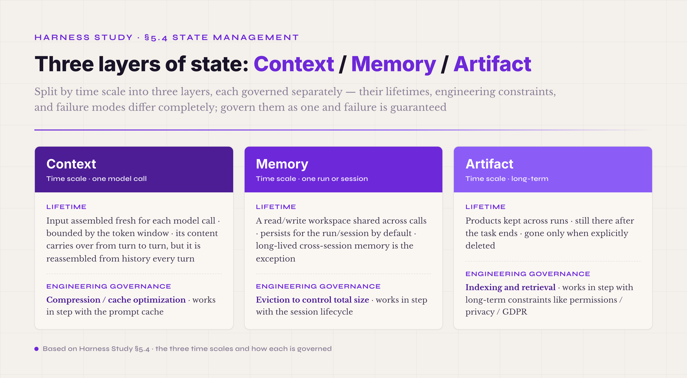
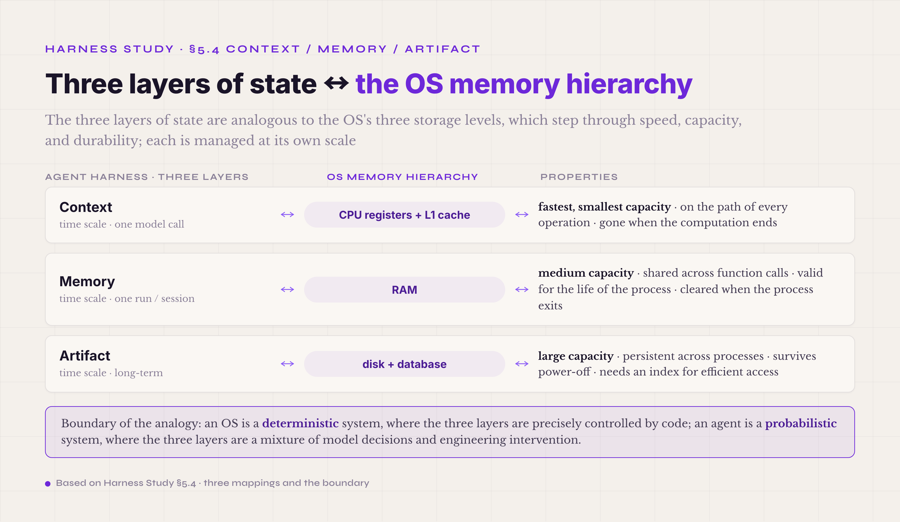
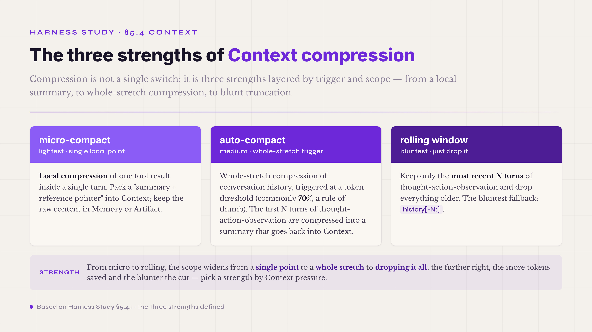
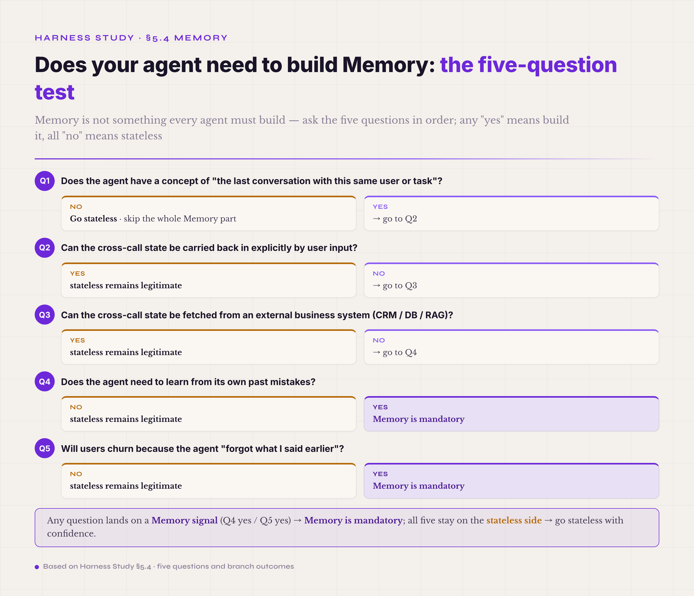

# 5.4 Context / Memory / Artifact · **P0 (Context) / P1 (Memory) / P2 (Artifact)**

The fourth mechanism is the agent's state management. Unlike state in traditional software, an agent's state cannot be thrown into one bag and managed as a whole. It has to be split by **time scale** into three parts, each maintained separately:

- **Context** is the input assembled fresh each time the model is called. Its content (conversation history included) carries over from turn to turn, but it is reassembled every turn and bounded by the context window.
- **Memory** is state the harness maintains outside the model, readable and writable across many calls. By default it lives for one run or one session and is cleared when the task ends. Long-term memory that must survive across sessions also belongs here (§5.4.0 draws the boundary).
- **Artifact** is what is kept across runs. It remains after the task ends, until someone explicitly deletes it.

The three are easy to lump together in one bag called "context management." This volume separates them explicitly because the industry's experience here is clear: govern the three kinds of state as one and you eventually get three failures at once. What should be cleared isn't cleared, what should be kept can't be kept, and the three layers contaminate each other. **This section covers the mechanism with the least tolerance for error in harness design.** Get the state mechanism wrong, and the strange bugs in the agent's behavior look exactly like model hallucination, which makes the root cause extremely hard to trace.

Why split by time scale? Because the three kinds of state have completely different lifetimes, and governing them as one means managing the longest lifetime with the rules of the shortest. The result: products meant to be kept long-term are dropped during a single turn's compression, memory that should survive across runs is wiped when the run ends, and intermediate state from a single turn, which should have been cleared, crosses the run boundary and keeps affecting the next task. These three typical failures share one root cause: state was not layered by time scale.

- **Context** lives on the time scale of one model call. Each time the agent calls the model, the harness assembles a Context. After the call that input is no longer used, and the next turn reassembles one from the history.
- **Memory** lives on the time scale of one run or one session. The intermediate state the agent keeps consulting while working on a task lives here, and it is cleared when the run ends.
- **Artifact** lives on a long-term time scale. The products a task creates, and whatever later similar tasks will reuse, disappear only when explicitly deleted.

*Figure 5.10 · The three time scales of Context / Memory / Artifact*

The three time scales call for three completely different kinds of engineering governance:

- Context is bounded by the token window. It needs compression and cache optimization, and it has to work together with prompt caching.
- Memory is bounded by runtime resources. It needs eviction to control its total size, and it follows the session lifecycle.
- Artifact is bounded by storage cost. It needs indexing and retrieval, and it has to satisfy long-term constraints such as permissions, privacy, and GDPR.

Governing them together means satisfying three mutually incompatible sets of constraints on one data structure. That cannot be done.

A cross-domain analogy makes the three layers easy to hold: **the storage hierarchy of an operating system**. Context is like CPU registers plus the L1 cache: fastest, smallest, on the path of every operation, and gone once used. Memory is like RAM: medium capacity, shared across function calls, valid for the life of the process, and cleared when the process exits. Artifact is like disk plus a database: large, persistent across processes, surviving power loss, and needing an index for efficient access.

*Figure 5.11 · The cross-domain analogy to the OS memory hierarchy*

OS engineering has decades of mature practice on these three layers: which data goes on which layer, how data is swapped between layers, how caches are invalidated, and how file systems organize indexes and transactions. Most of this experience transfers to agent state management. The correspondence runs as follows:

- Registers and L1 map to Context. Both are the fastest locations the compute unit can reach, both are capacity-bounded, and both require decisions about what to replace.
- RAM maps to Memory. Both are working areas shared within a process scope, both have eviction, and both work together with a cache.
- Disk plus database maps to Artifact. Both persist, both need indexes for efficient access, and both raise backup and access-control problems.

The analogy has limits. An operating system is deterministic, and code controls exactly what sits on each layer. An agent is probabilistic, and what sits on each layer results from model decisions mixed with engineering intervention. What OS experience offers is a structural reference: the idea of layering state by time scale can be borrowed directly, while each layer's implementation has to be redesigned against the real constraints of agent engineering. This book's judgment is that **the layering idea itself holds up**: designs that do not split agent state by time scale usually end in confusion.

A 2026 preprint, Artifacts as Memory Beyond the Agent Boundary[^artifacts-as-memory-2026], supports this layering. Its core claim: **memory is not confined to one side of the agent boundary; its data and functions can cross the boundary between agent and environment and reside in the environment.** This has an important implication for the three-layer split: **Memory and Artifact are not two different things but two sides of the same memory.** Memory sits inside the agent boundary as internal state the agent actively manages. Artifact sits outside it as what naturally gets left behind in the environment: files, database rows, knowledge-graph entries, Skill files, code. The same fact can be stored once inside the agent as Memory and once in the environment as Artifact; only the engineering governance differs. The next two parts use this claim repeatedly. They describe two governance regimes for the same memory, not two different kinds of storage.

The paper also offers an engineering lesson: **Artifact costs the agent less of its own capacity than internal Memory does.** In the paper's navigation experiment, an agent in an environment where the path (an Artifact) is visible needs noticeably less memory capacity to learn the same strategy, so externalizing state into the environment is more economical than packing it inside the agent. This supports the core position of the Artifact part: state that must be kept long-term goes to Artifact first, and Memory is reserved for working state that genuinely needs fast reads from one turn to the next.

§5.4.1, §5.4.2, and §5.4.3 below cover the engineering details of the three parts. Each part explains why it must exist on its own, the key governance strategies, the anti-patterns, and how to get started. Read at the priority that matches your stage. At the PoC stage, get Context engineering right first; without it the agent cannot run far. At the production stage, consider adding Memory; it is not always needed (see the test at the start of §5.4.2). At the scaling stage, add Artifact; without it, no business moat forms.

Three points need to be made clear up front.

**First, not every agent needs Memory.** Many vertical agents (compliance scanning, batch processing, API-doc generation, one-shot classification, one-shot tool triggering, industry-report generation) are perfectly reasonable as stateless designs. Compared with the stateful path, the stateless path saves a sizable share of infrastructure cost. It is also friendlier to K8s (Kubernetes was originally designed for stateless services, and stateful workloads need extra machinery such as StatefulSets and persistent volumes). And it has fewer failure modes: none of the stale state, race conditions, partial updates, or prompt drift that only stateful systems suffer. §5.4.2 opens with a five-question test so you can confirm, before investing in Memory engineering, whether this mechanism is truly necessary for your agent or only seems necessary because of the "memory is a first-class architectural component" slogan.

**Second, Artifact has three engineering levels.** From a single-tenant small or medium-sized business (SMB) to cross-department decisions in a large enterprise, the engineering complexity differs by several orders of magnitude. Which level to choose depends on business complexity and data-governance requirements; there is no reason to default to the heaviest. The three levels are:

- **Lightweight**: Postgres plus a few extensions, for PoCs and SMBs.
- **Bitemporal Knowledge Graph**: open-source systems with two time axes, such as Zep, Graphiti, and Memento, for mid-size agents whose state changes often.
- **Enterprise Decision Platform**: heavy platforms such as Palantir Foundry Ontology that integrate schema, business logic, executable actions, and permissions, for large enterprises, government, and defense.

§5.4.3 walks through them level by level.

**Third, are the three parts of §5.4 one mechanism or three?** Strictly speaking, they are three segments cut by lifetime from one abstract function, agent state management, and each follows its own governance principles. Context handles the input of a single call, Memory handles state across turns and calls, and Artifact handles products across runs. Their engineering constraints differ completely, which is why each gets its own detailed part. So they are neither "three independent mechanisms" nor "everything in one bag." The RAG and GraphRAG that §5.4.2 and §5.4.3 often use for the retrieval step form **a retrieve-and-inject engineering pattern that cuts across Memory and Artifact; it is not a mechanism in its own right**, and it holds whether the backend is a vector store, a graph database, full-text search, SQL, or an MCP server. The industry placement card at the end of §5.4 expands on this boundary.

#### 5.4.0 Terms first used in this section

Terms already explained in §I–§IV and §5.1–§5.3 (context window, lost-in-the-middle, schema, tool_call, Adapter, policy, Skill, and so on) are not repeated. Listed here are only the terms that appear for the first time in §5.4.

**Units of execution** (turn and run were defined at the start of §5.0; they are listed again here, with session added)

- **turn**: one model call plus the tool executions it triggers. A call that only thinks and calls no tool also counts as a turn.
- **run**: the whole course of one task from start to a terminal state (completed, failed, or canceled), usually spanning many turns.
- **session**: a continuous stretch of interaction between one user and one agent, which can contain several runs. For example, asking the agent in the same IDE window first to fix a bug and then to write a test makes two runs within one session.

**Three-layer state terms**

- **Context**: the input assembled fresh each time the model is called, including the system prompt, the tool list, the conversation history, and this turn's tool results. Its content (the conversation history above all) carries over from turn to turn, but the harness reassembles it every turn, and it is bounded by the model's context window. By the book-wide convention, Context is a view derived from history: history is the persisted, complete record of messages and events, and Context is the part computed from that history each turn and actually sent to the model.
- **Memory**: state the harness maintains outside the model, readable and writable across many calls. It holds "intermediate results this task keeps consulting but that you don't want to pack into Context every turn," and it is analogous to process memory in an operating system. Note that it is not the same thing as working memory in cognitive science (Baddeley & Hitch 1974). Working memory means the small amount of information being processed right now, which in this book corresponds to Context. By default Memory lives for one run or one session. Long-term memory that crosses sessions (the same user's preferences, the experience the same agent has accumulated, as in memory systems like Mem0 or Claude Code's MEMORY.md) also counts as Memory in this chapter, because this agent still reads and writes it and it mainly serves this agent. How to tell it apart from Artifact is covered by the three questions at the start of §5.4.3.
- **Artifact**: products kept across runs, still present after the task ends, the session closes, or the process exits, until explicitly deleted. It holds "what this task produced" or "what later similar tasks can reuse," and its readers can be any future agent, a person, or a business system. It is analogous to disk files plus database records in an operating system.

**Compression and window-management terms**

- **micro-compact**: local compression of a single tool result. For example, when a tool returns 100KB of file content, micro-compact puts only a summary like "read contract-2026.pdf, 12 pages, key sections are 3 through 5" into Context, and stores the full content in Memory or Artifact.
- **auto-compact**: compression of a whole stretch, triggered at a token threshold. For example, when Context reaches 70% of the window, a model compresses the thoughts, actions, and observations of the first N turns into one summary to reduce token usage.
- **summarization**: the summary-generation step inside auto-compact. It usually runs on a model cheaper than the main one, and summary quality directly decides whether the agent can still finish its task after compression.
- **budget guard**: a hard constraint, for example a forced stop once cumulative tokens pass a set value, which keeps the agent's cost from running out of control.
- **prompt caching** (also called prefix caching): a caching mechanism that Anthropic, OpenAI, and other vendors have offered since 2024. The vendor caches the computation for a prompt's prefix on the server side, and later requests with the same prefix skip recomputing that part. **The cached part is still billed, only at a discount.** At Anthropic, for example, a cache read costs about 0.1 times the normal input price, and a cache write costs 1.25 times (5-minute cache) or 2 times (1-hour cache); prices and rules vary by vendor. It requires a stable prompt prefix: once the prefix changes, the cache is invalidated. It caches only the computation over the input, not the output, and it does not change the sampling distribution.
- **rolling window**: a simple compression strategy that keeps only the most recent N turns and drops everything older. It is simple, but it loses early key information.
- **stable prefix**: the part at the start of Context that stays the same every turn (system prompt, tool list, standing reference material). It is the part prompt caching can hit.
- **prefill and time to first token**: before generating a reply, the model has to read the whole input once and compute intermediate results; this step is called prefill. The time from sending the request to receiving the first output token is called time to first token. The longer the input, the larger both become.
- **position bias**: a model makes uneven use of information at different positions in its context. The best-known form is lost-in-the-middle: information in the middle is more likely to be ignored than information at the head or tail.
- **observation pack**: a structured observation the harness assembles for the model each turn. It lists each tool result's summary, status, a reference to the full content, and its estimated token count; the raw content does not enter the message history directly. The "Tool-result layering" passage in §5.4.1 explains how it is used.

**Memory engineering terms**

- **scratchpad**: the Memory area where the agent "writes notes to itself." For example, the agent records on its own initiative that "the user prefers lunch at 12:30" or that "client X's project cares about cost more than schedule." It is reused across turns and written actively by the agent, unlike Memory the system captures automatically.
- **stale memory / memory rot**: Memory holding outdated data that was never marked invalid, so the agent keeps deciding on old data. This is a hidden bug that recurs in long-running agents. Typical case: the agent stored "the user's email is X," the user changed email three months later, and the agent still sends mail to the old address.
- **memory eviction**: the mechanism that keeps total Memory from growing without bound, analogous to cache eviction in an operating system. Common policies are LRU (least recently used), LFU (least frequently used), and importance scoring.

**Artifact engineering terms**

- **artifact store**: the physical backend holding cross-run artifacts. It can be a file system, object storage (such as S3), SQLite or Postgres, or a vector database (such as Qdrant or pgvector); the choice depends on artifact type and access pattern.
- **knowledge graph**: a way of organizing artifacts that stores domain entities (contracts, suppliers, policies, customers) and the relations between them ("customer A signed contract C with supplier B") as a graph. It suits domain agents that need relational reasoning.
- **RAG (Retrieval-Augmented Generation)**: the retrieval mechanism that pulls Artifact back into Context. Given a query, it retrieves relevant entries from the artifact store and injects the results into the Context of the next call. It is the retrieval channel through which the agent reaches long-term artifacts.
- **embedding retrieval** (vector retrieval): retrieval by similarity in a vector space. Each artifact and the query are turned into vectors, and the top k by cosine similarity are returned. It is the most common implementation of RAG.

#### 5.4.1 Context · the input reassembled every turn

Context is the layer where the agent meets the model most directly: on every model call, the harness sends the whole Context to the model as input. The mechanism has two root problems to solve. **The first is the token window constraint.** Even a 1M-token window has a ceiling, and a long-horizon agent running a few dozen steps can accumulate enough to hit it. **The second is position bias.** The lost-in-the-middle effect mentioned earlier makes the model systematically less accurate at using information from the middle of a long Context. Together, the two mean that stuffing everything in is a poor strategy even before tokens run out. Context has to be actively managed: what goes in, what stays out, when the contents get compressed, and how things connect after compression. This engineering practice of active management is **context engineering**. It matters as much as the choice of Agent Loop or model, yet it is often underestimated, because a PoC that runs only 5 steps in development never meets the problem. It shows up when a 30-step task runs in production.

**The engineering reality of the token window**

The nominal window and the effective window are far apart, and this is the first thing to understand when designing Context governance. Anthropic's Claude Opus and Sonnet are nominally 200K; OpenAI's GPT-5.5 and Google's Gemini both reach 1M nominally. These are ceilings on how much can be packed in, not on how much the model can still use well at that size. A running agent carries several large blocks of overhead in Context (the figures below are common magnitudes and rules of thumb):

- **System prompt**: usually 1K to 5K; a thorough one can reach 10K.
- **Tool descriptions**: 5K to 20K, for 20 to 30 tools at an average of 200 to 500 tokens each for description plus schema.
- **The model's reasoning channel**: a reasoning model has a separate thinking channel that does not count toward the final output text but consumes compute and token budget.
- **Accumulated thoughts, actions, and observations in the conversation history**: this is the genuinely variable part, and the longer the agent runs, the faster it grows.

A 30-step ReAct agent with no compression at all commonly reaches 50K to 80K of Context, and 150K is not rare.

So capacity planning for Context has to use the effective window, not the total window. An engineering rule of thumb: **reserve 30% to 40% of the window for the current turn's tool results, model thinking, and output** (rule of thumb; adjust to your scenario). In other words, a 200K window can give conversation history about 120K to 140K at most; beyond that, the current turn gets cramped. The reasoning behind the estimate: in one turn the model may think for a few thousand tokens, may call read_file once and get a 50KB document back, and still needs a few thousand tokens for output. At that volume, reserving 20% to 30% is not enough and 40% to 50% is more than needed.

Another commonly missed fact: **the longer the context, the more computation and latency every turn costs.** On every call the model first runs prefill over the whole input, and the attention computation grows with length; the longer the input, the higher the time to first token. Reusing the computation for the same prefix across requests depends on prompt caching. The part of the prefix that hits the cache is not recomputed, but whatever is added after the prefix is still computed as usual. So once Context grows past 100K, every turn's latency and cost rise with the length. It is a latency problem as well as a money problem. From experience, a production agent's wall-clock time for one turn at 100K of context can be 2 to 3 times what it is at 30K (a rule of thumb that varies with the model, the provider, and cache hits). This cost is invisible at the PoC stage and only shows up at production scale.

**micro-compact · local compression of a single tool result**

Context compression comes in three strengths, distinguished by trigger and scope. The lightest is **micro-compact**: local compression of a single tool result inside a single turn. The typical case is a tool returning a large block of content. The agent calls `read_file` on a 12-page contract and the tool returns 100KB of text; it calls `search_files` and gets 50 candidate files back; it calls `extract_clauses` and gets every clause of a contract. Pack those raw returns straight into Context, and one tool result can fill the Context, leaving almost no room for later turns.

*Figure 5.12 · The three strengths of Context compression*

micro-compact's approach is **not to pack the raw content directly**. Instead, Context gets **a summary plus a reference pointer** ("read contract-2026.pdf, 12 pages, key sections 3 through 5, covering payment terms, breach liability, and confidentiality; full content indexed at memory:doc-contract-2026"), and the full raw content goes to Memory (when it may be consulted later) or Artifact (when it is part of the product). micro-compact is a local decision for a single tool call within a single turn, and **each tool configures its summary strategy according to its own semantics**. The summary for `read_file` includes the file path, page count, and key sections; the summary for `search_files` includes the query, the total result count, and the top N paths; the summary for `extract_clauses` includes the clause count and each clause's number and summary.

There are two typical ways to implement micro-compact.

- **The tool does it itself**: the tool implementation returns both the raw content and a summary, and the harness decides which one to include based on the current pressure on Context. The advantage is that each tool knows its own semantics best and knows how to summarize itself. The drawback is that every tool needs two sets of logic.
- **The harness summarizes with a general model**: the tool returns only raw content, and the harness generates a summary with a cheap model before putting it into Context. The advantage is simple tool implementations. The drawback is uneven summary quality from a general model, especially poor on structured returns such as a list of 50 file paths.

Production harnesses mostly rely on the first approach and use the second as a fallback. Important tools that are called often and return long content (read_file, extract, search, and the like) implement their own summaries, while marginal tools fall back to general-model summaries.

In 2025 the implementation layer also gained a new member on the provider side. In September 2025, Anthropic shipped [context editing](https://platform.claude.com/docs/en/build-with-claude/context-editing) (automatic clearing of older tool results under a configured policy) and the memory tool (cross-conversation memory: Claude reads and writes it through a tool, and the storage lives in the developer's own backend) at the API layer. The former is the abstract function of micro-compact built into the API; the latter turns Memory's read-write duty into a tool. They fit the "abstract function versus implementation" frame of §5.0: when a platform builds an abstract function into its API, the division of responsibility for that function does not change. What to clear, what to keep, and when to clear are still the harness's decisions. Execution can be handed to the provider; judgment cannot.

**Tool-result layering**

Beyond these two approaches, industrial-grade harnesses have a sturdier one: **strip tool results out of the main message flow entirely and split them into three layers**.

- **Raw content**: stored in the artifact store, never entering the message stream.
- **Observation pack**: what the model sees by default is a structured observation pack that lists each result's summary, status, a reference to the full content, and its estimated token count.
- **Reference**: when the model needs the full text, it fetches it on its own through the reference.

The value of this approach is that it decouples two concerns: how tool results get summarized and how the message history stays stable. The observation pack is responsible for summary quality, the message stream is responsible only for keeping the prefix stable, and the two no longer compete for the same token budget. This book's companion implementation uses the observation pack as the default form for feeding tool results back to the model, which makes it one reference for this approach.

One anti-pattern is **truncating every tool return the same way**, for example "cut anything over 5K characters." Truncation is not summarization. It cuts off key information wholesale (the contract's breach clause may sit on page 10, past the cut point), and the agent's later reasoning never sees it. Truncation is a development-stage shortcut; in production it almost always has to be replaced by real summarization.

**auto-compact · medium-strength compression of whole stretches of history**

The second strength is **auto-compact**: compression of a whole stretch of conversation history, triggered at a token threshold. A common threshold is 70% Context usage (some projects use 80% or 60%; all are rules of thumb). When it fires, the thoughts, actions, and observations of the first N turns are compressed into one summary, which goes back into Context in place of the original content and frees space for later turns. Depending on the scenario, this step can run on a flagship model or a general-purpose one.

The hard part of auto-compact is not the compressing itself but **what the summary must keep**. Anything the agent's later reasoning might need has to survive, or the agent starts making things up. Four kinds of elements must be kept:

- **Key decisions**: for example, "turn 5 chose candidate A over B because of X." The agent will keep building on this decision.
- **Unclosed tool calls**: this assumes tools run asynchronously or in the background (a long-running build, an external approval), so a result may come back several turns later. Say the agent started a background job at turn 8 and the result still hasn't returned when compression fires at turn 12. The compression must explicitly mark that this call ID is still waiting for a result. A tool that runs synchronously returns its result within the same turn, so a call left open across turns cannot arise.
- **Artifact references**: index pointers to products already stored in Artifact. The agent will later retrieve them by artifact ID.
- **Verifier failures**: errors the agent has already hit, kept so it doesn't hit the same one again.

If the summary drops any of the four, the agent's later reasoning starts to invent. Without the key decisions, it forgets why A was chosen and switches to something else. Without the unclosed tool calls, it makes up a fake observation and acts as if the result had arrived. Without the artifact references, it invents an ID and builds a story around it. Without the verifier failures, it makes the same mistake again. These are **the hardest tool-call-related bugs to debug**: on the surface the agent is reasoning from the information it has, but in fact it is inventing, and it does not know it.

Listing the four kinds in the compression prompt is not the end of the job: **compression quality needs regression tests**. A workable practice is to keep a set of representative past runs as a golden set. Every time you change the compression prompt or the compression model, rerun compression and automatically check how well the four kinds survive: are the unclosed tool calls still there, are the key decisions still there, do the artifact references still resolve, are the verifier failure records kept. If survival drops, block the change. Compression is among the harness mechanisms with the highest risk of silent degradation. When it goes wrong it raises no error, the agent just gets gradually worse, and without a regression test you never learn which change broke it.

An engineered summary prompt must list the must-keep elements explicitly; "please summarize" is not enough. A usable template looks roughly like this: "Below is N turns of conversation history (concatenated). Compress it into a summary of no more than 500 tokens. **Must keep**: every unclosed tool_call_id and its current state, each turn's key decisions and their reasons, every artifact reference ID, every verifier failure verdict and its cause. **May drop**: repeated content, expired intermediate state, exploration branches unrelated to the final decisions, and the full raw observations of closed tool calls (a summary may stand in)." A template like this lets even a cheap model produce a basically usable summary.

Evaluating summary quality is a step auto-compact cannot skip. Give the summary plus the subsequent execution record to a reference agent (an oracle agent) and see whether it can carry the task to completion. If it cannot, the summary lost key information; go back and tune the summary prompt until it can. This offline evaluation can run at every harness upgrade so the summary prompt does not slowly degrade.

Which model does the compressing is a direct tradeoff. A cheap model (GPT-5.4 nano, Claude Haiku 4.5, Qwen Flash, DeepSeek V4 Flash) comes out 5 to 20 times cheaper than the main model by a rough estimate from public price lists (the ratio varies with the model pairing). The main model gives the best quality, but every compression becomes an extra main-model call, at clearly higher cost. Industrial harnesses mostly pair a cheap model with a strict summary prompt, because the work itself (writing a summary of a stretch of conversation history) is fairly simple, a cheap model can do it well, and the prompt design is what matters. For high-stakes tasks (contracts, medical, finance), you can upgrade the compression model to **a model one step below the main model but clearly stronger than the cheapest option** (for example, Claude Opus on the main line and Claude Sonnet on compression). That is reasonable engineering hardening: a failed compression costs far more than the savings.

**rolling window · the bluntest fallback**

The third strength is the **rolling window**: keep only the most recent N turns and drop everything older. It is simple enough to write in one line of Python (`history[-N:]`), and the price is that early key information is simply gone. Production harnesses generally don't use a rolling window alone. They pair it either with Memory (early information moves to Memory instead of being dropped) or with auto-compact (early information becomes a summary instead of being dropped).

The only scenario where a rolling window alone is appropriate is the **long-conversation agent**: ongoing chitchat with no defined "project end," customer-service bots, companion apps. Such an agent may hold conversations of hundreds of turns, but each turn's context is fairly independent, so it works fine after dropping the early conversation. A task-oriented agent (one with a defined deliverable and a task that needs long-horizon progress) almost certainly cannot rely on a rolling window alone, because dropping early content means dropping the task goal itself.

**Working with prompt caching**

Context governance has one more major task: **working with prompt caching.** The prompt caching that Anthropic and OpenAI have offered since 2024 lets requests with the same prefix reuse the computation for that prefix. The cached prefix is billed at a discount (an Anthropic cache read costs about 0.1 times the normal input price), and everything after the prefix is billed at the normal price. With a high hit rate, overall input cost can drop noticeably; how much depends on the prefix's share of the input and on the hit rate. But the cache requires a stable prompt prefix: change a single byte in the prefix and the cache is invalidated. auto-compact breaks prefix stability directly. When compression rewrites the middle, the cache from the rewritten point onward is invalidated.

The engineering compromise is **layering**: cut Context into three segments of different stability.

- **The most stable prefix** (system prompt, tool list, frequently used reference material) sits at the very front and is never changed. This segment often runs 10K to 30K and is the main source of cache savings.
- **The stable middle segment** (conversation history that has already happened) is where auto-compact may operate. When compression rewrites this segment, its cache is invalidated, but the prefix still hits.
- **The least stable tail** (the current turn's temporary content) is reassembled every time. This segment had no cache value to begin with.

This way the cache hits concentrate on the long stable prefix, and compression touches only the middle, never the head.

In production, a cache design counts as successful only when the hit rate reaches 60% to 80% (rule of thumb; adjust to your scenario). If it falls below 30%, investigate why the prefix is unstable. Common causes are a timestamp or random ID in the system prompt (something like "current time is 2026-05-20 14:30:00") or a tool list whose order reshuffles on every request (dict-to-list conversion with no guaranteed order). Problems like these are usually found only after overpaying on the API bill for a while, so the cache hit rate belongs on a real-time monitoring dashboard. A degradation path for cache misses also needs designing. If the cache suddenly fails across the board (provider-side maintenance, an accidental prefix change), input cost goes back to full price, and you need alerts and a degradation mechanism so the bill doesn't multiply unnoticed.

In concrete terms, prefix stability comes down to **six hard constraints**:

1. The system prompt must not change within a run.
2. The order of tool definitions must be stable.
3. Skills and configuration fragments must be arranged in a fixed order.
4. Runtime state (current time, progress, and so on) must not be concatenated into the system prompt.
5. Compression summaries must not replace any part of the stable prefix.
6. Content fetched on demand goes only into the dynamic part after the prefix, never into the stable prefix.

All six were worked out backward from real incidents. Break any one of them, and a common result is a cache hit rate that suddenly drops from above 80% to below 30%, noticed only after the bill has multiplied. Pair them from day one with four observability metrics on a real-time dashboard: the number of input tokens served from cache, the cache-hit share, the step at which the first miss occurs, and the reason the prefix changed. Then, as soon as the prefix drifts, you can pinpoint which constraint was broken. A harness with its prefix engineering done right can hold a production cache hit rate above 80% (a rule of thumb), and that number is the visible sign that the prefix engineering is right.

**lost-in-the-middle · engineering against position bias**

Fitting in the window does not mean the model can use it well. Lost in the Middle[^lost-in-middle-2024] (Liu et al. 2023) observed the **lost-in-the-middle** effect across multiple models. In multi-document question answering, answer accuracy is clearly higher when the same key information sits at the head or tail of the input. Placed in the middle, accuracy drops, sometimes by more than 20 percentage points, tracing a U-shaped curve. Newer models show a weaker effect, but it has not gone away. So a 1M context that fits a whole repository does not mean the model can use it well, and key information placed in the middle is still easily overlooked.

There are four main engineering responses:

- **Put key information at the head and tail**: the most important part of the system prompt goes at its end (next to the user message), and the current task statement goes at the very end of the user message (next to the model's answer).
- **Repeat key information**: put the same key instruction once at the head and again at the tail, so the model sees it at least once in a favorable position. The cost is double the words, but the return is usually worth it.
- **Explicit markers**: markers like `# IMPORTANT` or `# MUST FOLLOW` remind the model to attend to the passage. Simple, and it works.
- **Retrieval instead of direct packing**: key artifacts are not packed directly into Context. The agent gets a reference ID instead ("reviewed clauses at artifact:contract-2026") and fetches the content with a retrieval tool when it actually needs it. Retrieved content enters the tail of the current turn (next to the model's answer), the position the model uses best.

A counterexample: pack the full text of a 50-page contract into Context and ask the agent to find the anomalous clauses. If most anomalous clauses sit in the middle (pages 10 to 40), they fall exactly where the model is most likely to overlook them, and the risk of missing them rises noticeably. The right production approach for such tasks is to use micro-compact to put a contract summary and key markers into Context, store the original contract in Artifact, and let the agent retrieve a specific clause when it actually needs to read it. The key content is then always used from the tail, where the model uses it best.

**Matching Context to the shape of the Agent Loop**

Different Agent Loop shapes place different demands on Context governance, and the two must be designed together.

- **Vanilla ReAct** (the original ReAct) grows Context fastest. Every turn adds one set of thought, action, and observation, and there is no natural reset point. Tens of thousands of tokens by turn 20 is normal, and the compression threshold arrives by turn 30.
- **Plan-Execute** splits Context into two phases. In the plan phase, Context holds a task brief plus a skeleton of 5 to 15 steps, compact and not growing. In the execute phase, each step's Context carries the plan skeleton and the current step's local history, and after each step Context can reset to "plan skeleton plus next step" and start over. The Context governance pressure in the execute phase is far lighter than in vanilla ReAct.
- **Reflexion** adds a separate reflection channel to Context. Every N turns, the results of reflecting on the execution record so far go into Context as a separate segment. The reflection segment also needs compression, or accumulated reflections double the Context.
- **Skill-Based Hierarchical** has the Agent Loop dispatch at the Skill level instead of calling raw tools directly. Instead of a sequence like "call read_file → call search_files → call extract_clauses," Context shows a single line, "call the extract_contract_terms skill" (which wraps several tools internally). Context gets noticeably smaller, but when something inside a Skill fails, the details are not available for debugging.

One anti-pattern is **running vanilla ReAct on long-horizon tasks without compression**. It is the easiest trap to fall into when a PoC moves straight to production. In development the task runs 5 steps and ends at 20K tokens, and the developer concludes that Context is fine. In production the task runs 40 steps, tokens pass 200K and keep accumulating, key information ends up in the middle, and the agent's quality drops. The root cause is not "the wrong Agent Loop." It is failing to see that the loop's shape determines how fast Context grows, so compression has to be designed to match.

**Multimodal Context handling**

Multimodality adds another layer of complexity to Context governance. Images cost far more tokens than text: on Anthropic's Claude, one high-resolution image runs about 1,500 tokens, and a scanned PDF about 2K to 3K tokens per page. Put screenshots, PDF pages, or scanned documents straight into Context, and one or two of them take up a large share.

The engineering approach is to **analyze the screenshot first, put only the analysis back into Context, and store the original image in Artifact**. For example, a screenshot goes to a vision model that returns a structured description; the description, a few hundred tokens, goes into Context, and the original image, a few thousand tokens, goes into Artifact with an index. Video and audio are larger still. One minute of video sampled at one frame per second can run tens of thousands of tokens, so it must first be downsampled, keyframed, or auto-summarized at the Adapter layer into a description of a few hundred tokens before it can enter Context. micro-compact in multimodal settings differs from the text-only case. With text, long text becomes short text; with multimodal input, images, video, and audio become text (with an index). The latter depends on a separate multimodal summarization toolchain, a complexity of multimodal agent engineering that is easy to overlook.

**Anti-pattern · treating Context as infinite memory**

The most common anti-pattern in Context governance is **using Context as infinite memory in development and hitting the wall in production**, known as Context Bloat (AP08; see Appendix F).

Here is how it happens. In development, tokens never look scarce. A PoC task runs 5 steps and is still at 20K, so the developer decides a 200K window is more than enough, packs in everything "just in case," and does no active management. The practice causes no visible trouble at the PoC stage. Then production-scale tasks run (contract review at 30 steps, monthly reports at 40, customer consultations at 50), and Context routinely reaches 70% to 80% of the window. By the time the threshold is hit, even if auto-compact fires, the agent has already run many turns in a very long context. Many key decisions sit in the middle and are overlooked by the model because of position bias, later reasoning rests only on what the model "still remembers," and the results are unreliable.

One piece of engineering experience (an observation from practice, not a systematic survey): in production agent projects that have run for more than half a year, Context mismanagement is one of the main reasons task pass rates fall. The other two common sources are a missing verifier and tool descriptions not written to ACI principles. The symptom is that long-horizon tasks (20+ steps) pass at a clearly lower rate than short ones (up to 10 steps), and investigating the drop usually ends at "after turn 15 the model started ignoring the key findings of turns 3 to 5." This relates both to position bias and to the decline in model performance as the context as a whole gets longer (context rot).

How to judge: run a 50-step end-to-end dry run and watch the token growth curve. Taking a 200K window as the example, **using less than 15% of the window at step 30 is healthy**; 40% or more at step 30 means no Context engineering was done; 75% or more at step 30 means the wall has already been hit (all rules of thumb; adjust to the scenario). This dry run should be a mandatory test before a harness goes to production. It also matters where the line falls. A pure short-conversation agent (done within 5 steps) can skip Context engineering; long-horizon tasks (20+ steps) cannot; for tasks of 10 to 20 steps in between, it depends on task density (whether each step brings many large tool results).

**Getting started · four dimensions**

**What to watch.** Reserve 30% to 40% of the token window for the current turn (a rule of thumb), and never plan capacity by the window total. micro-compact, auto-compact, and rolling window each have their own use; don't default everything to a rolling window. Prompt caching and compression are coupled, so when designing the cache, first work out how compression will leave the stable prefix intact. lost-in-the-middle exists in a 200K context too, and a 1M window is not a cure-all. The most underestimated problems are the ones invisible in development: the token volumes a PoC never reaches, production will.

**How to design.**

- Cut Context into three segments (stable prefix, middle history, current-turn tail), each with its own governance strategy.
- Configure each tool's micro-compact summary format according to its semantics, rather than truncating everything the same way.
- The auto-compact summary prompt must list the must-keep elements explicitly (unclosed tool_call_ids, key decisions, artifact references, verifier failures).
- Make the Context growth curve an observable metric so problems surface immediately.
- Multimodal content takes the "analyze, summarize, store the original image in Artifact" path by default.

**How to test.**

- Token-growth dry run: run a 50-step task and check whether the token curve is healthy.
- Before-and-after compression comparison: the agent's task pass rate should drop by no more than 5 percentage points (a rule of thumb). A larger drop means the summary prompt is poorly designed, so go back and tune it.
- Cache hit rate monitoring: it should sit at 60% to 80% (a rule of thumb); below 30%, check prefix stability.
- Mid-context utilization test: plant known key information in the middle of a 100K-to-200K context and see whether the agent can use it.

Together these four tests close the engineering loop on Context governance. Without that loop, tuning runs on intuition, and the odds of falling into a trap are high.

**What to put in the prompt.** The auto-compact summary template must state the "must-keep elements" and the "may-drop elements," so even a cheap model produces usable summaries. The agent's system prompt should tell it that "Context capacity is limited; don't repeat long content directly, just cite the artifact index," so the agent actively cooperates with Context governance instead of relying on the harness to catch everything. A reasoning model's thinking budget ceiling should be stated in the system prompt ("think longer on complex decisions, but keep thinking under X tokens or it will be cut off"), so runaway thinking doesn't swallow the Context.

Of the three layers in §5.4, Context is the one with **the least tolerance for error and the best-hidden pitfalls**. Done right, the agent runs long and stays stable. Done wrong, the pass rate of every long-horizon task suffers, and the root cause is hard to trace. Design Context as an engineering project of its own from day one. Don't wait for tasks to hit the wall in production and then go back to patch it, because patching costs far more than getting it right at the start.

#### 5.4.2 Memory · readable and writable state outside the model

Memory is the layer where the agent deals with itself. It is not part of the model; it is state the harness maintains outside the model and shares across turns. Context is the input assembled fresh for each model call, which the model reads from the beginning every time. Memory is a persistent working area the agent actively writes and actively reads. The biggest difference between them is **lifetime**. Context is reassembled every turn, and whether any of its content carries into the next turn depends on how the harness assembles it from the history. Memory exists for the whole run (or session) and is cleared only at the end, while long-term memory that crosses sessions is managed by its own invalidation rules.

What concrete problems does this mechanism solve? There are three root scenarios.

- **Taking load off Context**: a key number the agent computes at turn 3 is needed again at turn 15. Rather than keeping it in Context the whole time, where it may be compressed away into a summary before turn 15, store it in Memory and read it back at turn 15.
- **Keeping judgments across turns**: at some turn the agent judges that "the user prefers lunch at 12:30" or "client X's project cares most about cost." Writing such judgments into Memory creates a working belief the agent established itself, which it reads back and uses in later decisions.
- **Storing tool-call state explicitly**: §5.4.1 showed that losing unclosed tool calls during compression causes hidden bugs. Memory is where this state properly belongs: store each tool_call_id and its current status explicitly in Memory, decoupled from Context compression.

Memory is not an extension of Context but an independent storage layer in agent engineering. Seeing this and avoiding the "treating Context as infinite memory" anti-pattern are the same issue: state that has not been layered.

**Does your agent actually need Memory · the necessity test**

In 2026, vendors of memory systems such as Mem0, Letta, and Zep all promote Memory as a "first-class architectural component." The slogan easily leads readers to believe that every agent needs Memory. The real engineering picture is more complicated: many vertical agents are perfectly reasonable as stateless designs, and skipping Memory is actually more economical for them.

Designing Memory as a first-class component and making it the default for every agent are two different things. The Mem0 paper[^mem0-2025] reports good results on LoCoMo, a long-conversation memory benchmark, but **having a Memory capability does not mean every agent should enable it by default**. Whether to enable it is decided by the test below.

**Typical stateless scenarios**: in these scenarios, the whole Memory part can be skipped.

- **One-shot classification and scoring**: spam filtering, content tagging, risk rating, compliance scanning, document classification. Each item is independent, and each input maps to one output.
- **One-shot transformation**: translation, format conversion, code linting, ETL data cleaning. Functional "input → output."
- **One-shot Q&A**: FAQ bots, customer-service knowledge-base lookups. RAG stands in for Memory, and each query hits the knowledge base independently.
- **One-shot tool triggering**: set a timer, play music, check the weather. Imperative tool calls with no state.
- **Batch jobs**: overnight bulk review, data cleaning, monthly report generation. Each record is processed independently.
- **One-shot deliverables**: standalone tasks such as industry reports, API docs, or code review of a single PR.

The benefits of the stateless path are not minor:

- **Infrastructure cost**: compared with the stateful path it saves a considerable amount, with no session store, state database, consistency handling, or state synchronization.
- **Friendlier to K8s**: K8s was originally designed for stateless services. Stateful workloads need extra machinery such as StatefulSets and persistent volumes, and they are much more complex to deploy.
- **Fewer failure modes**: none of the traps unique to stateful systems, such as stale state from parallel overwrites, partial updates, race conditions, prompt drift, or state lost on retry.
- **Simpler debugging and operations**: a crash loses no data, a restart loses no tasks, and horizontal scaling has no state to synchronize.

Some scenarios, though, cannot go stateless and must have Memory:

- **Multi-turn conversation**: a customer-service bot talking with a user over many turns; an IDE coding assistant keeping context across turns.
- **Personal assistants**: learning user preferences ("I have lunch at 12:30") and maintaining customer profiles.
- **Intermediate state of long tasks**: contract review at 30 steps, monthly report generation at 40, with heavy intermediate state between turns.
- **Continually learning agents**: a research agent that runs for days on end and accumulates experience.
- **Resumable tasks**: a long task that is interrupted and resumes from where it stopped.
- **Self-reflection and iterative learning**: an outer loop that remembers which errors it has already made, so it avoids repeating them.

To decide which path your agent takes, answer the following five questions in order. Any "yes" puts you on the Memory path; all "no" means stateless.

**The five questions**

1. **Does the agent have a concept of "the last conversation with this same user, on this same task"?** No (every request is independent, like a REST API) → stateless; the test ends here and the Memory part can be skipped. Yes → go to question 2.
2. **Can cross-call state be carried back explicitly in user input?** Yes (the user tells the agent the full background every time, like an API call that carries its complete payload) → stateless is still viable. No → go to question 3.
3. **Can cross-call state be fetched from an external business system (CRM, database, RAG)?** Yes (the agent queries the CRM directly at runtime, leaving the memory to the business system) → stateless is still viable. No → go to question 4.
4. **Does the agent need to learn from its own past mistakes?** No (every task is new, with no experience to accumulate) → stateless is still viable. Yes → Memory is required.
5. **Will users leave because the agent "forgot the X I told it before"?** No (users already expect every interaction to stand alone) → stateless is still viable. Yes → Memory is required.

*Figure 5.13 · The five-question test for whether to build Memory*

One caveat applies once the test is done: **in large-scale production systems, the real answer is often a hybrid.** The frontend is stateless (scaled horizontally on K8s, keeping no session state), the orchestration layer is stateful (a separate service holding task state), and a correlation ID passes between the two. The frontend takes user requests and gets the benefits of horizontal scaling; the orchestration layer holds long-task state and keeps it continuous. This hybrid is a common pattern for high-concurrency B2B agents. Pure stateless and pure stateful are the two extremes, and real production sits between them.

The rest of this part assumes the five questions put your agent on the Memory path and goes on to how Memory engineering works. If you landed on the stateless path, you can skip ahead to §5.4.3 on Artifact (many stateless agents still need the Artifact layer to archive their products).

**The second-level test · how many kinds of memory to build**

Once the five questions say "Memory needed," a second-level test follows: **Memory is not all-or-nothing; it comes in four kinds, each built when the scenario calls for it.** The four kinds are borrowed from cognitive psychology's classification of memory:

- **Working memory**: the information being processed right now (Baddeley & Hitch 1974).
- **Episodic memory**: specific events that happened, "what happened."
- **Semantic memory**: facts and concepts, "what is true."
- **Procedural memory**: skills and workflows, "how to do it."

The distinction between episodic and semantic memory comes from Tulving's classic 1972 work, and procedural memory belongs to non-declarative memory. CoALA (Sumers et al. 2023, arXiv 2309.02427, a cognitive-architecture framework for language agents) carried this classification over to language agents. In agent engineering the rough correspondence is as follows. Working memory maps to Context plus a little short-term session state; episodic memory maps to an event stream stored as vectors plus timestamps; semantic memory maps to domain facts in a graph or structured store; procedural memory maps to verified skills kept in a skill library. Note that **this is an analogy, not an equivalence**: these kinds of agent storage borrow cognitive science's names and its way of dividing memory, but they do not have the mechanisms or properties of human memory.

Not all four are needed. A general chatbot usually needs episodic only. A professional agent (research, coding) needs episodic plus procedural. A domain agent (medical, legal, civil aviation) needs episodic plus semantic (the domain fact set). A toy prototype needs none of the four.

The most common implementation error is "solving every memory need with a vector database." Vector retrieval suits finding similar events (it is the main retrieval mode of these systems). But vector retrieval is weak at "find all memories related to user X," which needs a graph. Vectors have no notion of time for "find the events of the last 30 days." And "reuse verified code" should not rely on vector retrieval at all; it belongs in a skill library.

One more split goes with this test: **who manages Memory**. There is automatic system capture (the Mem0 approach, medium engineering complexity), the agent reading and writing through tools itself (the Letta approach, low engineering complexity), or a mix of the two (high engineering complexity, but the best results at industrial scale).

**Write policy**

The engineering difficulty of Memory writes lies in **what to write, when to write, and which backend to write to**. Together, these three decide whether Memory is a useful working area or a disordered dumping ground.

**What goes into Memory** is an engineering judgment. §5.4.1 gave the main criteria; here they are expanded to the level of mechanism.

- **Intermediate results that several turns will read again**: say the agent computes a statistic (cost up 18% year over year) that the next 5 turns will reference. Storing it in Memory saves more tokens than letting it accumulate in Context, and it lowers the risk of invention.
- **Large raw content that Context cannot hold**: the raw text of a 50KB contract, once micro-compact decides to keep it out of Context, goes into Memory until the agent actually needs to read a particular clause.
- **Judgments the agent itself decides it "will use again"**: this is the scratchpad pattern, the agent writing notes to itself, such as the working belief "this client prefers an ROI with a three-year payback, not five."
- **Tool-call state**: store unclosed tool_call_ids and their current status explicitly, so compression can't drop a tool call and lead to invention.
- **Verifier failure records**: errors the agent has already hit ("tried path X, it doesn't exist"), so it avoids retrying them.

What stays out of Memory?

- **Anything used up within a single turn**: arguments temporarily assembled for the current tool call, candidate lists the model generated (of which only one is chosen in the end), and the like.
- **Anything recomputable from another source**: "the current time," for example, should be read from the system clock each time rather than stored in Memory, which avoids staleness.
- **Sensitive information and personally identifiable information (PII)**: kept out, or let in only after processing. If the Memory backend could ever be accessed across users, or is subject to GDPR's "right to be forgotten," putting PII into Memory directly is a compliance risk.

**When to write** has three triggers.

- **Manual write**: the agent calls `memory_store(key, value)` to write on its own initiative.
- **Automatic capture**: at fixed hook points, such as a tool call completing or a verifier firing, the harness automatically writes the relevant context into Memory.
- **Threshold trigger**: when a token threshold is reached, key segments of the existing execution record are synced into Memory automatically.

Production harnesses usually mix all three. The prompt teaches the agent to "record important findings with memory_store"; the harness automatically captures the necessary tool-result summaries when tool calls complete; and key decisions are synced when the token threshold is reached.

**Which backend** depends on the data's access pattern. Structured data with clear fields goes to SQLite; key-value data with frequent reads and writes and an expiry time (TTL) goes to Redis; unstructured natural language goes to a vector store; data that needs multi-dimensional relational queries goes to a graph database. The harness exposes one unified `memory.store()` interface on top and routes to the matching backend by data type internally: the agent sees one Memory, while the engineering underneath is layered by access pattern. The physical backends of Memory are not expanded here, since the start of §5.4 already gave the RAM analogy. The comparison of SQLite, Redis, vector stores, and graph databases is not repeated either (it overlaps with the Artifact part); the focus stays on the engineering governance specific to Memory.

**Retrieval strategy**

Once Memory is written, how is it read? Retrieval strategy is paired with the physical backend, but the essential question is "which Memory content does the agent need for this call?"

**First, exact key reads.** The prompt teaches the agent to read directly by key with a call like `memory_get("contract-2026-key-findings")`, usually backed by a relational or key-value store. It is precise, fast, and predictable. The drawback is that the agent has to remember what the key looks like, and a wrong key reads nothing. It suits Memory with a highly regular structure.

**Second, field queries.** A conditional, SQL-like query such as `memory_query(category="supplier", risk="high")` filters matching records out of structured Memory, usually backed by SQLite or Postgres. It suits Memory whose content has a clear schema (supplier profiles, clause libraries, customer profiles).

**Third, full-text search.** Given keywords, it searches Memory for matching entries, usually backed by SQLite FTS5 or Postgres full-text search. It is more precise than vector search (the keyword must appear) and more flexible than key reads (no key to remember). Its weakness is that it cannot match across phrasings ("client prefers low prices" will not find "client cares about value for money"). It suits domains with stable terminology.

**Fourth, vector search.** A natural-language query such as `memory_search("customers associated with low-price preferences")` is vectorized, and the top k entries by cosine similarity are returned from a vector store. It matches across phrasings naturally. The drawback is that the ranking can drift (the first result is not always truly relevant), and exact matching is actually worse.

**Fifth, graph traversal.** A relational navigation query such as `memory_traverse(from="customer-A", relation="signed_contract", depth=2)`, backed by a graph database, suits multi-hop relational reasoning.

**Sixth, hybrid retrieval.** First filter candidates by keyword or field (high precision), then rank and weight them by vector similarity (high recall), and finally rerank with a model to take the top k. This is a common approach to RAG-style Memory retrieval at industrial scale. Any single method has its limits; only the mix balances precision against recall.

Which strategy to choose is closely tied to how the agent's system prompt teaches it. The agent is told in its prompt: "You have three retrieval tools, memory_get, memory_query, and memory_search. Use memory_query for structured exact lookups, memory_search for fuzzy semantic lookups, and memory_get when you know the exact key." The ACI design of the retrieval interface (§5.3's "design tool interfaces around how the agent uses them") matters as much as for any other tool. Names, parameters, and error returns all have to be designed around how the agent understands them.

A common error is **giving the agent only a memory_search tool**, so every scenario runs through vector retrieval. Then even exact queries ("where is the key X I just stored?") take a detour through vectorization, and accuracy becomes unstable. Give the agent at least two retrieval interfaces (exact key reads and fuzzy search) and let the model judge which one to use.

**Lifecycle · TTL · invalidation**

Memory's biggest difference from Context is its **longer lifetime**: it persists throughout the run, and long-term memory even persists across sessions. But "always there" does not mean "never changes." Memory must have an invalidation mechanism, or it turns into stale memory and the agent makes decisions on outdated data.

There are three main engineering implementations of invalidation.

**First, fixed TTL.** Each Memory entry carries a time-to-live and is cleared automatically when it expires; Redis's built-in TTL is the simplest implementation. The hard part of a fixed TTL is **choosing the duration**. Five minutes is too short (the entry expires before the agent uses it), while 24 hours may be too long (the data has changed and the agent is still using it). The usual answer layers by data type (the values below are rules of thumb; adjust to the scenario). Fast-changing data (current prices, inventory) gets a TTL of 5 to 30 minutes; data that changes at a medium rate (customer preferences, supplier profiles) gets 1 to 7 days; slow-changing data (compliance rules, policy libraries) gets 30 days or longer.

**Second, business-event triggers.** When a certain event occurs, a group of related Memory entries is actively invalidated. For example, a "customer profile updated" event invalidates every Memory entry that cached that customer's preferences. This requires integrating the harness with the business systems (subscribing to business events), but it is the most accurate: entries are cleared only when the data truly changes and stay usable as long as it does not, with none of TTL's "expired but actually unchanged" waste.

**Third, dependency tracking.** Memory entries depend on one another ("total cost computed from contract X" depends on contract X), and when contract X changes, every Memory entry that depends on it is invalidated. Dependency tracking is extremely accurate but complex to engineer: every entry must declare its dependencies explicitly when written, and business changes must be traced along the dependency chain.

Industrial harnesses mostly combine **fixed TTL with business-event triggers**. TTL is the backstop (even with no event firing, nothing stays stale indefinitely), and business events handle precise updates (entries are cleared the moment the data truly changes). Dependency tracking is usually reserved for critical Memory (for example, key data in contract review such as "the contract clauses are the factual basis").

**Lifecycle · consolidation · Claude Code's Auto Dream (as described by a third party)**

TTL and invalidation handle two situations, "expired" and "overturned." Memory has one more problem that neither mechanism covers: **memory fragmentation**. When an agent runs for a long time, Memory accumulates many duplicated, redundant, and mutually contradictory entries. No single entry has expired or been overturned, yet Memory as a whole has become a disordered dumping ground, and retrieval accuracy falls.

The approach to fragmentation is called **consolidation**. A frequently cited example is Claude Code's **Auto Dream**[^claude-code-auto-dream] (also known as the `/dream` command), but one caveat comes first: **Anthropic's official documentation and changelog contain no record of it, and what follows is based on a third-party blog's description.** What can be verified officially is Claude Code's auto memory, which loads the first 200 lines or the first 25KB of MEMORY.md at the start of a session.

According to that blog, Auto Dream borrows the analogy of memory consolidation during sleep. After the agent has run for a while, a consolidation pass fires periodically and does the following in order:

1. Read the conversation records of the last several sessions.
2. Delete facts that are out of date.
3. Merge duplicate entries.
4. Rebuild the MEMORY.md index.
5. Convert relative dates to absolute ones ("decided yesterday to use Redis" → "decided on 2026-05-20 to use Redis").

Consolidation runs in the background without blocking the user's current session, and it may only write memory files; it cannot change source code or configuration. This capability boundary is what makes consolidation safe: however inaccurate the consolidation model is, it can only alter Memory and never contaminate the agent's executable environment.

The same blog says the trigger is 24 hours since the last consolidation plus at least 5 accumulated sessions, and `/dream` can also be run manually. The output standard for consolidation is "keep facts that still hold, delete the overturned ones, merge duplicates, rebuild the index." MEMORY.md has to stay within the load limit mentioned above; anything beyond it is not loaded at the start of a session.

Whatever Auto Dream's exact details, consolidation mechanisms of this kind matter to §5.4.2 in three ways.

- **First**, they give memory rot an engineered response. As the "Defending against memory rot" passage below explains, memory rot has no complete cure; its frequency can only be brought down from "every time" to "once in a long while." Periodic consolidation cannot fully prevent rot, but it can lower its frequency significantly.
- **Second**, they extend Memory lifecycle management beyond TTL and invalidation. TTL handles "expired," invalidation handles "overturned," and consolidation handles "fragmented"; together the three mechanisms cover the three failure modes of the Memory lifecycle.
- **Third**, they point to the tradeoff over which model runs consolidation: use **a model one step below the main model but clearly stronger than the cheapest option**. A model that is too cheap tends to merge carelessly and lose facts, while the main model is not worth the extra cost.

Auto Dream's scope is narrow, though. Even by the blog's account, this is a feature Claude Code builds in for itself, not a general agent-memory framework. It works on memory in the form of Markdown files and does not suit structured Memory in SQL or graphs. Other agent systems that want to replicate the mechanism must implement their own consolidation pipeline and redesign both the prompt and the capability boundary. It does show one thing, though: for long-running stateful agents, memory consolidation deserves careful design as a mechanism in its own right, not as an optional add-on.

**Consolidation is not risk-free · it has a failure mode of its own**

Consolidation can deal with fragmentation, but the act of consolidating introduces a new kind of degradation: **even when what gets consolidated is correct, the consolidated memory can make the model perform worse.** A small-sample preprint experiment shows this. In Useful Memories Become Faulty[^faulty-memory-2026], GPT-5.4 first solved 19 ARC-AGI problems without memory and got all of them right (100%). The problems' **own reference solutions** were then consolidated into memory, the model solved the problems a second time, and accuracy fell to 54%. The degradation came neither from outdated content nor from contradictory entries. What was consolidated was the correct solutions; the act of consolidation changed how the model used its memory.

This complements, rather than repeats, the three causes in the "Defending against memory rot" passage below. Those three causes (an external change goes unnoticed, a dependency chain breaks, a working belief never gets updated) are about **memory content going out of date**. This kind is about **content that is still correct, yet the model uses it worse after consolidation**. Two engineering points follow.

- **First**, a consolidation pipeline must ship with regression tests. After consolidation runs, rerun a set of tasks the agent could previously solve, and the pass rate must not drop. This study suggests that the "consolidation quality test" item in the getting-started advice below cannot be skipped.
- **Second**, don't assume that "recording the correct answer is bound to help." How you delete, merge, and rebuild the index directly decides whether the consolidated memory helps the model or holds it back. Settle it with data, not intuition.

**Defending against memory rot**

Even with TTL, invalidation, and consolidation in place, **memory rot** remains a hidden bug that recurs in long-running agents. It usually has three causes.

**First, an external data change goes unsensed.** The agent stored "the user's email is X"; three months later the user changed it in another system; your agent never subscribed to that change event, and Memory still holds the old address. A 30-day TTL looks reasonable, but for an email that changes once in three months, a 30-day TTL means up to 30 days of the agent mailing the old address after the change.

**Second, the dependency chain breaks.** The Memory entry "total cost = 1,000,000" depends on "contract X's unit price and quantity." At some turn contract X's unit price is updated, but the invalidation does not cascade to "total cost" (the dependency was never declared explicitly), so the agent keeps deciding on the old total cost.

**Third, working beliefs the agent writes itself have no update mechanism.** At turn 5 the agent writes "client prefers supplier Y." At turn 30 the client says in conversation, "I lean toward supplier Z now," but the agent only puts that exchange into Context and never updates the Memory entry. At turn 50 the agent reads the entry again and still decides on "prefers Y."

There are four engineering defenses against memory rot.

- **Metadata on every Memory entry**: write time, source (manual, automatic capture, automatic sync), confidence (written by the agent itself or synced from a business system), and last-verified time. Reading Memory means reading the metadata as well as the value; entries that are too old or low in confidence get re-verified first.
- **Refresh triggers on critical Memory**: teach the agent in its prompt, "when you read this Memory entry, if it seems to contradict the current conversation, or it was written more than N days ago, re-verify it with a tool right away."
- **A freshness-check tool**: give the agent a `memory_check_freshness(key)` tool to call whenever it has doubts.
- **Critical Memory stores facts, not working beliefs**: working beliefs the agent writes on its own, such as a "client preference," go stale easily. Store raw facts such as "the verbatim text of the client's most recent conversation" instead, and let the agent re-infer from the facts each time.

Memory rot has no complete cure; you can only bring its likelihood down from "every task" to "once in a long while." It is a failure mode inherent to the Memory mechanism. Don't chase a perfect "never stale"; aim for an engineering loop in which problems are found fast and fixed fast.

**The boundary between scratchpad and system-captured Memory**

Memory has two sources: the scratchpad the agent writes itself, and the system Memory the harness captures automatically at hook points. The two need completely different governance, and mixing them loses control of both.

The **scratchpad** is the agent's own notepad. The prompt teaches the agent that "important findings go into the scratchpad, where later turns can read them." What to write is entirely the agent's call, and the content is the agent's subjective judgment: working beliefs, hypotheses, task progress. The scratchpad is **small in capacity, written often, free in content, and fully controlled by the agent**, and reads are also agent-initiated, through `scratchpad_get()`.

**System-captured Memory** is written automatically by the harness at fixed hook points: a result summary when a tool call completes, failure details when a verifier fires, the plan skeleton when the plan phase completes. The agent does not see the write happen, but it gets the content when it reads Memory. Its traits are **fixed write rules, structured content, and full harness control**; the agent cannot modify it.

The boundary between the two must be drawn clearly. **The scratchpad must not hold structured critical state** (tool-call status, verifier failures, artifact references: facts the harness must be able to trust), because content the agent writes itself cannot be trusted, and the agent may also forget to write it or write it wrong. **System-captured Memory must not store working beliefs.** A working belief is the agent's subjective judgment and the agent's own responsibility, and the harness must not record on the agent's behalf a "we believe the client prefers X" that the agent never declared.

This boundary follows the same reasoning as keeping raw errors and processed errors apart in §5.3's discussion of ACI. What the agent writes belongs to the agent, what the harness writes belongs to the harness, and storing them together makes it impossible to tell who is responsible for what.

**Shared Memory across multiple agents**

Sometimes there is more than one agent: a lead agent splits a task across sub-agents, and the sub-agents need to share some information (the same customer's profile, the same contract's clauses). Memory then needs a **shared layer**.

The typical implementation is **one Memory backend plus namespace isolation**: a single Redis or SQLite instance, namespaced by fields like agent_id, task_id, and scope. The lead agent writes to the task-level namespace; sub-agents read that namespace while keeping their own agent-level namespaces for their scratchpads; data shared across agents is declared explicitly in the task namespace.

The hard part of shared Memory is **consistency**: what happens when several sub-agents read and write the same entry at once (race conditions), how the lead learns that a sub-agent changed something (message passing), and whether sub-agent B should see what sub-agent A wrote (visibility). These are the classic problems of distributed systems; agent engineering's job is mapping them onto the Memory layer.

The usual answer is **locked writes plus event notification**: shared writes go through optimistic locking or transactions, and sub-agents subscribe via pub/sub to the Memory entries they care about. Redis's built-in pub/sub is the most common implementation; SQLite needs hand-rolled polling or an external message system.

But Multi-Agent Over-Decomposition (AP09; see Appendix F) is an anti-pattern: a single agent plus engineering optimization is the better deal most of the time. So design shared Memory only when you **genuinely need multiple agents**, that is, when the task splits naturally, the verifiers can be separated, and the wall-clock time saved by parallelism truly outweighs the orchestration overhead. Don't reserve a shared-Memory interface early because "we might need it later."

**Productionizing for enterprises · six essentials and six open problems**

Between PoC and production, Memory faces a clear engineering gap. At the PoC stage, a simple key-value store with manual store and get calls runs fine. Deploy at enterprise (B2B) scale, though, and a series of problems surfaces that only appears with large data volumes, many tenants, and cross-session, cross-device use. In April 2026 the Mem0 team published a **six-item productionization checklist** built from 18 months of production operations (Mem0, *State of AI Agent Memory 2026*, published 2026-04: mem0.ai/blog/state-of-ai-agent-memory-2026). All six are engineering constraints worked out backward from "things that already broke," not ones you could arrive at by intuition during design.

**First, asynchronous writes by default.** Synchronous writes block the agent loop. According to the checklist, Memory writes in production average 50 to 200 milliseconds of latency, and waiting on them synchronously inside the agent loop makes every turn noticeably slower. All Memory writes should default to asynchronous: they go into a queue, the agent loop does not wait, and a background worker handles them.

**Second, reranking is required.** Vector retrieval alone ranks poorly. In production, top-5 recall from vector retrieval is only about 60% to 70% (a rule of thumb), which is not enough. A rerank model (Cohere rerank, BGE rerank v2, and the like) is needed for a second, finer ranking: retrieve the top 50 candidates first, then let the reranker narrow them to the top 5. This step is close to mandatory in production Memory retrieval.

**Third, metadata filtering.** Filter by scope, time, and attributes. Production Memory cannot be queried across the whole store. Every query first filters by user_id, session_id, time range, and category, and only then runs vector retrieval; otherwise irrelevant data dilutes the top-k results and recall falls sharply. The schema has to support the metadata fields from the design stage; they cannot be bolted on at query time.

**Fourth, timestamps on update.** For temporal accuracy, recording only the creation time (created_at) when writing Memory is not enough; the update time (updated_at, refreshed on every content change) must be recorded too. Then cross-session migrations, data exports, and audits all know exactly when an entry was last modified, and temporal reasoning ("which happened first, A or B?") becomes reliable.

**Fifth, per-application memory depth.** Each application tunes its own rules for what to remember and what to forget, and the needs differ widely. A customer-service agent should remember user preferences but not one-off complaints; a research agent should remember task progress but not candidates from intermediate exploration; a personal assistant should remember all of the user's decisions but not sensitive PII. This remember-and-forget configuration cannot be hardcoded; it has to be adjustable per application.

**Sixth, structured exceptions.** Error codes, not unparseable strings. When a Memory operation fails (write conflict, retrieval timeout, backend unavailable), the error response must be a structured error code plus machine-readable details, so that the agent can respond at the layer above (automatic retry, degradation, notifying a human reviewer). An error returned as free text is something the agent cannot understand, and no reliable retry logic can be written against it.

Beyond these six essentials, the same article lists six **open problems that remain unsolved**, with no established best practice yet.

- **First, temporal abstraction**: according to Mem0, Memory performance drops 25% as data grows from 1M tokens to the 10M-token scale. This is a first-order scale problem that adding machines alone cannot absorb; it needs new mechanisms such as temporal abstraction, layering, and cold-hot tiering.
- **Second, cross-session structure**: model evolution, not replacement. User preferences change gradually rather than being overwritten in one go ("I used to like supplier Y, but over the past half year I've started leaning toward Z"), yet most current Memory systems can only update by overwriting and cannot model how a preference evolves.
- **Third, application-level evaluation**: benchmark scores do not track business performance. Doing well on benchmarks like LongMemEval or LoCoMo does not mean doing well on business tasks, and how to automate domain-specific evaluation is still an open question.
- **Fourth, privacy and consent architecture**: how to enforce retention, deletion, and inspection policies. Memory holds user PII, so when a user asks for deletion, every related Memory item (vector embeddings included) must be deletable, and backends differ in how well they support this.
- **Fifth, cross-session identity resolution**: when users rename themselves, merge accounts, or sync across devices, how to align and merge the entries the same person left in different sessions.
- **Sixth, memory staleness**: entries do not expire on their own once written. The facts have changed while the memory remains, so you need to decide which memories to down-weight or evict.

The six essentials plus the six open problems work as a maturity self-check for Memory engineering. How many of the six essentials have you done? Fewer than six means you are not yet production-ready. How many of the six open problems have you run into? Any you have hit is a real constraint of scale, not a distant problem to "deal with later."

**Industry implementations**

Industry Memory systems follow a few typical implementation paths. Which one to choose depends on business complexity, deployment shape, and the team's tech stack.

- **Mem0** (managed API; three scopes: user, session, agent; a mix of vector, graph, and key-value): best as a plug-and-play personalization API with quick integration. It suits simple chatbot personalization, when the team doesn't want to maintain memory infrastructure itself.
- **Letta (formerly MemGPT)**: an OS-style three-level memory hierarchy (core, recall, archival), with the agent managing its own context. It suits agents that run independently over long periods, where the agent decides what to swap into its working area.
- **Zep plus Graphiti** (a bitemporal knowledge graph on Neo4j; three subgraph layers: episodic, semantic, community): the Zep paper[^zep-2025] (a preprint) reports on LongMemEval that, relative to a baseline that puts the full history into context, gpt-4o-mini rises from 55.4% to 63.8% and gpt-4o from 60.2% to 71.2%. It suits enterprise agents whose state changes often (contracts, orders, and customer preferences all change over time) and that need point-in-time (as-of) queries.
- **Oracle AI Agent Memory** (multi-tenant isolation enforced at the storage layer; a unified, governed memory core): it suits large-enterprise B2B deployments, with strict isolation against cross-tenant leakage, and it integrates conversations, user feedback, interaction records, and business context.
- **Claude Code Auto Dream** (covered above, as described by a third-party blog; memory as Markdown files plus consolidation): it suits developer assistants and IDE agents, not general agent memory (it handles Markdown only, not SQL or graphs). It can serve as a reference example of a consolidation mechanism.
- **Cognee** (graph reasoning, local-first): it suits local deployments with very strict privacy requirements, where data never leaves the machine.
- **Memento** (a personal open-source project; bitemporal plus SQLite FTS5, with three-level fallback retrieval): its LongMemEval score of 90.8% is self-reported by the author, a lower grade of evidence than papers like Zep's that publish their method and evaluation details. Its schema thinking is solid, though, and it works as a prototype reference.

Most industrial implementations take a middle road: **wrapping someone else's engine and defining your own layer on top**. §5.3 described decoupling the strict schema from ToolPolicy (a tool's separate policy object), and the same principle applies to the Memory layer. Underneath, use an existing memory engine (pick one of Mem0, Zep, Graphiti, or Letta and borrow its entity resolution, conflict detection, and incremental updates). On top, wrap your own interface (a closed enum of relation types, metadata filtering, per-application configuration, wrappers for bitemporal queries), which keeps engineering room for differentiating capabilities.

**Anti-pattern · treating Memory as a dumping ground**

The most common Memory anti-pattern is **treating Memory as a dumping ground**, known as Memory Pollution (AP14; see Appendix F). Partway through a run, the engineer decides to "store it just in case" and saves every piece of intermediate state. Half a year later Memory has grown to tens of thousands of entries and is no longer usable.

There are usually two causes. **The first is the development-stage fear of losing things.** The engineer can't tell whether an intermediate result the agent produced is important, worries that it can't be recovered later if lost, and simply stores everything. The habit comes from unit tests and logging: writing too many logs is harmless (logs are append-only), but Memory is different. It sits inside the agent's decision loop, and writing too much lowers retrieval accuracy. **The second is a write interface that is too light.** `memory.store(key, value)` takes one line of code, while deletion, cleanup, and expiry all need dedicated code. Writing to Memory costs almost nothing, so engineers don't bother to handle invalidation.

As for the cost of this anti-pattern (an observation from practice, not a systematic survey): in production agent projects that have run for more than half a year, uncontrolled Memory buildup is among the most common operational problems. It shows up in four ways:

- **Retrieval time degrading linearly**: once Memory grows to tens of thousands of entries, every query scans all of Memory and becomes too slow to use.
- **Frequent stale memory**: old data never gets cleared, and the agent decides on outdated information.
- **Falling retrieval accuracy**: irrelevant data dilutes the relevant, the top-k results are all noise, and the truly relevant entries can't make it in.
- **Runaway write cost**: every write updates the indexes, and past ten thousand entries, write latency exceeds 100 milliseconds and starts to drag on the agent loop.

How do you tell a justified write from an excessive one? Answer four questions.

1. **Will this information be read in N future turns?** N ≥ 3, write it; N ≤ 1, don't; N = 2, decide by the other factors (the thresholds are rules of thumb).
2. **Does this information have an explicit invalidation condition?** If not, don't write it to persistent Memory; at most, put it in a temporary cache with a TTL of no more than 1 hour.
3. **Can this information be recomputed from another source?** If so, don't store it; recomputing when needed is safer (it avoids staleness).
4. **Is this information a fact or a working belief?** For a working belief, prefer storing the raw fact instead, and let the agent re-infer each time.

Once these four questions are answered, the "should I write this?" decision narrows to one or two clear options. Write without answering them, and Memory will very likely be out of control within half a year.

**Getting started · four dimensions**

**What to watch.** First use the "five-question necessity test" at the start of §5.4.2 to confirm that your agent really needs Memory rather than the stateless path. Memory is an independent engineering layer, not an extension of Context. The three mechanisms of TTL, invalidation, and consolidation must be designed on day one, not "added later." Memory rot is an inherent failure mode; engineering can only lower how often it happens, so don't chase "never stale." Build the six enterprise productionization essentials (asynchronous writes, reranking, metadata filtering, timestamps, per-application configuration, structured exceptions) into the design from the start.

**How to design.**

- Layer the Memory backend by data type (SQLite for structured data, Redis for high-frequency data that needs a TTL, a vector store for fuzzy semantics, a graph database for relations), with one unified `memory` interface on top of the harness doing the routing.
- Writes follow three rules: write only when the entry is expected to be read 3 or more times, every entry must have an invalidation mechanism, and sensitive fields are not written until they are masked.
- Give the agent at least two retrieval interfaces (exact key reads and fuzzy search) and let the model choose by scenario.
- Store scratchpad and system-captured Memory in separate namespaces, never mixed.
- Defend against memory rot with three measures: metadata, refresh triggers, and freshness checks.
- Run consolidation on a model one step below the main model but clearly stronger than the cheapest option.
- Wrap someone else's engine underneath (pick one of Mem0, Zep, Graphiti, Letta) and define your own interface on top, keeping room for differentiation.

**How to test.**

- Memory consistency test: after the agent runs 20 turns, query Memory. The state returned should match what was actually written, and a mismatch means a write or read bug.
- TTL and invalidation test: write an entry with a TTL, wait for it to expire, and confirm it was actually cleared. Test the business-event-triggered invalidation too.
- Retrieval accuracy test: the entries a known query should find must appear in the top 5 results. Falling recall means Memory has too much noise.
- Concurrency safety test: several sub-agents write to the same namespace at the same time without race conditions.
- Staleness test: plant a stale entry and see whether the agent catches it through the refresh trigger or the freshness-check tool.
- Consolidation quality test: after consolidation runs, compare against the execution records from before consolidation. The agent's pass rate on subsequent tasks must not drop.

**What to put in the prompt.** The agent's system prompt should tell it three things:

- **What Memory is**: "You have a memory area that persists across turns. Read it actively while reasoning, and write important findings to it actively."
- **How to use Memory**: "Use memory_get to read by exact key and memory_search for fuzzy queries; when unsure, search first, then get."
- **What goes into Memory**: "Key findings that several turns will reuse go into Memory; things used up within a single turn don't. Store your own working beliefs separately from the facts the system records automatically."

Teach scratchpad use separately ("write important hypotheses, task progress, and your own observations to the scratchpad; you can read them yourself next turn"). The memory-rot defense also goes into the prompt ("when something you read from Memory seems to contradict the current conversation, or was written more than N days ago, call memory_check_freshness to re-verify it").

Memory is the layer of §5.4 that sits **in the middle by lifetime and carries the most engineering constraints**. Context's engineering focus is the window, compression, and caching; Artifact's is schema, RAG, and data governance; Memory's is **write boundaries, invalidation mechanisms, consolidation, and the six enterprise productionization requirements**. Get these wrong and Memory is sure to become a dumping ground, and a long-running agent is sure to make decisions based on outdated information. Before doing any of this, though, go back to the five-question necessity test at the start of this section: **does your agent really need this whole Memory apparatus**, or is the stateless path enough? Answer that wrong, and all the engineering effort that follows is wasted.

#### 5.4.3 Artifact · permanent products across runs

Artifact is the layer where the agent deals with the future. The products of this task go into Artifact so that later, similar tasks can find them, reuse them, and build on them. Memory serves "this run (or the same agent)"; Artifact serves "future runs, plus other agents, people, and business systems." Of the three layers in §5.4, this is the one with **the longest time scale and the heaviest governance**.

The root difference between Artifact and Memory was set out at the start of §5.4 with the preprint cited there: **the two are two sides of the same memory, not two different things.** Memory sits inside the agent boundary as working state the agent actively manages; Artifact sits outside it as what naturally gets left behind in the environment. The same fact can be stored once on each side, and only the governance differs. In practice, three questions tell them apart.

1. **Who actively writes it?** The agent explicitly calls the `memory_store` interface → Memory. The agent calls a business tool that produces a file, a database row, or a knowledge-graph entry → Artifact.
2. **What is it for?** So the agent can read it back in later turns → Memory. A deliverable of the task, or something future runs can reuse → Artifact.
3. **Who actively reads it?** Mainly the current agent, or the same agent across sessions → Memory. Any future agent, other agents, people, or business systems → Artifact.

Answer all three and the boundary is clear: Memory holds the agent's working state (including the same agent's long-term memory across sessions), and Artifact holds the enterprise's domain assets.

What problems does Artifact solve? There are three root scenarios.

- **Archiving task products**: a reviewed contract, a generated report, an inferred conclusion. The task is over, but the product has to stay for later use.
- **Accumulating domain assets**: the longer an agent runs in a domain, the more it accumulates. Libraries of past solutions, customer profiles, policy and rule libraries, and the pitfalls already encountered are the core carriers of a B2B agent's business moat.
- **Reuse across tasks**: when the next similar task arrives, the agent can find how the last one was done, avoid repeating work, and make better decisions based on past experience.

Artifact is P2 (the data loop) because an agent can run without it; it just can't accumulate anything. Most production agents that run longer than 6 months reach this layer, but at the PoC stage its importance is usually invisible.

**Classifying Artifact business scenarios**

The concrete shape of an Artifact depends on the business. Sorting the scenarios into four structural classes makes the storage choice clear: structured, unstructured, relational, temporal.

**Structured Artifacts**: data with explicit fields that can be queried by column. Typical examples are a contract-review agent's **reviewed-clause library** (each clause's source contract, risk level, review verdict, human revision, and review time are all explicit fields), **supplier profiles** (each supplier's name, business type, cooperation history, price trends, and complaint records stored as fields), and **customer profiles** (client company, industry, project history, decision style, key concerns). With structured Artifacts the schema is fixed at write time and field queries are efficient, so they suit databases (SQLite, Postgres, MongoDB).

**Unstructured Artifacts**: text of any length, original documents, full reports. Typical examples are **archived contract originals** (the original PDF kept after each review), **full review reports** (the final Markdown or docx report each task generates), and **full conversation records** (each task's complete execution record plus the user dialogue). Unstructured Artifacts have no explicit fields at write time, and queries rely mainly on full-text or semantic search, so they suit object storage (S3, a file system) plus an index layer (Elasticsearch, Solr, a vector store).

**Relational Artifacts**: domain knowledge graphs made of entities and relations. Typical examples are the contract domain's relation graph (**customer A signed contracts C, D, and E with supplier B in 2024 to 2025, involving clause types F and G, reviewed by law firm H**) and a dependency graph of policy rules (**rule X cites rule Y, and Y was revised in Q1 2026**). Queries on relational Artifacts are multi-hop traversals ("every supplier linked to customer A"), so they suit knowledge graphs (Neo4j, Postgres graph extensions, an internal RDF store).

**Temporal Artifacts**: data ordered by time and sensitive to sequence. Typical examples are **price trends** (a commodity's quotes over the past 24 months), **event streams** (every significant event of a customer over the past 3 years), and **audit logs** (the timeline of every agent decision). Temporal Artifacts are queried by time window ("the past N days," "after a given event"), so they suit time-series stores (InfluxDB, TimescaleDB) or relational stores partitioned by time.

In real B2B agent implementations, Artifacts are usually a **mix** of the four. A contract-review agent's Artifacts include a structured clause library, unstructured originals, a relational supplier-customer graph, and temporal price trends all at once. The physical backend is therefore often several databases used together, plus one unified Artifact access layer that handles routing.

**The three engineering implementation levels of Artifact**

Artifact's engineering complexity varies by several orders of magnitude. From single-tenant SMB to cross-department decisions in a large enterprise, which level to choose depends on business complexity and data-governance requirements; there is no reason to default to the heaviest. The three levels below are the industry's three mainstream implementation paths today, each with its typical scenarios and reference implementations.

**Level one, Lightweight**: Postgres plus a few extensions, for PoCs and SMBs. The base combination is Postgres with jsonb (semi-structured fields), pgvector (a vector retrieval extension), TimescaleDB (a time-series extension), AGE (a graph extension), and built-in full-text search (tsvector). One Postgres instance with this set of extensions can cover most of the needs of the four scenario classes above (a judgment from experience). The advantages are simple operations (one database process is enough), simple backup and restore (one pg_dump), familiarity for SQL engineers, and a mature ecosystem. The drawbacks are a lower performance ceiling (vector performance degrades past a million entries, and multi-hop graph traversal is slow) and extensions that are shallower than dedicated databases (pgvector is less complete than Qdrant, AGE less mature than Neo4j). This level suits the PoC stage, SMB customers, and Artifact volumes within 1TB. Most B2B agents stay at this level for their first two years (a judgment from experience).

**Level two, Bitemporal Knowledge Graph**: open-source systems with two time axes, such as Zep, Graphiti, and Memento, for mid-size agents whose state changes often. The base combination is a knowledge graph plus a bitemporal model. Every edge (fact) carries two time axes: **valid time** records when the fact was true in reality, and **transaction time** records when the system learned of the record and when it changed it (this book also calls it system time). The distinction comes from temporal-database research: Snodgrass & Ahn systematically distinguished valid time from transaction time at SIGMOD in 1985, and the word "bitemporal" appeared later. The fluent problem McCarthy discussed in his 1963 situation calculus can serve as a conceptual analogy. Some facts about the world never change ("Zhang San is Li Si's son"), while others change over time ("Zhang San works at Kaiya" will change). The bitemporal model handles both with four timestamps: `t_valid_start / t_valid_end / t_created / t_expired`. When reality changes, the valid timeline is updated (the old edge's t_valid_end is set to the new fact's t_valid_start, and the old edge is not deleted). When the system corrects an error, the transaction timeline is updated (the old record's t_expired is set to the current time, and the valid timeline stays put). The two timelines **must be handled separately**, or bitemporality loses its meaning: mix them and you can no longer tell "when reality changed" from "when the system changed its mind."

What is the engineering value of a bitemporal knowledge graph? There are three things.

- **Point-in-time queries** ("where did Zhang San work half a year ago?", "why did the diagnostic agent give the wrong advice back then?"): it can answer not only "now" but also "then."
- **Keeping the semantics of two kinds of conflict apart**: "the customer left the company" and "the extraction was wrong" are expressed on different timelines, so history is not distorted.
- **A framework for governing relation types**: the enum of relation types is closed (the model may not freely invent new relation types), and a taxonomy splits them into four classes (permanent relations, long-lived mutable relations, short-lived mutable relations, and events), each with its own engineering treatment.

The Zep paper[^zep-2025] (a preprint) reports that on LongMemEval, relative to a baseline that puts the full history into context, gpt-4o-mini's accuracy rises from 55.4% to 63.8% and gpt-4o's from 60.2% to 71.2%. Response latency falls by about 90%, again relative to the same full-context baseline. The paper does not compare against Mem0. Graphiti is Zep's open-source core engine (with a Neo4j backend). Memento is a personal open-source project (SQLite FTS5 plus vectors, with three-level fallback retrieval) whose author self-reports 90.8% on LongMemEval, but **this is a lower grade of evidence than papers like Zep's that publish their method and evaluation details**. It can serve as a prototype reference, not as an industry baseline.

Bitemporal query templates carry one key engineering rule: **any query based on valid time must also apply a transaction-time filter**, or old records that have already been overturned come back as results. The SQL form is `WHERE t_valid_start <= :as_of AND (t_valid_end IS NULL OR t_valid_end > :as_of) AND t_created <= :system_as_of AND (t_expired IS NULL OR t_expired > :system_as_of)`. Wrap this template in a query function and forbid business code from writing it by hand. "Filtering on valid time but not on transaction time" is the most common implementation error in bitemporal models.

Which scenarios suit this level? Businesses with many frequently changing entities (contracts, customer preferences, supplier relations, order states) where the agent must reason over time ("the state of X half a year ago," "why was that advice given back then"). Customer profile management, contract lifecycle management, and CRM-class agents usually land here.

**Level three, Enterprise Decision Platform**: heavy platforms such as Palantir Foundry Ontology that integrate schema, business logic, executable actions, and permissions, for large enterprises, government, and defense. Palantir's official definition says the Ontology is not a data warehouse; it "is designed to represent the complex, interconnected **decisions** of an enterprise, not simply the data." It is a **decision model**, not an agent's working area. Its multimodal architecture integrates four things:

- **Data**: raw data from the various source systems.
- **Logic**: business rules, computation logic, inference models.
- **Actions**: executable operations, such as "approve this order" or "issue this work order."
- **Security**: permissions, access control, audit.

What fundamentally separates the Palantir Ontology from the first two levels is its **kinetic dimension**; in Palantir's own words, "semantics must be paired with kinetics." An ordinary Artifact is a passive information carrier (the agent retrieves information from it), while the Palantir Ontology is an active decision carrier (the agent retrieves from it and also invokes the executable operations attached to ontology objects). AIP (Palantir's agent platform) lets agents both read from and write to the Ontology, and multiple agents share the same Ontology across tasks and sessions. The agent is a client of the Ontology; the Ontology is not embedded in the agent. This is typical cross-run Artifact persistence, not cross-turn Memory behavior.

Which scenarios fit? Cross-department decisions in large enterprises (cross-line risk assessment in financial institutions, full-chain supplier management in manufacturing, cross-agency data integration in government, intelligence fusion in defense), extreme data-governance and permission requirements (multi-tenant isolation, row-level permissions, traceable audit), and business logic tightly coupled to data (not just querying it, but triggering business actions from it). Large-enterprise AI deployments and government and defense scenarios usually land here.

The three levels are not strict substitutes for one another; each **matches a degree of business complexity with a degree of engineering complexity**. An SMB does fine on Lightweight, and a bitemporal knowledge graph would be over-engineering. A mid-size agent whose state changes often needs the bitemporal knowledge graph, and Lightweight would run into trouble with temporal reasoning. Cross-department decisions in a large enterprise need the Enterprise Decision Platform, and the first two levels would run into trouble with data governance and executable actions. The choice depends not on which level is most advanced but on which one matches the business complexity.

**RAG · the retrieval implementation that pulls Artifacts back into Context**

The problem RAG solves: Artifacts are kept long-term while each of the agent's calls is transient, so how does Artifact content get pulled back into Context for use? As the retrieval implementation for that problem, RAG gets a lot of attention in the industry, but its real-world payoff is often overestimated; in the author's own projects the gains were limited and it saw little use. This section does not offer a tutorial on the pipeline of chunking, embedding, retrieval, reranking, and injection; readers who need one can find dedicated material. The one thing to remember: RAG is a retrieve-and-inject engineering pattern that cuts across Memory and Artifact, not a mechanism inside Artifact.

**Index maintenance**

An Artifact store is not finished when written; its indexes need long-term maintenance. **Reindexing** has four main triggers.

**First, an embedding model upgrade.** You move from OpenAI text-embedding-3-small to large, or switch vendors, and the whole Artifact store re-embeds. At hundreds of GB, reindexing takes days to weeks; retrieval runs on the old index meanwhile, and the switchover must be an atomic swap.

**Second, schema migration.** Artifact field definitions change (new fields, type changes, field splits): the relational store needs ALTER TABLE, the full-text index needs reindexing, and the vector index may need rechunking and re-embedding under the new schema.

**Third, incremental indexing.** Every new Artifact write updates the indexes in step. Under high-frequency writes (an agent writing one entry every 5 minutes), index updates must not lag, or newly written Artifacts become invisible to retrieval. The common patterns are **syncing the index right after each write** (small volumes, strong consistency) or **buffering and then flushing in batches** (large volumes, eventual consistency, tolerating second-level lag).

**Fourth, index optimization.** Long-running writes fragment the indexes and retrieval slows down. Periodic maintenance is needed: vacuum or reindex for relational stores, segment merges for vector stores, and optimize for Elasticsearch, usually once a quarter.

The engineering burden of index maintenance is heavy. For a production Artifact store (hundreds of thousands of entries and up), a year of reindexing, migration, and optimization work comes to roughly 0.2 to 0.5 of a full-time engineer (a rule of thumb; adjust to scale). This cost is completely invisible at the PoC stage and only gradually shows up after half a year of production.

**Governance requirements for B2B at 1TB+ scale**

Once Artifact reaches large B2B scale (1TB+ of data, 10,000+ users, multiple tenants), it exposes a series of engineering problems that only appear at this magnitude. None of them is visible at the PoC or SMB stage, but at this point they must be solved, or the system stops working.

**First, enforced multi-tenant isolation.** When the agent serves many users (B2B multi-tenant or B2C multi-user), user A's Artifacts must be unreachable from user B's agent. Oracle Agent Memory's approach is "multi-tenant isolation enforced at the storage layer": one schema, many deployments, with isolation enforced at the storage layer rather than above it. This **cannot rely on the agent following the rules on its own; it must be enforced in the harness and the storage layer**. A single cross-user data leak can be a major incident (compliance fines, lost customers, a public-relations crisis). The engineering approach is to **tag every Artifact write with a mandatory tenant_id**. Every retrieval must filter by tenant_id, and that query path cannot be bypassed.

**Second, storing PII separately (a PII vault).** Artifacts may contain user PII (names, emails, phone numbers, ID numbers, addresses). Storing it verbatim is a compliance risk; GDPR and China's Personal Information Protection Law both require clear boundaries on PII handling. The engineering approach is **splitting at write time**: core business data goes into the Artifact store, and PII fields are encrypted into a separate PII store, linked by hash or reference. At retrieval time the two are joined on demand, so access to PII goes through an explicit permission check.

**Third, cold-hot tiering designed on day one.** In production agent projects that have run for more than a year, accumulated Artifacts easily exceed 1TB, and most of it is cold data (from experience often 80% to 90%, meaning data not retrieved in the past 6 months). Hot data is what has been retrieved frequently in the last 30 days (read dozens of times a week by the agent); cold data is from more than half a year ago and almost never accessed (read only a few times a year). Keep both on the same high-performance storage, and the cold data occupies valuable SSD, memory, and index space, doubling system cost while retrieval actually gets slower. The engineering approach is to **archive Artifacts not accessed for more than 30 days to the cold tier automatically** (the threshold is a rule of thumb). The cold tier uses object storage (S3, MinIO) instead of a high-performance database, and retrieval promotes data back to the hot tier on demand.

**Fourth, a GDPR deletion API with cascading deletes.** When a user asks for all of their data to be deleted, you must be able to find and delete every Artifact related to that user. This requires every Artifact write to **carry an explicit user_id**, plus a traceable deletion API. Vectors in the embedding store must also be deletable by user_id (not every vector store supports efficient deletion: Qdrant does, while some early vector stores don't and can only be rebuilt). Deletion must cascade to every index layer (full-text index, vector index, cache). Deleting the raw data without deleting the indexes is not deleting at all.

**Fifth, the memory scaling effect.** Databricks also discussed publicly in 2026 that in B2B settings, growth in accumulated Memory and Artifacts directly drives improvements in agent performance. This is a "tribal knowledge" advantage: one agent serves many users, and each user's experience accumulates into an asset shared by all of them. Structured Memory plus Artifact improves an agent's consistency across users more reliably than unstructured storage does. At scale, Artifact is not only passive storage but also a key driver of the agent's performance growth curve.

**Sixth, backup, restore, and drills.** Artifacts are permanent data, and backups cannot be skipped. A common setup is **real-time replication to secondary storage on write, daily full snapshots, and weekly off-site backups**. Restore drills must run regularly (quarterly or monthly), because "we have backups" and "we can restore from backups" are two different things. Many teams have backups but have never practiced a restore, and only when they actually need one do they discover that the backup is missing key files or its format is incompatible.

**Seventh, audit logs.** Who accessed which Artifact, and when, must all leave an audit trail. This is key both for compliance and for tracing security incidents. The audit log is itself an Artifact (a temporal one), but it must be stored separately, not in the same store as business Artifacts. Otherwise, when an agent mistakenly deletes business Artifacts, the audit log gets deleted along with them.

**Eighth, access control.** Who may query whose Artifacts, and which Artifacts are visible to an agent retrieving across tasks. The usual approach is RBAC (role-based access control) or ABAC (attribute-based access control), with access policies enforced at the Artifact layer. Enterprise decision platforms such as Palantir Ontology push access control down to the level of individual ontology objects: permission rules are attached to each object, and every retrieval or action call by an agent goes through a permission check.

**Build or adopt · a three-stage decision**

For Artifact, especially the middle and upper levels (the bitemporal knowledge graph and the enterprise decision platform), there is an engineering decision between building your own and adopting an existing solution (build vs. buy). There are three roads: **use open source directly, wrap someone else's engine, or build entirely from scratch**.

**Using open source directly** (Graphiti, Memento, Letta, and the like): a minimal end-to-end loop runs in about a week, the start is fast, and upstream has already done the general performance optimization. The price is being bound to the upstream's design philosophy. Black-box debugging past a certain depth means reading upstream code, and when upstream ships a breaking change or stops maintenance, you can only react.

**Building entirely from scratch**: it takes 4 to 8 weeks to reach the same level of usability (a rule of thumb). Every decision is yours, and the theoretical performance ceiling is higher (though you won't reach it in the first 6 months). The underestimated workload: **the extraction pipeline is the hidden part of the work, roughly 80% of it** (a rough estimate from experience). The discussion so far has been about schema (how to store things), but most of the engineering complexity lies in the "unstructured text → schema" step. It covers disambiguating entities with the same name (two different people called "Lao Li"), recognizing aliases (Engineer Li, Lao Li, Li), choosing between incremental updates and full recomputation, detecting conflicts (new facts against old), and merging the same fact from multiple sources. Graphiti has already done all of this. Building from scratch means building this part from zero too, which eats up the time that should have gone to differentiating capabilities such as relation-chain analysis.

**Wrapping someone else's engine** (the third road, which this book recommends): borrow the large part upstream has already built (the extraction pipeline) and keep the part you care most about (relation governance, the query interface, the application layer). Concretely, you control schema governance on top (a closed enum of relation types, the taxonomy, layering, wrappers for bitemporal queries) and call down over HTTP or inter-process communication (IPC) into an engine like Graphiti (entity extraction, entity resolution, conflict detection, bitemporal storage, incremental updates). The key benefits: **an end-to-end loop runs in the first week, and the wrapper layer is a natural migration point, so when you swap the engine later, only that layer changes and the application code stays as it is**.

Each road has its own trap. The biggest trap in **building from scratch** is opportunity cost: time that should go to differentiating capabilities (relation-chain analysis, game-theoretic reasoning) is spent reinventing wheels. The biggest trap in **using open source directly** is lock-in: the upstream's design philosophy may drift further and further from your product's direction. The biggest trap in **wrapping someone else's engine** is a wrapper that adds nothing. If it is only a thin pass-through layer, it amounts to using open source directly.

The path this book recommends has three stages.

1. **Stage 1 (weeks 1 to 2)**: use open source directly to get the minimal loop running. Don't rush to write the wrapper; first see what the real pain points are.
2. **Stage 2 (weeks 3 to 4)**: add the wrapper layer based on the real pain points from stage 1 (schema governance, query wrappers, Chinese-language preprocessing, and so on).
3. **Stage 3 (build your own)**: take this step **only when open source has truly become the bottleneck**. The triggers are a fundamental conflict between your needs and the upstream design philosophy, upstream ceasing maintenance, or unacceptable performance or localization. By then you have a clear list of requirements (from real use in the first two stages), and building goes far more efficiently.

The decision framework in one line: want something running in a week → use Graphiti directly; want schema governance, long-term control, and no extraction wheels to reinvent → wrap Graphiti (recommended); want full control and can accept two months before anything shows → build from scratch (not recommended; the opportunity cost is too high); need only simple fact storage with no complex relations → use Mem0 (lightweight).

One key reminder: the only sound reason to insist on building from scratch is that the open-source engine is genuinely unusable in your specific setting (say, poor Chinese entity resolution). That is an **empirical question**. Verify it in the first week, and **don't decide it by reasoning**. The first week's experiment is worth more than every architecture discussion.

**How Skill relates to Artifact**

§5.1 introduced Skill-Based Hierarchical as one direction in which the Agent Loop evolves: common actions are packaged into a higher-level abstraction, the Skill. By §5.0's classification, a Skill's content belongs to Prompt Assets (§5.5), as one way of organizing instructional content. From the standpoint of **storage, versioning, and retrieval**, however, Skill files can perfectly well be managed as a special kind of Artifact.

What sets a Skill apart from an ordinary Artifact is that **it is executable**: it is not just content to be retrieved but a high-level capability the agent calls directly. Its storage, versioning, indexing, and discovery, however, are isomorphic to those of other Artifacts. A Skill has metadata (name, description, parameters, version), version iterations (v1, v2, v3), and dependencies (Skill A calls Skill B), and it needs retrieval too ("find the Skills relevant to the current task").

The Skills specification Anthropic released in October 2025 standardized this. Each Skill is a directory. The YAML frontmatter at the top of SKILL.md describes its name and purpose, the body holds the instructions, and scripts and resource files can come with it. In effect, the specification treats a Skill as a product in file form: executable, versioned, and retrievable.

If your harness takes the Skill-Based path, the engineering value of Artifact extends naturally to the Skill layer. Skill retrieval (picking the relevant subset of Skills for the current query, which this book calls Skill-RA and the industry usually calls tool retrieval) runs on the same embedding-plus-rerank pipeline as Artifact retrieval, and Skill versioning uses the same migration engineering as Artifact versioning. Get Artifact engineering solid, and Skill storage and retrieval come almost for free.

Skill also has something in common with the Palantir Ontology: both add an executable dimension on top of an information carrier. A Skill is a lightweight executable product at the file level, mixing Markdown and code; the Palantir Ontology is a heavyweight executable product at the enterprise level, combining schema, business logic, and actions. Together they bear out a core position of §5.4.3: **Artifact is not only a passive information carrier; its advanced forms all carry an execution dimension.**

**Working with the Verifier · Artifact as the source of ground truth**

The verifier covered later (the mechanism that objectively judges whether the agent got this run right, §5.8) needs ground truth: whether the agent's output is right is decided by comparing it with the "correct answer." Where does that ground truth come from? Often, from Artifact.

A few typical cases:

- A **contract-review agent's** verifier judges whether the breach clauses the agent found are right. The ground truth is the reviewed-clause library. The clauses of similar past contracts, their human revisions, and the review verdicts are already stored in Artifact, and the verifier looks the clause up there and compares it with the agent's output.
- An **RFP-response agent's** verifier judges whether the agent's proposed solution matches the client's preferences. The ground truth is the client preference profile plus the library of past solutions, and the verifier draws on these Artifacts to make its judgment.
- A **code agent's** verifier judges whether the agent's code changes pass the tests. The test cases themselves are Artifacts.

The way Artifact and the verifier work together: **the verifier does not generate ground truth itself; it takes it from Artifact.** This keeps the verifier's logic simple (it only compares, never generates) and makes the ground truth traceable (every verdict traces back to a specific Artifact entry, and when the agent's result is disputed, a person can look it up).

One caution: **the agent must not pollute Artifact within the current run.** If the agent writes an Artifact at turn 5 and the verifier uses that Artifact to judge at turn 20, that is circular reasoning: the agent is grading itself. An Artifact can serve as ground truth for the verifier only if **it was left by an earlier run and has passed human review or external validation**, rather than being generated by the current agent itself. The engineering implementation is to **give Artifacts confidence and review fields**. The verifier uses as ground truth only Artifacts whose review status is "human-verified" or "external source," and Artifacts the agent generated itself cannot be used directly.

**Anti-patterns · treating Artifact as a dumping ground, and not separating hot and cold data**

Artifact has two anti-patterns: uncontrolled dumping, and no cold-hot tiering.

**Uncontrolled dumping** is a magnified version of the Memory anti-pattern in §5.4.2. Every intermediate result the agent produces goes into Artifact, "in case we need to look it up later." Half a year later Artifact has grown to hundreds of GB, backup costs double, retrieval accuracy falls (irrelevant data dilutes the relevant), and index maintenance work soars.

Its causes are the same as for Memory: the development-stage fear of losing things, plus a write interface that is too light. But it is worse for Artifact. Memory's working state is cleared when the run ends, and long-term memory has TTL and consolidation too, so Memory converges on its own. Artifact is kept permanently with no mechanism for converging automatically: every write is one more entry forever, and every wrong write stays wrong forever.

**No cold-hot tiering** is an anti-pattern specific to Artifact: all Artifacts sit on the same high-performance storage tier (pgvector, Elasticsearch, the main Postgres), with no distinction between hot and cold data. The "B2B at 1TB+ scale" passage above already worked out the numbers. In projects running for more than a year, most data is cold, and pressing all of it onto one high-performance storage setup doubles cost, makes retrieval less efficient rather than more, and drives backup and index costs up linearly with the cold data.

How do you judge whether an Artifact should be written, and to which tier? Answer four questions.

1. **Will at least one similar future task retrieve this information?** Yes → write it; no → don't.
2. **Will this information be accessed often?** At least once a week → hot tier; less than once a month → cold tier (the thresholds are rules of thumb).
3. **Does this information involve PII or a GDPR boundary?** Yes → store it separately in the PII store; no → store it in the main Artifact store.
4. **Does this information have an explicit invalidation condition or retention period?** Yes → set a retention policy so it expires automatically; no → mark it immutable and keep it permanently.

The rule cuts both ways: uncontrolled dumping and excessive strictness are two extremes. Being so strict that "nothing gets stored" is also wrong, because then the agent cannot accumulate domain assets. The key is to put three things in place (**write-judgment rules, cold-hot tiering, and a retention policy**) so that Artifact becomes an ordered body of domain assets instead of a disordered junk heap.

**Getting started · four dimensions**

**What to watch.**

- Artifacts are permanent data, and mistakes are hard to undo, so think data governance (PII, isolation, GDPR, backup) through on day one instead of waiting to "do compliance later."
- Choose among the three engineering levels (Lightweight, Bitemporal Knowledge Graph, Enterprise Decision Platform) by business complexity; one size does not fit all.
- The real-world payoff of the retrieval that pulls Artifact content back into Context (RAG) is often overestimated. Don't treat it as a cure-all, and if you really need it, find dedicated material first.
- The workload of index maintenance is often underestimated, at roughly 0.2 to 0.5 of a full-time engineer per year (a rule of thumb); include it in early cost estimates.
- Design cold-hot tiering from day one instead of adding it after Artifact has grown.
- For build or adopt, go through the three stages: use open source directly → add a wrapper layer → build your own. Don't skip the first two stages and go straight to building.

**How to design.**

- Choose the level by business complexity: SMB scale with Artifact volume within 1TB → Lightweight (Postgres plus extensions); mid-size business with frequently changing state → Bitemporal Knowledge Graph (wrap Graphiti or Memento); cross-department decisions in a large enterprise → Enterprise Decision Platform (Palantir Foundry, or a self-hosted knowledge graph plus a data-governance team).
- Writes follow four rules: write only when the entry is expected to be read at least once, every entry must have a retention policy, PII is stored separately, and tenant_id tagging is mandatory.
- Cover all eight data-governance items: enforced tenant isolation, separate PII storage, cold-hot tiering, the GDPR deletion API, the memory scaling effect, backup drills, audit logs, and access control (RBAC or ABAC).
- Bitemporal queries must be wrapped in functions; business code must never write the double-time filter by hand.

**How to test.**

- Artifact retrieval accuracy: the Artifacts a known query should find must appear in the top 5 results, with a mean reciprocal rank (MRR, the average of the reciprocal of the correct result's rank) of at least 0.8 (a rule of thumb).
- Transactional consistency of writes and reads: what is written can be read back immediately.
- PII and tenant isolation test: an attempt by user A's agent to retrieve user B's Artifacts must be blocked.
- GDPR deletion test: after a deletion by user_id runs, none of that user's Artifacts can be found in any index.
- Bitemporal query test: "query X as of half a year ago" must agree with "query X's historical state now."
- Backup-restore drill: simulate a data loss quarterly or monthly, restore from backup, and verify that the data is complete.
- Reindex and migration compatibility test: dry-run embedding-model upgrades and schema migrations first.
- Cold-hot tiering check: entries not accessed for more than 30 days are archived automatically, and promotion back to the hot tier does not degrade performance.

**What to put in the prompt.** The agent's system prompt should tell it three things:

- **What Artifact is**: "You have a library of domain assets: past solutions, customer profiles, reviewed clauses, and policy rules all live there."
- **How to retrieve**: "Use artifact_search for fuzzy queries and artifact_get to fetch details by ID. Before combining retrieved content with the current conversation, first judge whether it is relevant, and don't cite anything that isn't."
- **How to write Artifacts**: "Write the task's final products with artifact_store. Before writing, think about whether the future will really use it, and don't write intermediate steps."

On the bitemporal-knowledge-graph path, the prompt must also teach the agent: "First be clear whether you are querying historical state or current state; when unsure, ask the user first." The agent does not need to know RAG's engineering details (chunking, reranking). Those are the harness engineer's business, and the agent uses only the high-level interface.

Artifact **ranks only P2 yet carries the largest engineering volume** of the three layers in §5.4. It is P2 because the agent can run without it at the PoC stage. Its engineering volume is large because it spans a whole set of subsystems: data governance, physical store selection, the RAG pipeline, index maintenance, cold-hot tiering, backup and restore, the three implementation levels, and the build-or-adopt decision. Context and Memory are the agent engineer's business; Artifact is the business of the agent engineer, the data engineer, and the SRE together. Get this mechanism right, and the agent accumulates domain assets and builds a business moat. Get it wrong, and after 6 months of running the agent's Artifact turns into an uncontrolled dumping ground, with falling performance, rising cost, and piling compliance risk. Treat Artifact as serious data engineering from day one; don't wait until you've fallen into the pitfalls and then go back to patch it. And to come back to the preprint cited at the start: Memory and Artifact are two sides of the same memory. Artifact is the engineered form of the agent externalizing state into the environment, more economical than the Memory packed inside the agent, and easier to govern.

#### Industry placement card · the implementation layers behind the three parts of §5.4

In 2026, the abstract function of "state management" is covered in the industry mainly by the following technologies:

| Industry name | What it is in §5.4 |
|---|---|
| **RAG (Retrieval-Augmented Generation)** | The engineering pattern for the retrieval step, cutting across Memory and Artifact; **not a mechanism in its own right**; the backend can be a vector store, a graph database, full-text search, SQL, or an MCP server |
| **GraphRAG / HippoRAG / LightRAG** | Backend variants of RAG that use graphs instead of plain vectors, suited to multi-hop relational reasoning |
| **vector DB (Pinecone / Chroma / Weaviate / Qdrant)** | A retrieval backend for Memory and Artifact, serving the RAG pattern |
| **Knowledge graph (Neo4j / KG-RAG / Memento)** | A retrieval backend for Memory and Artifact, strong at relational reasoning |
| **Memory framework (Mem0 / Letta / Memori)** | An engineering wrapper of the §5.4.2 Memory mechanism that abstracts lifecycle governance |
| **Karpathy LLM Knowledge Base / Markdown wiki** | A hybrid of §5.4.2 and §5.4.3, with Markdown files as the persistence layer |
| **Bitemporal KG (Zep / Graphiti)** | The wrapper for the middle engineering level of §5.4.3 Artifact |
| **Enterprise Decision Platform (Palantir Foundry Ontology)** | The heavy engineering level of §5.4.3 Artifact |
| **Auto Dream / `/dream`** | One implementation of §5.4.2 Memory consolidation (lifecycle management), per a third-party description |

All of these implement "how an agent stores and retrieves state," and they belong to the **implementation technology layer** of §5.4's three parts. **RAG is a cross-cutting pattern, not a mechanism of its own**, and treating it as one is the most common classification error in the industry. The engineering duties of the Memory and Artifact mechanisms themselves (lifecycle governance, TTL, invalidation, consolidation, data governance, cold-hot tiering, separate PII storage, GDPR deletion) **are beyond what RAG covers**: RAG handles only the retrieval step, and everything else is the job of the mechanisms themselves. The full reverse lookup table is in Appendix D.

---

## Footnotes

[^artifacts-as-memory-2026]: Artifacts as Memory Beyond the Agent Boundary · arxiv 2604.08756 · preprint
[^lost-in-middle-2024]: Lost in the Middle: How Language Models Use Long Contexts · arxiv 2307.03172 · Liu et al. (Stanford) · TACL 2024
[^mem0-2025]: Mem0 · Building Production-Ready AI Agents with Scalable Long-Term Memory · arxiv 2504.19413 · preprint (evaluated on the LoCoMo benchmark)
[^claude-code-auto-dream]: Claude Code Auto Dream (`/dream`) · described only in third-party blogs; Anthropic's official documentation and changelog contain no record of it. What can be verified officially is auto memory (loads the first 200 lines or 25KB of MEMORY.md at the start of a session): code.claude.com/docs/en/memory
[^faulty-memory-2026]: Useful Memories Become Faulty · arxiv 2605.12978 · UIUC + Tsinghua IIIS (work done at UIUC) · Dylan Zhang et al. · preprint · 2026-05
[^zep-2025]: Zep · arxiv 2501.13956 · preprint
