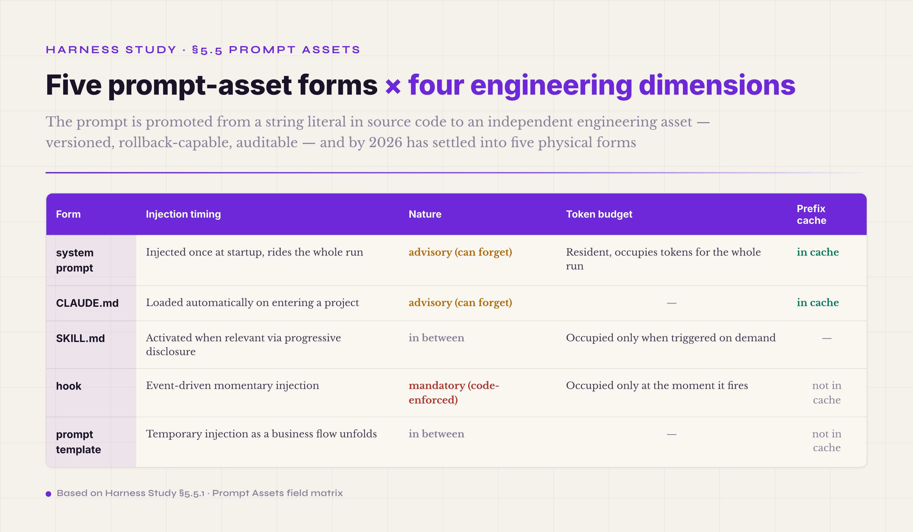
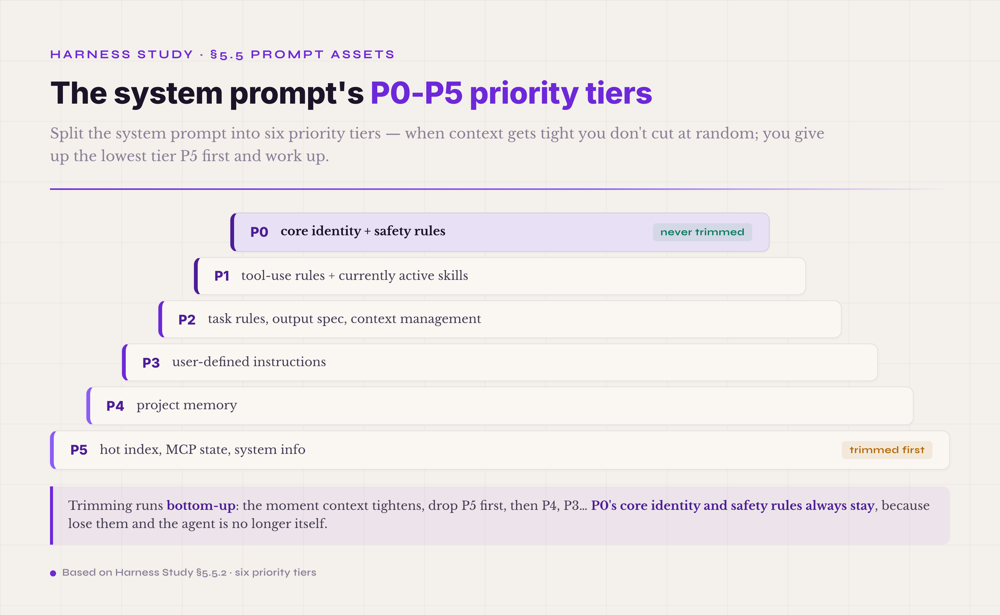

# 5.5 Prompt Assets · Instruction Layer · **P0**

The fifth mechanism is the instructional content the agent receives — everything the model reads in the prompt that is not a user message: the role definition, the task constraints, the tool manual, the output specification, the business rules, the error-handling hints, the context of the project the agent is working in, the list of Skills it can call, the hooks about to fire. The Tool Registry discussion already noted one rule: the tool description is the single highest-ROI optimization. Widen that rule one notch and you reach this section's root claim: **all** the instructional content the harness gives the agent — system prompt, tool descriptions, hook injections, Skill loading, the explanations inside error returns, the workspace README — needs to be managed as an engineering asset, with version numbers, rollback, A/B testing, and precise audit. That is where the mechanism's name comes from: instructional content gets promoted from string literals in source code to independent engineering objects, and the promotion itself is the starting point of prompt governance.

Why did 2026 pull the prompt out as its own class of engineering asset? Two layers of pressure, stacked. The first is leverage. With the same model and the same tools, changing one sentence of the system prompt can swing the task pass rate by ten percentage points or more. When an object with that much leverage lives as string literals scattered through source code, product quality inherits the randomness of whichever engineer touched the string last — and in a team of ten or more, that randomness gets amplified through merge paths into regressions nobody can trace. The second is audit. A hardcoded prompt leaves no trace: when it changed, by whom, why, and how the agent behaved before and after — none of it has an answer while the prompt lives as a literal. Pull the prompt into an independent asset carrier and all four questions immediately get engineering mechanisms to answer them: every change enters version control, every deployment goes through A/B testing, every regression rolls back to the previous version in seconds. Together the two pressures push the prompt out of the source code into an independent engineering object. The core of the promotion is that the object of governance changed: the prompt stops being something written in passing alongside code and becomes an asset with a lifecycle of its own.

By 2026 the prompt asset has settled into five relatively stable physical forms. **The first is the system prompt** — the classic one, injected at the top of the model's context when the agent starts, carrying the four-piece set of role definition, task constraints, tool manual, and output specification. **The second is the project-level context file, CLAUDE.md / AGENTS.md** — introduced by Anthropic in 2024 and a de facto industry standard by 2026. The agent reads a "project manual" every time it enters a new project. It is advisory, not mandatory — the agent may forget it. **The third is the SKILL.md skill-package format** — first version from Anthropic in 2025-10, upgraded to an open standard on 2025-12-18, and adopted by 32 tools as of 2026-03 (Claude Code, OpenAI Codex, Cursor, VS Code, Gemini CLI, Kiro, Goose, and others). It loads by progressive disclosure in three layers: the name and description load at startup, about 100 tokens per skill; the full SKILL.md body loads only on activation, with ≤5K tokens recommended; supporting files load only when explicitly referenced. **The fourth is hook injection** — deterministic callbacks that do not depend on the model's memory. A dozen-plus lifecycle events (PreToolUse, PostToolUse, SessionStart, and more) let code force rules into the conversation stream at the precise moment. This is the opposite of CLAUDE.md's advisory nature: mandatory, enforced. **The fifth is the prompt template** — business rules, error messages, user-facing prompts, and other generic fragments, grouped by purpose into prompt families and managed as SDK or configuration assets, with variable substitution, versioning, and A/B testing (platforms like Maxim AI, LangSmith, PromptLayer, Promptfoo, and Langfuse made this routine by 2026).

Behind the five forms runs one shared design philosophy: **written for agents, not for people.** §5.3's ACI discussion made this point once already — tool descriptions and tool names are designed for the agent's perception, not a person's. The same principle covers all five prompt-asset forms. "An engineer can read it and understand it" is not the bar. A prompt can read perfectly clearly to an engineer while the agent misreads it, ignores it, or never learns when it applies — and that prompt has failed. The real test is a measured trajectory: does the agent's behavior change as intended with and without this prompt? This is the same principle as §5.3.9's "descriptions are written for agents," applied across the asset types, and it is not re-argued here.

Prompt assets do not sit parallel to the other harness mechanisms; they permeate them. A tool description is in essence a prompt asset embedded in the Tool Registry. A Skill is a composite coupling Tool Registry, Memory, and prompt assets. A hook is an engineering carrier shared between prompt assets and the Safety control plane. The Adapter decides how a prompt asset is encoded at the wire layer (OpenAI's format and Anthropic's differ in the details). The reason this still stands as its own P0 mechanism is that the assetization of instructional content has independent engineering value — leave it unpulled, and the content scatters across the mechanisms with nobody governing it as one thing. The sub-sections below run in eight steps: the five forms compared → design principles → versioning and A/B testing → multi-language and multi-scenario → anti-prompt-injection → common pitfalls → industry implementations → getting started.

#### 5.5.0 Terms first used in this section

Terms already explained in §I–§IV and §5.1–§5.4 (schema, the system prompt concept, tool description, the hook concept, the Skill concept, function calling, trajectory, ACI, and so on) are not repeated. Listed here are only the terms that appear for the first time in §5.5.

**Prompt-asset engineering terms** — **prompt asset** (managing prompts as assets · versioned, owned, A/B tested, rollback-capable, retrievable · the root difference from a hardcoded prompt is pulling instructional content out of the code as an independent engineering object · the de facto industry standard of 2026). **prompt family** (a set of prompts grouped by purpose · a "pre-tool-call reminder" family, an "error recovery" family, a "result aggregation" family · each family holds several variants for A/B testing). **hard-code prompt** (a prompt string written into the code · the counterexample of a prompt asset · every change requires a release · no A/B testing, no rollback, no retrieval · the default practice of early agent engineering).

**Physical-form terms** — **CLAUDE.md / AGENTS.md** (project-level context file · introduced by Anthropic in 2024, industry de facto standard by 2026 · the agent reads a project manual on entering a project · covers the tech stack, entry points, naming, commands, common traps, style preferences · advisory in nature, the agent may forget it · the opposite of the hook's mandatory nature). **SKILL.md frontmatter** (the YAML metadata head · required: name, at most 64 chars, and description, at most 1024 chars · optional: license, compatibility, metadata, allowed-tools · the top layer of progressive disclosure's three-layer loading). **Agent Skills open standard** (the open spec Anthropic published on 2025-12-18 · adopted by 32 tools as of 2026, including Claude Code, OpenAI Codex, Cursor, VS Code, Gemini CLI, Kiro, Goose · defines the SKILL.md file structure, the metadata format, the instruction format, the supporting-file layout, and the progressive-disclosure loading mechanism). **progressive disclosure** (on-demand loading against context bloat · three layers: metadata loads at startup at about 100 tokens per skill; the full body loads on activation, ≤5K tokens recommended; supporting files load only when explicitly referenced · lets an agent carry 50 skills at a startup cost of about 5K tokens). **hook** (a deterministic callback that does not depend on the model's memory · rule injection enforced by code when a lifecycle event fires · Claude Code exposes a dozen-plus lifecycle events — PreToolUse, PostToolUse, UserPromptSubmit, SessionStart, Stop, SubagentStop, Notification, and more, growing by version · the opposite of CLAUDE.md's advisory nature: mandatory).

**Prompt-discipline terms** — **system prompt decay** (the rules at the top get ignored after a long conversation · the same root as lost-in-the-middle · ten or twenty rounds in, the model has mostly forgotten the opening rules · the core mechanical argument against piling business rules into the system prompt). **pre-call injection** (business rules go not into the system prompt but into a structured reminder injected at the moment the model is about to call a tool · exploits the model's far higher attention to the concrete thing it is doing now than to system-level abstract rules · §5.3.5 covered the PolicyRegistry implementation at the Tool Registry layer; this section covers it as prompt-asset discipline · two faces of the same thing). **prompt versioning** (every prompt change enters version control · supports A/B testing, canary release, gradual rollout, automatic rollback on quality degradation · the 2026 platforms Maxim AI, LangSmith, PromptLayer, Promptfoo, and Langfuse all do this). **prompt injection** (malicious input injecting instructions · a hostile prompt enters the agent's context through tool output, user messages, or RAG retrieval, and makes the agent do what it should not · one of the core topics of the §5.9 Safety control plane; this section covers the defenses at the prompt layer). **few-shot examples** (examples embedded in the prompt to show the model the expected output shape · more effective than prose description · a standard engineering device for stabilizing agent behavior in prompt-asset design).

#### 5.5.1 The five physical forms compared

The chapter head named the five forms: system prompt, CLAUDE.md, SKILL.md, hook, prompt template. This section lays out their engineering differences, so you can pick the right form for the job.

Four dimensions separate them. **First, injection timing.** The system prompt is injected once at startup and rides the whole run. CLAUDE.md and SKILL.md are also resident but closer to activate-on-demand (CLAUDE.md loads automatically on entering a project; SKILL.md activates its full content only when relevant, through progressive disclosure). A hook is an event-driven momentary injection (PreToolUse fires and the rule lands in the conversation stream). A prompt template is a temporary injection as a business flow unfolds (error-recovery templates, user-prompt templates). **Second, nature.** The system prompt and CLAUDE.md are advisory — the model can forget them, and after enough context they decay into being ignored. A hook is mandatory — enforced by code, independent of the model's memory. SKILL.md and prompt templates sit in between. **Third, token budget.** Resident system prompts occupy tokens for the whole run; on-demand Skills and momentary hook injections cost tokens only when triggered. **Fourth, prefix cache.** The system prompt and CLAUDE.md in the stable prefix earn cache hits; dynamically injected hooks and templates sit at unstable positions and generally fall outside the cache.

*Figure 5.14 · The five physical forms of Prompt Assets across four dimensions*

What actually ships to production is not one hardcoded string constant but a set of fragments assembled by priority. The prompt set the author of this tutorial wrote for his own agents splits the system prompt into six priority tiers, P0 through P5, across twelve classes of fragments. P0 is core identity plus safety rules, never trimmed. P1 is tool-use rules plus the currently active Skills. P2 is task rules, output specification, context management. P3 is user-defined instructions. P4 is project memory. P5 is the hot index, MCP state, and system information — the first to be cut. This structure lets the prompt give up low-value fragments by priority when context tightens, instead of truncating blindly from the tail, so the core identity and the safety rules never get lost to context pressure.

*Figure 5.15 · The six priority tiers P0–P5 of the system prompt and the trimming order*

Equating prompt assets with "the system prompt file" is too narrow. A single discipline actually governs three forms at once: resident system-prompt fragments, Skills activated by relevance, and hook injections triggered by events. The Skills spec Anthropic published in 2025-10 requires SKILL.md to carry a frontmatter head (name and description as required fields), with the body written as Overview and Usage. A hook's physical form is an event block in a configuration file — Claude Code's hook system covers a dozen-plus lifecycle events (PreToolUse, PostToolUse, UserPromptSubmit, Stop, SubagentStop, SessionStart, SessionEnd, PreCompact, and more, growing by version), each carrying a set of matchers plus an action. All three forms externalize instructions into files; the only difference is when they inject.

#### 5.5.2 Design principle · written for agents, not for people

The first principle of prompt assets: they are written for the agent, not for a person. The same sentence — "work carefully and think things through" — is a pep talk to a person and pure wasted tokens to an agent. Every round, the prompt enters the context window and competes for space with tool descriptions, conversation history, and tool results. The industry's common thresholds: below 15% of the window, leave it alone; 50% is the warning line; 70% means compress; 90% means near collapse. Every sentence without information squeezes the attention available to the rules that matter. So a prompt asset must be executable, verifiable, and splittable into concrete fragments. Instructions that describe attitude without behavior — "stay curious," "don't be anxious" — are negative assets in an agent prompt.

The second principle: do not trust the model's memory, but trust its reasoning. Write "check four conditions before canceling an order" at the top of the system prompt, and fifty tool calls later the model has probably forgotten it — not out of laziness, but because attention to a fixed-position instruction decays naturally over a long context. The right move is to make the rule a hook: at the moment the model is detected about to call the cancel_reservation tool, inject a temporary reminder listing the four conditions. It is the compliance dialog that pops up when the teller presses the "transfer" button, not a lecture delivered once at onboarding. Pushed to its end, the discipline fits in one line: the system prompt is the starting line, not the finish line — the more critical the business rule, the more it belongs in pre-call injection rather than written twice more at the top of the prompt. This is the same thing as §5.3.5's PolicyRegistry pre-call injection, seen from the other side: that passage spoke from the Tool Registry's perspective, this one from the prompt asset's.

Together the two principles mark the layer difference between prompt-asset engineering and ordinary prompt-template teaching. Template teaching looks at how to phrase one piece of text so the model is guided more accurately — it assumes the prompt is one static text and cares about clarity, examples, and word choice. Prompt-asset engineering shifts the question one notch: it assumes the prompt is a set of instruction fragments distributed across different carriers, and asks which rule belongs on which carrier so that it survives context decay, is not overridden, and is not forgotten. The two optimize at different layers — one the efficiency of semantic transfer, the other the stability and governability of instructions inside a system.

#### 5.5.3 Versioning and A/B testing

Once the prompt is managed as an asset, versioning and A/B testing naturally become P0 engineering capabilities. By 2026 a class of platforms has specialized in exactly this — Maxim AI, LangSmith, PromptLayer, Promptfoo, Langfuse — with a shared capability core: environment-tiered deployment, canary release, gradual rollout, automatic rollback on quality degradation. A prompt change can ride CI like a code change, go out on a canary, and roll back in seconds when something breaks. But the platforms are only infrastructure; the real discipline is stricter than "adopt a versioning platform."

Prompt versioning's discipline is stricter than "use git branches." The first rule: reports store the hash, not the text. Any externally visible run report records three fields — system_prompt_hash, system_prompt_chars, prompt_family — and the text itself stays in a private directory or an encrypted artifact store. This keeps prompt IP out of public reports, and spares git diff from meaningless comparisons over prompts thousands of characters long. The second rule: a prompt-family switch happens at a run or profile boundary, never quietly between turns inside one run. Change the stable prefix mid-run and the prefix-cache hit rate breaks immediately — and the comparison data is contaminated at the same time: it looks like prompt tuning, but it is infrastructure drift. With these two rules in place, prompts enter the same experimental-control regime as model checkpoints.

A/B testing prompts carries one methodological discipline that is easy to miss: the comparison must run at the trajectory level, not only the output level. After a prompt change, the agent's outputs may look about the same while the order of tool calls, the parameter choices, and the error-recovery paths all differ — and over a long horizon those trajectory-level differences compound. So a prompt A/B test looks not only at the task pass rate but at the shape of the trajectory: tool-call counts, failure rates, total tokens, cache hits, and the distribution of decision points, compared across all of them.

#### 5.5.4 Multi-language and multi-scenario prompt abstraction

Production brings two engineering problems: supporting several languages and switching between scenarios. Their disciplines overlap but are not identical.

Multi-language prompt engineering has two mainstream paths. **The first is one independent prompt per language**: a Chinese system prompt, an English one, a Japanese one, each maintained and versioned on its own. The advantage is that each prompt can be polished to its language's habits (Chinese punctuation and sentence shapes in the Chinese prompt, English idioms in the English one). The cost is that keeping the core rules consistent across languages gets hard — changing one core rule means changing N prompts and aligning the semantics each time, a burden that grows linearly with the language count. **The second is an anchor plus per-language tails**: the core rules that do not vary by language (identity, safety, tool discipline) live once in an anchor, and each language maintains only a small tail (language habits, forms of address, time zones, currency symbols). The advantage is that the core rules are maintained in one place; the cost is that the seam between anchor and tail can read unnaturally, and a prompt engineer has to polish the transitions. Production harnesses mostly take the second path — anchor plus tails — because rule consistency matters more than natural phrasing.

Multi-scenario abstraction uses the prompt-family paradigm. Prompts are grouped by business scenario: "office RFP response" is one family, "coding refactor" another, "research deep-dive" another. Each family holds several variants (v1, v2, experimental) for A/B testing. Families share the anchor (agent identity, safety rules) and maintain their own scenario-specific tails (task constraints, output specification, tool subset). The family switch happens at the run's entry — the task type routes to a family — and never in the middle of a run. That boundary rule is the same one stated in §5.5.3: family switches happen at run or profile boundaries.

#### 5.5.5 Anti-prompt-injection discipline at the prompt layer

Prompt injection is one of the core topics of the §5.9 Safety control plane: an attacker pushes malicious instructions into the agent's context through tool output, user messages, or RAG retrieval, and the agent does what it should never have done. The full defense spans the Adapter, the Tool Registry, Memory, and Artifact, and §5.9 lays it out. This section covers only what the prompt-asset layer itself can do — two disciplines: cleaning at the exit, and structure in the history.

Anti-injection is not only about filtering user input. Just as important is cleaning the prompt at the exit. When the other end of the conversation is also an LLM — the user simulator in an evaluation, a downstream agent in a pipeline, a reviewer doing summaries — the thinking blocks and tool_call tags in the agent's output must be stripped. τ-bench field notes record the user simulator's replies turning strange; the cause was the adapter passing the agent's raw text through without stripping the reasoning prefix. The simulator read the chain-of-thought as reply content, and the conversation went straight off the rails. The fix is a cleaning function between the agent's output and the next LLM, stripping reasoning prefixes and leftover `<tool_call>` tags. This is the message-visibility boundary — in essence, versioning of the prompt on the exit side.

Extend the same exit-side discipline to the conversation history and it reads: tool_call and tool_result must stay structurally paired, and the history must never contain "I read the file, and it says..." as prose. Once a tool call gets downgraded to text during compression or cleaning, the model starts faking tool results in later rounds — the pattern it learns from the history is that tool operations can be described in words, so next round it skips the tool and invents "I just ran X, and the result was Y." The compression prompt therefore carries one absolute rule: tool_call and tool_result are either kept whole or deleted as a pair, never replaced with prose. That is the versioning discipline for the conversation history as an implicit prompt.

The two disciplines together define the prompt asset's boundary handling: strip the reasoning at the exit for whatever sits downstream, and keep tool calls structured in the history. Break either one, and multi-turn conversations or multi-agent cooperation start producing fake execution, hallucinated evidence, and contaminated results — hidden bugs that are very hard to trace.

#### 5.5.6 Common pitfall · piling every business rule into the system prompt

The most common pitfall of this mechanism is piling all the business rules into the system prompt. The prompt grows longer, the key rules sink deeper, and the model forgets faster. A widely circulated τ-bench lesson: the model failed the book_reservation tool four times in a row over field names — it used baggages instead of total_baggages, and travel_insurance instead of insurance. The fix was not another "please mind the field names" paragraph in the system prompt; it was writing the field names, their types, and their enum values directly into the tool description. The same sentence — "use total_baggages" — is forgotten fifty rounds in when it lives in the system prompt, and seen before every call when it lives in the tool description. Behind this sits the more general engineering law: an instruction hangs on the carrier closest to where it takes effect — tool rules in the tool description, business policy in hook injection, long-term identity in the system prompt.

How does the pileup happen? Usually through development-stage defensive writing: every time the engineer hits a bug, another "if you encounter X, please..." paragraph goes into the system prompt. Half a year later the prompt has grown from a few hundred characters to several thousand. Each rule looks reasonable alone; together they dilute. Fifty rounds into a conversation the model has forgotten half the rules at the top, and adding more only makes the prompt longer and the decay faster — a vicious cycle.

To make the law operational, three dimensions of judgment work better than any absolute character count. The most practical is proportional use: keep the system prompt within a small share of the total context window — single-digit percent is the safe order of magnitude. A proportional standard adapts automatically to window size: the bigger the window, the more resident instruction it can carry, with no threshold to re-derive when the model's context upgrades. The second is positional attention: the model attends far more to the head and tail of a prompt than the middle (lost-in-the-middle), so the same rule at the head of the system prompt and the same rule buried mid-prompt are obeyed at visibly different rates. The third is instruction accumulation: quantitative studies consistently record attention diluting as prompts lengthen — past a few thousand tokens accuracy starts to slip, overlong prompts trend toward more generic answers ("Same Task, More Tokens" and similar studies observed reasoning decline at inputs of a few thousand tokens), and piled-up rules eventually show instruction dilution. Crossing the line on any one dimension means further additions to the system prompt have entered negative-ROI territory — and the right move is not rewording the existing rules or splicing a longer prompt, but migrating the new rules to a carrier with precise pre-call injection: hooks, or the tool description. All three dimensions couple to model capability and window size; there is no fixed character threshold that holds across models. For your own harness, compute "system prompt tokens / current model's context window" and review the ratio periodically.

One more pitfall pairs with prompt-asset discipline: **schema coupling — rules, test fixtures, and the verifier bound as a hard-wired triple.** At the mechanism level, the output schema, the data field names, and the tool-call schema in the prompt are hard-wired to the downstream fixtures and the verifier's classifier. Change any one of the three and the other two break — and they break silently: pass rates flip, the verifier passes outputs that are actually wrong, the classifier mistakes code for docs. The companion project of this tutorial logged a concrete case on 2026-05-10: a scenario file (v4-holdout-20.json) and the classifier changed together, a 60% pass rate flipped to 75-87%, and a week of ablation data had to be rerun. The mechanism-level cause: the prompt-schema change had no matching regression suite — the schema is an implicit contract spanning several components, and the verifier cannot see it. The paper that treats this systematically is AHE[^ahe-2026], in its schema-stability section: schema stability is a hard constraint on the long-term evolution of an agent harness, and a schema change must change fixture, classifier, and verifier together — never one alone. This pitfall shares its root with the "tuning hundreds of prompt variants" pitfall: treating the prompt as a universal tuning knob, hoping a prompt patch absorbs every change, which pushes the schema's implicit contract up into the prompt layer — the prompt grows ever longer and the governance ever harder. The judgment line: on every prompt-schema change, first list the downstream components that depend on that schema (fixtures, verifiers, classifiers), run regression on every one, and watch pass-rate drift across releases. Significant drift means the schema coupling is severe, and it is time to make the schema an explicit contract — the kind the §5.4 Artifact Store carries.

#### 5.5.7 Industry implementations

The industry has converged on a public set of prompt-asset forms. CLAUDE.md holds project-level resident instructions: naming rules, build commands, and style preferences in one markdown file at the repository root, loaded automatically when the agent starts. SKILL.md holds capability fragments activated by relevance: a frontmatter head (name and description required), a body written as Overview and Usage, the whole file injected into context when the user's intent matches. The hooks block in settings.json holds event-triggered injections, defined in three parts — an event field (PreToolUse, PostToolUse, UserPromptSubmit, Stop, SessionStart, and the rest of the dozen-plus lifecycle events), a matcher, and an action. The three together form one asset system running from resident to on-demand to momentary.

Across products, the mainstream harnesses walk the same path in different physical forms. **Anthropic's Claude Code** runs the three-piece set of CLAUDE.md, SKILL.md, and settings.json hooks — the first two as markdown files, the hooks as configuration. **OpenAI's Codex CLI** adopted the Agent Skills open standard in 2026 and supports the same SKILL.md format. **Cursor** manages project-level instructions through .cursorrules and the Cursor Rules format. **LangChain's** prompt templates ride the LangSmith platform for prompt versioning. **Letta's** system memory blocks are managed by the agent itself — the agent can call a tool to modify the content of its own system prompt. Five paths, different physical media, one engineering philosophy: the prompt upgraded from hardcoded string to asset, with versioning, A/B testing, and relevance-based activation.

Two industry counterexamples are worth marking as warnings. At one end is prompt-only: tool usage described only in the prompt, five or more tools overlapping each other, no trajectory evaluation — after launch, the only feedback channel is users reporting bugs. At the other end is over-framework: adopting the full LangGraph stack without understanding the ReAct loop, where the framework's abstraction layers block the view of the real problem. Vercel's public case from 2026 shows what the middle looks like: they replaced a text-to-SQL agent's 16 specialized tools with a single bash plus filesystem capability, and the success rate went from 80% to 100%, with 40% fewer tokens and 3.5x faster responses. The tool count is itself implicit prompt length, and cutting tools is itself prompt weight loss. The two counterexamples together make the point: prompt-asset engineering is not about doing more, but about hanging each instruction in exactly the right place.

#### 5.5.8 Getting started · four dimensions

**What to watch:** the biggest trap is writing prompts as constants in the code during development and realizing only after launch that the prompt is the agent's largest behavioral lever. From day 1, pull prompts out into markdown or YAML files, put them under version control, and never write them inline in source. Avoid both ends of the spectrum — prompt-only (no tools, no evals, no observability, just beautifully written prompts) and over-framework (a heavy framework adopted without understanding the underlying ReAct loop) both leave the agent short of expectations. And if any of §5.5.6's three judgment dimensions is over the line and rules are still being added to the system prompt, the path is already wrong — further additions are negative-ROI, and the move is to migrate rules to hooks or tool descriptions.

**How to design:** each of the five physical forms has its place. Long-term identity and safety rules go in the system prompt (the P0 fragments that are never trimmed). Project-level advisory information goes in CLAUDE.md (loaded automatically). Relevance-activated capabilities go in SKILL.md (progressive disclosure, three layers, ≤5K tokens). Event-triggered mandatory rules go in hooks (PreToolUse pre-call injection). Business-flow templates go in prompt templates (with variable substitution and A/B testing). For languages, use the anchor-plus-per-language-tail pattern (core rules kept consistent, language habits specialized). For scenarios, use prompt families (one family per scenario, several variants for A/B). Switch at run or profile boundaries, never mid-run.

**How to test:** A/B test prompts not only on task pass rate but on trajectory shape — tool-call counts, failure rates, total tokens, cache hits, decision-point distribution — compared across all dimensions. MRR (mean reciprocal rank) and task completion rate are two different layers of evaluation: MRR measures retrieval accuracy, task completion measures whether the end-to-end task finishes, and a prompt change has to be verified on both. Reference baselines and ablation are the deeper methodology: run the same tasks against the same set of baseline prompts, watch whether each variant improves, regresses, or holds against the baseline, and keep runs comparable with the same random seed and the same task set.

**What to put in the prompt:** this whole section is itself a meta-prompt design guide, but for the agent's own system prompt, three things are worth writing. First, **tell the agent explicitly what prompt-asset system it is running in** — "you have 5 activatable Skills, 3 kinds of hooks that fire before and after tool calls, and the tool description is the authoritative manual for the current call." Give the agent the capability map of its harness. Second, **tell the agent explicitly not to trust its own memory** — "forgetting the opening rules in a long conversation is normal; the important rules will be re-injected by hooks before the call." Spare the agent any anxiety about forgetting. Third, **tell the agent explicitly how to live with its history** — "the tool_call and tool_result pairs in the history are real; never fabricate tool results; when you need a fresh result, call the tool." Keep the agent honest with its own conversation history. These three lines pair with the engineering disciplines of §5.5.1–§5.5.7: the disciplines keep the prompt-asset system itself reliable, and the prompt teaches the agent to use the system.

Readers tend to file this mechanism at first glance under "prompt-writing tips." Its real position shows only when an agent system moves from the demo stage into B2B production: it is the engineering threshold that promotes the prompt from a literal in the source code to an object that can be governed. Version control, A/B testing, canary releases, automatic rollback — that whole industrial operations pipeline can only attach to a prompt that has an independent engineering identity. Prompts scattered through source code as literals have no such identity, and no interface for any operations process to attach to. That is the root reason Prompt Assets ranks P0 among the eight runtime mechanisms: whether an agent system can enter industrial operations at all is decided by whether this mechanism is in place.

#### Industry placement card · the implementation layers behind §5.5

In 2026, the abstract Prompt Asset function is covered in the industry mainly by these technologies —

| Industry name | What it is in §5.5 |
|---|---|
| **system prompt** (vendor built-in) | Injected at LLM startup · hardcoded per model family · never trimmed |
| **CLAUDE.md / .cursorrules / AGENTS.md** | Project-level prompt asset · loaded automatically at startup |
| **Anthropic Agent Skills open standard (SKILL.md frontmatter)** | The three-layer loading pattern for prompt assets — metadata up front + body loaded on activation + supporting files on explicit reference · progressive disclosure ≤5K tokens |
| **hook (Claude Code / OpenCode / settings.json)** | Pre-call and post-call injection · the dynamic form of the prompt asset · often also carries §5.9 Safety checks |
| **few-shot examples** | Inline prompt asset · written into the user message |
| **LangChain prompt templates / LangSmith** | Prompt versioning platform · supports A/B testing |
| **Cursor Rules format** | Project-level prompt asset · embedded in the IDE |

All of these solve "how instruction assets are organized, and when they inject" — the **physical-form layer** of the §5.5 Prompt Assets mechanism. **Skill is a way of organizing prompt assets, not a mechanism** — Anthropic shipped Skills in 2025-10 and upgraded them to the Agent Skills open standard on 2025-12-18, standardizing the pattern, but it remains one physical form of the Prompt Asset mechanism. The full reverse lookup table is in appendix §D of §99.

---

## Footnotes

[^ahe-2026]: Agentic Harness Engineering: Observability-Driven Automatic Evolution of Coding-Agent Harnesses · arxiv 2604.25850 · Lin / Liu / Pan et al. (Fudan + PKU + Qiji Zhifeng, 11 authors) · 2026 · preprint
