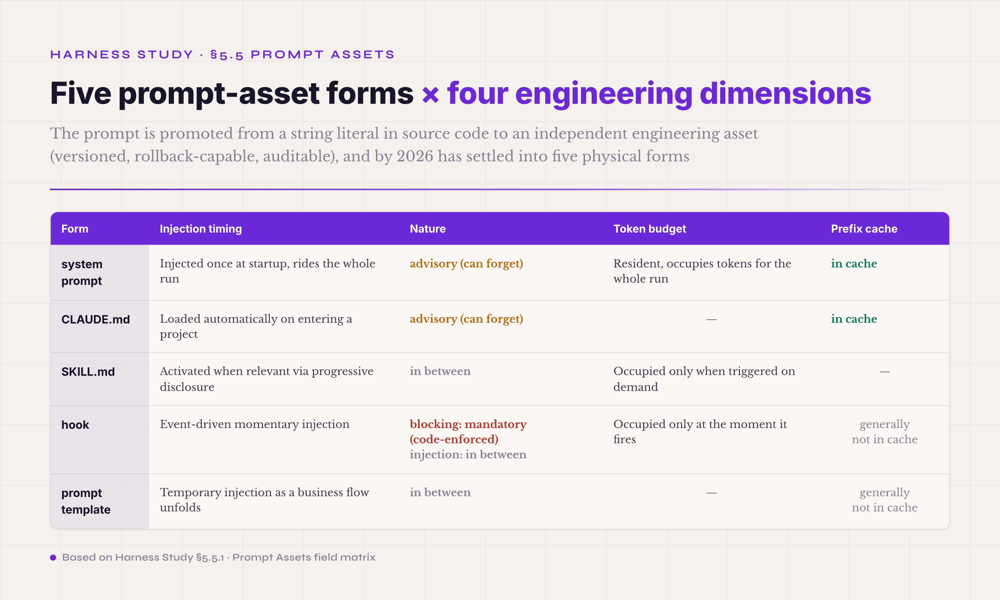
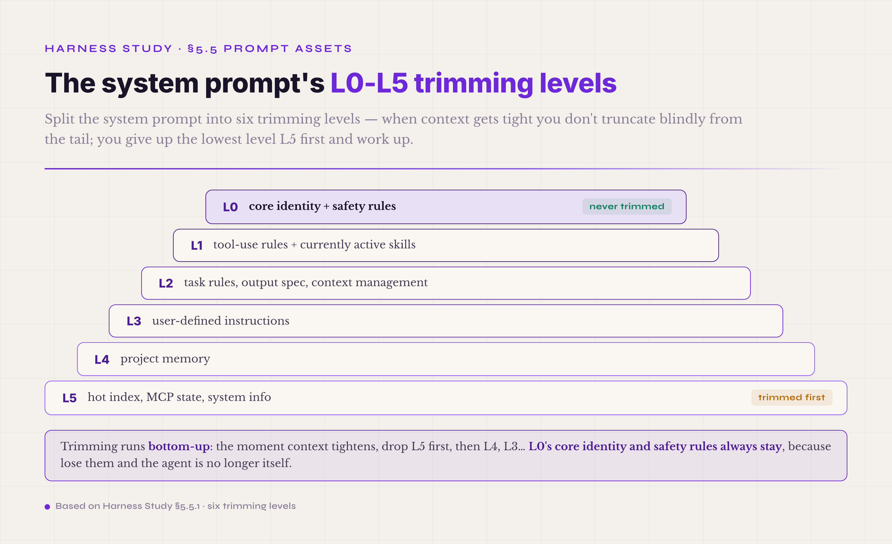

# 5.5 Prompt Assets · Instruction Layer · **P0**

The fifth mechanism governs the instructional content the agent receives: everything the model reads in the prompt that is not a user message. That covers the role definition, the task constraints, the tool manual, the output specification, the business rules, the error-handling hints, background on the project the agent is working in, the list of Skills it can call, the hooks about to fire, and so on. §5.3's discussion of the Tool Registry noted one rule: the tool description is the single highest-ROI optimization. Push that rule one step further and you reach this section's root claim. All the instructional content the harness gives the agent needs to be managed as an engineering asset. That includes the system prompt, tool descriptions, hook injections, Skill loading, the explanations inside error returns, the workspace README, and so on. Each piece gets a version number and can be rolled back, A/B tested, and precisely audited. That is where the name Prompt Assets comes from: instructional content gets promoted from string literals in source code to independent engineering objects. This step is itself where prompt governance starts.

Two layers of engineering pressure, stacked on each other, are why the prompt gets pulled out and managed as its own class of engineering asset.

- **Leverage.** With the same model and the same tools, changing one sentence of the system prompt can swing the task pass rate by margins on the order of ten percentage points (the author's empirical observation). When an object with that much effect exists only as string literals scattered through source code, product quality inherits the randomness of whichever engineer touched the string last. In a team of ten or more, the many merge paths amplify that randomness into regressions that are hard to trace.
- **Audit.** A prompt hardcoded in the source leaves no trace when it changes. When was it changed, by whom, why, and how did the agent behave before and after? While the prompt lives as a source-code literal, none of these questions has an answer.

Once the prompt moves into an independent asset carrier, each of those four questions has an engineering mechanism behind it: every change enters version control, every deployment goes through A/B testing, and a regression can roll back to the previous version within seconds. Together, the two pressures push the prompt out of the strings embedded in source code. What really changes is the object of engineering governance. The prompt stops being a helper written in passing alongside the code and becomes an asset that needs lifecycle management of its own.

By 2026, prompt assets have settled into five relatively stable physical forms:

1. **The system prompt**: the classic form. It sits at the very front of the model's context when the agent starts, and has four parts: role definition, task constraints, tool manual, and output specification.
2. **Project-level instruction files such as CLAUDE.md and AGENTS.md**: a "project manual" the agent reads every time it enters a new project. CLAUDE.md is Claude Code's convention for project instructions, and appeared with the Claude Code research preview in 2025-02. AGENTS.md was released by OpenAI in 2025-08 and pushed forward jointly by Codex, Amp, Jules, Cursor, Factory, and others; since 2025-12 it has been hosted by the Agentic AI Foundation under the Linux Foundation. Their content is advisory, not mandatory: the agent may forget it.
3. **The SKILL.md skill-package format**: first introduced by Anthropic in 2025-10 and published as an open standard on 2025-12-18. Many tools already support it, including Claude Code, OpenAI Codex, Cursor, VS Code, Gemini CLI, Kiro, and Goose. It loads by progressive disclosure, in three layers. The name and description load at startup, about 100 tokens per skill. The full SKILL.md body loads only on activation, and is recommended to stay within 5K tokens. Supporting files load on demand, only when explicitly referenced.
4. **Hook injection**: callbacks that code fires at well-defined moments, independent of the model's memory. In Claude Code, hooks can attach to a dozen-plus lifecycle events such as PreToolUse, PostToolUse, and SessionStart. Hooks come in two kinds by what they do. A **blocking** hook lets code intercept or allow an action directly (in Claude Code, for example, when a hook exits with exit code 2, that tool call is blocked); this is real enforcement. An **injection** hook only guarantees that a rule enters the conversation stream at the right moment, and whether the model follows it is still probabilistic. Both are more reliable than CLAUDE.md, but only the blocking kind counts as mandatory.
5. **Prompt templates**: business rules, error messages, user-facing prompts, and other general-purpose prompt fragments, grouped by purpose and managed as SDK- or configuration-layer assets, with template variable substitution, versioning, and A/B testing. Platforms such as Maxim AI, LangSmith, PromptLayer, Promptfoo, and Langfuse all provide this.

All five forms rest on one shared design philosophy: **written for agents, not for people.** §5.3 made this point once already, in its discussion of ACI (agent-computer interface) design: tool descriptions and tool names should be written for how the agent perceives them, not how a person does. The same principle covers all five kinds of prompt asset. When you design a prompt asset, "an engineer can read it and understand it" is not the bar. A prompt can read perfectly clearly to an engineer while the agent misreads it, ignores it, or never knows when it applies, and then that prompt has failed. The test should be the trajectory the agent actually produces: does the agent's behavior change as intended with and without this prompt? This is the same principle as §5.3.9's "descriptions are written for agents, not for people," applied to a different type of prompt asset, so it is not re-argued here.

Prompt assets do not sit parallel to the other harness mechanisms; they permeate them:

- A tool description is in essence a kind of prompt asset embedded in the Tool Registry.
- In this book a Skill belongs to Prompt Assets: it is one way of organizing prompt assets (this section gives its primary definition; see the end of §5.5.7). It also touches the Tool Registry (it can embed tool definitions and be retrieved on demand) and Artifact (it is stored and versioned the same way as an Artifact; see §5.4).
- A hook is an engineering carrier shared by prompt assets and the Safety control plane.
- The Model Adapter decides how a prompt asset is encoded at the transport layer (the wire format); OpenAI's format and Anthropic's differ in the details.

Prompt assets still stand as a P0 mechanism of their own, because governing instructional content as an asset has independent engineering value. Left unextracted, that content scatters across the other mechanisms and nobody governs it as a whole. The subsections below proceed in eight steps: the five forms compared, design principles, versioning and A/B testing, multiple languages and scenarios, message boundaries and history integrity, anti-patterns, industry implementations, and getting started.

#### 5.5.0 Terms first used in this section

Terms already explained in §I–§IV and §5.1–§5.4 (schema, system prompt, tool description, hook, Skill, function calling, trajectory, ACI, and so on) are not repeated below. Listed here are only the terms that appear for the first time in this section.

**Prompt-asset engineering terms**

- **prompt asset**: a prompt managed as an asset, with a version and an owner, and open to A/B testing, rollback, and retrieval. The root difference from a hardcoded prompt is that the instructional content comes out of the code and becomes an independent engineering object.
- **prompt family**: the full set of prompts for one kind of business scenario. "RFP response," "code refactoring," and "deep research" are each a family (§5.5.4 covers this in detail). Families share the core rules, and each maintains its own scenario-specific part; each family holds several variants for A/B testing. Fragments divided by function, such as a "pre-tool-call reminder," "error recovery," or "result aggregation," are components inside a family (mostly in the form of prompt templates), and this book does not call them families on their own.
- **hard-code prompt**: a prompt string written directly into the code, the opposite of a prompt asset. Every change requires a new release, and there is no A/B testing, rollback, or retrieval. It was the default practice of early agent engineering.

**Physical-form terms for prompt assets**

- **CLAUDE.md / AGENTS.md**: project-level instruction files, the "project manual" the agent reads every time it enters a project. They usually cover the tech stack, entry points, naming conventions, common commands, known pitfalls, and style preferences. CLAUDE.md is Claude Code's convention for project instructions (it appeared with the Claude Code research preview in 2025-02). AGENTS.md was released by OpenAI in 2025-08, pushed forward jointly by Codex, Amp, Jules, Cursor, Factory, and others, and has been hosted since 2025-12 by the Agentic AI Foundation under the Linux Foundation. Both are advisory, and the agent may forget them; in this they are the opposite of the mandatory blocking hook.
- **SKILL.md frontmatter**: the YAML metadata header at the top of a SKILL.md file. It requires name (at most 64 characters) and description (at most 1024 characters), optionally takes license, compatibility, metadata, and allowed-tools, and forms the top layer of progressive disclosure's three-layer loading.
- **Agent Skills open standard**: the open specification Anthropic published on 2025-12-18, now supported by many tools, including Claude Code, OpenAI Codex, Cursor, VS Code, Gemini CLI, Kiro, and Goose. It defines the SKILL.md file structure, the metadata format, the instruction format, the supporting-file directory, and the progressive-disclosure loading mechanism.
- **progressive disclosure**: on-demand loading that reduces context bloat. It has three layers: metadata loads at startup, about 100 tokens per skill; the full body loads on activation, recommended to stay within 5K tokens; supporting files load only when explicitly referenced. An agent with 50 skills installed therefore pays only about 5K tokens at startup.
- **hook**: a callback that code executes when a lifecycle event fires, independent of the model's memory. Claude Code exposes a dozen-plus lifecycle events (PreToolUse, PostToolUse, UserPromptSubmit, SessionStart, Stop, SubagentStop, Notification, and more, with the list growing from version to version). By what they do, hooks come in two kinds:
  - **Blocking**: code intercepts or allows the action directly (for example, a Claude Code hook that exits with exit code 2 blocks that tool call). This is mandatory enforcement.
  - **Injection**: guarantees that the rule enters the conversation stream at the right moment, but whether the model follows it is still probabilistic.

**Prompt engineering rule terms**

- **system prompt decay**: after a long conversation, the model follows the rules in the system prompt less reliably. A dozen or twenty-some turns into a run, the opening rules often stop being obeyed (the author's empirical observation). The mechanism is related to lost in the middle but is not the same thing. Lost in the middle says that when key information sits in the middle of a long context, the model's accuracy is lower than when it sits at the head or the tail (Liu et al. 2023). The system prompt sits at the head of the context, and that position is not a disadvantage in itself. System prompt decay is closer to context rot (model performance dropping as the context as a whole grows longer): the longer the conversation, the more history piles up in between, and the further the early rules drift from the current action. This is the core argument against piling all the business rules into the system prompt.
- **pre-call injection**: instead of writing a business rule into the system prompt, inject a structured reminder at the moment the model is about to call a given tool. This is the typical use of an injection hook. It relies on the model usually paying more attention to the concrete thing it is doing right now than to system-level abstract rules (empirical observation). §5.3.5 covered the PolicyRegistry implementation at the Tool Registry layer; this section covers it as an engineering rule for prompt assets. They are two sides of the same thing.
- **prompt versioning**: every prompt change enters version control, with support for A/B testing, canary release, gradual rollout, and automatic rollback when quality degrades. Platforms such as Maxim AI, LangSmith, PromptLayer, Promptfoo, and Langfuse all provide this.
- **prompt injection**: malicious content enters the agent's context through channels such as tool output, user messages, or RAG retrieval results, and makes the agent do something it should not. The real defense lives in the §5.9 Safety control plane; this section covers only the adjacent message-boundary rules at the prompt layer (§5.5.5).
- **few-shot examples**: demonstrations embedded in the prompt so the model learns the expected output shape from examples. They usually work better than a prose description, and are a common way to make agent behavior more stable.

#### 5.5.1 The five physical forms compared

The chapter head named the five forms: system prompt, CLAUDE.md, SKILL.md, hook, prompt template. This section lays out their engineering differences, so you can pick the right form for the job.

The five forms can be compared along four engineering dimensions:

- **Injection timing**: the system prompt is injected once when the agent starts and stays for the whole run. CLAUDE.md and SKILL.md are also resident, but closer to activate-on-demand (CLAUDE.md loads automatically on entering a project; SKILL.md, through progressive disclosure, activates its full content only when relevant). A hook is an event-driven, momentary injection (for example, when PreToolUse fires, the rule goes into the conversation stream). A prompt template is injected temporarily as a business flow unfolds (error-recovery templates, user-prompt templates, and so on).
- **Constraint strength**: the system prompt and CLAUDE.md are advisory; the model may forget them, and compliance drops over a long conversation. A blocking hook is mandatory: code intercepts the action, independent of the model's memory. Injection hooks, SKILL.md, and prompt templates sit in between: their injection is better targeted, but compliance is still probabilistic.
- **Token budget**: the resident system prompt occupies tokens for the whole run; on-demand Skills and momentary hook injections occupy them only when triggered.
- **Prompt-cache hits**: the system prompt and CLAUDE.md sit in the stable prefix, so they can enter the cache and earn hits. Dynamically injected hooks and templates sit at unstable positions and generally fall outside the cache.

*Figure 5.14 · The five physical forms of Prompt Assets across four dimensions*

What actually ships to production is not one hardcoded string constant but a set of fragments assembled by priority. The prompt set the author of this tutorial uses for his own agents splits the system prompt into six trimming levels and twelve classes of fragments. To avoid confusion with the book's P0, P1, and P2 implementation priorities, the levels are labeled L0 to L5 here:

- L0: core identity plus safety rules, never trimmed;
- L1: tool-use rules plus the currently active Skills;
- L2: task rules, output specification, context management;
- L3: user-defined instructions;
- L4: project memory;
- L5: the hot index, MCP state, and system information, the first to be cut.

When context gets tight, this structure lets the prompt give up the low-level fragments by value instead of truncating blindly from the tail, so the core identity and the safety rules are never lost to context pressure.

*Figure 5.15 · The system prompt's six trimming levels and the trimming order*

Equating prompt assets with "the system prompt file" narrows the idea too far. The same set of prompt engineering rules actually governs three forms at once: resident system-prompt fragments, Skills activated by relevance, and hook injections triggered by events. The Skills spec Anthropic published in 2025-10 requires SKILL.md to carry a frontmatter header (with name and description as required fields), with the body written as Overview and Usage. A hook's physical form is an event block in a configuration file. Claude Code's hook system covers a dozen-plus lifecycle events (PreToolUse, PostToolUse, UserPromptSubmit, Stop, SubagentStop, SessionStart, SessionEnd, PreCompact, and more, with the list growing from version to version), and each event carries a set of matchers and actions. All three forms externalize instructions into files. They differ mainly in when they inject, plus the extra layer of code enforcement that blocking hooks add.

#### 5.5.2 Design principle · written for agents, not for people

The first principle of prompt assets: they are written for the agent to read, not for a person. The same sentence, "work carefully and think things through," is a pep talk to a person and pure wasted tokens to an agent. On every call, the prompt enters the context window and competes for space with tool descriptions, conversation history, and tool results. A common empirical split by context-window occupancy runs like this: below 15%, leave it alone; at 50%, stay alert; at 70%, compress; at 90%, you are at the critical point (rules of thumb; adjust to your scenario; they correspond to the compression thresholds in §5.4). So every sentence in the prompt that carries no information squeezes the attention the core rules can get. A prompt asset must therefore be executable, verifiable, and splittable into concrete fragments. Instructions that describe an attitude without giving a behavior, such as "stay curious" or "don't be anxious," are negative assets in an agent prompt.

The second principle: do not trust the model's memory, but you can trust its reasoning. Write "check four conditions before canceling an order" at the top of the system prompt, and after fifty tool calls the model will quite likely stop obeying it. The model is not being lazy; compliance with early rules drops over a long conversation (see "system prompt decay" in §5.5.0). A better approach is to turn the rule into a hook: the moment it detects that the model is about to call the cancel_reservation tool, it injects a temporary reminder listing the four conditions. It is like the compliance confirmation dialog that pops up before a bank teller presses the "transfer" button, instead of a talk given once during onboarding. Note that this is an injection hook. It puts the rule in front of the model at the most relevant moment and raises the odds that it is followed, but it does not guarantee compliance. If code can decide the four conditions, add a blocking check as well, so the call is stopped outright when the conditions are not met. Pushed to its limit, the principle fits in one sentence: the system prompt is the starting line, not the finish line. The more critical a business rule is, the more it belongs in pre-call injection (plus a code-level block where code can decide it), rather than written twice more at the top of the prompt. This is the same thing as §5.3.5's PolicyRegistry pre-call injection, seen from the other side: that passage spoke from the Tool Registry's perspective, and this one speaks from the prompt asset's.

Together, the two principles separate prompt-asset engineering from ordinary prompt-template teaching: the two work at different layers. Template teaching asks how to word one piece of text so that it guides the model more accurately. It assumes the prompt is one static text and cares about the clarity of the text itself, how examples are given, and word choice. Prompt-asset engineering looks at the same problem from a different layer. It assumes the prompt is a set of instruction fragments distributed across different carriers, and asks which rule belongs on which carrier so that it is not diluted in a long context, overridden, or forgotten by the model. The two do not optimize the same layer: the first optimizes how efficiently meaning is conveyed, and the second optimizes the stability and governability of instructions within the system.

#### 5.5.3 Versioning and A/B testing

Once the prompt is managed as an asset, versioning and A/B testing naturally become P0 engineering capabilities. A group of platforms already specializes in exactly this, such as Maxim AI, LangSmith, PromptLayer, Promptfoo, and Langfuse. Their core capabilities all include deployment split by environment, canary release, gradual rollout, and automatic rollback when quality degrades. In other words, a prompt change can go through CI like a code change, roll out to a canary, and roll back within seconds when something breaks. But the platforms are only infrastructure. The engineering rules you actually have to keep are much stricter than "hook up a versioning platform."

Prompt versioning's rules are also stricter than "use several git branches":

- **Rule one: reports store the hash, not the text.** Any externally visible run report records only three fields: system_prompt_hash (the hash of the system prompt text, which is not the same as prompt_hash in §5.10, the fingerprint of each turn's full prompt), system_prompt_chars, and prompt_family. The text itself stays in a private directory or an encrypted artifact store. This keeps intellectual property such as prompts out of public reports, and avoids meaningless git diffs over prompts thousands of characters long.
- **Rule two: a prompt-family switch may happen only at the boundary of a run or a profile (a fixed set of configuration), never quietly between two turns of the same run.** Change the stable prefix and the prompt-cache hit rate drops at once, and the comparison data is contaminated at the same time: what looks like prompt tuning is actually infrastructure drift.

Only with these two rules in place can prompts enter the same experimental-control regime as model checkpoints.

A/B testing prompts carries one more methodological requirement that is easy to miss: the comparison has to be evaluated at the trajectory level, not only at the output level. After a prompt change, the agent's output may look about the same while the order of tool calls, the parameter choices, and the error-recovery paths all differ, and in long-horizon tasks these differences compound. So a prompt A/B test looks beyond the task pass rate and compares the shape of the trajectory along several dimensions: tool-call counts, failure rates, total tokens, cache hit rate, and the distribution of decision points.

Versioning is still missing one trigger that often gets overlooked: **changes on the model side**. The biggest source of drift in prompt behavior is often not that you edited the prompt but that the model was upgraded. The same prompt on a new model can drift in tone, format compliance, and tool-trigger rate. When a cloud endpoint upgrades silently, nobody may even tell you that the model changed. So a prompt asset's metadata needs a tested_models field that records which model versions the prompt has been regression-tested on. A model switch or endpoint upgrade then automatically triggers the golden-task regression for the corresponding prompt family. What versioning really has to pin down is the "prompt × model" pair, not only the prompt text: an unchanged prompt does not mean unchanged behavior.

#### 5.5.4 Multi-language and multi-scenario prompt abstraction

Once an agent is in production, it runs into two engineering problems: supporting several languages and switching between scenarios. The ways to handle them overlap in part and differ in part.

Multi-language prompts follow two mainstream paths:

- **One independent prompt per language.** Chinese, English, and Japanese each get their own system prompt, each versioned separately. The advantage is that each can be refined to its language's habits (Chinese punctuation and sentence patterns in the Chinese prompt, English idioms in the English one). The drawback is that the core rules are hard to keep consistent across languages: changing one core rule means changing it in all N prompts and aligning the meaning, and the workload grows linearly with the number of languages.
- **A shared anchor plus per-language tails.** The core rules that do not change across languages (identity, safety, tool-use rules) go into one anchor, and each language maintains only a tail (language habits, forms of address, time zone, currency symbol, and so on). This keeps the core rules in one place, the anchor, at a price: the seam where a tail joins the anchor can read unnaturally, so the transition sentences need extra polishing.

Production harnesses mostly take the second path, because consistent rules matter more than natural phrasing.

Multi-scenario prompt abstraction uses the prompt family (defined in §5.5.0). Prompts are grouped by business scenario: "RFP response in office work" is one family, "code refactoring" another, and "deep research" another. Each family holds several variants (v1, v2, experimental, and so on) for A/B testing. Families share the anchor (agent identity, safety rules), and each maintains its own scenario-specific tail (task constraints, output specification, tool subset). The family is chosen at the entry of a run: the user's task type routes to the matching family, and there is no switching mid-run. This is the same thing as §5.5.3's second rule, that family switches happen only at a run or profile boundary.

#### 5.5.5 Message boundaries and history integrity

Prompt injection is one of the core topics of the §5.9 Safety control plane. An attacker pushes malicious instructions into the agent's context through tool output, user messages, RAG retrieval results, and similar channels, and the agent then does what it should never have done. Real injection defense spans several layers, including the Adapter, the Tool Registry, Memory, and Artifact; see §5.9. This section covers two rules at the prompt-asset layer that sit next to that defense but differ in nature: the message boundary on the exit side, and tool-call integrity on the history side. What they mainly guard against is format contamination and the model being misled by its own history, not malicious injection.

Message boundaries are not only about input; cleaning at the exit matters just as much. When the other end of the conversation is also an LLM (the user simulator in an evaluation, a downstream agent in a pipeline, a reviewer writing summaries), the thinking blocks and tool_call tags in the agent's output must be stripped. In τ-bench experiments, the author saw the user simulator's replies turn strange. The adapter had passed the agent's raw text straight through without stripping the reasoning prefix, the simulator read the chain-of-thought as reply content, and the conversation went off course at once. The fix is a cleaning function between the agent's output and the next LLM that strips reasoning prefixes and leftover `<tool_call>` tags. This is the message-visibility boundary: in essence, boundary control for the prompt on the exit side.

Extend the same exit-side rule to the conversation history and it reads: tool_call and tool_result must stay structurally paired, and the history must never contain prose like "I read the file, and it says...". Once a tool call gets downgraded to text during compression or cleaning, the model starts faking tool results in later turns. The pattern it learns from the history is that tool operations can be described in words, so on the next turn it skips the tool and makes up "I just ran X, and the result was Y." The compression prompt therefore needs a hard prohibition: tool_call and tool_result are either kept whole or deleted as a pair, and never replaced with prose. The conversation history is also an implicit prompt, and this is its versioning rule.

Together, the two rules define how prompt assets handle boundaries: on the exit side, strip the reasoning before handing output downstream; on the history side, keep tool calls structured. Break either one, and multi-turn conversations or multi-agent collaboration start producing hidden bugs such as faked execution, hallucinated evidence, and contaminated results, which are very hard to trace.

#### 5.5.6 Anti-pattern · piling every business rule into the system prompt

The most common anti-pattern for this mechanism is piling all the business rules into the system prompt. The prompt grows longer, the key rules sink deeper, and the model forgets them faster. One lesson from τ-bench experiments: the model failed four calls in a row to the book_reservation tool because of wrong field names. It used baggages instead of total_baggages, and travel_insurance instead of insurance. The fix was not another paragraph in the system prompt saying "please mind the field names." It was writing the field names, types, and enum values directly into the tool description. The same sentence, "use total_baggages," may stop being obeyed a few dozen turns in when it lives in the system prompt, and is visible before every tool call when it lives in the tool description. Behind this is a more general engineering rule: an instruction belongs on the carrier closest to where it takes effect. Tool rules go in the tool description, business policy in hook injection, and long-term identity in the system prompt.

How does this anti-pattern form? Usually through defensive writing during development: every time an engineer hits a bug, another "if you encounter X, please... if you encounter Y, please..." paragraph goes into the system prompt. Half a year later, the system prompt has grown from a few hundred characters to several thousand. Each rule looks reasonable on its own; together they dilute one another. Fifty turns into a conversation, roughly half of the opening rules are no longer obeyed (the author's empirical observation). Adding more rules only makes the prompt longer and compliance drop faster, a vicious cycle.

In practice, three dimensions give a more accurate judgment than an absolute character count:

- **Share of the window.** As a rule of thumb, keeping the system prompt within a small share of the context window (on the order of single-digit percent, a rule of thumb) is fairly safe. A proportional standard adapts to window size automatically: the bigger the window, the larger the absolute amount of resident instruction it can hold, and there is no character threshold to reset when the model moves to a larger window.
- **Position.** This one needs to be stated precisely. Lost-in-the-middle research found that when key information sits in the middle of a long context, the model's accuracy is lower than when it sits at the beginning or the end (Liu et al. 2023). The system prompt is already at the beginning of the context, so its position is not a disadvantage. Inside a very long system prompt, though, rules near the front and rules buried in the middle may be obeyed at different rates (empirical observation, varies by model). Separately, the longer the conversation, the lower the compliance with the system prompt's rules. That is the "system prompt decay" of §5.5.0, which is related to lost in the middle but not the same thing.
- **Accumulated instruction count.** A body of research records that the longer the prompt, the more attention gets diluted: past a few thousand input tokens, accuracy starts to slip, and overlong prompts tend to produce more generic answers ("Same Task, More Tokens" and similar studies observed reasoning ability declining at inputs of a few thousand tokens). Once the number of rules accumulates past a certain point, "instruction dilution" sets in.

If any one of the three dimensions crosses the line, further additions to the system prompt have entered negative-return territory. The right move is not to reword existing rules or splice together a longer prompt, but to migrate new rules to a carrier that injects precisely before the call, such as a hook injection or the tool description. All three dimensions depend on model capability and context-window size, and no fixed character threshold holds across models. For your own harness, you can make the ratio "system prompt tokens / current model's context window" an item for periodic review.

One more anti-pattern goes with prompt assets: **Schema Coupling (AP16, see Appendix F)**, where the schema in the prompt, the test cases, and the verifier are tightly coupled.

- **Symptom**: three things are hard-wired together: the output schema, data field names, and tool-call schema in the prompt; the downstream test cases (fixtures); and the verifier's classifier. Change any one of the three and the other two break, and they break silently: the pass rate suddenly flips, the verifier passes outputs that are actually wrong, and the classifier mistakes code for documentation. This tutorial's companion implementation project ran into this in 2026-05. After a set of held-out test scenarios and the classifier changed at the same time, the pass rate jumped straight from 60% to 75%–87%, and the whole previous week of ablation data had to be rerun.
- **Cause**: the schema is an implicit contract, and a change to it crosses several components, but prompt-schema changes have no matching regression tests, and the verifier cannot catch the problem on its own. The AHE[^ahe-2026] paper discusses schema stability and treats it as a constraint that long-term harness evolution must hold: a schema change must change the test cases, the classifier, and the verifier together, never just one of them. This anti-pattern shares its root with the practice of "tuning hundreds of prompt versions," which treats the prompt as a universal adjustment knob. Counting on the prompt to absorb every problem actually pushes the schema's implicit contract up into the prompt layer, so the prompt grows longer with every change and governance gets harder and harder.
- **Countermeasure**: on every prompt-schema change, first list the downstream components that depend on that schema (test cases, verifier, classifier, and so on), run regression tests on each one, and watch pass-rate drift across versions. Significant drift means the coupling is severe, and the schema needs to become an explicit contract (similar to the approach of the §5.4 artifact store).

#### 5.5.7 Industry implementations

The industry already has a public set of prompt-asset forms. Take Claude Code as the example:

- **CLAUDE.md holds project-level resident instructions**: naming rules, build commands, and style preferences go in one Markdown file at the repository root, which the agent loads automatically at startup.
- **SKILL.md holds capability fragments activated by relevance**: the file opens with frontmatter (name and description are required fields), the body gives an overview and usage, and when the user's intent matches, the agent injects the whole SKILL.md into context.
- **The hooks block in settings.json holds event-triggered injection and interception**: it is defined in three parts, an event field (one of the dozen-plus lifecycle events such as PreToolUse, PostToolUse, UserPromptSubmit, Stop, and SessionStart), a matcher, and an action.

Together the three forms make up one prompt-asset system that runs from resident, to on-demand, to momentary.

Across products, the mainstream harnesses follow similar paths in different physical forms:

- **Anthropic's Claude Code**: CLAUDE.md, SKILL.md, and hooks in settings.json work together. The first two are Markdown files; hooks are configured in settings.json.
- **OpenAI's Codex CLI**: reads AGENTS.md as its project-level instructions, and has adopted the Agent Skills open standard, supporting the same SKILL.md format.
- **Cursor**: manages project-level instructions through .cursorrules and the Cursor Rules format.
- **LangChain**: prompt templates are versioned through the LangSmith platform.
- **Letta**: uses system memory blocks that the agent manages itself (the agent can call a tool to rewrite the content of its own system prompt).

The five paths use different physical media but share the same engineering approach: each upgrades the prompt from a hardcoded string to an asset, and each supports versioning, A/B testing, and relevance-based activation.

Two industry counterexamples are worth pointing out. At one end is relying on the prompt alone: tool usage is described only in the prompt, five or more tools overlap in function, there is no trajectory evaluation, and after launch you can only wait for users to report bugs. At the other end is over-reliance on a framework (over-framework): adopting the full LangGraph stack without understanding the ReAct loop itself, so the framework's abstraction layers end up hiding the real problem. A case Vercel published in 2026 shows that after they replaced a text-to-SQL agent's 16 specialized tools with a single bash-plus-filesystem capability, the success rate rose from 80% to 100%, token use fell by 40%, and responses got 3.5 times faster. The number of tools is itself an implicit prompt length, and cutting tools lightens the prompt. Taken together, the two counterexamples show that prompt-asset engineering is not about doing more but about putting each instruction in the right place.

#### 5.5.8 Getting started · four dimensions

**What to watch:** the biggest pitfall in prompt-asset engineering is writing prompts as constants in the code during development and realizing only after launch that the prompt is the agent's largest behavioral lever. From day one, pull prompts out into Markdown or YAML files, put them under version control, and do not write them directly in source code. Avoid the anti-patterns at both ends. Relying on the prompt alone (no tools, evaluation, or observability, only a nicely written prompt) and over-reliance on a framework (adopting a heavy framework without understanding the underlying ReAct loop) both leave the agent short of expectations. If the system prompt already crosses the line on any of the three dimensions in §5.5.6 and rules are still being added, you are already on the wrong path: further additions have negative returns, and the rules should move to hooks or tool descriptions.

**How to design:** each of the five forms has its use.

- Long-term identity and safety rules go in the system prompt (the L0 fragments that are never trimmed);
- Project-level advisory information goes in CLAUDE.md or AGENTS.md (loaded automatically by the agent);
- Capabilities activated by relevance go in SKILL.md (three layers of progressive disclosure, body within 5K tokens);
- Event-triggered rules go in hooks: rules that must be guaranteed use a blocking hook so that code intercepts the action, and rules that need a reminder at the right moment use an injection hook (such as pre-call injection on PreToolUse);
- Business-flow templates go in prompt templates (with variable substitution and A/B testing).

For multiple languages, use the anchor-plus-per-language-tail pattern (core rules kept consistent, language habits refined per language). For multiple scenarios, use prompt families (one family per scenario, each with several variants for A/B testing). Family switches happen at run or profile boundaries, never between two turns.

**How to test:** an A/B test of prompts looks beyond the task pass rate and compares trajectory shape along several dimensions (tool-call counts, failure rates, total tokens, cache hit rate, decision-point distribution). If a prompt change involves retrieval tools (Skill retrieval or document retrieval, for example), first evaluate retrieval quality on its own, then check whether the end-to-end task completes; both layers need verifying. A deeper method is baseline comparison and ablation: run the same set of tasks with the same baseline prompt, and see whether each variant improves, regresses, or holds relative to the baseline. To keep results comparable, fix the task set and sample each configuration several times and take the mean, instead of looking at a single run.

**What to put in the prompt:** this section is itself a prompt design guide. For what goes into the agent's own system prompt, three points are worth writing:

1. **Tell the agent explicitly what its current prompt-asset system is**, for example: "You have 5 Skills you can activate, 3 kinds of hooks fire before and after tool calls, and the tool description is the authoritative manual for the current tool call." This gives the agent a map of the harness's capabilities.
2. **Tell the agent explicitly not to rely on its own memory**, for example: "Forgetting the opening rules after a long conversation is normal; important rules will be repeated by hooks before the call." This keeps the agent from treating forgetting as an anomaly.
3. **Tell the agent explicitly how to treat its history**, for example: "The tool_call and tool_result pairs in the history are real. Do not fabricate tool results; when you need a new result, call the tool." This keeps the agent honest about its own conversation history.

These three points pair with the engineering rules of §5.5.1–§5.5.7: the engineering rules keep the prompt-asset system itself reliable, and the agent prompt teaches the agent how to use that system.

Readers tend to file this mechanism at first glance under "prompt-writing tips." Its real position shows only when an agent system moves from the demo stage into B2B production: it is the threshold that promotes the prompt from a literal in the source code to an engineering object that can be governed. Version control, A/B testing, canary releases, and automatic rollback make up an industrial operations pipeline, and all of it can attach only to a prompt that has an independent engineering identity. Prompts scattered through source code as literals have no such identity, and no interface for any operations process to attach to. That is the root reason Prompt Assets ranks P0 among the eight runtime mechanisms: whether an agent system can enter industrial operations at all depends on whether this mechanism is in place.

#### Industry placement card · the implementation layers behind §5.5

The abstract Prompt Asset function is currently implemented mainly by the following technologies:

| Industry name | What it is in §5.5 |
|---|---|
| **system prompt** | Resident instructions written by the harness, injected at startup; the core part is never trimmed |
| **CLAUDE.md / .cursorrules / AGENTS.md** | Project-level prompt asset, loaded automatically at startup |
| **Anthropic Agent Skills open standard (SKILL.md frontmatter)** | The three-layer loading pattern for prompt assets: metadata up front, body loaded on activation, supporting files referenced on demand. This is progressive disclosure, with the body kept within 5K tokens |
| **hook (Claude Code / OpenCode / settings.json)** | Injection or interception before and after a call, the dynamic form of the prompt asset; blocking hooks are also often used for §5.9 Safety checks |
| **few-shot examples** | Inline prompt asset, written in the user message |
| **LangChain prompt templates / LangSmith** | Prompt versioning platform with A/B testing support |
| **Cursor Rules format** | Project-level prompt asset, embedded in the IDE |

All of these address "how instruction assets are organized, and when they are injected," which is the **physical-form layer** of §5.5 Prompt Assets. **A Skill is one way of organizing prompt assets, not a mechanism of its own.** This is the book's primary definition for classifying Skills: Skills belong to Prompt Assets. Anthropic launched Skills in 2025-10 and published them as the Agent Skills open standard on 2025-12-18, which standardized this way of organizing; in essence a Skill is still one physical form of the Prompt Asset. Skills also overlap with other mechanisms: a Skill can embed tool definitions and be retrieved on demand (§5.3), and it is stored and versioned the same way as an Artifact (§5.4). These overlaps do not change its classification. The full reverse lookup table is in Appendix D.

---

## Footnotes

[^ahe-2026]: Agentic Harness Engineering: Observability-Driven Automatic Evolution of Coding-Agent Harnesses · arxiv 2604.25850 · Lin / Liu / Pan et al. (Fudan + PKU + Qiji Zhifeng, 11 authors) · 2026 · preprint
