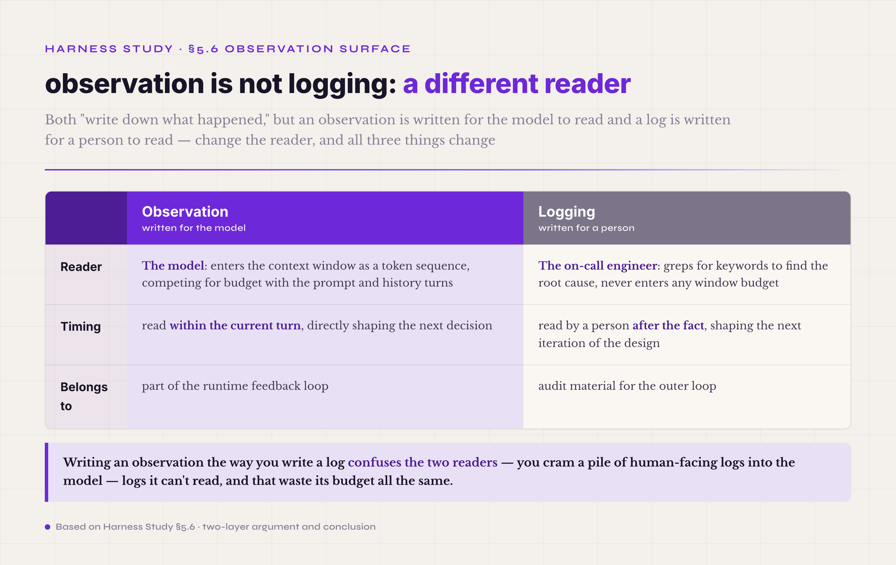
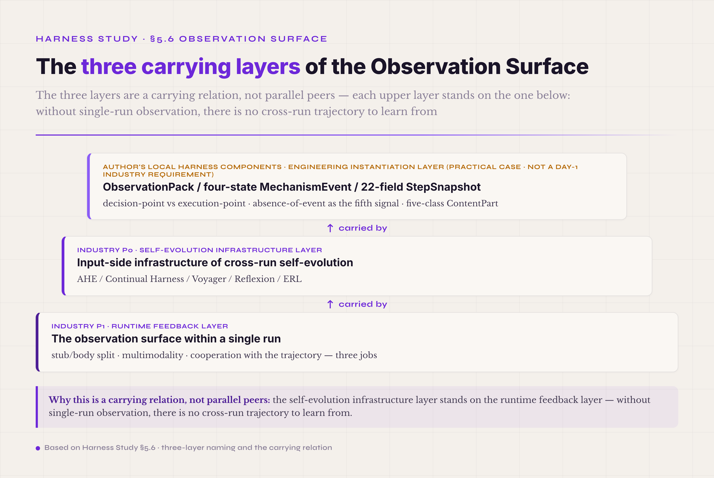
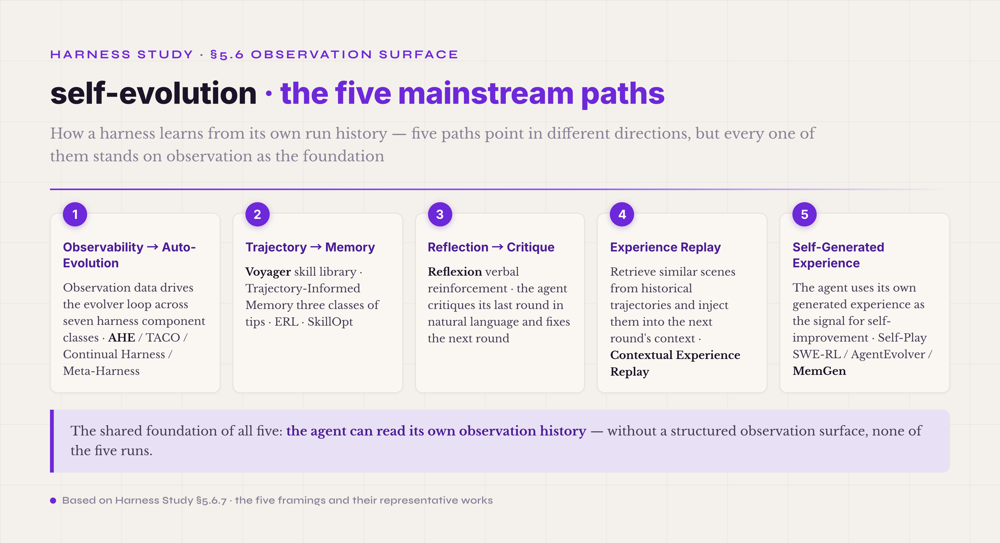

# 5.6 Observation Surface · **Three-layer position · self-evolution infrastructure + runtime feedback + the author's engineering instantiation**

The sixth mechanism is the environmental feedback the agent receives after calling a tool — the output of the execution, the file content it read, the body of the page it fetched, the result of the tests it ran, the image it saw, the report it generated. Together this feedback makes up the observation surface. The end of §5.5 made the point that an instruction hangs on the carrier where it takes effect most easily; extend that point in the opposite direction and you reach the root claim of §5.6: **the way an agent sees its environment is fundamentally not the way a person reads a log.** What separates a production agent that merely runs from one that runs stably and evolves across runs is often the maturity of the observation surface.

Why is observation not logging? Two arguments, stacked. The first is about the reader. The reader of an observation is the model; the reader of a log is a person. The model reads an observation as a token sequence that enters the context window and competes for budget with the prompt and the history — pack one 5,000-line grep output straight into context, and a few rounds later the whole context has blown up. The reader of a log is the on-call engineer, who greps for keywords after something breaks; a log never enters any window budget. Two kinds of readers process the same data in completely different ways, and writing observations the way you write logs confuses the two. The second argument is about timing. An observation is read within the agent's current turn and shapes the next decision; a log is read by a person after the fact and shapes the next iteration of the design. The first belongs to the runtime feedback loop; the second is audit material for the outer loop.

*Figure 5.16 · The essential difference between observation and logging*

These two arguments only cover the single-run view. **The "surface" in observation surface goes far beyond one run** — it is also the input-side infrastructure of the cross-run self-evolution loop, and by 2026 the industry treats that as a settled fact. AHE (Agentic Harness Engineering)[^ahe-2026] is titled, literally, "Observability-Driven Automatic Evolution of Coding-Agent Harnesses": ten AHE iterations took the Terminal-Bench 2 pass rate on GPT-5.4 from the seed harness's 69.7% to 77.0% (+7.3 pp) — with the model unchanged, the automatically evolved harness overtook the hand-built Codex-CLI harness (71.9%) — using observation data to drive an evolver loop that simultaneously optimizes seven orthogonal component classes: system prompt, tool descriptions, tool implementations, middleware, skills, sub-agent configuration, and long-term memory. Continual Harness[^continual-harness-2026] goes further: a reset-free self-improving harness in which an embodied agent alternates automatically between acting and refining its own prompt, sub-agents, skills, and memory. The earlier work set the patterns: Voyager[^voyager-2305] introduced the skill library, accumulating reusable code artifacts from past tasks for future ones; Reflexion[^reflexion-shinn-2023] introduced verbal reinforcement, the agent critiquing its own last round in natural language to fix the next round's strategy; ERL (Experiential Reflective Learning)[^erl-2026] consolidated these into the industry's standard reflective-agent paradigm. Across studies and deployment reports, reflective agents show real gains on complex multi-step work — software engineering, planning, scientific research, customer operations — with magnitudes that vary by task and baseline, from single digits to tens of percentage points (ERL, for instance, +7.8% on Gaia2).

Put the two together and §5.6 actually holds **three layers of position**:

- **First layer · self-evolution infrastructure.** The observation surface is the input-side infrastructure of cross-run self-evolution. AHE, Continual Harness, Voyager, Reflexion, ERL — the mainstream 2026 paths all stand on this layer. Any harness that aims at long-term capability growth has to make this layer solid first.
- **Second layer · runtime feedback.** Within a single run, the observation surface does three things — the stub/body split, multimodality, and cooperation with the trajectory. This is the P1 industry consensus already locked in v0.3 §5.4: Trivedy's "Bundled Infrastructure," Augment Code's "Feedback Loops," SWE-agent's .traj, Anthropic's Claude vision, and OpenAI's GPT-4V all do this work.
- **The author's local instantiation of the harness components.** The ObservationPack abstraction, the four-state MechanismEvent classification (Activated / Skipped / Blocked / Error), the 22-field StepSnapshot structure, the decision-point vs execution-point discipline, absence-of-event as the fifth signal, the five-class ContentPart multimodal abstraction — these are the author's concrete engineering instantiations along the industry's self-evolution mainline (AHE, Voyager, Reflexion), and **all of them are internal harness components.** This section expands only the harness-component instantiation, marked explicitly as the author's practical case study, not a day-1 industry requirement. Above the harness components you can also attach a meta-workbench (the author's local instance is called the Harness Lab workbench — the counterpart of W&B for ML experiment tracking, or GitLab CI for DevOps) for systematic tuning across tasks and configurations — but that is a bonus path, not the only form self-evolution takes. The workbench itself is covered in the Harness Lab chapter, not here.

The three layers are not parallel; they carry each other. The self-evolution infrastructure layer stands on the runtime feedback layer (without single-run observation there is no cross-run trajectory to learn from), and the author's local instantiation is those two layers landed in the author's actual engineering context. All three are **internal harness components**: cross-run self-evolution is a capability of the harness itself, not something that requires an external workbench to run. Together they confirm one thing — the design driver of the observation surface was never "store tool output so a person can debug." It is "model the agent-environment interaction as a two-way data stream that feeds both the current inference and the cross-run optimization engine." The nine sub-sections below run: observation vs logging plus the stub/body split → multimodal observation → observation with the trajectory → schema design → common pitfalls → industry implementations → the self-evolution infrastructure layer (NEW) → the author's local instantiation → getting started. The first six belong to the two base layers, the seventh covers self-evolution, the eighth the author's instantiation, and the ninth gives the four-dimension starting advice.

*Figure 5.17 · The three carrying layers of the Observation Surface*

#### 5.6.0 Terms first used in this section

Terms already explained in §I–§V so far (schema, trajectory, verifier, ablation, context, artifact, lost-in-the-middle, prompt asset, hook, tool description, and so on) are not repeated. Listed here are only the terms that appear for the first time in §5.6.

**Core observation-surface terms** — **observation** (the feedback data the agent receives after calling a tool or perceiving the environment · its reader is the model, not a person · read within the current turn, shaping the next decision · fundamentally different from an on-call log in both reader and timing). **observation surface** (the physical layer observations occupy in the harness · covers schema design, physical storage, and cooperation with the trajectory · this volume upgrades the older "observation serialization" idea to a "surface" — the point being that this layer is not just a data format but the whole interaction face between agent and environment). **stub/body split** (the basic physical cut of an observation · the stub is a small summary that enters context; the body is the full content stored in the ArtifactStore · the model reads the stub and decides whether to call `read_observation(obs_id)` for the full body · the same split appears in Trivedy's "Bundled Infrastructure" and Augment Code's "Feedback Loops").

**Multimodal observation terms** — **multimodal observation** (non-text feedback: images, PDFs, audio, video, tables · a first-class citizen in 2026 · Anthropic Claude vision, OpenAI GPT-4V, and Google Gemini's multimodal API all support it at the wire-format layer · the abstraction is consistent, the concrete formats differ). **ContentPart** (the type abstraction for multimodal observations · Anthropic Claude API's content block is the industry's analogous abstraction · the five-class split the author carried over from the Harness Lab workbench is Text / Image / FileContent (read whole, small files) / FileRef (reference, large files) / PreprocessError (an explicit modal-failure signal) · presented as this tutorial's companion implementation case, not a day-1 industry standard).

**Self-evolution infrastructure terms** — **self-evolving / self-improving agent** (an agent that improves its own prompt, tools, memory, skills, and harness configuration across run boundaries, from historical trajectories, observations, and outcomes, without human intervention · the 2026 mainstream direction, already covered by an industry survey[^self-evolving-survey-2026]). **observability-driven evolution** (the framing AHE[^ahe-2026] proposed · observation as the input-side infrastructure of self-evolution · the evolver loop uses observation data to revise prompts, tools, middleware, memory, and skills). **skill library** (the pattern Voyager[^voyager-2305] introduced · accumulate reusable code artifacts from past tasks for future ones). **verbal reinforcement / reflection** (the pattern Reflexion[^reflexion-shinn-2023] introduced · the agent critiques its own last round in natural language and fixes the next round's strategy). **experience replay** (the agent retrieves similar scenes from historical trajectories and injects them into the next round's context · Contextual Experience Replay is the 2026 mainstream variant). **trajectory-informed memory**[^trajectory-informed-memory-2026] (extract reusable skills, heuristics, and lessons learned from trajectories and write them into memory). **continual harness**[^continual-harness-2026] (a reset-free self-improving harness · the agent alternates automatically between acting and refining its prompt, sub-agents, skills, and memory). **meta-harness** (an agent that can modify its own scaffolding, not only its own code · a direction the industry is watching in 2026).

**The author's local instantiation terms** — **Harness Lab workbench** (the meta-workbench the author built · **not a harness component itself — a layer above the harness** · the workbench is covered in the Harness Lab chapter, not here · this section expands only the harness-component instantiation). **ObservationPack** (the author's concrete stub/body-split abstraction along the industry consensus · OpenInference, Langfuse, Helicone, and the OTel GenAI semconv have not yet converged on a unified spec at this level · presented as the author's practical case, not an industry standard). **MechanismEvent 4-state** (the author's observation-state classification along the industry's reflection and observability-driven-evolution direction · Activated / Skipped / Blocked / Error · every decision point must emit one of the four for the observation to count as complete · the author's local instantiation). **absence-of-event** (the fifth observation signal · "should have fired but didn't" means the mechanism exists in the schema but was never wired up at runtime · the core signal against the schema-only-no-runtime pitfall · the author's local instantiation). **decision-point vs execution-point** (observations should fire at decision points, not execution points · a decision point answers "what decision did I just make"; an execution point only answers "what did I just do" · the former carries more information · the author's local instantiation). **OTel GenAI semconv** (the OpenTelemetry GenAI semantic conventions · the open standard the industry is converging on in 2026 · observations enter the OTel pipeline as span attributes or standalone events, sharing one trace context with the trajectory · this standard belongs to the shared industry base layer, not the author's local instantiation).

#### 5.6.1 How observation differs from logging + the stub/body split

The feedback from an agent's tool calls has one peculiarity: its size distribution is bimodal. One class is small feedback of a few dozen characters per call — a curl status code, a write-file confirmation, a simple computed result — which can stay in context whole without straining the budget. The other class is large feedback of a few KB to a few MB per call — a grep matching 5,000 lines, a web fetch of 50K characters, a full file read, a big database result set — and if this class stays in context whole, one or two observations eat the entire window within a few calls.

The stub/body split falls straight out of that bimodal distribution. The stub is a small summary that enters context — id, type, summary, size, a truncated preview, key metadata, usually around 200 characters. The body is the full content, stored in the ArtifactStore or another persistent backend, so the agent can fetch it in a later turn through `read_observation(obs_id)` without it ever entering the fixed context budget up front. This physical structure gives the agent, when a large piece of feedback arrives, the ability to look at the outline first and decide whether to read deeper — instead of being forced to swallow all of the data into context at once.

The storage-cost worry about keeping every body has a simple knife: **tier by run outcome**, not by blanket sampling. Failed runs keep their observation bodies at 100% fidelity — nearly all the value for post-mortems and self-evolution is concentrated in failures; successful runs can archive with bodies sampled at 1/N (bodies stay available while the run is live — this tier governs cross-run retention). The tiering also comes with an engineering convenience: the verifier's verdict already exists when the run ends, so the storage policy hangs directly off that verdict, and no new mechanism is needed.

The industry has reached base consensus on this split. Trivedy's harness framework of 2026-03 lists the filesystem, the sandbox, and the browser among required harness components — observation is not an abstract idea; it has to land on concrete physical infrastructure like a sandbox and an artifact store. Augment Code files this layer under "Feedback Loops." The engineering value of the split is not only the tokens saved. More important, it makes "the agent decides its own depth of information" possible: the stub shows the agent the shape of a piece of feedback, and the body lets it go deeper when it needs to. A harness without the split leaves the agent either drowning in raw data or losing information to truncation — both ends are common pitfalls.

The author's local instantiation along this consensus is called ObservationPack. It concretizes the stub-body relation into a struct: the stub enters context with the structured fields above, and the body is stored and fetched through the ArtifactStore, indexed by obs_id. This particular abstraction is not an industry standard — OpenInference, Langfuse, Helicone, and the OTel GenAI semconv have not converged on a unified stub/body spec. The author's ObservationPack is one concrete landing of the consensus direction, shown as this tutorial's practical case. In your own harness, the stub's field schema, the body's storage location, and the signature of read_observation can all differ — what must exist is the split itself.

#### 5.6.2 Multimodal observation

Multimodal observation is a first-class citizen in 2026 — the environmental feedback an agent receives is no longer just a text stream. Anthropic Claude API's content block lets images and documents stand directly as observation elements; OpenAI's GPT-4V and vision APIs make images first-class input; Google Gemini's multimodal input unifies image, audio, and video in one wire format. All three head providers treat multimodality as a first-class observation abstraction at the API layer — the field has moved from "a vision model as a separate endpoint" to "multimodality as the default capability of the agent's observation channel."

Multimodal observation brings the harness two special difficulties. The first is size explosion. A high-resolution image can be hundreds of KB in base64; ten minutes of audio can be several MB; a PDF with images can be several MB. Size explosion upgrades the stub/body split from an optimization to a necessity — unsplit multimodal observation basically cannot ship to production. The second is that modal failure signals must be explicit. OCR failing on an image, transcription timing out on audio, frame extraction failing on video — these modal-layer failures must not be swallowed silently. They must reach the agent as explicit observation signals, so the agent can decide whether to fall back to a text-only path or retry the modal processing.

The author's local instantiation along this industry direction is the ContentPart abstraction — one enum unifying multimodal observations into five classes: Text / Image / FileContent (read whole, small files) / FileRef (reference, large files) / PreprocessError (the explicit modal-failure signal). Text and Image are the base types. The FileContent vs FileRef cut routes small and large files down different observation paths — a FileContent stub entering context carries the file's whole content (the high-precision mode for small files), while a FileRef stub carries only metadata (path, size, mime_type) and the full content is fetched only when the agent actively reads it (the lazy mode for large files). PreprocessError is the most important of the five: it makes modal-level failures — image processing failed, OCR timed out, file read error — an ordinary signal on the normal observation path rather than a thrown exception, so the agent can handle the failure at the prompt layer. This ContentPart enum is the author's local instantiation of the industry's multimodal-API consensus, shown as this tutorial's practical case — other harnesses may cut the enum differently (LangChain's BaseMessage content uses a list of typed parts rather than one enum). What must exist: multimodality, and the explicit modal-failure signal.

#### 5.6.3 Observation working with the trajectory

An observation is not an isolated data point — it is stored in cooperation with the trajectory, the agent's execution history. SWE-agent defines a trajectory as a sequence of thought / action / observation triples by turn, with each turn's observation paired with that turn's thought and action. The pairing is not a data-structure convenience; it is the precondition for trajectory replay, ablation, and regression — without "this thought was followed by that observation," a trajectory is just an event stream, not an analyzable execution history.

The mainstream harnesses store the observation-trajectory pairing along a few paths. SWE-agent uses a single JSON file named `<instance_id>.traj`, holding every turn's thought/action/observation triple, with an .html rendering for human inspection. Published research into the Claude Code source shows it uses JSONL, one event per line, with observation as its own event type. OpenAI Codex CLI uses the Rollout file format. LangSmith keeps trajectories in the cloud with a UI for inspection. OpenInference uses an OTel-compatible schema, with observations entering the OTel pipeline as span attributes or standalone events. The differences are wire format and storage backend; the common ground is that **observation must be a first-class part of the trajectory, never a separate log stream.**

The OTel GenAI semantic conventions are the open standard the industry is converging on in 2026: observations and trajectories share one trace context, so a single telemetry pipeline can process them across harnesses and vendors. The standard is still evolving — the spec was still moving in mid-2026, and vendor implementations differ. But OTel shares its roots with the W3C trace context, which standardizes agent observation onto the mature engineering infrastructure of distributed tracing — the key piece for getting observation governance out of vendor lock-in.

#### 5.6.4 Schema design for the observation surface

The schema design of observations decides one thing: whether an automatic evaluator can read them. HAL (Holistic Agent Leaderboard)[^hal-2026] ran 21,730 rollouts across 9 models and 9 benchmarks and compressed evaluation from weeks to hours — and the basis of that jump is an observation schema structured enough to feed an automatic evaluator directly, with no human reading logs. Free-form natural-language observation logs are the root obstacle to evaluation automation: a person can read them, an evaluator cannot run on them.

Four things must be settled at the schema level. First, which fields are anomaly triggers — token usage past a ceiling, accumulated reasoning past a threshold, the same tool called repeatedly with the same arguments, a plan flip-flopping back and forth: all common anomalies. Second, which fields accumulate across runs — cache hit %, batch size, artifact reference counts, the indicators whose trends only show across runs. Third, which fields enter the prompt cache — stable field names and field order are preconditions for cache hits. Fourth, which fields must be redacted before persisting — PII and credentials are scrubbed before the observation is written out, never cleaned up later by grepping.

The author's local instantiation along this direction is called StepSnapshot — each turn's observation structured into 22 fields, including turn count, input tokens, output tokens, cache hit %, artifact references, model selection rationale, and batch aggregation flags. Twenty-two is not a magic number; it is one concrete cut the author converged on in practice, and another harness might use 15 fields or 30. What matters is not the count but the property that every field maps to one class of signal an automatic evaluator can read — that is what upgrades observation from single-run runtime feedback into input for cross-run self-evolution.

#### 5.6.5 Common pitfalls · observation overload and observation distortion

Observation governance has two dual pitfalls — overload and distortion. The first packs tool feedback into context whole, with no summarization; the second truncates crudely and loses information. Both are exactly what the stub/body split exists to prevent.

Observation overload is common in harnesses without the split. A grep returns 5,000 lines, a web fetch returns 50K characters, a database query returns 1MB of JSON — packed straight into context, they fill the window within a few rounds. The hidden cost is worse than the visible token spend: lost-in-the-middle (covered in the Context and Memory sections) means a large mid-context observation goes unread by the model even when it stays — tokens paid, attention not received. The test is simple: when a single turn's observation is longer than the system prompt plus the tool descriptions combined, or makes the context occupancy jump visibly, that is the engineering signal for the stub/body split.

Observation distortion is the other end — crude truncation that loses information. A web fetch returns 50K characters, and the engineer writes `if len(content) > 4096: content = content[:4096]` in the tool wrapper. The truncation looks like it solved the overload; in fact the agent misses the key information in the lost half — it does not know a second half existed, and reasons over the first 4K characters as if they were everything. The test is whether the truncation tells the agent: a good stub carries metadata like `truncated: true / size: 50000 / preview_truncated_at: 4096`, so the agent knows there is more content to fetch via read_observation. Nothing disappears silently.

The engineering answer to both ends is the same split: the stub carries the truncated flag and size metadata so nothing is silently lost; the body is preserved whole in the ArtifactStore; the agent fetches the full body through read_observation when it needs it. One structure solves both ends — neither overload nor distortion. A common second-order pitfall is truncating without storing the body: the context does not overload, but the body is gone, the agent cannot fetch what no longer exists, and the result is still distortion. The key to the stub/body split is not the stub — it is that the body must be addressable and persistent.

One more hidden pitfall: no redaction. Tool returns can carry credentials and PII — API keys, user emails, ID numbers, bank accounts. Such data enters the observation, hence the context, hence the trajectory, hence cross-run persistence. That chain is one root cause of PII leakage — redaction must happen at the observation entry point, not later when someone greps the logs. This discipline pairs with the Safety control plane covered later; the observation entry is the first line of PII defense.

#### 5.6.6 Industry implementations

The mainstream observation-and-trajectory implementations run along a few branches. Published research into the Claude Code source shows a JSONL event stream, observation as its own event type, with hooks doing precise injection and redaction at lifecycle events like PreToolUse and PostToolUse. OpenAI Codex CLI uses the Rollout file format, inspectable in the public repository, with observation as a part inside the turn. SWE-agent uses a single JSON file plus an .html rendering for human inspection, with the thought/action/observation triple structure. LangSmith keeps cloud trajectories with UI inspection, observation entering its observability stack as span attributes. OpenInference uses an OTel-compatible schema, observation as a standardized GenAI-semconv event.

The differences are wire format and storage backend; the common ground is four points of industry consensus. First, observation is a first-class part of the trajectory, not a log. Second, the stub/body split is the physical basis of production-grade observation. Third, multimodal observation is a 2026 default, not an add-on. Fourth, the observation schema must be structured enough to feed an automatic evaluator directly. Those four points are the base layer of §5.6.

What the industry is still evolving is the observation abstraction on the self-evolution input side — OpenInference, Langfuse, Helicone, and the OTel GenAI semconv have not converged on a unified spec. The lack of convergence is not laziness: self-evolution itself was still moving fast in 2026, and observation, as its input-side infrastructure, moves with it. The next section takes up self-evolution and its relation to observation.

#### 5.6.7 The observation surface as the self-evolution infrastructure layer (NEW)

Seen across runs, the observation surface plays the role of input-side infrastructure for the self-evolving agent — and this self-evolution is **a capability of the harness itself.** A harness needs no external meta-workbench to optimize prompts, adjust tool descriptions, or improve context strategy from its own observation history; the observation layer inside the harness is directly its data foundation. By 2026 the industry treats this as a settled fact. AHE (Agentic Harness Engineering)[^ahe-2026] is titled "Observability-Driven Automatic Evolution of Coding-Agent Harnesses": observation data drives an evolver loop that simultaneously optimizes seven orthogonal component classes — system prompt, tool descriptions, tool implementations, middleware, skills, sub-agent configuration, long-term memory — and ten AHE iterations took the Terminal-Bench 2 pass rate on GPT-5.4 from the seed harness's 69.7% to 77.0%. The paper is the first to land the "observation as self-evolution input" framing on concrete benchmark numbers — and note that AHE's evolver loop is itself a capability inside the harness, not a workbench layer outside it.

The industry's self-evolution mainstream runs along five paths, every one of them built on observation.

*Figure 5.18 · The five self-evolution paths built on observation*

The first path is Observability → Auto-Evolution. AHE[^ahe-2026] uses observation data to drive the evolver loop across the seven component classes above. TACO (a training-free self-evolving compression framework for terminal agents)[^taco-2026] does task-aware observation compression, bringing roughly 1-4 percentage points on TerminalBench (the paper reports absolute gains, higher in some configurations, across a full-benchmark range of 0.36-6.02 points). Continual Harness[^continual-harness-2026] pushes the idea to its limit — a reset-free self-improving harness whose embodied agent alternates automatically between acting and refining its own prompt, sub-agents, skills, and memory, with the human removed entirely. Meta-Harness goes further still: the agent modifies the harness code wrapped around the model — prompt construction, retrieval logic, state management — rather than updating model weights. The shared framing of this path: observation data is the direct input of self-evolution.

The second path is Trajectory → Memory. Voyager[^voyager-2305] introduced the skill library — reusable code artifacts accumulated from past tasks and applied to future ones. Trajectory-Informed Memory[^trajectory-informed-memory-2026] automatically extracts three classes of reusable tips from trajectories — strategy, recovery, optimization — as text rather than Voyager's executable code, and writes them to memory. ERL (Experiential Reflective Learning)[^erl-2026] formalizes this into an experiential memory framework for efficient self-improvement in new environments. SkillOpt[^skillopt-2026] pushes the skill library from accumulation to continuous optimization — not only storing verified skills but treating each skill as an object to be rewritten repeatedly under an executive strategy, with stable gains from skill self-evolution verified across six benchmarks and seven models (GPT-5.5 gains roughly +19 to +25 points over a no-skill baseline, varying across the chat, Codex, and Claude Code harness forms). The shared framing: the trajectory is the indirect input of self-evolution, and observation is what the trajectory is made of.

The third path is Reflection → Critique. Reflexion[^reflexion-shinn-2023] introduced verbal reinforcement — the agent critiques its last round in natural language and fixes the next round's strategy. Stanford HAI's 2026 research shows self-reflecting agents performing visibly better in changing environments. Deployment experience in 2026 shows reflective agents bringing real success-rate gains on complex multi-step work — software engineering, strategic planning, scientific research, customer operations. The shared framing: the agent reads its own observation history and critiques itself.

The fourth path is Experience Replay — the agent retrieves similar scenes from historical trajectories and injects them into the next round's context; Contextual Experience Replay is the 2026 mainstream variant. This path joins the memory layer's retrieval with observation.

The fifth path is Self-Generated Experience. Self-Play SWE-RL (SSR)[^ssr-2026] has a single LLM alternate between the roles of bug injector and solver — the agent injects bugs into real codebases, then trains itself to fix them (+10.4 points on SWE-bench Verified). AgentEvolver[^agent-evolver-2026] generates its own tasks through self-questioning, self-navigating, and self-attributing; MemGen[^memgen-2026] works on generative latent memory. All belong to the path where the agent uses its own output as the signal for self-improvement; the shared framing is reducing dependence on human-labeled data. The agent learns from what it produces. The same idea also serves safety alignment rather than capability: FATE[^fate-2026] runs on-policy self-evolution over the agent's own failure trajectories (paired with Pareto-Front Policy Optimization to balance safety against usefulness), cutting Qwen3-8B's attack success rate by about 33.5% relative and harmful compliance by about 82.6% relative on AgentDojo, AgentHarm, and ATBench. Self-evolution's optimization target, in other words, is not limited to capability — safety alignment can use the agent's own trajectories as training signal too.

What the five paths share is plain: all of them stand on the agent being able to read its own observation history. Without a structured observation surface, none of the five runs. So the observation surface is not just part of the runtime feedback layer — it is the input-side infrastructure of the self-evolving harness, and all five paths are self-evolution capabilities the harness itself possesses, with no external workbench required. This position is what upgrades the observation surface, in this volume's 8+1 framework, from a carried-over section to a headline chapter. Above the harness components you can additionally attach a meta-workbench for systematic optimization across tasks and configurations (the author's local instance is the Harness Lab workbench, expanded in the Harness Lab chapter) — but the workbench is the bonus path, not the only form of self-evolution. A harness can self-evolve on its own, or attach to a workbench; the two are not exclusive, and both are legitimate.

#### 5.6.8 The author's local instantiation of the harness components

The author's local instantiation along these five industry paths is a set of **internal observation components of the harness** — the four-state MechanismEvent, absence-of-event as the fifth signal, decision-point vs execution-point, ObservationPack, StepSnapshot, and the five-class ContentPart multimodal abstraction. These components let the observation surface feed both the current inference and the harness's own cross-run self-evolution loop — a self-evolution that is internal capability, needing no external workbench. The four abstractions below are concrete landings of the observation-surface components, designed along AHE's framing (observability-driven automatic evolution) but choosing specific engineering abstractions — abstractions that are not industry standards but one local landing of the consensus direction.

Above the harness components, a meta-workbench can additionally be attached for systematic tuning across tasks and configurations (the author's local instance is the Harness Lab workbench — the counterpart of W&B for ML experiment tracking or GitLab CI for DevOps, with a five-layer internal pipeline of Observe→Reward→Ablate→Tune→Iterate — and **not a harness component itself**). The workbench is the bonus path, expanded in the Harness Lab chapter; this section stays on the component instantiation.

The first abstraction is the four-state MechanismEvent classification: every harness decision point must emit one of four states for the observation to count as complete — Activated (the mechanism fired), Skipped (the mechanism exists but was skipped this time), Blocked (the mechanism blocked the action), Error (the mechanism errored). The four states turn "did the mechanism fire" into a structured signal an automatic evaluator can read directly.

The second abstraction is absence-of-event as the fifth signal: a decision point that should have fired but did not means the mechanism exists in the schema but was never wired up at runtime. This fifth signal is the core of the defense against the schema-only-no-runtime pitfall — without absence-of-event monitoring, a mechanism written in the design documents may never have run at runtime at all, the agent's behavior looks normal on the surface, and the mechanism you believe you have is actually dead.

The third abstraction is the decision-point vs execution-point discipline: observations should fire at decision points ("what decision did I just make"), not execution points ("what did I just do"). A decision point carries more information than an execution point, because it includes the mechanism's grounds — why this rather than that — where the execution point is only the outcome. The four-state MechanismEvent is itself the structured form of decision-point observation.

The fourth abstraction is ObservationPack — one concrete implementation of stub into context, body into ArtifactStore, body fetched by obs_id. This is the local landing of the stub/body split from §5.6.1.

Together the four abstractions let the observation surface feed the current inference (the runtime feedback layer) and the harness's own cross-run self-evolution loop (the self-evolution input side) — which is exactly the design driver of this layer of harness components.

Other self-evolution engines make different abstraction choices on this layer. The AHE paper uses a different schema; Continual Harness goes reset-free; Voyager uses the skill library pattern — all different concrete engineering choices under the same framing. The author's local instantiation (the four-state MechanismEvent, absence-of-event, decision-point, ObservationPack) is one of them, shown as this tutorial's practical case. When you land self-evolution in your own harness, the four abstractions above can be borrowed, or replaced with shapes that fit your engineering context. What cannot be skipped: the input side of self-evolution needs a structured observation schema.

#### 5.6.9 Getting started · four dimensions

**What to watch:** the biggest trap in observation governance is writing observations the way you write logs. A few simple tests tell you whether the engineering is on track: a single turn's observation making the context occupancy jump visibly is the overload red line; truncating without storing the body is the distortion hazard; PII or credentials in observations without redaction is the safety red line. Take the stub/body split from day 1 — do not pack everything into context planning to optimize later, because by then the context is already saturated with observation patterns. Before multimodal observation ships, measure the sizes: high-resolution images, long audio, and large PDFs basically cannot reach production unsplit.

**How to design:** the observation abstraction runs the three-piece stub/body split — the stub into context (a small summary around 200 characters, fields as listed in the split section), the body into the ArtifactStore or other persistent storage, and a read_observation API for the agent to fetch the body. Multimodal observation runs a ContentPart-style enum — Text / Image / FileContent (small files read whole) / FileRef (large files by reference) plus the explicit PreprocessError signal. Observation-trajectory co-storage follows the industry mainstream — JSONL one-event-per-line (long runs, append-friendly) or single JSON (short runs, easy to render), chosen by toolchain. The OTel GenAI semconv is the open standard converging in 2026 — follow OTel if you want out of vendor lock-in. If the goal is a self-evolution-ready observation surface, the schema must reach the bar where every field maps to a signal an automatic evaluator can read — the engineering landing of the through-line in §5.6.4 and §5.6.7.

**How to test:** the quality of an observation surface is not checked by eyeballing trajectories; it is checked by automatic evaluators reading structured schemas. The HAL paper's[^hal-2026] compression of evaluation from weeks to hours rests on exactly that. Concrete methods: sample 10-20 runs at random and check that observation stubs carry the necessary metadata (the truncated flag, size, timestamps); run lost-in-the-middle tests to see whether mid-context observations get forgotten; measure PII-redaction coverage (inject known PII through synthetic data and check the observation entry catches it); replay trajectories across runs and run ablation to verify schema stability. If the observation surface is meant to feed a self-evolution engine, add a cross-run trajectory-aggregation test — run the same task N times and check the schema is stable enough for an evolver to diff directly.

**What to put in the prompt:** the agent's system prompt should state a few observation disciplines explicitly. First: "when observation feedback is large, you see only the stub — fetch the full content with read_observation when you need it," so the agent knows the stub/body split exists and does not assume every piece of feedback is complete. Second: "when an observation carries the truncated flag, the size field tells you the full size — decide whether read_observation is needed," so the agent learns to read stub metadata before acting. Third: "a PreprocessError observation means modal processing failed, not that the tool call failed — you may retry or switch paths," so the agent distinguishes the two failure types. These three lines pair with the prompt-asset disciplines of the Prompt Assets section: the engineering keeps the observation surface reliable, and the prompt teaches the agent to actually use it.

---

The observation surface looks like an engineering detail about where tool feedback gets stored. Its real position shows when an agent system tries to move from demo to production, and then from production to long-term capability growth: the observation surface is the two-way data stream between the agent and its environment — read by the current inference, and read by the cross-run optimization engine. That two-way nature is what upgrades observation from a plain runtime-feedback component into the input-side infrastructure of the self-evolving agent. The three-layer framing plus the nine sub-sections of this chapter, taken together, are the full map of observation-surface engineering.

---

## Footnotes

[^ahe-2026]: Agentic Harness Engineering: Observability-Driven Automatic Evolution of Coding-Agent Harnesses · arxiv 2604.25850 · Lin / Liu / Pan et al. (Fudan + PKU + Qiji Zhifeng, 11 authors) · 2026 · preprint
[^continual-harness-2026]: Continual Harness: Online Adaptation for Self-Improving Foundation Agents · arxiv 2605.09998 · Karten / Zhang / Jin et al. (Princeton + Google DeepMind) · 2026-05-11 · preprint
[^voyager-2305]: Voyager: An Open-Ended Embodied Agent with LLMs · arxiv 2305.16291 · Wang et al. (NVIDIA / Caltech) · 2023
[^reflexion-shinn-2023]: Reflexion: Language Agents with Verbal Reinforcement Learning · arxiv 2303.11366 · Shinn et al. · NeurIPS 2023
[^erl-2026]: ERL (Experiential Reflective Learning) · arxiv 2603.24639 · Illuin Technology · ICLR 2026 MemAgents Workshop · preprint
[^self-evolving-survey-2026]: A Survey of Self-Evolving Agents · arxiv 2507.21046 · 2026 · preprint (survey)
[^trajectory-informed-memory-2026]: Trajectory-Informed Memory · arxiv 2603.10600 · IBM Research (7 authors) · 2026 · preprint
[^hal-2026]: Holistic Agent Leaderboard (HAL) · arxiv 2510.11977 · Princeton · ICLR 2026
[^taco-2026]: TACO (a training-free self-evolving compression framework for terminal agents) · arxiv 2604.19572 · Manchester + HKUST + Beihang (11 authors) · 2026 · preprint
[^skillopt-2026]: SkillOpt: Executive Strategy for Self-Evolving Agent Skills · arxiv 2605.23904 · Microsoft + SJTU + Tongji + Fudan · 2026-05-22 · preprint
[^ssr-2026]: Self-Play SWE-RL (SSR) · arxiv 2512.18552 · Meta FAIR + CMU + UIUC · ICML 2026
[^agent-evolver-2026]: AgentEvolver · arxiv 2511.10395 · Tongyi-Alibaba (13 authors) · 2026 · preprint
[^memgen-2026]: MemGen: Generative Latent Memory · arxiv 2509.24704 · NUS · ICLR 2026
[^fate-2026]: On-Policy Self-Evolution via Failure Trajectories for Agentic Safety Alignment (FATE) · arxiv 2605.11882 · Bo Yin / Qi Li / Xinchao Wang (NUS) · 2026-05-12 · preprint
