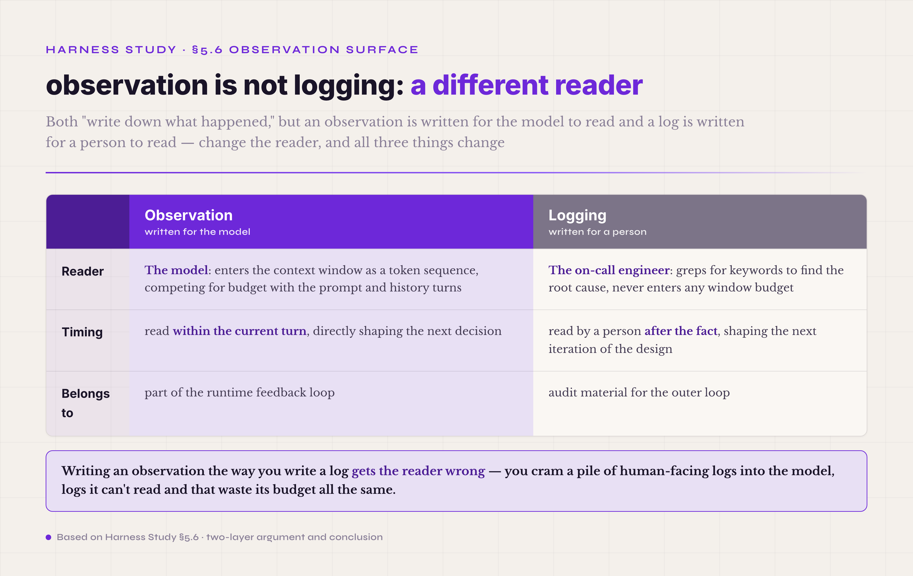
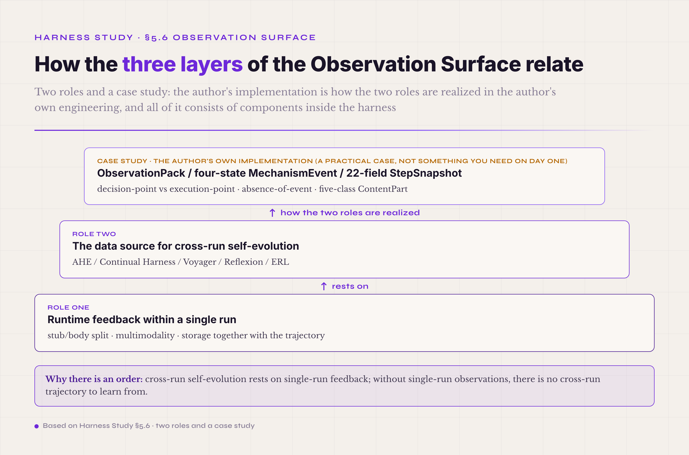
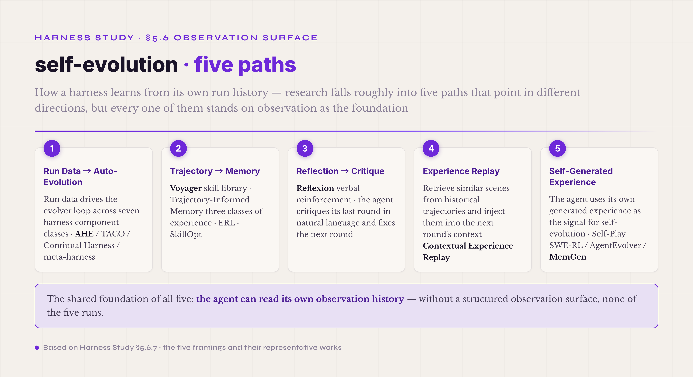

# 5.6 Observation Surface · **P0 (runtime feedback) / P2 (cross-run data source)**

The sixth mechanism is the environmental feedback the agent receives after calling a tool: the output of the execution, the file content it read, the body of the page it fetched, the result of the tests it ran, the image it saw, the report it generated. Together this feedback makes up the layer called the observation surface, the design surface for the feedback an agent gets from its environment (tool results, errors, and state). The root claim of this section is that **the way an agent sees its environment is fundamentally not the way a person reads a log.** What separates a production agent that merely runs from one that runs stably and keeps improving across runs is often the maturity of the observation surface.

Two similar words need to be kept apart first. By **observation** we mean the environmental feedback fed to the model, and its reader is the model. By **observability** we mean the visibility of runtime state to people, for example through logs, metrics, and traces, and its reader is an engineer. This section is about the first. The two can draw on the same data, but they are designed for different goals.

Why is observation not logging? There are two arguments.

- **The first is about the reader.** The reader of an observation is the model; the reader of a log is a person. The model reads an observation as a token sequence that has to enter the context window, where it competes for budget with the prompt and earlier turns. Put one 5,000-line grep output straight into context, and a few turns later the whole context is full. The reader of a log is the on-call engineer, who greps for keywords to find the root cause when something breaks; a log takes up no window budget at all. The two kinds of readers need completely different things from the same data, and writing observations the way you write logs gets the reader wrong.
- **The second is about timing.** An observation is read within the agent's current turn and shapes the next decision; a log is read by a person after the fact and shapes the next iteration of the design. The first belongs to the runtime feedback loop; the second is engineering audit material for the outer loop.

*Figure 5.16 · The essential difference between observation and logging*

These two arguments cover only the difference within a single run. **The observation surface does far more than serve one run**: it is also the data source for cross-run self-evolution. A body of research is pushing in this direction. AHE (Agentic Harness Engineering)[^ahe-2026] is titled "Observability-Driven Automatic Evolution of Coding-Agent Harnesses." Note that AHE's observability is broader than this section's observation, since it covers the whole record a run leaves behind; this section borrows only one point from it, using run data to drive harness improvement. AHE uses run data to drive an evolver loop that optimizes seven classes of components at once: system prompt, tool descriptions, tool implementations, middleware, skills, sub-agent configuration, and long-term memory. Ten iterations took GPT-5.4's pass rate on Terminal-Bench 2 from the initial harness's 69.7% to 77.0% (+7.3 percentage points). With the model unchanged, the automatically evolved harness beat the hand-designed Codex CLI harness (71.9%).

Other work follows the same line:

- Continual Harness[^continual-harness-2026] proposes a reset-free self-evolving harness, in which an embodied agent alternates between doing its task and revising its own prompt, sub-agents, skills, and memory.
- The earlier Voyager[^voyager-2305] introduced the skill library, accumulating reusable code for use in later tasks.
- Reflexion[^reflexion-shinn-2023] introduced verbal reinforcement: the agent critiques its own performance in the last round in natural language and revises its strategy for the next round accordingly.
- ERL (Experiential Reflective Learning)[^erl-2026] combines experience with reflection.

On complex multi-step work such as software engineering, planning, scientific research, and customer service, the gains these reflective agents show vary with task and baseline across the reported studies, from single digits to tens of percentage points (ERL, for instance, reports +7.8% on Gaia2).

Taken together, this section covers **two roles and a case study**:

- **Role one: runtime feedback within a single run.** Within one run, the observation surface has three jobs: the stub/body split, multimodality, and storage together with the trajectory. Trivedy's "Bundled Infrastructure," Augment Code's "Feedback Loops," SWE-agent's .traj files, and the vision input of Claude and GPT-4V all touch this part.
- **Role two: the data source for cross-run self-evolution.** AHE, Continual Harness, Voyager, Reflexion, and ERL all rest on being able to read historical run data. If you want a harness's capability to grow over time, this layer has to be made solid first.
- **Case study: the author's own implementation.** The ObservationPack abstraction, the four-state MechanismEvent classification (Activated / Skipped / Blocked / Error), the 22-field StepSnapshot structure, the principle of separating decision points from execution points, absence-of-event (an event that should have happened and did not), and the five-class ContentPart multimodal abstraction. These are the author's concrete implementations along the lines of AHE, Voyager, Reflexion, and similar work, and **all of them are components inside the harness.** This section goes into detail only on this part, and labels it "the author's practical case, not something you need on day one." On top of the harness you can also attach an outer workbench for systematic tuning across tasks and configurations. The author calls it Harness Lab (this book's name for "an outer workbench that improves a harness iteratively through evaluation, ablation, and tuning," playing the role W&B plays for machine-learning experiment tracking, or GitLab CI for DevOps). But it is an advanced option, not the only form self-evolution takes; §VII covers it, and this section does not.

The three relate as follows. Cross-run self-evolution rests on single-run feedback (without single-run observations, there is no cross-run trajectory to learn from), and the author's implementation is how the two roles are realized in the author's own engineering. All of these are components inside the harness: cross-run self-evolution is a capability of the harness itself and runs without any external workbench. Together they show one thing. The observation surface was never designed to "store tool output so a person can debug it." It was designed to "model the agent-environment interaction as a two-way data stream that feeds both the current inference and cross-run optimization."

The nine subsections that follow cover, in order: how observation differs from logging, plus the stub/body split; multimodal observation; observation working with the trajectory; schema design; failure modes and anti-patterns; industry implementations; the observation surface as a data source for self-evolution; the author's implementation case; and getting started. The first six cover role one, the seventh covers role two, the eighth covers the author's case, and the ninth gives starting advice in four areas.

*Figure 5.17 · How the three layers of the Observation Surface relate (two roles and a case study)*

#### 5.6.0 Terms first used in this section

Terms already explained in §I–§IV and §5.1–§5.5 (schema, trajectory, verifier, ablation, context, artifact, lost-in-the-middle, prompt asset, hook, tool description, and so on) are not repeated. Listed here are only the terms that appear for the first time in §5.6.

**Core observation-surface terms**

- **observation**: the feedback data an agent receives after calling a tool or perceiving its environment. Its reader is the model, not a person; it is read within the current turn and shapes the next decision. It differs fundamentally from a log written for the on-call engineer in both reader and timing, and it is also distinct from observability, which serves people.
- **observation surface**: the design surface for observations in the harness, in three parts: schema design, storage, and coordination with the trajectory. This volume widens the older idea of "observation serialization" into the "observation surface," to stress that this layer is more than a data format. It is the whole interface between the agent and its environment.
- **stub/body split**: the basic cut in an observation's structure. The stub is a small summary that enters context; the body is the full content, stored in the ArtifactStore. The model reads the stub and decides whether to call `read_observation(obs_id)` for the full body. Trivedy's "Bundled Infrastructure" and Augment Code's "Feedback Loops" both make this split.

**Multimodal observation terms**

- **multimodal observation**: feedback that is not plain text, such as images, PDFs, audio, video, and tables. Anthropic Claude's vision input, OpenAI GPT-4V, and Google Gemini's multimodal API all support it at the request-format level. The abstraction is consistent; the concrete formats differ.
- **ContentPart**: the type abstraction for multimodal observations. The content block in Anthropic's Claude API is the same kind of abstraction. The split the author borrowed from the Harness Lab workbench has five classes: Text, Image, FileContent (small files, read whole), FileRef (large files, reference only), and PreprocessError (an explicit signal that modality processing failed). This is the book's companion implementation case, not an industry standard.

**Self-evolution terms**

- **self-evolving agent** (also called a self-improving agent): an agent that, across runs, automatically improves its prompt, tools, memory, skills, or harness configuration from historical trajectories, observations, and outcomes, without human intervention. A survey already exists[^self-evolving-survey-2026].
- **observability-driven evolution**: the framing from AHE[^ahe-2026], in which run data drives an evolver loop that revises prompts, tools, middleware, memory, and skills.
- **skill library**: the practice Voyager[^voyager-2305] introduced, accumulating reusable code for use in later tasks.
- **verbal reinforcement / reflection**: the practice Reflexion[^reflexion-shinn-2023] introduced, in which the agent critiques its own last round in natural language and revises the next round's strategy accordingly.
- **experience replay**: the agent retrieves similar situations from historical trajectories and injects them into the next round's context. Contextual Experience Replay is one way to do it.
- **trajectory-informed memory**[^trajectory-informed-memory-2026]: extracting reusable skills, rules of thumb, and lessons from trajectories and writing them into memory.
- **Continual Harness**[^continual-harness-2026]: a reset-free self-evolving harness, in which the agent alternates automatically between doing its task and revising its own prompt, sub-agents, skills, and memory.
- **meta-harness**: an approach proposed in research, in which the agent modifies the harness code wrapped around the model (prompt construction, retrieval logic, state management) rather than updating the model's weights.

**Terms from the author's implementation case**

- **Harness Lab workbench**: defined above. It is **not the harness itself but a layer above the harness.** §VII covers it; this section deals only with the implementation inside the harness.
- **ObservationPack**: the author's concrete abstraction for the stub/body split. OpenInference, Langfuse, Helicone, and the OTel GenAI semantic conventions have no unified spec for an equivalent abstraction yet. This is the author's practical case, not an industry standard.
- **MechanismEvent four states**: the author's classification of observation states. Every harness mechanism must report one of four states each time it checks: Activated (fired), Skipped (present but skipped this time), Blocked (blocked the action), or Error (errored). Only when every decision point emits one of the four is the observation complete. This corresponds to what chapter 12 of *Harness Field Notes* calls a "decision event."
- **absence-of-event**: a decision point that should have emitted an event emits nothing. This usually means the mechanism made it into the design but was never wired up at runtime. It is the key signal for catching the anti-pattern of a mechanism that exists only in the design documents.
- **decision point vs execution point**: observations should be emitted at decision points, not execution points. A decision point answers "what decision did I just make"; an execution point only answers "what did I just do." The former carries more information.
- **OTel GenAI semantic conventions**: OpenTelemetry's attribute-naming conventions for generative AI, still being drafted. Observations can enter the OTel pipeline as span attributes or standalone events, sharing one trace context with the trajectory. This is a public standard, not the author's own implementation.

#### 5.6.1 How observation differs from logging, and the stub/body split

The feedback an agent gets from tool calls has one notable trait: its sizes cluster at two extremes. One class is small feedback of a few dozen characters (a curl status code, a write-file confirmation, a simple computed result), which can go into context whole without exceeding the budget. The other is large feedback of a few KB to a few MB (a grep matching 5,000 lines, a web fetch of 50K characters, a full file read, a large database result set). Put all of that into context, and within a few calls one or two observations fill the entire context.

The stub/body split follows directly from these two extremes:

- The **stub** is a small summary that enters context: id, type, summary, size, a truncated preview, and key metadata, usually around 200 characters (rule of thumb; adjust to your scenario).
- The **body** is the full content, kept in the ArtifactStore or another persistent store. In a later turn the agent can fetch the full body through `read_observation(obs_id)`, so the body does not take up context budget from the start.

With this structure, an agent facing large feedback can look at the summary first and then decide whether to read deeper, instead of being forced to put all of the data into context at once.

Keeping every body raises a storage-cost concern, and there is a simple way to handle it: **grade retention by run outcome**, not by blanket sampling. Failed runs keep all their observation bodies, because nearly all the value for postmortems and self-evolution is concentrated in failures. When a successful run is archived, its bodies can be sampled at 1/N (while a run is in progress every body is available; this grading governs retention across runs). The grading has one more convenience: the verifier's verdict already exists when the run ends, so the storage policy hangs directly off that verdict and needs no new mechanism.

There are already a number of industry approaches to this split. Trivedy's harness framework of 2026-03 lists the filesystem, the sandbox, and the browser among a harness's required components: observation is not an abstract idea, and it needs concrete infrastructure such as a sandbox and an artifact store to hold it. Augment Code files this layer under "Feedback Loops." The split saves tokens, but its larger value is that it lets the agent decide for itself how deep to read: the stub shows the agent the outline of a piece of feedback, and the body lets it read deeper when it needs to. In a harness without the split, the agent either drowns in raw data or loses information to truncation. These are two opposite failure modes (see §5.6.5).

The author's concrete implementation of this split is called ObservationPack. It turns the stub-body relation into a struct: the stub enters context with the fields listed above, and the body is stored and fetched through the ArtifactStore by obs_id. This particular abstraction is not an industry standard; OpenInference, Langfuse, Helicone, and the OTel GenAI semantic conventions have no unified stub/body spec yet. ObservationPack is just one implementation, shown as the author's practical case. In your own implementation, the stub's fields, the body's storage location, and the signature of `read_observation` can all differ. What must exist is the split itself.

#### 5.6.2 Multimodal observation

Multimodal observation is now a default capability of the mainstream APIs, and the environmental feedback an agent receives is no longer only text. The content block in Anthropic's Claude API lets images and documents stand directly as message content. OpenAI's GPT-4V and vision APIs take images as regular input. Google Gemini brings images, audio, and video into one request format. All three major vendors support multimodality at the API level, and the field has moved from "a vision model is a separate endpoint" to "multimodality is a default capability of the agent's observation channel."

Multimodal observation brings two difficulties to harness design:

1. **Size explodes.** A high-resolution image can be hundreds of KB after base64 encoding, ten minutes of audio can be several MB, and a PDF with images can be several MB too. This turns the stub/body split from an optimization into a necessity: multimodal observation without the split basically cannot go to production.
2. **Modality-processing failures must be reported explicitly.** OCR failing on an image, transcription timing out on audio, frame extraction failing on video: failures at the modality layer must not be swallowed silently. They must reach the agent as explicit observation signals, so the agent can decide whether to switch to a text-only path or retry the modality processing.

The author's implementation here is the ContentPart abstraction, one enum that unifies multimodal observations into five classes: Text, Image, FileContent (small files, read whole), FileRef (large files, reference only), and PreprocessError (the explicit modality-failure signal).

- Text and Image are the base types.
- The FileContent vs FileRef cut sends small and large files down different paths. A FileContent stub contains the file's whole content (small files, read exactly). A FileRef stub holds only metadata (path, size, MIME type, and so on), and the full content is fetched only when the agent actively reads it (large files, read on demand).
- PreprocessError is the most important of the five. It returns modality-layer failures (image processing failed, OCR timed out, a file read error) as a signal on the normal observation path rather than as a thrown exception, so the agent can handle the failure at the prompt level.

This ContentPart enum is the author's practical case. Other harnesses may cut it differently (LangChain's BaseMessage content, for example, is a list of parts of different types rather than a single enum). What must exist are two things: multimodal support and an explicit modality-failure signal.

#### 5.6.3 Observation working with the trajectory

An observation is not an isolated data point; it is stored together with the trajectory, the agent's execution history. SWE-agent defines a trajectory as a sequence of turns made of thought, action, and observation triples, and within each turn the observation is stored paired with that turn's thought and action. The pairing is more than a data-structure convenience. It is the precondition for trajectory replay, ablation, and regression testing: without the pairing that says "this thought was followed by that observation," a trajectory is just a string of events, not an execution history you can analyze.

Common implementations store it in different ways:

- SWE-agent uses a single JSON file named `<instance_id>.traj`, holding every turn's thought/action/observation triple, with an .html rendering for human inspection.
- According to public analyses, Claude Code uses JSONL with one event per line, and observation is its own event type.
- OpenAI Codex CLI uses the Rollout file format.
- LangSmith keeps trajectories in the cloud with a UI for inspection.
- OpenInference uses an OTel-compatible schema and sends observations into the OTel pipeline as span attributes or standalone events.

The differences lie in serialization format and storage backend. What they share is that observation is an integral part of the trajectory and does not get a separate log stream.

The OTel GenAI semantic conventions are still being drafted. Their goal is for observations and trajectories to share one trace context, so that different harnesses and different vendors can process them through the same telemetry pipeline. The conventions are still changing, and vendor implementations differ. They sit at a different layer from W3C Trace Context. W3C Trace Context is a request-header format for passing trace identifiers between services; the GenAI semantic conventions are OTel's own attribute-naming conventions for generative AI. Used together, they let an agent's observations plug into mature distributed-tracing infrastructure, and that is the key to freeing observation from vendor lock-in.

#### 5.6.4 Schema design for the observation surface

The schema design of observations decides one thing: whether an automatic evaluator can read them. HAL (Holistic Agent Leaderboard)[^hal-2026] ran 21,730 rollouts (9 models × 9 benchmarks) and cut evaluation time from weeks to hours. The main reason for the speedup is a unified parallel evaluation framework that dispatches large numbers of evaluation tasks to run in parallel. One precondition is that every benchmark's run records share one format, so they can go straight to an automatic evaluator. Conversely, free-form natural-language observation logs are an obstacle to evaluation automation: a person can read them, but an evaluator cannot process them.

Schema design has four questions to settle:

1. **Which signals are anomaly triggers.** Token usage past a ceiling, accumulated reasoning past a threshold, the same tool called repeatedly with the same arguments, and a plan rewritten over and over are all common anomaly signals.
2. **Which signals accumulate across runs.** Metrics like cache hit rate, batch size, and artifact reference counts show their trends only when accumulated across runs.
3. **Which signals enter the prompt cache.** Stable field names and a stable field order are preconditions for a higher prompt-cache hit rate.
4. **Which signals must be redacted before they are persisted.** PII and credentials must be redacted before the observation is written out, not cleaned up later during a grep.

The author's implementation is called StepSnapshot. It structures each turn's observation into 22 fields, including turn count, input tokens, output tokens, cache hit rate, artifact references, the rationale for model selection, and batch aggregation flags. Twenty-two is not a fixed number. It is one cut the author arrived at in practice, and another harness might use 15, 30, or some other split. What matters is not the count but that every field maps to one class of signal an automatic evaluator can read. That is what lets observation go from single-run runtime feedback to input for cross-run self-evolution.

#### 5.6.5 Failure modes and anti-patterns: observation overload and distortion

The observation surface has two failure modes that run in opposite directions: overload and distortion. Overload puts tool feedback into context whole, with no summary; distortion truncates crudely and loses information. These two extremes are exactly what the stub/body split is meant to avoid.

**Overload** is common in harnesses without the stub/body split. A grep returns 5,000 lines, a web fetch returns 50K characters, a database query returns 1MB of JSON. Put straight into context, they fill the whole context within a few turns. The hidden cost of overload is larger than the visible token spend. Because of lost-in-the-middle (covered in §5.4), a large observation sitting in the middle of the context may go unused by the model even though it is still there, so you pay for the tokens without getting the model's attention in return. How to tell (a rule of thumb): if a single turn's observation is longer than the system prompt and the tool descriptions combined, or makes the current context occupancy jump visibly, you need the stub/body split.

**Distortion** is the other end: information lost to crude truncation. Say a web fetch returns 50K characters, and the engineer writes `if len(content) > 4096: content = content[:4096]` in the tool wrapper. That looks like it solves the overload, but in fact the agent misses the key information in the second half. It does not know anything was cut, and it reasons over the first 4K characters as if they were everything. The test is whether the agent is told about the truncation. A good stub must carry metadata like `truncated: true / size: 50000 / preview_truncated_at: 4096`, so the agent knows "there is more, and read_observation can fetch it," instead of the rest being dropped silently.

The remedy for both failure modes is the stub/body split. The stub carries the truncation flag and size metadata, so nothing is lost silently; the body is kept whole in the ArtifactStore; and the agent can fetch the full body through `read_observation`. One structure handles both ends, with neither overload nor distortion.

A common anti-pattern is truncating without saving the body. The context does not overload, but the body is gone, the agent cannot fetch it even if it wants to, and the result is still distortion. The key to the stub/body split is not the stub. It is that the body must be addressable and persistently stored.

Another, less visible anti-pattern is skipping redaction. Tool output can contain credentials or PII (API keys, user emails, ID numbers, bank accounts). Once such data enters an observation it enters the context; once in the context it enters the trajectory; and once in the trajectory it persists across runs. That chain is one root cause of PII leakage, so redaction has to happen at the observation entry point, not later when someone greps the logs. This requirement pairs with the §5.9 Safety control plane: the observation entry point is the first line of defense for PII.

#### 5.6.6 Industry implementations

The main harnesses implement observation and trajectory along a few paths:

- **Claude Code**: according to public analyses, a JSONL event stream with observation as its own event type, plus hooks that do targeted injection and redaction at lifecycle events such as PreToolUse and PostToolUse.
- **OpenAI Codex CLI**: the Rollout file format, inspectable in the public repository, with observation as one part of a turn.
- **SWE-agent**: a single JSON file plus an .html rendering for human inspection; the trajectory is structured as thought/action/observation triples.
- **LangSmith**: cloud trajectories with UI inspection; observations enter LangSmith's observability stack as span attributes.
- **OpenInference**: an OTel-compatible schema, with observation as an event defined by the GenAI semantic conventions.

The differences lie in serialization format and storage backend. The shared practices come down to a few points:

1. Observation is an integral part of the trajectory, not a log.
2. The stub/body split is the basic structure of production-grade observation.
3. Multimodal observation is a default capability, not an add-on.
4. The observation schema must be structured enough to go straight to an automatic evaluator.

These four points are the basics covered in the first six subsections of this section.

What is still evolving is the observation abstraction that serves as input to self-evolution; OpenInference, Langfuse, Helicone, and the OTel GenAI semantic conventions have no unified spec for it yet. That is not because the industry has done nothing. Self-evolution itself is still evolving fast, and observation, as its input, changes along with it. The next subsection takes up the relation between self-evolution and observation.

#### 5.6.7 The observation surface as a data source for self-evolution

Seen across runs, the observation surface is the data source for a self-evolving agent, and this self-evolution is **a capability of the harness itself.** Without any external workbench, a harness can optimize prompts, adjust tool descriptions, and improve its context strategy from its observation history, and the observation layer serves directly as its data foundation. AHE[^ahe-2026] uses run data to drive an evolver loop that optimizes seven classes of components at once (system prompt, tool descriptions, tool implementations, middleware, skills, sub-agent configuration, and long-term memory), and ten iterations took GPT-5.4's pass rate on Terminal-Bench 2 from the initial harness's 69.7% to 77.0%. The paper grounds the idea of using run data to drive harness improvement in concrete benchmark numbers. Note that AHE's evolver loop is itself a capability inside the harness, not a workbench outside it.

Research on self-evolution built on observation falls roughly into five paths.

*Figure 5.18 · The five self-evolution paths built on observation*

**First path: from run data to automatic evolution.** AHE[^ahe-2026] uses run data to drive the evolver loop, revising the seven classes of harness components above at once. TACO (a training-free self-evolving compression framework for terminal agents)[^taco-2026] does task-aware observation compression, bringing roughly 1–4 percentage points of improvement on TerminalBench (the paper reports absolute gains, higher in some configurations, with a full-benchmark range of 0.36–6.02 points). Continual Harness[^continual-harness-2026] goes a step further: a reset-free self-evolving harness in which an embodied agent alternates automatically between doing its task and revising its own prompt, sub-agents, skills, and memory, with no human involvement. Other research proposes the meta-harness approach, in which the agent modifies the harness code wrapped around the model (prompt construction, retrieval logic, state management) rather than updating the model's weights. Every approach on this path takes observation data as the direct input to self-evolution.

**Second path: from trajectory to memory.** Voyager[^voyager-2305] introduced the skill library, accumulating reusable code for use in later tasks. Trajectory-Informed Memory[^trajectory-informed-memory-2026] automatically extracts three classes of experience from trajectories (strategy, recovery, and optimization), in text form rather than Voyager's executable code, and writes them into memory. ERL[^erl-2026] formalizes this into an experiential memory framework for efficient self-evolution in new environments. SkillOpt[^skillopt-2026] takes the skill library from accumulation to continuous optimization. Beyond storing verified skills, it uses an executive strategy to treat each skill as something that can be rewritten again and again, and it verified stable gains from skill self-evolution across six benchmarks and seven models (GPT-5.5 gains roughly 19 to 25 points over a no-skill baseline, varying across three harness forms: chat, Codex, and Claude Code). Every approach on this path takes the trajectory as an indirect input to self-evolution, and observation is part of the trajectory.

**Third path: from reflection to self-critique.** Reflexion[^reflexion-shinn-2023] introduced verbal reinforcement: the agent critiques its own last round in natural language and revises the next round's strategy accordingly. Some research holds that reflective agents can raise success rates on complex multi-step work such as software engineering, strategic planning, scientific research, and customer operations. Every approach on this path has the agent read its own observation history and critique itself.

**Fourth path: experience replay.** The agent retrieves similar situations from historical trajectories and injects them into the next round's context; Contextual Experience Replay is one way to do this. This path combines retrieval from the memory layer with observation.

**Fifth path: self-generated experience.** Self-Play SWE-RL (SSR)[^ssr-2026] has a single LLM alternate between two roles, injecting bugs and fixing them: the agent injects bugs into real codebases, then trains itself to fix those bugs (+10.4 points on SWE-bench Verified). AgentEvolver[^agent-evolver-2026] generates its own tasks through self-questioning, self-navigating, and self-attributing, and MemGen[^memgen-2026] uses generative latent memory. Both belong to the path in which the agent uses experience it generated itself as the signal for self-evolution. Every approach on this path reduces the dependence on human-labeled data and lets the agent learn from its own output. The same idea is also applied to safety alignment. FATE[^fate-2026] has the agent run on-policy self-evolution over the failure trajectories it produced itself (paired with Pareto-Front Policy Optimization to balance safety against usefulness), cutting Qwen3-8B's attack success rate by about 33.5% relative and harmful compliance by about 82.6% relative on AgentDojo, AgentHarm, and ATBench. So the optimization target of self-evolution is not limited to capability: safety alignment can also use the agent's own trajectories as a training signal.

What the five paths share is plain: all of them rest on the agent being able to read its own observation history. Without a structured observation surface, none of the five can run. So the observation surface is part of runtime feedback and also the data source for a self-evolving harness, and all five paths are self-evolution capabilities of the harness itself, with no dependence on an external workbench. Because of this position, this volume treats the observation surface as one of its key sections. On top of the harness you can also attach an outer workbench for systematic optimization across tasks and configurations (the author's implementation is called Harness Lab, covered in §VII), but the workbench is an advanced option, not the only form self-evolution takes: a harness can improve itself on its own or attach to a workbench, and the two are not mutually exclusive.

#### 5.6.8 The author's implementation case

Following the five paths above, the author implemented a set of observation components inside the harness: the four MechanismEvent states, absence-of-event, the separation of decision points from execution points, ObservationPack, StepSnapshot, the five-class ContentPart multimodal abstraction, and others. These components let the observation surface feed both the current inference and the harness's own cross-run self-evolution loop, a self-evolution that needs no external workbench. Four of these abstractions are described below. Their design follows AHE's idea of using run data to drive harness improvement, but the specific abstractions are not industry standards; they are one implementation by the author.

On top of the harness you can also attach an outer workbench for systematic tuning across tasks and configurations. The author's implementation is called the Harness Lab workbench. It plays the role W&B plays for machine-learning experiment tracking, or GitLab CI for DevOps, and internally it is a five-layer pipeline of Observe → Score → Ablate → Tune → Iterate. **It is not the harness itself.** The workbench is an advanced option covered in §VII; this section deals only with the implementation inside the harness.

**First abstraction: the four-state MechanismEvent classification.** Every harness decision point must emit one of four states for the observation to count as complete: Activated (the mechanism fired), Skipped (the mechanism exists but was skipped this time), Blocked (the mechanism blocked the action), or Error (the mechanism errored). With these four states, "did the mechanism run" becomes a structured signal an automatic evaluator can read directly.

**Second abstraction: treating absence-of-event as a signal too.** The four states describe the result after a mechanism runs. There is one more case: a decision point should have emitted an event and emitted nothing. That means the mechanism made it into the design but was never wired up at runtime. It is the key to catching the anti-pattern of a mechanism that exists only in the design documents and was never connected at runtime. Without monitoring for absent events, a mechanism in the design documents may never have run at all. The agent behaves normally on the surface, but the mechanism you believe is there is actually dead.

**Third abstraction: the principle of separating decision points from execution points.** Observations should be emitted at decision points ("what decision did I just make"), not at execution points ("what did I just do"). A decision point carries more information, because it includes the grounds for doing this rather than that; an execution point has only the outcome. The four MechanismEvent states are themselves the structured form of decision-point observation.

**Fourth abstraction: ObservationPack.** The stub goes into context, the body goes into the ArtifactStore, and the agent fetches the body by obs_id. This is one concrete implementation of the stub/body split described in §5.6.1.

Together, the four abstractions let the observation surface feed both the current inference (role one) and the harness's own cross-run self-evolution loop (role two). That is the design starting point for these observation-surface components.

Other self-evolution approaches make different abstraction choices for the observation layer. AHE uses its own schema, Continual Harness takes the reset-free route, and Voyager takes the skill-library route; all are different engineering choices under the same idea. The author's implementation (the four MechanismEvent states, absence-of-event, decision points, ObservationPack) is just one of them, shown as a practical case. When you build self-evolution yourself, you can borrow these four abstractions or choose other forms that suit your own engineering situation. What cannot be skipped: observation used as input to self-evolution needs a structured schema.

#### 5.6.9 Getting started: four areas

**What to watch:** the biggest pitfall of the observation surface is writing observations the way you write logs. A few simple tests tell you whether you are heading the right way:

- a single turn's observation that makes the current context occupancy jump sharply is the red line for overload;
- truncating without saving the body is a hidden distortion risk;
- PII or credentials in observations without redaction is the safety red line.

Build the stub/body split from day one. Do not put every observation into context and plan to optimize later, because by then the context is already full of observations. Before multimodal observation goes live, estimate the sizes first: high-resolution images, long audio, and large PDFs basically cannot go to production without the split.

**How to design:**

- The observation abstraction layer implements the stub/body split in three parts: the stub goes into context (a small summary of around 200 characters, a rule of thumb; fields as in §5.6.1); the body goes into the ArtifactStore or other persistent storage; and a `read_observation` interface lets the agent fetch the body.
- Multimodal observation uses a ContentPart-style enum abstraction: Text, Image, FileContent (small files read whole), FileRef (large files by reference), plus the explicit PreprocessError signal.
- Store observations together with the trajectory, choosing by toolchain: JSONL with one event per line (suits long runs, easy to append) or a single JSON file (suits short runs, easy to render).
- The OTel GenAI semantic conventions are still being drafted; if you want to avoid vendor lock-in, you can follow OTel.
- If the goal is an observation surface that can support self-evolution, the schema must map every field to one class of signal an automatic evaluator can read. This is the concrete practice behind the main line running through §5.6.4 and §5.6.7.

**How to test:** you do not judge the quality of an observation surface by eyeballing trajectories; you rely on automatic evaluators reading a structured schema. HAL[^hal-2026] cut evaluation from weeks to hours mainly through a unified parallel evaluation framework, and one precondition was a unified run-record format that could go straight to automatic evaluators. Concrete methods:

- sample 10–20 runs at random (a rule of thumb) and check that observation stubs carry the necessary metadata (truncation flag, size, timestamps);
- run lost-in-the-middle tests to see whether observations placed mid-context get ignored;
- measure PII-redaction coverage: inject known PII through synthetic data and check whether the observation entry point catches it;
- replay trajectories across runs for ablation, to verify the stability of the observation schema.

If you want the observation surface to feed self-evolution, add a cross-run aggregation test: run the same task N times and check whether the observation schema is stable enough to diff directly.

**What to put in the prompt:** the system prompt should tell the agent explicitly how to behave around the observation surface, in a few points:

1. "When observation feedback is large, you see only the stub; when you need the full content, fetch it with read_observation." This tells the agent the stub/body split exists, so it does not assume every piece of feedback is complete.
2. "When an observation carries the truncation flag, the size field tells you the full size; use it to decide whether to call read_observation." This teaches the agent to read the stub's metadata before deciding its next step.
3. "PreprocessError feedback means modality processing failed, not the tool call; you can retry or switch paths." This lets the agent tell the two kinds of failure apart.

These three lines work together with the prompt-asset management rules from §5.5 Prompt Assets. Only then can the agent actually use what the observation surface offers, rather than the harness implementing the mechanism while the agent's prompt never says how to use it.

---

The observation surface looks like an engineering detail about how tool feedback gets stored. Its real position shows only when an agent system moves from demo to production, and then on to long-term continuous improvement: the observation surface is the two-way data stream between the agent and its environment, read by the current inference and by cross-run optimization alike. That two-way nature turns observation from plain runtime feedback into the data source for a self-evolving agent. This section's two roles and one case study, across nine subsections, together give the full picture of the observation surface.

---

## Footnotes

[^ahe-2026]: Agentic Harness Engineering: Observability-Driven Automatic Evolution of Coding-Agent Harnesses · arxiv 2604.25850 · Lin / Liu / Pan et al. (Fudan + PKU + Qiji Zhifeng, 11 authors) · 2026 · preprint
[^continual-harness-2026]: Continual Harness: Online Adaptation for Self-Improving Foundation Agents · arxiv 2605.09998 · Karten / Zhang / Jin et al. (Princeton + Google DeepMind) · 2026-05-11 · preprint
[^voyager-2305]: Voyager: An Open-Ended Embodied Agent with LLMs · arxiv 2305.16291 · Wang et al. (NVIDIA / Caltech) · 2023
[^reflexion-shinn-2023]: Reflexion: Language Agents with Verbal Reinforcement Learning · arxiv 2303.11366 · Shinn et al. · NeurIPS 2023
[^erl-2026]: ERL (Experiential Reflective Learning) · arxiv 2603.24639 · Illuin Technology · ICLR 2026 MemAgents Workshop · preprint
[^self-evolving-survey-2026]: A Survey of Self-Evolving Agents · arxiv 2507.21046 · 2026 · preprint (survey)
[^trajectory-informed-memory-2026]: Trajectory-Informed Memory · arxiv 2603.10600 · IBM Research (7 authors) · 2026 · preprint
[^hal-2026]: Holistic Agent Leaderboard (HAL) · arxiv 2510.11977 · Princeton · ICLR 2026
[^taco-2026]: TACO (a training-free self-evolving compression framework for terminal agents) · arxiv 2604.19572 · Manchester + HKUST + Beihang (11 authors) · 2026 · preprint
[^skillopt-2026]: SkillOpt: Executive Strategy for Self-Evolving Agent Skills · arxiv 2605.23904 · Microsoft + SJTU + Tongji + Fudan · 2026-05-22 · preprint
[^ssr-2026]: Self-Play SWE-RL (SSR) · arxiv 2512.18552 · Meta FAIR + CMU + UIUC · ICML 2026
[^agent-evolver-2026]: AgentEvolver · arxiv 2511.10395 · Tongyi-Alibaba (13 authors) · 2026 · preprint
[^memgen-2026]: MemGen: Generative Latent Memory · arxiv 2509.24704 · NUS · ICLR 2026
[^fate-2026]: On-Policy Self-Evolution via Failure Trajectories for Agentic Safety Alignment (FATE) · arxiv 2605.11882 · Bo Yin / Qi Li / Xinchao Wang (NUS) · 2026-05-12 · preprint
