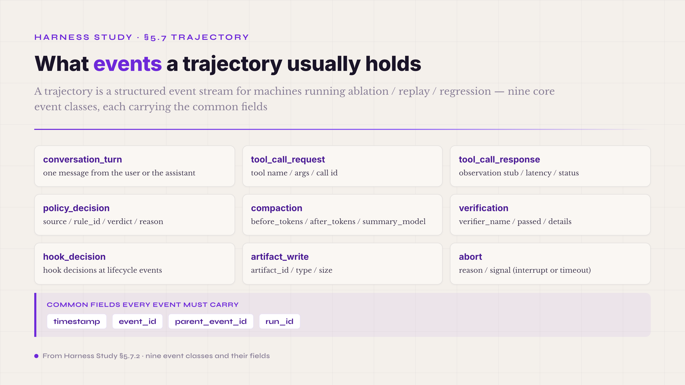

# 5.7 Trajectory · Event Stream · **P0 industry consensus · a surface with two sides, runtime + cross-run**

The seventh mechanism is what remains when a run ends: the trajectory. Every turn's thought-action-observation triple, the tool-call details, the policy verdicts, the compaction triggers, the verifier results — together they form the execution history of the run, and that history is a layer of its own. §5.6 closed on how observations and trajectories share storage; this section takes up the trajectory in its own right.

Like the observation surface, the trajectory invites a deceptively simple question: isn't this just a log? Two stacked arguments say no — the same two-argument shape that opened §5.6. Consider who reads it. Not a person. The readers are ablation tools, verifier debuggers, replay engines, and self-evolution evolvers — machines that need a structured event stream and a strict field schema, and get nothing from human-readable phrasing. A log serves the on-call engineer; a trajectory is a data asset for automated analysis. Then consider what it is for. Four engineering capabilities stand on it: ablation, replay, regression, and self-evolution. Take the trajectory away and all four fall — no switching off a mechanism to see what changes, no replaying a run to debug a verifier, no regression check on a new harness version, no history to feed an evolver. Those four together are the core closed loop of harness engineering governance.

All of that happens after the run. The trajectory also has a runtime value, and it is the one most people overlook: **it is what makes rollback possible.** Agents drift on long tasks — a batch of irrelevant observations pollutes the context, or five or six steps go down a wrong path, or the whole context slowly tilts the wrong way. An agent that cannot roll back has two bad options: push on with the pollution and drift further, or throw the task away and lose dozens of turns of work. A structured per-turn record, plus versioned artifacts, gives the harness a third option: checkpoint at every clean turn, and when a verifier or a human spots the drift, wind **the messages (the context history) and the products (the artifacts) back together to a known-good turn** and continue from there. Save and load, in effect — and it is harness controllability at its most literal. You can see where the drift began (observable), you can return there (controllable), and the run resumes after the return (closed loop): three cybernetic principles meeting in a single feature. The price is three hard requirements. Every turn's state must be addressable, or the rollback has nowhere to land. Artifacts must be versioned rather than overwritten in place, or the products cannot come back. And checkpoint granularity has to be balanced against cost — checkpointing every turn is expensive, checkpointing too sparsely leaves no good turn to return to.

Trajectory and observation relate one-to-many. The trajectory is the container, the event stream; an observation is one class of element flowing through it. Open up a single turn and you find a thought event, a tool_call_request, a tool_call_response carrying the observation, a policy_decision, and more — a mainstream taxonomy runs to 10-15 event classes, covering every structured event a turn produces. The stub/body split of §5.6 and the event taxonomy here stand in a carrying relation: one shapes a class of elements, the other provides the stream they travel in.

The industry's consensus on trajectory engineering is already strong. §5.6.6 compared the five mainstream players: SWE-agent with one JSON file per run, Claude Code with one JSONL event per line, Codex CLI with its Rollout format, LangSmith with cloud trajectories plus a UI, OpenInference with an OTel-compatible schema. What this section adds is the trajectory's own engineering — the event taxonomy, the storage formats, replayability, the OTel hookup, the common pitfalls — without re-covering the observation-trajectory ground §5.6 already walked.

The eight subsections: the fundamental difference between a trajectory and a log → the nine core event classes → single JSON vs JSONL as the two storage paths → the OTel GenAI semconv and W3C trace context anchors → replayability design → the common pitfalls (missing, redundant, non-diffable) → the trajectory as self-evolution training data → getting-started advice. The first five lay out the industry-consensus basics; the sixth dwells on the pitfalls; the seventh echoes the self-evolution infrastructure layer of §5.6.7 from the trajectory side; the eighth closes with advice along four dimensions.

#### 5.7.0 Terms first used in this section

Terms already explained in §I–§VI (schema, the trajectory concept, verifier, ablation, observation, context, OTel GenAI semconv, W3C trace context, SWE-agent, JSONL, Rollout, self-evolving agent, and so on) are not repeated below. Only the terms making their first appearance in §5.7 are listed.

**Trajectory engineering terms** — **event stream** (the physical storage form of a trajectory · a series of timestamp-ordered structured events · two mainstream shapes — JSONL with one event per line, append-friendly and stream-processable · single JSON with one file per run, easy to render and easy for human review). **event taxonomy** (the classification of event types inside a trajectory · usually 10-15 classes · covering every structured event type within a turn — conversation_turn / tool_call_request / tool_call_response / policy_decision / compaction / verification / hook_decision / artifact_write / abort, among others). **span** (an OTel concept · a unit of work over a period of time · carries start and end timestamps / status / attributes · when a trajectory hooks up to OTel, a turn usually maps to a span, and an event maps to a span attribute or a span event). **.traj** (SWE-agent's single-JSON trajectory file format · file name `<instance_id>.traj` · paired with an .html render for human inspection).

**Trajectory usage terms** — **replayability** (the property of a trajectory being replayable · the recorded model inputs and outputs stand in for calling the model again · lets ablation / verifier debugging / regression testing run without spending real LLM call budget · supported by both SWE-agent and Claude Code). **replay** (re-running the agent from trajectory data · no real model call · the engineering foundation of ablation and verifier debugging · its relation to ablation: ablation can only run on top of replay). **regression test** (comparing a new harness version against the old one for consistent results on the same set of trajectories · the core quality gate before and after harness changes · built into platforms like LangSmith and Inspect AI). **event_id and parent_event_id** (the causal-relation fields of events within a trajectory · they turn the event stream into a traceable DAG rather than a mere time series · the key engineering discipline: every event must carry both fields, or causal chains cannot be rebuilt across turns).

**Inspection tooling terms** — **Inspect AI** (an open-source agent evaluation framework from UK AISI, the UK AI Security Institute, together with Meridian Labs · GitHub under UKGovernmentBEIS · trajectory recording, replay, and ablation built in · one of the mainstream platforms for serious agent evaluation in 2026). **NexAU** (the harness substrate accompanying the AHE paper · decomposes the harness into 7 orthogonal file-level components · each git-tracked, auditable, revertible · the technical implementation that grounds observability-driven evolution in a concrete trajectory-plus-observation pipeline).

#### 5.7.1 How a trajectory differs from a log

By 2026 the line between trajectory and log is cleanly drawn, even though both are execution history written to disk. A log is unstructured text for the on-call engineer who greps keywords toward a root cause; what matters there is whether a person can read it — readability, grep-friendliness, timestamp precision. A trajectory is a structured event stream for the automated pipelines behind ablation, replay, regression, and self-evolution; what matters is whether a machine can replay it — schema stability, causal fields between events, wire-format compatibility across versions. Same disk, different worlds.

The common wrong start is writing the trajectory the way you write a log: print statements and the log4j kit — time, level, message, done. Try to run ablation on that and you stall at once. You want to switch off a mechanism and watch the behavior change, but nothing in the log is a structured mechanism event, only half-structured lines like "INFO: tool xxx called with args" that no parser can use. Try to debug a verifier and you stall the same way. You want to replay the failed turn and see where the verdict went wrong, but the log kept no complete model inputs and outputs, only the conclusion "WARN: verifier failed" — and a conclusion cannot be replayed.

The design baseline that prevents this is the replay-safe field set: each turn leaves enough data for an ablation tool to rebuild that turn's execution state in full. At minimum that means the model's complete input — system prompt, tool descriptions, conversation history, user message — and its complete output: the reasoning content, the tool_calls, the text response. Lose either and the trajectory is a log again, useful only to people. SWE-agent's .traj and Claude Code's JSONL both rest on this baseline implicitly; they can carry ablation and replay precisely because the model's inputs and outputs are kept whole inside the file.

#### 5.7.2 Event taxonomy · what events a trajectory usually holds

A trajectory is an event stream, and its events come in classes — usually 10-15 of them in a mainstream taxonomy, enough to cover every structured event a turn produces.

Nine classes recur across harnesses: **conversation_turn** (one message from the user or the assistant), **tool_call_request** (the agent asks to call a tool; carries the tool name, the args, and a call id), **tool_call_response** (the tool returns; carries the observation stub, latency, and status), **policy_decision** (the verdict from the safety control plane or a ToolPolicy-class mechanism; carries source, rule_id, verdict, and reason), **compaction** (a context compression fired; carries before_tokens, after_tokens, and summary_model), **verification** (a verifier's verdict; carries verifier_name, passed, and details), **hook_decision** (a hook's decision at a lifecycle event; same shape as policy_decision, different source), **artifact_write** (the agent writes to the persistent store; carries artifact_id, type, and size), **abort** (the agent was interrupted or timed out; carries reason and signal).

*Figure 5.19 · The nine event classes of a trajectory and the common fields*

Whatever its class, every event must carry the common fields: a **timestamp** at millisecond or microsecond precision (seconds are not enough), an **event_id**, a **parent_event_id**, and a **run_id**. The run_id keeps events sorted when files are aggregated across runs. The pair event_id / parent_event_id turns the stream from a time series into a traceable DAG, and that is what lets replay and ablation rebuild causality precisely. A question like "which tool_call_response triggered this verification failure" cannot be reconstructed from timestamps and heuristics; it needs the explicit fields. This DAG discipline, more than anything else, is what divides 2026 trajectory engineering from early log design.

#### 5.7.3 Single JSON vs JSONL · the trade-off between the two mainstream storage paths

Storage runs down two mainstream paths — a single JSON file per run, or JSONL with one event per line — and the trade-offs differ across ablation, replay, and regression.

The single-JSON representative is SWE-agent's .traj: named `<instance_id>.traj`, holding every turn's thought-action-observation triple, with an .html render for human inspection. What you get is whole-run readability — one structured document per run, convenient for batch analysis across a pile of trajectories and for human review on a single page. What you give up is appending: halfway through a run, adding an event means rewriting the entire JSON or pulling in a streaming JSON parser, which the industry generally finds more trouble than it is worth. The shape suits short runs and human review.

The JSONL representatives are Claude Code (community research into its on-disk format shows a JSONL event stream, observations as their own event type, hooks injecting at lifecycle events) and OpenAI's Codex CLI with its Rollout format. Here appending is free: events go onto the end of the file as the run proceeds, nothing gets rewritten, and analysis tools can follow progress as a stream. The cost is that no single event shows the whole; human review needs tooling that renders the JSONL into a structured view — a Threads tab, an .html. The shape suits long runs and automated pipelines.

Choosing comes down to what the harness mostly does. An evaluation harness with short runs (10-30 turns) and a human-review habit goes single JSON — the SWE-agent academic-benchmark profile. A coding-agent harness with long runs (50+ turns) and production volume goes JSONL — the Claude Code and Codex CLI profile. A harness that must serve both does what the mainstream does: JSONL persistence underneath, plus a .traj.json renderer that aggregates on request. Stream-friendly to store, review-friendly to consume.

#### 5.7.4 OTel GenAI semconv and W3C trace context · where the industry standard is converging

The standard the field is converging on is the OpenTelemetry GenAI semantic conventions. The official spec pins down the vocabulary of agent observability — span names, attribute keys, metric names, event shapes — with a SIG defining each. As of mid-2026, the LLM client spans have exited experimental status; agent spans, events, and metrics remain experimental but have held very stable through Q1 2026 practice. Four things sit in the spec's scope: LLM client spans, agent spans, events for capturing prompt and completion content, and metrics.

For trajectories, the useful part is the agent-spans framing: within one run, every tool call, LLM invocation, and retrieval step becomes a child span, and together the spans trace the complete reasoning chain. The fit with the DAG described above is direct — a span carries start_timestamp, end_timestamp, status, attributes, span_id, and parent_span_id, with the attributes holding the business data: model name, token usage, tool name, verifier verdict. So the hookup is mechanical: a turn maps to a span; an event maps to a span attribute or a span event.

Adoption has reached critical mass. The three major observability vendors — Datadog, Honeycomb, New Relic — support the OTel GenAI semconv natively, and the four major frameworks — LangChain, CrewAI, AutoGen, AG2 — either emit OTel-compliant spans themselves or plug in through instrumentation packages. That is what makes OTel the de facto common language of cross-harness, cross-vendor trajectory engineering in 2026.

One more reason the standard travels well: it shares a root with the W3C Trace Context, the web's long-mature standard for distributed tracing, which OTel extends with GenAI-specific attributes. An agent trajectory therefore plugs straight into whatever distributed-tracing pipeline a company already runs — no parallel trace infrastructure needs to be built for agents.

#### 5.7.5 Replayability design · the core capability of trajectory engineering

Everything above serves one capability: replayability — using the recorded model inputs and outputs in place of calling the model again, so that ablation, verifier debugging, and regression testing spend no real LLM call budget. Once you have it, comparing a harness before and after a change stops meaning live runs; it means rerunning the new logic over historical trajectories and diffing the output. No model calls, no token bill, no waiting on latency.

Three baselines make replay work. The first is full persistence of model inputs and outputs — §5.7.1's point: without the complete input (system prompt, tool descriptions, conversation history) and the complete output (reasoning content, tool_calls, text response), replay does not start. The second is determinism: feed the replay engine the same input and the intermediate steps it produces should match the original trajectory. That demands strict field serialization, and it rules out randomly generated object ids and every other form of hidden, non-reproducible state. The third is exposed patch points: to test a new harness version in replay, you must be able to swap a decision somewhere in the trajectory — a different verifier, a different prompt, a different tool implementation — and run forward, watching what the change does to the turns that follow. Patch points are where ablation gets its grip.

The 2026 platforms each give replay a concrete face. Phoenix (Arize) draws the trajectory: the span structure becomes a node-based call graph, sub-agent nesting visible at a glance, with Agent Replay for re-running agent interactions to debug tool calling. LangSmith does step-by-step replay with shared thread_ids; in the Claude Code integration, every turn of a session carries the same thread_id, and LangSmith's Threads tab aggregates and renders them automatically. Inspect AI, open-sourced by UK AISI, designs trajectory recording, replay, and ablation as one piece — one of the mainstream platforms for serious agent evaluation in 2026.

The frontier is where replay meets self-evolution: replay not as a debugging tool but as the apparatus on which an evolver runs its experiments. The NexAU substrate from the AHE paper is the concrete form — observability-driven evolution needs replay so that the evolver can run counterfactual experiments over historical trajectories.

#### 5.7.6 Common pitfalls · three classes

The pitfalls come in three classes: the missing trajectory, the redundant trajectory, and the non-diffable trajectory.

**Missing** is the most common. A run finishes and leaves nothing, or leaves only a summary ("run complete, 12345 tokens total, 67s elapsed"). No ablation, no replay, no regression — in effect, no trajectory. The root cause is almost always the log mindset: production runs don't need detailed logging, the thinking goes. But a trajectory is not a log; its user is the automated pipeline, and production needs the complete record more than dev does, not less. The test: hand the trajectory file to a new engineer and ask them to rebuild the run's execution state. If they cannot, the trajectory is missing.

**Redundant** is the opposite failure: everything goes in — debug intermediates, temporary variables, internal traces — until downstream analysis chokes on 50MB of JSON per run for a few KB of useful fields. The test is the ratio of file size to useful events: a 50-turn run past 5MB, most of it repeated strings and intermediate-state dumps, has crossed the red line. The countermeasure is strict classification by the event taxonomy, plus one rule: no debug logging at the trajectory layer. Debug state gets its own log channel and stays out of the trajectory.

**Non-diffable** is the most hidden. Random ids in the fields, timestamps at nanosecond precision, floats serialized without a fixed rule — and the same set of tasks run twice produces two files whose diff is a pile of false positives. Regression testing dies here: the ground-truth trajectory and the new version's trajectory always differ, and nobody can tell a real regression from noise. The countermeasure splits the fields in two — stable fields (model name, tool name, decision verdict, the event_id causal chain: business facts) and volatile fields (timestamps, random ids, latency: environment state) — and the regression diff reads only the stable ones. This split is the infrastructure precondition for regression testing that means anything.

A fourth pitfall hides behind these three, kin to the PII pitfall of §5.6.5: persisting the trajectory without redaction, so credentials, PII, and API keys land in trajectory files and survive across runs. The OTel GenAI semconv treats PII tracing as an engineering topic of its own, and the industry consensus is firm: a redaction hook runs before the trajectory is written out, not as a cleanup afterwards. Note where the trajectory sits — an observation enters the context inside a turn, but a trajectory enters a file after the run and persists across turns. One layer deeper, so the redaction must come earlier.

#### 5.7.7 The trajectory as self-evolution training data

Seen cross-run, the trajectory plays the role §5.6.7 gave the observation surface: the input-side infrastructure of self-evolution. Beyond carrying ablation, replay, and regression, it is the concrete thing a self-evolving agent trains on.

The formalization is already in the literature. AHE (Agentic Harness Engineering)[^ahe-2026] feeds historical trajectories straight into its evolver loop to optimize harness configuration (the concrete Terminal-Bench 2 gains were given back in the observation section). AgentHER[^agent-her-2026] makes the conversion explicit — Hindsight Experience Replay for LLM Agent Trajectory Relabeling, a four-stage pipeline (failure classification, outcome extraction, LLM-guided prompt relabeling, data packaging) that turns raw history into trainable labeled data automatically. AgentEvolver[^agent-evolver-2026] generates its own tasks by self-questioning, and MemGen[^memgen-2026] works on generative latent memory — both on the path where the agent's self-generated experience becomes its own improvement signal, easing the dependence on human labeling.

Training on trajectories adds demands of its own. Schema stability across runs and versions: rename the trajectory fields in a harness upgrade, and the old trajectories can no longer feed the new evolver — a schema-migration discipline the industry is still working out. Explicit outcome attribution: the end of the trajectory must say plainly whether the run passed or failed and which turns held the key decisions, or the evolver cannot sort the positive examples from the negative ones. Finally, a trajectory needs its task's ground truth stored alongside it: without that pairing, the data supports only unsupervised exploration, never supervised optimization.

Locally, the carrier of this training-data role is the same set of internal harness components the previous section introduced — the four-state MechanismEvent, absence-of-event, decision-point, ObservationPack. The trajectory schema feeds the current inference and the harness's cross-run self-evolution loop at once. And as in the observation section: this is the harness's own capability. The meta-workbench above it (the Harness Lab workbench) is an advanced option for consuming trajectories, not a prerequisite.

#### 5.7.8 Getting started · four dimensions

**What to watch:** the trap is the log mindset, and four metrics keep you honest. Can a new engineer rebuild the run's execution state from the file? If not, the trajectory is missing. How does file size compare to useful events? A 50-turn run past 5MB of mostly repeated strings is redundant. Are the fields split into stable and volatile? Without the split, you are sitting on a non-diffable hazard. Does a PII-redaction hook run before persistence? Without one, credentials leak across runs. Design the replay-safe field set on day 1 rather than patching a log-shaped trajectory later — a schema change after launch drags the historical data through a migration, and that is expensive.

**How to design:** take the mainstream 10-15-class event taxonomy (with the core nine present: conversation_turn, tool_call_request, tool_call_response, policy_decision, compaction, verification, hook_decision, artifact_write, abort) and put the four common fields on every event: timestamp, event_id, parent_event_id, run_id. Choose storage by run length — short runs with human review take the SWE-agent .traj single-JSON path; long runs at production volume take the JSONL path of Claude Code and Codex CLI. Follow OTel if you want out of vendor lock-in, since the GenAI semconv is where 2026 is converging: a turn maps to a span, an event to a span attribute or a span event. If the goal is a self-evolution-ready trajectory, make the outcome-attribution fields and the stable fields explicit at schema-design time, and keep the wire format compatible across versions.

**How to test:** measure quality along the industry's three trajectory-evaluation dimensions — grounding and context use (was the context the model saw relevant to the actual task), user-experience quality (can a human reviewer follow the agent's reasoning in the rendered trajectory), and security and safety (any PII leaks, any credentials with no business being there). Schema validation is the engineering base of regression testing: it catches structural regressions without requiring exact output matches. The concrete methods: run the replay engine and confirm the same trajectory replays to the same result; run schema diffs to confirm field stability across harness versions; measure PII-redaction coverage by injecting known PII through synthetic data and checking it gets caught at persistence; and run OTel compatibility tests — the trajectory should export whole to collectors like Datadog, Honeycomb, and New Relic.

**What to put in the prompt:** three trajectory disciplines belong in the agent's system prompt, stated outright. First: "tool calls go through structured tool_call — never describe a tool call in prose," so the tool_call_request and tool_call_response events come out structured. Second: "never fabricate tool results — the tool_call and tool_result pairs in the history are real; when you need a fresh result, call the tool," which is the other face of the history-side no-downgrade rule of §5.5.5: one integrity discipline, seen from two sides. Third: "at a decision point, give the reason, not just the action," so the agent marks its grounds in the reasoning content and the trajectory's decision points carry more information than its execution points. These pair with the prompt-asset disciplines of §5.5; with them, the agent produces trajectories ready for self-evolution, not merely trajectories that run.

---

A file the agent leaves behind when the run ends — that is what the trajectory looks like. What it actually is, is the physical carrier of the core closed loop of harness engineering governance: ablation, replay, regression, self-evolution. Remove the structured trajectory and the four collapse together — no switching off a mechanism to see the difference, no replaying a run to debug a verifier, no regression check on a new harness version, no history for the evolver. The OTel GenAI semconv is the common language 2026 is converging on, and wiring the trajectory to OTel is the steadiest road to vendor-neutral harness engineering. The eight subsections of this chapter, taken together, are the full map of trajectory engineering.

---

## Footnotes

[^ahe-2026]: Agentic Harness Engineering: Observability-Driven Automatic Evolution of Coding-Agent Harnesses · arxiv 2604.25850 · Lin / Liu / Pan et al. (Fudan + PKU + Qiji Zhifeng, 11 authors) · 2026 · preprint
[^agent-her-2026]: AgentHER: Hindsight Experience Replay for LLM Agent Trajectory Relabeling · arxiv 2603.21357 · Alibaba · Liang Ding · 2026 · preprint
[^agent-evolver-2026]: AgentEvolver · arxiv 2511.10395 · Tongyi-Alibaba (13 authors) · 2026 · preprint
[^memgen-2026]: MemGen: Generative Latent Memory · arxiv 2509.24704 · NUS · ICLR 2026
