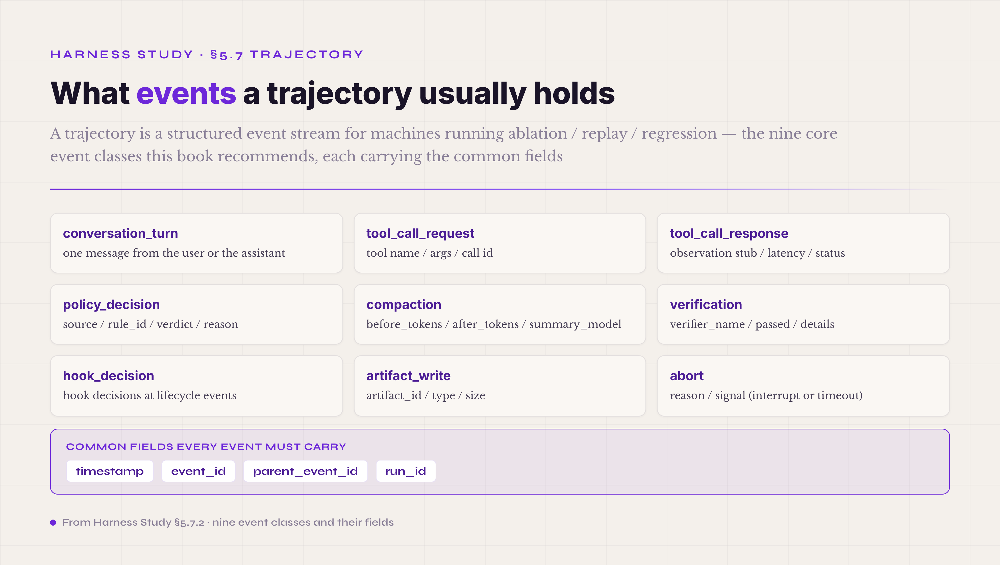

# 5.7 Trajectory · Event Stream · **P0 · two sides: runtime and cross-run**

The seventh mechanism is the execution history an agent leaves behind when a run ends: every turn's thought-action-observation triple, plus the tool-call details, the policy verdicts, the points where context compaction fired, and the verifier results. Together these records form a layer of their own, the trajectory. The end of §5.6 already covered how observations and trajectories are stored together. This section is about how to design and manage the trajectory itself.

Why is a trajectory not just a log? The answer has two parts, as it did for observation in §5.6.

- **The first argument comes from the readers.** The main readers of a trajectory are not people. They are ablation tools, verifier debuggers, replay engines, and the evolvers that drive self-evolution. They read a trajectory through its structured event stream and strict field schema, not by understanding it the way a person would. So a trajectory file is not a log for the on-call engineer. It is a data asset for automated analysis.
- **The second argument comes from what the trajectory is for.** It underpins four engineering capabilities: ablation, replay, regression testing, and self-evolution. Without a trajectory, you can't ablate a mechanism and see how the agent's behavior changes, you can't replay a run to debug a verifier, you can't check whether a new harness version has regressed, and you have no historical trajectories to feed the evolver. Together, these four capabilities form the core closed loop for improving a harness.

All four of these uses come **after** the run. The trajectory also has a **runtime** value that is often overlooked: **it is what makes it possible for an agent to roll back.** On long tasks, agents drift sooner or later. A batch of irrelevant observations pollutes the context, the agent follows a wrong path for five or six steps, or the whole context tilts in the wrong direction. Without rollback, the agent is left with two bad options: carry on with the pollution and drift further, or start the whole task over and throw away dozens of turns. With the structured per-turn record in the trajectory, plus versioned artifacts, the harness can save a checkpoint at every clean turn. When a verifier or a person notices the drift, the harness can roll **the messages (the context history) and the products (the artifacts) back together to a correct turn** and continue from there.

This rollback capability is a direct expression of the harness's controllability. Three terms borrowed from cybernetics apply here, in their engineering sense (§IX covers them in detail). The harness is observable, because the trajectory shows which turn the drift started from. It is controllable, because it can go back to that turn. And it is closed-loop, because the run carries on after the return. All three hold at once in this one feature. In engineering terms, rollback has three hard requirements:

1. Every turn's state in the trajectory must be addressable, so that a rollback can target a specific turn.
2. Artifacts must be versioned rather than overwritten in place; otherwise the products cannot be rolled back.
3. Checkpoint granularity must be balanced against rollback cost: checkpointing every turn is expensive, and checkpointing too sparsely leaves no suitable turn to return to.

Trajectory and observation relate one-to-many. The trajectory is the container, an event stream; an observation is one kind of element in that stream. A single turn holds a thought event, a tool_call_request event, a tool_call_response event (which carries the observation), a policy_decision event, and so on. The event taxonomy this book recommends has 9 core classes, and a full implementation usually has 10–15, covering every structured event within a turn. The taxonomy works together with the stub/body split of the observation surface in §5.6: the trajectory holds the events, the observation's stub is the content of one event class, and the body is stored separately.

§5.6.6 already compared the main trajectory implementations. SWE-agent uses a single JSON file. Claude Code, according to public analyses, uses JSONL with one event per line. Codex CLI uses its Rollout format, LangSmith uses cloud-hosted trajectories plus a UI, and OpenInference uses an OTel-compatible schema. This section focuses on the design of the trajectory itself: the event taxonomy, storage formats, replayability, the connection to OTel, and anti-patterns. It does not repeat what §5.6 said about how observation and trajectory work together.

The eight subsections that follow cover, in order: the fundamental difference between a trajectory and a log; the event taxonomy (9 core classes); single JSON and JSONL as two storage paths; the OTel GenAI semantic conventions and W3C Trace Context; replayability design; anti-patterns (missing, redundant, and non-diffable trajectories); the trajectory as a data source for self-evolution; and getting-started advice. The first five subsections lay the groundwork for trajectory design. The sixth covers anti-patterns. The seventh echoes §5.6.7 and looks at self-evolution from the trajectory's side. The eighth gives getting-started advice in four areas.

#### 5.7.0 Terms first used in this section

Terms already explained in §I–§IV and §5.1–§5.6 (schema, the trajectory concept, verifier, ablation, observation, context, OTel GenAI semantic conventions, W3C Trace Context, SWE-agent, JSONL, Rollout, self-evolving agent, and so on) are not repeated. Only the terms that first appear in this section are listed here.

**Trajectory design terms**

- **event stream**: the storage form of a trajectory, a series of structured events ordered by timestamp. It commonly takes one of two shapes. JSONL puts one event on each line, which makes it easy to append to and lets it be processed as a stream. A single JSON file holds one run, which makes it easy to render and to review by hand.
- **event taxonomy**: the classification of the event types in a trajectory. The naming this book recommends has 9 core classes: conversation_turn, tool_call_request, tool_call_response, policy_decision, compaction, verification, hook_decision, artifact_write, and abort. A full implementation usually has 10–15 classes.
- **span**: an OpenTelemetry concept, one unit of work over a period of time, with start and end timestamps, a status, and attributes. When a trajectory connects to OTel, a turn usually maps to a span, and an event usually maps to a span attribute or a span event. Note that this book's trajectory is a persisted event stream, while an OTel trace is a tree of spans emitted directly by instrumentation. The two can be mapped onto each other, but they are not the same thing.
- **.traj**: SWE-agent's single-JSON trajectory file format, named `<instance_id>.traj`, paired with an .html render for human inspection.

**Trajectory usage terms**

- **replayability**: using the model inputs and outputs recorded in the trajectory in place of calling the model again, so that ablation, verifier debugging, and regression testing spend less of the real model-call budget. Mind its limit: replay can reproduce a run only up to the **fork point**. Once new logic makes some step's input differ from the recording (a changed prompt, a changed tool implementation, a changed verifier), the model faces input the recording never saw from that step on. The turns after it must either call the model again or stand in for it with the recorded responses (a mock that returns the recorded result by matching on input, which only works while the input is unchanged).
- **replay**: driving a run forward again from trajectory data. Before the fork point it calls no real model, which makes it the basic tool for ablation and verifier debugging. An ablation changes some mechanism and usually produces a fork quickly, so replay saves the calls before the fork point but not the ones after it.
- **regression test**: checking whether the old and new versions of a harness produce consistent results on the same set of tasks. It is the quality gate before and after a harness change.
- **event_id and parent_event_id**: the fields that record causal relations between events in a trajectory. They make the event stream a traceable directed acyclic graph (DAG) rather than a mere time series. Every event needs both fields, or causal chains cannot be rebuilt across turns.

**Evaluation tool terms**

- **Inspect AI**: an open-source agent evaluation framework developed jointly by the UK AI Security Institute (AISI, renamed from the AI Safety Institute on 2025-02-14) and Meridian Labs. Its GitHub repository sits under UKGovernmentBEIS. It records a log for every evaluation, in which you can inspect each sample's messages and tool calls one by one. It is one of the commonly used open-source evaluation frameworks.
- **NexAU**: the harness substrate that accompanies the AHE paper. It splits the harness into 7 kinds of relatively independent, file-level components, each tracked in git, auditable, and revertible. It is the implementation that takes AHE's idea of "using run data to drive harness improvement" down to a concrete trajectory and observation pipeline.

#### 5.7.1 How a trajectory differs from a log

A trajectory and an ordinary log are both execution history written to disk, but they serve different purposes. A log is an unstructured text stream for the on-call engineer who greps for keywords to find a root cause. A trajectory is a structured event stream for the automated pipelines that run ablation, replay, regression testing, and self-evolution. Their engineering requirements are therefore completely different. An ordinary log cares whether a person can read it: readability, grep-friendliness, timestamp precision. A trajectory cares whether a machine can replay it: a stable schema, causal fields between events, and a field serialization format that stays compatible across versions.

Writing the trajectory the way you write a log is a common wrong start. The most typical form is print statements or the log4j kit: time, level, message, and that's it. A trajectory like that makes ablation impossible. You want to ablate a mechanism and see how the agent's behavior changes, but the log has no structured mechanism events, only half-structured lines like "INFO: tool xxx called with args" that no machine can parse. It makes verifier debugging impossible too. You want to replay a failed turn and see which step of the verifier went wrong, but the log keeps no complete record of the model's inputs and outputs, only a conclusion like "WARN: verifier failed", and a conclusion cannot be replayed.

The basic requirement of trajectory design is a set of replayable fields: every turn must leave enough data for an ablation tool to rebuild that turn's execution state in full. At minimum, that means two parts:

- **The model's complete input**: the system prompt, tool descriptions, conversation history, and user message;
- **The model's complete output**: the reasoning content, tool_calls, and text response.

Lose either part and the trajectory degrades into a log that only people can use. Storing the complete input every turn makes the file grow quickly. Fortunately, most of each turn's input repeats the previous turn's input as a prefix, so prefix deduplication or storing only the increments keeps the size under control (see the discussion of redundancy in §5.7.6).

#### 5.7.2 Event taxonomy: what events a trajectory usually holds

A trajectory is an event stream, and its events fall into classes. A full implementation usually has more than ten, covering every structured event within a turn.

Below are the 9 core classes this book recommends (the names are this book's suggestion; each harness names things its own way, but most have an equivalent):

1. **conversation_turn**: one message from the user or the assistant.
2. **tool_call_request**: the agent asks to call a tool; includes the tool name, arguments, and call id.
3. **tool_call_response**: the tool returns; includes the observation stub, latency, and status.
4. **policy_decision**: the verdict of a mechanism such as the Safety control plane or ToolPolicy; includes the source, rule id, verdict, and reason.
5. **compaction**: a context compaction fired; includes the token counts before and after compaction and the model used to generate the summary.
6. **verification**: a verifier's verdict; includes the verifier name, whether it passed, and details.
7. **hook_decision**: a hook's decision at a lifecycle event; it has the same structure as policy_decision, and only the source differs.
8. **artifact_write**: the agent writes to persistent storage; includes the artifact_id, type, and size.
9. **abort**: the agent is interrupted or times out; includes the reason and signal.

*Figure 5.19 · The nine event classes of a trajectory and the common fields*

Every event must carry a few common fields:

- **timestamp**: millisecond or microsecond precision, never just seconds;
- **event_id**: a unique identifier for this event;
- **parent_event_id**: this event's causal parent, which makes the event stream a traceable DAG rather than a mere time series;
- **run_id**: the run this event belongs to.

The run_id keeps events from getting mixed up when they are aggregated across trajectory files. The event_id and parent_event_id let replay and ablation rebuild causal chains precisely. A causal question such as "which tool_call_response caused this verification failure" can't be guessed from timestamps and heuristic rules; it needs explicit fields. Designing the stream as a DAG is the key difference between a trajectory and early log design.

#### 5.7.3 Single JSON vs JSONL: the trade-off between two storage paths

Trajectory storage follows two main paths: a single JSON file (one per run) and JSONL (one event per line). Each has its trade-offs across ablation, replay, and regression testing.

The representative of single JSON is SWE-agent's .traj file. Named `<instance_id>.traj`, it holds every turn's thought-action-observation triple and comes with an .html render for human inspection. Its strength is whole-run readability. The entire run is one structured document, which suits batch analysis over a set of trajectories during ablation, and suits human review, where the whole run renders into one .html page. Its weakness is that it is hard to append to. Halfway through a run the trajectory is only half written, and adding a new event means rewriting the entire JSON or using a streaming JSON parser (which many people find too much trouble). So single JSON fits short runs and human review better.

The representatives of JSONL are Claude Code (according to public analyses, it uses a JSONL event stream, treats observations as their own event type, and uses hooks to inject at specific lifecycle events) and OpenAI's Codex CLI (the Rollout file format). JSONL's strengths are easy appending and stream processing. While a run is in progress, each event goes straight onto the end of the file without rewriting the whole thing, and analysis tools can follow the run's progress as a stream. Its weakness is that a single line shows nothing of the whole: human review needs a tool that renders the JSONL into a structured view (such as LangSmith's Threads tab, or an .html page). So JSONL fits long runs and automated pipelines better.

The choice depends on what the harness is mainly for. An evaluation harness whose runs are generally short (10–30 turns, a rule of thumb) and need human review should use single JSON, which fits academic benchmark settings like SWE-agent. A coding-agent harness whose runs are generally long (50+ turns, a rule of thumb) and whose production volume is high should use JSONL, which fits production tools like Claude Code and Codex CLI. If a harness has to serve both purposes, one common approach is to persist JSONL underneath and add a renderer that aggregates it into a .traj.json on request. Storage stays stream-friendly, and consumers still get a whole run to review.

#### 5.7.4 OTel GenAI semantic conventions and W3C Trace Context

Many vendors and frameworks are moving toward the OpenTelemetry GenAI semantic conventions. The conventions give agent observability a shared vocabulary: span names, attribute keys, metric names, and event shapes are all being defined by an OTel special interest group (SIG). As of mid-2026, the conventions as a whole are still at Development status (the lowest level in OTel's current maturity scheme, which replaced the older "experimental" label). Neither the client spans nor the agent spans, events, and metrics have a stable version yet, and agent spans were still taking breaking changes in the first half of 2026 (the split of the invoke_agent span, for example). Connecting to OTel is the right direction, but design on the assumption that the conventions will change. This is the same principle as versioning the trajectory's own schema. The conventions cover four parts: LLM client spans, agent spans, events for recording prompt and output content, and metrics.

The agent-span part gives trajectory design a concrete approach. Within one run, every tool call, every model call, and every retrieval step becomes a child span, and the spans of the whole run make up the complete reasoning chain. OTel's span abstraction corresponds directly to the event_id and parent_event_id DAG described earlier. A span has start and end timestamps, a status, attributes, a span_id, and a parent_span_id, and its attributes carry the trajectory's business data (model name, token usage, tool name, verifier verdict, and so on). Connecting a trajectory to OTel therefore comes down to this: a turn maps to a span, and an event maps to a span attribute or a span event.

On adoption, observability vendors such as Datadog, Honeycomb, and New Relic already support the OTel GenAI semantic conventions. Frameworks such as LangChain, CrewAI, AutoGen, and AG2 can emit OTel-compliant spans natively or connect through instrumentation packages. This is turning OTel into a common interface for exchanging trajectory data across harnesses and vendors.

The OTel GenAI semantic conventions and W3C Trace Context are two separate layers, and they do not share an origin. W3C Trace Context is a request-header format for passing trace identifiers between services, and distributed tracing has used it for years. The GenAI semantic conventions are OTel's own attribute-naming conventions for generative AI. The first governs how a trace identifier is passed from service to service; the second governs what the attributes on a span are called. Used together, they let an agent's trajectory plug straight into a company's existing distributed-tracing pipeline, with no separate tracing infrastructure built just for agents.

The 9 event names recommended in §5.7.2 are internal names and do not match the names in the OTel semantic conventions one for one, so a mapping table has to connect the two. When nobody maintains that table, the internal event names drift further from the conventions with each release, and the fields no longer line up when events are exported to an observability platform. Appendix F records this as anti-pattern AP19: OTel Naming Drift.

#### 5.7.5 Replayability design: the core capability of a trajectory

The core capability of a trajectory is replayability: using the recorded model inputs and outputs in place of calling the model again, so that ablation, verifier debugging, and regression testing spend less of the real model-call budget. With it, comparing a harness before and after a change can become a matter of rerunning the new logic over historical trajectories and looking at how the output differs. At least up to the fork point, you don't have to call the real model every time, spend tokens, or wait on latency.

Replayability design has three basic requirements:

1. **Full persistence of model inputs and outputs.** As §5.7.1 explained, the trajectory must keep the complete system prompt, tool descriptions, and conversation history, along with the model's output (reasoning content, tool_calls, text response). If any one of these is missing, replay cannot even start.
2. **Deterministic replay.** Given the same recorded data, the replay engine should produce intermediate steps that match the original trajectory. This requires strict serialization of the trajectory fields, with no hidden, non-reproducible state such as randomly generated object ids.
3. **Exposed substitution points.** To test a new harness version in replay, you must be able to swap a decision at some point in the trajectory (a different verifier, a different prompt, a different tool implementation) and run on from there, watching how the new logic affects the turns that follow. This step has a clear limit: the substitution point is the fork point. From there on, the model sees input that differs from the recording, so the recorded responses no longer match. Later turns must either call the model again or use recorded responses as a mock (which only works for calls whose input has not changed). Substitution-point design is therefore the foundation of ablation, but replay saves only the calls before the fork point.

The main platforms each handle replayability in their own way. Phoenix (Arize) visualizes the agent's call graph: it renders the trajectory's span structure as a node graph in which the nesting of sub-agents is visible at a glance, and pairs this with Agent Replay for replaying agent interactions and debugging tool calls. LangSmith offers step-by-step replay and shared thread_ids. For example, every turn of the same session is tagged with the same thread_id, and the Threads tab aggregates and renders them automatically. Inspect AI (developed jointly by AISI and Meridian Labs) records a complete log for every evaluation, which makes each entry easy to inspect and review.

What is still evolving is how replay works with self-evolution. Replay is more than a debugging tool; it can also lower the cost of the experiments an evolver runs. The NexAU substrate from the AHE paper is one example. There, the evolver has to compare different harness configurations over historical trajectories: replay can reuse the part before the fork point, but everything after the fork still has to run for real.

#### 5.7.6 Anti-patterns: missing, redundant, and non-diffable trajectories

Trajectory design has three common anti-patterns: the missing trajectory, the redundant trajectory, and the non-diffable trajectory.

**A missing trajectory** is the most common. A run finishes and leaves no trajectory, or leaves only a summary-level record ("run complete, 12345 tokens used, 67s elapsed"). A trajectory like that rules out ablation, replay, and regression testing alike, which makes it as good as no trajectory at all. The usual root cause is that engineers treat the trajectory as a log and assume production runs don't need such a detailed record. But a trajectory is not a log. Its users are automated pipelines, and production needs a complete trajectory even more than development does. The test: can a new engineer rebuild the whole run's execution state from the trajectory file? If not, the trajectory is missing.

**A redundant trajectory** is the opposite extreme: everything goes into the trajectory, including intermediate state kept for debugging, temporary variables, internal traces, and so on. The problem is that downstream analysis can't keep up. An ablation tool has to parse 50MB of JSON to read one run, when the truly useful fields come to a few KB. The test is the ratio of trajectory file size to the number of useful events. If a 50-turn run's trajectory exceeds 5MB (rule of thumb; adjust to your scenario) and most of it is repeated strings and intermediate-state dumps, it is already redundant.

Keep this separate from the requirement in §5.7.1. The complete model input must be saved and does not count as redundancy; redundancy means content such as debug dumps that is useless for replay and analysis. Control the size of the complete input itself with prefix deduplication or by storing only increments, and don't delete required fields to make the file smaller. The countermeasure is strict classification by the event taxonomy and no debug logging at the trajectory layer: debug state goes through a separate log channel and stays out of the trajectory.

**A non-diffable trajectory** is the hardest to spot. The fields contain random ids, timestamps with too much precision (nanoseconds), and floats serialized without a fixed rule. When the same set of tasks runs twice, diffing the two trajectory files turns up a pile of spurious differences. That defeats regression testing entirely: the baseline trajectory and the new version's trajectory always differ, and engineers can't tell a real regression from noise. The countermeasure is to split the trajectory fields into two kinds:

- **Stable fields**: business facts such as the model name, tool name, verdicts, and the event_id causal chain;
- **Volatile fields**: environment state such as timestamps, random ids, and latency.

The regression-test diff compares only the stable fields and ignores the volatile ones. This is the precondition for doing trajectory regression testing properly.

Once the diff classification is right, the last step is wiring it into CI. Pick a set of baseline tasks and store their trajectories in the repository. On every harness change, rerun those tasks with replay and diff only the stable fields; that is the harness's own regression test. The turn the change affects is the fork point. The turns after it must call the model again (or, for calls whose input has not changed, use recorded responses as a mock), and the diff should be read from the fork point on. Change the compaction strategy, and the diff tells you which turns assembled their context differently. Change the ToolPolicy, and the diff tells you which calls flipped from allowed to blocked. Without this step, the scope of every harness change is left to an engineer's guesswork. With it, the scope is a readable list of differences in the CI output.

One more anti-pattern is easy to miss, and it is the same problem as the unredacted observations of §5.6.5: the trajectory is persisted without redaction, so any credentials, PII, or API keys that reach a trajectory file are kept across runs. The OTel GenAI semantic conventions likewise treat the capture of prompt and output content as a sensitive item and handle it separately. A common practice is to attach a redaction hook before the trajectory is written out. The trajectory's entry point sits one layer deeper than the observation's. An observation enters the context within a turn, while a trajectory is written to a file after the run ends and kept across turns. So redaction must happen before the trajectory is written out; it cannot be cleaned up afterward.

#### 5.7.7 The trajectory as a data source for self-evolution (including harness optimization and model training)

Seen across runs, the trajectory plays the same role as the observation surface in §5.6.7: it is a data source for self-evolution. Beyond underpinning ablation, replay, and regression testing, it is the concrete data a self-evolving agent uses to optimize the harness, and even to train models.

Several research efforts have already turned this into concrete methods. The evolver loop of AHE (Agentic Harness Engineering)[^ahe-2026] reads historical trajectories directly to optimize the harness configuration (§5.6 gives the concrete gains on Terminal-Bench 2). AgentHER[^agent-her-2026] (the paper is titled "Hindsight Experience Replay for LLM Agent Trajectory Relabeling") goes into more detail. A four-stage pipeline (failure classification, outcome extraction, LLM-guided prompt relabeling, and data packaging) automatically turns historical trajectories into trainable labeled data. AgentEvolver[^agent-evolver-2026] generates its own tasks through self-questioning, and MemGen[^memgen-2026] uses generative latent memory. Both follow the path in which the agent uses its own generated experience as a signal for self-evolution, which reduces the dependence on human labeling.

Using trajectories as data for self-evolution puts a few extra requirements on trajectory design:

1. **A stable schema, so that trajectories stay comparable across runs and versions.** If a harness upgrade renames fields, the old trajectories can no longer feed the new evolver. Practice for this kind of schema migration is still evolving.
2. **Explicit outcome attribution.** The end of the trajectory must state plainly whether this run passed or failed and which turns were the key decision points. Otherwise the evolver cannot tell which trajectories are positive examples and which are negative.
3. **Trajectories stored together with the task's ground truth.** Self-evolution needs each trajectory paired with the ground truth of its task. An unpaired trajectory supports only unsupervised exploration, not supervised optimization.

Schema stability, the first requirement, can't rest on good intentions alone; it needs a concrete mechanism. Every trajectory carries a trajectory_schema_version field. The schema evolves only by adding fields, never by deleting fields or changing what they mean (new fields get default values). Consumers pick a reader by version number: an old reader ignores the new fields when it reads a new file, and a new reader fills in defaults when it reads an old one. When is a breaking change allowed? The answer is close to "never." Better to introduce a v2 event type and write both in parallel for a while than to let six-month-old trajectories become dead data that nothing can read. They are the most expensive asset you have accumulated.

The data-source role is carried by the set of internal harness components described in §5.6.8. The four-state MechanismEvent has each mechanism report one of four states on every check: Activated, Skipped, Blocked, or Error. Absence-of-event treats an event that should have been emitted but never appeared as a sign that the mechanism is not wired in at runtime. Decision-point records capture "why" at the place where a decision is made, not just "what was done." ObservationPack is the author's concrete implementation of the stub/body split. With these in place, the trajectory can both feed the current inference and supply data to the harness's cross-run self-evolution loop. As with the observation surface, this is a capability of the harness itself. The outer workbench above it (Harness Lab, §VII) is only an advanced option for consuming trajectories, not a prerequisite.

#### 5.7.8 Getting started: four areas

**What to watch:** the biggest pitfall in trajectory design is writing the trajectory as a log. Check it against four indicators:

1. Can a new engineer rebuild the whole run's execution state from the trajectory file? If not, the trajectory is missing.
2. What is the ratio of trajectory size to useful events? A 50-turn run over 5MB (a rule of thumb) that is mostly repeated strings is redundant.
3. Are the trajectory fields split into stable and volatile? If not, the trajectory is at risk of being non-diffable.
4. Does a PII-redaction hook run before the trajectory is persisted? If not, credentials are at risk of leaking across runs.

Design the trajectory around the replayable field set from day one; don't start by writing it to a log's standard. Changing the trajectory schema after launch means migrating historical data, which is expensive.

**How to design:**

- Start the event taxonomy from the 9 core classes this book recommends (conversation_turn, tool_call_request, tool_call_response, policy_decision, compaction, verification, hook_decision, artifact_write, abort); a full implementation usually extends it to 10–15 classes. Every event carries four common fields: timestamp, event_id, parent_event_id, and run_id.
- Choose the storage format by run length. Short runs that need human review take the single-JSON path of SWE-agent's .traj. Long runs at high production volume take the JSONL path (Codex CLI's Rollout format and Claude Code's JSONL are both examples).
- Control the size of the complete model input with prefix deduplication or by storing only increments.
- The OTel GenAI semantic conventions are still being defined. To avoid vendor lock-in, follow OTel: a turn maps to a span, and an event maps to a span attribute or a span event.
- If the goal is a trajectory that can support self-evolution, make the outcome-attribution fields and the stable fields explicit when you design the schema, and keep the field serialization format compatible across versions.

**How to test:** check trajectory quality along three dimensions. Context relevance: how relevant is the context the model saw in the trajectory to the actual task? Human-review experience: when the trajectory is rendered, can a person follow the agent's reasoning? Security: does the trajectory leak any PII, or hold credentials that shouldn't be there? Schema validation is the basis of regression testing: it catches structural regressions without requiring the output to match word for word. The concrete methods:

- Verify replayability with the replay engine: the same trajectory replayed twice gives the same result;
- Run a schema diff to verify that fields stay stable across harness versions;
- Measure PII-redaction coverage: inject known PII through synthetic data and check whether it is caught when the trajectory is persisted;
- Run OTel compatibility tests: check whether the trajectory exports in full to OTel collectors such as Datadog, Honeycomb, and New Relic.

**What to put in the prompt:** the system prompt should tell the agent explicitly about a few trajectory-related behaviors:

1. "Tool calls must use a structured tool_call; never describe a tool call in prose." This tells the agent that events such as tool_call_request and tool_call_response must come out in structured form.
2. "Never fabricate tool results. The tool_call and tool_result pairs in the history are real; if you need a new result, call the tool." §5.5.5 on message boundaries and history integrity says that tool_calls in the history are never downgraded. That rule and this one are two sides of the same trajectory-integrity requirement.
3. "At a decision point, state your reason, not just what you did." This makes the agent write out the grounds for its decisions in its reasoning content. Only then do the trajectory's decision-point records (why it acted) carry different information from its execution-point records (what it did).

These three instructions work together with the prompt-asset management rules in §5.5 Prompt Assets, so that the trajectories the agent produces are not merely runnable but usable for self-evolution.

---

A trajectory looks like an engineering detail: a file the agent leaves behind after a run. Its real place is as the data carrier for the core closed loop of harness improvement: ablation, replay, regression testing, and self-evolution. Without a structured trajectory, you can't ablate a mechanism to see the difference, can't replay a run to debug a verifier, can't check whether a new harness version has regressed, and can't feed historical data to the evolver. All four capabilities are lost at once. The OTel GenAI semantic conventions are still being defined, but connecting the trajectory to OTel is a safe path toward a harness that isn't tied to any vendor. Taken together, the eight subsections of this section give the full picture of trajectory design.

---

## Footnotes

[^ahe-2026]: Agentic Harness Engineering: Observability-Driven Automatic Evolution of Coding-Agent Harnesses · arxiv 2604.25850 · Lin / Liu / Pan et al. (Fudan + PKU + Qiji Zhifeng, 11 authors) · 2026 · preprint
[^agent-her-2026]: AgentHER: Hindsight Experience Replay for LLM Agent Trajectory Relabeling · arxiv 2603.21357 · Alibaba · Liang Ding · 2026 · preprint
[^agent-evolver-2026]: AgentEvolver · arxiv 2511.10395 · Tongyi-Alibaba (13 authors) · 2026 · preprint
[^memgen-2026]: MemGen: Generative Latent Memory · arxiv 2509.24704 · NUS · ICLR 2026
