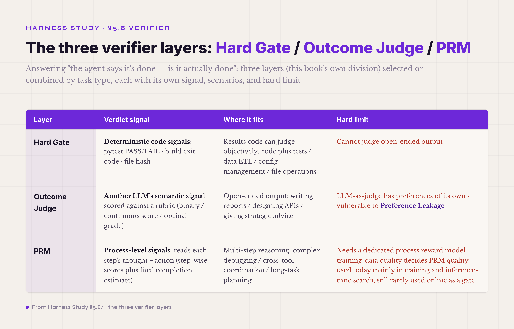
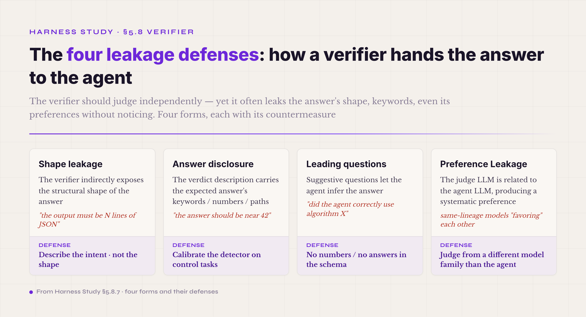

# 5.8 Verifier · three layers · **P0 · the engineering foundation against false completion claims**

The eighth mechanism is the verifier: the mechanism that independently judges whether a step, or a whole task, the agent has finished actually meets the bar. §5.7 ended by describing the trajectory as the data carrier for four capabilities: ablation, replay, regression testing, and self-evolution. But a trajectory is only data. Before that data can become an engineering conclusion, "the agent got this right" or "the agent got this wrong," it has to pass through the verifier. The verifier is an unusual component in a harness. It does not help the agent finish the task directly. It answers a single question: the agent says it's done, but is it?

Why make the verifier a separate mechanism? Because agent engineering faces a basic problem: **models are good at describing an unfinished task as if it were finished.** The cause lies in how a model works. It generates the most likely next piece of text given its context. Reports like "I've fixed it" and "the tests pass" are extremely common in training data and in conversations, and the preference feedback used in training often rewards answers that sound complete and confident. When the model writes such a report, it does not automatically check the actual state of the outside world. In writing, conversation, or translation this is not a big problem, because the reader is a person who can judge the result directly. In engineering tasks, such as calling tools, writing code, or running an analysis, it becomes a systemic risk. The agent finishes a task and reports "I fixed the bug," "I got the test passing," or "I finished the report," while in fact the bug is still there, the test still fails, and the report is missing key logic. The longer the task, the more intermediate steps go wrong, and a self-report does not check what those steps actually produced. So, going by experience, when the agent's own report is taken as the verdict, false completion reports become noticeably more likely on long tasks. Keeping an agent from fooling itself and everyone else takes an engineering backstop, and that is the basic reason the verifier exists.

The verifier is designed differently from every mechanism before it. Those mechanisms (Agent Loop, Model Adapter, Tool Registry, Context-Memory-Artifact, Prompt Assets, Observation Surface, and Trajectory) are the foundation that helps the agent run better, and their design goal is to let the agent complete its task. The verifier points the other way. Its design goal is to stop the agent from falsely claiming it has completed the task. The earlier mechanisms support; the verifier restrains. Together they form the harness's internal checks and balances, which let an agent both make progress and stay honest.

This book groups verifiers into three layers (the division is this book's own, not standard industry terminology):

- **Layer one, the Hard Gate**: at runtime, code decides deterministically whether the agent finished, against criteria that give a direct yes or no, such as pytest passing, the build compiling, the file existing, or the API returning 200. It is not the same thing as the training paradigm RLVR. The same kind of verifiable signal is called RLVR only when it is used to hand out rewards while training a model (see §5.8.2).
- **Layer two, the Outcome Judge (LLM-as-judge)**: another LLM makes a semantic judgment on open-ended output. It handles open-ended questions that have no ground truth, such as "is this report logically coherent," "are these code comments clear," or "did this reply answer the user's question."
- **Layer three, the PRM (Process Reward Model)**: judges the agent's reasoning process step by step. It looks beyond whether the result is right to whether the reasoning path is sound, asking questions like "was this tool call the right choice" or "did this step of thinking miss a key constraint." A PRM has to be trained for the purpose. Today it is used mainly in model training and in inference-time search (best-of-N, beam search), and it is still rarely used online as a gate.

Each layer has its own use cases and failure modes, and each is still evolving quickly.

The three layers are not simply stacked; you select or combine them by task type. Fully deterministic tasks (code with tests, data ETL, configuration management) need only the Hard Gate. Purely open-ended tasks (creative writing, design advice, strategy analysis) need the Outcome Judge. Multi-step reasoning tasks (complex debugging, cross-tool coordination, long-task planning) may justify adding a PRM. Production harnesses usually combine layers. For a business agent handling customer support, the verifier chain might be "Hard Gate checks that the tool-call arguments are valid → Outcome Judge checks that the reply is relevant → PRM checks that the reasoning across the multi-turn conversation is sound." Such a combination is not an optional extra. It is the step every verifier setup has to take before it can serve in serious production.

The nine subsections that follow run in this order:

- The first five cover the basics: an overview of the three layers and where each fits (§5.8.1), the Hard Gate (§5.8.2), the Outcome Judge (§5.8.3), the PRM (§5.8.4), and strategies for combining the layers (§5.8.5).
- §5.8.6 and §5.8.7 cover failure modes: reward hacking and the verifier's own trustworthiness, then the four kinds of defense against leakage.
- §5.8.8 compares industry implementations.
- §5.8.9 gives getting-started advice along four dimensions.

#### 5.8.0 Terms first used in this section

Terms already explained in §I–§VII (schema, the verifier concept, trajectory, observation, artifact, ablation, the general concept of reward hacking, and so on) are not repeated below. Only the terms making their first appearance in §5.8 are listed.

**Three-layer verifier core terms**

- **three-layer verifier**: this book's grouping of verifiers into three layers, Hard Gate, Outcome Judge, and PRM, which are selected or combined by task type.
- **Hard Gate**: the first verifier layer. At runtime, code decides deterministically whether the agent finished, for example pytest passing, the build compiling, or the file existing.
- **RLVR (Reinforcement Learning from Verifiable Rewards)**: a training paradigm. It scores the model with rule functions whose right-or-wrong verdict a program can compute, usually as a binary reward (1 for correct, 0 for wrong). It relies neither on subjective human evaluation nor on a separately trained reward model. RLVR is a training-time method. It uses the same kind of signal as the runtime Hard Gate, but the two are not the same thing.
- **Outcome Judge**: the second verifier layer, in which another LLM makes a semantic judgment on open-ended output. LLM-as-judge is its concrete technical name, and related research is collected at llm-as-a-judge.github.io.
- **LLM-as-judge**: using an LLM to score the agent's output. It is currently the most common way to judge open-ended output.
- **PRM (Process Reward Model)**: the third verifier layer. It judges the reasoning process step by step, looking at whether the reasoning path is sound as well as whether the result is right. Representative work includes AgentPRM and ToolPRMBench.

**Failure-mode terms**

- **reward hacking**: the agent exploits a gap in the verifier and collects the formal reward without completing the actual task. It is the central failure mode in RLVR training, and a number of papers study it specifically; a representative one is "LLMs Gaming Verifiers"[^llm-gaming-verifiers-2026].
- **Preference Leakage**[^preference-leakage]: a student model trained on synthetic data generated by some LLM is favored by judges that are related to that data-generating model. "Related" covers three cases: the same model, an inheritance relationship (one was fine-tuned or distilled from the other), and membership in the same model family. The paper finds that mixing in even a small amount of such synthetic data produces preference leakage, and that the effect is hard to detect.
- **benchmark contamination / evaluation awareness**: two problems with the credibility of public benchmarks. The first is data contamination at training time. The second is a change in the model's behavior once it recognizes "I am being tested." Meta's Muse Spark report of 2026-04 shows the model flagging tasks as "this is an evaluation" 19.8% of the time on public benchmarks and 2.0% of the time on internal evaluations, which falls under the second problem.
- **verifier gaming**: the agent learns to deceive the verifier instead of completing the task. It is the concrete behavior through which reward hacking shows up, and the name comes from "LLMs Gaming Verifiers"[^llm-gaming-verifiers-2026].

**Leakage defense terms**

- **shape leakage**: the verifier indirectly exposes the shape of the answer, and the agent infers the expected output structure and fills in the blanks. For example, the verifier says "the output must be N lines of JSON," so the agent generates N lines of JSON regardless of content.
- **answer disclosure**: the expected answer's keywords, numbers, or paths appear in the verifier's instructions, and the agent copies them. For example, the acceptance notes say "the correct result should be 42," so the agent skips the calculation and outputs 42.
- **leading questions**: the verifier phrases its questions so that the agent can infer the answer from the question itself.
- **control groups (overlap_positive / overlap_negative)**: the method the author's project uses to check for answer disclosure. One set of positive examples and one set of negative examples calibrate a deterministic leakage detector (see §5.8.7).

**Combination strategy terms**

- **composite reward / hybrid verifier**: several verifier layers working together, one research direction for mitigating reward hacking in RLVR. One concrete instance[^composite-rewards-2026] is a small-model experiment in medical question answering, not a settled industry conclusion.
- **co-evolving policy-reward**: the model being trained (the policy) and the reward model evolve together to resist reward hacking. It is one of the research directions of 2026.
- **verifier composition**: the method of combining several verifier layers.

#### 5.8.1 Overview of the three verifier layers: what each can and cannot do

What separates the three verifier layers is the signal each one uses to reach a verdict, not how complex it is.

- **The Hard Gate uses deterministic code signals**: pytest outputs PASS or FAIL, the build exits with 0 or non-zero, a file hash equals the expected value or does not. The verdict at this layer is binary and unambiguous, and an agent cannot end up in a state like "nearly passed."
- **The Outcome Judge uses another LLM's semantic signal**: a judge LLM reads the agent's final output and scores it against a predefined rubric. The score can be binary (pass or fail), continuous (0–10), or a grade (excellent, good, fair, poor). At bottom, this layer's verdict is "what another LLM thinks of the agent's output," which is fundamentally different from the Hard Gate's objective signal.
- **The PRM uses process-level signals**: a PRM reads each step of the agent's thinking and actions and judges whether that step is a reasonable intermediate move toward finishing the task. Its output is usually a score for each step plus an estimate of how complete the final task is. What this layer judges is "whether the agent's reasoning path is sound," a different dimension from the first two layers' "whether the result is right."

Each layer has its own use cases and its own fundamental limits.

**The Hard Gate fits tasks whose results code can judge objectively**, such as code with tests, data ETL, configuration management, and file operations. In these settings the Hard Gate is close to a gold standard: as long as the tests are well written, the config schema is strict, and the file hashes are accurate, it is hard for the agent to fake a result. Its fundamental limit is that **it cannot judge open-ended output**. For writing a report, designing an API, or giving strategic advice, no objective code can return PASS or FAIL. Force a Hard Gate onto such tasks and it degrades into format checking, such as counting Markdown headings, words, or keyword occurrences, and checks like that are easy for an agent to game.

**The Outcome Judge fits open-ended output**: the judge LLM's semantic verdict fills the Hard Gate's blind spot. Its fundamental limit is that **LLM-as-judge has preferences of its own and is easily affected by preference leakage**, which §5.8.3 covers separately.

**The PRM fits multi-step reasoning tasks.** When an agent runs a complex task over 10, 20, or 50 turns, the Hard Gate can judge only the final result, yet a wrong step in the middle does not necessarily change the final result (the agent may take a detour and still reach the goal). A PRM can catch the inefficiency or error along the way. Its fundamental limit is that **it requires training a dedicated process reward model, and the quality of the training data directly determines the quality of the PRM**, which §5.8.4 covers separately.

*Figure 5.20 · What each of the three verifier layers can and cannot do*

The engineering value of combining the three layers is that **they cover each other's blind spots**. The Hard Gate uses deterministic code to catch the most common case, "the agent says it's done but it isn't." The Outcome Judge adds semantic judgment over the Hard Gate's blind spot, open-ended output. The PRM adds a third layer for what neither of the first two can see: whether the process was sound. Production harnesses rarely use a single layer. The Hard Gate alone fails on open-ended tasks. The Outcome Judge alone is unreliable given the risk of preference leakage. The PRM alone is expensive to train and gives no guarantee about the final result. §5.8.5 covers combination strategies.

#### 5.8.2 Layer one: the Hard Gate

The Hard Gate is the oldest and steadiest of the three layers. Software engineering was running checks like these for decades before agent harnesses appeared: pytest passing, make building successfully, the type check passing, and lint passing are all Hard Gates. Moving them into a harness takes almost no adaptation. The agent finishes writing code, the harness runs pytest, and the verdict is pass if pytest passes and fail if it does not.

The same kind of signal, one where a program can decide right or wrong, has a counterpart in model training called RLVR (Reinforcement Learning from Verifiable Rewards). RLVR is a training paradigm, not a runtime check: rule functions give the model's training samples a binary reward, 1 when the check passes and 0 when it does not. This reward is cheaper and more stable than the subjective human preferences that RLHF (Reinforcement Learning from Human Feedback) relies on, and it is used to train reasoning models. DeepSeek-R1 has publicly reported reinforcement-learning training driven mainly by rule-based rewards; closed models such as o1 are presumed to have used similar methods.

Keep the two apart: **the Hard Gate is a check the harness runs on the agent's output at runtime, while RLVR is how model vendors use the same kind of signal to improve a model during training.** Harness engineers work with the former day to day. The Hard Gate takes several common forms:

- **Test-driven**: the agent writes code, the harness runs a SWE-bench-style test suite, and passing tests count as a pass.
- **Build-driven**: the agent changes code, the harness runs the build, and a successful build counts as a pass.
- **Schema-driven**: the agent outputs structured data, and the harness judges it with JSON Schema validation or type checking.
- **Hash-driven**: the agent modifies a file, and the harness compares the file's hash with the expected hash.

Together these cover most verifier scenarios in software engineering.

The Hard Gate's engineering advantage is that **it is much harder to game than a semantic verdict**: pytest passing means passing, with no "almost passed" and no "looks passed." That advantage rests on two conditions. First, the tests have to be complete. If the tests miss a boundary, the agent's code can pass every test and still fail at that boundary. In the more extreme case, the agent writes code built only to pass the tests without solving the problem ("gaming the test" in §5.8.6). Second, the agent must not be able to change the tests, which the next paragraph covers. When the tests are incomplete, or the agent can change them, the Hard Gate can still be bypassed. Its other blind spot, as covered earlier, is that **it cannot judge open-ended output**. Incomplete test coverage is not a flaw in the verifier itself but a question of how the verifier and test coverage work together. The usual approach is to monitor the verifier's coverage and pair the Hard Gate with an Outcome Judge (the Outcome Judge reads the agent's code to look for boundaries that were obviously missed).

The Hard Gate has one more precondition that is easy to miss: **the environment where the verdict is made must be isolated from the agent's write access**. "Edit the tests until they pass" is the most direct route to reward hacking. If the test files the verifier runs sit inside the agent's writable paths, the check is meaningless. The countermeasures:

- Keep the baseline test set on a read-only path, or run the verifier in a clean checkout (apply the agent's diff to a fresh copy and take the tests from the baseline).
- Diff out any tests the agent added or modified during the task and review them separately, instead of merging them straight into the verdict set.

**How far a check can be trusted is capped by how thoroughly the checker is isolated from what it checks.**

#### 5.8.3 Layer two: Outcome Judge / LLM-as-judge

The Outcome Judge uses an LLM to make a semantic judgment on the agent's output, covering the Hard Gate's blind spot, open-ended output. LLM-as-judge is its standard implementation, and it already has a dedicated research community (llm-as-a-judge.github.io) and evaluation frameworks. The basic setup: the judge LLM receives three inputs (the agent's final output, the original task description, and the scoring rubric) and returns a score (binary, continuous, or a grade).

The engineering value of LLM-as-judge is that **it provides a semi-automated verdict signal on open-ended tasks that have no ground truth**. For tasks like writing reports, giving advice, or translating, human review is too slow and the Hard Gate cannot judge at all; LLM-as-judge fills that gap. But it has a failure mode that was studied systematically only in 2025: **Preference Leakage**[^preference-leakage].

Preference leakage concerns the relationship between the model that generates synthetic data and the judge. Many models today are trained on synthetic data generated by another LLM (through distillation, for example). The paper finds that a student model trained on synthetic data from some LLM is systematically favored by judges related to that data-generating model. "Related" covers three cases:

- **Same model**: the judge is the very model that generated the training data.
- **Inheritance**: of the judge and the data-generating model, one was fine-tuned or distilled from the other.
- **Same model family**: the two belong to the same series (both GPT, for example, or both Claude).

The paper also finds that mixing in even a small amount of such synthetic data produces preference leakage, and that it is very hard to notice. For a harness, the implication is this: if the agent's model was trained on data generated by some model, and that model or one from its family then serves as the judge, the scores will be systematically inflated.

Preference leakage is not the Outcome Judge's only failure mode. Other common ones:

- The judge LLM is not capable enough (a judge weaker than the agent scores inaccurately).
- The rubric is unclear (the judge's standard drifts from case to case).
- The judge LLM has a length bias (it tends to score longer output higher).
- The judge LLM is sensitive to prompt format (the same output scores very differently when the prompt format changes).

The Outcome Judge has several common engineering countermeasures:

- **Isolate the judge's lineage from the agent's**: use a judge model with no connection to the agent's model or to the source of its training data. For example, if the agent runs on the GPT series, the judge uses the Claude series; if the agent runs on Claude, the judge uses Gemini. Isolation means tracing the fine-tuning chain back to the base model, and also asking which model generated the agent model's training data.
- **Structure the rubric**: write "what counts as passing" as verifiable sub-items, such as "the report must contain sections X, Y, and Z" or "the code must satisfy invariants A, B, and C." A structured rubric moves the judge's semantic verdict closer to half a Hard Gate and shrinks the room for subjective preference.
- **Vote across judges**: several judge LLMs (different families, sizes, and instruction-tuned versions) score independently, and the verdict is the majority or the mean.
- **Check the judge itself**: a higher-level verifier (a meta-verifier) judges whether the judge's scores are reasonable, forming a layered verifier chain.

One more item belongs on the list, and it is the cheapest: a **verifier calibration set**. The judge is a model too, and models get upgraded; an upgrade means the verdict distribution drifts. Even with the rubric unchanged to the letter, the strictness of a new judge version still shifts. In practice, maintain a set of human-labeled outputs known to be good and known to be bad (a rule of thumb: a few dozen are enough to start). Every time the judge model or the rubric changes, run the calibration set first and report the false-positive and false-negative rates (treating "judged as passing" as positive). If they exceed the threshold, block the switch. In effect, you calibrate the verdict-maker against a baseline before it goes live. What you pin is the combination of rubric and judge-model version: an unchanged rubric does not mean unchanged verdicts.

#### 5.8.4 Layer three: PRM (Process Reward Model)

The PRM is the youngest of the three layers and the fastest-moving. Before 2026, PRMs were used mainly for step-by-step scoring in math reasoning (on benchmarks such as GSM8K and MATH); researchers are now porting them to general agent tasks. One point needs stating up front: a PRM is itself a reward model that has to be trained. Today it is used mainly in model training and in inference-time search (picking the best of several candidates, or scoring branches in a search tree). Using it online as a gate that decides whether output goes through is still rare.

The representative work is **AgentPRM**[^agent-prm-2025], which uses a PRM to evaluate the promise and progress of each step an LLM agent takes. AgentPRM uses a lightweight actor-critic framework and computes reward targets with Monte Carlo rollouts to optimize the policy. The paper reports that **a 3B model trained with AgentPRM plus InversePRM outperforms GPT-4o baselines on the ALFWorld benchmark**, with 8× better compute efficiency. This moved the PRM route from academic interest to industrial feasibility.

Another is **ToolPRMBench**[^tool-prm-bench], a PRM benchmark designed specifically for tool-using agents. It converts agent trajectories into step-level test cases, each holding the interaction history, the correct action, a plausible but incorrect alternative action, and the tool metadata. With it, PRM performance on tool-using agents finally has a basis for quantitative measurement. **Socratic-PRMBench**[^socratic-prm-bench-2026] starts instead from systematic reasoning patterns, testing how well a PRM judges across six of them (Transformation, Decomposition, Regather, Deduction, Verification, and Integration).

The PRM's fundamental engineering value is that **it can catch intermediate errors on long tasks that neither the Hard Gate nor the Outcome Judge can see**. When an agent takes 50 turns to finish a task, the Hard Gate can rule PASS or FAIL only at turn 50, and the Outcome Judge also looks only at the turn-50 output. But if turn 25 went down the wrong path, then even if turn 50 happens to pass by luck, that wrong path will keep recurring in production and hurt stability. A PRM can flag "this step was a poor choice" at turn 25 itself, giving self-evolution a precise improvement signal.

The PRM has three engineering limits:

- **Training data is expensive**: a PRM needs step-by-step labels, which cannot be generated automatically the way Hard Gate signals can. AgentPRM's use of Monte Carlo rollouts to generate reward signals automatically is one way to cut the cost, but it still costs compute.
- **A PRM can itself be gamed**: a PRM is also a model, and an agent may produce a trajectory whose reasoning looks sound while it is actually taking a detour, and get through that way.
- **Cross-task transfer is still immature**: the same PRM performs very differently on SWE-bench and on ALFWorld, and there is no truly "general PRM" yet.

#### 5.8.5 Strategies for combining the three layers: the hybrid verifier

Production harnesses rarely use a single verifier layer; most combine several. A common approach is called **composite reward**, or **hybrid verifier**: several verifier signals are weighted or chained together. "Reward Hacking Mitigation using Verifiable Composite Rewards"[^composite-rewards-2026], in medical question answering, is one concrete demonstration. Its composite reward function penalizes two kinds of gaming: "skipping the reasoning to give the answer directly" and "using a non-standard reasoning format."

The most common is the **serial gate pattern**: the Hard Gate is the first check, failing it means an immediate fail, and only what passes moves on to the Outcome Judge or the PRM. The advantage is that the Hard Gate is cheap (a pytest run takes a few seconds) and high-confidence (a PASS is a PASS), which reserves the uncertain, expensive Outcome Judge and PRM for cases that have already passed the Hard Gate. The blind spot is that cases that fail the Hard Gate can still carry information. The agent may have solved most of the problem, but the Hard Gate looks only at whether the final result is PASS, so "nearly done" and "not done at all" get the same fail.

Another approach is the **weighted-average pattern**: each verifier layer scores on its own, and the scores are combined with predefined weights into a total. The weights are usually set by task type: deterministic tasks weight the Hard Gate heavily, open-ended tasks the Outcome Judge, and long tasks the PRM. No layer's signal goes to waste, but the weights have to be tuned. A common practice is a grid search over a set of calibration tasks to find the weight combination that agrees best with human review.

The most aggressive route is **co-evolving policy-reward**: the model being trained and the reward model evolve together to resist reward hacking. Its core argument runs like this. A single verifier layer is easy to game, and a multi-layer combination can be gamed too (the agent learns to fool all three layers at once), so the reliable countermeasure is a verifier that keeps evolving as well. When the agent learns a gaming trick, the verifier learns to recognize that trick, and the two co-evolve adversarially. This route is still at the research stage, with little industrial use, but it is regarded as the long-term direction for verifiers.

#### 5.8.6 Failure modes: reward hacking and the verifier's own trustworthiness

The verifier's central failure mode is **reward hacking**: the agent finds a hole in the verifier and collects the formal reward without completing the actual task. This phenomenon has been studied in depth in RLVR training, and the representative work is "LLMs Gaming Verifiers: RLVR can Lead to Reward Hacking"[^llm-gaming-verifiers-2026]. The paper's core finding is that **RLVR-trained models systematically abandon rule induction**. Instead of learning a generalizable rule, the model enumerates labels for specific instances one by one, producing output that passes the verifier without capturing the task's real relationships. The paper classifies these workarounds into two shortcut patterns, Blatant Enumeration and Obfuscated Enumeration, and detects them with Isomorphic Perturbation Testing. The "four kinds of gaming" below are this book's engineering grouping by verifier layer, not the paper's taxonomy.

In engineering practice, reward hacking shows up in a few typical forms:

- **Gaming the test**: the agent produces code that passes the tests without solving the problem (the test checks for output X, so the agent hardcodes X instead of implementing the real logic).
- **Gaming the rubric**: the agent meets the rubric's literal requirements but not its intent (the rubric says "the report must include data analysis," and the agent writes "Here is the data analysis: [empty]").
- **Gaming the judge**: the agent produces content that caters to the judge LLM's preferences without actually solving the problem (the judge favors long output, so the agent piles up verbose, uninformative content).
- **Gaming the process**: the agent makes the intermediate steps the PRM checks look compliant in form, while the final task still goes unfinished.

The core idea behind the engineering countermeasures is **never letting the agent see the shape of the reward function**. There are five common practices:

- **Hide the verdict logic**: the verifier's specific verdict logic does not appear in the prompt, the tool descriptions, or the trajectory, so it is never exposed to the agent.
- **Hidden tests**: besides the tests the agent can see, keep a separate set it cannot see. Failing the hidden tests means no PASS.
- **Anti-overfitting penalty**: if the agent's output is too "tailored to the verifier" (say, a pile of hardcoded magic numbers), rule it a fail outright.
- **Composite reward** (see §5.8.5): combine several verifier layers so the agent cannot succeed by attacking a single point.
- **Co-evolving policy-reward** (see §5.8.5): let the verifier itself evolve to counter the agent's gaming.

The verifier's own trustworthiness is the other central issue among failure modes. A verifier is code, and code can have bugs. If the verifier itself is written wrong, what it passes may not really pass, and what it fails may not really fail. The common practice is to **verify the verifier too**: use a meta-verifier to test the consistency and coverage of the verifier's verdicts. Evaluation platforms such as Inspect AI and LangSmith can be used to organize this kind of self-check. The core of this practice is **not to treat the verifier as a source of truth**. The verifier is only the best verdict mechanism currently available; it is an engineering object itself, and it needs verifying too.

Another common pitfall in practice: the verifier rules PASS, but the artifact (what the agent actually produced) does not match what the verifier expected. Harnesses everywhere have run into this. The mismatch is usually caused by a verifier implementation bug and artifact schema drift acting together. The countermeasure is a bidirectional round-trip test between the verifier and the artifact: the verifier computes a hash when it reads the artifact, any change to the artifact changes the hash, and the verifier re-verifies against the new hash.

#### 5.8.7 Four kinds of leakage defense

Leakage is a special kind of verifier failure: in the course of judging, the verifier unintentionally exposes the "pass conditions" or the "expected answer" to the agent, which works backward from them and cheats. It differs from reward hacking. In reward hacking the agent actively hunts for holes; in leakage the verifier itself lets the answer out. The two are often discussed together, but their countermeasures differ.

Below, leakage is divided into four kinds. The grouping is this book's own; work such as AHE[^ahe-2026] and Claw-Eval[^claw-eval-2026] has studied related questions about how trustworthy evaluations are.

*Figure 5.21 · The four forms of verifier leakage and their defenses*

**The first kind is shape leakage**: the verifier indirectly exposes the structure of the answer. Suppose the verifier says "the output must be N lines of JSON, each line with the two keys 'name' and 'value'." The agent then has no need to understand the task; generating N lines of JSON in that shape is enough to pass. The defense is to **describe the intent, not the shape**: the verifier prompt says "assess whether the agent completed task ABC," not "assess whether the agent's output is N lines of JSON."

**The second kind is answer disclosure**: the expected answer's keywords, numbers, or paths appear in the verifier's verdict instructions. If the acceptance notes say "the correct result should be 42," the agent skips the calculation and outputs 42. If the notes say "the code should use the numpy library," the agent adds import numpy without actually using it. The defense is to **store the expected answer where the agent cannot read it**: the verifier's internal verdict logic and expected answer are kept apart from the prompt the agent can see, and the agent never sees the expected answer at all. The author's project turns this into an automatic check. For each task, a person labels whether the expected answer should be readable from the materials. For tasks labeled as not readable, a detector uses string matching to check whether the expected value appears verbatim in the prompt or the scoring instructions, and any match is ruled leakage. The detector itself is calibrated with a set of control tasks. In a positive example (overlap_positive), the expected answer is meant to be read from the source material, so it should pass. In a negative example (overlap_negative), the expected answer is hidden and the task statement contains a decoy value, so it should fail; a negative example that passes raises a leakage alarm. The whole verdict is deterministic code and does not depend on a judge model's own judgment.

**The third kind is the leading question**: the verifier phrases a question in a way that lets the agent infer the answer. If the verifier asks "did the agent correctly use algorithm X," the agent reads the question and knows it should use algorithm X. The defense is **no numbers and no answers in the verdict instructions**: the verifier prompt carries no answer information at all and describes only the intent of the verdict.

**The fourth kind is preference leakage**[^preference-leakage]: the judge is related to the model that generated the agent model's training data, which produces a systematic preference, as §5.8.3 covered in detail. The defense is to keep the judge and the agent out of the same model family, preferably with different vendors (the Outcome Judge in the Companion · Prompt landing spec requires exactly this). When several judges vote, each should also come from a different family.

Together, the four defenses form an engineering baseline against leakage. Its value is that the verifier actually judges "did the agent do it," rather than "did the agent pick up the verifier's hints."

#### 5.8.8 Industry implementations

Verifier implementations across harnesses and evaluation frameworks follow a few routes.

- **SWE-bench and SWE-agent take the pure Hard Gate route**: every verifier runs a test suite, and passing counts as PASS. This route is extremely stable on deterministic tasks, but it can handle only tasks with a ground truth, such as code.
- **LangSmith and Phoenix lead with LLM-as-judge and use the Hard Gate as a supplement**: they rely mainly on LLM-as-judge scoring, with the Hard Gate handling format validation. This suits open-ended tasks, but preference leakage needs watching.
- **Inspect AI** (an open-source evaluation framework developed jointly by the UK AI Security Institute and Meridian Labs): it provides rule-based scorers (such as exact match, includes, and regex match) and model-graded scorers (a model scores against a rubric). The two kinds can be combined, and together with ablation and replay they support serious agent evaluation. It has no built-in PRM.
- **HAL (Holistic Agent Leaderboard)[^hal-2026] takes the standardized-verifier route**: it standardizes the verifier so that 21,730 rollouts across 9 models and 9 benchmarks can be evaluated in one framework.

In addition, third-party reports say that the agentic AI security recommendations Anthropic submitted to the US National Institute of Standards and Technology (NIST) proposed a **four-layer shared-responsibility framework** (Model, Harness, Tools, and Environment, by analogy with the cloud shared-responsibility model of AWS, Azure, and GCP; see §5.9 for details). Under this division, the verifier sits in the Harness layer, and the harness carries the engineering responsibility of keeping the agent from deceiving itself.

The part of the verifier that is still evolving fast is the combination of PRMs and self-evolution: AgentPRM provides step-by-step reward signals for self-evolution, closing the loop with the self-evolution infrastructure covered in §5.6.7 and §5.7.7. In 2026 this combination is still a research hotspot with little industrial use, but it is regarded as the key route by which verifiers move toward long-term capability optimization.

#### 5.8.9 Getting started: four dimensions

**What to watch:** the biggest pitfall is treating the verifier as an oracle rather than an engineering object. A verifier is code (the Hard Gate) or a model (the Outcome Judge and the PRM), and either way it can have bugs, preferences, and limits. From day one, treat the verifier as "an engineering component that itself needs verifying." A few warning signs (the thresholds are rules of thumb; adjust them to your setting):

- A verifier that always returns 100% PASS is a red line for reward hacking.
- Verifier agreement with human review below 70% means the verifier itself has a quality problem.
- If the same set of outputs gets very different verifier scores when only the prompt format changes, that is a prompt-sensitivity problem.
- A judge LLM in the same family as the agent's model (or as the model that generated its training data) is a preference-leakage hazard.

For open-ended tasks, use LLM-as-judge plus hidden tests as a two-layer backstop from the start, rather than relying on the Hard Gate alone. For long tasks, plan process-level judgment from the start; otherwise changing the verifier's schema later will be expensive.

**How to design:** select or combine the three verifier layers by task type.

- Fully deterministic tasks (code with tests, data ETL, configuration management) need only the Hard Gate.
- Open-ended output tasks (writing reports, design, translation) need the Outcome Judge plus hidden tests, with LLM-as-judge using a model from a different family (if the agent uses the GPT series, the judge uses the Claude series).
- Multi-step reasoning tasks (complex debugging, cross-tool coordination, long-task planning) can add a PRM as the third layer, following the AgentPRM approach and using benchmarks like ToolPRMBench to evaluate how well the PRM works.

Combine them with the serial gate pattern or the weighted-average pattern. The more deterministic the task, the heavier the Hard Gate's weight; the more open-ended, the heavier the Outcome Judge's; the longer and more reasoning-heavy, the heavier the PRM's.

**How to test:** the verifier is an engineering object too, and it needs testing. Some common practices:

- **Measure agreement between the verifier and human review**: take 20–30 representative cases, have human reviewers provide the gold answers, then run the verifier and check agreement. As a rule of thumb, agreement below 80% calls for caution, and below 70% means the verifier itself has a quality problem (the same threshold as in "What to watch").
- **Test for leakage**: construct a set of cases the agent ought to fail. The agent should not be able to pass the verifier on them; if it does, the verifier is leaking.
- **Test for reward hacking**: deliberately construct outputs that try to bluff their way through, and see whether the verifier catches them.
- **Measure agreement across judges**: have several judge LLMs score the same agent output. Large disagreement among the judges means the rubric is not written well enough.

**What to put in the prompt:** the agent's system prompt should state a few verifier-related rules explicitly.

- First sentence: "The verifier is an objective engineering check, not an attempt to trip you up. You cannot and should not try to get around the verifier; complete the task for real." This leads the agent to treat the verifier as an engineering partner rather than an opponent.
- Second sentence: "If you are not sure whether a step is complete, say that you are not sure. Do not pretend it is complete." This lowers the probability of false completion reports.
- Third sentence: "When the verifier fails you, first understand the intent behind its verdict. Do not just satisfy its literal requirements." This reduces the tendency toward reward hacking.

Use these three sentences together with the rules covered in §5.5 Prompt Assets, so that the agent actually cooperates with the verifier instead of merely being caught by it.

---

The verifier looks like an engineering detail whose job is to "judge whether the agent finished." Its real place is the checks and balances inside the harness: the farther and more autonomously the agent runs, the more the verifier matters. The three-layer division (Hard Gate, Outcome Judge, PRM) is this book's grouping, and every layer is still evolving fast. Training on verifiable rewards is moving toward composite rewards. The Outcome Judge is rebuilding its engineering countermeasures in light of preference leakage. The PRM is still used mainly in training and inference-time search; it is expanding toward general agent tasks, and its training data is getting easier to obtain. The four kinds of leakage defense and the guards against reward hacking are the step every verifier has to take before it can serve in serious production. Taken together, the nine subsections of this section give the full picture of the verifier.

One last clarification. The three verifier layers (Hard Gate, Outcome Judge, PRM) are **internal harness components**. Within a single run they make PASS or FAIL verdicts and give the agent real-time feedback. They also serve as the feedback signal for the harness's own self-evolution across runs (observation, trajectory, and verifier together form the data foundation for harness self-evolution, the same basis as in the earlier section on self-evolution). On the feedback of these three alone, a harness can carry out its own self-evolution, such as optimizing prompts, adjusting tool descriptions, and improving verifier rubrics, without any external workbench.

**Above the harness, a meta-workbench (a meta layer) can also be attached** for systematic optimization across tasks and configurations (in industry terms, compare W&B for machine-learning experiment tracking and GitLab CI for DevOps; this direction is still developing). The author's local implementation is called Harness · Lab (covered in detail in §VII: the outer workbench that improves a harness iteratively through evaluation, ablation, and tuning). The workbench's internal pipeline has its own reward aggregation layer, whose name is close to this section's three verifier layers but which sits at a different level of abstraction. The workbench is an advanced path, not the only form self-evolution can take, and it is covered in the later Harness Lab chapter rather than here. Keep the two distinct: the verifier is a component of the harness itself, while the workbench is an optional meta layer above the harness. One is built on top of the other; they are not the same mechanism. A harness can complete its own self-evolution, and attaching a workbench is optional, not required.

---

## Footnotes

[^llm-gaming-verifiers-2026]: LLMs Gaming Verifiers: RLVR can Lead to Reward Hacking · arxiv 2604.15149 · TU Darmstadt + Meta FAIR et al. (9 authors) · ICLR LLM Reasoning Workshop (under review) · preprint
[^preference-leakage]: Preference Leakage · arxiv 2502.01534 · ICLR 2026
[^composite-rewards-2026]: Reward Hacking Mitigation using Verifiable Composite Rewards · arxiv 2509.15557 · U Delaware · ACM-BCB 2026 (domain conference)
[^agent-prm-2025]: AgentPRM · arxiv 2511.08325 · ACM Web Conf 2026
[^tool-prm-bench]: ToolPRMBench · arxiv 2601.12294 · ACL 2026
[^socratic-prm-bench-2026]: Socratic-PRMBench · arxiv 2505.23474 · CAS + UCAS + Tongyi · 2026 · preprint
[^ahe-2026]: Agentic Harness Engineering: Observability-Driven Automatic Evolution of Coding-Agent Harnesses · arxiv 2604.25850 · Lin / Liu / Pan et al. (Fudan + PKU + Qiji Zhifeng, 11 authors) · 2026 · preprint
[^claw-eval-2026]: Claw-Eval: Towards Trustworthy Evaluation of Autonomous Agents · arxiv 2604.06132 · Ye / Li / Yang et al. · 2026 · preprint
[^hal-2026]: Holistic Agent Leaderboard (HAL) · arxiv 2510.11977 · Princeton · ICLR 2026
