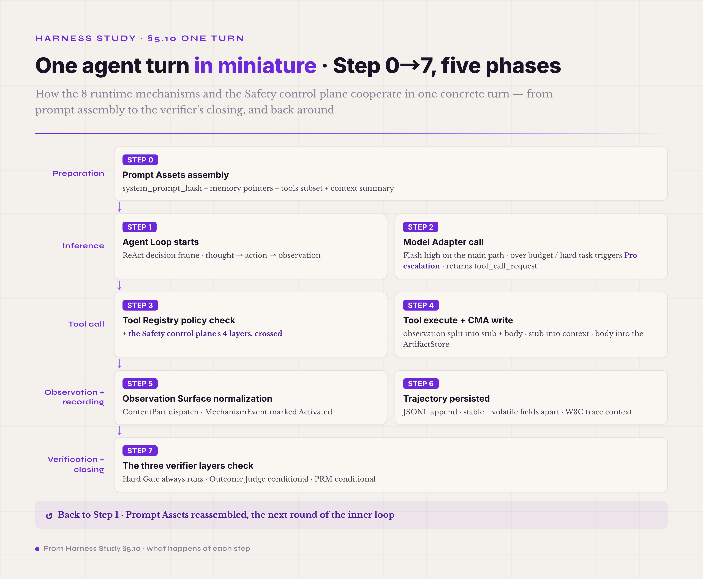

# 5.10 A Single Turn in Miniature · 8 runtime mechanisms + Safety cutting across

§5.1 through §5.9 took the eight runtime mechanisms and the Safety control plane one at a time. By now you know, for each piece, what it is, why it is designed the way it is, and how to start building it. What the one-at-a-time view cannot show is how the pieces work together inside one concrete agent turn — and that is the view this section adds.

The agent-harness literature rarely shows all the mechanisms cooperating within a single turn; most sources organize by mechanism, one chapter each, and never put the pieces together on one page. This section fills the gap with a minimal example the author constructed. It is a teaching construction, not the trajectory of any real run, and its numbers exist to show how the mechanisms relate.



*Figure 5.27 · The Step 0→7 five-phase flow of one agent turn*

```
[One agent turn in miniature · 8 runtime mechanisms + Safety cutting across]

══════ Preparation phase (runs every turn · once per turn) ══════

Step 0 · Prompt Assets assembly
   system_prompt_hash = sha256(P0 system + P1 task + P2 memory + P3 tools snapshot + P4 examples)
   the prompt holds:
     - system instructions (Safety disciplines / tool-use disciplines / instruction hierarchy)
     - the current task description
     - memory pointers (an artifact_id index · full artifacts not embedded)
     - the tool-registry subset visible this turn (select_for(query) dynamic narrowing)
     - the context summary (the digest left by the last compaction · not the full trajectory)
   trajectory: prompt_assets_load event { hash, family_breakdown, token_count }

══════ Inference phase ══════

Step 1 · Agent Loop decision frame starts
   inner loop pattern = ReAct (the industry default · plan-execute / reflexion also configurable)
   prepares the thought → action → observation triple
   trajectory: turn_boundary event + thought_start marker

Step 2 · Model Adapter call
   provider routing: primary (Flash high) on the main path · Pro escalation on token-budget
   overrun or a task marked hard
   strict tool schema normalization · request sent to the provider
   provider returns tool_call_request("write_file", { path: "src/x.py", content: "..." })
   trajectory: model_call event { provider, model, latency, prompt_tokens, completion_tokens, cache_hit_rate }

══════ Tool-call phase (the Safety control plane is crossed here) ══════

Step 3 · Tool Registry policy check + the Safety control plane's 4 layers
   3a. Tool Registry schema check → args valid
   3b. ACI normalize → tool input standardized (paths made absolute / BOM stripped from content, etc.)
   3c. the Safety control plane, crossed layer by layer:
       Layer 1 permission mode = workspace-write → pass
       Layer 2 allow-deny-ask rule → "write_file in src/" allowed by default (not on the deny list · no ask required)
       Layer 3 PreToolUse hook fires → user-defined script returns { decision: "allow" }
       Layer 4 sandbox bound check → cwd = /workspace/proj · target = src/x.py (inside the workspace) · pass
   3d. requires_confirmation field = false (write_file in src/ needs no HITL by default · git push-class operations do)
   trajectory: policy_decision event { tool, args_hash, layer_results: [pass, pass, pass, pass] }

Step 4 · Tool execute + Context-Memory-Artifact write
   tool.execute → file written · raw result { written_bytes: 1234, hash: "abc123..." }
   the observation splits into stub + body:
     stub (≤80 tokens) = { type: "write_file_result", path, summary: "wrote 1234 bytes" }
     body (full raw result + metadata) → ArtifactStore (artifact_id = "art_42")
     metadata → Memory schema_id index (body retrievable by artifact_id)
   the stub enters context · the body stays out · the agent refers to it by artifact_id
   trajectory: tool_call_response event { tool_call_id, stub, artifact_id, body_size }

══════ Observation + recording phase ══════

Step 5 · Observation Surface normalization
   ContentPart type dispatch (text / image / file_ref / preprocess_error)
   stub schema standardized · fields aligned to the OTel GenAI semconv
   MechanismEvent marked "Activated" (this mechanism really ran this turn · not Skipped/Blocked/Error)
   trajectory: observation event { content_parts, mechanism_state }

Step 6 · Trajectory · Event Stream persisted
   JSONL append · stable fields (turn_id / tool_call_id / timestamp / event_type) and
   volatile fields (token / cache_hit / latency) kept apart
   W3C trace context id bound · traceable across sub-agents
   trajectory: this turn accumulates 5-7 JSONL lines (depending on whether compaction fired)

══════ Verification + closing phase ══════

Step 7 · The three verifier layers check (which layers run depends on whether this turn completes the task)
   Hard Gate (always runs) → file hash exists + size > 0 + at the expected path → pass
   Outcome Judge (conditional) → this is a tool-call turn, not a task-completion turn · Outcome Judge skipped
   PRM (conditional) → multi-step reasoning task · process reward accumulates step-level scores ·
   this step scores 0.85 (a sound step)
   trajectory: verifier_decision event { hard_gate: pass, outcome_judge: skip, prm_score: 0.85 }

→ into the next round: back to Step 1 (Prompt Assets reassembled · the inner loop continues)

══════ The Safety control plane, silently crossed at every step ══════

   - Step 0, prompt assembly · external data (memory / tools snapshot) passes the prompt-injection scan
   - Step 2, model inference · CoT length monitor + token budget cap as the backstop
   - Step 3, tool call · the 4-layer permission decision model crossed in full (expanded above)
   - Step 4, artifact write · sandbox file-system boundary + artifact PII redaction
   - Step 6, trajectory persistence · PII / secret redaction + audit log sync
   - Step 7, verifier verdict · the Outcome Judge runs on an LLM, but the verifier rules themselves run as code
```

This one picture makes the cooperation visible. Read it and you can answer, for each of the eight — Prompt Assets, Agent Loop, Model Adapter, Tool Registry, Context-Memory-Artifact, Observation Surface, Trajectory, Verifier — which step it joins and what it does there, and at which steps the Safety control plane is crossed.

Three things in this picture are worth spelling out. First, **the eight mechanisms do not run as a Step 0-to-7 sequence; they unfold by what the agent wants to do this turn.** Prompt Assets are assembled once per turn (the invariant is the system_prompt_hash; the variables are the task, the memory, and the tools subset). The Agent Loop is the turn's decision frame — a thinking structure, not a loop in code. The Model Adapter is the turn's one inference. The Tool Registry wakes when the agent decides to call a tool; Context-Memory-Artifact when a product needs writing; the Observation Surface when a stub enters context; the Trajectory when events need persisting; the Verifier when the turn ends and a verdict is due. Not a sequence, then, but an **event-driven framework**: each mechanism fires when its trigger arrives. Second, **Safety runs invisibly behind every step.** The agent never sees it, yet it crosses every point where the turn touches the outside. That is the engineering essence of cross-cutting: the Safety chapter gave the principle — the OS syscall gate — and this picture shows how the principle actually lands. Third, **a real production turn is never drawn out like this.** The cooperation hides inside the harness's runtime code; all you see of a live run is the ~5-10 event lines in its trajectory. This picture unfolds the runtime's interior as a teaching view; it is not what a production trajectory looks like.

A few of the eight never show up explicitly in this single-turn miniature: Context management's auto-compact, Memory's invalidation, the Verifier's heavier Outcome Judge work. They operate across turns and across runs, where a single turn cannot show their value. The medium-sized walkthrough in the next section adds that view.
