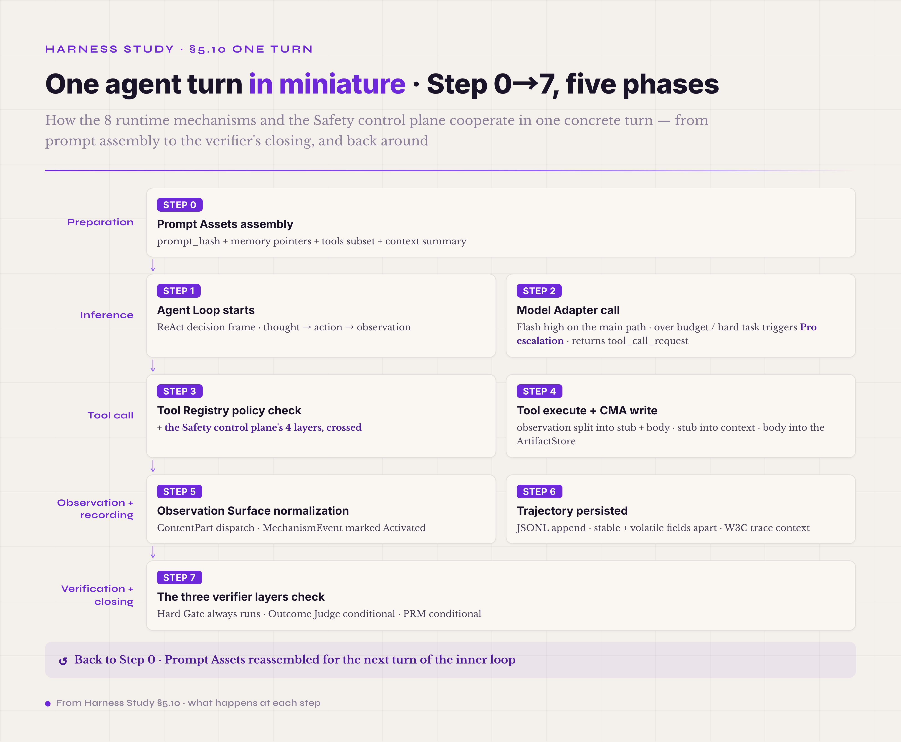

# 5.10 The micro-flow of a single turn · 8 runtime mechanisms + Safety cutting across

§5.1 through §5.9 covered the eight runtime mechanisms and the Safety control plane one at a time. By now you know, for each mechanism, what it is, why it is designed the way it is, and how to start building it. What that view makes hard to see is **how the mechanisms work together inside one concrete agent turn**. That is the view this section adds.

Material on agent harnesses rarely shows every mechanism cooperating within one turn. Most of it is organized one chapter per mechanism, with no diagram of how they cooperate. This section fills that gap with a minimal example the author constructed. It is a teaching construction, not the trajectory of any real run, and its numbers are there only to illustrate how the mechanisms interact.

**First, a few units need pinning down:**

- **turn**: one model call plus the tool executions it triggers. This matches how `max_turns` counts in the OpenAI Agents SDK and the Claude Agent SDK. This section walks through exactly one turn.
- **step**: this section breaks one turn into Step 0 through Step 7 for the explanation. A step is only a stage number used in the walkthrough, not a unit of counting in its own right. Some frameworks also call one model call a step, which makes their step a synonym for this book's turn, so keep the two apart when you read other material.
- **exchange**: everything from one user message to the model's final reply. One exchange contains many turns.
- **run**: the whole course of one task from start to a terminal state (completed, failed, or canceled), usually spanning many turns. The example in §5.11 is one complete run.

**The figure also uses a few new terms:**

- **Flash / Pro**: the light, fast model and the more capable model in one vendor's lineup (the names follow Gemini's naming). The default is to run on Flash and move up to Pro when the budget is exceeded or the problem is hard. This is the escalation routing covered in §5.2.
- **HITL (Human-in-the-Loop)**: certain actions cannot run until a person confirms them. §5.9 covers this in detail.
- **ContentPart**: the type classification the author's implementation uses for multimodal observations (text, images, file references, preprocessing errors, and so on), similar to the content block in the Anthropic API. §5.6 covers it in detail.
- **MechanismEvent**: in the author's implementation, the status event each mechanism emits at a decision point. It comes in four kinds: Activated (fired), Skipped, Blocked, and Error. The four kinds tell "the mechanism did not run" apart from "it ran but had nothing to report." §5.6 covers it in detail.
- **OTel GenAI semantic conventions (semconv)**: a set of attribute-naming conventions that OpenTelemetry defines for generative-AI calls, so that tracing data produced by different tools uses the same fields. §5.7 covers it in detail.
- **W3C Trace Context**: a request-header format standardized by the W3C for passing tracing identifiers (the trace ID and so on) between services, so that calls crossing processes and sub-agents join into one trace. It sits on a different layer from the GenAI semantic conventions: the first governs how identifiers are passed, the second how attributes are named.



*Figure 5.27 · The Step 0→7 five-phase flow of one agent turn*

```
[One agent turn in miniature · 8 runtime mechanisms + Safety cutting across]

══════ Preparation phase (runs every turn · once per turn) ══════

Step 0 · Prompt Assets assembly
   prompt_hash = sha256(system + task + memory + tools snapshot + examples)   # fingerprint of this turn's complete prompt
   the prompt holds:
     - system instructions (Safety rules / tool-use rules / instruction hierarchy)
     - the current task description
     - memory pointers (an artifact_id index · full artifacts not embedded)
     - the tool-registry subset visible this turn (select_for(query) dynamic narrowing)
     - the context summary (the digest left by the last compaction · not the full trajectory)
   trajectory: prompt_assets_load event { hash, family_breakdown, token_count }

══════ Inference phase ══════

Step 1 · Agent Loop decision frame starts
   inner loop pattern = ReAct (the industry default · Plan-Execute / Reflexion also configurable)
   prepares the thought → action → observation triple
   trajectory: turn_boundary event + thought_start marker

Step 2 · Model Adapter call
   provider routing: primary (Flash high) on the main path · Pro escalation on token-budget
   overrun or a task marked hard
   strict tool schema normalization · request sent to the provider
   provider returns tool_call_request("write_file", { path: "src/x.py", content: "..." })
   trajectory: model_call event { provider, model, latency, prompt_tokens, completion_tokens, cache_hit_rate }

══════ Tool-call phase (the Safety control plane is crossed here) ══════

Step 3 · Tool Registry policy check + the Safety control plane's 4 layers
   3a. Tool Registry schema check → args valid
   3b. ACI normalize → tool input standardized (paths made absolute / BOM stripped from content, etc.)
   3c. the Safety control plane's 4 layers, crossed one by one:
       Layer 1 permission mode = workspace-write → pass
       Layer 2 allow-deny-ask rule → "write_file in src/" allowed by default (not on the deny list · no ask required)
       Layer 3 PreToolUse hook fires → user-defined script returns { decision: "allow" }
       Layer 4 sandbox bound check → cwd = /workspace/proj · target = src/x.py (inside the workspace) · pass
   3d. requires_confirmation field = false (write_file in src/ needs no HITL by default · git push-class operations do)
   trajectory: policy_decision event { tool, args_hash, layer_results: [pass, pass, pass, pass] }

Step 4 · Tool execute + Context-Memory-Artifact write
   tool.execute → file written · raw result { written_bytes: 1234, hash: "abc123..." }
   the observation splits into stub + body:
     stub (≤80 tokens) = { type: "write_file_result", path, summary: "wrote 1234 bytes" }
     body (full raw result + metadata) → ArtifactStore (artifact_id = "art_42")
     metadata → Memory schema_id index (body retrievable by artifact_id)
   the stub enters context · the body stays out · the agent refers to it by artifact_id
   trajectory: tool_call_response event { tool_call_id, stub, artifact_id, body_size }

══════ Observation + recording phase ══════

Step 5 · Observation Surface normalization
   ContentPart type dispatch (text / image / file_ref / preprocess_error)
   stub schema standardized · fields aligned to the OTel GenAI semantic conventions
   MechanismEvent marked "Activated" (this mechanism really ran this turn · not Skipped/Blocked/Error)
   trajectory: observation event { content_parts, mechanism_state }

Step 6 · Trajectory · Event Stream persisted
   JSONL append · stable fields (turn_id / tool_call_id / timestamp / event_type) and
   volatile fields (token / cache_hit / latency) kept apart
   W3C Trace Context id bound · traceable across sub-agents
   trajectory: this turn accumulates 5-7 JSONL lines (depending on whether compaction fired)

══════ Verification + closing phase ══════

Step 7 · The three verifier layers check (which layers run depends on whether this turn completes the task)
   Hard Gate (always runs) → file hash exists + size > 0 + at the expected path → pass
   Outcome Judge (conditional) → this is a tool-call turn, not a task-completion turn · Outcome Judge skipped
   PRM (conditional) → multi-step reasoning task · process reward accumulates step-level scores ·
   this step scores 0.85 (a sound step)
   trajectory: verifier_decision event { hard_gate: pass, outcome_judge: skip, prm_score: 0.85 }

→ into the next turn: back to Step 0 (Prompt Assets reassembled · the inner loop continues)

══════ The Safety control plane, silently crossed at every step ══════

   - Step 0, prompt assembly · external data (memory / tools snapshot) passes the prompt-injection scan
   - Step 2, model inference · CoT length monitor + token budget cap as the backstop
   - Step 3, tool call · the 4-layer permission decision model crossed in full (expanded above)
   - Step 4, artifact write · sandbox file-system boundary + artifact PII redaction
   - Step 6, trajectory persistence · PII / secret redaction + audit log sync
   - Step 7, verifier verdict · the Outcome Judge runs on an LLM, but the verifier rules themselves run as code
```

This figure lays out how the eight runtime mechanisms and the Safety control plane work together within one turn. After reading it, you should be able to say what each of the eight (Prompt Assets, Agent Loop, Model Adapter, Tool Registry, Context-Memory-Artifact, Observation Surface, Trajectory, and Verifier) does in one agent turn and at which step, and at which steps the turn passes through the Safety control plane.

A few things about this figure need spelling out.

**First, the numbering from Step 0 to Step 7 is the order of explanation. It is also the most common order within a turn that calls one tool, but not every turn goes through every step.** Which mechanisms take part, and when, depends on what the model outputs in that turn:

- Prompt Assets are assembled once per turn.
- The Agent Loop is the turn's decision frame (a thinking structure, not a block of loop code).
- The Model Adapter calls the model once per turn.
- The Tool Registry steps in only when the model decides to call a tool.
- Context-Memory-Artifact steps in when a tool's output needs to be written.
- The Observation Surface steps in when an observation enters the context.
- The Trajectory steps in when there are events to persist.
- The Verifier steps in when a verdict is needed.

Put more precisely, the steps have a fixed order, but each step happens only when an event in that turn triggers it. A turn that only thinks and calls no tool, for example, skips Step 3 and Step 4.

The `prompt_hash` in Step 0 also needs a word of explanation. It is a hash of this turn's complete prompt (system, task, memory, the tool subset, and examples), which makes it a fingerprint of the prompt for this turn. It is recorded in the trajectory, so that replay and audit can confirm exactly what the model saw in this turn. It does not stay constant across turns: once the memory, the tool subset, or the context summary changes, the hash changes with it. What is truly stable across turns is the system-plus-task prefix, and only that stable prefix can hit the prompt cache (§5.11 looks at this again in a multi-turn example).

**Second, the Safety control plane runs in the background at every step.** The agent cannot see Safety, but Safety covers every point where the turn interacts with the outside. That is the engineering essence of cross-cutting. §5.9 already drew the analogy between a cross-cutting control plane and the operating system's syscall gate; this figure shows what the implementation concretely looks like.

**Third, an agent in a real production environment does not draw out every turn like this.** The cooperation among the eight mechanisms is hidden inside the harness's runtime code. Once the agent is running, all you see in the trajectory is about 5 to 10 lines of events. This figure is a teaching view that lays out the runtime's internal cooperation for the reader, not what a production trajectory actually looks like.

Several features of the eight runtime mechanisms do not appear explicitly in this single-turn miniature: Context management's auto-compact, Memory's invalidation, and the complex judgments of the Verifier's Outcome Judge. They work **across turns and across runs**, so looking at a single turn does not show what they contribute to the cooperation. The medium-sized walkthrough in the next section (§5.11) adds that view.
