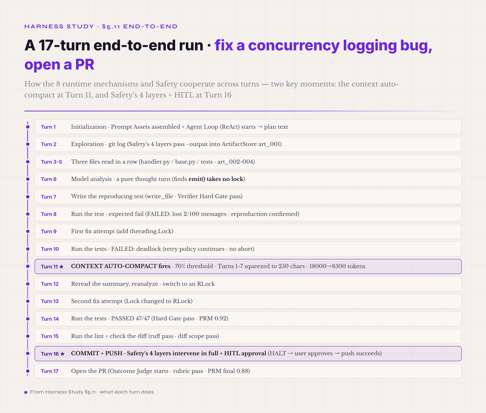
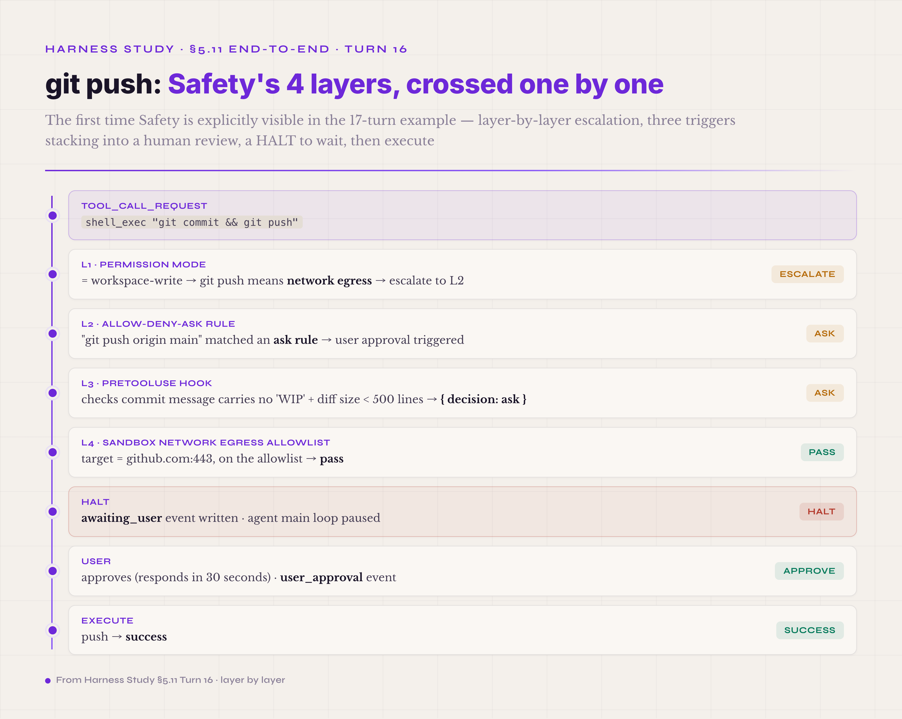

# 5.11 A Medium End-to-End Example · 17 turns to fix a logging bug

A single turn in miniature cannot show how the eight runtime mechanisms and the Safety control plane cooperate across turns and across runs; for that you need a task with real complexity. The example below is "fix a concurrency logging bug in a Python project and submit a PR." The bug report reads "logger.emit() occasionally drops messages under multithreading," and the agent must locate the bug → write a reproducing test → fix it → run the tests → run the lint → commit → push → open the PR. The task runs about 17 turns — squarely within the typical length of a single-agent production task (the AP12 discussion in the Safety chapter put a single agent in a single process as sufficient within 30 turns, and this example sits in that range).



*Figure 5.28 · 17 turns end to end: fix the logging bug and open the PR*

The example is a teaching construction by the author, not the trajectory of any real run; its numbers exist to show how the mechanisms relate.

```
═══════════════════════════════════════════════════════════
[One run · about 17 turns]
═══════════════════════════════════════════════════════════

Turn 1 · Initialization · Prompt Assets + Agent Loop start
   Prompt Assets assembly:
     P0 system: Safety disciplines + tool-use disciplines + instruction hierarchy
     P1 task: "fix the concurrency bug in src/logging/handler.py · open a PR"
     P2 memory: empty (fresh run · no prior context)
     P3 tools: shell_exec / read_file / write_file / edit_file / create_pr
     P4 examples: 2 prior debug cases (patterns to borrow)
   system_prompt_hash = sha256(P0+P1+P2+P3+P4) = "abc123..."
   Agent Loop = ReAct mode (a multi-step debug task · ReAct is the default fit)
   Model Adapter call → returns plan text:
     "check git log first for recent changes · then read the logging module"
   Trajectory: turn boundary + thought + model_call

Turn 2 · Exploration · git log
   Agent thought: "git log to see which commits touched logging"
   tool_call_request("shell_exec", "git log --oneline -20 src/logging/")
   Safety's 4 layers crossed:
     L1 workspace-write → pass
     L2 shell_exec read-only git commands allowed by default
     L3 PreToolUse hook → allow
     L4 sandbox cwd inside workspace → pass
   Execute → 100 lines of git log output
   Observation: stub("git log, 100 lines · last 20 commits · mentions 'add threading support'")
                body into the ArtifactStore (art_001)
   Trajectory: 3 lines (request / policy / response)

Turn 3-5 · Three files read in a row
   Agent thought (each round): "read handler.py / base.py / tests/__init__.py for the implementation details"
   read_file × 3 (handler.py 800 lines + base.py 300 lines + tests/__init__.py 50 lines)
   Each observation: stub into context · body into the ArtifactStore (art_002, art_003, art_004)
   Safety's 4 layers crossed each time · pass
   Trajectory: 9 lines

Turn 6 · Model analysis · a pure thought turn
   Agent Loop · model_call → text only · no tool called:
     "logger.emit() in ThreadSafeHandler takes no lock.
      Under concurrency, two threads writing the buffer at once will drop messages."
   Trajectory: 1 line, turn boundary + thought (no tool call)

Turn 7 · Write the reproducing test
   Agent thought: "write a test that reproduces the bug · let it fail first · fix, then let it pass"
   tool_call_request("write_file", "tests/test_concurrency.py", content=80 lines)
   Safety's 4 layers crossed · tests/ inside workspace-write · pass
   Execute → written · raw result { written_bytes: 2456, hash: "def456..." }
   Observation split into stub + body · body into the ArtifactStore (art_005)
   Verifier Hard Gate: file exists · size > 0 · pass
   Trajectory: 4 lines (request / policy / response / verifier)

Turn 8 · Run the test · expected to fail (reproducing the bug)
   tool_call_request("shell_exec", "pytest tests/test_concurrency.py -v")
   Safety crossed · pass
   Execute → "FAILED: assertion: lost 2/100 messages"
   Verifier Hard Gate (this turn expects a fail): post-run test fails = reproduction confirmed · continue
   Trajectory: 3 lines

Turn 9 · First fix attempt
   Agent thought: "add a threading.Lock to protect the buffer writes"
   tool_call_request("edit_file", "src/logging/handler.py", patch=add threading.Lock)
   Safety's 4 layers crossed:
     L2 edit_file in src/ → allowed by default under workspace-write
     L3 Hook checks whether the patch touches a sensitive file → handler.py not on the sensitive list · allow
     L4 sandbox file-system bound check · pass
   Execute → patch applied
   Trajectory: 3 lines

Turn 10 · Run the tests · expected to pass
   tool_call_request("shell_exec", "pytest")
   Execute → "FAILED: deadlock detected · test timeout 60s"
   Verifier Hard Gate: failed · but the retry policy says continue · no abort
   Trajectory: 3 lines

╔═════════════════════════════════════════════════════════════╗
║ Turn 11 · CONTEXT AUTO-COMPACT fires                        ║
║                                                             ║
║ total context tokens hit the 70% budget threshold           ║
║ (the auto-compact trigger condition)                        ║
║ the Compactor starts (Context-Memory-Artifact cooperating): ║
║   - picks Turn 1-7 as the compression range                 ║
║     (early + already-completed phases)                      ║
║   - calls a cheap model (gpt-5.4-nano) to squeeze the       ║
║     7 turns into a 250-character summary                    ║
║   - keeps Turn 8-10 whole (recent + relevant to the         ║
║     current deadlock problem)                               ║
║   - marks every unclosed tool_call_id against               ║
║     post-compaction hallucination                           ║
║   - the summary keeps the artifact_id references            ║
║     (the agent can still fetch the bodies)                  ║
║                                                             ║
║ Trajectory: compaction event                                ║
║   { before_tokens: 18000, after_tokens: 8500,               ║
║     summary_model: gpt-5.4-nano, range: turns_1_to_7 }      ║
║                                                             ║
║ ★ Context-Memory-Artifact appears explicitly for the        ║
║   first time in this turn ★                                 ║
╚═════════════════════════════════════════════════════════════╝

Turn 12 · Reread the summary, reanalyze · course correction
   Agent Loop · the model reads the post-compaction context + the Turn 8-10 failure information
   thought:
     "The Lock deadlocked because handler.emit() calls self.acquire() internally.
      Switch to an RLock (reentrant lock) and it resolves."
   Trajectory: 1 line

Turn 13 · Second fix attempt
   tool_call_request("edit_file", path, refined_patch=Lock changed to RLock)
   Safety's 4 layers crossed · pass
   Execute → written
   Trajectory: 3 lines

Turn 14 · Run the tests · pass
   tool_call_request("shell_exec", "pytest")
   Execute → "PASSED 47/47 in 3.2s"
   Verifier Hard Gate: pass
   Outcome Judge: mid-task turn · outcome judge skipped
   PRM: step score 0.92 (a sound step)
   Trajectory: 3 lines + verifier

Turn 15 · Run the lint + check the diff
   tool_call_request("shell_exec", "ruff check src/ && git diff")
   Execute → "All checks passed" + the diff output
   Verifier Hard Gate: the diff touches only handler.py + tests/ · no other files moved · pass
   Trajectory: 3 lines

╔═════════════════════════════════════════════════════════════╗
║ Turn 16 · COMMIT + PUSH · Safety's 4 layers intervene       ║
║                                                             ║
║ tool_call_request("shell_exec", "git commit && git push")   ║
║                                                             ║
║ Safety's 4 layers, crossed one by one:                      ║
║   L1 permission mode = workspace-write                      ║
║      → git commit is local, OK · git push means network     ║
║        egress → escalate to L2                              ║
║   L2 allow-deny-ask rule:                                   ║
║      "git push origin main" matched an ask rule             ║
║      → user approval triggered                              ║
║   L3 PreToolUse hook fires:                                 ║
║      user-defined script reads commit message + diff size   ║
║      commit message carries no 'WIP' · pass                 ║
║      diff size < 500 lines · pass                           ║
║      returns { decision: "ask" } (the hook requires a       ║
║      user ask as well)                                      ║
║   L4 sandbox network egress allowlist:                      ║
║      target = github.com:443 · on the allowlist · pass      ║
║                                                             ║
║ HALT · awaiting_user event written · agent main loop paused ║
║                                                             ║
║ Trajectory: policy_decision (halted · awaiting_user)        ║
║             + hook_decision (require_user_ask)              ║
║                                                             ║
║ [the user approves · responds in 30 seconds]                ║
║                                                             ║
║ Trajectory: user_approval event                             ║
║             { approver: dev-user, decision: approve,        ║
║               timestamp, audit_log_id }                     ║
║                                                             ║
║ Execute push → success                                      ║
║ Trajectory: tool_call_response                              ║
║                                                             ║
║ ★ Safety's 4 layers explicitly visible for the first        ║
║   time in this turn ★                                       ║
╚═════════════════════════════════════════════════════════════╝

Turn 17 · Open the PR
   tool_call_request("create_pr", title, body=fix notes + test results)
   Safety's 4 layers crossed · create_pr carries requires_confirmation = false
   (the Turn 16 push approval counts as approval of the task as a whole) · allow
   Execute → PR URL returned: "https://github.com/org/repo/pull/123"
   Verifier Outcome Judge (task-completion turn · the outcome judge starts):
     the judge LLM reads the PR body + the commit diff + the test results
     judge rubric: "does the PR contain the bug fix + the tests + a description" · pass
   PRM: final task score 0.88
   Trajectory: 3 lines + the outcome judge verdict + the PRM final score

═══════════════════════════════════════════════════════════
End of run.
═══════════════════════════════════════════════════════════
```

**The single-run summary**: 17 turns, about 50 trajectory events, one context auto-compact (Turn 11), one verifier Hard Gate failure followed by a retry (Turn 10), one full four-layer Safety intervention with HITL approval (Turn 16), the Outcome Judge starting on the final turn, and the PRM accumulating step scores throughout.

The example brings out the key points of cross-turn cooperation.

**The stable prefix of the Prompt Assets (P0 system + P1 task) is reused across turns, while the dynamic parts (P2 memory, the P3 tools subset, the context summary) update per turn as needed.** Prompt assembly is not redone from scratch each turn — but neither is it "one hash, unchanged across turns." What hits the prompt cache is the stable system + task prefix; the moment the memory, the tools, or the summary changes, the system_prompt_hash changes with it (the Context chapter covered this — a compaction that rewrites the middle invalidates the cache). The hash's role, then, is to be this turn's complete prompt fingerprint, entering the trajectory for replay and audit; it is not a cache key held constant across turns.

**The Agent Loop's decision frame (ReAct mode) unfolds explicitly before every model call.** The thought segment is the agent's reasoning externalized, not hidden inside the model call. That externalization keeps the trajectory readable — and, as the Observation Surface and Trajectory chapters put it, it is the precondition for an evolver loop to consume the trajectory for self-evolution: a trajectory that carries thoughts carries the grounds of every decision.

**The three pieces of Context-Memory-Artifact cooperate invisibly inside the stub + body split.** Every tool product splits automatically: stub into context, body into the ArtifactStore. The agent sees the stub, knows what happened, and refers to the body by artifact_id without crowding the context. Turn 11's auto-compact squeezes seven turns of history into a 250-character summary that keeps the artifact_id references — the agent can still fetch the bodies; they are just no longer in the context. This stub + body + compact + retrieval cooperation is the core pattern by which the three components work together.

**The Observation Surface and the Trajectory accumulate evidence across turns.** Every stub enters context, every event enters the trajectory — about 50 events over 17 turns. Those events support trajectory replay (run the agent on the same prompt assets and check for the same result, a determinism check), and they support self-evolution (the evolver loop reads the trajectory for which turns were wasted, which decisions were wrong, which tool calls could have been merged).

**The three verifier layers start selectively, by turn type.** The Hard Gate runs on every tool-call turn (file exists, command exit code, and so on); the Outcome Judge starts exactly once, on the task-completion turn (Turn 17); the PRM accumulates step scores throughout, scoring every model call. The layers are matched to the situation — not all three on every turn.

**The Safety control plane's four layers are crossed every turn, and usually invisibly.** The routine tool calls — Turns 2, 3, 4, 5, 7, 9, 13, 15, all under workspace-write — cross the four layers and pass, and the reader never sees Safety act. Turn 16's git push stacks three triggers at once — network egress, the ask rule, and a Hook that requires a user ask of its own — and the four layers intervene in full, visibly. This pattern — invisible most of the time, explicit when it counts — is the heart of Safety engineering: Safety should not interrupt the user on every tool call, but the high-impact operation must be visible.



*Figure 5.29 · git push: Safety's four layers, crossed one by one*

The cross-run ablation view (the self-evolution infrastructure of the Observation Surface and Trajectory chapters, expanded systematically in the Harness Lab chapter) shows how the same task fares under different harness configurations (a hypothetical ablation matrix — the author's teaching construction, not empirical data, used only to illustrate the logic of mechanism contribution):

| Run | Configuration | Success | Note |
|---|---|---|---|
| A | everything on (8 runtime mechanisms + 4 Safety layers + HITL approval) | 5/5 | the baseline |
| B | Verifier post-run tests off | 3/5 | 2 silent failures (compiles, behaves wrong) |
| C | Context auto-compact off | 2/5 | 3 context overflows · the model gets truncated and forgets the task |
| D | Safety approval off (git push auto-allowed) | 5/5 | faster · but 1 push of unreviewed code — higher risk |
| E | Trajectory recorder off | 5/5 | runs fine · but **no later ablation can run** — this very ablation needs the trajectory to exist |
| F | Prompt Assets P4 examples off | 4/5 | 1 wrong debug direction (no prior debug case to borrow) |
| G | Agent Loop ReAct mode off (plain mode, thought not externalized) | 3/5 | 2 unauditable decisions · later nobody knows why it went wrong |

Four framings stand out in this table. First, the Verifier and Context management are this task's positive-contribution mechanisms: switch them off and the success rate visibly drops. Second, Safety approval contributes negatively to speed (HITL waits for a person) and positively to **risk** — a trade-off the ablation data cannot settle by itself; it depends on how the business weighs fast against safe. Third, the Trajectory recorder is a **precondition mechanism**: it does not move the success rate, but switch it off and no later ablation can run at all. Infrastructure of this kind cannot be scored by ablation directly — it has to be kept as a premise. Fourth, the Agent Loop and the Prompt Assets are the two mechanisms this volume added, and the ablation shows both contributing observably: ReAct mode keeps decisions auditable, and the P4 examples let prior patterns be borrowed.

Cross-run ablation is the Harness Lab chapter's subject — this section only touches it, so that the two complementary views are both in sight: the 17-turn cooperation inside one run, and the ablation matrix across runs. The former is runtime cooperation; the latter is outer-loop optimization. Together they make up the complete engineering practice of a harness.

---

> **End of the first major part · the second continues from part5**
>
> §I–§V in full (the introduction + 8 runtime mechanisms + 1 Safety control plane + the single-turn miniature + the 17-turn end-to-end) span parts 1-4, roughly 115K Chinese characters in total — the introductory volume's first major arc closes here.
>
