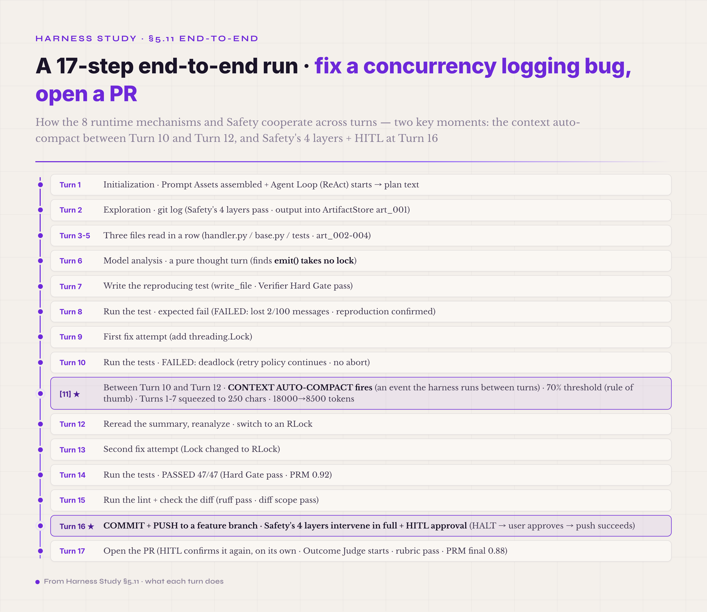
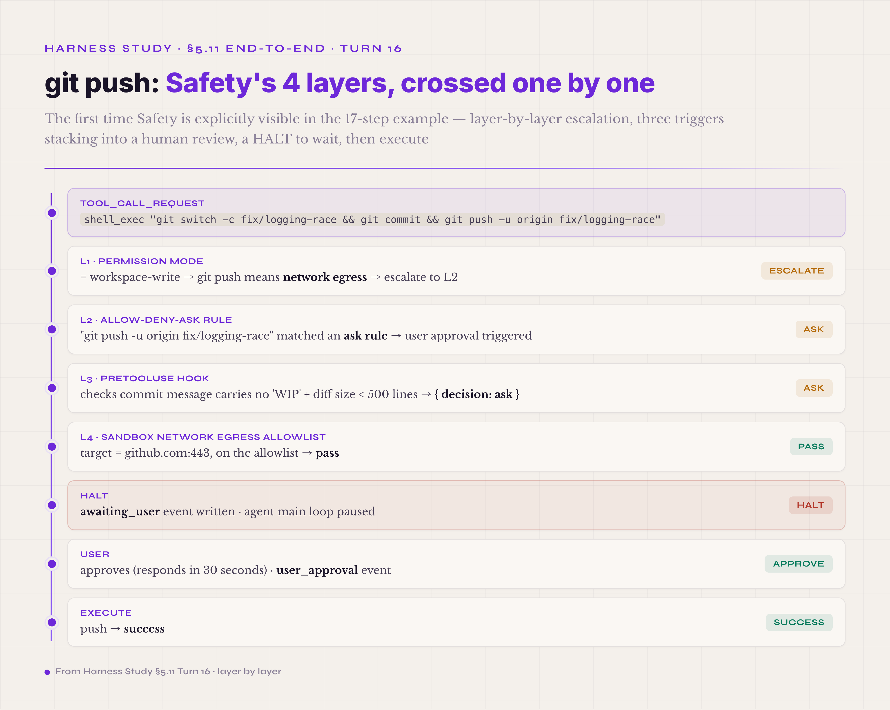

# 5.11 A mid-size end-to-end example · 17 turns fixing a logging bug

A single turn in miniature cannot show how the eight runtime mechanisms and the Safety control plane cooperate across turns and across runs; for that you need a task with real complexity. The example below is "fix a concurrency logging bug in a Python project and submit a PR." The bug report reads "logger.emit() occasionally drops messages under multithreading." The agent has to work through it in order: locate the problem, write a test that reproduces it, fix the code, run the tests, run the linter, commit, push to a feature branch, and then open a PR against main.

The timeline has 17 numbered entries: 16 agent turns, plus one context compaction at number 11. The compaction happens after Turn 10 ends and before Turn 12 begins. It is an event the harness runs between two turns, not an agent turn of its own; the numbering stays at 17 so that it lines up with the timeline in Figure 5.28. A task of this length falls in the usual range for a single agent. §5.1.5 gave the criterion when it discussed splitting work across too many agents: a task of up to 30 turns is usually handled well enough by a single agent in a single process (a rule of thumb). §5.9, on Sub-agent Depth Explosion (AP12, see Appendix F), then added upper-bound constraints from the Safety side.



*Figure 5.28 · 17 turns end to end: fix the logging bug and open the PR*

The example is a teaching construction by the author, not the trajectory of any real run; its numbers serve only to show how the mechanisms cooperate.

```
═══════════════════════════════════════════════════════════
[One run · 16 agent turns + 1 compaction between turns · 17 numbers in all]
═══════════════════════════════════════════════════════════

Turn 1 · Initialization · Prompt Assets + Agent Loop start
   Prompt Assets assembly:
     system: Safety rules + tool-use rules + instruction hierarchy
     task: "fix the concurrency bug in src/logging/handler.py · open a PR"
     memory: empty (fresh run · no prior context)
     tools: shell_exec / read_file / write_file / edit_file / create_pr
     examples: 2 prior debug cases (patterns to borrow)
   prompt_hash = sha256(system+task+memory+tools+examples) = "abc123..."   # fingerprint of this turn's complete prompt
   Agent Loop = ReAct mode (a multi-step debug task · ReAct is the default fit)
   Model Adapter call → returns plan text:
     "check git log first for recent changes · then read the logging module"
   Trajectory: turn boundary + thought + model_call

Turn 2 · Exploration · git log
   Agent thought: "git log to see which commits touched logging"
   tool_call_request("shell_exec", "git log --oneline -20 src/logging/")
   Safety's 4 layers crossed:
     L1 workspace-write → pass
     L2 shell_exec read-only git commands allowed by default
     L3 PreToolUse hook → allow
     L4 sandbox cwd inside workspace → pass
   Execute → 20 lines of git log output
   Observation: stub("git log, 20 lines · last 20 commits · mentions 'add threading support'")
                body into the ArtifactStore (art_001)
   Trajectory: 3 lines (request / policy / response)

Turn 3-5 · Three files read in a row
   Agent thought (each turn): "read handler.py / base.py / tests/__init__.py for the implementation details"
   read_file × 3 (handler.py 800 lines + base.py 300 lines + tests/__init__.py 50 lines)
   Each observation: stub into context · body into the ArtifactStore (art_002, art_003, art_004)
   Safety's 4 layers crossed each time · pass
   Trajectory: 9 lines

Turn 6 · Model analysis · a pure thought turn
   Agent Loop · model_call → text only · no tool called:
     "logger.emit() in ThreadSafeHandler takes no lock.
      Under concurrency, two threads writing the buffer at once will drop messages."
   Trajectory: 1 line, turn boundary + thought (no tool call)

Turn 7 · Write the reproducing test
   Agent thought: "write a test that reproduces the bug · let it fail first · fix, then let it pass"
   tool_call_request("write_file", "tests/test_concurrency.py", content=80 lines)
   Safety's 4 layers crossed · tests/ inside workspace-write · pass
   Execute → written · raw result { written_bytes: 2456, hash: "def456..." }
   Observation split into stub + body · body into the ArtifactStore (art_005)
   Verifier Hard Gate: file exists · size > 0 · pass
   Trajectory: 4 lines (request / policy / response / verifier)

Turn 8 · Run the test · expected to fail (reproducing the bug)
   tool_call_request("shell_exec", "pytest tests/test_concurrency.py -v")
   Safety crossed · pass
   Execute → "FAILED: assertion: lost 2/100 messages"
   Verifier Hard Gate (this turn expects a fail): post-run test fails = reproduction confirmed · continue
   Trajectory: 3 lines

Turn 9 · First fix attempt
   Agent thought: "add a threading.Lock to protect the buffer writes"
   tool_call_request("edit_file", "src/logging/handler.py", patch=add threading.Lock)
   Safety's 4 layers crossed:
     L2 edit_file in src/ → allowed by default under workspace-write
     L3 hook checks whether the patch touches a sensitive file → handler.py not on the sensitive list · allow
     L4 sandbox file-system bound check · pass
   Execute → patch applied
   Trajectory: 3 lines

Turn 10 · Run the tests · expected to pass
   tool_call_request("shell_exec", "pytest")
   Execute → "FAILED: deadlock detected · test timeout 60s"
   Verifier Hard Gate: failed · but the retry policy says continue · no abort
   Trajectory: 3 lines

╔═════════════════════════════════════════════════════════════╗
║ [11] Between Turns 10 and 12 · CONTEXT AUTO-COMPACT fires   ║
║ (an event the harness runs between two turns ·              ║
║  not an agent turn)                                         ║
║                                                             ║
║ context usage reaches 70% of the context budget             ║
║ (the auto-compact trigger condition · a rule of thumb ·     ║
║  this example sets no specific budget figure)               ║
║ the Compactor starts (Context-Memory-Artifact cooperating): ║
║   - picks Turn 1-7 as the compression range                 ║
║     (early + already-completed phases)                      ║
║   - calls a cheap model (gpt-5.4-nano) to squeeze the       ║
║     7 turns into a 250-character summary                    ║
║   - keeps Turn 8-10 whole (recent + relevant to the         ║
║     current deadlock problem)                               ║
║   - marks every unclosed tool_call_id against               ║
║     post-compaction hallucination                           ║
║   - the summary keeps the artifact_id references            ║
║     (the agent can still fetch the bodies)                  ║
║                                                             ║
║ Trajectory: compaction event                                ║
║   { before_tokens: 18000, after_tokens: 8500,               ║
║     summary_model: gpt-5.4-nano, range: turns_1_to_7 }      ║
║                                                             ║
║ ★ compaction appears for the first time in this run ★       ║
╚═════════════════════════════════════════════════════════════╝

Turn 12 · Reread the summary, reanalyze · course correction
   Agent Loop · the model reads the post-compaction context + the Turn 8-10 failure information
   thought:
     "Adding the Lock caused a deadlock: a helper method called inside emit()
      tries to acquire the same newly added Lock, and threading.Lock is not reentrant.
      Switch to an RLock (reentrant lock) and it resolves."
     (the standard library's logging.Handler already has its own self.lock, an RLock
      by default; the problem is the lock newly added in this fix)
   Trajectory: 1 line

Turn 13 · Second fix attempt
   tool_call_request("edit_file", path, refined_patch=Lock changed to RLock)
   Safety's 4 layers crossed · pass
   Execute → written
   Trajectory: 3 lines

Turn 14 · Run the tests · pass
   tool_call_request("shell_exec", "pytest")
   Execute → "PASSED 47/47 in 3.2s"
   Verifier Hard Gate: pass
   Outcome Judge: mid-task turn · outcome judge skipped
   PRM: step score 0.92 (a sound step)
   Trajectory: 3 lines + verifier

Turn 15 · Run the lint + check the diff
   tool_call_request("shell_exec", "ruff check src/ && git diff")
   Execute → "All checks passed" + the diff output
   Verifier Hard Gate: the diff touches only handler.py + tests/ · no other files changed · pass
   Trajectory: 3 lines

╔═════════════════════════════════════════════════════════════╗
║ Turn 16 · COMMIT + PUSH to a feature branch ·               ║
║           Safety's 4 layers intervene in full               ║
║                                                             ║
║ tool_call_request("shell_exec",                             ║
║   "git switch -c fix/logging-race && git commit             ║
║    && git push -u origin fix/logging-race")                 ║
║                                                             ║
║ Safety's 4 layers, crossed one by one:                      ║
║   L1 permission mode = workspace-write                      ║
║      → git commit is local, OK · git push means network     ║
║        egress → escalate to L2                              ║
║   L2 allow-deny-ask rule:                                   ║
║      "git push -u origin fix/logging-race"                  ║
║      matched an ask rule (every git push needs human        ║
║      confirmation)                                          ║
║      → user approval triggered                              ║
║   L3 PreToolUse hook fires:                                 ║
║      user-defined script reads commit message + diff size   ║
║      commit message carries no 'WIP' · pass                 ║
║      diff size < 500 lines · pass                           ║
║      returns { decision: "ask" } (the hook requires a       ║
║      user ask as well)                                      ║
║   L4 sandbox network egress allowlist:                      ║
║      target = github.com:443 · on the allowlist · pass      ║
║                                                             ║
║ HALT · awaiting_user event written · agent main loop paused ║
║                                                             ║
║ Trajectory: policy_decision (halted · awaiting_user)        ║
║             + hook_decision (require_user_ask)              ║
║                                                             ║
║ [the user approves · responds in 30 seconds]                ║
║                                                             ║
║ Trajectory: user_approval event                             ║
║             { approver: dev-user, decision: approve,        ║
║               timestamp, audit_log_id }                     ║
║                                                             ║
║ Execute push → success                                      ║
║ Trajectory: tool_call_response                              ║
║                                                             ║
║ ★ Safety's 4 layers explicitly visible for the first        ║
║   time in this turn ★                                       ║
╚═════════════════════════════════════════════════════════════╝

Turn 17 · Open the PR
   tool_call_request("create_pr", head="fix/logging-race", base="main",
                     title, body=fix notes + test results)
   Safety's 4 layers crossed · create_pr carries requires_confirmation = true
     Turn 16 approved the push · that is not approval to open a PR (§5.3: approving X is not approving Y)
     → HALT · awaiting_user event written · the user approves
   Trajectory: policy_decision (awaiting_user) + user_approval event
   Execute → PR opened against main · PR URL returned: "https://github.com/org/repo/pull/123"
   Verifier Outcome Judge (task-completion turn · the outcome judge starts):
     the judge LLM reads the PR body + the commit diff + the test results
     judge rubric: "does the PR contain the bug fix + the tests + a description" · pass
   PRM: final task score 0.88
   Trajectory: 3 lines + the outcome judge verdict + the PRM final score

═══════════════════════════════════════════════════════════
End of run.
═══════════════════════════════════════════════════════════
```

**The single-run summary**: 16 agent turns plus one context compaction between turns (number 11), about 50 trajectory events in all. Among them:

- one verifier Hard Gate failure, after which the run continues under the retry policy (Turn 10);
- two human confirmations (HITL): the push in Turn 16 triggers a full intervention by the four Safety layers, and opening the PR in Turn 17 is confirmed again on its own;
- the Outcome Judge starts on the final turn;
- the PRM accumulates a score for every step throughout.

The example explicitly draws out several key points to observe in how the eight runtime mechanisms and the Safety control plane cooperate across turns.

**Prompt Assets: the stable prefix (system + task) is reused across turns, while the dynamic parts (memory, the tool subset, the context summary) update each turn as needed.** Prompt assembly is not redone from scratch each turn, but neither is it "one hash, unchanged across turns." Only the stable system + task prefix can hit the prompt cache. The moment the memory, the tool subset, or the summary changes, the prompt_hash changes with it (as §5.4 explained, a compaction that rewrites the middle of the context invalidates the cache from that point on). The prompt_hash's role, then, is to fingerprint this turn's complete prompt. It is recorded in the trajectory for replay and audit; it is not a cache key held constant across turns. This matches how §5.10 describes prompt_hash.

**The Agent Loop's decision frame (ReAct mode) unfolds explicitly before every model call.** The thought segment is the agent's reasoning externalized, not hidden inside the model call. That externalization keeps the trajectory readable. It is also a precondition for the evolver loop described in §5.6 and §5.7 to use the trajectory for self-evolution: a trajectory that carries the thoughts carries the grounds for each decision.

**The three Context-Memory-Artifact mechanisms cooperate out of view, inside the split between stub and body.** The output of every tool call splits automatically: the stub goes into the context, the body into the ArtifactStore. From the stub alone the agent knows what happened, and it refers to the body by artifact_id, so the body takes up no context. The auto-compact at number 11 compresses seven turns of history into a 250-character summary and keeps the artifact_id references: the agent can still fetch the bodies, which are simply no longer in the context. Stub, body, compaction, and retrieval working together is the core pattern by which Context-Memory-Artifact operates.

**The Observation Surface and the Trajectory accumulate evidence across turns.** Every stub enters the context and every event enters the trajectory, about 50 events over the whole run. Those events support two things:

- **Replay**: play this run back from the observations already recorded in the trajectory, without executing any tool again. This lets you step back through what the model saw and what it decided at each point, or debug the verifier against fixed inputs;
- **Self-evolution**: the evolver loop reads the trajectory to find which turns were wasted, which decisions were wrong, and which tool calls could have been merged.

**The three verifier layers start selectively, by turn type.** The Hard Gate runs on every tool-call turn (file exists, command exit code, and so on); the Outcome Judge starts exactly once, on the task-completion turn (Turn 17); the PRM accumulates step scores throughout, scoring every model call. The layers are configured to fit the situation, and not all three run on every turn. One caveat: a PRM (process reward model) is used mainly in training and in inference-time search, and scoring each step online is uncommon. It appears here only to show how the three layers divide the work (see §5.8).

**The Safety control plane's four layers are crossed on every turn, but they usually stay out of view.** The routine tool calls, such as Turns 2, 3, 4, 5, 7, 9, 13, and 15 under workspace-write mode, all cross the four layers and are all allowed, so the reader never sees Safety at work. Turn 16's git push triggers three checks at once: the network egress check, the ask rule, and a hook that requires human confirmation. Only there does the full intervention of the four layers become visible. Opening the PR in Turn 17 is a separate action, so under the §5.3 principle that approving X is not approving Y, it is confirmed again. This pattern, out of view most of the time and explicit for critical operations, is the core of engineering the Safety control plane: users should not be interrupted on every tool call, but high-impact critical operations must be seen by a person.



*Figure 5.29 · git push: Safety's four layers, crossed one by one*

Now take the cross-run view: ablation. It belongs to the self-evolution infrastructure covered in §5.6 and §5.7, and §VII, Harness Lab, develops it systematically. The question it asks is how much the success rate of one task changes across harness configurations. The table below is a hypothetical ablation matrix the author constructed, not measured data. It serves only to show how to read a mechanism's contribution:

| Run | Configuration | Success | Note |
|---|---|---|---|
| A | everything on (8 runtime mechanisms + 4 Safety layers + HITL confirmation) | 5/5 | the baseline |
| B | Verifier post-run tests off | 3/5 | 2 silent failures (compiles, behaves wrong) |
| C | Context auto-compact off | 2/5 | 3 context overflows; the truncated model forgets the task |
| D | Safety confirmation off (git push auto-allowed) | 5/5 | faster, but 1 push of unreviewed code, so higher risk |
| E | Trajectory recorder off | 5/5 | illustrative value; with it off, neither ablation nor review can be done after the fact |
| F | Prompt Assets examples off | 4/5 | 1 wrong debugging direction (illustrative) |
| G | Agent Loop ReAct mode off (switched to a plain mode that does not externalize thought) | 3/5 | illustrative value; the decision process cannot be audited |

The table sketches the direction of contribution the author expects. These are not measured results, and no conclusion can be drawn from them. Going by that expectation, keep a few points in mind when reading the table:

- The Verifier and context compaction are expected to contribute positively to this task: switch them off and the success rate is expected to drop noticeably;
- Safety confirmation contributes negatively on speed (the run waits for a person to review) and positively on risk, which it lowers. Ablation data cannot settle this trade-off by itself; it depends on how the business weighs "fast" against "safe";
- The Trajectory recorder is a precondition mechanism: without it, later ablation and review have no data to work with. So it is not suited to evaluation by ablation and should be kept as a precondition;
- Whether the Prompt Assets examples (row F) and the Agent Loop's ReAct mode (row G) contribute at all, and by how much, has to be measured by real ablation over repeated runs.

Cross-run ablation is the subject of §VII, Harness Lab, and this section only touches on it. The point is to let you see that "the 17-step cooperation inside a single run" and "the ablation matrix across runs" are two complementary views. The former is cooperation at runtime; the latter is optimization in the outer loop. Together they make up the complete engineering practice of a harness.

---

> **§I through §V end here**: the introduction, 8 runtime mechanisms, 1 Safety control plane, the single-turn miniature, and the end-to-end example. The next chapter (§VI) covers engineering patterns.
