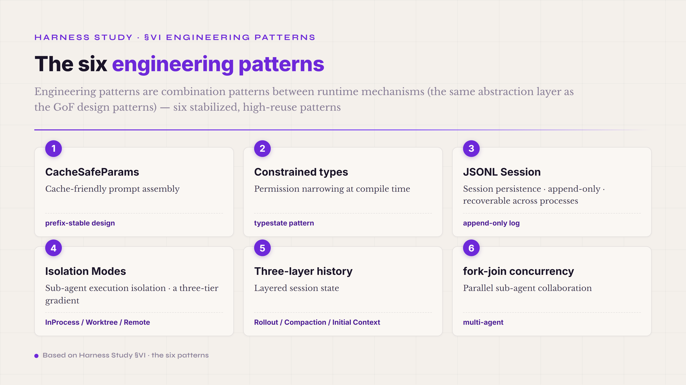
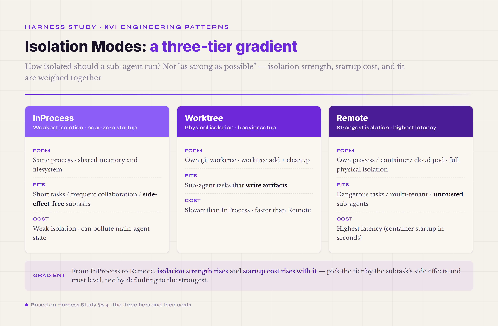
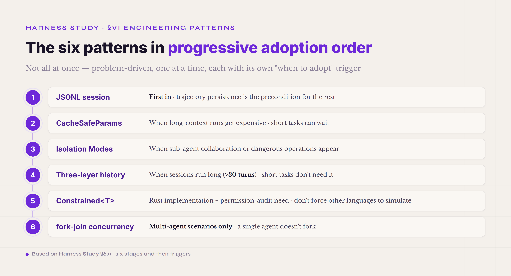

# §VI · Engineering patterns — cross-part reusable engineering combinations

Section V walked through the eight runtime mechanisms and the Safety control plane one at a time. A production agent harness, though, is not a pile of mechanisms. It runs as two layers stacked together: the mechanisms, and the engineering patterns that combine them. An engineering pattern is one size smaller than a mechanism — not a complete component, but a recurring way of wiring components together, reused across several runtime parts. This chapter pulls those high-reuse patterns out of agent harness practice and gives them their own treatment.

Engineering patterns are the same kind of abstraction as design patterns: take a problem-plus-solution that keeps recurring in practice and distill it into a reusable shape. GoF systematized 23 object-oriented patterns in 1994 (Singleton, Observer, Factory, and the rest) so later engineers would not have to reinvent them. Agent harness engineering is accumulating its own pattern sequence. As of 2026 the industry is still converging, with nothing like the GoF naming consensus, but several patterns already recur across Claude Code, Codex, OpenHands, and the other mainstream harnesses. This chapter expands six that have stabilized. The first five are industry consensus: CacheSafeParams, Constrained types, JSONL Session, Isolation Modes, and three-layer history. The sixth, fork-join concurrency, is the combination pattern for multi-agent work, and the Safety chapter already pointed to it.

*Figure 6.1 · The six cross-part reusable engineering patterns*

The boundary between a pattern and a runtime mechanism is worth keeping sharp. **A runtime mechanism is a component the agent actually uses within a turn**: Tool Registry, Verifier, Trajectory are mechanisms. **An engineering pattern is a combination between mechanisms**: how to assemble the prompt so the prompt cache can hit (CacheSafeParams spans three parts — Prompt Assets, Model Adapter, and Context), or how to encode tool permissions so a wrong call is stopped at compile time (Constrained types span two — Tool Registry and the Safety control plane). A pattern is not a component. It is distilled experience about how components fit together. By the end of this chapter you should know what the common combinations look like, well enough to recognize and reuse them in a production agent.

#### 6.0 Terms first used in this section

Terms already explained in §I–§V (runtime mechanism, cache, Tool Registry, Trajectory, sandbox, fork-join, and so on) are not repeated. Listed here are only the terms that appear for the first time in §VI.

**Core engineering-pattern terms** — **engineering pattern** (a combination pattern reused across several runtime parts · the same abstraction layer as the GoF design patterns · still converging in 2026, with no standard naming yet). **prefix-stable design** (the core cache-aware pattern behind the prompt caches at Anthropic, OpenAI, and others · keep the prompt prefix byte-identical across turns so the cache can hit · [Prompt caching · Claude API Docs](https://platform.claude.com/docs/en/build-with-claude/prompt-caching)). **cache-safe forking** (Anthropic Claude Code's compaction pattern · keep the system prompt, tools, and prefix unchanged and append the summary at the end, so the cached prefix still hits after compaction · [How Claude Code uses prompt caching](https://code.claude.com/docs/en/prompt-caching)).

**Constrained-type terms** — **typestate pattern** (a mainstream Rust pattern · encode runtime state into compile-time types, so an invalid state transition cannot be expressed in code · [The Typestate Pattern in Rust · Cliffle](https://cliffle.com/blog/rust-typestate/)). **phantom type / PhantomData** (a zero-sized marker type · takes no memory · marks a relationship at compile time without existing at runtime · [Phantom Types in Rust · Ben Ashby](https://www.benashby.com/phantom-types-in-rust/)). **compile-time enforcement** (constraints enforced by the compiler, as opposed to runtime checks · code that violates them does not compile at all · one notch less bypassable than a runtime check).

**JSONL Session terms** — **JSONL session file** (the persisted event stream of one agent run · one JSON event per line · append-only · recoverable across processes · Claude Code's default session format and Codex's Rollout format · the Trajectory chapter already covered the event taxonomy; this section covers the session as a reusable pattern). **append-only** (writes may only append; history is never modified · keeps the trajectory tamper-proof and diffable).

**Isolation Modes terms** — **execution isolation** (how far an agent running a task is separated from the physical working directory · a three-tier gradient: InProcess, Worktree, Remote · §6.4 expands). **git worktree** (a native Git mechanism · one repo, several working directories · the agent runs in its own worktree without touching the main branch, then merges or discards).

**Three-layer history terms** — **three-layer history** (a pattern for layering an agent session's internal state · the three layers are Rollout, Compaction, and Initial Context · each layer gets its own compaction, cache, and persistence policy · the industry source is OpenAI Codex, `core/src/session/turn.rs`). **Rollout layer** (the full session history · append-only · the complete turn-by-turn record · recoverable across processes · Codex, Claude Code, OpenCode, and the other mainstream CLI agents all persist it as append-only JSONL). **Compaction layer** (the summarized history · updated on a rolling basis · early turns compressed, recent turns kept whole · keeps the prompt context inside budget on long sessions). **Initial Context layer** (the invariant context — system prompt, project metadata, tool set · unchanged across turns · paired with prefix-stable design so the prompt cache hits).

**fork-join terms** — **fork-join concurrency** (the main agent splits a task across several sub-agents running in parallel, then aggregates the results back · the mainstream multi-agent pattern · also the core framing of Anthropic's multi-agent research report). **provider-adaptive concurrency slots** (different model providers grant different API rate limits, so the number of sub-agents that can run in parallel differs per provider · the pattern schedules sub-agents against each provider's concurrent slots so the rate limit is never exceeded).

#### 6.1 CacheSafeParams · cache-friendly prompt assembly

**The first engineering pattern**: how the prompt is assembled directly decides the prompt-cache hit rate, and the hit rate decides what the agent costs and how fast it feels. **prefix-stable design** is the pattern the industry converged on in 2026. CacheSafeParams is its internal name; "cache-aware parameter passing" is what the industry calls it. The substance is the same.

What problem does it solve? Prompt caching is a latency optimization that Anthropic, OpenAI, DeepSeek, and the other providers all run. When the same prompt prefix shows up repeatedly, the provider caches the intermediate state, and later requests reuse it at a fraction of the cost. Anthropic's official numbers put the latency saving at up to ~85% on a hit, with cached tokens priced at 0.1x base input, roughly a 90% discount. The catch is that the hit condition is strict: **the prompt prefix must be byte-for-byte identical** ([Claude API Prompt Caching Docs](https://platform.claude.com/docs/en/build-with-claude/prompt-caching)). One different byte and the cache misses. So a harness that assembles prompts without cache-aware design misses on every turn, and the agent is slow and expensive to run.

The core move of prefix-stable design is to **split the prompt into a stable segment and a changing segment**. The stable parts (system prompt, tools registry, few-shot examples) go in front. The changing parts (the current task, the latest user input, recent turn history) go at the end. Across turns the stable front never changes, so the cache hits, and only the tail extends it. Claude Code pushes this one step further into **cache-safe forking**: when context compaction triggers (Turn 11 of the 17-turn end-to-end example), compaction does not rewrite the prompt prefix. It appends the summary at the end, so the cached prefix still hits after compaction ([How Claude Code uses prompt caching](https://code.claude.com/docs/en/prompt-caching)).

Three implementation details are worth spelling out. First, **the model is part of the cache key**. Switching models (a Flash → Pro escalation, say) invalidates the whole cached prefix, because each model has its own cache pool. This reframes the escalation decision: it is not just "move to a stronger model"; it also has to weigh the cost of losing the cache. Second, **the tools are part of the prefix**. Adding one tool, or editing one tool description, invalidates everything cached after that tool. This is what turns the Tool Registry's `select_for(query)` dynamic subsetting (covered in the Tool Registry chapter) into a cache problem: a changing subset means a miss. The pattern is to put the stable subset of general tools in front and the task-specific subset behind it, so the stable part is reused across turns. Third, **every byte of the content matters**. JSON field order, whitespace, newlines, and encoding (UTF-8 vs UTF-16) all affect the cache. The harness should therefore standardize its serializer, by pretty-printing or fixing the key order, until the serialized output is byte-for-byte stable.

**Providers expose caching in different shapes, and DeepSeek-style automatic prefix caching needs its own adaptation.** The cache_control breakpoints and cache-safe forking above are the Anthropic road; not every provider does manual cache management. **DeepSeek runs Context Caching on Disk**: on by default for every user, no code change, the client never sends `cache_control` at all. The backend decides hits by automatic prefix matching — a request hits only when it exactly matches a cached prefix unit, storage is in 64-token units, and anything under 64 tokens is not cached ([DeepSeek API · Context Caching](https://api-docs.deepseek.com/guides/kv_cache) · [the 2024-08 release announcement](https://api-docs.deepseek.com/news/news0802)). This is the mirror image of Anthropic's explicit cache_control breakpoints (at most 4): one is fully automatic on the backend, the other is manual client opt-in. The interface is easier to live with, but the prefix-stability discipline is exactly as strict, since a hit still requires whole-unit prefix matching. Two adaptation points follow. First, **keep the system prompt completely static within a session**. The system prompt is the very front of the prefix, and any per-request field inside it (a date, a timestamp, dynamic state) invalidates the entire cache from the top. The countermeasure is to sink that information either into an independent segment at the end of the system prompt or into the first user message. In the first case, everything before that segment still hits, and only that one line is recomputed. Second, **stay strictly append-only**. Rewriting the conversation prefix (replacing early history with a summary, shifting the prefix's position) is the most insidious cache killer: the first round after compression misses across the board. Three countermeasures. Fix the summary's anchor — after the first compaction its position never moves again, and everything later appends at the tail. Summarize only the newest output instead of rewriting history. And let prompt trimming delete, never reorder.

**The cross-turn handling of reasoning_content is an easy place to get burned, and there is no one-size answer.** The official contract is the baseline. deepseek-reasoner returns a 400 if the input carries reasoning_content, so it must be deleted before the next turn. deepseek-v4 thinking mode (flash and pro alike) **requires reasoning_content to be passed back in full on tool-call turns**, returns a 400 otherwise, and silently ignores it on non-tool turns ([DeepSeek API · reasoning model](https://api-docs.deepseek.com/guides/reasoning_model) · [thinking mode](https://api-docs.deepseek.com/guides/thinking_mode)). On top of that baseline sits a real tradeoff. Per the DeepSeek-V4 technical report's Interleaved Thinking, keeping reasoning across turns in tool scenarios maintains the cumulative chain of thought a long-horizon agent needs, which is a real benefit. But reasoning inside the prefix occupies billable prompt tokens, and it can disturb cache stability. **The reasonix agent ("engineered around prefix-cache stability") picked the opposite side**: strip reasoning_content when passing back (it is a response-only field; don't pay to resend it), compensate with thought harvesting, which distills the reasoning into structured state before use, and put cache stability plus token savings above reasoning accumulation ([esengine/DeepSeek-Reasonix](https://github.com/esengine/DeepSeek-Reasonix)). One pitfall here: if a relay or proxy (litellm and claude-code-router have both reported this) naively strips reasoning_content on a **tool turn**, it walks straight into that 400. Strip only on non-tool turns, or pair the strip with harvesting. Never blind-delete.

The applicability boundary deserves to be kept clean. **Where it fits**: long-context agent tasks, where context accumulates across turns; high-frequency short-turn agents, where the per-turn savings add up; large system prompts in the Claude Code style, 1000+ tokens. **Where it does not**: short single-turn tasks, where the cache never accumulates value; tasks whose context changes heavily every turn, where the cache always misses and the pattern only adds complexity for no return; providers without a prompt cache, such as some early open-source models, or stacks that only do KV cache without prefix caching.

The measured payoff in multi-agent settings deserves its own paragraph. **Claude Code wraps five fields into a `CacheSafeParams` data structure**: systemPrompt, userContext, systemContext, toolUseContext, forkContextMessages. When a sub-agent starts, it **inherits the parent agent's cache prefix** through CacheSafeParams. Instead of recomputing the system prompt and tools registry, it reuses the prefix the parent already has cached, which saves a sizable share of the sub-agent's cost relative to starting cold. This is the largest engineering payoff of cache-aware design in multi-agent settings. It is also why the mainstream CLI harnesses treat cache-safe forking as a core invariant of compaction: not merely cheaper cache hits, but the thing that makes multi-agent forking affordable at all.

#### 6.2 Constrained types · narrowing permissions at compile time

**The second engineering pattern**: encode tool permissions into compile-time types, so that an invalid permission call cannot even be written, with no runtime check needed as the backstop. The industry name is the **typestate pattern** ([the classic Cliffle writeup](https://cliffle.com/blog/rust-typestate/) · [Microsoft RustTraining book Ch 3](https://microsoft.github.io/RustTraining/rust-patterns-book/ch03-the-newtype-and-type-state-patterns.html)). OpenAI Codex uses it in its source to wrap tool permissions, under the name `Constrained<T>`. This section teaches the industry name and brings in Codex as the worked case.

The problem it solves: the Tool Registry hands the agent a tool set, and the tools carry different permissions — read-only, workspace-write, dangerous. Do this with runtime checks, asking "do you have this permission?" before every call, and the checking logic scatters across the codebase, where it is easy to miss a spot, easy to bypass, and a cost on the hot path. The typestate pattern moves the permission into **the tool's type**. `Tool<ReadOnly>` and `Tool<WorkspaceWrite>` are two different types (`git_status: Tool<ReadOnly>`, `write_file: Tool<WorkspaceWrite>`), and the harness dispatcher only accepts tools whose type matches the current permission mode. Code with a mismatched type does not compile.

In Rust the core mechanism is the **phantom type, PhantomData**: a zero-sized marker that takes no memory and does not exist at runtime, participating only in compile-time type checking. **What compile-time enforcement buys**: invalid states cannot be written down, no runtime check is needed, the overhead is zero, and an audit only has to review type signatures to know the permission boundaries. Three of its values carry over to the agent harness. First, permission gating cannot be bypassed by the one code path that forgot to check; the typestate pattern is among the countermeasures to AP13 Hook Bypass in the Safety pitfalls. Second, when the tool set changes, the IDE flags errors immediately, so a contributor unfamiliar with the permission boundaries cannot mis-call a dangerous tool. Third, the audit log lines up with the permission boundary, because the permission is a type, and types are visible in the compiled artifact's metadata.

A few implementation details. First, **mark the permission mode with a phantom type**. Rust uses three tiers — `Tool<ReadOnly>`, `Tool<WorkspaceWrite>`, `Tool<Dangerous>` — and the ToolPolicy registry exposes the matching subset per mode. An agent running in ReadOnly mode sees only the `Tool<ReadOnly>` set, and if it cannot see the dangerous tools' types, it cannot call them. Second, **model state transitions explicitly**. `Tool<Unverified>` becomes `Tool<Verified>` through `verify()`, and a tool that never passed verification cannot be called; that is a compile error. Third, **make elevation an explicit ceremony**. Temporarily granting a tool higher permission must go through `Tool<ReadOnly>::elevate(approval_token) -> Tool<WorkspaceWrite>`, where the approval_token is an unforgeable credential issued by HITL approval. Code without the token cannot elevate.

Where the pattern does not apply has to be said plainly. **Typestate leans hard on the strength of the language's type system.** Rust, Haskell, OCaml, and partly TypeScript can express it in full. Python, JavaScript, Go, and other languages with dynamic or limited type systems can only simulate it with runtime checks, and the compile-time guarantee is gone. That non-portability is the pattern's engineering limit, and it belongs in the language and framework decision. OpenAI Codex wrote its harness in Rust partly to get typestate's compile-time guarantees. Claude Code, written in TypeScript, simulates typestate with branded types, a weakened version that still gets IDE static checking.

The industry comparison is instructive. **OpenAI Codex uses the `Constrained<T>` newtype pattern** to encode tool permissions and the Safe, Write, and Dangerous tiers into types, paired with the three-tier `AskForApproval` that triggers HITL approval — one of the core invariants of the Codex Rust implementation. **OpenCode is written in Go**, whose type system is a notch weaker than Rust's and cannot carry full typestate. It takes the runtime road with interfaces and role-based checks, and puts the permission policy into SQLite session storage so audits can query it ([opencode-ai/opencode GitHub](https://github.com/opencode-ai/opencode) · [OpenCode Docs](https://opencode.ai/docs/cli/)). **OpenHands, in Python, simulates permissions with runtime checks and decorators**: no compile-time guarantee, everything resting on import-time and call-time checks ([OpenHands Agent Control Plane](https://www.openhands.dev/blog/agent-control-plane)). Three implementation strengths, strong to weak: Rust at compile time, Go at semi-runtime with persistence, Python at pure runtime — tracking type-system strength directly. This framing matters when picking a harness language. The choice is not just performance and team preference; the compile-time guarantee on the Safety boundary is a real constraint too.

#### 6.3 JSONL Session · session persistence

**The third engineering pattern**: write an agent run's entire event stream into one JSONL file. One JSON event per line, append-only, recoverable across processes. The mainstream CLI agents all run this pattern. Codex's Rollout, Claude Code's sessionStorage, and OpenCode's SQLite-backed session are different implementations of the same thing.

The problem: an agent run produces a large stream of events (the Trajectory chapter covered the taxonomy in detail), and they have to be persisted before trajectory replay, debugging, audit, or self-evolution can happen. The format has a few options. A single JSON file works for short runs reviewed by people; SWE-agent uses it. JSONL append-only fits long runs at production volume; it is the industry mainstream. A database serves structured-query scenarios; OpenCode uses SQLite. JSONL append-only is the consensus engineering default, and three advantages made it so.

The first is **append performance**. Appending is the cheapest write a filesystem offers: no seek, no rewrite. Appending a 1KB event usually takes under 1ms, and a long run accumulating thousands of events still does not touch turn latency. The second is **streaming recovery**. When a run dies mid-way (power loss, process crash), the JSONL file is already written through line N, and a restart picks up from line N+1 without replaying the session. Recovery is usually fast enough that the user barely notices; this is the road CLI agents across the industry generally take. The third is **git-diff friendliness**. Each line is an independent JSON object, so a cross-turn diff shows only the added lines, unlike a JSON file where changing one key reshuffles the whole file. That is what lets a trajectory live in git, with cross-commit audits, collaboration, and replay on top.

A few implementation details are worth spelling out. First, **entry taxonomy**. JSONL is not one event type; implementations usually classify entries into 5–8 classes. Claude Code uses five: TranscriptMessage (user and assistant messages), FileHistorySnapshot (file-state snapshots), ContextCollapseCommit (compaction events), ContentReplacement (context content replacement), AttributionSnapshot (artifact attribution). Each class has its own schema, and deserialization dispatches on the type field. Second, **bounded with spillover** for long sessions. The session file cannot grow without limit, so implementations put a line or byte cap on it, with automatic truncation, a warning, and guidance to split. That keeps an unbounded session file from dragging down the agent's restart. Third, **cross-session linkage**. One long task can span several session files, with the previous session's compaction summary becoming the next session's initial context, linked through a session-id chain and summary checkpoints.

Where the value finally lands: **cross-run audit and replay both depend on it**. The Trajectory chapter called the trajectory the harness's first-class data, and JSONL session persistence is what makes "first-class" concrete. The session file is not just a debugging aid. It is the audit log, the training data, and the self-evolution input of an agent run: three identities in one carrier.

#### 6.4 Isolation Modes · sub-agent execution isolation

**The fourth engineering pattern**: how far a sub-agent's execution is physically separated from the main agent's working directory, in a three-tier gradient the industry has mostly settled on. The thinking is the same family as the sandbox isolation in the Safety chapter, but the object differs: the sandbox isolates the agent from the host system; Isolation Modes isolate the sub-agent from the main agent.

The three tiers are **InProcess, Worktree, and Remote**.

*Figure 6.2 · The three isolation modes for sub-agent execution*

**InProcess** — the sub-agent runs in the main agent's own process, sharing memory and filesystem, separated only by a logical agent boundary. This is the lightest mode: spawning costs almost nothing, and data structures are shared directly. It fits short tasks, high-frequency collaboration, and side-effect-free subtasks — say, a sub-agent that only reads the main agent's context and returns review comments, writing nothing. The price is weak isolation. A sub-agent gone wrong can pollute the main agent's state, and concurrent sub-agents need care with thread safety.

**Worktree** — the sub-agent runs in its own git worktree, physically separated from the main agent's working directory. git worktree is a native Git mechanism: one repo, several working directories, sharing one .git. The sub-agent runs its experimental changes on an independent branch, and the result is merged or discarded when it finishes, while the main agent's working directory stays untouched. Claude Code keeps sub-agent worktrees under `.claude/worktrees/<agent-id>/`, keyed by sub-agent ID. This mode fits sub-agent tasks that write (editing files, running builds, running tests) and need an independent workspace that cannot pollute the main agent. The price is a heavier setup: every spawn needs a git worktree add, every finish needs cleanup. Slower than InProcess, faster than Remote.

**Remote** — the sub-agent runs in its own process, container, or cloud worker pod, fully separated from the main agent. OpenHands Agent Control Plane recommends the K8s container road at enterprise scale: each sub-agent run in its own container, with per-container resource quotas and network policy. Isolation is strongest here. The sub-agent can crash, blow its memory, or overstep its permissions without touching the main agent, so the mode fits dangerous tasks, multi-tenant deployments, and untrusted sub-agents: a task spec supplied by an untrusted user, or a sub-agent built on third-party plugins. The price is the highest latency of the three: container startup measured in seconds, cross-process communication, and serialization on every data handoff.

Choosing among the three comes down to a short checklist. Does the sub-agent write artifacts? If not (read-only, advice only), InProcess. If it writes, Worktree or Remote. How much do you trust it? A sub-agent the main agent spawned itself rates high: Worktree. A user-supplied task spec or a third-party plugin rates low: Remote. What is the deployment? For local development with a single user, Worktree is enough; for enterprise multi-tenant, Remote containers are mandatory. OpenCode handles this through its client/server architecture: the server picks Worktree or Remote per deployment mode, and the choice is transparent to the client ([OpenCode v1.3.3 Deep Dive · sanj.dev](https://sanj.dev/post/opencode-deep-dive-2026)).

#### 6.5 Three-layer history · layering session state

**The fifth engineering pattern**: manage session state in three layers, split by rate of change and persistence policy, instead of one array holding all the history. The industry source is OpenAI Codex, which in `core/src/session/turn.rs` explicitly splits session history into Rollout, Compaction, and Initial Context, each layer with its own compaction, cache, and persistence policy.

The problem: early harnesses kept session history in one array — user messages, assistant replies, tool calls, tool results, system notes, all in one pile. That works for short sessions and falls apart on long ones, 10+ turns and 100K+ tokens. Context keeps swelling, the cache keeps missing, nobody can say which span compaction should compress, and cross-session reuse has nothing to anchor on. Three-layer history splits the history by abstraction level and gives each layer its own engineering policy.

**Layer one, Rollout** — the full session history. The complete turn-by-turn record, append-only, recoverable across processes. This layer is the ground truth for audit, replay, and debugging, and no detail may be dropped from it. It persists as append-only JSONL (the JSONL Session pattern above) and takes no part in prompt assembly. Rollout is where every event finally lands. But the agent's next turn does not read Rollout; it reads the context that Compaction produced.

**Layer two, Compaction** — the summarized history. Early turns from the Rollout are LLM-summarized into this layer, which updates on a rolling basis while recent turns stay whole. This is the context that actually enters the next turn's prompt. The strategies differ by harness. Claude Code runs AutoCompact, threshold-based, with a default 70% token threshold adjustable through `CLAUDE_AUTOCOMPACT_PCT_OVERRIDE`, plus MicroCompact, time-based, where tool results expire individually by retentionMs across 8 COMPACTABLE_TOOLS: FILE_READ, SHELL, GREP, GLOB, WEB_SEARCH, WEB_FETCH, FILE_EDIT, FILE_WRITE. Codex triggers on turns and on budget, a dual trigger. And one invariant sits at the core of the whole pattern: **compaction must not break the cache prefix**. The compacted context has to join Initial Context into a cache-friendly prefix; otherwise every compaction invalidates the cache, and the compaction costs more than it saves.

**Layer three, Initial Context** — the invariant context: system prompt, project metadata (CLAUDE.md, AGENTS.md, the project README), tool schemas, everything that does not change across turns. It sits at the very front of prompt assembly, paired with prefix-stable design to push the cache hit rate as high as it goes. It almost never changes: unless the user edits CLAUDE.md or adds a new tool, it is stable across the whole session. That stability lets the provider's cache reuse it across sessions, not just within one.

The engineering value is that **each layer gets its own optimization space**. Rollout optimizes audit and storage: JSONL compression, archiving, cross-session chains. Compaction optimizes prompt assembly: thresholds, the choice of summarizer model, how many recent turns to keep. Initial Context optimizes the cache: prefix stability, cross-session sharing. Mix the three into one structure and every optimization fights the others. Touch compaction and the cache misses; touch the cache and the audit goes incomplete; touch the audit storage and prompt latency moves. Separate them, and each can be engineered on its own — so the harness evolves across releases with less risk.

The mainstream CLI agents are all on this road. Not all of them use the names Rollout, Compaction, and Initial Context (that naming and that exact cut are Codex's framing), but OpenCode and the mainstream frameworks run the same layering under slightly different terms.

#### 6.6 fork-join concurrency · parallel sub-agent collaboration

**The sixth engineering pattern**: the main agent splits a task across several sub-agents running in parallel, then aggregates their results back. This is the pattern the Safety chapter pointed to earlier, where its two Safety-side constraints were already settled: the approval mode must propagate from parent to child, and sub-agent depth and token budget need hard caps. This section expands the engineering implementation.

The problem: a single agent on a long task (>30 turns) runs into a familiar set of troubles. Context accumulates past budget, the reasoning path is serial and slow, and one failure can roll back the entire session. fork-join splits the big task into parallelizable pieces; the sub-agents each run their own, the results come back, and the main agent decides. In theory this buys a 2–5x throughput gain, depending on how parallelizable the task is. **But fork-join is not free**: multi-agent burns about 15 times the tokens of an ordinary chat, and the amplification comes from orchestration. The Multi-Agent Over-Decomposition section already took apart where the tokens go and why coding tasks in particular are a bad deal. This section does not repeat that accounting. It covers what it actually takes to put fork-join into production.

Four mechanisms matter. First, **the fork trigger**: at which decision point does the main agent spawn? Two mainstream roads. An explicit tool call, where the main agent calls a `spawn_subagent` tool and names the sub-agent's task (Claude Code's road); or an implicit LLM decision, where the main agent concludes during reasoning that the task suits a sub-agent and spawns on its own (Codex's road). Second, **the sub-agent's task boundary**: what context does it receive, and what does it return? The mainstream shape: the main agent hands over a task spec as a natural-language description, pointers to the key artifact_ids, and a tools subset; the sub-agent runs to completion and returns a final answer plus its full trajectory. Third, **aggregation**: how do several sub-agents' results merge? Simple cases concatenate — each sub-agent contributes a summary, and the main agent reads them all. Complex cases run LLM-as-aggregator: the main agent uses an LLM to merge the results into one coherent answer. Fourth, **error propagation**: what happens when a sub-agent fails? The mainstream is graceful degradation. One sub-agent fails, the successful results still reach the main agent, and the main agent decides whether to retry the failed one. Not fail-fast: aborting everything on one failure throws away the successful sub-agents' work.

**Provider-adaptive concurrency slots** are a mandatory consideration once fork-join goes to production. Providers grant different rate limits (RPM and TPM quotas by usage tier), and how many sub-agents can run in parallel is implied by those quotas; there is no uniform fixed concurrency. Spawn sub-agents without scheduling against the provider's current limits and the system runs into throttling. The mainstream countermeasure is a **dynamic slot pool**. The harness keeps a pool of provider × concurrent_slot; a spawning sub-agent takes a slot, a finishing one returns it, and when all slots are taken, new spawns queue. The sub-agent count never exceeds what the provider currently allows, so the system degrades gracefully under throttling instead of surfacing raw 429s.

When to use fork-join at all matches the judgment line from the Safety pitfalls. At ≤30 turns, a single agent in a single process is enough. At 30–60 turns, use multi-agent warily: there must be a demonstrated bottleneck a single agent cannot pass. Above 60 turns, multi-agent becomes worth considering, and the guardrails are mandatory: a sub-agent depth cap (≤2–3), a token budget cap, and early abort. The line is not arbitrary; it is worked backward from Anthropic's measured 15x cost data. OpenCode sits at the conservative end of this tradeoff. It ships two cooperating agents, Build with full access and Plan read-only, and does not fork deep sub-agents — another defensible position on the multi-agent overhead curve.

#### 6.7 Common pitfalls · three typical classes

Three pitfall classes account for most failures in putting patterns into production. This section spells them out, one by one, so you can recognize them in the field.

**Class one · fake landing.** The pattern is in the repo, in the README, in the design doc — and never takes effect on the production runtime path. This shares its root with AP06 in the Safety chapter: the wiring between the configuration layer and the runtime layer is missing. The root cause and the three checks (does the pattern fire in the trace, does changing its configuration change behavior, does an on/off benchmark show a difference) were covered there and are not repeated. What is worth adding is the wiring break specific to engineering patterns, which is easier to hit here than on the Safety control plane, because a pattern is "this is how it should be designed," not "designed this way, therefore running." The typestate code is all written, but the ToolPolicy registry never dispatches on the phantom type, so the agent can still call a dangerous tool. CacheSafeParams is defined, but the Model Adapter assembles prompts without the stable prefix, so the cache still misses 100% of the time.

**Class two · over-abstraction.** The pattern delivers its benefit but abstracts away too much, and the code stops being readable, debuggable, or evolvable. The mechanism-level root cause is **the pattern treated as the goal instead of the tool**. An engineer wraps every tool in typestate in order to "use the typestate pattern," including read-only tools that need no permission tiers at all, and the code bloats. On the data side, industry experience is that some of the pattern applications in production agent projects are over-engineering: take them out and nothing changes. Three checks. Does the pattern solve a concrete case in this codebase (a specific bug, attack surface, or performance problem)? If the only answer is "it looks more elegant," that is over-abstraction. Does removing it degrade anything (a compile failure, a test failure, a lost feature)? If nothing degrades, it is an ornament. And how long does a new contributor need before changing code? When the patterns are thick enough that a newcomer reads for a week to change one line, that is the signal.

**Class three · silent try/catch.** The pattern's happy path is built, the error path swallows the exception, and the pattern silently stops working exactly on the error cases. The root cause is **error handling treated as an afterthought of pattern application**. CacheSafeParams fails to load and falls back to unsafe params, with no log and no alarm; a Constrained\<T\> type conversion fails, the catch substitutes a default permission, and nobody knows a downgrade happened. The countermeasure is to model every pattern's error path explicitly, log it without exception, and allow no silent fallback. Rust forces propagation with Result and `?`; Go checks error returns explicitly; Python uses typed exceptions. The companion project of this tutorial hit a concrete case here, and its poison-safe lock fix has become the positive contrast for this section. The original lock implementation left the lock state poisoned after a panic, and the runtime took a silent fallback. The fixed version propagates the error explicitly and degrades gracefully one layer up, so a lock poison shows clearly in the audit trail.

Together, the three classes are the core warning of §VI. A pattern does not take effect by being written into the code. It takes fake-landing detection, an abstraction audit, and explicit error-path modeling — all three — before a pattern is genuinely production-grade.

#### 6.8 Industry implementations

The mainstream harnesses weight these six patterns differently.

**Codex (OpenAI)** takes the strongly typed Rust road. Constrained\<T\> typestate is a core invariant; the three-layer history (Rollout, Compaction, Initial Context) is the base of session management; the Rollout persists as append-only JSONL; fork-join runs on implicit LLM decisions. Part of why Codex chose Rust is precisely to give typestate and phantom types a compile-time guarantee, with no runtime check to depend on. The strength of Rust's type system is what lets the Constrained\<T\> ceremony be written at all; Python or JavaScript could not express it.

**OpenCode (open source)** takes the client/server, multi-provider road: a Go TUI with a Bun/JS HTTP server, SQLite as session storage in place of JSONL (friendlier to structured queries, at the cost of some git-diff friendliness), 75+ provider adapters behind one interface, and two built-in agents, Build with full access and Plan read-only, in a light fork-join. Being open source, its pattern implementations are publicly readable; any team can fork the repo and study them. Its tradeoffs run opposite to Codex's — Codex is strong types plus a single provider, OpenCode is multi-provider plus runtime checks — and both roads carry their own costs.

**Claude Code** takes the flexible TypeScript road: branded types simulating typestate, sessionStorage persisted as JSONL, a dozen-plus Hook events open to user extension, and Forked Agents with the three-tier Isolation Modes. In the engineering depth of these patterns Claude Code has been one of the industry's pioneers. One caution though: **the version publicly leaked in 2026-03/04 had been visibly dumbed down and simplified**. Its code details cannot be read as a SOTA benchmark; treat it as an older case of the industry having walked this road. The closed versions since are not visible from outside; the official docs and blog are all there is to infer from.

**OpenHands (open source)** takes the Python-plus-K8s road. Python's type system is weak, so typestate is simulated with runtime checks and decorators. But the Remote Isolation Mode is strong, with K8s containers supplying physical isolation that makes up for the weak language-level guarantee ([OpenHands Agent Control Plane](https://www.openhands.dev/blog/agent-control-plane)). It is a working demonstration of compensating for a language with the deployment architecture.

The overall 2026 trend: **the patterns are converging but not yet standardized**. Cache-aware design in the CacheSafeParams family is general consensus; typestate is mainstream among Rust harnesses; JSONL session is a de facto standard. But the three isolation tiers, the three-layer naming, and the fork-join details still differ across implementations. That unsettledness means §VI evolves faster than §V's runtime mechanisms: over the next 2–3 years a few patterns may be added, and a few may be culled. Read this chapter to build a mental model of engineering patterns, not to collect a permanent SOP.

#### 6.9 Getting started · four dimensions

**What to watch.** The biggest trap in adopting patterns is **chasing the trend instead of the problem**: seeing a SOTA harness use typestate and adopting typestate, without ever asking "does my project have the concrete problem typestate solves?" Trend-chasing turns patterns into ornaments that drag the engineering down. The warning signs, concretely. A pattern lands and no observable metric improves (latency flat, cost flat, bug count flat): the ornament red flag. Onboarding time grows by more than the pattern's benefit is worth: the over-engineering red flag. The pattern does not match the project's language, runtime, or deployment — typestate forced into a Python project, three-layer history forced onto short-session tasks: the mismatch red flag.

**How to design.** Choose patterns problem-driven, and introduce them progressively. Putting all six into production on day 1 is over-engineering, and unmaintainable besides. The mainstream order of adoption: stage one, JSONL session — first in, because trajectory persistence is the precondition for the rest. Stage two, CacheSafeParams — when long-context agent runs get expensive; short tasks can wait. Stage three, Isolation Modes — when sub-agent collaboration or dangerous operations enter the picture. Stage four, three-layer history — when sessions run past 30 turns; short tasks don't need it. Stage five, Constrained\<T\> — when the implementation is in Rust and permission audit is a requirement; don't force other languages to simulate it. Stage six, fork-join concurrency — multi-agent scenarios only; a single agent doesn't fork. This progression ties every pattern to a real problem, instead of running all six for the sake of having all six.

*Figure 6.3 · The progressive adoption order of the six engineering patterns*

**How to test.** Every pattern gets a dual track: adversarial tests plus performance benchmarks. Test class one, **the fake-landing test**. Benchmark with the pattern off and on, and look for an observable difference in cost, latency, cache hit rate, or bug count. No difference means the pattern is an ornament. Test class two, **the bypass test**. Drive adversarial input at the pattern's boundary — pass a wrong type at Constrained\<T\>, deliberately mutate the prefix and watch CacheSafeParams' cache hit rate, try to reach the main agent's state across an Isolation Mode boundary — and see whether the pattern holds. Test class three, **the evolution test**. Some time after a pattern ships, watch a newcomer in code review; if they cannot follow the code, that is the early signal of over-abstraction. Test class four, **production trace verification**. Run a representative agent task and count, in the trace, the events each pattern should have fired. A pattern that fires zero times is dead code or a fake landing.

**What prompts to write.** Most of these patterns live in the harness runtime layer, invisible to the agent, so they need little prompting. But a few lines of prompt discipline pair well with the Prompt Assets chapter. First, tell the agent in the system prompt that it runs inside a strongly typed harness: tool calls are type-checked at compile time, a wrong type is a compile error rather than a runtime failure, and the tool boundaries are therefore hard. An agent told this does not try to talk its way around the types. Second, in fork-join settings, put the cost into the prompt: "you may spawn sub-agents, but multi-agent burns about 15x the tokens of an ordinary chat — use it sparingly, and below 30 turns finish the task yourself, without forking." Giving the agent the cost data beats relying on the harness for blanket enforcement. Third, tell the agent its trajectory is fully persisted, auditable afterwards, and used as self-evolution training data. An agent that knows its reasoning is on the record writes more responsible thoughts, not perfunctory ones.

---

The framing of §VI closes on three points. **First** — engineering patterns are combinations between mechanisms, not runtime parts. §V's eight runtime mechanisms and one Safety control plane are the parts an agent runs on; §VI's six patterns are the ways those parts fit together. The patterns sit at the same abstraction layer as the GoF design patterns: distilled engineering practice, not a product feature list. **Second** — the industry in 2026 is converging on these patterns without having standardized them. Codex, OpenCode, Claude Code, and OpenHands each weight them differently. What they share are the six (cache-aware design, strongly typed permissions, JSONL session, tiered isolation, three-layer history, fork-join), while the names, the details, and the tradeoffs differ. **Third** — the core warning for landing them: chase problems, not trends; detect fake landings; model the error paths explicitly. Miss any one of the three and a pattern slides into ornament, and drags the engineering down with it.

These six patterns do not add up to "complete agent harness engineering." They are reusable distillates of practice. Past them, a production harness still faces a long list of project-specific tradeoffs — provider selection, implementation language, deployment architecture, the observability toolchain, CI/CD integration — and those are project-level decisions, not general patterns, so this chapter leaves them alone. What you should leave with is the mental model: which of these patterns your own project can use, in what order to introduce them, and how to keep them clear of the three pitfalls.
