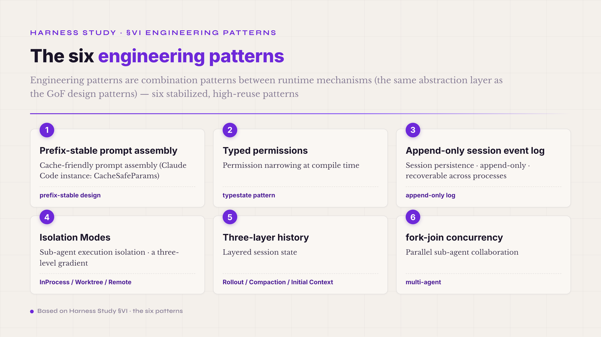
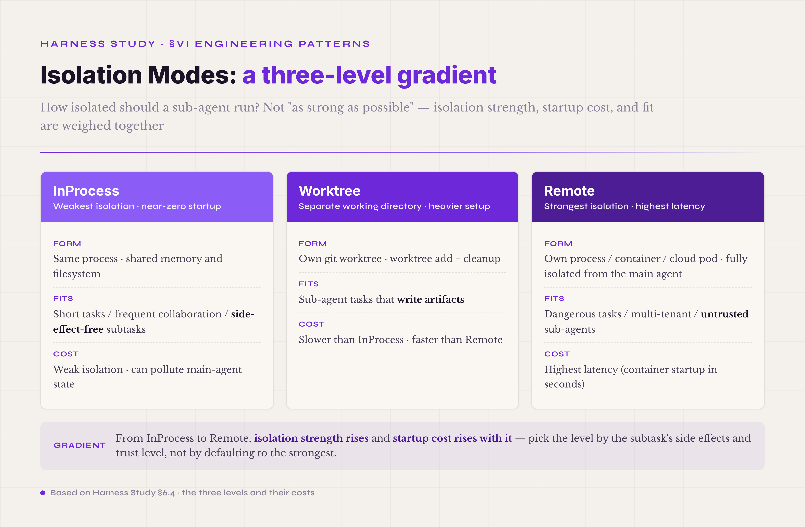
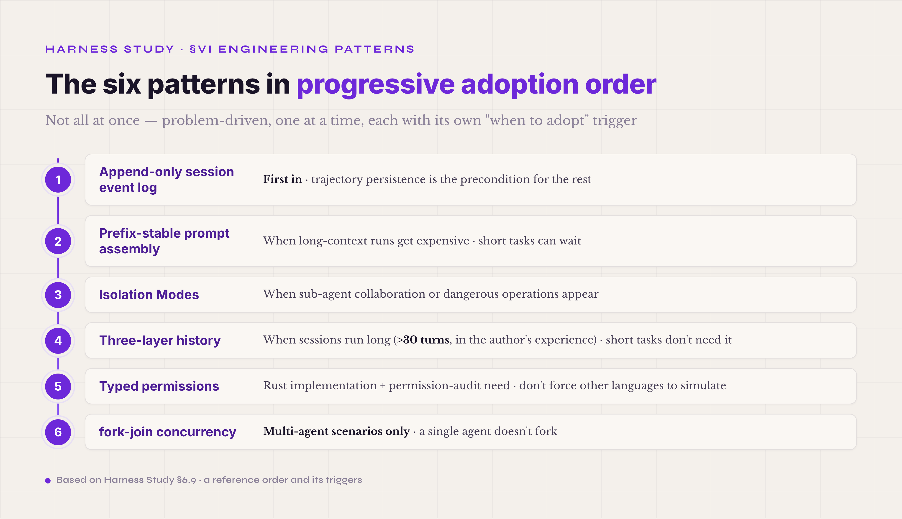

# §VI · Engineering patterns — cross-mechanism reusable engineering combinations

§V walked through the eight runtime mechanisms and the Safety control plane one at a time. A production agent harness, though, is not a pile of mechanisms. It runs as two layers stacked together: the mechanisms, and the engineering patterns that combine them. An engineering pattern sits one level below a mechanism. It is not a complete component but a way of combining components, reused across several runtime mechanisms. This chapter pulls out several patterns that recur in agent harness engineering and get reused heavily, and treats them on their own.

Engineering patterns are the same kind of abstraction as design patterns (GoF): take a problem-plus-solution that keeps recurring in practice and distill it into a reusable shape. GoF systematized 23 object-oriented design patterns in 1994 (Singleton, Observer, Factory Method, and the rest) so later engineers would not have to reinvent them. Agent harness engineering is accumulating similar patterns, but as of 2026 it is still converging, with no commonly accepted names like GoF's. Even so, several patterns already recur across Claude Code, Codex, OpenHands, and other mainstream harnesses. This chapter covers six of the more stable ones in detail. The first five can be seen in several mainstream harnesses:

1. prefix-stable prompt assembly (the instance in Claude Code's source is `CacheSafeParams`);
2. typed permissions (typestate);
3. the append-only session event log (commonly implemented as JSONL files, sometimes as SQLite);
4. the sub-agent execution isolation pattern;
5. three-layer history.

The sixth, fork-join concurrency, is the combination pattern for multi-agent work, and the Safety chapter already mentioned it.

*Figure 6.1 · The six cross-mechanism reusable engineering patterns*

The boundary between a pattern and a runtime mechanism is worth keeping sharp. **A runtime mechanism is a component the agent actually uses in every turn**: Tool Registry, Verifier, and Trajectory are all mechanisms. **An engineering pattern is a way of combining mechanisms**, for example:

- how to assemble the prompt so the prompt cache hits (prefix-stable prompt assembly, which needs three mechanisms working together: Prompt Assets, Model Adapter, and Context);
- how to encode tool permissions so harness developers cannot write code that skips the permission check (typed permissions, which need Tool Registry and the Safety control plane working together).

A pattern is not a component. It is engineering experience about how components fit together. By the end of this chapter you should recognize the common combinations, well enough to spot and reuse them when you build a production agent.

#### 6.0 Terms first used in this chapter

Terms already explained in §I–§V (runtime mechanism, cache, Tool Registry, Trajectory, sandbox, fork-join, and so on) are not repeated. Listed here are only the terms that appear for the first time in §VI.

**Core engineering-pattern terms**

- **engineering pattern**: a way of combining mechanisms that is reused across several runtime mechanisms, at the same abstraction layer as the GoF design patterns. In 2026 the industry is still converging and has no standard names yet.
- **prefix-stable design**: keep the prompt prefix byte-identical from turn to turn, so it hits the prompt cache. The caches at Anthropic, OpenAI, and other providers all match on the prefix; see [Prompt caching · Claude API Docs](https://platform.claude.com/docs/en/build-with-claude/prompt-caching).
- **cache-safe forking**: what Claude Code does at compaction time. The system prompt, the tool set, and the existing prefix stay unchanged, and only the summary is appended at the end, so the cached prefix still hits after compaction; see [How Claude Code uses prompt caching](https://code.claude.com/docs/en/prompt-caching).

**Typed-permission terms**

- **typestate pattern**: a common Rust idiom that encodes an object's state into its type, so an invalid state transition written in code does not compile; see [The Typestate Pattern in Rust · Cliffle](https://cliffle.com/blog/rust-typestate/). It constrains the code developers write, not the data a program receives at runtime.
- **phantom type / PhantomData**: a zero-sized marker type. It takes no memory, marks a relationship only at compile time, and does not exist at runtime; see [Phantom Types in Rust · Ben Ashby](https://www.benashby.com/phantom-types-in-rust/).
- **compile-time enforcement**: the opposite of a runtime check; code that violates the constraint does not compile at all. What it can stop is a wrong code path written by a developer. The compiler cannot see what calls the model makes at runtime.

**Session event log terms**

- **append-only session event log**: the persisted event stream of one agent run, appended to and never rewritten, from which the run can be recovered after a process restart. The common storage is a JSONL file (one JSON event per line; Claude Code and Codex's Rollout both use this format). Some implementations store the events in SQLite instead (OpenCode, for example). JSONL and SQLite are two different kinds of storage, and the text below treats them separately. The Trajectory section of §V covered the event taxonomy; this chapter covers how the session log is reused as a pattern.
- **append-only**: the event stream accepts only appends, and records already written may not be modified. This keeps the trajectory from being overwritten at the application layer and makes it easy to diff.

**Execution isolation terms**

- **execution isolation**: how far an agent running a task is separated from the main working directory. There are three kinds, InProcess, Worktree, and Remote, which §6.4 covers in detail.
- **git worktree**: a native Git mechanism that lets one repository have several working directories. An agent making changes in its own worktree does not affect the main working directory; when it finishes, the changes are merged or discarded.

**Three-layer history terms**

- **three-layer history**: managing an agent session's internal state in three layers (Rollout, Compaction, and Initial Context), each with its own compaction, cache, and persistence policy. The split comes from OpenAI Codex's implementation (`core/src/session/turn.rs`).
- **Rollout layer**: the full session history. It is append-only, records every turn in full, and can be recovered after a process restart. Codex, Claude Code, and other CLI agents store this layer in JSONL files.
- **Compaction layer**: the summarized history, updated on a rolling basis. Early turns are compressed and recent turns are kept whole, so the context of a long session stays within budget.
- **Initial Context layer**: the context that barely changes, such as the system prompt, project metadata, and the tool set. It stays the same across turns and works with prefix-stable design so the prompt cache hits.

**fork-join terms**

- **fork-join concurrency**: the main agent splits a task across several sub-agents that run in parallel, then gathers their results back. This is a common way to organize multiple agents, and it is also the core structure of Anthropic's article on its multi-agent research system.
- **provider-adaptive concurrency slots**: model providers grant different API rate limits, so the number of sub-agents that can run at once differs too. The approach is to schedule sub-agents dynamically against each provider's currently available concurrency slots, so the rate limit is never exceeded.

#### 6.1 Prefix-stable prompt assembly · getting the prompt cache to hit

**The first engineering pattern**: how the prompt is assembled directly decides the prompt-cache hit rate, and the hit rate in turn decides the agent's cost and latency. Prefix-stable design shows up in several mainstream harnesses. In Claude Code's source the corresponding data structure is called `CacheSafeParams` (covered at the end of this section); here it serves only as one instance.

What problem does it solve? Prompt caching is an optimization that Anthropic, OpenAI, DeepSeek, and other providers all offer. When the same prompt prefix shows up repeatedly, the server caches the intermediate computation, and later requests reuse it directly, which cuts cost sharply. Anthropic's official numbers put the latency saving at up to about 85% on a hit, with the cached portion priced at 0.1x the base input price, roughly a 90% saving. The catch is that the hit condition is strict: **the prompt prefix must be byte-for-byte identical** ([Claude API Prompt Caching Docs](https://platform.claude.com/docs/en/build-with-claude/prompt-caching)). One different byte and the cache misses. A harness that assembles prompts without thinking about the cache may miss on every turn, and the agent ends up slow and expensive to run.

The core move of prefix-stable design is to **split the prompt into a stable segment and a changing segment**. The stable parts (system prompt, tool registry, few-shot examples) go in front. The changing parts (the current task, the latest user input, the last few turns of history) go at the end. Across turns the stable front never changes, so the cache hits, and the changing segment follows it. Claude Code pushes this one step further into **cache-safe forking**: when context compaction triggers (the compaction numbered 11 in the §5.11 end-to-end example, which happens between two turns), compaction does not rewrite the prompt prefix. It appends the summary at the end, so the cached prefix still hits after compaction ([How Claude Code uses prompt caching](https://code.claude.com/docs/en/prompt-caching)).

Three implementation details are worth spelling out:

- **The model is part of the cache key.** Switching models (escalating from Flash to Pro, say) invalidates the whole cached prefix, because each model's cache is separate. So the decision to escalate is not just "move to a stronger model"; it also has to count the cost of losing the cache.
- **Tool definitions are part of the prefix.** Adding one tool, or editing one tool's description, invalidates everything cached after it. That forces the Tool Registry's `select_for(query)` dynamic subsetting (covered in the Tool Registry section of §V) to take the cache into account: once the subset changes, the cache misses. The fix is to put the stable subset of general-purpose tools in front and the task-specific subset behind it, so the stable subset is reused across turns.
- **The content is sensitive to byte order.** JSON field order, whitespace, newlines, and encoding (UTF-8 or UTF-16) all affect cache hits. When the harness assembles a prompt it should standardize serialization (fixed indentation and field order) so the serialized output is byte-for-byte stable.

**Providers expose caching differently: adapting to DeepSeek-style automatic prefix caching.** The cache_control breakpoints and cache-safe forking above are Anthropic's approach, but not every provider needs manual cache management. **DeepSeek uses Context Caching on Disk**: it is on by default for every user, needs no code change, and the client never sends `cache_control`. The server decides hits automatically by prefix ("a request hits only when it fully matches a cached prefix unit"; storage is in **64-token units, and anything under 64 tokens is not cached**) ([DeepSeek API · Context Caching](https://api-docs.deepseek.com/guides/kv_cache), [the 2024-08 release announcement](https://api-docs.deepseek.com/news/news0802)). This is the opposite of Anthropic, where the client explicitly declares cache_control breakpoints (at most 4): one is handled fully automatically by the server, the other is opted into manually by the client. DeepSeek's interface is easier to live with, but its demand for prefix stability is just as strict, since a hit requires an exact prefix match. Two adaptation points follow:

- **Keep the system prompt completely static within a session.** The system prompt sits at the very front of the prefix, so any field that changes per request (a date, a timestamp, dynamic state) invalidates the entire cache from the top. The countermeasure is to move that information out of the front of the system prompt, either into a separate segment at its end (the static segments before it still hit, and only that last segment is recomputed) or into the first user message.
- **Stay strictly append-only.** Rewriting the conversation prefix (replacing earlier history with a summary, or shifting the prefix's position) is the most insidious cache killer: the first turn after compaction misses across the board. The countermeasures: fix the summary's anchor, so that after one compaction its position never moves again and everything later appends at the tail; summarize only the newest output, without rewriting the prefix already sent; and when trimming the prompt, delete but never reorder.

Here **the cross-turn handling of reasoning_content is a tradeoff where it is easy to get burned, and no single rule fits every case**. The official contract is the baseline. deepseek-reasoner returns a 400 if the input carries reasoning_content, so it must be deleted before the next request. deepseek-v4 thinking mode (flash and pro alike) **requires reasoning_content to be passed back in full on tool-call turns** and returns a 400 otherwise; on non-tool turns, anything passed back is ignored by the server ([DeepSeek API · reasoning model](https://api-docs.deepseek.com/guides/reasoning_model), [thinking mode](https://api-docs.deepseek.com/guides/thinking_mode)). On top of that baseline sits a real tradeoff. By the DeepSeek-V4 technical report's account of Interleaved Thinking, keeping reasoning across turns in tool scenarios preserves the chain of thought a long-horizon agent accumulates, which is a benefit. But reasoning inside the prefix takes up billable prompt tokens, and it can also affect cache stability. **The Reasonix agent, which describes itself as "engineered around prefix-cache stability," took the other side**: it strips reasoning_content when passing messages back (it is only a response field, so Reasonix does not pay to send it again), then compensates with "thought harvesting," distilling the reasoning into structured state for reuse. That puts cache stability and token savings ahead of accumulated reasoning ([esengine/DeepSeek-Reasonix](https://github.com/esengine/DeepSeek-Reasonix)). There is a pitfall, though. If a relay service or proxy naively strips reasoning_content on a **tool turn** (users have reported this with both litellm and claude-code-router), it runs straight into the 400 above. Strip it only on non-tool turns, or pair the stripping with thought harvesting; never delete it across the board.

Be clear about where the pattern applies and where it does not:

- **Where it fits**: long-context agent tasks (context accumulates heavily across turns); high-frequency short-turn agents (the per-turn cache savings add up); scenarios with very long system prompts (a Claude Code-style system prompt easily runs past a thousand tokens).
- **Where it does not**: short single-turn tasks (the cache never gets a chance to accumulate value); tasks whose context changes heavily every turn (the cache always misses, so the pattern only adds complexity with no return); services without prompt caching (some deployments of early open-source models, for instance, or services that only keep a KV cache within a single request and have no cross-request prefix caching).

The pattern's payoff in multi-agent settings deserves a separate mention. **Claude Code's approach** is a `CacheSafeParams` data structure that wraps five fields: systemPrompt, userContext, systemContext, toolUseContext, and forkContextMessages. When a sub-agent starts, it uses this structure to **inherit the parent agent's cache prefix**. Instead of recomputing stable segments such as the system prompt and the tool registry, it reuses the prefix the parent already has cached. As a result, **the sub-agent costs a sizable amount less than it would starting from scratch**. This is the largest engineering payoff of cache-friendly design in multi-agent settings. It is also one reason Claude Code makes cache-safe forking a core constraint of compaction: beyond saving on cache costs, it makes multi-agent forking affordable.

#### 6.2 Typed permissions · constraining permission-related code paths with types

**The second engineering pattern**: encode tool permissions into types, so harness developers cannot write code that "executes a tool without passing the permission check." The general name is the **typestate pattern** ([the classic Cliffle writeup](https://cliffle.com/blog/rust-typestate/), [Microsoft RustTraining book Ch 3](https://microsoft.github.io/RustTraining/rust-patterns-book/ch03-the-newtype-and-type-state-patterns.html)).

First, be clear about its scope: **typestate constrains only the code harness developers write. It cannot constrain the calls the model makes at runtime.** Which tool the model calls in a given turn, and with what arguments, is data that appears only at runtime, and the compiler cannot see it. What types can guarantee is that the function that executes tools accepts only a type meaning "passed the policy check," so a developer cannot leave the check out. The check itself (is this call allowed under the current permission mode?) still has to happen at runtime. Typestate therefore complements the runtime policy check; it does not replace it.

The Tool Registry gives the agent a tool set, but different tools carry different permissions (read-only, workspace-write, dangerous operations). If you rely only on runtime checks scattered around the code, asking "do you have this permission?" before each call, the check logic is spread out, some code path easily goes unchecked, and the hot path pays overhead as well. Typestate encodes the permission into **the tool's type** instead. `Tool<ReadOnly>` and `Tool<WorkspaceWrite>` are two different types (`git_status: Tool<ReadOnly>`, `write_file: Tool<WorkspaceWrite>`), and the harness dispatcher accepts only the type that matches the current permission mode. Code in which a developer uses the wrong type does not compile.

In Rust the core of the implementation is the **phantom type plus PhantomData**. A phantom type is a zero-sized marker that takes no memory and does not exist at runtime; it takes part only in compile-time type checking. **What compile-time enforcement buys**: invalid states cannot be written in code, this part needs no extra runtime check, the overhead is zero, and an auditor can read the type signatures to learn the permission boundaries at the code level. For an agent harness, this brings several engineering benefits:

- a permission-related code path cannot be skipped because some piece of code forgot to call the check;
- when the tool set changes, the IDE flags errors immediately, so a contributor unfamiliar with the permission boundaries cannot wire a dangerous tool into a read-only path by mistake;
- audit records line up with the permission boundaries, because the permission is the type, and that is plain to see when reading the code.

Below is one possible implementation. It illustrates the idea and does not represent any product's actual code:

- **Mark the permission mode with phantom types.** Three phantom types, `Tool<ReadOnly>`, `Tool<WorkspaceWrite>`, and `Tool<Dangerous>`, distinguish the permission levels, and the ToolPolicy registry exposes the matching subset to the agent per mode (in ReadOnly mode the agent sees only the `Tool<ReadOnly>` set). If the model still issues a request to call a dangerous tool, the runtime policy check rejects it.
- **Model state transitions explicitly.** `Tool<Unverified>` becomes `Tool<Verified>` through `verify()`, and the execution function accepts only `Tool<Verified>`. A developer cannot write code that executes a tool without verifying it first (such code does not compile).
- **Make elevation go through an explicit process.** Temporarily granting a tool higher permission requires an explicit call to `Tool<ReadOnly>::elevate(approval_token) -> Tool<WorkspaceWrite>`, and the approval_token can only be obtained from the human approval (HITL) flow. Code without the token cannot elevate. The approval itself still happens at runtime.

The pattern places demands on the language, and that needs saying plainly. **Typestate depends on how expressive the language's type system is:**

- Rust, Haskell, and OCaml can implement it fully; TypeScript can implement it partly with branded types.
- Go is statically typed and can represent different states with different types, but it has no ownership transfer like Rust's. After a state transition, the value in the old state can still be used, so the constraint is weaker.
- Python and JavaScript are dynamically typed and can mostly only simulate it with runtime checks (Python can recover part of it through type annotations plus a static checker); they get no compile-time guarantee.

That non-portability is typestate's engineering limit, and it belongs in the choice of language and framework. OpenAI Codex writes its harness in Rust; one possible consideration is getting exactly this kind of compile-time guarantee.

The industry implementations are worth comparing. **OpenAI Codex's source contains a newtype wrapper named `Constrained<T>`**, and an approval policy, `AskForApproval`, controls when human approval is triggered. Whether `Constrained<T>` is used to encode permission levels into types is something this book could not verify, so the three-level example above is only one possible implementation, not Codex's actual design. **OpenCode is written in Go.** Go is statically typed but lacks ownership transfer, which makes full typestate hard. OpenCode takes the runtime path with interfaces and role-based checks, and stores sessions in SQLite so audits can query them ([opencode-ai/opencode GitHub](https://github.com/opencode-ai/opencode), [OpenCode Docs](https://opencode.ai/docs/cli/)). **OpenHands uses Python** and implements permission control with runtime checks and decorators: no compile-time guarantee, everything resting on import-time and call-time checks ([OpenHands Agent Control Plane](https://www.openhands.dev/blog/agent-control-plane)). Rust can constrain the most at compile time, Go comes next, and Python relies mainly on runtime checks. That ranking tracks the expressiveness of each language's type system directly. Whatever the language, though, the tool calls the model makes must pass a runtime policy check. The language difference affects only one layer: whether developers can write code that bypasses the check. So when choosing a harness's implementation language, this compile-time guarantee is a real consideration alongside performance and team preference.

#### 6.3 Append-only session event log · session persistence

**The third engineering pattern**: append every event of an agent run to a log, in order, never rewriting it, so the run can be recovered from the log after a process restart. CLI agents use this pattern widely, with two kinds of storage:

- **JSONL files**: one JSON event per line. Codex's Rollout and Claude Code's session transcripts both work this way.
- **A database**: OpenCode stores sessions in SQLite. SQLite is not JSONL; it is a different storage choice, discussed separately below.

An agent run produces a large number of events (the Trajectory section of §V covered the event taxonomy in detail), and they have to be persisted before trajectory replay, debugging, audit, or self-evolution can happen. There are a few persistence formats to choose from:

- **a single JSON file**: suits short runs reviewed by people; SWE-agent uses it;
- **an append-only JSONL file**: suits long runs at production volume, and is the most common choice among CLI agents;
- **a database**: suits cases that need structured queries; OpenCode, for example, uses SQLite.

The append-only JSONL file is common because of three engineering advantages:

- **Appends are fast.** Appending is the cheapest write a filesystem offers: no seek, no rewrite. Appending a 1KB event usually takes under 1ms, and a long run accumulating thousands of events still does not affect per-turn latency.
- **Recovery is simple.** When a run loses power or the process crashes midway, every event already written is in the file. On restart, the harness reads back all the complete events written so far, rebuilds the state, and continues from the next step. Tool calls that already finished are not executed again; their results are read straight from the log. Reading through the log is usually fast enough that the user barely notices.
- **It diffs well in git.** Each JSONL line is an independent JSON object, so a cross-turn diff shows only the added lines, unlike a single JSON file where changing one key may reshuffle the whole file. That lets a trajectory live in git, with cross-commit audits, collaboration, and replay on top.

A few implementation details matter here:

- **Event taxonomy.** The log does not hold a single event type; implementations usually have 5 to 8 classes. Claude Code uses five: TranscriptMessage (user and assistant messages), FileHistorySnapshot (file-state snapshots), ContextCollapseCommit (compaction events), ContentReplacement (context content replacement), and AttributionSnapshot (artifact attribution). Each class has its own schema, and deserialization dispatches on the type field.
- **Bounded with spillover for long sessions.** A session file cannot grow without limit, so implementations usually set a line or byte cap. Past the cap they truncate, warn, and suggest how to split, so an oversized session file does not slow down the agent's restart.
- **Cross-session linkage.** One long task can span several session files (the previous session's compaction summary becomes the next session's initial context), linked through a session-id chain plus summary checkpoints.

In the end, the pattern's engineering value comes down to this: **cross-run audit and replay both depend on it**. The Trajectory section of §V made the point that the trajectory is a kind of data an agent harness has to design for separately, and persisting the session event log is exactly how that gets done. The session file is not just a debugging aid. It is also the agent run's audit log, its training data, and the input to self-evolution.

One more combination pattern can be built on top of the session event log: **checkpoint / resume**, picking a long task back up where it stopped. It takes three pieces working together:

- the session event log restores execution state: read back all the complete events written so far and rebuild the state;
- artifact versioning restores artifact state: the "rollback" capability from the Trajectory section of §V;
- tool idempotency prevents duplicate side effects: on resume, the last tool call may be "executed but not recorded," so reconcile against the execution record before running it again.

If any one of the three is missing, resume is just another name for "run it again from the top." Append-only writing also has a subtler pitfall of its own here: **crash consistency**. If the process dies mid-line, recovery must tolerate losing the tail (truncate to the last complete event and drop the half line), and the fsync policy decides how many events you can lose at most. Append-only does not mean crash-safe, and the two get conflated all the time.

#### 6.4 Isolation Modes · sub-agent execution isolation

**The fourth engineering pattern**: keep a sub-agent running a task separated from the main agent's working directory. There are three common levels. The idea belongs to the same family as the OS-level sandbox in the Safety chapter, but the object differs: the sandbox isolates the agent from the host system, while execution isolation separates the sub-agent from the main agent.

The three common isolation modes are **InProcess, Worktree, and Remote**.

*Figure 6.2 · The three isolation modes for sub-agent execution*

**InProcess**: the sub-agent runs in the same process as the main agent, sharing memory and the filesystem, separated only by a logical agent boundary. This is the lightest mode: spawning a sub-agent costs almost nothing, and data structures can be shared directly. It fits **short tasks, high-frequency collaboration, and subtasks with no side-effect risk** (say, a sub-agent that only analyzes the main agent's context and returns review comments, writing nothing). The price is weak isolation. A sub-agent that goes wrong can pollute the main agent's state, and running several agents concurrently needs care with thread safety.

**Worktree**: the sub-agent runs in its own git worktree directory, separate from the main agent's working directory. git worktree is a native Git mechanism (one repository, several working directories that share .git but are otherwise independent). The sub-agent can make experimental changes on its own branch, and the result is merged or discarded when it finishes, without touching the main agent's current working directory. Claude Code keeps sub-agent worktrees under `.claude/worktrees/<agent-id>/`, keyed by sub-agent ID. This mode fits **sub-agent tasks that write artifacts** (editing files, running builds, running tests), which need an independent workspace that cannot pollute the main agent. Setup is heavier, though: every sub-agent start needs `git worktree add`, and every finish needs cleanup. That makes it slower than InProcess but faster than Remote.

**Remote**: the sub-agent runs in its own process, container, or cloud worker pod, fully isolated from the main agent. OpenHands Agent Control Plane recommends the K8s container route for enterprise-scale deployments: each sub-agent run gets its own container, with per-container resource quotas and network policy. Isolation is strongest here. The sub-agent can crash, run out of memory, or overstep its permissions without affecting the main agent, so the mode fits **dangerous tasks, multi-tenant deployments, and untrusted sub-agents** (for example, when a user-supplied task description cannot be trusted, or when the sub-agent uses third-party plugins). The price is the highest latency: container startup takes a few seconds, on top of cross-process communication latency and data serialization overhead.

To choose an isolation mode, weigh the following:

- **Whether the sub-agent writes artifacts**: if it does not (read-only, advice only), use InProcess; if it does (editing files, producing artifacts), use Worktree or Remote.
- **How far the sub-agent can be trusted**: a sub-agent the main agent spawned itself is highly trusted, so use Worktree; a user-supplied task description or a third-party plugin is less trusted, so use Remote.
- **The deployment scenario**: for local development with a single user, Worktree is enough; enterprise multi-tenant deployments must use Remote containers.

OpenCode handles this with a client/server architecture: the server can pick Worktree or Remote per deployment mode, transparently to the client ([OpenCode v1.3.3 Deep Dive · sanj.dev](https://sanj.dev/post/opencode-deep-dive-2026)).

#### 6.5 Three-layer history · layering session state

**The fifth engineering pattern**: manage session state in three layers, split by rate of change and persistence policy, instead of one array holding all the history. This split comes from OpenAI Codex: `core/src/session/turn.rs` explicitly divides session history into three layers, Rollout, Compaction, and Initial Context, each with its own compaction, cache, and persistence policy.

Early agent harnesses kept every event in a session in one array, with user messages, assistant replies, tool calls, tool results, and system prompts all piled together. That works for short sessions, but long ones (more than a dozen or so turns, over 100K tokens) start to break down. The context keeps swelling, the cache keeps missing, it is unclear which span compaction should compress, and cross-session reuse has nothing to anchor on. Three-layer history splits session history by abstraction level and gives each layer a different engineering policy.

**Layer one, Rollout: the full session history.** A complete turn-by-turn record, append-only, recoverable after a process restart. This layer is the source of truth for audit, replay, and debugging, and no detail may be dropped from it. It persists as an append-only JSONL file (see §6.3, the append-only session event log) and takes no direct part in prompt assembly. Rollout is where every event finally lands, but when the agent runs its next turn it does not read Rollout directly; it reads the context that Compaction has processed.

**Layer two, Compaction: the summarized history.** Early turns in the Rollout are summarized by a model to form this layer, which updates on a rolling basis while recent turns are kept whole. This is the layer that actually enters the next turn's prompt assembly. Compaction strategies differ by harness. Claude Code has both automatic compaction, triggered by the share of the context in use, and a lightweight compaction that clears old tool results individually by age; the exact thresholds and the set of tools covered change from version to version, so check the official docs. Codex triggers on two conditions, turn count and budget. One of the core constraints of three-layer history is that **compaction must not break the cache prefix**: the compacted context has to join Initial Context into a cache-friendly prefix. Otherwise every compaction invalidates the cache, and it ends up costing more.

**Layer three, Initial Context: the context that barely changes.** This covers the system prompt, project metadata (CLAUDE.md, AGENTS.md, the project README), tool schemas, and anything else that stays the same across turns. It sits at the very front of prompt assembly and works with prefix-stable design to push the cache hit rate as high as it goes. Unless the user explicitly edits CLAUDE.md or adds a tool, this layer stays stable for the whole session. As long as the prefix is byte-for-byte identical and still within the cache lifetime (5 minutes by default at Anthropic, 1 hour optional), a newly opened session can hit the same cached prefix too; once the lifetime expires, the prefix has to be written to the cache again.

The engineering value of three-layer history is that **each layer gets its own room for optimization**:

- Rollout optimizes audit and storage (JSONL compression, archiving, cross-session links);
- Compaction optimizes prompt assembly (trigger thresholds, which model writes the summary, how many recent turns to keep);
- Initial Context optimizes the cache (prefix stability, cross-session reuse within the cache lifetime).

Mix the three together and every optimization gets in the way of the others: changing compaction makes the cache miss, changing the cache leaves the audit incomplete, and changing audit storage affects prompt latency. Once the layers are separate, each evolves on its own, and upgrading across versions carries less risk.

Similar layering can be seen in several CLI agents. They do not all call the layers Rollout, Compaction, and Initial Context, but the meaning is close. This naming and split are specific to Codex's implementation; OpenCode and others have similar layering under slightly different terms.

#### 6.6 fork-join concurrency · parallel sub-agent collaboration

**The sixth engineering pattern**: the main agent splits a task across several sub-agents running in parallel, then gathers their results back. The Safety chapter already covered the pattern's two safety constraints (the approval mode propagates down the parent-child chain; sub-agent depth and token budget must have hard caps). This section goes into the engineering implementation.

A single agent on a long task (in the author's experience, 30 turns or more) tends to run into a few kinds of trouble. Context accumulates past budget; the reasoning path is linear and serial, so it is slow; and one failure can force the whole session to roll back. fork-join splits a big task into several parallelizable subtasks. Each sub-agent runs its own part, and the results come back to the main agent, which makes the decision. How much throughput this gains depends on how parallelizable the task is. **But fork-join is not free**: a multi-agent system consumes about 15 times the tokens of an ordinary chat (Anthropic's multi-agent research system article, 2025-06). Most of that comes from sub-agents consuming tokens in parallel, each in its own separate context, and the orchestration itself adds a further layer of overhead. §5.1, in its discussion of Multi-Agent Over-Decomposition (AP09, see Appendix F), already took apart where the tokens go and why coding tasks are often not worth it (most coding tasks have relatively little that can truly run in parallel). This section does not repeat that accounting. It covers only the engineering implementation needed to actually put fork-join into production.

The engineering implementation of fork-join has a few key parts:

- **The fork trigger**: at which decision point the main agent spawns a sub-agent. There are two common approaches: an **explicit tool call** (the main agent calls a tool such as `spawn_subagent` and names the sub-agent's task) and an **implicit decision by the model** (during reasoning, the main agent concludes that "this task suits a sub-agent" and spawns one on its own). Claude Code uses the explicit tool call; Codex uses the implicit decision.
- **The sub-agent's task boundary**: what context the sub-agent receives and what it returns. The common approach: the main agent gives the sub-agent a task description in natural language, pointers to the key artifact_ids, and a tool subset; the sub-agent runs to completion and returns a final answer plus its full trajectory.
- **Aggregation strategy**: how several sub-agents' results are merged. Simple cases concatenate them (each sub-agent contributes a summary, and the main agent reads them all). Complex cases use a model to aggregate (the main agent calls a model to merge the results into one coherent answer).
- **Error propagation**: what to do when a sub-agent fails. The common approach is graceful degradation: when one sub-agent fails, the other, successful results still go to the main agent, which decides whether to retry the failed one. Fail-fast (abort everything on one failure) is not used, because it throws away the output the other sub-agents already produced successfully.

**Provider-adaptive concurrency slots** are something fork-join must account for in production. Model providers grant different API rate limits: each sets caps on requests per minute (RPM) and tokens per minute (TPM) by usage tier, and concurrency follows indirectly from those caps, with no uniform fixed number. If the number of sub-agents is not scheduled dynamically against the provider's current limits, the system is easily throttled. The common countermeasure is a **dynamic slot pool**. The harness keeps a pool of "provider × concurrency slots"; a sub-agent takes a slot when spawned and returns it when finished, and when all slots are taken, new spawn requests queue. That keeps sub-agents within the provider's current rate limit, so the multi-agent system degrades smoothly under throttling instead of failing with a raw 429.

Whether fork-join applies depends on task length; the three preconditions for going multi-agent at all are in §5.1.5. The turn-count thresholds below are the author's rules of thumb; adjust them to your scenario:

- **Tasks within 30 turns**: a single agent in a single process is enough;
- **30 to 60 turns**: be cautious with multi-agent, and first pin down the bottleneck a single agent cannot get past;
- **Over 60 turns**: only at this length consider multi-agent, and it must come with a sub-agent depth cap (2 to 3 levels), a token budget cap, and early abort.

OpenCode is more conservative about fork-join. It centers on two cooperating agents, Build and Plan, and does not spawn deep sub-agents. That is another tradeoff an open-source CLI agent has made on multi-agent overhead.

#### 6.7 Anti-patterns · three typical classes in putting patterns into practice

Three classes of anti-pattern show up most often when engineering patterns are put into practice. This section spells them out so you can recognize them.

**Class one: fake landing.** The pattern is in the repository code, and in the README and design docs too, but it never actually takes effect on the production runtime path. This shares its root with the Fake-Landing Mechanism in the Safety chapter (AP06, see Appendix F): the root cause is missing wiring between the configuration layer and the runtime layer. The three checks (does the pattern fire in the trace; does behavior change when the configuration changes; do evaluations differ with it switched on and off) were covered in that section and are not repeated here. What needs adding are the wiring breaks specific to engineering patterns. They go wrong more easily than on the Safety control plane, because a pattern says "this is how it should be designed," not "designed this way, it is sure to work." For example: typed permissions are written, but the runtime policy check is never wired in, so a dangerous tool call from the model still gets executed; `CacheSafeParams` is defined, but the Model Adapter assembles prompts without the stable prefix, so the cache still misses every time.

**Class two: over-abstraction.** The pattern is used, but the abstraction goes too far, and the code becomes hard to read, debug, and evolve. The root cause is **treating the pattern as the goal instead of a tool**. To "use typestate," an engineer wraps every tool in typestate, including read-only tools that need no permission levels at all, and the code bloats. In the author's experience, some of the pattern applications in production agent projects are over-engineering: take them out and nothing changes. There are three checks:

- Does the pattern actually solve a concrete problem in the code (a specific bug, attack surface, or performance problem)? If it only "looks more elegant," that is over-abstraction.
- Does removing the pattern degrade the code (a compile failure, a test failure, a lost feature)? If nothing degrades, it is an ornament.
- How long does a new contributor take to get up to speed? When there are so many patterns that a newcomer reads code for a week before daring to change one line, that is a sign of over-abstraction.

**Class three: silently swallowed exceptions (Silent Try/Catch, AP10, see Appendix F).** The pattern's normal path is written, but the error path is swallowed by a silent try/catch, and the pattern quietly stops working when something goes wrong. The root cause is that **error handling is treated as an afterthought when the pattern is applied**. `CacheSafeParams` fails to load and falls back to unsafe parameters, with no log and no alert; a permission type conversion fails, the catch substitutes a default permission, and nobody knows the permission has been downgraded. The countermeasure is to **model every pattern's error path explicitly, always log it, and allow no silent fallback**: Rust forces propagation upward with `Result` and `?`, Go checks returned errors explicitly, and Python uses typed exceptions. This tutorial's companion implementation project hit a concrete case, and after the fix it became the positive example for this anti-pattern. The original lock implementation left the lock state poisoned after a panic, and the runtime silently fell back. The fixed version propagates the error explicitly and lets the layer above degrade gracefully, so a poisoned lock shows up clearly in the audit records.

Taken together, these three anti-patterns are this chapter's core warning about putting engineering patterns into practice. A pattern does not take effect just by being written into the code. Only when fake-landing detection, a review of how far the abstraction goes, and explicit modeling of error paths are all in place is it truly ready for production.

#### 6.8 Industry implementations

The mainstream harnesses weight these six patterns differently.

**Codex (OpenAI)** takes the strongly typed Rust route. The three-layer history (Rollout, Compaction, Initial Context) is the base of session management; the Rollout persists as an append-only JSONL file; and sub-agent fork-join is decided implicitly by the model. The source has type wrappers such as `Constrained<T>`, but whether they are used for typed permissions is something this book could not verify. One possible consideration behind choosing Rust is getting a compile-time guarantee for idioms like typestate and phantom types; in Python or JavaScript, the same constraints can only rest on runtime checks.

**OpenCode (open source)** takes a client/server, multi-provider route: a Go terminal UI plus an HTTP server written in Bun/JS, with client and server separated; sessions stored in SQLite rather than JSONL files (convenient for structured queries, at the cost of some git-diff convenience); 75+ providers adapted through one unified interface; and two built-in agents, Build with full access and Plan read-only, doing a light fork-join. OpenCode is open source and its implementation details are publicly readable, so any team can study these patterns in it. Its tradeoffs differ from Codex's: Codex emphasizes strong types and a single provider, OpenCode multiple providers and runtime checks. Each route has its pros and cons.

**Claude Code** is built in TypeScript, with session transcripts saved as JSONL files, a dozen-plus hook events open to user extension, and Forked Agents with several kinds of execution isolation. In the engineering depth of these patterns, Claude Code has been one of the industry's pioneers. One caution, though: the source that leaked publicly in March and April 2026 does not necessarily represent the current implementation. Its code details should not be taken as the latest benchmark; it is better read as an older version of a mainstream product that has walked this road. The details of the closed versions since then are not visible from outside and can only be inferred from the official docs and blog.

**OpenHands (open source)** pairs Python with K8s containers. Python is dynamically typed, so permissions rest mainly on runtime checks and decorators. But Remote isolation in K8s containers is strong, and isolation at the deployment layer makes up for the weaker guarantees at the language layer ([OpenHands Agent Control Plane](https://www.openhands.dev/blog/agent-control-plane)). It is an engineering example of compensating for a language with the deployment architecture.

The overall 2026 trend: **the patterns are converging but not yet standardized**. Prefix-stable prompt assembly shows up in several mainstream harnesses; typed permissions are easier to achieve in harnesses written in Rust; the append-only session event log is common among CLI agents (stored as JSONL or SQLite). But how isolation modes are divided, what the three history layers are called, and the details of fork-join still differ across implementations. Because nothing has converged yet, the engineering patterns of §VI evolve faster than the runtime mechanisms of §V: over the next two or three years a few patterns may be added, and a few may be retired. Read this chapter as a way to build a mental framework for engineering patterns, not as a set of operating procedures that will hold for the long term.

#### 6.9 Getting started · four dimensions

**What to watch.** The biggest trap in adopting engineering patterns is **chasing the trend instead of the problem**: seeing a leading product use typestate and following suit, without asking "does my project have a concrete problem typestate can solve?" A pattern introduced this way is just an ornament, and it holds back the project's evolution. Some warning signs:

- after the pattern lands, no observable metric improves (latency flat, cost flat, bug count not down): it is an ornament;
- the pattern adds more onboarding time for newcomers than it delivers in benefit: it is over-engineering;
- the pattern does not fit the project's language, runtime, or deployment architecture (typestate forced into a Python project, three-layer history forced onto short-session tasks): it is a mismatch.

**How to design.** Let problems drive the choice of patterns, and introduce them progressively. Putting all six into production on day one is over-engineering, and hard to maintain besides. One progressive order you can use as a reference:

1. **Session event log**: first in, because trajectory persistence is the precondition for the other patterns;
2. **Prefix-stable prompt assembly**: add it when long-context agent runs get expensive; short tasks can skip it for now;
3. **Execution isolation modes**: add them when sub-agent collaboration or dangerous operations enter the picture;
4. **Three-layer history**: add it for long sessions (in the author's experience, over 30 turns); short tasks do not need it yet;
5. **Typed permissions**: add them when the implementation is in Rust and there is a permission-audit requirement; other languages need not force a simulation;
6. **fork-join concurrency**: only for multi-agent scenarios; a single agent does not need it.

This order brings in each pattern only when it solves a real problem, instead of running all six for the sake of having all six.

*Figure 6.3 · The progressive adoption order of the six engineering patterns*

**How to test.** Every engineering pattern needs two kinds of testing, adversarial tests and performance benchmarks, which break down into four:

- **Fake-landing test**: compare evaluation results with the pattern on and off, and look for an observable difference (cost, latency, cache hit rate, bug count). No difference means the pattern is an ornament.
- **Bypass test**: drive adversarial input at the pattern's boundary and see whether it holds. For typed permissions, check whether the code has any path that executes a tool without the policy check, and at the same time have the model issue an over-privileged call to confirm the runtime check stops it. For prefix-stable assembly, deliberately change the prefix and watch how the cache hit rate moves. For execution isolation, try to reach the main agent's state across the boundary.
- **Evolution test**: some time after a pattern ships, see whether newcomers can follow it in code review; if they cannot, that is an early sign of too much abstraction.
- **Production trace verification**: run a representative batch of agent runs and count, in the traces, the events each pattern should have fired. A pattern that fires zero times is dead code or a fake landing.

**What prompts to write.** Most engineering patterns have little to do with the agent's own prompt (they live in the harness runtime layer, invisible to the agent). Two practices, though, pair well with the Prompt Assets section of §V:

- In fork-join settings, state in the system prompt: "you may spawn sub-agents, but multi-agent is expensive in tokens (about 15 times an ordinary chat), so use it sparingly; if the task is within 30 turns (a rule of thumb), finish it yourself without spawning." That lets the agent sense the cost itself, instead of relying entirely on a blanket rule enforced by the harness.
- Let the agent know that "your trajectory is fully persisted, can be audited afterward, and will serve as training data for self-evolution." That prompts it to write its reasoning more carefully instead of perfunctorily.

---

The chapter's core points come down to three:

1. **Engineering patterns are ways of combining mechanisms, not runtime mechanisms.** §V's eight runtime mechanisms plus the Safety control plane are the components an agent needs in order to run; this chapter's six patterns are ways of combining those components. The patterns sit at the same abstraction layer as the GoF design patterns: distilled engineering practice, not a product feature list.
2. **In 2026 the industry is converging on engineering patterns but has not standardized them.** Codex, OpenCode, Claude Code, and OpenHands each take their own route. What can be seen across them are these six: prefix-stable prompt assembly, typed permissions, the append-only session event log, multi-level execution isolation, three-layer history, and fork-join. The names, details, and tradeoffs differ from one to the next.
3. **The core warning for putting patterns into practice is to do three things at once: chase problems rather than trends, detect fake landings, and model error paths explicitly.** Miss any one and a pattern easily turns into an ornament that holds back the project's evolution.

These six patterns do not add up to "complete agent harness engineering." They are only combinations that engineering practice can reuse. Beyond them, a production agent harness project faces many project-specific tradeoffs: which provider to use, what language to write the runtime in, how to deploy, which observability toolchain to adopt, how to hook into CI/CD, and so on. Those are decisions at the level of a specific project, not general patterns, so this chapter does not go into them. After reading this chapter you should have a mental framework for engineering patterns: which of them your own project can use, in what order to introduce them, and how to avoid these three anti-patterns.
