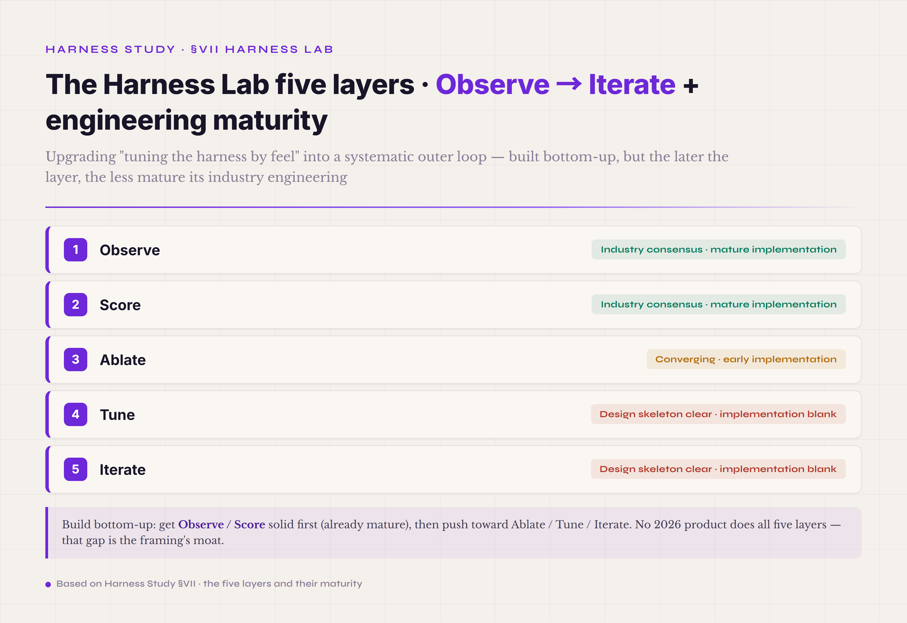
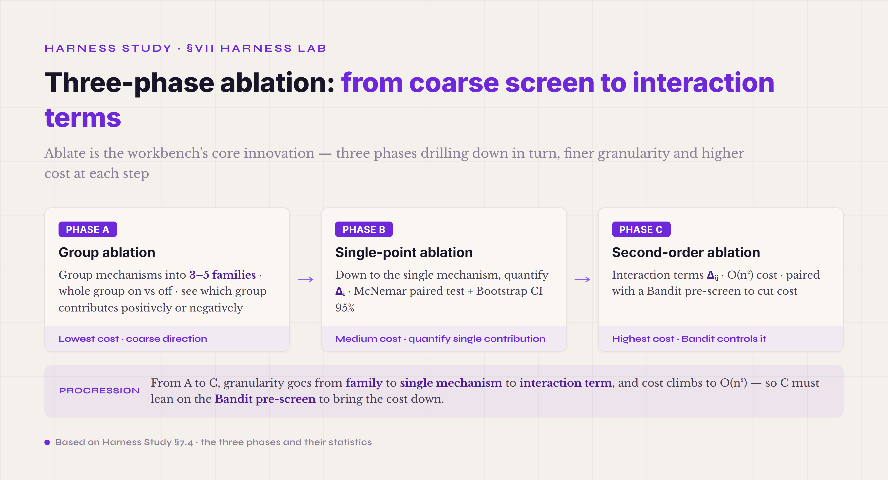
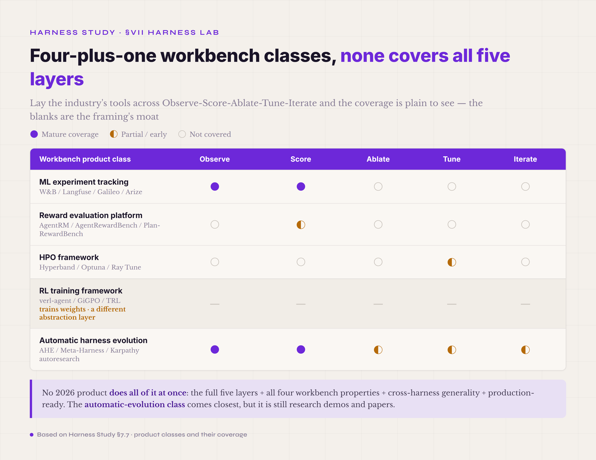

# §VII · Harness Lab · Outer Loop — systematically optimizing the harness itself

Section V covered the eight runtime mechanisms and the Safety control plane; §VI covered the six cross-part engineering patterns. By this point you can picture what a production agent harness looks like. But run one in production for half a year and a harder problem surfaces: **how does the harness itself improve?** The mechanisms are all installed, the patterns are all in place — and on the same tasks, the success rate is 65% one week, 58% the next, 70% the week after. Why does it swing? Which mechanism contributed what? Which parameter would hold it above 70%? Nobody knows. This chapter is about upgrading "tuning the harness by feel" into "optimizing the harness systematically."

The industry has no standard name for this as of 2026. The early literature says *meta-harness*, *autoresearch*, *Harness Lab*, *Outer Loop* — the name matters less than the shared meaning: **a meta-engineering layer on top of the harness, running systematic evaluation, ablation, tuning, and iteration across runs, tasks, and configs.** This tutorial settles on **Harness Lab**. One reason is to keep it apart from the §5.1 Agent Loop (§5.1 is the Inner Loop, think-act-observe within a single run; §VII is the Outer Loop, Observe-Score-Ablate-Tune-Iterate across runs). The other is the analogy to the scientific method and the controlled experiment: treat the harness config as the experimental variable, treat each agent run as a trial, and let statistics converge on a better configuration.

**One honest note has to come before anything else in this chapter.** The five Harness Lab layers sit at very different levels of engineering maturity in the 2026 industry. **Observe** and **Score** are industry consensus with mature implementations — Anthropic, OpenAI, W&B, Langfuse, Galileo, and Arize are all doing them. **Ablate** is converging — the AHE and Meta-Harness papers of 2026 put it on the map, but the engineering is still early. **Tune** and **Iterate** have a clear design skeleton but no implementation. In most industry projects these two layers are still hand-tuned by feel, with no automated loop running. The author's Harness Lab workbench is designed across all five layers, but its L4 Tune and L5 Iterate are also at the design-skeleton stage: zero lines of engineering, not a running product. This honesty is so that, reading this chapter, you keep two things apart: **what the industry SOTA is** and **what tier your own project can actually reach.**

By the end of this chapter you should be able to answer a few things: what the five Harness Lab layers are; what the four workbench properties are; how to build up from Observe one layer at a time; which of the five layers each industry product — W&B, Langfuse, AgentRM, Hyperband, verl-agent — actually covers; and what the carrying relation is between the workbench and the three harness parts of §5.6, §5.7, and §5.8 (observation, trajectory, verifier): the harness parts are the necessary precondition, the workbench is a bonus next step, and neither replaces the other.

#### 7.0 Terms first used in this section

Terms already explained in §I–§VI (runtime part, harness part, Inner Loop, Outer Loop, observation, trajectory, the three verifier layers, Hard Gate, Outcome Judge, PRM, Reward Hacking, Preference Leakage, cache collusion, ablation, and so on) are not repeated. Listed here are only the terms that appear for the first time in §VII.

**Harness Lab five-layer core terms** — **Harness Lab** (the meta-engineering practice layer the 2026 industry is adding on top of the agent harness · systematic optimization across runs, tasks, and configs · this tutorial converges the industry's synonymous names — *meta-harness*, *autoresearch*, *Outer Loop* — onto "Harness Lab"). **the Observe-Score-Ablate-Tune-Iterate five layers** (the engineering decomposition of Harness Lab · the source is the five-layer design of this tutorial author's workbench · the standard pipeline of cross-run systematic optimization). **Outer Loop** (the engineering loop across runs · parallel to the Inner Loop within a single run, not on the same abstraction layer · the industry analogy is the outer loop of ML experiment tracking).

**Workbench property terms** — **the four workbench properties** (the core invariant of the Harness Lab workbench: 1 · swallow any harness config / 2 · automatic evaluation / 3 · automatic tuning / 4 · recognize what it cannot digest · "the five layers are the workbench's internal pipeline; the workbench properties are the real moat"). **AblationProfile** (the workbench ↔ harness coupling mechanism · expresses any harness variant as an enumerable configuration through a set of tunable parameters plus mode toggles · what lets the workbench run batch evaluation). **TrajectoryRecord** (the workbench ↔ harness data contract · lets the trajectory of any harness be normalized for workbench consumption).

**Score-layer terms** — **the L2 Reward three-layer architecture** (the Harness Lab workbench's reward aggregation layer · verifier hard + outcome judge + process · weighted, outcome 5x process against verbosity · a different abstraction layer from the harness-part verifier three layers of the Verifier chapter · workbench-level reward aggregation sits above the harness verifier and aligns scoring across runs). **AgentRM** (an industry reward model for agents · scores agent trajectories · a component-swap candidate for workbench L2). **AgentRewardBench** (an industry benchmark for step-level reward · evaluates how good an agent reward model itself is). **Plan-RewardBench** (a benchmark for plan-level reward · evaluates the soundness of an agent's plan).

**Ablate-layer terms** — **Phase A group ablation** (group mechanisms by family · see which group contributes positively or negatively). **Phase B single-point ablation** (down to the single mechanism · quantify Δᵢ · the industry statistical baseline is the McNemar paired test · significance comes from the test statistic and the sample size, not a fixed percentage-point threshold). **Phase C second-order ablation** (interaction terms between mechanisms · Δᵢⱼ · whether two mechanisms together beat the sum of their separate contributions). **Bandit pre-screen** (use a multi-armed bandit algorithm before Phase A/B to quickly eliminate clearly negative mechanisms · the industry's mainstream road for cutting ablation cost · reduces it substantially). **Bootstrap CI 95%** (the statistical baseline of ablation · compute the 95% confidence interval of Δᵢ by bootstrap resampling).

**Tune-layer terms** — **harness config search** (the load-bearing subject of the Tune layer · the optimization object is the harness configuration's 12+ tunable parameters plus mode toggles · fundamentally different from RL weight training · no weights are trained, and this is not end-to-end online policy gradient). **Hyperband** (a mainstream HPO algorithm · finds hyperparameters under a fixed budget through successive halving · a candidate component for workbench L4). **Optuna** (a mainstream HPO framework · Python · TPE, CMA-ES, and other algorithms · a component-swap candidate for workbench L4). **GiGPO**[^gigpo-2025] (Group-in-Group Policy Optimization · an agentic RL training algorithm · two-level groups, with step-level credit assignment grouped by repeated environment state · a long-term reference for Harness Lab L4, not a primary source · Harness Lab instantiates the step-level anchor as (context_hash, tool_name)). **PAV**[^pav-2024] (Process Advantage Verifier · process reward at 5x compute efficiency · an industry reference for RL training).

**Iterate-layer terms** — **the 4 convergence conditions** (the Harness Lab L5 design · Q ≥ 0.92 / max\|ΔΔᵢ\| < 0.02 for 3 consecutive rounds / Top-10 ranking stable for 3 rounds / budget exhausted · any one suffices). **AHE · Agentic Harness Engineering**[^ahe-2026] (Observability-Driven Automatic Evolution of Coding-Agent Harnesses · 69.7% → 77.0% pass@1 on Terminal-Bench 2 · the representative paper for automatic harness evolution). **Meta-Harness**[^meta-harness-2026] (End-to-End Optimization of Model Harnesses · validated on text, math, and agentic coding · 7.7pp gain plus 4x context savings). **Karpathy autoresearch**[^karpathy-autoresearch-2026] (single-GPU automation that edits train.py, runs eval, and decides the next step · the industrial-grade reference for L4 Tune).

**Cache collusion terms** — **cache collusion** (the core pitfall of industry agent eval · the provider-side prefix KV cache makes N reruns non-i.i.d. · the surface N-run average pass rate is inflated, because the same cache is reused N times · industry sources: DeepSeek V4 Technical Report (TR) §3.6.2 + Mnimi[^mnimi-2025] + philschmid's pass^k[^philschmid-pass-k]). **per-run nonce** (the engineering countermeasure · add a random nonce to the prompt on every run so the prefix differs · forces a cache miss · makes N reruns genuinely independent).

**Model Probe terms** — **Model Probe** (the first step of the Harness Lab's three steps, probe → calibrate → prescribe · run a harness-oriented diagnostic suite against a given LLM endpoint · the output is a profile: which mechanisms this model needs, which it does not, which are traps for it · the value lies in cutting the ablation search space and flagging negative-contribution traps early). **the three-part probe** (the method core of the Model Probe · stimulus → behavior class → mechanism implication · every probe ends in one configuration decision plus one falsifiable prediction, never in a score). **the four probe families** (graded hard to soft by the consequence of an error · A protocol layer / B tool-use layer / C instruction-following layer / D self-healing and calibration layer).

**Industry workbench comparison terms** — **the ML experiment-tracking class** (W&B, Langfuse, Galileo, Arize, and the like · trajectory recording + dashboards + cross-run comparison · no ablation, no tuning). **the reward evaluation platform class** (AgentRM, AgentRewardBench, Plan-RewardBench, and the like · evaluate the reward model itself · do not optimize harness configuration). **the HPO framework class** (Hyperband, Optuna, and the like · generic hyperparameter search · not built for the agent harness setting). **the RL training framework class** (verl-agent, GiGPO, and the like · train weights · do not optimize harness configuration). **No industrial platform positions itself as a "harness policy optimization workbench"** — that is the moat of the Harness Lab workbench framing.

#### 7.1 The four workbench properties · the carrying relation with the harness-part layer

At the engineering level, Harness Lab is a **workbench**. It is not an agent runtime part; it takes no part in single-turn business logic; it runs on top of the harness, consuming trajectories, evaluating, and tuning — a meta layer. Two threads make the framing precise: **the four workbench properties** say what the workbench itself is, and **the harness-part layer vs the workbench layer** draws the boundary against the eight runtime parts of §V.

*Figure 7.1 · The Harness Lab five-layer framework, Observe→Iterate, with engineering maturity*

**The four workbench properties** (named after a big-eater analogy):

**Property one · swallow any harness config.** The workbench is not bound to one harness implementation. Any harness — Codex, Claude Code, OpenCode, your own — that expresses its 12+ tunable parameters and mode toggles through the **AblationProfile** abstraction can be evaluated in batch. This "swallowing" property is the key decoupling between workbench and harness: a workbench that can only run one harness degenerates into that harness's built-in eval tool and loses cross-harness evaluation. AblationProfile fields typically include compression, loop_detector, safety_policy, strict_tools, reasoning_effort, max_turns, and tool_budget — they are not bound to any harness's internal naming, and any harness's equivalent parameters can be mapped into the profile.

**Property two · automatic evaluation.** When the workbench finishes a run of evaluation, no one has to read trajectories and assign scores by hand; scoring comes automatically through **TrajectoryRecord plus the L2 Reward three layers**. TrajectoryRecord is the workbench ↔ harness data contract: any harness's trajectory serializes into a normalized TrajectoryRecord, and the workbench computes rewards from that record. The L2 Reward three layers are the workbench's reward aggregation (verifier hard + outcome judge + process, weighted so outcome counts 5x process against verbosity; §7.3 expands).

**Property three · automatic tuning.** After an evaluation round, the workbench produces "here is how next round's config should change" on its own, without an engineer doing the analysis. This involves Phase A/B/C ablation, the Bandit pre-screen, the 12-parameter search, and GiGPO-style group optimization (§7.4 Ablate and §7.5 Tune expand). Note: tuning here is a search over the discrete space of harness configurations, not RL weight training.

**Property four · recognize what it cannot digest.** The workbench is not only an evaluator — it has to recognize **which mechanisms it cannot digest**: a mechanism too new to have history, a mechanism that depends on cache hits when cache collusion makes N reruns untrustworthy, a mechanism on a task class where the verifier is unavailable. This recognition is what keeps the workbench from mechanically grinding out ablations: it knows which data cannot be trusted, and outputs an honest assessment instead of a false precision. Concretely this lands as the **eval sanity check** (PCS Yes Check + Overlap test), **monitoring for the 7 Reward Hacking patterns**, and **convergence detection** (the 4 convergence conditions as the backstop against unbounded runs).

Together the four properties are the workbench's moat. The comparable industry products — W&B, Langfuse, AgentRM, Hyperband — usually cover one or two of the four; no product covers all four. That framing is what makes the Harness Lab workbench not "another ML experiment tracker" but a new engineering layer with all four in one place: **cross-harness × automatic evaluation × automatic tuning × self-scrutiny**.

Next, **the harness-part layer vs the workbench layer** — a boundary that has to be drawn carefully, echoing how §5.6, §5.7, and §5.8 each separated self-evolution from the workbench.

**The harness-part layer** — observation, trajectory, and verifier, the three parts covered in §V — is what the agent actually uses inside a single run. The observation is the stub/body the agent sees; the trajectory is the event stream of one run; the verifier rules PASS or FAIL when the run ends. These three participate in every agent turn. They are not parts that exist only when invoked.

**The workbench layer** — the Harness Lab of this chapter — is the cross-run meta layer. It takes no part in single-turn business logic; it is the outer loop running on top of the harness, consuming trajectories, running ablations, running tuning. The workbench never appears on the execution path of an agent turn: the agent finishes a run, the trajectory lands in the workbench's input queue, and the workbench consumes it in the background, in batch — evaluation, ablation, tuning, iteration.

**The two layers are a carrying relation, not a replacement** — this deserves the emphasis. The harness-part layer is the workbench's necessary precondition: without trajectories the workbench has nothing to eat, without a verifier it has no reward signal, without observations it has no ablation signal. But the harness-part layer does not depend on the workbench. A harness can do self-evolution on its own — prompt optimization, tool-description adjustment, context-strategy improvement — from trajectory replay and verifier feedback, with no external workbench. **The harness parts can self-evolve independently; the workbench layer is the bonus, the meta path one tier up** — the same clarification the end of §5.8 made.

Two mistakes are easy to make at this boundary. **Mistake one** — equating the workbench layer with self-evolution. Self-evolution spans both levels: the harness-part layer can self-evolve by itself (the independent path), and the workbench layer is merely the more systematic form of it (the advanced path). It is not "no workbench, no self-evolution." **Mistake two** — conflating the §V verifier three layers with the workbench's L2 Reward three layers below. The names are close; the abstraction layers are not. The verifier three layers are a harness-part abstraction (Hard Gate / Outcome Judge / PRM, judging an agent's result within a single run). The L2 Reward three layers are workbench-level reward aggregation (verifier hard + outcome judge + process, weighted across runs, tasks, and configs to feed ablation). The two share naming overlap but not semantics: the former is a harness part; the latter is the workbench's second-pass aggregation over what the harness parts emit.

#### Model Probe · the first of the Harness Lab's three steps · take the model's pulse before the five layers run

As a product, the workbench is three steps: **probe → calibrate → prescribe**. The five layers from Observe onward are the engine of the third step, "prescribe"; before that come two preparatory steps, and the first is the Model Probe — taking the model's pulse. The problem it solves is concrete: given an LLM endpoint, run a harness-oriented diagnostic suite and produce a profile — which mechanisms this model needs, which it does not, which mechanisms are traps for it. Its value is not "understanding the model." It is **cutting the search space of the ablations to come** and **flagging negative-contribution traps in advance**. In vertical domains where reward is expensive, every ablation run burns expert time and money; the probe shrinks "blindly ablate a dozen mechanisms" down to "ablate the few that matter."

What separates the probe from capability benchmarks and personality profiles is its method core, **the three-part probe**. Every probe is a triple. A **stimulus**: a minimal task designed to expose one behavior — not a hard task, just one that reliably provokes the behavior. A **behavior classification**: judge *how* the model did it, not whether it got it right — programmatic judgment first, an LLM-as-judge only on genuinely fuzzy dimensions. A **mechanism implication**: given the behavior class, output one configuration decision plus one prediction that ablation can falsify. A probe's output ends in a decision and a testable prediction, never in a score — that is what separates it from every kind of "model scorecard." The dozen-plus probes split into four families, graded hard to soft by the consequence of an error: **family A, the protocol layer** (an error crashes the harness outright rather than degrading it; binary hard judgment; top priority), **family B, the tool-use layer** (degrades, does not crash), **family C, the instruction-following layer**, and **family D, the self-healing and calibration layer** (the deepest and most differentiating). The structure has academic coordinates: Behavioral Fingerprinting[^behavioral-fingerprinting-2025] supplied the template of a fixed diagnostic suite plus judge plus profile card; the Berkeley Function Calling Leaderboard supplied the raw material for the tool probes; the self-correction survey[^self-correction-survey-2025] grounded the key probe in family D; CDCT[^cdct-2025] supplied the principle of testing constraint compliance separately from semantic correctness. What the probe adds, and none of those works did, is the last link: mapping behavior to mechanism decisions.

The author ran this probe suite against DeepSeek V4, and family A exposed problems first. V4 is sensitive to complex strict schemas with nested objects and arrays: registering such tools fails at the request layer outright instead of degrading — a behavior that directly decides whether to build a schema normalization layer, and how aggressive to make it. On the family C localization dimension, V4 translates a task's English headings into Chinese when the context is Chinese — which decides that the verifier cannot match fixed English strings and must consider multi-alias matching. On the family B over-exploration dimension, V4 tends to read repeatedly before acting in tool-first multi-file tasks — which decides whether to add a read-complete guard. All of these are behavior facts classifiable at a glance at temp=0: did it crash, did it translate, how many times did it read — binary or countable observations that need no precise cross-config comparison to settle.

But the probe yields only qualitative priors; the verdict belongs to ablation. The probe says "turning on the text-tag parser (for tool calls the model emits as text tags instead of structured calls) recovers some of the dropped tool calls" — how much is "some"? Only ablation answers that with clean data. After that probe run, the author went to validate those predictions in ablation and ran straight into the cache collusion described earlier: per-run nonce was not yet in place, the N reruns had shared the provider's prefix cache, the cross-config quantitative comparisons were no longer independent, and that batch of numbers had to be discarded. The stumble actually lit up the division of labor. The probe's qualitative priors hold at a glance: whether or not the cache hit, it does not change the fact that "it crashed" or "it used text tags." The ablation's quantitative verdict is trustworthy only under two protocols: N≥3 repetitions and cache isolation. This is exactly what workbench property four, "recognize what it cannot digest," is there to catch — knowing which batch of data cannot be trusted matters more than forcing out a false precision.

So the probe's place in the workbench is clear: a pre-filter ahead of the five layers. Cheap qualitative diagnostics mark out the search space and the traps, so the five layers from Observe onward need not blindly ablate every mechanism, and the expensive quantitative verdicts are saved for the few mechanisms that genuinely need a ruling.

#### 7.2 Observe · trajectory collection and the analysis database

**Layer one · Observe.** The workbench collects trajectories from the harness and lands them in a structured analysis store — the single source of truth that the other four layers (Score, Ablate, Tune, Iterate) stand on. This is the most mature of the five layers in the industry: Anthropic, OpenAI, W&B, Langfuse, Galileo, Arize — nearly every ML and agent tool has a trajectory-collection implementation. The difference lies in what happens after collection: most tools stop at dashboards and cross-run comparison, and real implementations of Ablate, Tune, and Iterate are still rare.

The workbench's Observe layer does one notch more than the harness-part trajectory layer of §5.7. The harness-part trajectory is the event stream **within one run**; workbench Observe aggregates event streams **across runs, tasks, and configs**. Three additions, concretely. First, cross-run aggregation: group many runs' trajectories by task, config, and time window, so the Ablate layer can compare the same config across N runs. Second, cross-task aggregation: one config's behavior becomes comparable across tasks. Third, cross-config aggregation: many configs become comparable on the same task — the core data foundation of Ablate. All three aggregations demand schema unity, field stability, and ID consistency. If a trajectory field's meaning drifts across runs, every cross-run comparison is noise.

The engineering core of workbench Observe is the **analysis database schema**. The industry runs two roads. The first: JSONL append-only plus an index database — Anthropic, OpenAI, and Inspect AI take this road; the JSONL is the source of truth, and the index database accelerates queries. The second: a relational database directly — OpenCode uses SQLite, LangSmith uses Postgres; the trajectory decomposes into structured fields in tables, query-friendly at the cost of git-diff friendliness. The tradeoffs are the same family as the storage choices in §6.3 JSONL Session. The author's Harness Lab workbench lands L1+L2 on a SQLite analysis.db with 5 tables (runs, steps, mechanism_events, verifications, artifacts) — this schema is already running, the earliest implemented piece of the Observe layer.

**The Observe layer's most important engineering invariant is schema stability.** Once the schema is set, every subsequent run writes trajectories against it — no ad-hoc fields, no silently changed meanings. The invariant is what lets trajectories from every run and every release feed one analysis pipeline, instead of re-running historical evaluations whenever the schema moves. Schema changes follow the rule that a cross-layer interface contract is an invariant: later schemas may only extend earlier fields, never break them — add enum variants rather than sealed matches, add Optional fields that existing callers need not supply, and carry a protocol version field to mark schema evolution.

The industry's SOTA landing for the Observe layer is **HAL, the Holistic Agent Leaderboard**[^hal-2026]. HAL evaluated 21,730 rollouts × 9 models × 9 benchmarks in one unified framework and pulled agent eval "from weeks to hours" — an industrial-grade number. HAL's engineering value is that it **showed agent eval can be industrialized**: not every paper running its own benchmark in its own format, but one trajectory schema and one verifier, so results compare directly across papers, models, and benchmarks.

The HAL road and workbench Observe are two names for the same thing — HAL leans academic benchmark framework, workbench Observe leans production optimization infrastructure, but both make cross-run trajectories structured and cross-config comparison possible. Harness Lab L1 Observe shares the lineage; it just serves production cross-config optimization rather than paper benchmarks.

Observe is the **easiest layer to build and the easiest to build wrong**. Easy to build: trajectory collection is pretty much a commodity, a few lines of code plus SQLite. Easy to build wrong: if the schema is unstable at the start, the cross-run, cross-release data is ruined, and re-running historical evaluations is enormously expensive. The judgment line for getting Observe right: **half a year later, can you still run ablation over all historical trajectories on the same schema?** If yes, it was built right. If not, the schema did not get enough engineering early. Hence the first discipline of workbench building: invest early in schema design and schema review, and leave no ad-hoc fields.

#### 7.3 Score · the workbench reward aggregation layer · the L2 Reward three layers

**Layer two · Score.** The workbench scores the trajectories Observe collected, automatically, producing reward signals comparable across runs, tasks, and configs. Of the five layers this is the one **evolving fastest in 2026** — the L2 Reward three-layer architecture and the AgentRM and AgentRewardBench line of papers all formalized in the first half of 2026, the current point of convergence for agentic reward modeling.

First the boundary against the §V verifier three layers, expanded from the framing note above. **The verifier three layers of §V are a harness-part abstraction**: Hard Gate, Outcome Judge, and PRM run within a single run, judging PASS or FAIL right after the agent finishes a task. **The workbench L2 Reward three layers are a workbench-level abstraction**: take the verdicts the harness verifier produced, plus other features of the agent trajectory, and aggregate them a second time at the workbench level into reward signals comparable across runs. Same naming shape, different abstraction layer, different engineering object.

Concretely, the Harness Lab L2 Reward three layers:

**Layer one · verifier hard.** Use the §5.8 Hard Gate's output directly as the hard reward: pass gives reward = 1, fail gives reward = 0. This is the standard implementation of the RLVR road, the industry's dominant paradigm (§5.8 covered it in detail). Workbench L2 takes this signal as the base reward, averaged across runs as the hard baseline for cross-config comparison.

**Layer two · outcome judge.** Another LLM scores the agent's final output semantically. This corresponds to §5.8's second layer, LLM-as-judge, used here as the outcome reward. At the workbench level the outcome judge is handled by the component-swap principle: in 2026 you can replace the generic LLM-as-judge with AgentRM — a reward model trained specifically for agents, more precise, and avoiding part of the Preference Leakage problem (the agent and a generic LLM judge may come from the same model family; the agent and AgentRM do not).

**Layer three · process.** Step-level scoring of the agent's reasoning. This corresponds to §5.8's third layer, the PRM; workbench L2 sums and normalizes per-step process rewards to give ablation a process-level signal. The PRM-adjacent work in the industry: AgentPRM[^agent-prm-2025] (a PRM implementation), ToolPRMBench[^tool-prm-bench] (a benchmark), and Socratic-PRMBench[^socratic-prm-bench-2026] (a benchmark, not a directly usable PRM). Implementations like AgentPRM are component-swap candidates for this third layer; the two benches are rulers for measuring how good a PRM itself is.

The L2 Reward three layers are not a plain sum — a few weighting invariants need to be said out loud. **Weighted, outcome 5x process, against verbosity.** Industry experience shows that with outcome and process weighted equally, agents learn to pad the process with extra steps to harvest reward — verbosity gaming, one of the Reward Hacking forms in §5.8. The 5x weighting keeps outcome dominant so that a verbose process cannot take over the reward. **Hard Gate failure zeroes both: outcome = 0 and process = 0.** Even if the process steps look reasonable, a failed Hard Gate zeroes the whole reward, so an agent cannot scrape process reward off a failed task. The invariant: process reward is auxiliary scoring of a reasonable trajectory, not an independent fallback channel.

**The component-swap paths of L2.** Per workbench property two, every L2 layer can swap its component without touching the workbench's interface. The verifier hard can go from pytest to build success + lint pass + a custom hash check. The outcome judge can go from a GPT-4 LLM-as-judge to AgentRM. The process layer can go from a basic PRM to an implementation like AgentPRM — and the quality of whatever PRM you swap in is measured with the ToolPRMBench and Socratic-PRMBench rulers. This swap flexibility keeps L2 unlocked as the industry's reward models evolve: AgentRM upgrades, a new PRM paper lands, a more SOTA implementation appears — the L2 interface stays, only the component changes.

The industry's Score-layer baselines are worth a look. **Anthropic builds its own evals**: their official blog puts "small steps, fast checks" first — evals are critical but need not be perfect on day one; in the mainstream practice of Anthropic, OpenAI, and Inspect AI, evals iterate continuously rather than being once-and-done. **OpenAI leans spec-driven eval**: define what the agent should do first, then build the eval to verify it — the workbench Score layer is the automatic executor of that spec. **AgentRewardBench**: step-level reward benchmarking that scores the reward model itself, so the quality of the L2 outcome judge has its own ground truth. **Plan-RewardBench**: plan-level reward evaluation, leaning long-horizon planning coherence — usable for the plan-coherence dimension of L2's process layer.

The typical production path for the Score layer runs in four steps. Step one: run the simplest verifier hard (pytest + build success + file hash, all three) and skip the expensive components — no LLM-as-judge, no PRM. Step two: with a few hundred runs of hard-reward data in hand, add an outcome judge on the open-ended tasks (LLM-as-judge, cross-family against Preference Leakage). Step three: once long tasks run stably, add process reward (a PRM), so ablation can see step-level contributions. Step four: component-swap upgrades as the industry's reward models improve — AgentRM in place of a generic LLM-as-judge — with the workbench interface unchanged. This progression costs less than building all three layers up front, and the returns arrive sooner.

#### 7.4 Ablate · quantifying mechanism contributions + defeating cache collusion

**Layer three · Ablate.** The workbench runs ablation experiments on each harness mechanism and quantifies its contribution Δᵢ to overall task performance. This layer is the watershed where the workbench stops being a generic Observe/Score tool and becomes a real harness optimizer — Observe and Score alone make a trajectory dashboard; only with Ablate can it answer the engineering questions: does this mechanism actually help, how much, and what happens if I remove it?

Ablate's core methodology is the **Harness Lab three-phase ablation**: Phase A group ablation, Phase B single-point ablation, Phase C second-order ablation.

*Figure 7.2 · Three-phase ablation: from coarse screen to interaction terms*

**Phase A · group ablation.** Split the 8–16 mechanisms into 3–5 groups by family (a Context group, a Tool group, a Verifier group, a Loop group), run each group all-on vs all-off N times, and see which groups contribute positively, negatively, or near zero. The coarse screen is fast: one group ablation at N=3–5 runs settles the broad direction, with no need to brute-force every mechanism separately.

**Phase B · single-point ablation.** For the groups Phase A marked positive, go down to the single mechanism and quantify Δᵢ: turn mechanism i off with everything else on, and compare reward on vs off. The engineering is one notch harder than grouping, and the statistics have to be done right. The **McNemar paired test** (same task run twice, once on, once off, compared as pairs) is the baseline; significance comes from the test statistic and the sample size, not from any fixed percentage-point threshold — the same pass-rate gap becomes significant as N grows. **Bootstrap CI 95%** puts a confidence interval on Δᵢ: not a point estimate but an interval with error bars, so "contributes positively" is a statistically grounded call rather than a single-run impression.

**Phase B's value is not only quantifying the positive — it is catching the hidden negative contributors.** A real example: a harness's "tool-parameter auto-completion" mechanism fills in default values when the model omits fields, so the call does not error out. The code logic is entirely correct, the unit tests all pass, and it looks like a considerate piece of design. But in end-to-end single-point ablation, turning it off made the pass rate go *up*. The mechanism had been **quietly masking the parameter errors the model should have seen**: the model passes wrong parameters, the tool runs anyway on auto-filled defaults and produces a result that looks right but is not, the model receives no error, never self-corrects, and stays wrong all the way down. With completion off, the wrong-parameter call fails outright, the model sees the error, rebuilds the parameters, and gets it right. A mechanism like this — locally correct, globally harmful — is invisible to code review and untouchable by unit tests, because unit tests check whether the code logic is right, not whether it helps in the real system. Only single-point ablation with a real model, a real toolchain, and real tasks lights it up. That is precisely the notch Ablate adds over tuning mechanisms by feel.

**Phase C · second-order ablation.** Look at the interaction terms Δᵢⱼ between mechanisms: compare the reward of i and j on together against the sum of i alone plus j alone, and check for synergy (Δᵢⱼ > Δᵢ + Δⱼ, superadditive) or antagonism (Δᵢⱼ < Δᵢ + Δⱼ, subadditive). Phase C costs the most: second-order experiments grow as O(n²), so 16 mechanisms mean 120 pairs, each pair N runs — thousands of runs is no exaggeration. The cost is why Phase C needs the **Bandit pre-screen**: a multi-armed bandit quickly eliminates the clearly negative pairs first, cutting the full 120 down to the 20–30 with real interaction value. Industry experience puts the cost reduction from the pre-screen as substantial.

This set of invariants — Phase A/B/C, Bandit, McNemar, Bootstrap CI — is what makes ablation a statistically grounded engineering experiment instead of "turn a mechanism off by feel and see." It also goes one notch deeper than the ML experiment trackers: W&B and Langfuse track which experiments you ran; they do not rule on which result is significant and which is noise. The Ablate layer is the key reason the workbench is one tier above experiment tracking.

**Two pitfalls must be defused before Ablate runs at all** — **cache collusion** and **Reward Hacking**. Leave either standing and every ablation number is a false signal; a wrong engineering conclusion is more dangerous than running no ablation.

**AP01 · cache collusion.** Cache collusion is the core agent-eval pitfall the industry only formalized in 2026. The source is the provider-side prefix KV cache making N reruns non-i.i.d. The mechanism: DeepSeek V4, Anthropic Claude, and OpenAI GPT all run prefix KV caches (DeepSeek V4 TR §3.6.2 details the on-disk KV cache storage; Anthropic's prompt caching is the same family). On a cache hit, the provider does not recompute the prefix's attention — it reuses the cache. That acceleration is good for production and a disaster for ablation evaluation: when the same prompt runs N times, runs 2 through N reuse run 1's KV cache, and the output distribution is cache-dominated reuse, not independent sampling.

What the engineer sees: run N=5 and average the pass rate, and it reads 80% — because the cache replays the one passing run's prefix across all five, when the true independent pass rate may be only 50–60%. The Mnimi paper[^mnimi-2025] systematized the argument: naive cache reuse makes N>1 reruns non-i.i.d., and standard statistical inference fails. (Note the division of labor between sources: Mnimi argues the general claim that client-side cache reuse breaks independence; the provider-side prefix KV cache mechanism is carried by the DeepSeek V4 TR citation. Each source covers its own segment.) philschmid's pass^k analysis[^philschmid-pass-k] prices the stakes: under true independence, an agent with pass@1 = 0.33 passes three in a row at only **0.33³ ≈ 0.04** — alarmingly low; cache collusion pushes the observed rerun pass rate far above that true independent value and overstates the reliability.

The countermeasure is the **per-run nonce**: every run adds a random nonce string to the prompt (a task UUID plus timestamp, 4–8 bytes), so the prefix differs every time, the cache is forced to miss, and the N reruns become genuinely independent. The nonce's position is critical — it must sit at the **front** of the prompt, so the entire prefix invalidates; at the tail it does not touch the prefix cache at all. The price: cache hits are gone, and each run costs 1.05–1.10x (not the 4x of early estimates). Production deployments keep the cache (no nonce) for the latency win; the per-run nonce mode is switched on only when ablation evals run.

**AP03 · Reward Hacking.** Reward Hacking is the agent finding a loophole in the Score layer's reward function — harvesting the formal reward without doing the actual task. §5.8 covered the countermeasures at the verifier-part layer; this section covers the workbench layer, Score plus Ablate.

The industry's 2026 systematization counts **7 Reward Hacking patterns** (synthesizing the Harness Lab design and the industry papers): pattern 1, gaming the test (the agent learns to generate code that passes the tests without solving the problem); pattern 2, gaming the rubric (satisfying the rubric's letter, not its intent); pattern 3, gaming the judge (output shaped to the judge LLM's preferences — learning its length bias and padding — without solving the problem); pattern 4, gaming the process (striking nice poses on the intermediate steps the PRM watches while the final task goes unfinished); pattern 5, specification gaming (exploiting ambiguity in the task spec); pattern 6, sycophancy (learning the answer patterns the user or judge prefers — learning to please rather than to answer); pattern 7, length gaming (long outputs score higher). The seven cover the main forms identified so far.

The paper that lifts Reward Hacking to an equilibrium framework is **Reward Hacking as Equilibrium under Finite Evaluation**[^reward-hacking-equilibrium-2026] (take the idea, not as an authoritative conclusion). It unifies sycophancy, length gaming, and specification gaming in one theory: when the evaluation-engineering budget grows more slowly (subquadratically, C(T)=o(T²)) than the number of quality dimensions a growing tool count introduces, evaluation coverage trends to zero as the tools multiply. (The original is a conditional conclusion under that premise, not an unconditional law.) The workbench Score layer's Reward Hacking risk climbs with the number of available tools: more tools, more surfaces an agent can game, and a single reward layer cannot cover them all. The **Reward Hacking Benchmark (RHB)**[^rhb-2026] supplies the empirical spread (accepted at ICML 2026): exploit rate 0% on Claude Sonnet 4.5 versus 13.9% on DeepSeek-R1-Zero — models differ by one to two orders of magnitude in how easily they hack.

The workbench Score layer's countermeasures match the combination strategy of the Verifier chapter: one, verifier obfuscation (the agent never sees the reward function's exact shape); two, hidden tests (a second test set beyond what the agent sees); three, an anti-overfitting penalty (output features too pointedly fitted to the verifier fail outright); four, composite reward (multiple verifier layers weighted, hard to game at a single point); five, co-evolving policy and reward (adversarial co-evolution against gaming). And the workbench layer has one capability the harness-part layer does not: **cross-run Reward Hacking monitoring** — run the same config N times and check whether the reward distribution clusters abnormally on particular surfaces; if so, flag "possible Reward Hacking" for human review. The experiment trackers have nothing like it; it is one of the Ablate layer's core workbench values.

Ablate is the **core innovation point** of the five layers. Get it right and the workbench is genuinely a tier above experiment tracking; get it wrong and the workbench is another dashboard. Six things together — Phase A/B/C, the Bandit pre-screen, McNemar, Bootstrap CI, the per-run nonce, and Reward Hacking monitoring — and missing any one leaves the ablation signal untrustworthy.

#### 7.5 Tune · harness config search · not weight training

**Layer four · Tune.** Once Ablate has quantified which mechanisms contribute positively, the workbench searches the **tunable parameters** inside those mechanisms for the best configuration. The load-bearing subject of this layer is **harness config search**, not RL weight training — locking that name down is the core boundary of the Tune framing.

**An honesty note first ★** — the Tune layer's implementation in the Harness Lab workbench is zero lines. The chapter opening said it; it bears repeating here. The design skeleton is clear (this section lays it out); the implementation is blank. The industry's other platforms — W&B, Optuna, the HPO tools — are mature at generic hyperparameter search, but **no one has built a Tune implementation specific to the agent harness setting**; that gap is still open in 2026. Read this section as a design reference and a future engineering direction, not as tooling you can pick up today.

What problem does Tune solve? Ablate tells you "the compression mechanism contributes Δ = +14pp" — but should the compression threshold be 0.65, 0.55, or 0.75? Should the tool budget be 50, 80, or 120? Should max_turns be 30, 50, or 100? Ablate does not answer the concrete values. **The engineering reality of Ablate-without-Tune**: the project stays pinned to its initial gut-feel configuration. Even after discovering that compression matters, the threshold sits at its initial value, and possibly better settings like 0.55 or 0.75 go unexplored. The Harness Lab workbench design states it plainly: "what skipping L4 costs — the project stays stuck at its initial config."

The mainstream HPO frameworks are component-swap candidates for Tune. **Hyperband**: the mainstream HPO algorithm, successive halving, balancing exploration and exploitation under a fixed budget — fits large search spaces with medium per-evaluation cost. **Optuna**: the Python HPO framework, with TPE (Tree-structured Parzen Estimator), CMA-ES (Covariance Matrix Adaptation Evolution Strategy), and other algorithms built in, plus a pruner that stops bad trials early. Either can serve as a workbench L4 component: the workbench supplies the parameter space and the reward function, and the HPO library returns a recommended config.

But plugging industry HPO in directly has a few challenges worth thinking through. **First, HPO assumes i.i.d. rewards; agent eval is not.** Cache collusion (§7.4) makes the N runs of an agent eval non-independent, and HPO acquisition logic — Hyperband's successive-halving pruning decisions, say — needs independent rewards to prune correctly. Industry HPO used as-is gets polluted by cache collusion. **Second, HPO expects a continuous, medium-dimensional space.** An agent harness config is 12+ parameters plus 8 mode toggles — a mixed space of continuous values (the compression threshold), discrete switches (loop_detector on/off), and categoricals (the agent loop type) — messier than ML hyperparameters. **Third, HPO assumes a fixed cost per evaluation.** One agent eval's cost depends heavily on task length, tool usage, and the number of sub-agent forks; it is not a flat unit price, so HPO's budget-allocation strategy needs a redesign.

The three challenges point to what Tune actually needs: **an HPO built for the agent harness setting** — per-run nonce integrated so evals are independent, mixed search spaces handled, and budget allocation aware of variable cost. The Harness Lab L4 design is **autoresearch plus GiGPO-style two-level groups**. autoresearch covers the generic search (the reference is Karpathy's 2026-03 GitHub autoresearch: a single GPU automatically edits train.py, runs eval, and decides — the industrial-grade reference for L4). GiGPO covers group-based optimization, with step-level credit assignment grouped by repeated environment state (the workbench instantiates the step-level anchor as (context_hash, tool_name)). GiGPO[^gigpo-2025] and PAV[^pav-2024] (process reward at 5x compute efficiency) are agentic RL work; Harness Lab borrows them as **algorithmic references for harness config search**, not to train weights.

**A short long-term contrast box** (industry RL weight training vs Harness Lab's harness config search):

| Dimension | RL weight training (GiGPO / verl-agent / PAV) | Harness Lab's harness config search |
|---|---|---|
| **Optimization object** | model weights (a continuous gradient space) | harness configuration parameters (a discrete space, partly continuous) |
| **Optimization method** | policy gradient (PPO, GRPO, and kin) | HPO-class (Hyperband / Optuna / Bandit) + ablation feedback |
| **What a rollout means** | a trajectory sampled from the env | an agent run's trajectory under a harness config |

The contrast makes it visible at a glance: agentic RL trains the model; Harness Lab Tune tunes the harness configuration. Not the same thing — do not conflate them. GiGPO, PAV, and verl-agent enter Harness Lab Tune only as **algorithmic borrowing and long-term references**, never as primary SOTA sources.

#### 7.6 Iterate · cross-round convergence + automatic next-round config recommendation

**Layer five · Iterate.** After a round of Observe-Score-Ablate-Tune, the workbench decides on its own what the next round should run: which configs to ablate next, which mechanisms still need ablation, which parameter spaces are explored enough — upgrading a single workbench pass into multi-round autonomous evolution. Of the five layers this is the one **closest to self-evolution**: with Iterate running, no engineer has to start each round by hand; the workbench decides when it has converged and what to change next.

**An honesty note first ★** — Iterate, like Tune, is zero lines of implementation. The design skeleton is clear in Harness Lab L5, but no autonomous evolution loop is actually running. The industry is equally close to empty-handed here: AHE, Meta-Harness, and Karpathy's autoresearch are papers and open-source demos, not production tools. Read this section, too, as a future engineering direction.

Iterate has two core problems to solve: **cross-round convergence judgment** and **automatic next-round config recommendation**.

**The 4 convergence conditions** (any one suffices):

**Condition 1 · Q ≥ 0.92.** The overall task pass rate reaches 0.92 — near the ceiling, where further ablation and tuning return little at the margin. The Q threshold adjusts to the project's SLA: production agents usually clear the bar at Q ≥ 0.85, high-stakes settings need Q ≥ 0.95; 0.92 is the Harness Lab design's default, the midpoint of that range. **Condition 2 · max\|ΔΔᵢ\| < 0.02 for 3 consecutive rounds.** Each round of ablation produces Δᵢ; ΔΔᵢ is this round's Δᵢ minus last round's. When no mechanism's Δᵢ has moved for three straight rounds, the ablation signal has converged. **Condition 3 · the Top-10 ranking stable for 3 rounds.** The ranking of the top-10 positive mechanisms holds across three consecutive ablation rounds — the question of which mechanisms matter is settled. **Condition 4 · budget exhausted.** The preset total ablation budget (say 1000 runs) is spent; stop regardless of the first three.

Any one of the four ends the loop — the first three are quality-driven, the fourth budget-driven. The invariant behind the design: **never let Iterate run unbounded.** Ablation and tuning are compute-expensive; infinitely many rounds is not an option, and the four conditions stop Iterate within a sane budget on their own.

**Automatic next-round recommendation** — decide from this round's Ablate and Tune data what to change next. The 2026 representatives are worth study. **AHE, Agentic Harness Engineering**[^ahe-2026] — Observability-Driven Automatic Evolution of Coding-Agent Harnesses — feeds observability data back to modify the harness configuration automatically, lifting Terminal-Bench 2 from 69.7% to 77.0% pass@1. **Meta-Harness, End-to-End Optimization of Model Harnesses**[^meta-harness-2026] was validated across text, math, and agentic coding, with a measured 7.7pp gain over SOTA context management and 4x context-token savings at the same time. The two papers share one engineering idea — **observability → analysis → automatic update**: Observe collects, Ablate attributes, Tune adjusts, Iterate recommends the next round. The five layers, closed.

**Karpathy's autoresearch** (open-sourced on GitHub, 2026-03) is the earliest industrial-grade reference for an L4–L5 loop: a single GPU automatically edits train.py, runs eval, and decides the next step itself. autoresearch is not an agent-harness tool — it automates ML training — but the loop idea is the same lineage: upgrade the outer loop from "an engineer runs the experiments by hand" to "the tool runs them and decides," autonomous evolution. Karpathy laid out the framing in the Software 3.0 fireside at Sequoia AI Ascent 2026 — prompt, context, tools, memory, and verification have become the new programming surface, and the spec or plan is the new code; autoresearch then turned "the experiment loop should be automated too" into a runnable open-source demo. This makes the Iterate layer more than this book's design: it is the engineering step the 2026 industry broadly agrees comes next.

The Harness Lab L5 design shares its lineage with AHE, Meta-Harness, and autoresearch and treats the three as its industrial references — AHE for the evolver-loop design, Meta-Harness for the end-to-end optimization mathematics, autoresearch for a concrete implementation that actually runs. But the honesty bears one more repetition: L5 is unimplemented. To build an Iterate mental model, those three papers and Karpathy's open source are enough — do not expect Harness Lab to hand you a running L5 product.

**Continual Harness**[^continual-harness-2026] is the newest landmark on this evolutionary line, same family as AHE and Meta-Harness but a different landing shape. Its core framing: **the harness is not a static artifact — it is a dynamic system that evolves with experience.** The method is **reset-free online self-modification**: the agent starts from a minimal environment interface and, within a single run, edits its own prompt, sub-agents, skills, and memory as it acts — no resets — automating the harness adjustments that used to need a human in the loop. The evidence has to be read in two layers. Its **predecessor GPP** (Gemini Plays Pokemon, harness tuned human-in-the-loop) cleared Pokémon Blue, Yellow Legacy (hard mode), and Crystal (without losing a single battle); the **reset-free automated method itself** was evaluated on Pokémon Red and Emerald, against a minimalist baseline and a hand-engineered expert harness. The predecessor's wins are not the automated method's results. The boundary against Harness Lab L4–L5: Continual Harness is online adaptation within a single run (one run learning for 18 hours straight); Harness Lab is offline ablation and tuning across runs (decide the next setting after a batch of N=10 runs). Different abstraction layers, complementary self-evolution paths. Fold it into the Iterate mental model: convergence does not only take the cross-run shape of "the ablation Δᵢ went stable" — it can also take the online shape of "reset-free evolution inside one run."

#### 7.7 The industry's workbenches compared · which tier is missing

The four workbench properties plus the Observe-Score-Ablate-Tune-Iterate five layers fix what Harness Lab is; setting it against the existing products shows what the 2026 industry actually covers. Below, the five mainstream product classes, sorted by which of the five layers they reach — the comparison shows where the moat of the Harness Lab workbench framing lies.

*Figure 7.3 · Five classes of industry workbench compared: nobody covers all five layers*

**The ML experiment-tracking class · W&B / Langfuse / Galileo / Arize.** The most widely used class, covering the first two layers, **Observe + Score**. Trajectory recording, dashboards, cross-run comparison, reward tracking, metric monitoring — all done well. But **no Ablate, no Tune, no Iterate**: these tools track which experiments you ran and show which reward is higher; they do not rule on which mechanism contributed, do not tune parameters, do not run convergence. Langfuse and W&B are LLM observability plus experiment tracking; Galileo and Arize lean agent observability plus production monitoring. The shared framing is "track your runs," not "optimize your harness."

**The reward evaluation platform class · AgentRM / AgentRewardBench / Plan-RewardBench.** This class covers **part of the Score layer** — specifically, evaluating how good a reward model itself is. AgentRM is a reward model that scores agent trajectories; AgentRewardBench benchmarks step-level reward; Plan-RewardBench evaluates plan-level reward. The engineering value is giving reward signals their own ground truth — but **none of it optimizes harness configuration**. They answer "is my reward accurate," not "is my harness config good." Component-swap candidates for the workbench's Score layer, not workbench substitutes.

**The HPO framework class · Hyperband / Optuna / Ray Tune.** This class covers **part of the Tune layer** — generic hyperparameter search — but **nothing agent-harness-specific**: no handling of cache collusion, of mixed search spaces, or of variable-cost-aware budget allocation (the three challenges of §7.5). Running Optuna directly on agent-harness HPO gets polluted by cache collusion and returns wrong signals. Component candidates for Tune, but they need a workbench-side wrapper for the agent-specific problems; they cannot be plugged in raw.

**The RL training framework class · verl-agent / GiGPO / TRL.** What this class covers is **weight training, not harness configuration** — not the same abstraction layer as the Harness Lab framing at all. verl-agent is an open-source agentic RL framework, GiGPO is Group-in-Group Policy Optimization, TRL is transformer RL: all tools for training model weights. Harness Lab borrows their algorithms, but **trains no weights — it optimizes the harness configuration, 12 parameters plus mode toggles**. When you meet the agentic RL tools, do not mistake them for Harness Lab substitutes: they answer "how to train better model weights"; Harness Lab answers "how to tune a better harness config."

**The automatic harness evolution class · AHE / Meta-Harness / Karpathy autoresearch.** The class closest to the complete framework in 2026: AHE and Meta-Harness are papers, autoresearch is an open-source demo, and all three run a loop of **Observe + Score + partial Tune + partial Iterate**. AHE's 69.7% → 77.0% on Terminal-Bench 2 and Meta-Harness's 7.7pp gain over SOTA are measured evidence that workbench-driven automatic harness optimization works. But **all of these are research demos and papers, not production-ready tools** — an engineering team that adopts them does a lot of its own engineering.

Put the five classes side by side: **no 2026 product does all of it — the full Observe-Score-Ablate-Tune-Iterate five layers, the four workbench properties, cross-harness generality, and production readiness.** That gap is the moat of the Harness Lab workbench framing. The framing is not out to beat W&B, AgentRM, Optuna, or verl-agent point for point; it stakes out the complete five-layer, four-property frame — components can swap in the industry's SOTA, while the frame itself is the new engineering layer.

One caution, though. The gap is not there because nobody noticed it. The engineering is hard and the business model unclear, so no company has staffed it properly. The Harness Lab workbench itself is a design skeleton plus an L1–L2 day-one landing, with L3–L5 unimplemented (the honesty note already said so). The framing cannot be sold as "we built the product the industry lacks" — it is "an industry SOTA gap, plus our design skeleton." Treat it as an engineering direction for the future, nothing more.

#### 7.8 Common pitfalls · landing the workbench

Beyond AP01 cache collusion and AP03 Reward Hacking, both detailed in §7.4, a few more pitfalls in landing the workbench deserve naming.

**AP05 · fixture / path classifier bug.** If the fixtures (test data plus verifier rubric) or the path classifier (the logic that classifies trajectories by path) carry a bug, every Δᵢ the ablation produces is a false signal. The author hit a concrete case: an early baseline's low pass rate turned out to be an artifact of a fixture path-classifier bug, and after the fix, the same ablation's Δᵢ flipped sign outright. The flip is the point — a fixture or classifier bug is not data noise; it is an engineering disaster that inverts ablation conclusions. Three checks: first, do the fixture and classifier code have unit tests of their own (none is an early red flag); second, has the verifier rubric drifted semantically through cross-task reuse (a common source); third, run the same ablation before and after a fixture fix — a significant Δᵢ difference is conclusive fixture-induced bias.

**AP17 · premature optimization.** Concluding from too little data — at N=3, rushing to "mechanism X contributes negatively, remove it." At N=3 the statistics are not significant and the conclusion is noise. The shape is common early in production projects: Δᵢ = -8pp looks negative, but the 95% CI is [-22pp, +6pp], straddling zero — not significant. The countermeasures: **read the CI, not the point estimate**; **conclude only at N ≥ 5**; and run the paired statistics strictly through McNemar, not a casual t-test.

**AP18 · stage inflation.** The five-layer framework is drawn beautifully, Phase A/B/C runs busily, the Iterate loop diagram looks great — and **the workbench has solved no engineering problem at all**. It has merely upgraded "tuning the harness by feel" into "tuning by feel with more vocabulary, more dashboards, and more ablation reports." The judgment: **did the workbench actually raise the agent harness's pass rate?** No improvement after half a year is inflation.

**AP11 · loop blind spot.** Once the Iterate loop runs, it is easy to fall into "the workbench optimizes itself, happily — and the agent's real task pass rate does not move." The mechanism-level root cause is Reward Hacking at the outer-loop level: the reward function the workbench optimizes may not be real task quality, and the harder the workbench optimizes, the further it drifts from the real thing. The pitfall is the same family as the loop_detector mentioned in the Observation Surface chapter's self-evolution passage: the Iterate layer must carry a sanity check against falling into its own loop.

#### 7.9 Getting started · four dimensions

**What to watch.** The biggest trap in landing Harness Lab is **building the workbench before the harness** — standing up the full five layers while the agent harness is still unstable, so everything the workbench produces is noise (the harness itself is drifting, and every ablation on top of it measures the drift). The warning signs, concretely. First, the harness's own pass rate swings more than 10pp week to week: run Ablate now and 95% of the Δᵢ signal is noise. Second, the harness's verifier is still unstable: stack the three-layer reward aggregation on it and the reward signal itself cannot be trusted. Third, the workbench has run for a month and collected plenty of data, but not one harness config change has come out of it: the workbench is not plugged into production, and its engineering value is zero.

**How to design.** Build the five layers **bottom-up, progressively** — never all at once. The industry-experience path: stage one, Observe (trajectory plus the analysis.db schema; the most mature layer, low difficulty, stands up in 1–2 weeks). Stage two, the first two Score layers (verifier hard plus outcome judge, no PRM; 1–2 weeks). Stage three, Ablate Phase A group ablation (the coarse screen, no Phase B/C; 1 month). Stage four, Ablate Phase B single-point ablation with McNemar and Bootstrap CI (precise quantification; 2–3 months). Stage five, Tune wired to Optuna or Hyperband (industry HPO, with your own wrapper for cache collusion; 3–6 months). Stage six, Iterate running to convergence (autonomous evolution; 6+ months — almost nobody in the industry is at this tier yet). The progression keeps every stage solving a real problem, instead of installing layers for the completeness of five.

**How to test.** Workbench-layer testing is mostly **data-credibility testing**, not unit testing. Class one, cache collusion detection: run N=10 without a nonce and N=10 with the per-run nonce, and compare pass rates — a significant gap means cache collusion is real here and the nonce must default on. Class two, Reward Hacking monitoring: run a representative ablation and inspect the reward distribution for abnormal clustering — clustering means the reward may be getting gamed. Class three, cross-release schema consistency: parse half-year-old trajectories with today's schema and run ablation on them — failure means the schema has drifted. Class four, ablation reverse validation: take a mechanism known to contribute positively (the verifier's post-run tests, say), ablate it, and check that the workbench correctly identifies it as positive — if it cannot, the workbench's ablation signal is broken.

**What prompts to write.** The workbench's prompts mostly serve the outcome-judge LLM — L2 layer two needs a prompt that tells the judge how to score. A few disciplines for that judge prompt. First, a structured rubric: not a vague "judge the quality," but "rule pass or fail on each of the following five sub-criteria." Second, the judge LLM stays cross-family from the agent LLM (the Preference Leakage point of §5.8). Third, the judge prompt must not contain ground truth the verifier hard already knows — otherwise the judge collapses into the hard gate. These disciplines pair with the §5.5 Prompt Assets chapter's, and they are what make the workbench's reward signals genuinely trustworthy.

---

The framing of §VII closes on three points. **First** — Harness Lab is the meta-engineering layer above the agent harness, running systematic optimization across runs, tasks, and configs. §V and §VI covered the harness itself, runtime parts and engineering patterns; §VII covers how the harness itself gets systematically better. The two are a carrying relation, not a replacement. **Second** — the four workbench properties (swallow any harness, automatic evaluation, automatic tuning, recognize what it cannot digest) plus the five-layer Observe-Score-Ablate-Tune-Iterate framework define the scope of a complete Harness Lab. No 2026 product does all of it: W&B and Langfuse cover Observe plus Score, AgentRM covers part of Score, Hyperband and Optuna cover part of Tune, and AHE, Meta-Harness, and autoresearch are papers and demos. That gap is the framing's moat. **Third** — Tune and Iterate are design skeleton with zero lines of implementation, in the Harness Lab workbench and in nearly every industry project alike. Keep "industry SOTA" and "a product that runs today" apart as you read: a production agent project that reaches Observe plus Score plus Ablate Phase A is already ahead of 80% of the industry.

Leaving this chapter you should carry the Harness Lab mental model into your own project: first, locate which of the five tiers you are on today; second, decide which layer to push toward next; third, place the industry products correctly when you meet them — W&B, AgentRM, Hyperband, verl-agent, AHE — which layers each covers, and whether it is a component-swap candidate or a workbench framework; fourth, steer clear of the five pitfall classes — cache collusion, Reward Hacking, premature optimization, stage inflation, the loop blind spot. Harness Lab is not an engineering project you run once. It is infrastructure built progressively over 6–12 months — a long-term direction to build toward, not a short-term deployment target.

---

## Footnotes

[^gigpo-2025]: GiGPO · Group-in-Group Policy Optimization · arxiv 2505.10978 · Feng / Xue / Liu / An · 2025 · preprint
[^pav-2024]: PAV · Rewarding Progress: Scaling Automated Process Verifiers for LLM Reasoning · arxiv 2410.08146 · Setlur / Nagpal / Fisch et al. · 2024-10 · preprint
[^ahe-2026]: AHE · Agentic Harness Engineering: Observability-Driven Automatic Evolution of Coding-Agent Harnesses · arxiv 2604.25850 · Lin / Liu / Pan et al. · Fudan + PKU + Qiji Zhifeng · preprint
[^meta-harness-2026]: Meta-Harness · End-to-End Optimization of Model Harnesses · arxiv 2603.28052 · Lee / Nair / Zhang / Lee / Khattab / Finn · Stanford + MIT + KRAFTON · 2026-03 · preprint
[^karpathy-autoresearch-2026]: Karpathy autoresearch · open source on GitHub · 2026-03
[^mnimi-2025]: Mnimi · *Statistical Independence Aware Caching for LLM Workflows* · arxiv 2511.22118 · Dai / Bouras / Jia / Mechtaev · 2025-11-27 · LLM4Code@ICSE 2026 workshop · preprint
[^philschmid-pass-k]: Pass@k vs Pass^k: Understanding Agent Reliability · philschmid.de 2026 · [link](https://www.philschmid.de/agents-pass-at-k-pass-power-k)
[^behavioral-fingerprinting-2025]: Behavioral Fingerprinting · arxiv 2509.04504 · preprint
[^self-correction-survey-2025]: Self-correction survey · arxiv 2504.21625 · preprint
[^cdct-2025]: CDCT · arxiv 2512.17920 · preprint
[^hal-2026]: HAL · Holistic Agent Leaderboard · arxiv 2510.11977 · Princeton · ICLR 2026
[^agent-prm-2025]: AgentPRM · arxiv 2511.08325 · ACM Web Conf 2026
[^tool-prm-bench]: ToolPRMBench · arxiv 2601.12294 · ACL 2026
[^socratic-prm-bench-2026]: Socratic-PRMBench · arxiv 2505.23474 · CAS + UCAS + Tongyi · 2026 · preprint
[^reward-hacking-equilibrium-2026]: Reward Hacking as Equilibrium under Finite Evaluation · arxiv 2603.28063 · Jiacheng Wang / Jinbin Huang · no institutional affiliation listed · 2026-03-30 · preprint
[^rhb-2026]: RHB · *Reward Hacking Benchmark: Measuring Exploits in LLM Agents with Tool Use* · arxiv 2605.02964 · Kunvar Thaman (independent researcher) · ICML 2026
[^continual-harness-2026]: Continual Harness · Online Adaptation for Self-Improving Foundation Agents · arxiv 2605.09998 · Karten / Zhang / Jin et al. · Princeton + Google DeepMind · 2026-05-11 · preprint
