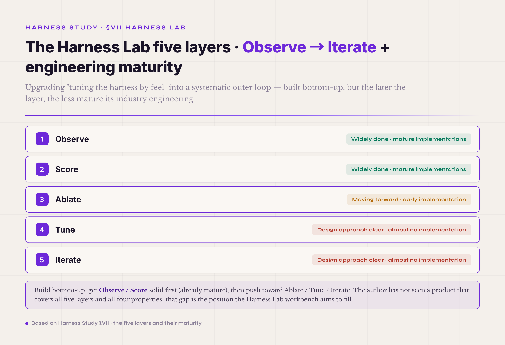
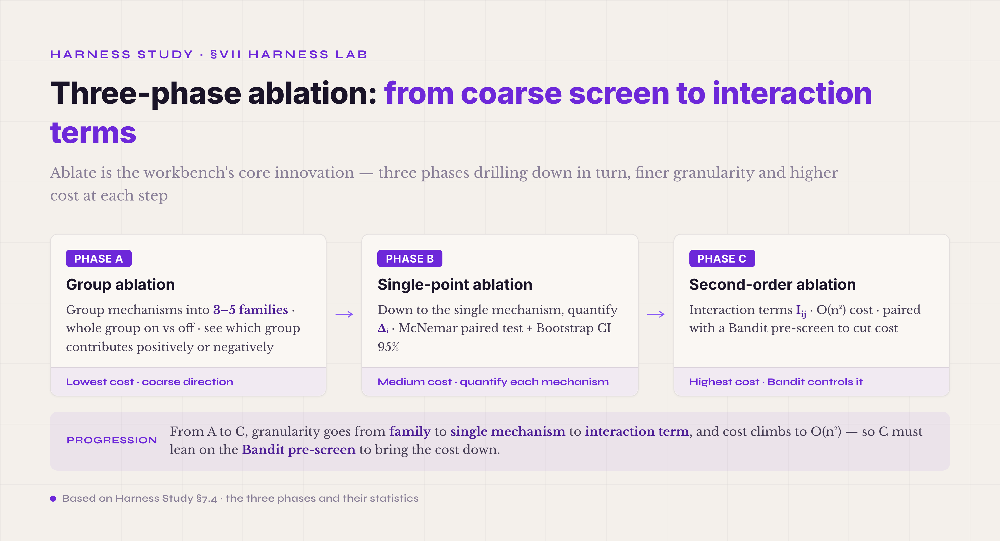
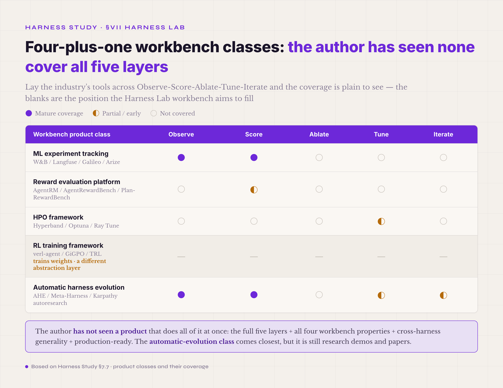

# §VII · Harness Lab · Outer Loop — systematically optimizing the harness itself

§V covered the eight runtime mechanisms plus the Safety control plane; §VI covered the six engineering patterns reused across mechanisms. By this point you can picture what a production agent harness looks like. But run one in production for half a year and engineers hit a harder problem: **how does the harness itself improve?** The mechanisms are all installed and the patterns are all in place, yet on the same tasks the success rate might be, say, 65% one week, 58% the next, and 70% the week after. Why does it swing? Which mechanism made the difference? Which parameter would hold it steady at 70%? Nobody knows. This chapter is about upgrading "tuning the harness by feel" into "optimizing the harness systematically."

**Harness Lab** is this book's name for the practice: a layer of meta-engineering on top of the harness that runs evaluation, ablation, tuning, and iteration systematically across runs, tasks, and configs. The industry has no settled name for it yet; related terms include *meta-harness*, *autoresearch*, and *outer loop*. The name was chosen for two reasons. One is to keep it apart from the Agent Loop of §5.1: §5.1 is the inner loop, think-act-observe within a single run, while this chapter is the outer loop, Observe-Score-Ablate-Tune-Iterate across runs. The other is to line up with the analogy of the scientific method and the controlled experiment: treat the harness config as the experimental variable, treat each agent run as a trial, and use statistics to find a better configuration step by step.

**One point needs to be clear before anything else in this chapter:** the five Harness Lab layers differ widely in engineering maturity across the industry.

- **Observe** and **Score** already have mature engineering implementations; Anthropic, OpenAI, W&B, Langfuse, Galileo, Arize, and others are all doing them.
- **Ablate** is still early: the statistical methods exist, but the author has not seen a product that turns ablation into a workbench feature. 2026 papers such as AHE and Meta-Harness take the automatic-evolution route and cover part of Tune and Iterate (§7.7).
- **Tune** and **Iterate** have a clear design approach but almost no engineering implementation. In most industry projects these two layers still run by hand and by feel, with no automated loop running.

The author's Harness Lab workbench is designed across all five layers, but its L4 Tune and L5 Iterate are also only a design skeleton: not one line of code has been written, and they are not a running product. As you read this chapter, keep **what the industry's leading edge has achieved** apart from **which layer your own project can reach**. They are two different things.

By the end of this chapter you should be able to answer:

- what the five Harness Lab layers are, and what the four workbench properties are;
- how to build up from Observe one layer at a time;
- which of the five layers each of these products covers: W&B, Langfuse, AgentRM, Hyperband, verl-agent;
- how the workbench relates to the three harness mechanisms of §5.6, §5.7, and §5.8 (observation, trajectory, verifier): the harness mechanisms are the necessary precondition, the workbench is an advanced option, and neither replaces the other.

#### 7.0 Terms first used in this chapter

Terms already explained in §I–§VI (runtime mechanism, harness mechanism, inner and outer loop, observation, trajectory, the three verifier layers, Hard Gate, Outcome Judge, PRM, reward hacking, Preference Leakage, non-independent reruns, ablation, and so on) are not repeated here. Listed here are only the terms that appear for the first time in this chapter.

**Harness Lab five-layer core terms**

- **Harness Lab**: this book's name for the outer workbench that sits on top of the harness and improves it through evaluation, ablation, and iterative tuning, optimizing systematically across runs, tasks, and configs. Related industry names include *meta-harness*, *autoresearch*, and *outer loop*.
- **The Observe-Score-Ablate-Tune-Iterate five layers**: the engineering layers of Harness Lab, numbered L1 to L5. They come from the five-layer design of the author's workbench and form one pipeline for systematic optimization across runs.
- **Outer loop**: the engineering loop across runs. It runs parallel to the inner loop within a single run, on a different abstraction layer, and is comparable to the outer loop in ML experiment tracking.

**Workbench property terms**

- **The four workbench properties**: the core requirements of the Harness Lab workbench: (1) accept any harness config; (2) automatic evaluation; (3) automatic tuning; (4) recognize the cases it cannot handle. In the author's view, "the five layers are the workbench's internal pipeline; the four properties are the real barrier to entry."
- **AblationProfile**: the mechanism that connects the workbench to a harness. It expresses any harness variant as an enumerable configuration, using a set of tunable parameters plus a few mode toggles, so the workbench can evaluate variants in batch.
- **TrajectoryRecord**: the data contract between the workbench and a harness. The trajectory from any harness is converted into this format, and the workbench reads them all the same way.

**Score-layer terms**

- **The L2 Reward three layers**: the reward aggregation layer of the Harness Lab workbench, a weighted combination of three layers: verifier hard, outcome judge, and process. Outcome is weighted above process (the author's design uses 5x, a rule of thumb) to keep the agent from scoring by padding its steps (verbosity). This sits on a different abstraction layer from the three verifier layers of the harness mechanism layer described in the Verifier section of §V: the workbench takes the harness verifier's output and, on top of it, aggregates across runs and aligns the scoring.
- **AgentRM**: a reward model that scores agent trajectories; a candidate replacement component for workbench L2.
- **AgentRewardBench**: a benchmark for step-level reward, used to evaluate how good an agent reward model itself is.
- **Plan-RewardBench**: a benchmark for plan-level reward, evaluating whether an agent's plan is sound.

**Ablate-layer terms**

- **Phase A group ablation**: group mechanisms by family, switch each group on or off as a whole, and see which groups contribute positively, negatively, or near zero.
- **Phase B single-point ablation**: go down to the single mechanism and quantify its contribution Δᵢ. The usual test is the McNemar paired test; significance depends on the test statistic and the sample size, not on a fixed percentage-point threshold.
- **Phase C second-order ablation**: quantify the interaction term between mechanisms, Iᵢⱼ = Δᵢⱼ^joint − Δᵢ − Δⱼ, that is, the gain from turning two mechanisms on together minus the sum of the gains from turning each on alone. Iᵢⱼ > 0 means synergy (a positive interaction); Iᵢⱼ < 0 means a negative interaction.
- **Bandit pre-screen**: before Phase A/B, use a multi-armed bandit algorithm to quickly rule out mechanisms that clearly contribute negatively; one way to cut the cost of ablation.
- **Bootstrap 95% confidence interval**: a common statistical method in ablation, using bootstrap resampling to give Δᵢ a 95% confidence interval (CI).

**Tune-layer terms**

- **Harness config search**: the core object of the Tune layer. What it optimizes is the tunable parameters in the harness config (the dozen or so parameters in AblationProfile, such as the compression threshold, max_turns, and the tool budget) plus the mode toggles. This is fundamentally different from training weights with reinforcement learning: no weights are trained, and it is not end-to-end online policy gradient.
- **Hyperband**: a common hyperparameter optimization (HPO) algorithm that uses successive halving to allocate evaluation resources under a fixed budget; a candidate component for workbench L4.
- **Optuna**: a common Python HPO framework with TPE, CMA-ES, and other algorithms built in; a candidate replacement component for workbench L4.
- **GiGPO**[^gigpo-2025] (Group-in-Group Policy Optimization): a training algorithm for agentic RL. It uses two levels of grouping, and at the step level it groups by repeated environment states for credit assignment. Harness Lab L4 treats it only as a long-term reference, not a primary basis; Harness Lab implements its own step-level anchor as (context_hash, tool_name).
- **PAV**[^pav-2024] (Process Advantage Verifier): according to the original paper, 1.5–5x more compute-efficient than an outcome reward model (ORM) in test-time search. It belongs to the RL training line of work, and this chapter uses it only as a reference.

**Iterate-layer terms**

- **The 4 convergence conditions**: the Harness Lab L5 design: Q ≥ 0.92; max|ΔΔᵢ| < 0.02 for 3 consecutive rounds; the Top-10 ranking unchanged for 3 consecutive rounds; budget exhausted. Meeting any one means convergence (the thresholds are design values and rules of thumb).
- **AHE (Agentic Harness Engineering)**[^ahe-2026]: the paper is titled Observability-Driven Automatic Evolution of Coding-Agent Harnesses. It lifts pass@1 on Terminal-Bench 2 from 69.7% to 77.0% and is the representative paper on evolving a harness automatically.
- **Meta-Harness**[^meta-harness-2026] (End-to-End Optimization of Model Harnesses): validated on three kinds of tasks (text, math, and agentic coding). The paper reports a gain of 7.7 percentage points and roughly 4x fewer context tokens.
- **Karpathy autoresearch**[^karpathy-autoresearch-2026]: on a single GPU it automatically edits train.py, runs the evaluation, and decides the next step; an open-source implementation that L4 Tune can learn from.

**Terms for reruns and evaluation credibility**

- **Non-Independent Reruns (AP01, see Appendix F)**: the N reruns are not independent of one another, so the pass rate and stability are overestimated. There are four sources: response caching in the client or the evaluation tool; a fixed seed; files, memory, and workspaces shared between reruns; and verbatim reproduction from cache hits at temperature 0. The model service's prefix cache only reuses the computation for the input prefix and does not change the output, so it is not a source. See §7.4.
- **Overfitting to a Fixed Test Set (AP20, see Appendix F)**: tuning prompts, rules, and tool descriptions against the same test set over and over, so the evaluation success rate is high but performance is poor once the system goes live. See §7.4.
- **Input perturbation test**: add small changes to the input that do not change what the task means (a random nonce, a paraphrase, a formatting change) and measure how stable the agent's results are.
- **per-run nonce**: a random string added to the prompt on every run; the simplest implementation of an input perturbation test. Placed at the start of the prompt, it also invalidates the prompt cache between runs.

**Model Probe terms**

- **Model Probe** (behavioral probing; the workbench's name for taking the model's pulse): the first of the Harness Lab's three steps, probe → calibrate → prescribe. Given an LLM endpoint, run a harness-oriented diagnostic suite and produce a profile: which mechanisms the model needs, which it does not, and which are traps. Its value lies in narrowing the ablation search space and flagging negative-contribution traps in advance.
- **The three-part probe**: the method at the core of the Model Probe: stimulus → behavior class → mechanism implication. Each probe ends in one configuration decision plus one falsifiable prediction, not in a score.
- **The four probe families**: graded from hard to soft by the consequence of an error: A, the protocol layer; B, the tool-use layer; C, the instruction-following layer; D, the self-healing and calibration layer.

**Industry workbench comparison terms**

- **The ML experiment-tracking class** (W&B, Langfuse, Galileo, Arize, and the like): trajectory recording, dashboards, and cross-run comparison; no ablation and no tuning.
- **The reward evaluation platform class** (AgentRM, AgentRewardBench, Plan-RewardBench, and the like): evaluate the reward model itself; do not optimize harness configuration.
- **The HPO framework class** (Hyperband, Optuna, and the like): generic hyperparameter search, not built for the agent harness setting.
- **The RL training framework class** (verl-agent, GiGPO, and the like): train weights; do not optimize harness configuration.

The author has not found an industrial platform that positions itself squarely as a "harness configuration optimization workbench." That is exactly the position the Harness Lab workbench aims to fill.

#### 7.1 The four workbench properties · the carrying relation with the harness mechanism layer

At the engineering level, Harness Lab is a **workbench**. It is not a mechanism of the agent runtime and takes no part in single-turn business logic. It is a meta layer that runs on top of the harness, consuming trajectories, evaluating, and tuning. Two threads make this clear: **the four workbench properties** say what the workbench itself is, and **the carrying relation between the harness mechanism layer and the workbench layer** draws its boundary against the eight runtime mechanisms of §V.

*Figure 7.1 · The Harness Lab five-layer framework, Observe→Iterate, with engineering maturity*

**The four workbench properties:**

**Property one: accept any harness config.** The workbench is not bound to one harness implementation. Any harness (Codex, Claude Code, OpenCode, or your own) that expresses its tunable parameters (usually a dozen or so) and mode toggles through **AblationProfile** can be evaluated in batch. This is the key to decoupling the workbench from the harness: a workbench that can only run one harness degenerates into that harness's built-in eval tool and loses the ability to evaluate across harnesses. AblationProfile fields typically include compression, loop_detector, safety_policy, strict_tools, reasoning_effort, max_turns, and tool_budget. They are not bound to any harness's internal naming, and any harness's equivalent parameters can be mapped in.

**Property two: automatic evaluation.** When the workbench finishes an evaluation run, no one has to read trajectories and assign scores by hand; scoring happens automatically through **TrajectoryRecord** and the **L2 Reward three layers**. TrajectoryRecord is the data contract between the workbench and a harness: any harness's trajectory is serialized into a TrajectoryRecord, and the workbench computes rewards by reading it. The L2 Reward three layers are the workbench's reward aggregation layer (verifier hard, outcome judge, and process, with outcome weighted above process to discourage scoring by padding steps; see §7.3 Score).

**Property three: automatic tuning.** After evaluating, the workbench suggests on its own how the next round's config should change, without an engineer doing the analysis. This involves Phase A/B/C ablation, the Bandit pre-screen, the search over tunable parameters, GiGPO-style group optimization, and other mechanisms (see §7.4 Ablate and §7.5 Tune). Note that tuning here is a search over a harness configuration space that is mostly discrete; it does not train weights with reinforcement learning.

**Property four: recognize the cases it cannot handle.** The workbench is more than an evaluator; it also has to recognize **which cases it cannot handle itself**. A mechanism may be too new to have any history. Reruns may not be independent of one another (AP01, see §7.4), so the N results cannot be trusted. A mechanism may have no usable verifier on some class of tasks. With this recognition the workbench does not grind out ablations mechanically: it knows which data cannot be trusted and gives an honest assessment instead of false precision. Concretely this includes **eval self-checks**, **reward hacking monitoring**, and **convergence detection** (the 4 convergence conditions as a backstop against running forever). The eval self-checks borrow two tests from the PCS framework (predictability, computability, stability). The Yes Check uses the bootstrap to test whether the mean score over repeated runs is significantly above the midpoint of the scale, so a single lucky run cannot pass. The Overlap test measures how much the score distributions of a shuffled control group and of the real data overlap, to see whether the evaluation can separate signal from noise. Volume 2 (*Architecture & Engineering*), Chapter 2 covers both in detail.

Together, the four properties are what set the workbench apart from comparable products. Comparable industry products (W&B, Langfuse, AgentRM, Hyperband, and others) usually cover one or two of them; the author has not seen a product that covers all four. So the Harness Lab workbench is not "another ML experiment tracker." It is a new engineering layer that has all four: **cross-harness, automatic evaluation, automatic tuning, and self-scrutiny**.

Next comes **the carrying relation between the harness mechanism layer and the workbench layer**. This boundary needs to be drawn carefully. It echoes how §5.6, §5.7, and §5.8 each separated self-evolution from the workbench.

**The harness mechanism layer** (observation, trajectory, and verifier, the three mechanisms covered in §5.6, §5.7, and §5.8) is the set of runtime mechanisms the agent actually uses inside a single run. The observation is the stub/body the agent sees; the trajectory is the event stream within one run; the verifier rules PASS or FAIL when the run ends. These three mechanisms take part in every agent turn. They do not exist only when invoked.

**The workbench layer** (the Harness Lab of this chapter) is the cross-run meta layer. It takes no part in single-turn business logic; it is the outer loop running on top of the harness, consuming trajectories, running ablations, running tuning. The workbench layer never appears on the execution path of any agent turn: the agent finishes a run, the trajectory is written to the workbench's input queue, and the workbench consumes it in the background, in batch, for evaluation, ablation, tuning, and iteration.

**The two layers stand in a carrying relation, not a replacement relation**, and this deserves emphasis. The harness mechanism layer is a necessary precondition for the workbench layer: without trajectories the workbench has no data, without a verifier it has no reward signal, and without observations it has no ablation signal. But the harness mechanism layer does not depend on the workbench layer. A harness can self-evolve on its own from trajectory replay and verifier feedback, through prompt optimization, tool-description adjustment, context-strategy improvement, and the like, with no external workbench. **The harness mechanism layer can self-evolve independently; the workbench layer is the advanced, meta-level path.** This matches the clarification at the end of §5.8.

Two misconceptions come easily at this boundary. **Misconception one**: equating the workbench layer with self-evolution. Self-evolution spans both levels. The harness mechanism layer can evolve by itself (the independent path), and the workbench layer is only a more systematic form of self-evolution (the advanced path). Self-evolution does not require a workbench. **Misconception two**: conflating the three verifier layers of §V with the workbench's L2 Reward three layers described below. The names are close, but the abstraction layers differ. The three verifier layers are a harness mechanism (Hard Gate, Outcome Judge, and PRM, judging the agent's result within a single run). The L2 Reward three layers are reward aggregation at the workbench layer (verifier hard, outcome judge, and process, weighted across runs, tasks, and configs to feed ablation). The former is a harness mechanism; the latter is the workbench's second-pass aggregation of what the harness mechanisms output.

#### Model Probe · the first of the Harness Lab's three steps · take the model's pulse before the five layers run

As a product, the workbench works in three steps: **probe → calibrate → prescribe**. The five layers from Observe onward are the engine of the third step, "prescribe." Two preparatory steps come before it, and the first is the Model Probe (behavioral probing). The problem it solves is concrete: given an LLM endpoint, run a harness-oriented diagnostic suite and produce a profile stating which mechanisms this model needs, which it does not, and which mechanisms are traps for it. Its value is not "understanding the model." It is **narrowing the search space of the ablations to come** and **flagging negative-contribution traps in advance**. In vertical domains where reward is expensive, every ablation run costs expert time and money; the probe shrinks "blindly ablate a dozen mechanisms" down to "ablate a targeted few."

What fundamentally separates the probe from capability benchmarks and personality profiles is its method core, **the three-part probe**. Every probe is a triple:

- **Stimulus**: a minimal task designed to expose one behavior. It does not need to be hard, only to provoke that behavior;
- **Behavior classification**: judge *how* the model did it, not whether it got it right. Programmatic judgment comes first, and a model acts as judge only on fuzzy dimensions;
- **Mechanism implication**: given the behavior class, output one configuration decision plus one prediction that ablation can falsify.

A probe's output is a configuration decision plus a testable prediction, not a score. That is what separates it from every kind of "model scorecard." The dozen or so probes fall into four families, graded from hard to soft by the consequence of an error:

- **Family A, the protocol layer**: an error crashes the harness outright rather than degrading it; binary hard judgment; top priority;
- **Family B, the tool-use layer**: an error degrades the harness but does not crash it;
- **Family C, the instruction-following layer**;
- **Family D, the self-healing and calibration layer**: the deepest, and the one that best separates models from one another.

The structure has an academic basis. Behavioral Fingerprinting[^behavioral-fingerprinting-2025] supplied the structural template of a fixed diagnostic suite plus a judge plus a profile card. The Berkeley Function Calling Leaderboard supplied raw material for the tool probes. The self-correction survey[^self-correction-survey-2025] provided the design basis for the most important probe in family D. CDCT[^cdct-2025] supplied the principle of testing constraint compliance separately from semantic correctness. What the Model Probe adds is the one link none of these works covered: mapping behavior to mechanism decisions.

The author ran this probe suite against DeepSeek V4, and family A, the protocol layer, exposed problems first. V4 is sensitive to complex strict schemas with nested objects and arrays: registering such tools makes the request fail outright instead of degrading. That behavior directly decides whether to build a schema normalization layer, and how far to take it. On the output-localization dimension of family C, V4 translates a task's English headings into Chinese when the context is Chinese. That decides that the verifier cannot rely on fixed English strings alone and must consider multi-alias matching. On the over-exploration dimension of family B, in tool-first multi-file tasks, V4 tends to read files repeatedly before acting, which decides whether to add a read-complete guard. All of these are behavioral facts you can classify at a glance at temperature 0: did it crash, did it translate, how many times did it read. They are binary or countable observations, and they need no precise cross-config comparison to settle.

But the probe gives only qualitative priors; the real verdict needs quantitative validation by ablation. The probe says "turning on the text-tag-parser recovers some of the dropped tool calls." How much is "some"? Only ablation, with clean data, can answer that. After that probe run, the author wanted to validate the predictions with ablation. The per-run nonce was not in place yet, and the author concluded that the N reruns had shared the provider's prefix cache and were not independent, so that batch of quantitative numbers was discarded. A later investigation with controlled comparisons corrected that attribution: a prefix-cache hit does not change the output, so the cache was not the problem. The instability that surfaced once the nonce was added came from the agent's sensitivity to small changes in its input, and from Overfitting to a Fixed Test Set (see AP20 in §7.4). Still, those numbers really were unusable: with no input perturbation, the reruns could only measure sampling variation on identical input, not that sensitivity. The stumble ended up clarifying how the probe and ablation divide the work. The probe's qualitative priors can be confirmed at a glance, and facts like "it crashed" or "it uses text tags" are unaffected by the rerun protocol. The ablation's quantitative verdict is trustworthy only with enough repetitions (estimated from statistical power), reruns that are truly independent, and results that hold up beyond the test set. This is exactly what workbench property four, "recognize the cases it cannot handle," is there to catch: knowing which batch of data cannot be trusted matters more than forcing out a false precision.

So the probe's place in the workbench is clear: a pre-filter ahead of the five layers. Cheap qualitative diagnostics mark out the search space and the traps, so the five layers from Observe onward need not blindly ablate every mechanism, and the expensive quantitative verdicts are saved for the few mechanisms that genuinely need a ruling.

A probe report also needs an expiry anchor pinned to it: **a model snapshot marker**. Cloud endpoints upgrade silently. Providers changing the weights without changing the name has happened again and again these past years, and the profile expires with it. The engineering practice: record the model id, the probe date, and a set of behavioral fingerprints (take the few most sensitive probes and store the signature of their outputs); when a daily run notices the fingerprint drifting, re-run the full probe suite automatically. The profile is a diagnosis with a shelf life, not a one-time physical: the endpoint moves, and the prior has to be refreshed with it.

#### 7.2 Observe · trajectory collection and the analysis database

**Layer one: Observe.** The workbench collects trajectories from the harness and stores them in a structured analysis database, which serves as the single source of truth for the four layers that follow (Score, Ablate, Tune, Iterate). This is the most mature of the five layers in the industry: Anthropic, OpenAI, W&B, Langfuse, Galileo, Arize, and nearly every other ML and agent tool have implemented trajectory collection. The difference lies in what happens after collection: most tools stop at dashboards and cross-run comparison, and engineering implementations that really move into Ablate, Tune, and Iterate are still rare.

The workbench's Observe layer goes one step beyond the trajectory of the harness mechanism layer (covered in §5.7). The harness trajectory is the event stream **within one run**; workbench Observe aggregates **across runs, tasks, and configs**. Concretely, it adds three things:

- **Cross-run aggregation**: group the trajectories of many runs by task, config, and time window, so the Ablate layer can compare the same config across N runs;
- **Cross-task aggregation**: make one config's performance comparable across tasks;
- **Cross-config aggregation**: make many configs' performance comparable on the same task. This is the core data foundation of Ablate.

All three aggregations require a unified schema, stable fields, and consistent IDs. The meaning of a trajectory field must not drift across runs; otherwise every cross-run comparison is noise.

The engineering core of workbench Observe is **the schema design of the analysis database**. There are two common approaches:

- **Append-only JSONL plus an index database**: Anthropic, OpenAI, and Inspect AI take this approach. The JSONL is the source of truth, and the index database speeds up queries;
- **Direct storage in a relational database**: OpenCode uses SQLite and LangSmith uses Postgres. The trajectory is split into structured fields and stored in tables, which makes querying easy but gives up the convenience of comparing with git diff.

Each approach has its tradeoffs, the same storage tradeoffs that §6.3, the append-only session event log, discusses. The author's Harness Lab workbench stores L1 and L2 in a SQLite analysis.db with 5 tables (runs, steps, mechanism_events, verifications, artifacts). This schema is already running; it is the earliest engineering implementation of the Observe layer.

**The Observe layer's most important engineering invariant is schema stability.** Once the schema is set, every subsequent run writes trajectories against it, with no ad-hoc fields and no changes to what a field means. The invariant is what lets trajectories from every run and every release feed one analysis pipeline, instead of re-running historical evaluations whenever the schema moves. Schema changes follow the rule that a cross-layer interface contract is an invariant: later schemas may only extend earlier fields, never break them. Add enum variants rather than sealed matches, add Optional fields that existing callers need not supply, and carry a protocol version field to mark schema evolution.

The industry's representative for the Observe layer is **HAL (Holistic Agent Leaderboard)**[^hal-2026]. In one unified framework, HAL evaluated 21,730 rollouts across 9 models and 9 benchmarks, and cut agent evaluation from "weeks" to "hours." HAL's engineering value is that it **showed agent evaluation can be industrialized**: instead of every paper running its own benchmark in its own format, there is one trajectory schema and one verifier, so results compare directly across papers, models, and benchmarks.

HAL's approach and the workbench's Observe layer do the same job with different emphasis. HAL leans toward an academic benchmark framework, and workbench Observe toward optimization infrastructure for production agents, but both aggregate cross-run trajectories in structured form so that cross-config comparison becomes possible. The Harness Lab workbench's L1 Observe follows the same idea as HAL, but it serves cross-config optimization of production agents rather than paper benchmarks.

Of the five layers, Observe is **the easiest to build and the easiest to build wrong**. It is easy to build because trajectory collection is now widespread: a few lines of code plus SQLite will stand it up. It is easy to build wrong because, if the schema is unstable at the start, the cross-run and cross-release data is ruined, and re-running historical evaluations is extremely expensive. The test for getting Observe right: **half a year later, can you still run ablation over all historical trajectories on the same schema?** If yes, it was built right. If not, the schema design got too little investment early on. Hence the first engineering principle of building a workbench: invest in schema design and review for the Observe layer early, and leave no ad-hoc fields.

#### 7.3 Score · the workbench reward aggregation layer · the L2 Reward three layers

**Layer two: Score.** The workbench automatically scores the trajectories Observe has collected, producing reward signals comparable across runs, tasks, and configs. This layer moved fast in 2026: the L2 Reward three-layer architecture and new papers such as AgentRM and AgentRewardBench all appeared in the first half of the year, and they mark the frontier of agentic reward modeling.

First, the boundary between the workbench Score layer and the three verifier layers of §V needs to be clear (7.1 touched on it at the end; here it is expanded). **The three verifier layers are a harness mechanism abstraction**: Hard Gate, Outcome Judge, and PRM run within a single run, judge PASS or FAIL right after the agent finishes its task, and give that run a verdict. **The workbench L2 Reward three layers are a workbench-level abstraction**: they take the harness verifier's verdicts plus other features of the trajectory and aggregate them a second time at the workbench level, producing reward signals comparable across runs. Both are called "three layers," but the abstraction layers differ, and so do the engineering objects.

Now the workbench L2 Reward three layers in detail.

**Layer one: verifier hard.** Use the output of the §5.8 Hard Gate directly as the hard reward: 1 for a pass, 0 for a fail. A signal like this, one a program can judge right or wrong, becomes the reward of reinforcement learning with verifiable rewards (RLVR) when it is used in training (§5.8 covered this in detail). Workbench L2 takes it as the base reward and averages it across runs as the hard baseline for cross-config comparison.

**Layer two: outcome judge.** Another LLM scores the agent's final output semantically. This corresponds to the second layer of §5.8, LLM-as-a-judge, and workbench L2 uses it as the outcome reward. At the workbench level the outcome judge is treated as a replaceable component: you can, for example, replace the current LLM judge with AgentRM. AgentRM is a reward model trained specifically for agents. It is more targeted than a generic LLM judge, and it also reduces the favoritism that arises when the judge and the judged share an origin: a generic LLM judge may belong to the same model family as the agent, while AgentRM does not. (This extends the idea of Preference Leakage to this setting; the original paper studies favoritism when the model that generated synthetic data is related to the judge model.)

**Layer three: process.** Step-level scoring of the agent's reasoning, corresponding to the third layer of §5.8, the PRM. Workbench L2 sums and normalizes the per-step process rewards to give ablation a process-level signal. Related work:

- AgentPRM[^agent-prm-2025]: a PRM implementation;
- ToolPRMBench[^tool-prm-bench]: a benchmark;
- Socratic-PRMBench[^socratic-prm-bench-2026]: a benchmark, not a PRM implementation you can call directly.

Implementations like AgentPRM are candidate replacement components for the third layer of workbench L2; the two benchmarks are yardsticks for measuring how good a PRM itself is.

The workbench L2 Reward three layers are not a plain sum; a few weighting rules need to be spelled out. **Outcome is weighted above process, to discourage scoring by padding steps.** In practice, when outcome and process are weighted equally, the agent often learns to pad the process with extra steps to collect reward. This is verbosity gaming, one form of the reward hacking covered in §5.8. The author's design weights outcome at 5x process (rule of thumb; adjust to your scenario), so a verbose process cannot dominate the reward. **If the Hard Gate fails, both outcome and process score 0.** Even if the process steps look reasonable, a failed Hard Gate zeroes the whole reward, so the agent cannot scrape process points off a failed task. Process reward is thus only auxiliary scoring of a reasonable trajectory, not an independent fallback channel.

**Swapping components in the L2 Reward three layers.** Following workbench property two (automatic evaluation), each of the three L2 layers can swap its component without affecting the workbench's overall interface. The verifier hard can go from pytest to build success plus lint pass plus a custom hash check. The outcome judge can go from an LLM judge such as GPT-4 to AgentRM. The process layer can go from a basic PRM to an implementation like AgentPRM (whether the new PRM is any good is measured against the two yardsticks, ToolPRMBench and Socratic-PRMBench). This flexibility keeps workbench L2 from being locked in as reward models evolve: when AgentRM is upgraded or a new PRM paper comes out, you swap in the better implementation, and the L2 interface stays the same.

The industry's engineering practice at the Score layer is worth comparing:

- **Anthropic's eval building**: Anthropic's official blog, describing how they build eval pipelines, puts "small steps, fast checks" first: evals are critical but need not be perfect at the start. In the practice of Anthropic, OpenAI, Inspect AI, and others, evals are iterated continuously rather than done once.
- **OpenAI's spec-driven evals**: OpenAI tends to define the spec of what the agent should do first, then build evals to verify it; the workbench Score layer is the automatic executor of that spec.
- **AgentRewardBench**: a step-level reward benchmark that scores the reward model itself. It can be used to assess the quality of the outcome judge in the second layer of workbench L2, so the workbench's reward itself has a reference answer to check against.
- **Plan-RewardBench**: plan-level reward evaluation, focused on how sound the planning is in long-horizon tasks. It can assess the plan-coherence dimension of the process reward in the third layer of workbench L2.

The typical path for building out the Score layer in a production agent project:

1. Start with the simplest verifier hard (three checks: pytest, build success, file hash) and skip the expensive components such as an LLM judge and a PRM;
2. Once you have hard-reward data from a few hundred runs, add an outcome judge on open-ended tasks (an LLM judge from a different model family than the agent, to guard against preference leakage);
3. Once long tasks run stably, add process reward (a PRM) so ablation can see step-level contributions;
4. When the industry produces new reward models, upgrade by swapping components (for example, AgentRM in place of a generic LLM judge), with the workbench interface unchanged.

Introducing the layers gradually like this costs less engineering than building all three up front, and the returns arrive sooner.

#### 7.4 Ablate · quantifying mechanism contributions · guarding against non-independent reruns and test-set overfitting

**Layer three: Ablate.** The workbench runs an ablation experiment on each harness mechanism and quantifies its contribution Δᵢ to overall task performance. Among the five layers, this one is the watershed **where a generic Observe/Score tool becomes a real harness optimization tool**. With Observe and Score alone, you have a trajectory dashboard; only with Ablate can you answer engineering-improvement questions such as: does this mechanism actually help, how much does it contribute, and what happens if I remove it?

Ablate's core methodology is the **Harness Lab three-phase ablation**: Phase A group ablation, Phase B single-point ablation, Phase C second-order ablation.

*Figure 7.2 · Three-phase ablation: from coarse screen to interaction terms*

**Phase A: group ablation.** Split the 8–16 mechanisms into 3–5 groups by family (for example a Context group, a Tool group, a Verifier group, and a Loop group), run each group all-on and all-off N times each, and see which groups contribute positively, which negatively, and which near zero. This step is a fast coarse screen: a few repetitions per group (3–5 as an empirical starting point) show the broad direction, with no need to run every mechanism separately. A few repetitions only show direction; conclusions still rest on the confidence interval (see "power, up front" below).

**Phase B: single-point ablation.** For every group whose Phase A contribution is not near zero, **break down the positive and the negative ones alike**, down to the single mechanism, and quantify Δᵢ. Single-point ablation is a level harder than group ablation: turn mechanism i off with all other mechanisms on, and compare the reward with it on and off (leave-one-out ablation). The statistics use the **McNemar paired test** (the same batch of tasks run once with the mechanism on and once with it off, compared in pairs). Significance is decided by the test statistic and the sample size, not by any fixed percentage-point threshold: the same pass-rate gap becomes significant more easily as N grows. The **Bootstrap 95% confidence interval** gives Δᵢ its margin of error. Δᵢ is then not just a point estimate but an interval with error bars, and "contributes positively" has to mean the interval does not cross 0, not a single-run result.

Before the statistical tests there is an even earlier checkpoint: **power, up front**. Before changing a config, ask how large a Δᵢ this grid of tasks × repetitions can actually detect. A rough binomial-variance estimate is enough: at the scale of twenty tasks times three repetitions, the pass-rate differences you can reliably resolve are roughly in the double-digit percentage points; to see differences within 5 points, the sample has to grow severalfold. Skip this arithmetic and small-sample ablation typically ends with noise mistaken for signal. Δᵢ flips sign between two rounds, not because the mechanism is unstable but because the sample was never large enough to resolve it. So there is no fixed threshold for the number of repetitions: estimate the sample size from the minimum detectable effect (MDE) you want to detect, and draw conclusions only when the confidence interval does not cross 0. A quick N=3 ablation is fine to run, but only as a directional reference; do not let it change the default profile directly.

**The value of Phase B single-point ablation lies not only in quantifying positive contributions but, even more, in catching hidden negative-contribution mechanisms.** A real example comes from an engineering record. When a harness failed to parse the tool arguments sent by the model, it replaced them with an empty object and called the tool anyway; it also skipped validation when the arguments did not match the schema. The code logic was not wrong, and it looked like a thoughtful piece of fault tolerance. It stayed in the code for more than four months until a dedicated code audit found it. It **quietly covered up argument errors the model should have seen**: the model passed wrong arguments, the tool still produced a result that looked right but was not, the model received no error, never corrected itself, and kept going wrong. Once the harness was changed to return the error to the model, the model received the error, rebuilt the arguments, and got it right. A mechanism like this, locally correct and globally harmful, is invisible to unit tests (unit tests check whether the code logic is right, not whether it helps in the real system), and routine code review easily lets it through. This case was found by a dedicated audit, with no on/off comparison. To find such mechanisms systematically and put a number on their contribution, you have to run single-point ablation with a real model, a real toolchain, and real tasks. That is exactly the step Ablate adds over tuning mechanisms by feel.

**Phase C: second-order ablation.** Look at the interaction terms between mechanisms. Hold all other mechanisms fixed and take i and j both off as the baseline. Δᵢ and Δⱼ are the reward gains from turning on only i or only j; Δᵢⱼ^joint is the gain from turning on i and j together; the interaction term is Iᵢⱼ = Δᵢⱼ^joint − Δᵢ − Δⱼ. Iᵢⱼ significantly above 0 means synergy (a positive interaction: together they do better than the sum of each alone). Iᵢⱼ significantly below 0 means a negative interaction, which may come from redundancy (the two mechanisms substitute for each other) or interference (they conflict). Phase C costs the most: the number of second-order experiments grows as O(n²), so 16 mechanisms mean 120 pairs, each run N times, and thousands of runs is no exaggeration. Because the cost is so high, Phase C needs the **Bandit pre-screen**: a multi-armed bandit algorithm first quickly rules out the clearly negative combinations. That cuts the full 120 pairs down to the 20–30 (a rule of thumb) that are really worth testing for interaction, and lowers the ablation cost noticeably.

The workbench Ablate layer's approach, Phase A/B/C plus Bandit, McNemar, and Bootstrap CI, turns ablation from "turn a mechanism off by feel and see what happens" into a statistically grounded engineering experiment. The method goes deeper than ML experiment trackers such as W&B and Langfuse: they help you record which experiments you ran, but they do not help you decide which result is significant and which is noise. That is the key extra layer the workbench has over ML experiment tracking.

**The Ablate layer has three anti-patterns that must be guarded against in advance**: **Non-Independent Reruns**, **Overfitting to a Fixed Test Set**, and **Reward Hacking**. The first two distort the numbers from ablation and evaluation; the third lets the reward signal itself be gamed. Leave them unguarded and ablation produces false signals, and a wrong engineering conclusion is more dangerous than running no ablation at all.

**Non-Independent Reruns (AP01).** Running N times and averaging the pass rate assumes the N runs are independent of one another. If the reruns share something, the N results are not N independent samples; the same result gets counted several times, and both the pass rate and the stability are overestimated. There are four common sources:

- **Response caching**: the client, the evaluation tool, or a proxy layer in between returns a previously generated complete output for an identical request;
- **A fixed seed**: every rerun uses the same random seed;
- **Shared state**: reruns share files, memory, or a workspace, so what one run leaves behind is read by the next;
- **Verbatim reproduction at temperature 0**: with temperature set to 0, a cache hit reduces numerical nondeterminism, so the same input more readily reproduces the same output word for word.

One common misconception needs clearing up here: the model service's **prefix cache** (prompt caching, or prefix caching) is not a source. The official documentation of both DeepSeek and OpenAI states that the prefix cache only matches the input prefix and reuses the computation for that part. The output is still generated token by token, and a hit or a miss does not change it; at temperature above 0, requests that hit the cache and requests that miss it draw from the same sampling distribution. In addition, DeepSeek's current models enable thinking mode by default, in which case the temperature parameter has no effect and every call is random sampling anyway.

The real sources are on the side of the client and the evaluation environment. The Mnimi paper[^mnimi-2025] argues systematically that naive reuse of a client-side cache breaks the independence between reruns and invalidates standard statistical inference. The cost shows up in pass^k (the probability of passing all k times in a row), and philschmid's pass^k analysis[^philschmid-pass-k] supplies the arithmetic: if the runs are independent, an agent with pass@1 = 0.33 passes three times in a row with probability only **0.33³ ≈ 0.04**. If reruns are not independent, for example because a response-cache hit reproduces an output verbatim, the observed rate of consecutive passes will be far above this value and overstate robustness. The countermeasure is to start every trial from a clean environment: turn off response caching in the client and the evaluation tool, do not fix the seed, and give every run its own workspace, files, and memory. When computing rerun statistics at temperature 0, keep in mind that outputs may be reproduced verbatim.

**The per-run nonce and input perturbation testing.** A per-run nonce is a random string added to the prompt on every run (for example a task UUID plus a timestamp, 4–8 bytes). Against response caching, the nonce makes every request different, so it does prevent getting an old output back directly. Its main value lies elsewhere, though: it is the simplest implementation of an **input perturbation test**, which adds a small change to the input that does not change what the task means and checks whether the agent's results hold steady. With the nonce at the start of the prompt, every rerun's input is different, so the variety of results you measure includes the agent's sensitivity to small input changes, which is exactly what reruns on a fixed input cannot measure. At the same time, because the start of the prompt changes, the prompt cache between runs is invalidated. Later turns within the same run still hit the cache (the prefix contains the same nonce), so cost rises only by about a tenth (a rule of thumb). Production deployments add no nonce and use the cache as usual to cut latency and cost; in evaluation, run input perturbation as a routine test and report it separately from reruns on a fixed input.

**Overfitting to a Fixed Test Set (AP20).** You tune prompts, rules, and tool descriptions against the same test set again and again; the evaluation success rate keeps climbing, yet the system performs poorly once it goes live, with all sorts of problems. A test set is meant to be a sample for estimating live performance. Once it is used repeatedly to make development decisions, it effectively becomes training data: every change moves toward making this particular set of tests pass, and what you end up with is a configuration fitted specifically to these cases.

**A case.** Early on, the author developed a harness against a fixed test set. The evaluation success rate was high, but problems kept appearing after launch, and live performance fell far short of the evaluation success rate. When a per-run nonce was later added to the evaluation, the reruns immediately exposed a great deal of instability: for the same test case, adding a string of random characters to the start of the input made the result swing between good and bad. At the time the author attributed this to caching, believing the earlier reruns had hit the provider's prefix cache, so the N results were not independent and the evaluation scores were inflated. A later investigation with controlled comparisons corrected this to a different explanation. A prefix-cache hit does not change the output, so the cache was not the problem. The nonce, acting as an input perturbation, exposed the agent's sensitivity to small input changes; together with the harness having overfitted that fixed test set, this produced the gap between evaluation and live performance.

**Causes.** When evaluation looks good and live performance is poor, the common causes fall into five kinds:

- **Overfitting**: the configuration has been tuned repeatedly to fit this batch of cases and stops working on a different batch;
- **A different live input distribution**: real users' wording, task types, and context lengths differ from the test set;
- **Sensitivity to small input changes**: rephrase the input, add a space, or add a string of irrelevant characters, and the result changes;
- **Evaluation and production environments differ**: model version, parameters (temperature, thinking mode), tool implementations, permissions, network, and data are not the same;
- **Statistical noise and model version drift**: with a small sample, the evaluation score itself swings widely; once a cloud model is silently upgraded, old evaluation results go stale too.

**Diagnosis:**

- **Analyze how failed live inputs differ from the test set**: collect the inputs that failed in production and compare them with the test set on wording, task type, length, and context to find what the test set does not cover;
- **Rewrite the tests**: keep each task's meaning the same but rephrase the test case or change its format or order, and see how far the success rate drops. A large drop means the configuration has overfitted the original wording;
- **Look at pass^k**: the rate at which the same case passes all k times in a row exposes instability better than pass@1;
- **Check evaluation against production configuration**: confirm that the model name and version, temperature, thinking mode, tool versions, and system prompt all match;
- **State isolation**: confirm that no trial inherits files, memory, or a workspace from the previous one (this is also a precondition for ruling out non-independent reruns);
- **Four controlled groups to separate input perturbation from caching**: run the same set of cases in four groups: (1) no nonce; (2) a nonce at the start of the prompt; (3) a nonce at the end of the first user message; (4) a fixed string at the start of the prompt. Run the four groups alternately on the same day with a pinned model name and N ≥ 10 per group, and record the prompt_cache_hit_tokens returned with each request (DeepSeek's count of cache-hit tokens) to confirm that each group's cache state matches the design. How to read the result: groups 2 and 3 both have a different input every time, but in group 3 the system-prompt part can still hit the cache across runs, while in group 2 it cannot. If groups 2 and 3 give similar results and both are less stable than group 1, the difference comes from input perturbation, not from caching. Group 4 changes the start of the prompt but identically every time, so the cache still hits as usual; it checks the effect of simply having extra text at the start.

**Prevention:**

- **Keep a development set and a held-out set apart**: day-to-day tuning of prompts, rules, and tool descriptions looks only at the development set. Make no adjustments based on the held-out set; run it before and after every change, only to check whether the gains on the development set still hold;
- **Feed live failures back as case records**: turn the problems that occurred in production into case records (real failures that actually happened, numbered, and used as a source of evaluation cases) and add them to the test set;
- **Report pass@1 and pass^k together**: reporting only the average success rate hides instability;
- **Start every trial from a clean environment**: a separate workspace, files, and memory, with response caching turned off;
- **Pin the model version**: use the same dated or versioned model name in evaluation and in production, and rerun the evaluation when upgrading.

**Reward Hacking (AP03, see Appendix F).** The agent finds a loophole in the Score layer's reward function and collects the formal reward without completing the actual task. The verifier section, §5.8, covered the countermeasures at the verifier mechanism layer; this section covers the countermeasures at the workbench layer, in Score and Ablate.

Drawing on the Harness Lab design and the related papers, the common forms of reward hacking can be grouped as follows. Specification gaming is the umbrella term for this class of behavior, and each item below is one concrete form of it:

- **Gaming the test**: generating code built to pass the tests without solving the problem;
- **Gaming the rubric**: meeting the letter of the rubric but not its intent;
- **Gaming the judge**: shaping output to the judge LLM's preferences without solving the problem, typically by exploiting its length bias and padding the output to score high;
- **Gaming the process**: making the intermediate steps the PRM looks at look good while the final task goes unfinished;
- **Exploiting ambiguity in the task spec**: using vague spots in the task description to get around the real requirement;
- **Sycophancy**: learning the answers the user or judge likes to hear instead of actually answering the question.

This list is this book's own summary. It covers the main forms common today and is not a complete taxonomy.

The paper that analyzes reward hacking within an equilibrium framework is **Reward Hacking as Equilibrium under Finite Evaluation**[^reward-hacking-equilibrium-2026] (taken here for its line of thought, not as an authoritative conclusion). It places sycophancy, length gaming, and specification gaming in one theoretical framework: when evaluation effort grows more slowly than the number of quality dimensions the tool count brings in (subquadratically, C(T) = o(T²)), evaluation coverage tends to zero as the number of tools grows. (The original states a conditional conclusion under that premise, not an unconditional one.) Applied to the workbench Score layer: the more tools are available, the more places an agent can game, the harder it is for a single reward layer to cover them all, and the higher the risk of reward hacking. The **Reward Hacking Benchmark (RHB)**[^rhb-2026] supplies empirical evidence (accepted at ICML 2026): the exploit rate is 0% for Claude Sonnet 4.5 and 13.9% for DeepSeek-R1-Zero. Models differ widely in their tendency toward reward hacking.

The workbench Score layer's countermeasures against reward hacking match the three-layer combination strategy of the Verifier section in §V:

- **Verifier obfuscation**: do not let the agent see the exact shape of the reward function;
- **Hidden tests**: besides the tests the agent can see, keep a set it cannot;
- **Anti-overfitting penalty**: when output features cater too pointedly to the verifier, fail the output outright;
- **Composite reward**: weight several verifier layers so the agent cannot easily game any single point;
- **Co-evolving policy and reward**: the policy and the reward evolve together adversarially, so the reward is harder to game.

The workbench layer has one capability the harness mechanism layer lacks: **cross-run reward hacking monitoring**. Run the same config N times and check whether the reward distribution clusters abnormally on particular gameable spots; if it does, flag "possible reward hacking" and hand it to evaluators for manual review. ML experiment-tracking tools do not have this capability, and it is one of the Ablate layer's core contributions to the workbench.

Ablate is the **core innovation** of the workbench's five layers. Get it right and the workbench genuinely has one layer more than ML experiment trackers; get it wrong and the workbench is just another dashboard. Phase A/B/C, Bandit, McNemar, Bootstrap CI, independent reruns with input perturbation testing, and reward hacking monitoring: without any one of them, the ablation signal cannot be trusted.

#### 7.5 Tune · harness config search · not weight training

**Layer four: Tune.** Once Ablate has quantified which mechanisms contribute positively, the workbench searches the **tunable parameters** inside those mechanisms for the best configuration. The core object of this layer is **harness config search**, not training weights with reinforcement learning, and that boundary is the key to understanding Tune.

**First, the current state.** No code has been written yet for the Tune layer of the Harness Lab workbench. The chapter opening said so, and it bears repeating here: the design skeleton is clear (laid out below), but the engineering implementation is still blank. Other platforms (W&B, Optuna, and other HPO tools) are mature at generic hyperparameter search, but **the author has not seen a Tune implementation built specifically for the agent harness setting**. Read this section as a design reference plus a future engineering direction, not as tooling that is ready to use.

What problem does Tune solve? Ablate tells you "the compression mechanism contributes positively, Δ = +14pp." But should the compression threshold be 0.65, 0.55, or 0.75? Should the tool budget be 50, 80, or 120? Should max_turns be 30, 50, or 100? Ablate cannot tell you what these tunable parameters should actually be set to. **The practical result of doing Ablate without Tune**: the project stays stuck on the configuration it picked by gut feel at the start. Even after discovering that compression matters, the threshold remains at its initial 0.65, missing possibly better values between 0.55 and 0.75. The Harness Lab workbench design document says so explicitly: "without L4, the project stays stuck at its initial config."

Common hyperparameter optimization frameworks can serve as candidate components for Tune. **Hyperband**: a common HPO algorithm that allocates evaluation resources by successive halving, balancing exploration and exploitation within a given budget; it fits settings with a large search space and medium per-evaluation cost. **Optuna**: an HPO framework written in Python, with TPE (Tree-structured Parzen Estimator), CMA-ES (Covariance Matrix Adaptation Evolution Strategy), and several other algorithms built in; its pruner can stop poorly performing trials early. Either can be a candidate for workbench L4: once connected, the workbench supplies the parameter space and the reward function, and the HPO library returns a recommended config.

But plugging off-the-shelf HPO in directly raises a few problems that need thinking through:

- **First, HPO assumes each evaluation is an independent noisy sample, and agent evaluation may not satisfy that.** Non-Independent Reruns (AP01, see §7.4) mean the results of N runs are no longer independent, and agent evaluation has high variance to begin with. Bayesian optimization and TPE rely on an acquisition function to decide which parameters to try next; Hyperband relies on successive halving to decide which configs to eliminate, and it has no acquisition function. Both kinds of method depend on trustworthy evaluation results; feed them biased results and they make the wrong tradeoffs.
- **Second, the search space is mixed.** An agent harness config has a dozen or so parameters plus several mode toggles. Some are continuous (the compression threshold), some are discrete switches (loop_detector on or off), and some are categorical (the agent loop type), and there are dependencies between them (when a mechanism is off, its parameters mean nothing). The search-space definition has to express these types and dependencies clearly.
- **Third, the cost of a single evaluation is not fixed.** HPO budget allocation usually assumes each evaluation costs the same, but the cost of one agent evaluation depends heavily on task length, tool usage, and the number of sub-agents, so the budget-allocation strategy needs to be redesigned.

These three problems show that Tune needs **an implementation built specifically for the agent harness setting**: one that keeps reruns independent and includes input perturbation testing, handles a mixed search space, and allocates budget by actual cost. The Harness Lab L4 design is **autoresearch plus GiGPO two-level grouping**. autoresearch handles the generic search (the reference is the autoresearch Karpathy open-sourced on GitHub in March 2026: on a single GPU it automatically edits train.py, runs the evaluation, and makes decisions). GiGPO handles group-based policy optimization, grouping by repeated environment states at the step level for credit assignment (Harness Lab implements the step-level anchor as (context_hash, tool_name)). GiGPO[^gigpo-2025] and PAV[^pav-2024] (according to the original paper, 1.5–5x more compute-efficient than an outcome reward model in test-time search) belong to agentic RL. Harness Lab treats them only as **algorithmic references for harness config search** and does not train weights with reinforcement learning.

**Agentic RL compared with harness config search** (3 rows, showing the boundary between RL weight training and Harness Lab's config search):

| Dimension | RL weight training (GiGPO, verl-agent, PAV) | Harness Lab's harness config search |
|---|---|---|
| **Optimization object** | model weights (a continuous space, optimized by gradient) | harness configuration parameters (mostly discrete, partly continuous) |
| **Optimization method** | policy gradient (PPO, GRPO, and others) | HPO-class methods (Hyperband, Optuna, Bandit) plus ablation feedback |
| **What a rollout means** | a trajectory sampled from the env | an agent run's trajectory under a harness config |

The table shows that agentic RL trains the model while Harness Lab's Tune adjusts the harness configuration. They are not the same thing, so do not confuse them. In Harness Lab Tune, GiGPO, PAV, and verl-agent serve only as **algorithmic borrowing and long-term references**, not as a primary basis.

#### 7.6 Iterate · cross-round convergence and automatic next-round config recommendation

**Layer five: Iterate.** After a round of Observe-Score-Ablate-Tune, the workbench decides on its own which configs the next round of ablation should run, which mechanisms still need ablation, and which parameter spaces have been explored enough. This upgrades a single-round pass into multi-round autonomous evolution. Of the five layers, this is the implementation layer **closest to self-evolution**: once Iterate works end to end, no engineer has to start each round by hand, and the workbench decides for itself when it has converged and what to change next.

**First, the current state.** Like Tune, the Iterate layer has no code yet. The design skeleton is clear in Harness Lab L5, but no autonomous evolution loop is actually running. The industry has almost no products here either: AHE, Meta-Harness, and Karpathy's autoresearch are papers and open-source demos, not production tools. Read this section, too, as a future engineering direction.

Iterate has two core problems to solve: **cross-round convergence judgment** and **automatic next-round config recommendation**.

**The 4 convergence conditions** (meeting any one means convergence; the thresholds are Harness Lab design values and rules of thumb, to be adjusted per project):

- **Condition 1: Q ≥ 0.92.** The overall task pass rate reaches 0.92 or higher, close to the ceiling, where further ablation and tuning return little at the margin. The Q threshold can be adjusted to the project's service level (SLA): production agents usually meet the bar at Q ≥ 0.85, while high-stakes settings need Q ≥ 0.95; 0.92 is the middle value the Harness Lab design chose.
- **Condition 2: max\|ΔΔᵢ\| < 0.02 for 3 consecutive rounds.** Each round of ablation yields Δᵢ, and ΔΔᵢ is the difference between this round's Δᵢ and the last round's. When every mechanism's Δᵢ has barely moved for 3 straight rounds, the ablation signal has converged.
- **Condition 3: the Top-10 ranking stable for 3 consecutive rounds.** The ranking of the ten mechanisms with the largest positive contributions stays the same across 3 consecutive ablation rounds, meaning the judgment of which mechanisms matter has stabilized.
- **Condition 4: budget exhausted.** Once the preset total ablation budget (say, 1000 runs) is used up, stop regardless of whether the first 3 conditions are met.

Meeting any one of the 4 ends the loop: the first 3 are driven by quality, the fourth by budget. The design exists **to keep Iterate from running forever**. Ablation and tuning both consume a lot of compute, unlimited rounds are not feasible in engineering terms, and the 4 convergence conditions stop Iterate automatically within a reasonable budget.

**Automatic next-round config recommendation**: decide automatically, from this round's Ablate and Tune data, what to change in the next round. Several representative implementations from 2026 are worth consulting. **AHE (Agentic Harness Engineering)**[^ahe-2026], titled Observability-Driven Automatic Evolution of Coding-Agent Harnesses, feeds observability data back to modify the harness configuration automatically and lifts pass@1 on Terminal-Bench 2 from 69.7% to 77.0%. **Meta-Harness (End-to-End Optimization of Model Harnesses)**[^meta-harness-2026] was validated on three kinds of tasks (text, math, and agentic coding); the paper reports 7.7 percentage points above the best current context-management method, with roughly 4x fewer context tokens at the same time. The engineering idea the two papers share is **observable data → analysis → automatic update**, which maps onto the workbench's loop: Observe collects the data, Ablate analyzes contributions, Tune adjusts parameters, and Iterate recommends the next round.

**Karpathy's autoresearch** (open-sourced on GitHub in March 2026) is the earliest implementation to learn from for an L4-to-L5 loop: on a single GPU it automatically edits train.py, runs the evaluation, and decides for itself what to change next. autoresearch is not an agent harness tool; it automates ML training. The loop idea is the same, though: the outer loop in which "an engineer runs experiments by hand" is upgraded into autonomous evolution in which "the tool runs them and decides for itself." Karpathy shared related views in the Software 3.0 fireside chat at Sequoia AI Ascent 2026: prompt, context, tools, memory, and verification have become the new objects of programming, and the spec and the plan are the new code. autoresearch turned "the experiment loop should be automated too" into a runnable open-source demo. So the Iterate layer is more than Harness Lab's own design; it is also a next step that many in the industry are optimistic about.

The Harness Lab L5 design follows the same idea as AHE, Meta-Harness, and autoresearch, and uses the three projects as references: AHE for the evolver-loop design, Meta-Harness for the mathematical framework of end-to-end optimization, and autoresearch for a concrete implementation that actually runs. But it bears repeating once more that Harness Lab L5 has no engineering implementation yet. To build an overall picture of the Iterate layer, the two papers and Karpathy's open-source project are enough; do not expect Harness Lab to hand you a running L5 product.

**Continual Harness**[^continual-harness-2026] is the newest representative paper in this direction. Its idea is close to AHE and Meta-Harness, but its implementation takes a different form. Its core view is that **the harness is not a static artifact but a dynamic system that evolves with experience**. The method is **reset-free online self-modification**: the agent starts from a minimal environment interface and, within a single run, edits its own prompt, sub-agents, skills, and memory as it acts, with no need to reset and start over. This automates the harness adjustments that used to need a human in the loop. The evidence has to be read in two layers. Its **predecessor, GPP** (Gemini Plays Pokemon, with the harness tuned by a human in the loop), cleared Pokémon Blue, Yellow Legacy (hard mode), and Crystal (without losing a single battle). The reset-free automated method of Continual Harness itself was evaluated on Pokémon Red and Emerald (against a minimalist baseline and a hand-tuned expert harness); the predecessor's achievements are not evaluation results of the automated method. The boundary between Continual Harness and Harness Lab L4–L5 is this: the former is online adaptation within a single run (one run going for 18 hours straight, learning as it goes). The latter is offline ablation and tuning across runs (finish a batch of N=10 runs, then decide how to adjust next). The two sit on different abstraction layers and are two complementary paths to self-evolution. When building an overall picture of the Iterate layer, take Continual Harness into account as well: L5 convergence is not only the cross-run form of "the ablation Δᵢ stabilizes"; it can also be the online form of "reset-free evolution within a single run."

#### 7.7 The industry's workbenches compared · which layer is missing

The four workbench properties plus the Observe-Score-Ablate-Tune-Iterate five-layer framework define what Harness Lab is. Setting it against existing products shows how far the 2026 industry has gotten on this problem. Below, five mainstream product classes are compared by which of the five layers they cover, to show where the Harness Lab workbench differs.

*Figure 7.3 · Five classes of industry workbench compared: the author has seen none cover all five layers*

**The ML experiment-tracking class (W&B, Langfuse, Galileo, Arize).** The most widely used class, covering the first two of the five layers, **Observe and Score**. Trajectory recording, dashboards, cross-run comparison, reward tracking, and metric monitoring are all done well. But these tools **do not do Ablate, Tune, or Iterate**: they help you record which experiments you ran and see which reward is higher, but they do not help you decide which mechanism contributed, do not tune parameters for you, and do not run to convergence for you. Langfuse and W&B are LLM observability plus experiment tracking; Galileo and Arize lean toward agent observability and production monitoring. Their shared positioning is "record your runs," not "optimize your harness."

**The reward evaluation platform class (AgentRM, AgentRewardBench, Plan-RewardBench).** This class covers **part of the Score layer**, specifically evaluating how good a reward model itself is. AgentRM is a reward model that scores agent trajectories; AgentRewardBench is a step-level reward benchmark; Plan-RewardBench evaluates plan-level reward. The value of this class is giving the reward signal itself a reference answer to check against, but it **does not optimize harness configuration**: these tools answer "is my reward accurate?", not "is my harness configuration good?" They are candidate replacement components for the workbench's Score layer, not substitutes for the workbench.

**The HPO framework class (Hyperband, Optuna, Ray Tune).** This class covers **part of the Tune layer** with generic hyperparameter search, but it is **not built for the agent harness setting**: it does not handle rerun independence or input perturbation, does not handle mixed search spaces, and does not allocate budget by actual cost (the three problems of §7.5). If you run agent harness hyperparameter search directly on Optuna while reruns are not independent, or while evaluation is out of step with live performance, you get the wrong signals. These frameworks can serve as components of the workbench's Tune layer, but the workbench has to wrap them to handle agent-specific problems; they cannot be plugged in directly.

**The RL training framework class (verl-agent, GiGPO, TRL).** What this class does is **train weights, not optimize harness configuration**, so it sits on a different abstraction layer from the Harness Lab workbench. verl-agent is an open-source agentic RL framework, GiGPO is the Group-in-Group Policy Optimization algorithm, and TRL is a Transformer reinforcement learning library; all are tools for training model weights. The Harness Lab design borrows from these algorithms, but **Harness Lab trains no weights; it optimizes the dozen or so parameters and the mode toggles in the harness configuration**. When you come across agentic RL tools, do not mistake them for substitutes for Harness Lab: they answer "how do I train better model weights?", while Harness Lab answers "how do I tune a better harness configuration?"

**The automatic harness evolution class (AHE, Meta-Harness, Karpathy autoresearch).** In 2026 this class comes closest to the complete Harness Lab framework. AHE and Meta-Harness are papers and autoresearch is an open-source demo; all of them run a loop of **Observe and Score, plus part of Tune and part of Iterate**. AHE rose from 69.7% to 77.0% on Terminal-Bench 2, and Meta-Harness beat the best current method by 7.7 percentage points; these measured results show that automatic harness optimization by a workbench is a workable path. But **all of them are research demos or papers, not tools ready for direct production use**; an engineering team that adopts them still has to do a lot of engineering of its own.

Put the five classes side by side: **the author has not seen a product that does all of it at once: all five layers, all four properties, cross-harness generality, and readiness for direct production use.** That gap is the position the Harness Lab workbench aims to fill. It is not trying to outdo W&B, AgentRM, Optuna, or verl-agent point by point. It takes a position on the complete framework of five layers plus four properties, where each layer's components can use the industry's best implementations while the workbench framework itself is the new engineering layer.

One caution, though. The gap is not there because nobody noticed it. The engineering is too hard and the business model unclear, so no company has yet put enough engineering effort into it. The Harness Lab workbench itself is also only a design skeleton plus the L1 and L2 that are already implemented; L3 through L5 have no engineering implementation yet (as noted earlier). So this line of thinking cannot be promoted as "we have already built the product the industry lacks." It is "a gap in the industry today, plus our design skeleton." Treat it as a future engineering direction, and that is enough.

#### 7.8 Anti-patterns · landing the workbench

Beyond Non-Independent Reruns (AP01), Overfitting to a Fixed Test Set (AP20), and Reward Hacking (AP03), all detailed in §7.4, a few more anti-patterns that are easy to fall into when putting the Harness Lab workbench into practice deserve naming.

**Fixture / Path Classifier Bug (AP05, see Appendix F).** When the workbench runs Ablate, if the test fixtures (the test data plus the verifier rubric) or the path classifier (the logic that classifies trajectories by path) have a bug, every Δᵢ the ablation produces is a false signal. The author ran into a concrete case: the low pass rate of an early baseline turned out to be an artifact of a bug in the fixture path classifier, and after the fix, the Δᵢ of the same set of ablations flipped sign outright. A fixture or classifier bug is therefore more than data noise; it is an engineering incident that can turn ablation conclusions upside down. There are three checks:

- whether the fixture and classifier code have unit tests of their own (having none is an early red flag);
- whether the verifier rubric has drifted semantically through reuse across tasks (drift is a common source);
- running the same set of ablations before and after fixing a fixture bug: a significant difference in Δᵢ confirms that the fixture caused the bias.

**Premature Optimization (AP17, see Appendix F).** When running Ablate and Tune, the workbench rushes to conclude "mechanism X contributes negatively, remove it" before enough data is in (say, N=3). At N=3 the statistics are not significant, and the conclusion is just noise. This anti-pattern is especially common early in production agent projects: ablation yields Δᵢ = −8pp, which looks negative, but the 95% CI is [−22pp, +6pp], which crosses 0 and is not significant. The countermeasure is to **read the confidence interval, not the point estimate**. Set no fixed threshold for the number of repetitions: estimate the sample size from the smallest effect you want to detect (see "power, up front" in §7.4), and draw conclusions only when the confidence interval does not cross 0. For paired comparisons, use the McNemar test rather than a simple t-test.

**Stage Inflation (AP18, see Appendix F).** The five-layer framework is drawn neatly, Phase A/B/C runs round after round, and the Iterate loop diagram is complete, yet **the workbench has essentially solved no engineering problem**. It has only turned "tuning the harness by feel" into "still tuning by feel, with more concepts, more dashboards, and more ablation reports." How to tell: **has the workbench actually raised the agent harness's pass rate?** No improvement after half a year means stage inflation.

**Loop Blind Spot (AP11, see Appendix F).** Once the workbench's Iterate loop is running, it can easily fall into a loop blind spot: the workbench's own metrics keep improving while the agent's pass rate on real tasks does not move. The root cause is reward hacking on the outer loop: the reward function the workbench optimizes may not equal real task quality, and the harder the workbench optimizes, the further it drifts from real quality. This anti-pattern is the same kind of problem as the loop detection discussed in §III around AutoGPT's "infinite loop" failure: the Iterate layer must check itself so that it does not get trapped in its own loop.

#### 7.9 Getting started · four dimensions

**What to watch.** The biggest trap in putting Harness Lab into practice is **building the workbench before the harness**: standing up the full five-layer workbench while the agent harness is still unstable, so all the data it produces is noise (the harness itself is drifting, so every ablation the workbench runs is noise too). Some warning signs:

- the harness's own pass rate swings widely from week to week (say, by more than 10 percentage points, a rule of thumb); running Ablate at this point yields Δᵢ values that are mostly noise;
- the harness's own verifier is still unstable; stacking the three-layer Score reward aggregation on it at this point leaves the reward signal itself untrustworthy;
- the workbench has run for a month and collected plenty of data but has not led to a single harness config change, which means the workbench is not connected to production and its engineering value is zero.

**How to design.** Build the five layers **bottom-up, step by step**, never all at once. One experience-based path (the stage durations are rules of thumb):

1. **Observe**: set up the trajectory and analysis.db schema; the most mature layer in the industry, low engineering difficulty, 1–2 weeks;
2. **The first two Score layers**: verifier hard plus outcome judge, no PRM, 1–2 weeks;
3. **Ablate Phase A group ablation**: the coarse screen, no Phase B/C, 1 month;
4. **Ablate Phase B single-point ablation plus McNemar and Bootstrap CI**: precise quantification, 2–3 months;
5. **Tune connected to Optuna or Hyperband**: plug in off-the-shelf HPO and write your own wrapper to handle rerun independence, input perturbation, and the mixed search space, 3–6 months;
6. **Iterate running to convergence**: autonomous evolution, 6 months or more; almost no one in the industry has reached this step yet.

Progressing this way, every stage solves a real problem, instead of piling on patterns just to make the five layers complete.

**How to test.** Testing at the workbench layer is mostly **data-credibility testing**, not unit testing.

- **Rerun independence and input sensitivity checks**: first confirm that reruns share no response cache, fixed seed, files, memory, or workspace. Then use the four controlled groups from §7.4 (no nonce, a nonce at the start, a nonce at the end of the first user message, a fixed string at the start) to separate the effect of input perturbation from that of caching. If results get worse once the nonce is added, that most likely means the agent is sensitive to small input changes; make input perturbation testing a routine part of evaluation rather than blaming the cache;
- **Reward hacking monitoring**: run a representative ablation and check whether the reward distribution clusters abnormally; clustering means the reward may be getting gamed;
- **Cross-release schema consistency**: parse half-year-old trajectories with today's schema and see whether ablation runs through; if it does not, the schema has drifted;
- **Reverse validation of ablation**: take a mechanism known from history to contribute positively (such as the verifier tests after a run ends), ablate it, and see whether the workbench correctly identifies it as a positive contributor; if it cannot, the workbench's ablation signal has a problem.

**What prompts to write.** Prompts at the workbench layer mainly serve the outcome judge: the judge LLM in the second layer of L2 Reward needs a prompt that tells it how to score. A few engineering rules for the judge prompt:

- structure the rubric: instead of a vague description like "judge quality," write "rule pass or fail on each of the following five sub-criteria";
- use a different model family for the judge LLM than for the agent LLM (covered in §5.8's discussion of preference leakage);
- the judge prompt must not contain the reference answer the verifier hard already knows; otherwise the judge degenerates into a Hard Gate.

These rules go together with the engineering rules of §5.5 Prompt Assets, and they are what make the workbench's reward signals genuinely trustworthy.

---

The chapter's main points come down to three:

- **Harness Lab is the meta-engineering layer above the agent harness**, optimizing systematically across runs, tasks, and configs. §V and §VI covered the harness itself (runtime mechanisms and engineering patterns); this chapter covers how to optimize the harness systematically. The two layers stand in a carrying relation, not a replacement relation.
- **The four workbench properties (accept any harness config, automatic evaluation, automatic tuning, recognize the cases it cannot handle), plus the Observe-Score-Ablate-Tune-Iterate five-layer framework**, define the scope of a complete Harness Lab. The author has not seen a product that does all of this at once: W&B and Langfuse cover Observe and Score, AgentRM covers part of Score, Hyperband and Optuna cover part of Tune, and AHE, Meta-Harness, and autoresearch are papers and demos. That gap is the position Harness Lab aims to fill.
- **The Tune and Iterate layers** are still a design skeleton with no engineering implementation, in the Harness Lab workbench and in nearly every industry project alike. As you read this chapter, keep "the industry's leading edge" apart from "a product that runs today." A production agent project that reaches Observe, Score, and Ablate Phase A is already ahead of most projects.

After this chapter you should have an overall picture of Harness Lab and be able to do the following in your own project:

1. tell which of the five layers you are on today;
2. decide which layer to push toward next;
3. classify products such as W&B, AgentRM, Hyperband, verl-agent, and AHE correctly when you meet them (which of the five layers each covers, and whether it is a replaceable component or a workbench framework);
4. avoid these anti-patterns: Non-Independent Reruns, Overfitting to a Fixed Test Set, Reward Hacking, Premature Optimization, Stage Inflation, and the Loop Blind Spot.

Harness Lab is not an engineering project you finish in one go. It is engineering infrastructure that takes a long time to build up step by step (the author estimates 6–12 months, a rule of thumb). Treat it as a long-term direction to build toward, not a short-term deployment target.

---

## Footnotes

[^gigpo-2025]: GiGPO · Group-in-Group Policy Optimization · arxiv 2505.10978 · Feng / Xue / Liu / An · 2025 · preprint
[^pav-2024]: PAV · Rewarding Progress: Scaling Automated Process Verifiers for LLM Reasoning · arxiv 2410.08146 · Setlur / Nagpal / Fisch et al. · 2024-10 · preprint
[^ahe-2026]: AHE · Agentic Harness Engineering: Observability-Driven Automatic Evolution of Coding-Agent Harnesses · arxiv 2604.25850 · Lin / Liu / Pan et al. · Fudan + PKU + Qiji Zhifeng · preprint
[^meta-harness-2026]: Meta-Harness · End-to-End Optimization of Model Harnesses · arxiv 2603.28052 · Lee / Nair / Zhang / Lee / Khattab / Finn · Stanford + MIT + KRAFTON · 2026-03 · preprint
[^karpathy-autoresearch-2026]: Karpathy autoresearch · open source on GitHub · 2026-03
[^mnimi-2025]: Mnimi · *Statistical Independence Aware Caching for LLM Workflows* · arxiv 2511.22118 · Dai / Bouras / Jia / Mechtaev · 2025-11-27 · LLM4Code@ICSE 2026 workshop · preprint
[^philschmid-pass-k]: Pass@k vs Pass^k: Understanding Agent Reliability · philschmid.de 2026 · [link](https://www.philschmid.de/agents-pass-at-k-pass-power-k)
[^behavioral-fingerprinting-2025]: Behavioral Fingerprinting · arxiv 2509.04504 · preprint
[^self-correction-survey-2025]: Self-correction survey · arxiv 2504.21625 · preprint
[^cdct-2025]: CDCT · arxiv 2512.17920 · preprint
[^hal-2026]: HAL · Holistic Agent Leaderboard · arxiv 2510.11977 · Princeton · ICLR 2026
[^agent-prm-2025]: AgentPRM · arxiv 2511.08325 · ACM Web Conf 2026
[^tool-prm-bench]: ToolPRMBench · arxiv 2601.12294 · ACL 2026
[^socratic-prm-bench-2026]: Socratic-PRMBench · arxiv 2505.23474 · CAS + UCAS + Tongyi · 2026 · preprint
[^reward-hacking-equilibrium-2026]: Reward Hacking as Equilibrium under Finite Evaluation · arxiv 2603.28063 · Jiacheng Wang / Jinbin Huang · no institutional affiliation listed · 2026-03-30 · preprint
[^rhb-2026]: RHB · *Reward Hacking Benchmark: Measuring Exploits in LLM Agents with Tool Use* · arxiv 2605.02964 · Kunvar Thaman (independent researcher) · ICML 2026
[^continual-harness-2026]: Continual Harness · Online Adaptation for Self-Improving Foundation Agents · arxiv 2605.09998 · Karten / Zhang / Jin et al. · Princeton + Google DeepMind · 2026-05-11 · preprint
