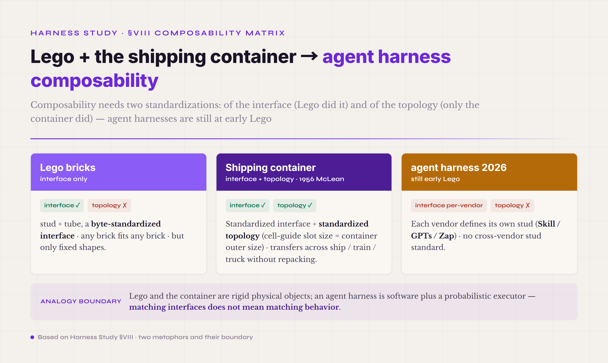
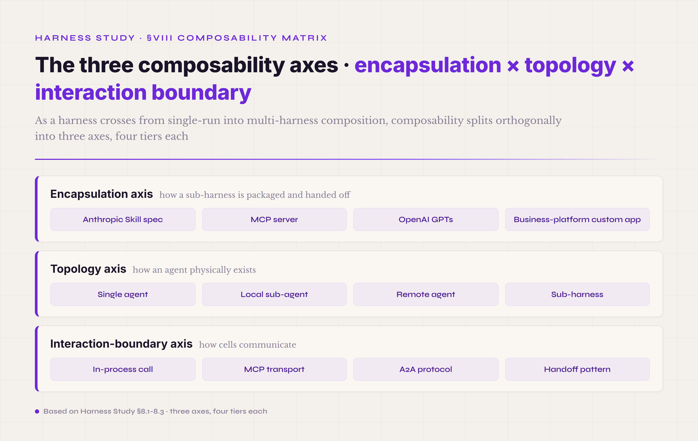
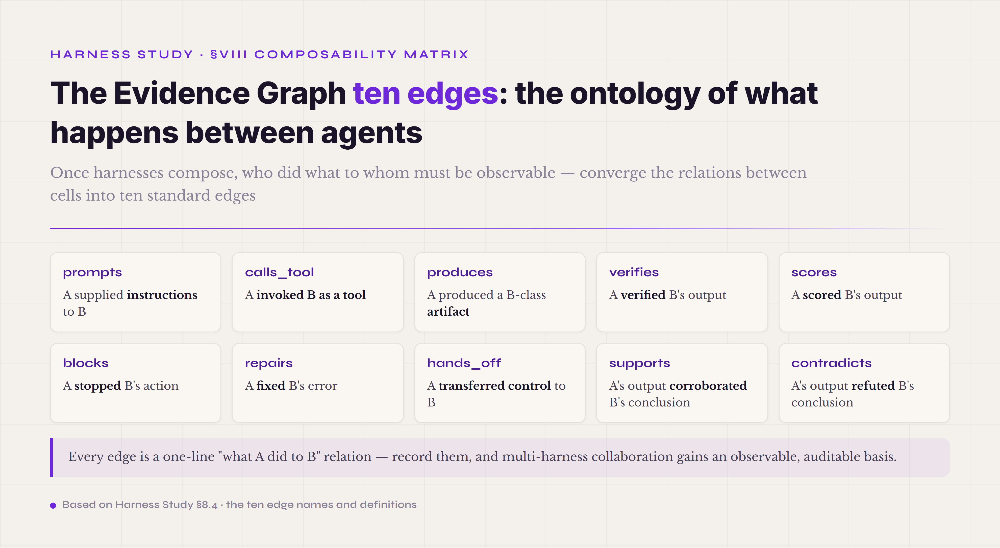
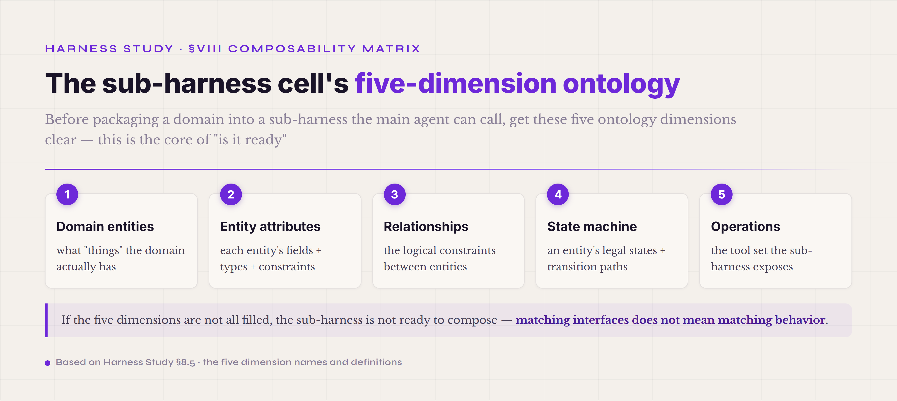

# §VIII · Composability matrix — encapsulation × topology × interaction boundary

§V through §VII covered every part of running an agent harness through one run: the eight runtime mechanisms, the Safety control plane, the engineering patterns, and the Harness Lab workbench. A few engineering questions are still unanswered: how do you "package a working harness and hand it to someone else," how does it "get called inside another harness," and how does it "compose with other harnesses into a larger system"? The industry has no consensus answer in 2026. MCP, A2A, and handoff are three protocols everyone is pushing; Anthropic Skill, OpenAI GPTs, Zapier zaps, and n8n workflows are packaging formats, each with its own following; CrewAI, AutoGen, and Letta make different topology choices in the multi-agent layer. By this point, with the harness mental model the first seven chapters built, you should see this fragmentation for what it is: not a temporary phase but the intrinsic structural problem agent harness engineering faces once it crosses the single-run boundary into cross-harness composition. This chapter splits that structure into three axes.

The most intuitive analogy for composability is **Lego plus the shipping container**, stacked. Lego bricks have two standard interfaces, the stud and the tube — any brick fits any brick, because the interface is standardized to the byte (the horizontal and vertical spacing, the cylinder diameter, the height tolerance, all locked down). But Lego only builds fixed shapes: what you assemble is static, it does not grow new interfaces outward. The shipping container was standardized by Malcolm McLean in 1956 (three dimensions — 20 ft / 40 ft × 8 ft × 8.5 ft — plus corner castings and a twist-lock mechanism), letting any cargo move between ship, train, and truck without repacking. The container's key is not what it carries but the standardized interface plus the standardized topology: a ship's cell-guide slot size equals the container's outer size. With interface and topology both settled, the global supply chain runs. Agent harness composability in 2026 is still at the early-Lego stage — several vendors each define their own studs (their own Skill, GPTs, or zap format), but there is no cross-vendor stud standard. That makes "getting a sub-harness to actually run after you hand it off" an engineering problem you cannot assume has a solution — which is where this chapter's three-axis decomposition starts. Mind the analogy's boundary, though: Lego and the container are rigid physical objects, while an agent harness is software plus a probabilistic executor. Matching interfaces does not mean matching behavior. That gap is why two more topics fall outside the three axes and earn their own treatment: the Evidence Graph and the five-dimension ontology.

*Figure 8.1 · Lego and the shipping container: interface standardization and topology standardization*

Composability earns its keep not by adding components but by holding two properties at once: **an encapsulation boundary, and interoperability across it**. The boundary lets a harness evolve on its own without polluting the others. The interoperability lets independently evolved parts come back together for an end-to-end task. Drop the boundary and interoperability curdles into coupling — change one part and the whole system shakes. Drop the interoperability and the boundaries become walls — a yard of islands. This chapter's three axes correspond to three orthogonal engineering decisions: **how packaging and handoff are standardized** (the encapsulation axis), **how it deploys and exists at runtime** (the topology axis), and **how it communicates across the boundary** (the interaction-boundary axis). This is the core framing for agent harness engineering crossing from single-run into multi-harness composition.

*Figure 8.2 · The three composability axes: encapsulation × topology × interaction boundary*

#### 8.0 Terms first used in this section

Terms already explained in §I–§VII (harness part, Tool Registry, Skill, fork-join, and so on) are not repeated. Listed here are only the terms that appear for the first time in §VIII.

**Encapsulation-axis terms** — **bundle** (a configuration packaging format, as opposed to a code binary · packs a sub-harness's five-dimension ontology, tool selection, prompt assets, and verifier configuration into one transferable unit · the same abstraction layer as a Docker image, different contents). **Skill spec** (Anthropic [Agent Skills](https://agentskills.io), first version 2025-10, open standard 2025-12-18 · a two-part frontmatter + body form · only name/description required in frontmatter, with allowed-tools/metadata and a few other optional fields · the author uses it as a simplified carrier for the sub-harness ontology). **MCP server** ([Model Context Protocol](https://modelcontextprotocol.io) · pushed by Anthropic in 2024-11 · standardizes three capability classes — tools, resources, and prompts). **business-platform custom app** (the custom API workflows of DingTalk, Feishu, and WeCom · the de facto standard for sub-harnesses in office settings).

**Topology-axis terms** — **topology** (how an agent or harness physically exists and how the pieces connect · orthogonal to the packaging format — one package can run in different topologies, one topology can hold different packaged parts). **single agent** (one harness running alone, no sub-agent · the default opening move for mainstream coding agents in 2026). **local sub-agent** (a fork-join offshoot · same process, same harness config · covered in §6.6). **remote agent** (an independent process or service, communicating across the network · the A2A protocol, Anthropic Claude Code Bridge, OpenAI Responses API class). **sub-harness** (another independently deployed harness · carries its own five-dimension ontology · differs from a sub-agent, which shares one process and one harness config). **Note**: the sub-harness and the five-dimension ontology below are engineering concepts this tutorial proposes, not unified industry terms — the industry has adjacent practices (domain-specialized agent packaging, Anthropic Skill, and the like) but no settled name, and these terms are used here to anchor one thing: the minimal complete unit of a domain-specialized harness.

**Interaction-boundary terms** — **in-process call** (a same-process function call · fastest · most tightly coupled · engineering-wise the same tier as a sub-agent). **MCP transport** (three tiers — stdio, SSE, WebSocket · the communication between an MCP server and its host). **A2A protocol** ([Agent-to-Agent Protocol](https://a2aprotocol.com) · a cross-vendor agent interoperability standard · proposed in 2025 · still evolving). **handoff pattern** (the multi-agent collaboration pattern OpenAI Agents SDK pushed in 2025-03 · its predecessor was the experimental Swarm of 2024-10 · agent A hands control to agent B · not a function call but a control-flow transfer). **the Evidence Graph ten edges** (the cross-part, cross-cell relational ontology of an agent system · ten edge types — prompts, calls_tool, produces, verifies, scores, blocks, repairs, hands_off, supports, contradicts · not part of any axis, an independent observable-relation ontology).

**Five-dimension ontology terms** — **sub-harness cell** (the minimal complete unit of a domain-specialized harness · it counts as a cell only with all five ontology dimensions present; missing a dimension, it does not). **five-dimension ontology** (domain entities / entity attributes / relationships / state machine / operations · the core schema of a sub-harness · the opposite of the catch-all-prompt pitfall). **business-workflow agent** (the type-C agent · one of six classes alongside the coding agent, office-automation agent, customer-service agent, RAG, and multi-agent · a bid-processing sub-harness (a 9-state machine), travel-order processing, and a data-governance sub-harness are all typical).

#### 8.1 Axis one · encapsulation · how a sub-harness is packaged and handed off

Encapsulation is the packaging question: how do you fit everything a sub-harness needs to run — the five-dimension ontology, the tool selection, the prompt assets, the verifier configuration — into one unit you can hand to someone else? Productizing a sub-harness settles one thing early: **what you hand off is usually not code but a configuration bundle.** Seen that way, encapsulation is no longer a deployment problem ("how do I ship a binary?") but an interface-design one ("how do I ship a configuration?").

Two substitutions make this work. Replacing code with configuration frees the sub-harness from any one runtime — the same Skill spec should behave the same on Anthropic Claude, OpenAI GPT, and DeepSeek V4 (drift aside, covered later). Replacing free-form text with a standardized schema lets the model read the sub-harness's boundary off named fields — when to invoke the Skill, what to pass, what to expect — instead of guessing. With both in place, "transferable" stops being an aspiration: hand someone a Skill bundle, they mount it in their own harness, and it runs.

Four packaging formats dominate in 2026, and they come from two different worlds — office tooling and coding tooling. **Tier one · Anthropic Skill spec** (first version 2025-10, open standard 2025-12-18, two-part frontmatter + body) — it originated in Claude Code's persistent instructions and later extended to the whole Claude line. Skill's frontmatter has few fields (name and description required, allowed-tools and metadata optional), so the author treats it as a simplified carrier for the five-dimension ontology — expressing the full ontology relies on the body text and the attached tool set, not the frontmatter fields themselves. **Tier two · MCP server** (pushed by Anthropic in 2024-11 · three capability classes, tools/resources/prompts · three transports, stdio/SSE/WebSocket) — born in IDE-integration scenarios, it has since spread to general agent capability. MCP's core framing is **provider and consumer separated**: the server offers a capability, the host decides how to use it, and the two are bound by a JSON-RPC contract. **Tier three · OpenAI GPTs / Custom GPTs** (pushed in 2023-11 · three pieces, instructions + tools + knowledge) — it originated on the ChatGPT platform and is the largest-scale consumer-side sub-harness experiment (millions of GPTs published). The key difference from Skill: GPTs are hard-bound to the ChatGPT runtime and not portable to another provider. **Tier four · business-platform custom apps** (DingTalk, Feishu, WeCom, Zapier, n8n, Make, and the like) — they originated in SaaS workflows, were not designed for agents, but in fact carry the sub-harness role in B2B office settings. Their key difference from the first three: they are **workflow-first**, not **agent-first** — orchestration comes first, the LLM call second.

Which of the four to make the primary encapsulation path depends on what the specific harness runs and where it is deployed. For a coding agent on an Anthropic or OpenAI provider, Skill and MCP are the first choice (both designed as standardized packaging for agents, mapping straight onto the five-dimension ontology). For a B2B office setting with an existing DingTalk or Feishu integration, the business-platform custom app is the first choice (do not route around the enterprise infrastructure already in place). For something that has to transfer across several providers, MCP is the closest thing to "cross-vendor" today (though real cross-vendor adoption is still early), and defining your own JSON schema is the fallback. GPTs are not recommended as the primary encapsulation today — too tightly bound, not portable. None of this is philosophy. It is the one question a sub-harness author has to answer in practice: **when someone adopts my sub-harness, how do they mount it?**

Two mistakes recur on the encapsulation axis. **The first · choosing the packaging format as if choosing a programming language** — the industry often debates "Skill or MCP" the way it debates "Python or Rust," treating two things as opposing options. At the mechanism level they are not even on the same abstraction layer. Skill is a packaging format for **instructions plus a tool kit** (one Skill describes "what to do and with what tools"); MCP is a transport protocol for **tool capability** (an MCP server provides tools but binds no instructions). A sub-harness can perfectly well use a Skill to describe intent and call the tools an MCP server provides. How to decide: when an engineer debates "Skill or MCP," have them answer first, "is your sub-harness missing instruction packaging or tool capability?" Most of the time both are missing, and the answer is both. **The second · underrating business-platform custom apps** — the tech crowd discussing agent packaging barely mentions DingTalk, Feishu, or WeCom custom apps, yet 80% of real B2B landings are there. Why: engineers naturally prefer "code in my own hands that I can change," while an enterprise SaaS platform's "custom app" looks like configuration, not code. The data says otherwise — 80% of the agents enterprises actually deploy run on existing OA or collaboration platforms rather than as standalone deployments, and ignoring this puts you out of step with real B2B settings. The rule: for a sub-harness meant for enterprise customers, do not route around their existing OA or collaboration platform, or the deployment friction will sink the landing.

#### 8.2 Axis two · topology · how an agent physically exists

Topology is a question of placement rather than packaging: where an agent or harness physically lives in production, and how the pieces wire together. In practice the landing form is left open — **a sub-harness can land as a standalone agent, a programmatic interface, a background module, or a general conversational UI, all legitimate**, and which one you pick is itself a product decision. Topology and encapsulation are orthogonal: one package runs in different topologies (a Skill runs inline or as a standalone service), and one topology holds different packaged parts (a sub-agent process mounts a Skill or an MCP server).

Every topology buys independence at the cost of collaboration tightness. A single agent is the least independent — it does everything itself — but the most tightly collaborative, all state in one process with no cross-boundary overhead. A remote agent is the most independent — separate deployment, separate lifecycle — but the least collaborative, paying an IPC or RPC on every message. So the topology question is never "which form is best" but "where on the independence–collaboration curve this harness sits." For a coding agent on a single-shot task, a single agent is fastest and simplest — don't add a sub-agent. For a multi-domain agent spanning several domains, a sub-agent or sub-harness is necessary, because one agent's context cannot hold all the domain knowledge. For a cross-organization agent across enterprise boundaries, a remote agent plus A2A is the only option, because in-process across organizations is impossible.

By 2026 the topology layer has settled into four forms, one per engineering setting. **Tier one · single agent** — one harness running alone, no sub-agent, no cross-process communication. This tier is the opening move for mainstream coding agents in 2026 (Claude Code's default, Codex's default, Cursor's default are all single agent). The fork-join section showed multi-agent burns about 15x the tokens of an ordinary chat — that cost gap makes "when to add a sub-agent" a high-bar engineering decision, not a default. **Tier two · local sub-agent** — a fork-join offshoot, same process and same harness config, trading task-scope partitioning for parallelism. §6.6 covered it thoroughly: ROI is positive for 3–5 subtasks writing code in parallel, and negative for a single-token-growth task (writing one stretch of code). **Tier three · remote agent** — an independent process or service, communicating across the network, managed across lifecycles. The representatives are Anthropic Claude Code Bridge (cross-machine agent collaboration), OpenAI Responses API (agent-as-a-service), and LangGraph Cloud (agent runtime hosting). The key engineering problem of a remote agent: the failure modes double (network failure plus agent failure, two layers), so retry, circuit breaker, and fallback are all mandatory. **Tier four · sub-harness** — another independently deployed harness, carrying its own five-dimension ontology, collaborating with the main harness through handoff, MCP, or A2A. This tier is the core framing of productizing a sub-harness: a PPT harness and an Excel harness are two different sub-harnesses, each with its own five-dimension ontology, invoked by handoff inside the main harness. The key difference between sub-harness and sub-agent: a sub-agent is "same harness config, different task scope"; a sub-harness is "different harness config, different domain ontology."

The topology selection process answers four questions in order. **First** — does your sub-harness run a single-domain or a cross-domain task? Single domain starts with a single agent. **Second** — within the single domain, do you need parallel subtasks for speedup? If yes, and the subtasks are genuinely independent, and the token cost is acceptable, add a local sub-agent; otherwise stay single agent. **Third** — within the cross-domain case, does the sub-harness need an independent lifecycle? If yes, add a sub-harness; if not (it is only task scoping), a local sub-agent is already enough. **Fourth** — where is the sub-harness deployed? Same machine, same process: mount the sub-harness inline. Same organization, different service: a remote agent. Cross-organization: the A2A protocol (but A2A is still evolving, so be conservative about cross-organization agent collaboration). Sequence matters. Run the questions in reverse and you skip the one that counts — is a single agent already enough? Skipping it is exactly how teams over-engineer toward multi-agent, the field's most common mistake.

Topology draws two standard errors. **The first · taking "more agents looks more sophisticated" as an engineering standard** — industry demos often show fancy architectures of 5–7 collaborating agents that look sophisticated, but on the same task a single agent often does better and cheaper. The reason is cost: more agents bring context synchronization, decision routing, and error propagation, and all three roughly scale with the square of the agent count. The test: agent count ≤2, the task genuinely parallelizable, and the subtasks ≥3x a single agent's tokens — only then does multi-agent have positive ROI; otherwise a single agent is better. **The second · not distinguishing sub-harness from sub-agent** — a lot of technical discussion uses the two interchangeably, but they are two different engineering decisions. At the mechanism level a sub-agent shares all the main harness's configuration (same model, same tool registry, same prompt assets), while a sub-harness carries its own five-dimension ontology (different domain, different tool set, different prompt strategy). The test: do you need "task-scope partitioning" or "domain-knowledge partitioning"? The former uses a sub-agent, the latter a sub-harness. Conflate them and you pay for it — cramming domain knowledge into a sub-agent's context blows up the main harness's context, while slicing same-domain tasks into sub-harnesses lets handoff overhead eat the performance.

#### 8.3 Axis three · interaction boundary · how cells communicate

Where encapsulation governs the package and topology the placement, the interaction boundary governs the wire: how one harness cell — a sub-agent, a sub-harness, a remote agent, an external tool — passes data and control to the next. Under the same package and the same topology, the wire still has four choices.

Each tier trades coupling for boundary clarity. An in-process call couples tightest — same address space, direct call, shared data — and draws the murkiest boundary, where one part erroring out easily pollutes another. A handoff couples loosest — control fully transferred, no shared runtime state — and draws the cleanest, where every transfer is an explicit event. So the choice turns on two opposed pulls: tighter coupling buys communication efficiency, looser coupling buys error isolation.

The protocol layer has four stable options as of 2026, each answering a different isolation need. **Tier one · in-process call** — a same-process function call, fastest, most tightly coupled. A local sub-agent and the main agent use this tier, because the same harness config needs no boundary protection. §6.4 Isolation Modes covered it: InProcess is the default opening, and a test environment with same-process isolation is already enough. **Tier two · MCP transport** (stdio / Streamable HTTP — the 2025-03 spec replaced the original HTTP+SSE) — the Model Context Protocol Anthropic pushed in 2024-11, provider and consumer separated, bound by a JSON-RPC contract. MCP's key framing is **tool capability standardized across hosts** — implement an MCP server once, and any MCP-compatible host (Claude Code, Cursor, an IDE plugin) can call it. MCP does not transfer control: the host always holds the agent loop, and the MCP server only answers a capability invocation. **Tier three · A2A protocol** (Agent-to-Agent · a cross-vendor agent interoperability standard · proposed in 2025, still evolving) — bidirectional communication, both sides agents, both with their own reasoning loop. A2A is one abstraction tier above MCP: MCP is host-to-capability, A2A is agent-to-agent. A2A's engineering reality in 2026: the spec is still evolving fast, real cross-vendor adoption is scarce, and a conservative assessment is advised. **Tier four · handoff pattern** (pushed by OpenAI Agents SDK in 2025-03, predecessor the experimental Swarm of 2024-10) — agent A transfers control fully to agent B, not a function call but a control-flow transfer. The key difference between handoff and A2A: A2A is peer-to-peer, handoff is a one-way transfer, and after the transfer agent A no longer holds control. The engineering advantage of handoff: the strongest error isolation (agent A erroring out cannot pollute agent B) and the clearest debug trail (every handoff is an explicit transition event).

How interaction-boundary selection maps onto topology selection. Single agent plus local sub-agent: an in-process call is usually enough, with no need for a heavy protocol like MCP or A2A. Remote agent or sub-harness: a protocol layer is mandatory, chosen among MCP, A2A, and handoff. **A single capability-provider call** (a service provides a tool capability and holds no control): MCP fits best. **Bidirectional reasoning-agent collaboration** (two agents each with their own loop, querying each other): A2A is the design intent, but while the spec is immature, defining your own JSON-RPC as a fallback is advised. **Serial task handoff** (agent A finishes a stretch and transfers fully to agent B): the handoff pattern fits best, with the strongest isolation. This mapping is not absolute — the industry shows many hybrid implementations (one system running MCP plus handoff at once) — but starting with one primary protocol is better.

Two failure modes show up specifically at the interaction boundary. **The first · taking MCP as a general agent protocol** — after MCP caught on, the industry often says "agent A communicates with agent B through MCP," which is a misuse. The reason is MCP's design premise: **the host holds the agent loop, the server only answers a capability** — a server should not have its own reasoning loop and should not push control back to the host. Two agents communicating break that premise, since both have a reasoning loop and there is no clear host/capability role. How to decide: in your scenario, ask who holds the reasoning loop and who does not — the holder is the host, the non-holder is the capability provider — and whether MCP fits falls out immediately. **The second · committing to A2A too early.** A2A was proposed in 2025 and is still evolving fast in 2026 (naming, fields, state machine change almost every quarter), yet some projects have already built an entire cross-agent communication architecture on it. Why: A2A is trying to unify an immature domain (cross-vendor agent collaboration), and a spec cannot stabilize before its adopters do. The rule: at this stage (2026), for cross-vendor agent collaboration, define your own JSON-RPC schema and document it as an internal standard — do not bind the whole architecture to an external, evolving spec — and migrate once A2A stabilizes (adopters converged, spec unchanged for half a year). One governance update worth noting: in June 2025 A2A was [donated to the Linux Foundation](https://developers.googleblog.com/en/google-cloud-donates-a2a-to-linux-foundation/), moving from single-vendor stewardship to neutral-foundation governance. That is a positive signal on the "wait for the spec to stabilize" line — governance neutrality usually precedes adopter convergence — but as of this volume the spec itself is still evolving, and the rule stands.

#### 8.4 The Evidence Graph ten edges · an observable-relation ontology

§8.1 through §8.3 covered the three axes — encapsulation, topology, interaction boundary. But one thing belongs to no axis: a **cross-part, cross-cell relational ontology**. Once an agent system runs, the network of "who calls whom, who produces what, who verifies what, who blocked what" is not a protocol (not MCP, A2A, or handoff), not a topology (not single, sub-agent, or remote), and not a packaging format (not Skill, MCP, or GPTs) — it is the **observable-relation ontology of the system after it runs**. That is independent of the three axes and gets its own section.

The Evidence Graph ten edges systematize the relational network of a running agent system. Each edge is one observable relation of the form "**what part/cell A did to part/cell B**" — every event in the §5.7 trajectory chapter maps onto some edge of the Evidence Graph. **Edge one · prompts.** A prompts B means "part/cell A supplied instructions to part/cell B." Most typical: the Prompt Assets part prompts the Agent Loop part (§5.5); the main harness prompts a sub-harness (a PPT harness receiving the main harness's "make slides" instruction). **Edge two · calls_tool.** A calls_tool B means "part/cell A invoked part/cell B as a tool." Most typical: the Agent Loop part calls_tool the Tool Registry part; the main agent calls_tool a sub-agent (through handoff). **Edge three · produces.** A produces B means "part/cell A produced a B-class artifact." Most typical: the Agent Loop produces a TrajectoryRecord; the Verifier produces a score; a sub-harness produces a report artifact. **Edge four · verifies.** A verifies B means "part/cell A verified part/cell B's output." Most typical: the Verifier part verifies the artifact the Agent Loop part produced; the three verifier layers of §5.8 all map to verifies edges. **Edge five · scores.** A scores B means "part/cell A scored part/cell B's output." Most typical: an Outcome Judge LLM scores an agent run; a reward model scores a trajectory (the §7.3 Score chapter).

The remaining five edges complete the other half of the observable-relation ontology. **Edge six · blocks.** A blocks B means "part/cell A stopped part/cell B's action." Most typical: the Safety control plane blocks the Agent Loop (the §5.9 ToolBlocked passage); a hook denies a tool invocation. The blocks edge is a very important signal in the trajectory — its absence is a signal too (the "absence-of-event-as-bug-signal" passage): a block that should have fired and did not is one class of bug, a block that should not have fired but did is another. **Edge seven · repairs.** A repairs B means "part/cell A fixed part/cell B's error." Most typical: the contract repair of §5.2 (the model adapter repairing a schema violation); the retry path after a fork-join failure in §6.6. **Edge eight · hands_off.** A hands_off B means "part/cell A transferred control to part/cell B." Most typical: the main agent hands_off a sub-harness; a sub-task agent hands_off back to the main agent after completion. The hands_off edge is the observable projection of the handoff pattern from §8.3 — every handoff maps to a hands_off edge in the trajectory. **Edge nine · supports.** A supports B means "part/cell A's output corroborated part/cell B's conclusion." Most typical: several verifier sources agreeing on one conclusion; the three evidence sources of Claw-Eval in §5.8 corroborating each other. **Edge ten · contradicts.** A contradicts B means "part/cell A's output refuted part/cell B's conclusion." Most typical: an agent self-reports "task complete" but the verifier contradicts it; two sub-agents give conflicting conclusions. The contradicts edge is **one of the most valuable diagnostic signals** in an agent system — every problem of the silent-failure or artifact-claim-mismatch class corresponds to a contradicts edge that went undetected.

*Figure 8.3 · The ten relational edges of the Evidence Graph*

Why the ten edges sit outside the three axes rather than inside them — the core reason is a different abstraction layer. The three axes are about **how the system is assembled** (static structure); the Evidence Graph is about **what happens once the system runs** (dynamic relations). One system structure can produce different Evidence Graph instances: the same main-agent-plus-sub-agent topology might produce 5 calls_tool and 2 hands_off edges on one run, and 8 calls_tool and 3 hands_off on another — and that change in graph shape reflects a change in the agent's actual behavior, not a change in system structure. The Evidence Graph is the core data schema for the §5.7 trajectory and the §VII Harness Lab Observe layer — every trajectory event should map to an Evidence Graph edge, so that the trajectory is not raw log but structured relational data, which is the precondition for industrial-grade trajectory replayability and ablation.

#### 8.5 The sub-harness cell's five-dimension ontology

§8.1 on the encapsulation axis said the sub-harness's five-dimension ontology is the core schema of packaging formats like the Skill spec and the business-platform custom app. Here the five dimensions are laid out — the engineering difference between a sub-harness and a "catch-all prompt" comes down to whether these five are all present.

**Dimension one · domain entities** — what "things" exist in the domain the sub-harness serves. A PPT-making sub-harness's entities: five classes — slide, layout, content_block, animation, theme. A data-governance sub-harness's entities: five classes — table, column, metric, dimension, time_filter. The mechanism-level reason: an entity definition gives the LLM clear "objects to operate on" inside the sub-harness — not a vague "make a PPT" but a precise "operate on the content_block attribute of a slide entity." **Dimension two · entity attributes** — what fields each entity has, with field types and field constraints. The slide entity's attributes: title (string), layout_type (enum), content (block[]), animations (list). The column entity's attributes: null_pct (float 0–1), distinct_count (int), type (sql_type), sample (string), family (string). Attribute definitions let the LLM know, when operating on an entity, **what it can change, what it cannot, and what each change means** — by explicit schema, not fuzzy inference. **Dimension three · relationships** — the logical constraints between entities. The PPT sub-harness's relationships: layout determines content_block type, animation must match theme, slide order must be continuous. The data-governance sub-harness's relationships: KNOWN_PREFIXES correspond to dimension family, CONTAMINATED_FILTERS are not allowed to appear. Relationships keep the LLM from violating domain constraints when generating content — not enforced hard in code, but guided at the schema layer so the LLM's probability of "getting it right" rises. **Dimension four · state machine** — an entity's legal states and the transition paths. The PPT sub-harness's state machine: slide: draft → review → approved → exported. The bid-processing sub-harness's state machine: 9 states (CREATED → BID_UPLOADED → BID_ANALYZED → ... → ARCHIVED). The mechanism-level reason: the state machine lets the agent know "where it is now, where it can go next, where it cannot," preventing the agent from skipping intermediate steps straight to the terminal state (the most common sub-harness bug). **Dimension five · operations** — the tool set the sub-harness exposes. The PPT sub-harness's operations: create_slide, update_layout, apply_theme, export_pptx, and so on. The data-governance sub-harness's operations: a set of scripts corresponding to a 6-phase pipeline. The operation set makes the sub-harness's boundary explicit — the LLM knows it **can only do these things** inside this sub-harness and will not stray into other domains.

*Figure 8.4 · The five-dimension ontology of a sub-harness cell*

The engineering gap between all five present and only one or two present is very large. The companion project of this tutorial recorded a counter-example in its early design — **the IntentRouter pitfall**. The early IntentRouter let the LLM decide on its own which prompt path to take, with no five-dimension ontology — the LLM improvised, ran with a high Skill frequency and a low Tool frequency, and the IntentRouter had no value. It was later changed to Skill-as-sub-harness — each Skill carrying frontmatter (name, description, and optional fields) plus body text holding a simplified form of the five-dimension ontology — and the result had cross-instance consistency, evolvability, and independent iterability. The contrast shows the five-dimension ontology is not a matter of taste; it is the hard engineering constraint on whether a sub-harness runs stably at all.

The relation between the sub-harness cell's five-dimension ontology and the three axes: the three axes are **how to transfer, how to deploy, how to communicate** (the external interface); the five dimensions are **what the cell holds inside** (the internal structure). Together, the two make a sub-harness engineerable — the external interface lets others use it, the internal structure lets you change it. A common pitfall is to fix on the external interface (building a Skill spec or MCP server) and neglect the internal structure (writing no five dimensions, only a prompt). The five dimensions are where the sub-harness's real value lives; the interface is only the surface, and a standardized surface says nothing about whether what is inside the cell actually works. A useful gauge: design completeness tracks how many of the five dimensions are present. Four of five is about 80% there, three is 40%, two or fewer means you still have a prompt rather than a sub-harness — which turns a soft "is it ready?" into a number you can count.

#### 8.6 Common pitfalls · three classes of composition

Beyond the per-axis traps above, three pitfalls cut across the whole composability matrix. Each is given here with its mechanism, its supporting data, and a line to judge by.

**The first · the catch-all prompt replacing the five-dimension ontology** — facing a new scenario, the common move is to write a 5,000-word system prompt describing the domain and let the LLM improvise, building no sub-harness cell, with no five-dimension ontology. Why the five-dimension ontology is more consistent than a catch-all prompt (the prompt re-interprets the domain rules on every invocation, while the ontology freezes the rules in schema and runs the same copy every time) was covered, with the IntentRouter counter-example, in the five-dimension section. Here only the judgment line: does the sub-harness design doc have a five-dimension ontology schema? If not → still in the prompt stage, not a sub-harness.

**The second · over-choosing topology** — engineers reach for a multi-agent or sub-harness architecture up front without first verifying a single agent is enough. The mechanism-level reason: the tech crowd treats multi-agent as a mark of sophistication and a single agent as a "naive" starting point, and that bias makes the selection phase skip the single-agent assessment outright. But the single agent is the Pareto starting point of agent engineering — 80% of scenarios a single agent already handles, and multi-agent burns about 15x the tokens of an ordinary chat (the cost breakdown and "don't reach for it on coding tasks especially" were both covered in the Over-Decomposition and fork-join sections). The judgment line: before adding a sub-agent or sub-harness, answer two things. First, what is the single agent's pass rate over N=10 runs on this task? Not run yet → run the single agent first. Run already, and pass rate ≥80% → do not add multi-agent; optimizing the single agent is worth more.

**The third · over-choosing protocol** — engineers commit up front to an evolving standard like A2A in a cross-agent communication scenario, keeping no fallback path. The mechanism-level reason: cross-vendor agent collaboration in 2026 is still in the early standardization phase — A2A's spec changes every few months, MCP mainly serves host-capability not agent-agent, and there is no stable cross-vendor protocol. The cost of committing to an evolving standard: the spec changes and the system has to follow, a very low ROI. The industry data: from MCP's 2024-11 release to 2026-05 there were 4 dated spec versions (2024-11 / 2025-03 / 2025-06 / 2025-11), of which 2025-03 (swapping the transport and adding auth) and 2025-06 (removing JSON-RPC batching) both carried breaking changes, and early adopters had to follow through several rounds. The judgment line: for cross-vendor agent communication at this stage (2026), define your own JSON-RPC schema and document it as an internal standard, and migrate once the external spec is stable (adopters converged, no major change for half a year) — do not commit straight onto an evolving standard.

#### 8.7 Getting started · four dimensions

**What to watch.** The biggest trap in landing the composability matrix is **composing too early** — adding sub-harnesses, multi-agent, and cross-vendor protocols while the main harness is still unstable. The warning signs, concretely. First, the main harness's own single-task pass rate is <80%: add a sub-harness now and its instability stacks on the main harness's, and the overall pass rate gets worse. Second, no stable Skill, MCP server, or GPTs encapsulation is running in production yet: debating "which encapsulation tier" is pointless — run an inline sub-harness first (no packaging, no handoff), get it stable, then discuss encapsulation. Third, there is no trajectory plus Evidence Graph infrastructure: add multi-agent and the cross-part-call debug trail breaks, agents blame each other with no way to localize the fault. Any one of these three → go back to a single agent plus an inline sub-harness, and do not add a composition architecture.

**How to design.** Follow a **five-stage progressive introduction**, not all three axes at once. **Stage one · single agent + an inline sub-harness five-dimension ontology** (write the five-dimension ontology as an internal code schema, no packaging, no handoff, 1–2 weeks) — the fastest path to validating the sub-harness mental model. **Stage two · package a standalone Skill or platform custom app** (package the five-dimension ontology into a Skill spec or a DingTalk/Feishu custom app, 1–2 weeks) — validates that the packaging format runs. **Stage three · an MCP server providing shared tools** (lift the tool capability from inline to an MCP server so multiple hosts can use it, 2–4 weeks) — validates cross-host interoperability. **Stage four · a local sub-agent fork-join for parallelism** (covered in §6.6; 3–5 genuinely parallelizable subtasks, 2–4 weeks) — validates the parallel pattern at the topology layer. **Stage five · a remote agent / sub-harness across processes** (independent lifecycle + handoff or custom JSON-RPC, 1–2 months) — validates cross-process composition. Stage six (cross-vendor A2A) is not recommended yet — wait for the spec to stabilize. This progression keeps every stage solving a real problem, instead of installing patterns for the completeness of three axes.

**How to test.** Testing the composability matrix is mostly **cross-part and cross-cell behavior testing**, not unit testing. **Class one · five-dimension ontology coverage testing** — run the sub-harness over 30+ task instances and see whether each of the five dimensions (entities, attributes, relationships, state machine, operations) is covered by an invocation. A dimension never exercised means it may be over-engineering, or the task set does not cover its use case. **Class two · cross-packaging-format portability testing** — package the same sub-harness five-dimension ontology into Skill, MCP, and a custom app, run each on a different host. Inconsistent behavior means the encapsulation layer leaks. **Class three · topology-switch regression testing** — run the same sub-harness over the same task set under both single-agent and sub-agent topologies. A significant pass-rate difference means the topology layer has a coupling problem (in principle the same sub-harness under different topologies should give the same result). **Class four · Evidence Graph completeness testing** — take a trajectory replay and see whether all ten edges have events mapping to them. An edge that never appears (no contradicts edge ever, say) means the trajectory schema missed something, or the sub-harness system design missed a key verifier part.

**What prompts to write.** Composability-matrix prompts fall into two classes. **Class one · the sub-harness's own prompt assets** — written by the P0–P5 priority of §5.5, but the prompt must **make the sub-harness's five-dimension ontology boundary explicit** ("you are inside the PPT sub-harness; the entities are only slide / layout / content_block / animation / theme, and the operations can only be chosen from create_slide / update_layout / apply_theme / export_pptx"). This prompt discipline lets the LLM know the sub-harness boundary and not overstep into other domains. **Class two · the routing prompt between the main harness and the sub-harness** — telling the main harness LLM "when to invoke which sub-harness." A few disciplines for it. First, the routing decision is based on the task's entity features, not on fuzzy task-description text ("this task involves PPT entities → route to the PPT sub-harness" is more stable than "this task looks like making a PPT → route to the PPT sub-harness"). Second, routing introduces no new sub-harness — the main harness can only invoke an already-mounted sub-harness, not conjure one. Third, every routing decision is written into the trajectory, so "why the main harness went to sub-harness A and not B" is auditable. These disciplines pair with the §5.5 Prompt Assets chapter's, making routing decisions explainable once the composition architecture runs.

---

The framing of §VIII closes on three points. **First** — the three orthogonal axes (encapsulation × topology × interaction boundary) are the core structure of an agent harness crossing from single-run into multi-harness composition. Encapsulation is "how to package and hand off," topology is "how to deploy and exist," the interaction boundary is "how to communicate across the boundary" — and orthogonal means the same sub-harness chooses on each axis independently, without binding the others. Understanding that orthogonality is the precondition for "designing a sub-harness with the three-axis matrix": choosing encapsulation tangled with topology, or topology tangled with protocol, locks one axis's options for no reason. **Second** — the Evidence Graph ten edges and the sub-harness cell's five-dimension ontology sit outside the three axes and complete the picture: the ten edges are the dynamic relational ontology of a running agent system, the five dimensions the static internal structure of a sub-harness cell. The three axes, the ten edges, and the five dimensions together are the complete mental model of agent harness composability; miss any one and you cannot build the full model. **Third** — the industry in 2026 is still at early Lego on composability: several vendors each make studs but there is no cross-vendor standard (Skill, GPTs, zaps, custom apps do not interoperate). Read this chapter knowing that this fragmentation is expected, not a bug — not that some vendor did it badly — the whole field has simply not converged on container-style standardization yet. The engineering response is **conservative commitment plus internal standardization**: run one sub-harness schema of your own inside the company or project — five dimensions complete, at least one encapsulation tier, at least one topology in production — and migrate once the cross-vendor standard stabilizes.

Leaving this chapter you should carry the composability-matrix mental model into your own project: first, identify which tier your sub-harness chose on each of the three axes; second, judge how many of the five ontology dimensions are present; third, place the industry abstractions correctly when you meet them — Skill, MCP, GPTs, A2A, handoff — which axis, which tier, whether evolving; fourth, steer clear of the three pitfalls — the catch-all prompt, over-choosing topology, over-choosing protocol; fifth, build the composition architecture by the five-stage progressive path, not all at once. The composability matrix is not an engineering project you run once. It is infrastructure built progressively over 3–6 months — a long-term direction to build toward, not a short-term deployment target.
